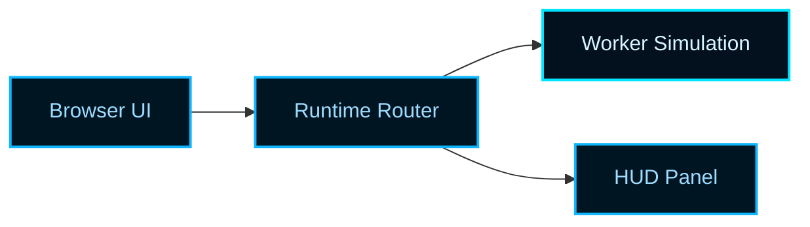

# Astro Bird Visual Style Guide

Use this guide when documentation needs a consistent visual language across
Markdown, Mermaid diagrams, doc-site callouts, and teaching-oriented visual
artifacts.

The target look is Astro Bird's neon-retro-arcade theme: dark space-like
backgrounds, electric blue structural lines, bright cyan accents, and selective
warm highlights for the most important information.

## Visual Direction

The visual system should feel like a readable control console, not a noisy game
poster.

- Use deep navy or near-black backgrounds as the canvas.
- Use cyan and electric blue for primary structure, borders, connectors, and
  diagram lines.
- Use a small number of warm neon accents to highlight only the most important
  state, node, path, or warning.
- Keep the presentation clean enough that readers can still scan it like
  technical documentation.

## Canonical Palette

Anchor the look to the Astro Bird constants in
`examples/flappy_bird/constants/constants.palette.ts`.

Primary colors:

- Background: `#060b14`
- Panel background: `#000000`
- Primary structure line: `#0fb5ff`
- Secondary structure line: `#0a8ea0`
- Primary cool accent: `#00e5ff`
- Supporting cool text: `#9fdcff`

Highlight colors:

- Success or active emphasis: `#00ff66`
- Warm alert or standout accent: `#ff9a2e`
- Key status or featured contrast accent: `#ff5cff`
- Hero highlight: `#ff4a8d`
- Neutral bright ring or edge: `#ffffff`

## Color Roles

Use the palette by role, not by whim.

- Backgrounds: `#060b14` or `#000000`
- Borders and container lines: `#0fb5ff`
- Diagram edges and flow arrows: `#0fb5ff` or `#00e5ff`
- Section labels and supporting text on dark surfaces: `#9fdcff`
- Active or healthy path emphasis: `#00ff66`
- Priority callouts and warnings: `#ff9a2e`
- Special spotlight components: `#ff5cff` or `#ff4a8d`

Do not let every category become a different neon color. The baseline should be
blue-driven, with accents used sparingly.

## Contrast Rules

Usability comes before mood.

- Keep body text and important diagram labels at high contrast against the dark
  background.
- Prefer `#9fdcff`, `#d8ffe9`, or `#ffffff` for small text on very dark panels.
- Do not place warm accent text on similarly bright glow fills.
- Avoid large blocks of saturated cyan text; use cyan for structure and short
  labels, not long reading passages.
- If a diagram becomes harder to read because of the palette, reduce styling
  before reducing legibility.

As a practical rule, the default state should be readable even if all glow
effects are removed.

## Glow Rules

Glow is a highlighting tool, not a base layer.

- Use subtle glow on key nodes, champion paths, current focus regions, or the
  single most important subsystem in a diagram.
- Keep structural lines crisp first, then add a glow treatment only if the
  result remains easy to read.
- Prefer one glow color per visual rather than multiple competing glows.
- Use warm glow sparingly so it feels intentional.
- If a glow makes nearby labels harder to parse, remove or weaken it.

Good uses:

- the active runtime boundary,
- the critical data path,
- the champion or leader component,
- the one decision branch the prose is discussing.

Poor uses:

- every edge,
- every node,
- large paragraphs,
- entire tables.

## Mermaid Styling Defaults

When Mermaid styling is supported, prefer a blue-led dark theme.

- Default node fill: `#001522`
- Default node stroke: `#0fb5ff`
- Default label color: `#9fdcff`
- Default line color: `#00e5ff`
- Highlight node fill: `#1a0930` or `#2a1029`
- Highlight node stroke: `#ff5cff` or `#ff4a8d`
- Success path accent: `#00ff66`
- Warning path accent: `#ff9a2e`

If the renderer allows custom classes, keep the class set small and semantic:

- `boundary`
- `runtime`
- `highlight`
- `warning`
- `success`

## Example Mermaid Styling Pattern

Add interpretation in prose if the highlight color means something special.

## Tables And Callouts

For Markdown tables and prose callouts in docs surfaces:

- keep the table content plain and readable first,
- use adjacent prose to describe the key highlight,
- use accent-colored badges or callout labels only when the doc surface truly
  supports them,
- preserve the same blue-led base across sections so the documentation feels
  coherent.

## Anti-Patterns

- Purple-dominant visuals that drift away from Astro Bird's blue-led look.
- Heavy gradients that make text hard to read.
- Glow used as a substitute for hierarchy.
- Bright saturated fills behind dense labels.
- Using all accent colors equally, which removes emphasis.

## Working Rule

If a reader remembers the diagram as "bright and arcade-like" but cannot quickly
identify the main path, the styling failed. The target is readable neon, not
neon noise.
