# NeatapticTS Flow Catalog

A comprehensive catalog of all named execution flows in the NeatapticTS agentic workflow system. Each flow represents a repeatable, gate-validated execution path through the numbered SDLC agent hierarchy.

## Overview

Flows are selected by Tier 1 orchestrators (`00-helping` through `07-logging`) based on task shape. Every flow declares:

- **Exit gates** that must return `{pass, evidence, fixHint, owner}` JSON before completion
- **Post-phase fanout** specifying which agents run after the flow body completes
- **Specialist delegations** to Tier 2–4 agents for substantive work
- **Skills** that provide durable policy knowledge

```mermaid
flowchart TD
    subgraph Phase_00["Phase 00 — Helping & Escalation"]
        A00A["00.workflow-gap-audit"]
        A00B["00.diagnose-blocker"]
        A00C["00.cross-tier-helper"]
    end

    subgraph Phase_01["Phase 01 — Planning"]
        A01A["01.acceptance-criteria"]
        A01B["01.blocker-routing"]
        A01C["01.phase-kickoff"]
        A01D["01.plan-registration"]
        A01E["01.step-packet-revision"]
    end

    subgraph Phase_02["Phase 02 — Research"]
        A02A["02.codebase-recon"]
        A02B["02.integration-surface-map"]
        A02C["02.mcp-snapshot-first"]
        A02D["02.prior-art-scan"]
    end

    subgraph Phase_03["Phase 03 — Red Testing"]
        A03A["03.behavior-change-red"]
        A03B["03.coverage-gap-red"]
        A03C["03.gate-schema-red"]
        A03D["03.regression-capture-red"]
    end

    subgraph Phase_04["Phase 04 — Implementation"]
        A04A["04.coverage-repair"]
        A04B["04.refactor"]
        A04C["04.scoped-fix"]
    end

    subgraph Phase_05["Phase 05 — Green Validation"]
        A05A["05.ci-green-confirmation"]
        A05B["05.coverage-guard"]
        A05C["05.regression-fix-validation"]
        A05D["05.test-triage"]
    end

    subgraph Phase_06["Phase 06 — Documentation"]
        A06A["06.docs-audit"]
        A06B["06.example-publication"]
        A06C["06.jsdoc-update"]
        A06D["06.readme-refresh"]
    end

    subgraph Phase_07["Phase 07 — Logging"]
        A07A["07.learning-event-log"]
        A07B["07.session-summary"]
        A07C["07.tracker-closure"]
    end

    A00C --> A01B
    A01A --> A03A
    A01C --> A02A
    A02A --> A04B
    A03A --> A04C
    A04C --> A05D
    A05D --> A04C
    A05A --> A07A
    A06D --> A07B

    style Phase_00 fill:#1a1a2e,stroke:#00d9ff,stroke-width:2px,color:#e0e0e0
    style Phase_01 fill:#1a1a2e,stroke:#00d9ff,stroke-width:2px,color:#e0e0e0
    style Phase_02 fill:#1a1a2e,stroke:#00d9ff,stroke-width:2px,color:#e0e0e0
    style Phase_03 fill:#1a1a2e,stroke:#00d9ff,stroke-width:2px,color:#e0e0e0
    style Phase_04 fill:#1a1a2e,stroke:#00d9ff,stroke-width:2px,color:#e0e0e0
    style Phase_05 fill:#1a1a2e,stroke:#00d9ff,stroke-width:2px,color:#e0e0e0
    style Phase_06 fill:#1a1a2e,stroke:#00d9ff,stroke-width:2px,color:#e0e0e0
    style Phase_07 fill:#1a1a2e,stroke:#00d9ff,stroke-width:2px,color:#e0e0e0
    style A00A fill:#0f3460,stroke:#00d9ff,color:#e0e0e0
    style A00B fill:#0f3460,stroke:#00d9ff,color:#e0e0e0
    style A00C fill:#0f3460,stroke:#00d9ff,color:#e0e0e0
    style A01A fill:#0f3460,stroke:#00d9ff,color:#e0e0e0
    style A01B fill:#0f3460,stroke:#00d9ff,color:#e0e0e0
    style A01C fill:#0f3460,stroke:#00d9ff,color:#e0e0e0
    style A01D fill:#0f3460,stroke:#00d9ff,color:#e0e0e0
    style A01E fill:#0f3460,stroke:#00d9ff,color:#e0e0e0
    style A02A fill:#0f3460,stroke:#00d9ff,color:#e0e0e0
    style A02B fill:#0f3460,stroke:#00d9ff,color:#e0e0e0
    style A02C fill:#0f3460,stroke:#00d9ff,color:#e0e0e0
    style A02D fill:#0f3460,stroke:#00d9ff,color:#e0e0e0
    style A03A fill:#0f3460,stroke:#00d9ff,color:#e0e0e0
    style A03B fill:#0f3460,stroke:#00d9ff,color:#e0e0e0
    style A03C fill:#0f3460,stroke:#00d9ff,color:#e0e0e0
    style A03D fill:#0f3460,stroke:#00d9ff,color:#e0e0e0
    style A04A fill:#0f3460,stroke:#00d9ff,color:#e0e0e0
    style A04B fill:#0f3460,stroke:#00d9ff,color:#e0e0e0
    style A04C fill:#0f3460,stroke:#00d9ff,color:#e0e0e0
    style A05A fill:#0f3460,stroke:#00d9ff,color:#e0e0e0
    style A05B fill:#0f3460,stroke:#00d9ff,color:#e0e0e0
    style A05C fill:#0f3460,stroke:#00d9ff,color:#e0e0e0
    style A05D fill:#0f3460,stroke:#00d9ff,color:#e0e0e0
    style A06A fill:#0f3460,stroke:#00d9ff,color:#e0e0e0
    style A06B fill:#0f3460,stroke:#00d9ff,color:#e0e0e0
    style A06C fill:#0f3460,stroke:#00d9ff,color:#e0e0e0
    style A06D fill:#0f3460,stroke:#00d9ff,color:#e0e0e0
    style A07A fill:#0f3460,stroke:#00d9ff,color:#e0e0e0
    style A07B fill:#0f3460,stroke:#00d9ff,color:#e0e0e0
    style A07C fill:#0f3460,stroke:#00d9ff,color:#e0e0e0
```



**External Reference:** This flow system implements agent orchestration patterns described in [GitHub Actions workflow design](https://docs.github.com/en/actions) and [multi-agent coordination research](https://arxiv.org/abs/2308.08155) on hierarchical task delegation.

---

## Phase 00 — Helping & Escalation

Flows owned by `00-helping` for workflow gap resolution, blocker diagnosis, and cross-tier escalation.

### 00.workflow-gap-audit

**Flow ID:** `00.workflow-gap-audit`  
**Name:** Workflow Gap Audit and Learning Event Capture  
**Owner Agent:** `00-helping`

#### Trigger Conditions

Select this flow when:

- Learning-event analytics pass is requested
- Multiple gate exceptions observed across recent sessions
- Agent or flow selection drift identified
- Periodic maintenance audit of the agentic workflow surface is needed

#### Specialist Delegations

| Tier | Specialist                           |
| ---- | ------------------------------------ |
| 3    | `Skill Inventory Auditor`            |
| 3    | `Plan Scout`                         |

#### Gate Contracts

| Gate ID          | Purpose                                   |
| ---------------- | ----------------------------------------- |
| `plan-sync`      | Confirms plan tracker alignment           |
| `learning-event` | Validates learning event was recorded     |
| `agent-graph`    | Verifies agent delegation graph integrity |

#### Post-Phase Fanout

- `learning-event-capturer`
- `01-planning`

#### Example Task Shapes

```text
"Run a learning-event analytics pass to capture recent gate failures."
"Multiple agents failed gates this session — audit for workflow gaps."
"Agent selection drift detected — review and propose fixes."
```

---

### 00.diagnose-blocker

**Flow ID:** `00.diagnose-blocker`  
**Name:** Diagnose and Route a Workflow Blocker  
**Owner Agent:** `00-helping`

#### Trigger Conditions

Select this flow when:

- `TASK_STATUS: FAILED` or `PARTIAL` with a recorded `BLOCKER`
- Cross-tier helper call is needed
- Unknown gate failure requires root-cause triage
- Model-routing or frontmatter conflict discovered during implementation
- Workflow gap identified that no existing skill covers

#### Specialist Delegations

| Tier | Specialist                              |
| ---- | --------------------------------------- |
| 2    | `helping-agent-maintenance-coordinator` |
| 3    | `Plan Scout`                            |

#### Gate Contracts

| Gate ID          | Purpose                               |
| ---------------- | ------------------------------------- |
| `plan-sync`      | Confirms plan tracker alignment       |
| `learning-event` | Validates learning event was recorded |

#### Post-Phase Fanout

- `learning-event-capturer`
- `<smallest-relevant-numbered-agent>` (determined by blocker type)

#### Example Task Shapes

```text
"Implementation step blocked by MCP tool failure — diagnose root cause."
"Gate failure with no viable forward path — escalate to 00-helping."
"Model routing conflict in agent frontmatter — resolve or route."
```

---

### 00.cross-tier-helper

**Flow ID:** `00.cross-tier-helper`  
**Name:** Cross-Tier Helper Call from Any Numbered Agent  
**Owner Agent:** `00-helping`

#### Trigger Conditions

Select this flow when:

- Numbered agent (01–07) emits `SUGGESTED_NEXT_AGENT: 00-helping`
- Gate failure with no viable forward path triggers escalation
- Agent cannot resolve a model-routing, frontmatter, or skill-gap blocker
- Cross-tier helper call explicitly named in a step packet or fan-out list
- Agent system gap requires a fix outside the requesting agent's scope

#### Specialist Delegations

| Tier | Specialist                              |
| ---- | --------------------------------------- |
| 2    | `helping-agent-maintenance-coordinator` |

#### Gate Contracts

| Gate ID                      | Purpose                               |
| ---------------------------- | ------------------------------------- |
| `plan-sync`                  | Confirms plan tracker alignment       |
| `output-resolution-evidence` | Validates blocker resolution evidence |

#### Post-Phase Fanout

- `<requesting-numbered-agent>` (returns control to caller)
- `learning-event-capturer`

#### Example Task Shapes

```text
"04-implementing cannot resolve a frontmatter conflict — call cross-tier helper."
"02-researching hit an MCP availability gap — escalate to 00-helping."
"Skill gap discovered that blocks the active step — file and route."
```

---

## Phase 01 — Planning

Flows owned by `01-planning` for acceptance criteria, blocker routing, phase kickoff, plan registration, and step packet revision.

### 01.acceptance-criteria

**Flow ID:** `01.acceptance-criteria`  
**Name:** Acceptance Criteria and Risk Envelope  
**Owner Agent:** `01-planning`

#### Trigger Conditions

Select this flow when:

- User request is ambiguous or acceptance criteria are missing
- Acceptance criteria needed before `03-red-testing` begins
- New feature or refactor lacks a done-state definition
- Step packet is missing observable success conditions

#### Specialist Delegations

| Tier | Specialist                           |
| ---- | ------------------------------------ |
| 2    | `planning-risk-coordinator`          |
| 4    | `acceptance-criteria-writer`         |
| 3    | `Plan Scout`                         |

#### Gate Contracts

| Gate ID                    | Purpose                         |
| -------------------------- | ------------------------------- |
| `plan-sync`                | Confirms plan tracker alignment |
| `step-packet`              | Validates step packet structure |
| `planning-output-contract` | Verifies planning output shape  |

#### Post-Phase Fanout

- `03-red-testing`

#### Example Task Shapes

```text
"Define acceptance criteria for a new caching subsystem before test authoring."
"User request is ambiguous — produce observable success conditions."
"New refactor needs edge cases and non-goals documented."
```

---

### 01.blocker-routing

**Flow ID:** `01.blocker-routing`  
**Name:** Blocker Triage and Routing  
**Owner Agent:** `01-planning`

#### Trigger Conditions

Select this flow when:

- Blocker recorded in active step with no clear next action
- `TASK_STATUS: PARTIAL` or `FAILED` in the previous agent output
- Gate failure with no viable forward path triggers `00-helping` escalation
- User asks to triage or unblock a stalled plan step

#### Specialist Delegations

| Tier | Specialist                           |
| ---- | ------------------------------------ |
| 3    | `Plan Scout`                         |
| 2    | `planning-risk-coordinator`          |

#### Gate Contracts

| Gate ID                    | Purpose                         |
| -------------------------- | ------------------------------- |
| `plan-sync`                | Confirms plan tracker alignment |
| `planning-output-contract` | Verifies planning output shape  |

#### Post-Phase Fanout

- `00-helping` (for cross-tier blockers)
- `<smallest-relevant-numbered-agent>` (for scoped blockers)

#### Example Task Shapes

```text
"Active step blocked by missing MCP tool — route to appropriate agent."
"Previous agent returned PARTIAL — determine next action."
"User reports stalled plan — triage and assign owner."
```

---

### 01.phase-kickoff

**Flow ID:** `01.phase-kickoff`  
**Name:** Phase Kickoff and Step Packet Authoring  
**Owner Agent:** `01-planning`

#### Trigger Conditions

Select this flow when:

- New phase objective approved and plan has no step packets yet
- Phase transition needed after previous phase marked `[DONE]`
- User asks `01-planning` to start a new migration phase
- Plan tracker has a `NEXT:` item pointing to a new phase start

#### Specialist Delegations

| Tier | Specialist                           |
| ---- | ------------------------------------ |
| 3    | `Plan Scout`                         |
| 2    | `planning-risk-coordinator`          |
| 3    | `Plan Registration Auditor`          |

#### Gate Contracts

| Gate ID                    | Purpose                                 |
| -------------------------- | --------------------------------------- |
| `plan-sync`                | Confirms plan tracker alignment         |
| `step-packet`              | Validates step packet structure         |
| `planning-output-contract` | Verifies planning output shape          |
| `phase-compression`        | Confirms prior phase history compressed |

#### Post-Phase Fanout

- `02-researching`
- `04-implementing`

#### Example Task Shapes

```text
"Start Phase 4 implementation — author step packets for all SDLC agents."
"Previous phase complete — transition to next phase objective."
"New migration workstream needs step packets from planning through logging."
```

---

### 01.plan-registration

**Flow ID:** `01.plan-registration`  
**Name:** New Plan Registration and Sync  
**Owner Agent:** `01-planning`

#### Trigger Conditions

Select this flow when:

- New plan file created but not yet registered in `README` or `Roadmap`
- `plan-sync` gate fails because plan is missing from `plans/README.md`
- User asks `01-planning` to register a new workstream plan
- Roadmap entry is stale or plan status marker is inconsistent

#### Specialist Delegations

| Tier | Specialist                  |
| ---- | --------------------------- |
| 3    | `Plan Registration Auditor` |
| 3    | `Plan Scout`                |

#### Gate Contracts

| Gate ID                    | Purpose                         |
| -------------------------- | ------------------------------- |
| `plan-sync`                | Confirms plan tracker alignment |
| `planning-output-contract` | Verifies planning output shape  |

#### Post-Phase Fanout

- `02-researching`

#### Example Task Shapes

```text
"New plan file created — register in plans/README.md and Roadmap.md."
"Plan-sync gate failed — add missing plan to tracker."
"Roadmap status marker inconsistent — sync with plan file."
```

---

### 01.step-packet-revision

**Flow ID:** `01.step-packet-revision`  
**Name:** Step Packet Revision  
**Owner Agent:** `01-planning`

#### Trigger Conditions

Select this flow when:

- Active step blocked or scope changed mid-phase
- Step packet is missing required fields or stop conditions
- User asks to revise or unblock the current active step
- Blocker routed back from `00-helping` with revised scope

#### Specialist Delegations

| Tier | Specialist                           |
| ---- | ------------------------------------ |
| 3    | `Plan Scout`                         |

#### Gate Contracts

| Gate ID                    | Purpose                         |
| -------------------------- | ------------------------------- |
| `plan-sync`                | Confirms plan tracker alignment |
| `step-packet`              | Validates step packet structure |
| `planning-output-contract` | Verifies planning output shape  |

#### Post-Phase Fanout

- `<next-active-step-agent>` (determined by revised packet)

#### Example Task Shapes

```text
"Scope changed mid-phase — revise active step packet."
"Step packet missing stop conditions — update and re-validate."
"Blocker resolved with revised scope — update packet accordingly."
```

---

## Phase 02 — Research

Flows owned by `02-researching` for codebase reconnaissance, integration surface mapping, MCP snapshot pulls, and prior art scans.

### 02.codebase-recon

**Flow ID:** `02.codebase-recon`  
**Name:** Source Boundary Reconnaissance  
**Owner Agent:** `02-researching`

#### Trigger Conditions

Select this flow when:

- Implementation step needs module map, existing utilities, or API surface
- `04-implementing` requests a read-only recon before editing
- Refactor or split requires seam identification
- New subsystem needs neighbor-module contract mapping

#### Specialist Delegations

| Tier | Specialist                      |
| ---- | ------------------------------- |
| 3    | `Boundary Mapper`               |
| 3    | `implementation-pattern-scout`  |
| 2    | `research-codebase-coordinator` |

#### Gate Contracts

| Gate ID                      | Purpose                                    |
| ---------------------------- | ------------------------------------------ |
| `plan-sync`                  | Confirms plan tracker alignment            |
| `research-findings-evidence` | Validates research findings are documented |

#### Post-Phase Fanout

- `04-implementing`

#### Example Task Shapes

```text
"Map module boundaries before implementing a new caching layer."
"Refactor needs seam identification — find existing utilities first."
"New subsystem needs to know neighbor contracts — recon boundaries."
```

---

### 02.integration-surface-map

**Flow ID:** `02.integration-surface-map`  
**Name:** Integration Surface Mapping  
**Owner Agent:** `02-researching`

#### Trigger Conditions

Select this flow when:

- New artifact needs landing zones, extension points, or frontmatter targets
- Phase plan asks: "where should this file go?"
- MCP server extension requires registration path discovery
- New gate, flow, or skill needs a home under `scripts/` or `.github/`

#### Specialist Delegations

| Tier | Specialist                      |
| ---- | ------------------------------- |
| 3    | `Boundary Mapper`               |
| 3    | `MCP Runtime Scout`             |
| 2    | `research-codebase-coordinator` |

#### Gate Contracts

| Gate ID                      | Purpose                                    |
| ---------------------------- | ------------------------------------------ |
| `plan-sync`                  | Confirms plan tracker alignment            |
| `research-findings-evidence` | Validates research findings are documented |

#### Post-Phase Fanout

- `03-red-testing`
- `04-implementing`

#### Example Task Shapes

```text
"New gate script needs a home — map integration surfaces."
"MCP server extension requires registration path — find landing zone."
"Where should this new skill file go? — map extension points."
```

---

### 02.mcp-snapshot-first

**Flow ID:** `02.mcp-snapshot-first`  
**Name:** MCP Workflow Snapshot Pull  
**Owner Agent:** `02-researching`

#### Trigger Conditions

Select this flow when:

- Fresh plan state or customization inventory needed before codebase search
- Agent needs to know which step is active before starting research
- Customization drift check required at the start of a phase
- MCP resources can answer the research question without a file scan

#### Specialist Delegations

| Tier | Specialist          |
| ---- | ------------------- |
| 3    | `Plan Scout`        |
| 3    | `MCP Runtime Scout` |

#### Gate Contracts

| Gate ID                      | Purpose                                    |
| ---------------------------- | ------------------------------------------ |
| `plan-sync`                  | Confirms plan tracker alignment            |
| `research-findings-evidence` | Validates research findings are documented |

#### Post-Phase Fanout

- `03-red-testing`
- `04-implementing`

#### Example Task Shapes

```text
"Pull fresh plan state before research — use MCP snapshot first."
"Which step is active? — query workflow snapshot."
"Check customization drift at phase start — use MCP inventory."
```

---

### 02.prior-art-scan

**Flow ID:** `02.prior-art-scan`  
**Name:** Prior Art and Dependency Scan  
**Owner Agent:** `02-researching`

#### Trigger Conditions

Select this flow when:

- Feature or refactor may duplicate existing helpers
- New module depends on third-party contracts that need verification
- Implementation step asks: "does this already exist?"
- Naming collision suspected before adding a new export

#### Specialist Delegations

| Tier | Specialist                      |
| ---- | ------------------------------- |
| 3    | `implementation-pattern-scout`  |
| 2    | `research-codebase-coordinator` |
| 3    | `Boundary Mapper`               |

#### Gate Contracts

| Gate ID                      | Purpose                                    |
| ---------------------------- | ------------------------------------------ |
| `plan-sync`                  | Confirms plan tracker alignment            |
| `research-findings-evidence` | Validates research findings are documented |

#### Post-Phase Fanout

- `04-implementing`

#### Example Task Shapes

```text
"Does this utility already exist? — scan for prior art."
"New export may collide — check existing symbols."
"Third-party dependency constraints — verify before implementation."
```

---

## Phase 03 — Red Testing

Flows owned by `03-red-testing` for behavior change red contracts, coverage gap red contracts, gate schema red contracts, and regression capture.

### 03.behavior-change-red

**Flow ID:** `03.behavior-change-red`  
**Name:** Behavior Change Red Contract  
**Owner Agent:** `03-red-testing`

#### Trigger Conditions

Select this flow when:

- Planned feature or fix will change observable behavior and no failing test exists yet
- `01-planning` acceptance-criteria output is ready for red-test authoring
- TDD sequence: acceptance criteria exist; red contract needed before `04-implementing`
- Regression fix requires a test that reproduces the broken behavior

#### Specialist Delegations

| Tier | Specialist                           |
| ---- | ------------------------------------ |
| 4    | `unit-test-writer`                   |
| 4    | `acceptance-criteria-writer`         |

#### Gate Contracts

| Gate ID                 | Purpose                         |
| ----------------------- | ------------------------------- |
| `plan-sync`             | Confirms plan tracker alignment |
| `red-test-confirmation` | Validates test is failing (red) |

#### Post-Phase Fanout

- `04-implementing`

#### Example Task Shapes

```text
"New feature needs a failing test first — author red contract."
"Acceptance criteria ready — write the smallest failing test."
"Regression fix needs a reproducing test — capture failure first."
```

---

### 03.coverage-gap-red

**Flow ID:** `03.coverage-gap-red`  
**Name:** Coverage Gap Red Contract  
**Owner Agent:** `03-red-testing`

#### Trigger Conditions

Select this flow when:

- `lcov` shows uncovered branch or line in a `src/` file just touched
- Coverage Guard reports a gap after an implementation step
- 100% coverage requirement is not met on a recently changed boundary
- Tranche expansion step: uncovered path needs a red test before a fix

#### Specialist Delegations

| Tier | Specialist         |
| ---- | ------------------ |
| 4    | `unit-test-writer` |
| 3    | `Coverage Scout`   |

#### Gate Contracts

| Gate ID                 | Purpose                         |
| ----------------------- | ------------------------------- |
| `plan-sync`             | Confirms plan tracker alignment |
| `red-test-confirmation` | Validates test is failing (red) |

#### Post-Phase Fanout

- `04-implementing`

#### Example Task Shapes

```text
"Coverage gap found in touched file — author red test for uncovered path."
"100% coverage not met — write test for missing branch."
"Tranche expansion needs red test first — capture gap."
```

---

### 03.gate-schema-red

**Flow ID:** `03.gate-schema-red`  
**Name:** Gate or Schema Contract Red  
**Owner Agent:** `03-red-testing`

#### Trigger Conditions

Select this flow when:

- New gate script or validation rule planned; failing test must precede implementation
- Phase plan defines a gate contract that has no test coverage yet
- MCP tool output shape needs a failing contract test before implementation
- Schema field added to `flow.schema.yml` requires a contract test

#### Specialist Delegations

| Tier | Specialist                   |
| ---- | ---------------------------- |
| 4    | `unit-test-writer`           |
| 4    | `acceptance-criteria-writer` |

#### Gate Contracts

| Gate ID                 | Purpose                         |
| ----------------------- | ------------------------------- |
| `plan-sync`             | Confirms plan tracker alignment |
| `red-test-confirmation` | Validates test is failing (red) |

#### Post-Phase Fanout

- `04-implementing`

#### Example Task Shapes

```text
"New gate script needs failing contract tests — author red tests first."
"MCP tool output shape undefined — write contract test."
"Schema field added — needs a failing test before implementation."
```

---

### 03.regression-capture-red

**Flow ID:** `03.regression-capture-red`  
**Name:** Regression Capture  
**Owner Agent:** `03-red-testing`

#### Trigger Conditions

Select this flow when:

- Bug reported in an issue or by the user with no reproducing test
- CI failure in a recently merged change without a targeted test
- Regression introduced by a refactor that broke an implicit invariant
- Existing test suite is green but observable behavior is wrong

#### Specialist Delegations

| Tier | Specialist                  |
| ---- | --------------------------- |
| 4    | `unit-test-writer`          |

#### Gate Contracts

| Gate ID                 | Purpose                         |
| ----------------------- | ------------------------------- |
| `plan-sync`             | Confirms plan tracker alignment |
| `red-test-confirmation` | Validates test is failing (red) |

#### Post-Phase Fanout

- `04-implementing`

#### Example Task Shapes

```text
"Bug reported with no test — capture regression first."
"CI failure without targeted test — write reproducing test."
"Observable behavior wrong despite green suite — capture regression."
```

---

## Phase 04 — Implementation

Flows owned by `04-implementing` for coverage repair, SOLID-bounded module refactors, and scoped bug or regression fixes.

```mermaid
flowchart LR
    subgraph Input["Implementation Input"]
        A[Red Test or Coverage Gap]
    end

    subgraph Decision{"Task Type?"}
        B{Coverage Gap?}
        C{Refactor?}
        D{Bug Fix?}
    end

    subgraph Flows["Phase 04 Flows"]
        E["04.coverage-repair"]
        F["04.refactor"]
        G["04.scoped-fix"]
    end

    subgraph Output["Implementation Output"]
        H[Coverage Guard Pass]
        I[Green Validation]
    end

    A --> B
    B -->|Yes| E
    B -->|No| C
    C -->|Yes| F
    C -->|No| D
    D -->|Yes| G
    E --> H
    F --> I
    G --> I

    style Input fill:#1a1a2e,stroke:#00d9ff,color:#e0e0e0
    style Decision fill:#1a1a2e,stroke:#00d9ff,color:#e0e0e0
    style Flows fill:#1a1a2e,stroke:#00d9ff,color:#e0e0e0
    style Output fill:#1a1a2e,stroke:#00d9ff,color:#e0e0e0
    style A fill:#0f3460,stroke:#00d9ff,color:#e0e0e0
    style B fill:#0f3460,stroke:#00d9ff,color:#e0e0e0
    style C fill:#0f3460,stroke:#00d9ff,color:#e0e0e0
    style D fill:#0f3460,stroke:#00d9ff,color:#e0e0e0
    style E fill:#0f3460,stroke:#00d9ff,color:#e0e0e0
    style F fill:#0f3460,stroke:#00d9ff,color:#e0e0e0
    style G fill:#0f3460,stroke:#00d9ff,color:#e0e0e0
    style H fill:#0f3460,stroke:#00d9ff,color:#e0e0e0
    style I fill:#0f3460,stroke:#00d9ff,color:#e0e0e0
```

### 04.coverage-repair

**Flow ID:** `04.coverage-repair`  
**Name:** Coverage Tranche Expansion  
**Owner Agent:** `04-implementing`

#### Trigger Conditions

Select this flow when:

- Coverage below 100% on a `src/` file
- Coverage tranche needed for a touched boundary
- Uncovered branch or function detected after implementation
- Coverage guard reports a gap after a code change

#### Specialist Delegations

| Tier | Specialist              |
| ---- | ----------------------- |
| 3    | `Coverage Scout`        |
| 3    | `Coverage Guard`        |
| 4    | `unit-test-writer`      |
| 3    | `test-coverage-analyst` |

#### Gate Contracts

| Gate ID          | Purpose                                   |
| ---------------- | ----------------------------------------- |
| `plan-sync`      | Confirms plan tracker alignment           |
| `agent-graph`    | Verifies agent delegation graph integrity |
| `learning-event` | Validates learning event was recorded     |

#### Post-Phase Fanout

- `coverage-guard`

#### Example Task Shapes

```text
"Coverage at 96% on touched file — expand tranche to 100%."
"Uncovered branch detected — add test and implement."
"Coverage guard reported gap — repair before handoff."
```

---

### 04.refactor

**Flow ID:** `04.refactor`  
**Name:** SOLID-Bounded Module Refactor  
**Owner Agent:** `04-implementing`

#### Trigger Conditions

Select this flow when:

- Refactor a large module
- SOLID split requested
- Folderize a file into a module boundary
- Implement a declared split plan step

#### Specialist Delegations

| Tier | Specialist                           |
| ---- | ------------------------------------ |
| 3    | `Boundary Mapper`                    |
| 3    | `Coverage Guard`                     |
| 2    | `implementation-pattern-coordinator` |
| 2    | `implementation-executor`            |

#### Gate Contracts

| Gate ID       | Purpose                                   |
| ------------- | ----------------------------------------- |
| `plan-sync`   | Confirms plan tracker alignment           |
| `step-packet` | Validates step packet structure           |
| `agent-graph` | Verifies agent delegation graph integrity |

#### Post-Phase Fanout

- `05-green-testing`

#### Example Task Shapes

```text
"Large module needs SOLID split — refactor into boundaries."
"Folderize a monolithic file — create module structure."
"Declared split plan step ready — implement the refactor."
```

---

### 04.scoped-fix

**Flow ID:** `04.scoped-fix`  
**Name:** Scoped Bug or Regression Fix  
**Owner Agent:** `04-implementing`

#### Trigger Conditions

Select this flow when:

- Fix a failing test
- Regression reported in CI
- Bug fix in a scoped `src/` boundary
- Red test from a previous `03-red-testing` step must be made green

#### Specialist Delegations

| Tier | Specialist                     |
| ---- | ------------------------------ |
| 3    | `Coverage Guard`               |
| 3    | `implementation-pattern-scout` |
| 2    | `implementation-executor`      |

#### Gate Contracts

| Gate ID          | Purpose                                   |
| ---------------- | ----------------------------------------- |
| `plan-sync`      | Confirms plan tracker alignment           |
| `agent-graph`    | Verifies agent delegation graph integrity |
| `learning-event` | Validates learning event was recorded     |

#### Post-Phase Fanout

- `05-green-testing`
- `coverage-guard`

#### Example Task Shapes

```text
"Red test from 03-red-testing needs implementation — make it green."
"CI regression reported — implement minimal fix."
"Scoped bug in src/cache — fix and validate coverage."
```

---

## Phase 05 — Green Validation

Flows owned by `05-green-testing` for CI green confirmation, coverage guard confirmation, regression fix validation, and test failure triage.

### 05.ci-green-confirmation

**Flow ID:** `05.ci-green-confirmation`  
**Name:** CI Baseline Green Confirmation  
**Owner Agent:** `05-green-testing`

#### Trigger Conditions

Select this flow when:

- Phase implementation is complete and full suite green confirmation is required
- All implementation steps in a phase are marked done; need CI sign-off before logging
- Multiple sub-steps completed; CI baseline has not been checked since last `src/` change
- Phase advancement requires validated green evidence in the plan

#### Specialist Delegations

| Tier | Specialist                              |
| ---- | --------------------------------------- |
| 2    | `green-test-failure-triage-coordinator` |

#### Gate Contracts

| Gate ID                     | Purpose                         |
| --------------------------- | ------------------------------- |
| `plan-sync`                 | Confirms plan tracker alignment |
| `step-packet`               | Validates step packet structure |
| `green-validation-evidence` | Validates green test evidence   |

#### Post-Phase Fanout

- `07-logging`

#### Example Task Shapes

```text
"Phase implementation complete — confirm full suite green."
"CI sign-off needed before logging — run all validators."
"Multiple steps done — verify CI baseline before advance."
```

---

### 05.coverage-guard

**Flow ID:** `05.coverage-guard`  
**Name:** Coverage Guard Confirmation  
**Owner Agent:** `05-green-testing`

#### Trigger Conditions

Select this flow when:

- Any `src/` file was touched in the current phase
- Coverage verification required before marking an implementation step done
- `04-implementing` returns with `FILES_CHANGED` containing `src/` paths
- Coverage tranche step completed; full 100% confirmation required

#### Specialist Delegations

| Tier | Specialist              |
| ---- | ----------------------- |
| 3    | `Coverage Guard`        |
| 3    | `Coverage Scout`        |
| 3    | `test-coverage-analyst` |

#### Gate Contracts

| Gate ID                     | Purpose                         |
| --------------------------- | ------------------------------- |
| `plan-sync`                 | Confirms plan tracker alignment |
| `green-validation-evidence` | Validates green test evidence   |

#### Post-Phase Fanout

- `07-logging`

#### Example Task Shapes

```text
"src/ file touched — confirm 100% coverage before marking done."
"Coverage tranche complete — run full guard confirmation."
"Implementation returned with src/ changes — verify coverage."
```

---

### 05.regression-fix-validation

**Flow ID:** `05.regression-fix-validation`  
**Name:** Regression Fix Validation  
**Owner Agent:** `05-green-testing`

#### Trigger Conditions

Select this flow when:

- Regression introduced in a previous phase; fix has been implemented
- `04-implementing` returns with a regression repair; targeted validation needed
- Specific failing test path identified; focused slice validation preferred over full suite
- Regression fix must be confirmed green before the phase log can be written

#### Specialist Delegations

| Tier | Specialist                      |
| ---- | ------------------------------- |
| 3    | `performance-trace-specialist`  |
| 3    | `browser-ui-specialist`         |
| 3    | `browser-memory-specialist`     |

#### Gate Contracts

| Gate ID                     | Purpose                         |
| --------------------------- | ------------------------------- |
| `plan-sync`                 | Confirms plan tracker alignment |
| `green-validation-evidence` | Validates green test evidence   |

#### Post-Phase Fanout

- `07-logging`

#### Example Task Shapes

```text
"Regression fix implemented — validate with targeted test slice."
"04-implementing returned repair — confirm green before logging."
"Focused validation needed — run specific test path."
```

---

### 05.test-triage

**Flow ID:** `05.test-triage`  
**Name:** Test Failure Triage  
**Owner Agent:** `05-green-testing`

#### Trigger Conditions

Select this flow when:

- Implementation step completed and one or more tests are failing
- CI reports a failing suite after a merge or code change
- Test failure ownership is unclear after `04-implementing` returns
- Multiple test failures need a triage pass before repair routing

#### Specialist Delegations

| Tier | Specialist                              |
| ---- | --------------------------------------- |
| 2    | `green-test-failure-triage-coordinator` |
| 3    | `test-coverage-analyst`                 |

#### Gate Contracts

| Gate ID                     | Purpose                         |
| --------------------------- | ------------------------------- |
| `plan-sync`                 | Confirms plan tracker alignment |
| `green-validation-evidence` | Validates green test evidence   |

#### Post-Phase Fanout

- `04-implementing` (for repair routing)

#### Example Task Shapes

```text
"Implementation complete but tests failing — triage ownership."
"CI failure after merge — determine repair owner."
"Multiple test failures — triage before routing for fix."
```

---

## Phase 06 — Documentation

Flows owned by `06-documenting` for educational docs quality audits, browser demo example publication, JSDoc quality updates, and generated README refreshes.

```mermaid
flowchart TD
    subgraph Trigger["Documentation Trigger"]
        A[Module Complete or JSDoc Changed]
    end

    subgraph Decision{"Documentation Type?"}
        B{Quality Audit?}
        C{Example Changed?}
        D{JSDoc Gap?}
        E{README Stale?}
    end

    subgraph Flows["Phase 06 Flows"]
        F["06.docs-audit"]
        G["06.example-publication"]
        H["06.jsdoc-update"]
        I["06.readme-refresh"]
    end

    subgraph Output["Documentation Output"]
        J[Quality Report]
        K[Published Example]
        L[Updated JSDoc]
        M[Regenerated README]
    end

    A --> B
    B -->|Yes| F
    B -->|No| C
    C -->|Yes| G
    C -->|No| D
    D -->|Yes| H
    D -->|No| E
    E -->|Yes| I
    F --> J
    G --> K
    H --> L
    I --> M

    style Trigger fill:#1a1a2e,stroke:#00d9ff,color:#e0e0e0
    style Decision fill:#1a1a2e,stroke:#00d9ff,color:#e0e0e0
    style Flows fill:#1a1a2e,stroke:#00d9ff,color:#e0e0e0
    style Output fill:#1a1a2e,stroke:#00d9ff,color:#e0e0e0
    style A fill:#0f3460,stroke:#00d9ff,color:#e0e0e0
    style B fill:#0f3460,stroke:#00d9ff,color:#e0e0e0
    style C fill:#0f3460,stroke:#00d9ff,color:#e0e0e0
    style D fill:#0f3460,stroke:#00d9ff,color:#e0e0e0
    style E fill:#0f3460,stroke:#00d9ff,color:#e0e0e0
    style F fill:#0f3460,stroke:#00d9ff,color:#e0e0e0
    style G fill:#0f3460,stroke:#00d9ff,color:#e0e0e0
    style H fill:#0f3460,stroke:#00d9ff,color:#e0e0e0
    style I fill:#0f3460,stroke:#00d9ff,color:#e0e0e0
    style J fill:#0f3460,stroke:#00d9ff,color:#e0e0e0
    style K fill:#0f3460,stroke:#00d9ff,color:#e0e0e0
    style L fill:#0f3460,stroke:#00d9ff,color:#e0e0e0
    style M fill:#0f3460,stroke:#00d9ff,color:#e0e0e0
```

### 06.docs-audit

**Flow ID:** `06.docs-audit`  
**Name:** Educational Docs Quality Audit  
**Owner Agent:** `06-documenting`

#### Trigger Conditions

Select this flow when:

- New module or major refactor completed; docs quality has not been audited
- Folder README lacks a Mermaid diagram or external reference
- JSDoc is present but reads as a type signature without conceptual context
- Phase F closure requires documentation quality evidence across all touched modules

#### Specialist Delegations

| Tier | Specialist              |
| ---- | ----------------------- |
| 3    | `Academic Docs Auditor` |
| 3    | `Docs Scout`            |

#### Gate Contracts

| Gate ID                   | Purpose                         |
| ------------------------- | ------------------------------- |
| `plan-sync`               | Confirms plan tracker alignment |
| `docs-artifact-reference` | Validates docs artifact exists  |

#### Post-Phase Fanout

- `07-logging`

#### Example Task Shapes

```text
"New module completed — audit docs for Mermaid and citations."
"README lacks diagram — add architecture overview."
"JSDoc too dry — enhance with conceptual context."
```

---

### 06.example-publication

**Flow ID:** `06.example-publication`  
**Name:** Browser Demo Example Publication  
**Owner Agent:** `06-documenting`

#### Trigger Conditions

Select this flow when:

- Example source under `examples/` modified; published copy under `docs/examples/` needs regeneration
- Browser demo HTML, CSS, or loader behavior changed; docs copy must be refreshed
- `npm run docs` must be run to republish a demo page
- Generated example page is stale relative to the source `examples/` file

#### Specialist Delegations

| Tier | Specialist              |
| ---- | ----------------------- |
| 3    | `Browser Runtime Scout` |
| 3    | `Visualizer Scout`      |

#### Gate Contracts

| Gate ID                   | Purpose                         |
| ------------------------- | ------------------------------- |
| `plan-sync`               | Confirms plan tracker alignment |
| `docs-artifact-reference` | Validates docs artifact exists  |

#### Post-Phase Fanout

- `05-green-testing` (for smoke validation when visual parity required)

#### Example Task Shapes

```text
"Example source modified — publish to docs/examples/."
"Demo page changed — run npm run docs to refresh."
"Visual parity check needed — smoke validate after publication."
```

---

### 06.jsdoc-update

**Flow ID:** `06.jsdoc-update`  
**Name:** JSDoc Quality Update  
**Owner Agent:** `06-documenting`

#### Trigger Conditions

Select this flow when:

- Source file touched in a previous phase; JSDoc is missing, incomplete, or stale
- New exported symbol added without JSDoc during implementation
- Educational docs audit identified a JSDoc gap for a public API boundary
- Phase implementation done; JSDoc pass required before README refresh

#### Specialist Delegations

| Tier | Specialist            |
| ---- | --------------------- |
| 3    | `Docs Scout`          |
| 4    | `docs-example-writer` |

#### Gate Contracts

| Gate ID                   | Purpose                         |
| ------------------------- | ------------------------------- |
| `plan-sync`               | Confirms plan tracker alignment |
| `docs-artifact-reference` | Validates docs artifact exists  |

#### Post-Phase Fanout

- `07-logging`

#### Example Task Shapes

```text
"Source file touched — update JSDoc for all exports."
"New symbol lacks JSDoc — add @param, @returns, @example."
"JSDoc gap identified — enhance conceptual depth."
```

---

### 06.readme-refresh

**Flow ID:** `06.readme-refresh`  
**Name:** Generated README Refresh  
**Owner Agent:** `06-documenting`

#### Trigger Conditions

Select this flow when:

- JSDoc changes made in a previous phase; `src/**/README.md` needs regeneration
- `06.jsdoc-update` completed; generated README is now stale
- `npm run docs` must be run to publish updated documentation
- Generated README appears outdated relative to current JSDoc

#### Specialist Delegations

| Tier | Specialist   |
| ---- | ------------ |
| 3    | `Docs Scout` |

#### Gate Contracts

| Gate ID                   | Purpose                         |
| ------------------------- | ------------------------------- |
| `plan-sync`               | Confirms plan tracker alignment |
| `docs-artifact-reference` | Validates docs artifact exists  |

#### Post-Phase Fanout

- `07-logging`

#### Example Task Shapes

```text
"JSDoc changed — regenerate src/**/README.md files."
"npm run docs needed — refresh all generated READMEs."
"Generated README stale — run docs generator."
```

---

## Phase 07 — Logging

Flows owned by `07-logging` for learning event capture, session activity summaries, and tracker closure/archives.

### 07.learning-event-log

**Flow ID:** `07.learning-event-log`  
**Name:** Learning Event Capture  
**Owner Agent:** `07-logging`

#### Trigger Conditions

Select this flow when:

- A gate exception was recorded during the current phase
- A cross-tier helper call to `00-helping` was observed
- An agent system gap or recurring routing failure was discovered
- A gate infrastructure bug was found and fixed; evidence must be durably recorded

#### Specialist Delegations

| Tier | Specialist                           |
| ---- | ------------------------------------ |
| 4    | `learning-event-capturer`            |

#### Gate Contracts

| Gate ID                 | Purpose                               |
| ----------------------- | ------------------------------------- |
| `plan-sync`             | Confirms plan tracker alignment       |
| `learning-event`        | Validates learning event was recorded |
| `log-completion-marker` | Confirms log entry complete           |

#### Post-Phase Fanout

- `00-helping` (for gap resolution if needed)

#### Example Task Shapes

```text
"Gate exception recorded — capture as learning event."
"Cross-tier helper call observed — log for analytics."
"Agent system gap discovered — record evidence."
```

---

### 07.session-summary

**Flow ID:** `07.session-summary`  
**Name:** Session Activity Summary  
**Owner Agent:** `07-logging`

#### Trigger Conditions

Select this flow when:

- Long-running or multi-pass session approaching end; activity needs a durable log record
- Session produced significant changes that must survive context loss
- Handoff to a future session is planned; summary needed for continuity
- Multiple phases completed in one session; consolidated summary required

#### Specialist Delegations

| Tier | Specialist               |
| ---- | ------------------------ |
| 4    | `file-change-summarizer` |

#### Gate Contracts

| Gate ID                 | Purpose                         |
| ----------------------- | ------------------------------- |
| `plan-sync`             | Confirms plan tracker alignment |
| `log-completion-marker` | Confirms log entry complete     |

#### Post-Phase Fanout

- `NONE` (terminal logging step)

#### Example Task Shapes

```text
"Session ending — write compressed activity summary."
"Multi-pass session — consolidate changes for continuity."
"Handoff planned — produce summary for next session."
```

---

### 07.tracker-closure

**Flow ID:** `07.tracker-closure`  
**Name:** Tracker Closure and Archive  
**Owner Agent:** `07-logging`

#### Trigger Conditions

Select this flow when:

- All phase steps in a plan are marked `[DONE]`; plan ready for compression and archive
- Workstream is terminally closed; `plans/completed/` move required
- Active `.plans.md` needs compression; matching `.logs.md` needs to be written
- Plan has no remaining `[WIP]` or `[PLANNED]` steps and next frontier is a new plan

#### Specialist Delegations

| Tier | Specialist               |
| ---- | ------------------------ |
| 4    | `file-change-summarizer` |
| 3    | `phase-handoff-designer` |

#### Gate Contracts

| Gate ID                 | Purpose                                 |
| ----------------------- | --------------------------------------- |
| `plan-sync`             | Confirms plan tracker alignment         |
| `step-packet`           | Validates step packet structure         |
| `log-completion-marker` | Confirms log entry complete             |
| `phase-compression`     | Confirms prior phase history compressed |
| `stale-wip-plans`       | Validates no stale WIP plans remain     |

#### Post-Phase Fanout

- `NONE` (terminal closure step)

#### Example Task Shapes

```text
"All phases done — compress tracker and archive to plans/completed/."
"Workstream closed — write .logs.md and move .plans.md."
"No remaining WIP steps — close and archive the plan."
```

---

## Flow Selection Decision Tree

```mermaid
flowchart TD
    Start["Task Received"] --> PhaseCheck{"Which Phase?"}

    PhaseCheck -->|"Escalation/Blocker"| P00["Phase 00"]
    PhaseCheck -->|"Planning"| P01["Phase 01"]
    PhaseCheck -->|"Research"| P02["Phase 02"]
    PhaseCheck -->|"Red Test"| P03["Phase 03"]
    PhaseCheck -->|"Implementation"| P04["Phase 04"]
    PhaseCheck -->|"Green Validation"| P05["Phase 05"]
    PhaseCheck -->|"Documentation"| P06["Phase 06"]
    PhaseCheck -->|"Logging"| P07["Phase 07"]

    P00 --> Flow00{"Flow Type?"}
    Flow00 -->|"Gap Audit"| F00A["00.workflow-gap-audit"]
    Flow00 -->|"Diagnose Blocker"| F00B["00.diagnose-blocker"]
    Flow00 -->|"Cross-Tier Call"| F00C["00.cross-tier-helper"]

    P01 --> Flow01{"Flow Type?"}
    Flow01 -->|"Acceptance Criteria"| F01A["01.acceptance-criteria"]
    Flow01 -->|"Blocker Routing"| F01B["01.blocker-routing"]
    Flow01 -->|"Phase Kickoff"| F01C["01.phase-kickoff"]
    Flow01 -->|"Plan Registration"| F01D["01.plan-registration"]
    Flow01 -->|"Step Packet Revision"| F01E["01.step-packet-revision"]

    P02 --> Flow02{"Flow Type?"}
    Flow02 -->|"Codebase Recon"| F02A["02.codebase-recon"]
    Flow02 -->|"Integration Map"| F02B["02.integration-surface-map"]
    Flow02 -->|"MCP Snapshot"| F02C["02.mcp-snapshot-first"]
    Flow02 -->|"Prior Art Scan"| F02D["02.prior-art-scan"]

    P03 --> Flow03{"Flow Type?"}
    Flow03 -->|"Behavior Change"| F03A["03.behavior-change-red"]
    Flow03 -->|"Coverage Gap"| F03B["03.coverage-gap-red"]
    Flow03 -->|"Gate Schema"| F03C["03.gate-schema-red"]
    Flow03 -->|"Regression Capture"| F03D["03.regression-capture-red"]

    P04 --> Flow04{"Flow Type?"}
    Flow04 -->|"Coverage Repair"| F04A["04.coverage-repair"]
    Flow04 -->|"Refactor"| F04B["04.refactor"]
    Flow04 -->|"Scoped Fix"| F04C["04.scoped-fix"]

    P05 --> Flow05{"Flow Type?"}
    Flow05 -->|"CI Green"| F05A["05.ci-green-confirmation"]
    Flow05 -->|"Coverage Guard"| F05B["05.coverage-guard"]
    Flow05 -->|"Regression Validation"| F05C["05.regression-fix-validation"]
    Flow05 -->|"Test Triage"| F05D["05.test-triage"]

    P06 --> Flow06{"Flow Type?"}
    Flow06 -->|"Docs Audit"| F06A["06.docs-audit"]
    Flow06 -->|"Example Publication"| F06B["06.example-publication"]
    Flow06 -->|"JSDoc Update"| F06C["06.jsdoc-update"]
    Flow06 -->|"README Refresh"| F06D["06.readme-refresh"]

    P07 --> Flow07{"Flow Type?"}
    Flow07 -->|"Learning Event"| F07A["07.learning-event-log"]
    Flow07 -->|"Session Summary"| F07B["07.session-summary"]
    Flow07 -->|"Tracker Closure"| F07C["07.tracker-closure"]

    style Start fill:#1a1a2e,stroke:#00d9ff,color:#e0e0e0
    style PhaseCheck fill:#1a1a2e,stroke:#00d9ff,color:#e0e0e0
    style P00 fill:#0f3460,stroke:#00d9ff,color:#e0e0e0
    style P01 fill:#0f3460,stroke:#00d9ff,color:#e0e0e0
    style P02 fill:#0f3460,stroke:#00d9ff,color:#e0e0e0
    style P03 fill:#0f3460,stroke:#00d9ff,color:#e0e0e0
    style P04 fill:#0f3460,stroke:#00d9ff,color:#e0e0e0
    style P05 fill:#0f3460,stroke:#00d9ff,color:#e0e0e0
    style P06 fill:#0f3460,stroke:#00d9ff,color:#e0e0e0
    style P07 fill:#0f3460,stroke:#00d9ff,color:#e0e0e0
    style Flow00 fill:#1a1a2e,stroke:#00d9ff,color:#e0e0e0
    style Flow01 fill:#1a1a2e,stroke:#00d9ff,color:#e0e0e0
    style Flow02 fill:#1a1a2e,stroke:#00d9ff,color:#e0e0e0
    style Flow03 fill:#1a1a2e,stroke:#00d9ff,color:#e0e0e0
    style Flow04 fill:#1a1a2e,stroke:#00d9ff,color:#e0e0e0
    style Flow05 fill:#1a1a2e,stroke:#00d9ff,color:#e0e0e0
    style Flow06 fill:#1a1a2e,stroke:#00d9ff,color:#e0e0e0
    style Flow07 fill:#1a1a2e,stroke:#00d9ff,color:#e0e0e0
    style F00A fill:#0f3460,stroke:#00d9ff,color:#e0e0e0
    style F00B fill:#0f3460,stroke:#00d9ff,color:#e0e0e0
    style F00C fill:#0f3460,stroke:#00d9ff,color:#e0e0e0
    style F01A fill:#0f3460,stroke:#00d9ff,color:#e0e0e0
    style F01B fill:#0f3460,stroke:#00d9ff,color:#e0e0e0
    style F01C fill:#0f3460,stroke:#00d9ff,color:#e0e0e0
    style F01D fill:#0f3460,stroke:#00d9ff,color:#e0e0e0
    style F01E fill:#0f3460,stroke:#00d9ff,color:#e0e0e0
    style F02A fill:#0f3460,stroke:#00d9ff,color:#e0e0e0
    style F02B fill:#0f3460,stroke:#00d9ff,color:#e0e0e0
    style F02C fill:#0f3460,stroke:#00d9ff,color:#e0e0e0
    style F02D fill:#0f3460,stroke:#00d9ff,color:#e0e0e0
    style F03A fill:#0f3460,stroke:#00d9ff,color:#e0e0e0
    style F03B fill:#0f3460,stroke:#00d9ff,color:#e0e0e0
    style F03C fill:#0f3460,stroke:#00d9ff,color:#e0e0e0
    style F03D fill:#0f3460,stroke:#00d9ff,color:#e0e0e0
    style F04A fill:#0f3460,stroke:#00d9ff,color:#e0e0e0
    style F04B fill:#0f3460,stroke:#00d9ff,color:#e0e0e0
    style F04C fill:#0f3460,stroke:#00d9ff,color:#e0e0e0
    style F05A fill:#0f3460,stroke:#00d9ff,color:#e0e0e0
    style F05B fill:#0f3460,stroke:#00d9ff,color:#e0e0e0
    style F05C fill:#0f3460,stroke:#00d9ff,color:#e0e0e0
    style F05D fill:#0f3460,stroke:#00d9ff,color:#e0e0e0
    style F06A fill:#0f3460,stroke:#00d9ff,color:#e0e0e0
    style F06B fill:#0f3460,stroke:#00d9ff,color:#e0e0e0
    style F06C fill:#0f3460,stroke:#00d9ff,color:#e0e0e0
    style F06D fill:#0f3460,stroke:#00d9ff,color:#e0e0e0
    style F07A fill:#0f3460,stroke:#00d9ff,color:#e0e0e0
    style F07B fill:#0f3460,stroke:#00d9ff,color:#e0e0e0
    style F07C fill:#0f3460,stroke:#00d9ff,color:#e0e0e0
```



---

## Gate Contract Reference

All flows declare exit gates that must pass before completion. The Tier-1 gate catalog includes:

| Gate ID                      | Owner              | Purpose                                                                           |
| ---------------------------- | ------------------ | --------------------------------------------------------------------------------- |
| `plan-sync`                  | `01-planning`      | Confirms plan tracker alignment with `plans/README.md` and `plans/Roadmap.md`     |
| `step-packet`                | `01-planning`      | Validates step packet structure and required fields                               |
| `plan-command-lint`          | `04-implementing`  | Validates shell commands and flags referenced in plan Markdown against CLI help   |
| `agent-graph`                | `00-helping`       | Verifies agent delegation graph integrity and frontmatter consistency             |
| `learning-event`             | `07-logging`       | Validates learning event was recorded in `.github/ai-learning/learning-log.jsonl` |
| `planning-output-contract`   | `01-planning`      | Verifies planning output shape and completeness                                   |
| `phase-compression`          | `07-logging`       | Confirms prior phase history compressed before new phase begins                   |
| `red-test-confirmation`      | `03-red-testing`   | Validates test is failing (red) before implementation                             |
| `green-validation-evidence`  | `05-green-testing` | Validates green test evidence and coverage confirmation                           |
| `docs-artifact-reference`    | `06-documenting`   | Validates docs artifact exists and is up-to-date                                  |
| `log-completion-marker`      | `07-logging`       | Confirms log entry complete with required fields                                  |
| `output-resolution-evidence` | `00-helping`       | Validates blocker resolution evidence                                             |
| `research-findings-evidence` | `02-researching`   | Validates research findings are documented                                        |
| `stale-wip-plans`            | `01-planning`      | Validates no stale WIP plans remain before closure                                |
| `routing-table-freshness`    | `00-helping`       | Confirms routing table hash matches source files                                  |
| `tier-enforcement`           | `00-helping`       | Validates no Tier 1 agent performs delegated work                                 |
| `cortex-index`               | `02-researching`   | Validates Cortex index freshness and MCP availability                             |
| `cortex-first-search`        | `02-researching`   | Confirms Cortex-first search policy followed                                      |

**External Reference:** Gate contract patterns follow [continuous integration gate mechanisms](https://docs.github.com/en/actions/using-workflows/about-workflows) and [formal verification contracts](https://dl.acm.org/doi/10.1145/3510003) for agent coordination.

---

## Flow Schema

All flows conform to the schema defined in `.github/flows/flow.schema.yml`:

```yaml
id: '<agent-prefix>.<slug>' # Required: Unique flow identifier
name: '<Human-readable name>' # Required: Display name
agent: '<numbered-agent-name>' # Required: Owning Tier 1 agent
triggers: # Required: Natural-language conditions
  - '<Trigger condition 1>'
gates: # Required: Gate IDs that must pass
  - '<gate-id>'
post-phase-fanout: # Required: Agents/actions after completion
  - '<agent-or-action>'
description: '' # Optional: Brief explanation
skills: [] # Optional: Skill names to load
specialists: [] # Optional: Hidden agent names for delegation
timeout-minutes: 30 # Optional: Execution budget hint
```

---

## Related Documentation

- **Agent Catalog:** `.github/agent-skill-routing-table.md` — Full inventory of Tier 1–4 agents and skills
- **Flow YAML Files:** `.github/flows/*.flow.yml` — Canonical source for each flow definition
- **Gate Scripts:** `scripts/agent-customization/gates/*.gate.mjs` — Executable gate implementations
- **Learning Log:** `.github/ai-learning/learning-log.jsonl` — Recorded learning events from flow execution
- **Plan Tracker:** `plans/*.plans.md` — Active workstream trackers with step packets

---

## Version History

| Version | Date | Change                                            |
| ------- | ---- | ------------------------------------------------- |
| 1.0     | 2024 | Initial flow catalog with all 30 flows documented |

**Note:** This document is atemporal — it describes the current flow system without reference to internal roadmap phases, PR numbers, or session history. For historical rollout context, see `plans/Agentic_Flows_and_Gates_Upgrade.plans.md` (archived).
