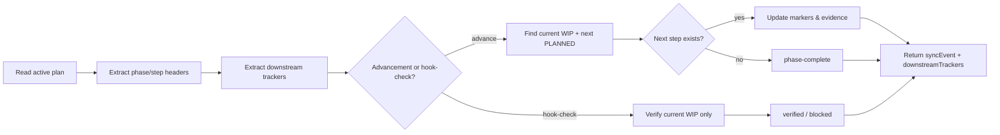

# Workflow Update Sync Hook Design

## Overview

The **Workflow Update Sync Hook** (`workflow-update-sync.mjs`) is a lightweight, idempotent trigger mechanism that keeps MCP plan state synchronized with the active implementation step. It supports two bounded modes: explicit **advancement** when a step is intentionally ready to move forward, and automatic **hook-check** verification after substantive actions without mutating the plan.

## Design Goals

1. **Minimal maintenance burden** — Supports automatic post-action integrity checks while keeping step advancement explicit and bounded.
2. **Idempotent** — Running multiple times does not cause state corruption; each invocation advances exactly one step.
3. **Boundary-aware** — Updates only the immediate next step, not future-phase steps.
4. **Evidence trail** — Logs all state updates with timestamp to the plan's validation evidence section.
5. **No false positives** — Does not update the plan if state is already in sync.

## Location

**File:** `.github/hooks/workflow-update-sync.mjs`

**Language:** JavaScript (Node.js, ES modules)

**Size:** ~400 lines (with comprehensive documentation and error handling)

## How It Works



### 1. Plan Parsing

The hook reads the active plan file and extracts all phase/step entries using a markdown header regex pattern:

```
Pattern: /^#{4,5}\s+(?:Step|Packet)\s+(\d+)\s+(?:—|-)\s+(.+)\s\[([A-Z]+)\]/
Matches: #### Step 05 — Title text [WIP|PLANNED|DONE]
         ##### Packet 1 — Title text [DONE]
```

For each match, the hook stores: `{ phase, step, title, status, lineNumber, originalLine }`

### 2. Downstream Tracker Extraction

After parsing the plan body, the hook extracts downstream tracker plans so that every sync event carries cross-plan handoff visibility. It reuses `extractDownstreamTrackers` from `customization-utils.mjs`, which:

1. Scans the plan text for `plans/` Markdown references (`plans/<Name>.md`).
2. Normalizes each match to a repo-relative path.
3. Drops the active plan itself so a plan never lists itself as its own downstream.
4. Drops `plans/README.md`, `plans/Roadmap.md`, and any `plans/completed/` archive.
5. Verifies that the remaining candidates exist on disk.
6. Returns a sorted array of downstream tracker paths.

The resulting `downstreamTrackers` array is included in the JSON `syncEvent` so MCP-aware callers can confirm which benchmark or dependency trackers are linked from the active plan without re-scanning the markdown manually.

### 3. State Detection

The hook identifies:
- **Current [WIP] step**: The single active step in the plan
- **Next [PLANNED] step**: The immediately following step in the same phase (step number = current + 1)

### 3. Sync Action Decision

Based on the state, the hook determines one of these actions:

| Action | Condition | Behavior |
|--------|-----------|----------|
| **advance** | Both [WIP] and next [PLANNED] exist in advancement mode | Changes [WIP] → [DONE], [PLANNED] → [WIP] |
| **verified** | Current [WIP] step exists in `--hook-check` mode | Confirms workflow integrity without changing the plan |
| **phase-complete** | No next [PLANNED] step after the current [WIP] step | Treats the phase boundary as a successful no-op |
| **already-in-sync** | Current state matches expected state | No changes needed |
| **blocked** | No [WIP] step exists | Cannot verify or advance safely |

### 4. Plan Update (if advancing)

When advancing, the hook:
1. Replaces the current step's `[WIP]` marker with `[DONE]` in the markdown header
2. Replaces the current step's `status: '[WIP]'` with `status: '[DONE]'` in the YAML packet block
3. Replaces the next step's `[PLANNED]` marker with `[WIP]` in the markdown header
4. Replaces the next step's `status: '[PLANNED]'` with `status: '[WIP]'` in the YAML packet block
5. Appends a timestamped sync entry to the `### Latest validation evidence` section
6. Writes all changes atomically to the plan file

The YAML packet block is identified by searching for the fenced ` ```yaml ` block whose content includes both `phase: N` and `step: M` matching the target step. This prevents false replacements when multiple step packets exist.

### 5. Validation Evidence

Each sync event is recorded with the format:

```markdown
- YYYY-MM-DD: Workflow sync: Advanced Phase N Step MM → [DONE]; Phase N Step MM+1 → [WIP]
```

This creates an audit trail visible in the plan's validation gates section.

## Invocation

```bash
# Advance workflow one step (default)
node .github/hooks/workflow-update-sync.mjs --plan=plans/My_Plan.md

# Dry-run (show what would change without writing)
node .github/hooks/workflow-update-sync.mjs --plan=plans/My_Plan.md --dry-run

# JSON output (for CI/programmatic consumption)
node .github/hooks/workflow-update-sync.mjs --plan=plans/My_Plan.md --json

# Combined (dry-run + JSON)
node .github/hooks/workflow-update-sync.mjs --plan=plans/My_Plan.md --dry-run --json

# Hook integrity check using the workflow MCP-bound plan
node .github/hooks/workflow-update-sync.mjs --json --hook-check

# Help
node .github/hooks/workflow-update-sync.mjs --help
```

**Plan resolution:** `--plan=<path>` is optional. When omitted, the hook resolves the active workflow plan from `.vscode/mcp.json` and falls back to `plans/mcp-active-binding.plans.md`.

## Output Modes

### Text Mode (default)

```
[PASS] Workflow update sync: advance

Evidence:
Workflow sync: Advanced Phase 6 Step 5 → [DONE]; Phase 6 Step 6 → [WIP]
```

### JSON Mode (`--json`)

```json
{
  "ok": true,
  "pass": true,
  "timestamp": "YYYY-MM-DD",
  "plan": {
    "path": "plans/My_Plan.md",
    "status": "WIP"
  },
  "syncEvent": {
    "currentWipStep": "Phase N Step M",
    "nextPlannedStep": "Phase N Step M+1",
    "actionTaken": "advance",
    "reason": "Phase N Step M is [WIP]; next step is [PLANNED]. Ready to advance.",
    "downstreamTrackers": [
      "plans/Downstream_Tracker_A.md",
      "plans/Downstream_Tracker_B.md"
    ]
  },
  "evidence": "Workflow sync: Advanced Phase N Step M → [DONE]; Phase N Step M+1 → [WIP]",
  "summaryText": "Workflow update sync: advance"
}
```

## Idempotency Guarantee

The hook is **strictly idempotent** — running it multiple times is safe and deterministic:

1. **First invocation**: Reads current state (Step N [WIP], Step N+1 [PLANNED]) → advances to Step N+1
2. **Second invocation**: Reads current state (Step N+1 [WIP], Step N+2 [PLANNED]) → advances to Step N+2
3. **Third invocation**: Reads current state (Step N+2 [WIP], no next step) → `phase-complete`, no changes
4. **Nth invocation**: Phase-boundary state remains stable; no file mutations

Each run is independent and based on the current file state, preventing infinite loops or state corruption.

## Error Handling

The hook handles these error conditions gracefully:

- **Plan file not found**: Exits with descriptive error message
- **Malformed plan (no [WIP] step)**: Blocks verification or advancement with reason
- **No next [PLANNED] step**: Returns `phase-complete` instead of treating the phase boundary as a failure
- **Missing validation evidence section**: Creates section before appending

## Validation Evidence Section

The hook requires (or creates) a `### Latest validation evidence` section in the plan. If this section does not exist, the hook creates it before the `## Handoff query` section.

```markdown
## Validation gates

### Latest validation evidence

- YYYY-MM-DD: Workflow sync: Advanced Phase N Step MM → [DONE]; Phase N Step MM+1 → [WIP]
- YYYY-MM-DD: Previous evidence entry...
```

## Integration Recommendations

### Option 1: Manual Advancement Trigger

**When to run:** After a step completes and manual confirmation is ready

```bash
# After the current [WIP] step completion is confirmed:
node .github/hooks/workflow-update-sync.mjs --plan=plans/My_Plan.md
```

**Pros:**
- No CI coupling; explicit control over advancement
- Easy to debug and understand failure modes
- Operator remains aware of state changes

**Cons:**
- Requires manual invocation
- Easy to forget if step completion is not immediately followed by confirmation

### Option 2: Automatic Post-Action Integrity Check

**When to run:** After substantive actions through the repo's posttool enforcement path

```bash
# Posttool hook verification
node .github/hooks/workflow-update-sync.mjs --json --hook-check
```

**Pros:**
- Automatically verifies workflow integrity after substantive actions
- Non-mutating, so routine actions do not accidentally advance the plan
- Phase boundaries remain successful no-op checks

**Cons:**
- Does not advance steps on its own
- Depends on the workflow MCP plan binding being correct

### Option 3: CI Post-Phase Gate

**When to run:** After final validation gate passes for a completed phase

```yaml
# In .github/workflows/validate.yml or similar
- name: Advance workflow if phase complete
  if: steps.final-validation.outcome == 'success'
  run: |
    node .github/hooks/workflow-update-sync.mjs \
      --plan=plans/My_Plan.md \
      --json
```

**Pros:**
- Fully automatic; no manual step forgotten
- Clear trigger point (validation gate success)
- Audit trail in CI logs and plan evidence section

**Cons:**
- CI coupling increases complexity
- If validation gate is wrong, advancement may be incorrect
- Requires careful coordination with manual confirmation steps

### Option 4: Hybrid (Recommended for long-term)

**When to run:** manual advancement plus automatic hook-check, with optional CI advancement where appropriate

1. **Manual trigger**: Operator runs the hook after manual confirmation to advance the plan
2. **Automatic hook-check**: Posttool enforcement verifies workflow integrity after substantive actions
3. **Optional CI validation gate**: CI can still advance after final validation if the plan lane wants that behavior
4. **Idempotency shields**: Since the hook is idempotent, duplicate advancement attempts remain safe

```bash
# Manual: operator confirms completion
node .github/hooks/workflow-update-sync.mjs --plan=plans/My_Plan.md

# Automated: CI confirms all gates passed
# (workflow runs the same command)
# Result: If already advanced, hook detects [nextPlannedStep] and advances to following step
# Or if not yet advanced, hook advances as expected
```

## Testing the Hook

### Test Dry-Run (preview changes without writing)

```bash
node .github/hooks/workflow-update-sync.mjs --plan=plans/My_Plan.md --dry-run
```

### Test Idempotency

```bash
# Run once
node .github/hooks/workflow-update-sync.mjs --plan=plans/My_Plan.md

# Run again (should detect new [WIP] step)
node .github/hooks/workflow-update-sync.mjs --plan=plans/My_Plan.md

# Run again (should block when no next step)
node .github/hooks/workflow-update-sync.mjs --plan=plans/My_Plan.md
```

### Test JSON Output

```bash
node .github/hooks/workflow-update-sync.mjs --plan=plans/My_Plan.md --json | head -20
```

### Test Against Live Plan (Revert to Original)

```bash
# After testing, revert to original state
git checkout plans/My_Plan.md
```

## Behavioral Guarantees

The hook provides the following invariants regardless of invocation count or caller:

- **Single-step boundary**: Only the immediate next step is ever advanced; future steps stay untouched.
- **Idempotence**: Repeated invocations read the current file state and produce the same action class for that state. The result is deterministic, so running the hook twice on the same file state does not corrupt the plan. See [Idempotence (Wikipedia)](https://en.wikipedia.org/wiki/Idempotence) for the CS background.
- **Evidence preservation**: Every advancing invocation appends a timestamped entry to the plan's `### Latest validation evidence` section before writing.
- **Non-mutating preview**: `--dry-run` reports the same `syncEvent` the real run would produce without modifying the plan file.
- **Graceful phase boundaries**: When no next [PLANNED] step exists, the hook returns `phase-complete` rather than an error.
- **Downstream visibility**: Every JSON report includes `syncEvent.downstreamTrackers` so callers can see linked tracker plans without re-parsing the markdown.

## Known Limitations

1. **Single-step advancement**: The hook only advances one step per invocation. This is intentional for idempotency; repeated invocations advance phase-by-phase.

2. **No phase auto-transition**: The hook does not automatically transition from Phase N to Phase N+1. Each phase must have its first step explicitly set to [WIP] by an agent.

3. **Requires validation evidence section**: The plan must have a `### Latest validation evidence` section. The hook creates it if missing, but this assumes a standard plan structure.

4. **No remote MCP calls**: The hook reads the plan file from disk but does not query `neataptic-workflow-mcp` at runtime. It uses the plan file as the source of truth. If MCP state diverges, manual reconciliation is needed.

## Possible Extensions

These changes are not currently implemented. Each trades additional automation against the current invariant of explicit, bounded advancement:

- **MCP snapshot comparison**: Cross-check the plan file against `neataptic-workflow-mcp` and surface divergence. Tradeoff: adds a runtime dependency on the MCP service for a file-first tool.
- **Phase auto-transition**: When the last step of a phase is marked [DONE], advance to Phase N+1 Step 1 automatically. Tradeoff: removes the explicit operator decision point at phase boundaries.
- **Coordinated multi-plan sync**: Advance or verify several linked plans in one invocation. Tradeoff: increases blast radius and ordering complexity.
- **External notifications**: Send Slack or email alerts when steps advance. Tradeoff: couples the hook to an external service and introduces delivery failure modes.
- **Automatic commits**: Commit plan changes with a descriptive message after advancement. Tradeoff: turns a read-mostly hook into a write actor that needs Git authentication and rollback handling.

## See Also

- [neataptic-workflow-mcp](../../scripts/agent-customization/mcp/neataptic-workflow-mcp.mjs) — MCP service that reads plan state
- [validate-plan-sync.mjs](../../scripts/agent-customization/validate-plan-sync.mjs) — Plan synchronization validator
- [plans/mcp-active-binding.plans.md](../../plans/mcp-active-binding.plans.md) — Perpetual MCP binding plan
- [plans/README.md](../../plans/README.md) — Plan index and trigger phrases
