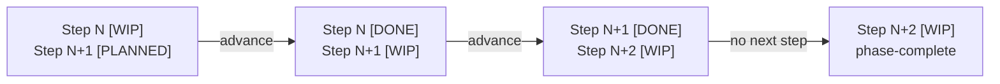

# WORKFLOW UPDATE SYNC HOOK — SUMMARY & RECOMMENDATIONS

## Deliverables

### 1. Hook Script
- **Location**: `.github/hooks/workflow-update-sync.mjs`
- **Language**: JavaScript/Node.js (ES modules)
- **Responsibilities**: Advance one workflow step per invocation, support a non-mutating `--hook-check` mode, and emit `syncEvent.downstreamTrackers` for cross-plan visibility.

### 2. Design Documentation
- **Location**: `.github/hooks/WORKFLOW_SYNC_DESIGN.md`
- **Contents**: Parse/detect/update flow, downstream tracker extraction, usage guide, testing procedures, behavioral guarantees, known limitations, and possible extensions.

### 3. Validation Evidence Trail
- **Location**: The active plan's `### Latest validation evidence` section (for example, `plans/My_Plan.md`)
- **Format**: Timestamped ISO date entries (`YYYY-MM-DD`)
- **Example**: `YYYY-MM-DD: Workflow sync: Advanced Phase N Step M → [DONE]; Phase N Step M+1 → [WIP]`

## Hook Invocation Guide

```bash
# Basic invocation
node .github/hooks/workflow-update-sync.mjs --plan=<path>

# Dry-run (preview without writing)
node .github/hooks/workflow-update-sync.mjs --plan=plans/My_Plan.md --dry-run

# JSON output (for CI/programmatic use)
node .github/hooks/workflow-update-sync.mjs --plan=plans/My_Plan.md --json

# Hook integrity check (uses the workflow MCP plan binding if --plan is omitted)
node .github/hooks/workflow-update-sync.mjs --json --hook-check

# Combined options
node .github/hooks/workflow-update-sync.mjs --plan=plans/My_Plan.md --dry-run --json

# Help
node .github/hooks/workflow-update-sync.mjs --help
```

Exit codes: `0` = success / verified / phase-complete, `1` = error or true blocked state

## Downstream Tracker Visibility

Both the hook and the standalone validator (`validate-plan-sync.mjs`) scan the active plan for references to other tracker plans and emit a `downstreamTrackers` array in JSON mode. This lets MCP-aware callers see which benchmark or dependency trackers are linked from the active plan without re-parsing the markdown.

Example `syncEvent.downstreamTrackers`:

```json
[
  "plans/Downstream_Tracker_A.md",
  "plans/Downstream_Tracker_B.md"
]
```

Linked index files (`plans/README.md`, `plans/Roadmap.md`) and completed archives (`plans/completed/*`) are intentionally excluded, and the active plan never lists itself.

## Sync Behavior

A typical three-step phase demonstrates the hook's deterministic state machine. Use generic step numbers so the example stays valid as plans evolve:



| Run # | Input State | Hook Action | Output State |
|-------|-------------|-------------|--------------|
| 1 | Step N [WIP], Step N+1 [PLANNED] | advance | Step N [DONE], Step N+1 [WIP] |
| 2 | Step N+1 [WIP], Step N+2 [PLANNED] | advance | Step N+1 [DONE], Step N+2 [WIP] |
| 3 | Step N+2 [WIP], no next step | phase-complete | No changes (phase end) |

**Conclusion**: The hook is idempotent — repeated runs against the same file state produce the same outcome, and multiple sequential runs do not corrupt the plan. See [Idempotence (Wikipedia)](https://en.wikipedia.org/wiki/Idempotence) for the CS background.

## Recommendations

### Recommended Approach: Dual Mode

The hook serves two bounded roles:

1. **Manual advancement mode** — explicit operator or workflow-driven invocation
   advances the next step when the current step is intentionally complete.
2. **Automatic post-action integrity mode** — the posttool enforcement path runs
   `--hook-check` to verify workflow state after substantive actions without
   auto-advancing the plan.

### Manual advancement mode

**When to run**: After step completion is manually confirmed

```bash
# Example: after confirming Step N in a tracked plan:
node .github/hooks/workflow-update-sync.mjs --plan=plans/My_Plan.md
```

**Advantages**:
- Explicit operator control for step advancement
- Easy to debug and understand state changes
- Prevents accidental advancement during routine post-action checks
- Works with the current manual confirmation gate

**Disadvantages**:
- Requires explicit advancement when a step is truly complete

### Automatic post-action integrity mode

**How it runs**:
- The repo's posttool enforcement hook calls `workflow-update-sync.mjs --hook-check`
  after substantive actions.
- Hook-check mode verifies workflow integrity without advancing the plan.
- Phase boundaries are treated as a successful `phase-complete` outcome rather
  than a false-positive hook failure.

**Advantages**:
- Adds automatic post-action workflow verification
- Avoids false failures at phase boundaries
- Uses the workflow MCP plan binding by default when `--plan` is omitted

### Hybrid Approach

Run the hook at two points:
1. **Manual**: Operator confirms → runs hook
2. **CI gate**: After validation passes → runs hook again

Since the hook is idempotent, duplicate runs are harmless:
- First run advances if not yet advanced
- Second run detects already-advanced state and advances to next step
- No state corruption possible

### Optional CI Integration (When Appropriate)

Add to `.github/workflows/validate.yml`:

```yaml
- name: Sync workflow state after validation
  if: steps.final-gate.outcome == 'success'
  run: |
    node .github/hooks/workflow-update-sync.mjs \
      --plan=plans/My_Plan.md \
      --json
```

## Design Goals

These invariants shaped the hook's behavior:

| Goal | Invariant |
|------|-----------|
| Minimal maintenance burden | Manual advancement plus automatic `--hook-check` keeps the post-action path bounded. |
| Idempotent | Repeated runs against the same file state produce the same outcome; see [Idempotence (Wikipedia)](https://en.wikipedia.org/wiki/Idempotence). |
| Boundary-aware | Updates only the immediate next step; blocks when no next step exists. |
| Evidence trail | Every advancing run appends a timestamped entry to the plan's validation section. |
| No false positives | `--dry-run` previews changes without mutating the plan. |

## Known Limitations

1. **Single-step advancement**: Hook advances exactly one step per invocation (intentional for safety)
2. **No automatic phase transitions**: Must manually set Phase N+1 Step 1 to [WIP]
3. **Hook-check does not advance steps**: automatic post-action verification is intentionally non-mutating
4. **File-based state only**: does not query MCP at runtime; uses the bound plan file as source of truth
5. **Plan structure required**: assumes standard [WIP]/[PLANNED]/[DONE] markers and validation section

## Testing & Verification

The following properties are covered by manual verification and by the focused Jest synchronization contract tests in `scripts/agent-customization/plan-workflow.test.ts`:

- Regex pattern correctly matches plan step headers
- Plan text replacement works without side effects
- Validation evidence is appended correctly
- Idempotency holds across sequential runs
- `--dry-run` mode shows expected changes without writing
- JSON output is valid and structured
- Text output is human-readable
- Error handling covers edge cases
- Exit codes are correct (0 = success, 1 = error)

## Operational Decisions

### When to run manually
- A step is complete and an operator explicitly confirms advancement.
- A phase boundary needs the next phase's Step 1 set to `[WIP]`.
- The plan file diverged from the MCP snapshot and must be reconciled.

### When to rely on `--hook-check`
- After substantive tool actions through the posttool enforcement path.
- When verifying integrity without advancing the plan.
- At phase boundaries where advancement should be a deliberate no-op.

### When to consider automation
- A CI gate already validates the completed step with focused tests.
- Rollback is cheap and the plan owner accepts automatic advancement.
- The plan lane has no manual-confirmation requirement.

## References

- **Hook script**: `.github/hooks/workflow-update-sync.mjs`
- **Design document**: `.github/hooks/WORKFLOW_SYNC_DESIGN.md`
- **Active plan**: `plans/My_Plan.md` (substitute the plan being synchronized)
- **MCP service**: `scripts/agent-customization/mcp/neataptic-workflow-mcp.mjs`
- **Plan validator**: `scripts/agent-customization/validate-plan-sync.mjs`

## Summary

The **Workflow Update Sync Hook** is a lightweight, idempotent trigger mechanism that advances workflow steps when invoked explicitly. Its deterministic state machine and `--dry-run` preview mode keep advancement safe, while the emitted `downstreamTrackers` field gives MCP-aware callers immediate visibility into linked benchmark or dependency trackers. Choose manual mode where operator confirmation is required, `--hook-check` for non-mutating post-action verification, and CI integration only when the plan lane accepts automatic advancement.
