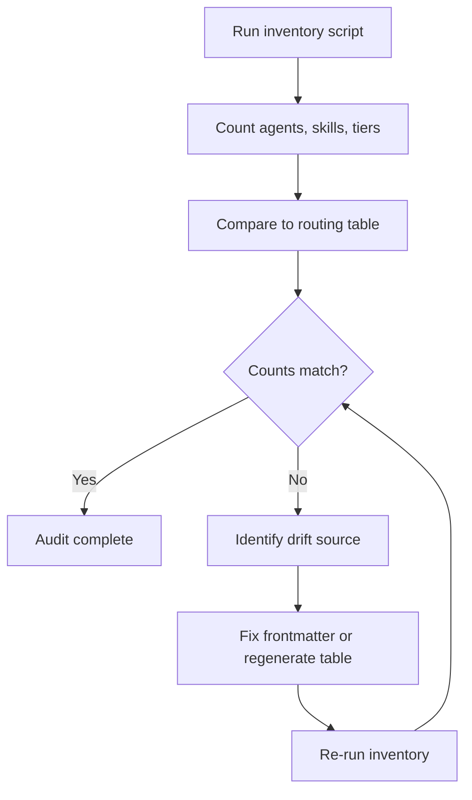
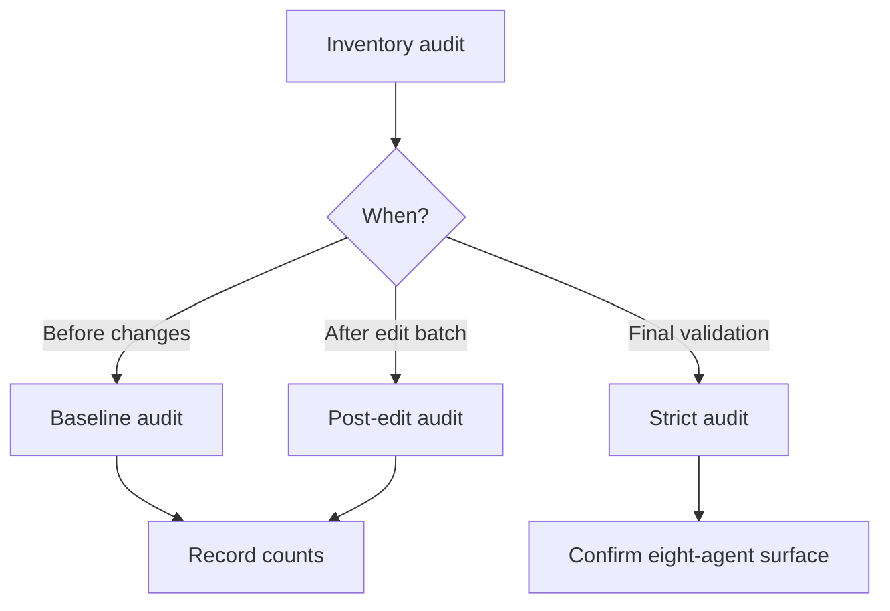

> **Search policy:** Follow the Cortex-First Search Policy from the `research-methodology` skill. Prefer Cortex MCP tools (`search_corpus`, `search_context`, `search_advanced`, `load_chunk`, `traverse_graph`) over native tools (`grep`, `glob`, `view`). Use native tools only as fallback when Cortex is degraded.

# Agent Inventory Audit

This skill produces a structured snapshot of all agents and skills in the NeatapticTS customization system. It runs the four inventory and validation scripts, summarizes counts and errors, and records the result as evidence in the active plan. Use it before and after any customization change batch to establish a before/after comparison.

## When to Use

- Before starting a customization change to establish a baseline agent/skill count.
- After a batch of edits to confirm that counts and graph edges match expectations.
- When comparing a pre-migration and post-migration architecture to identify drift.
- When preparing validation evidence for a plan tracker or session handoff.
- When investigating an unexpected routing result and needing to see the full agent graph.
- When strict validation is expected to pass and you want confirmation that the eight-agent SDLC surface is correct.


## When NOT to use

Do NOT use for validating a single agent file - use `agent-frontmatter-standards` instead. Do NOT use for skill frontmatter - use `skill-frontmatter-standards` instead.


## Workflow Diagram



## Task Packet

Include whether this is a baseline, mid-session, or post-migration audit; which validation flags to use; and what counts or graph properties are expected.

```text
Use agent-inventory-audit for <baseline | post-edit | strict validation>.
Expected user-invocable agents: <count>
Expected skill count: <count>
Strict mode: <yes | not yet>
Record in: <plan file path or chat summary>
```

## Required Workflow

1. Run `node scripts/agent-customization/inventory-customizations.mjs --json` to get current agent and skill counts.
2. Run `node scripts/agent-customization/validate-agent-frontmatter.mjs --json` to surface frontmatter errors and warnings.
3. Run `node scripts/agent-customization/validate-skill-frontmatter.mjs --json` to surface skill metadata errors.
4. Run `node scripts/agent-customization/validate-agent-graph.mjs --json` to surface delegation graph errors (orphaned edges, cycles, missing allow-list entries).
5. Add `--strict` to the frontmatter and graph scripts only when the final eight-agent SDLC surface is already expected to be correct.
6. Compare user-invocable agent count, skill count, graph errors, and frontmatter warnings against the expected baseline or target.
7. Note any expected pre-migration drift explicitly so it is not treated as a defect.
8. Summarize counts, errors, and drift in the active plan or session handoff note.


## Why This Matters

Each inventory script serves a specific purpose in the customization pipeline. The inventory script counts agents, skills, and tiers from live frontmatter - it is the ground truth for the routing table. When inventory drifts from the generated routing table, agents may be misrouted, invisible to delegation, or silently dropped from CI validation. Running the audit after any customization change catches drift before it becomes a silent routing failure.

## Decision Tree



## Before / After Examples

**Before (incomplete report):**
```text
Audit done. 8 agents found.
```

**After (complete report):**
```text
Baseline audit:
- User-invocable agents: 8
- Skills: 24
- Graph errors: 0
- Frontmatter warnings: 0
- Drift from routing table: none
```

## Guardrails

- Do not run `--strict` when the migration is still in progress; it will produce false failures.
- Do not treat pre-migration graph errors as defects without first checking whether they reflect planned intermediate states.
- Do not skip the graph validation step (`validate-agent-graph.mjs`) when checking delegation edges — frontmatter errors alone are insufficient.
- Do not summarize audit results without distinguishing errors (require fix) from warnings (informational).
- Do not record raw script output verbatim in plan files; distill it into counts, errors, and action items.

## Expected Final Output

- JSON output from all four scripts has been read and interpreted.
- A structured evidence summary: user-invocable agent count, skill count, graph errors, frontmatter errors, and expected-vs-actual drift.
- The active plan or tracker is updated with audit evidence and next action.
- If strict mode was requested, confirmation that it passed or a list of blocking errors.
