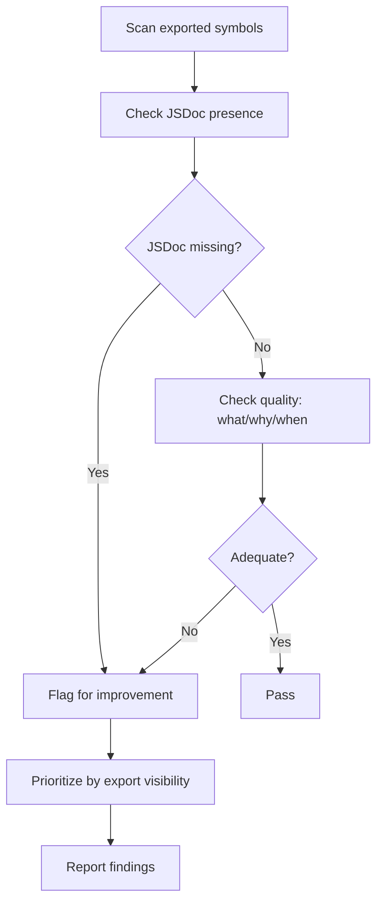
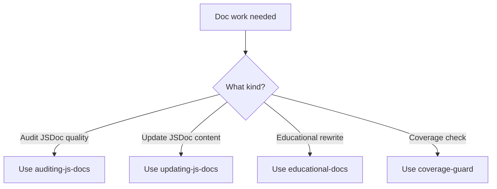

> **Search policy:** Follow the Cortex-First Search Policy from the `research-methodology` skill. Prefer Cortex MCP tools (`search_corpus`, `search_context`, `search_advanced`, `load_chunk`, `traverse_graph`) over native tools (`grep`, `glob`, `view`). Use native tools only as fallback when Cortex is degraded.

# Auditing JS Docs

This skill performs a structured read-only audit of JSDoc/TSDoc quality across a target source surface. It identifies gaps before any edits are made, so that `updating-js-docs` or `educational-docs` can act on a concrete list of defects rather than a vague impression.

## When to Use

- Before editing documentation, to establish a baseline gap list rather than editing blind.
- A generated `src/**/README.md` looks sparse or inaccurate and you need to trace the problem to source JSDoc.
- A public API surface has been extended and the existing JSDoc has not caught up.
- Checking whether a folder's JSDoc meets the pedagogist-first standard: examples, Mermaid diagrams, citations, formulas.
- Preparing a documentation improvement plan for a coverage tranche or SDLC phase.
- Verifying that stale invariant descriptions or removed parameters have been cleaned up.

## When NOT to use

Do NOT use for citation auditing - use `docs-academic-citation-audit` instead. Do NOT use for generating READMEs - use `educational-docs` instead.

## Workflow Diagram



## Task Packet

Include the target source files or folder, whether the generated README should also be inspected, and whether the audit is read-only or should produce an edit recommendation list.

```text
Use auditing-js-docs for <src/path/to/folder or src/path/to/file.ts>.
Inspect generated README: <yes | no>
Pass type: <read-only gap list | recommend updates>
Standards to check: <examples | citations | Mermaid | formulas | param completeness>
```

## Required Workflow

1. Read the generated `README.md` for the target folder as context — it reveals what the docs generator could and could not extract from the source.
2. Read the corresponding source files to inspect JSDoc directly; do not treat the generated README as authoritative.
3. Check each public export for: presence of a `@description` or opening summary, at least one `@example` block, `@param` and `@returns` completeness, and correct `@throws` documentation.
4. Flag missing Mermaid diagrams at the folder/chapter level where the pedagogist-first standard requires at least one.
5. Flag missing citations: any algorithm, formula, or concept without a Wikipedia link or academic paper reference.
6. Flag stale invariants: parameter descriptions that no longer match the implementation, removed exports still documented, or examples that would not compile against the current public API.
7. Produce a prioritized gap list: critical (missing public API docs), major (missing examples or citations), minor (style or completeness gaps).
8. Recommend `educational-docs` when the gaps require Mermaid diagrams, deep source mapping, or conceptual depth rewrites.
9. Do not hand-edit generated `src/**/README.md` files; note source files to edit instead.

## Why JSDoc Quality Matters

JSDoc is the source of truth for the generated README pipeline. Weak or missing JSDoc produces poor educational documentation, missing examples, and reduced discoverability. The README generation pipeline (`npm run docs`) extracts JSDoc comments directly - if the JSDoc is thin, the generated README is thin. Auditing JSDoc before documentation generation catches gaps early.

## Before/After JSDoc Examples

**Before (weak):**

```ts
/** Creates a network. */
export function buildMLP(config?: MLPConfig): Network { ... }
```

**After (strong):**

````ts
/**
 * Build a multi-layer perceptron network with sensible defaults.
 *
 * Produces a feedforward network with configurable hidden layers,
 * input/output sizes, and activation functions. Zero-argument
 * calls produce a minimal runnable network.
 *
 * @param config - Optional partial config; defaults produce a 2-2-1 MLP
 * @returns A constructed Network ready for activation
 * @throws Error when hiddenLayers is empty or units < 1
 *
 * @example
 * ```ts
 * const net = buildMLP({ hiddenLayers: [4, 4] });
 * console.log(net.nodes.length);
 * ```
 */
export function buildMLP(config?: MLPConfig): Network { ... }
````

## Decision Tree



## Guardrails

- Do not edit any file during an audit pass; this skill is read-only unless the task packet explicitly requests edit recommendations.
- Do not treat the generated README as the source of truth; always verify against the source JSDoc.
- Do not flag style preferences as critical gaps; reserve critical classification for missing public API documentation.
- Do not hand-edit generated READMEs; the correct fix is always to improve the source JSDoc and rerun `npm run docs`.
- Do not recommend `educational-docs` for minor completeness gaps that `updating-js-docs` can handle directly.

## Expected Final Output

- A prioritized gap list: critical, major, and minor documentation defects.
- For each gap: the source file and the specific JSDoc location that needs attention.
- A recommendation for the next skill to invoke: `updating-js-docs` for small targeted fixes, `educational-docs` for structural or diagram-heavy rewrites.
- No files changed during the audit pass itself.
