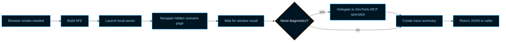
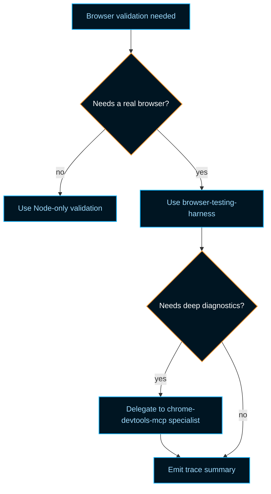

> **Search policy:** Follow the Cortex-First Search Policy from the `research-methodology` skill. Prefer Cortex MCP tools (`search_corpus`, `search_context`, `search_advanced`, `load_chunk`, `traverse_graph`) over native tools (`grep`, `glob`, `view`). Use native tools only as fallback when Cortex is degraded.

# Browser Testing Harness Playbook

Use this skill when an implementation or validation pass needs to drive a real
browser scenario for NeatapticTS — for example, WebGPU inference parity, CPU
versus GPU numeric stability, or any other runtime feature that only exists in
a browser context.

This skill owns the durable contract for:

- starting a local static server that exposes the NeatapticTS IIFE build,
- navigating Chrome/Chromium to a **visible foreground** test page (non-negotiable for GPU benchmarks; see `Visible Browser Window Mandate` below),
- waiting for a deterministic `window.*SmokeResult` result object,
- delegating to the Chrome DevTools MCP skill for deep diagnostics,
- producing a compact, serializable trace summary.

## Scope Boundary

- In scope: local server launch helpers, scenario URL assembly, browser trace
  summaries, hidden `docs/browser-tests/` scenario pages, and orchestrator-level
  wiring for browser smoke tests.
- Out of scope: browser UX polish, visual regression testing, public
  documentation pages, and environment-specific CI configuration. Those belong
  to the responsible specialist or to the browser DevTools specialists.

## Visible Browser Window Mandate (GPU / Performance Tests)

Any browser test that exercises **WebGPU, WebGL, GPU compute, or performance**
**timing** MUST use a **visible, foreground browser window**. Non-negotiable.

Why it matters:

- Hidden, headless, minimized, or background tabs cause the GPU process and
  compositor to de-prioritize work, leading to artificially low throughput and
  invalid latency measurements.
- A window that is behind the IDE or another application is also treated as
  background and produces unreliable numbers.

Required behavior for harness and specialist agents:

- Launch Chrome/Chromium with `--disable-background-timer-throttling`,
  `--disable-renderer-backgrounding`, `--disable-backgrounding-occluded-windows`,
  and a non-headless, visible window.
- If the user is running the browser on the same machine as the IDE, bring the
  page to the foreground (e.g., focus the browser window, keep it on top, or
  instruct the user to do so) before recording measurements.
- Document in the test result whether the browser window was visible/foreground;
  if it was not, mark the measurement `invalid` and refuse to use it as
  validation evidence.
- Puppeteer/Playwright scripts must use `headless: false` and a visible window
  size; avoid `--headless=new` for GPU/perf scenarios.

This is a project-wide mandate, not a recommendation. Violating it invalidates
all GPU/perf numbers from that run.

## When to Use

- An implementation or validation pass asks for a browser smoke scenario that exercises `dist/neataptic.browser.iife.js`.
- Red tests expect `launchLocalServer()` or `createTraceSummary()` exports.
- The orchestrator needs a reproducible way to confirm WebGPU/CPU parity.
- Deep browser diagnostics are needed and the Chrome DevTools MCP skill should
  be invoked.

## When NOT to Use

- Do NOT use for headless benchmark harnesses that do not require a browser.
- Do NOT use for documentation-only browser demos; use `educational-docs` or
  `06-documenting` instead.
- Do NOT use for core library implementation work that can be validated in Node.

## When to call this skill vs. `chrome-devtools-mcp` directly

Use `browser-testing-harness` when the work is a **reproducible browser smoke
scenario** that needs a local server, a hidden scenario page, and a concise
trace summary. It is the orchestration surface: it starts the server, navigates
to the page, waits for `window.*SmokeResult`, and decides whether deeper
browser diagnostics are required.

Use `chrome-devtools-mcp` directly only for **single, narrow browser actions**
that do not need the full harness lifecycle:

| Situation                                                    | Use                                                        |
| ------------------------------------------------------------ | ---------------------------------------------------------- |
| Single navigation, DOM query, console read, or network check | `chrome-devtools-mcp` directly                             |
| Performance trace capture and analysis                       | `performance-trace-specialist` (via `chrome-devtools-mcp`) |
| Multi-step UI interaction or layout verification             | `browser-ui-specialist` (via `chrome-devtools-mcp`)        |
| Heap snapshot or memory leak detection                       | `browser-memory-specialist` (via `chrome-devtools-mcp`)    |
| Full smoke scenario: server → page → result → summary        | `browser-testing-harness`                                  |

The harness skill delegates to the three DevTools specialists when a scenario
needs more than a pass/fail result. Keep the harness as the entry point so the
local server lifecycle, URL assembly, and deterministic summary stay in one
place.

## Workflow Diagram



The harness keeps the entire lifecycle—build, serve, navigate, wait, optional
deep diagnostics, summary, and teardown—behind one deterministic contract.

## Task Packet

Pass a compact packet that includes:

- the scenario name or validation step that needs a browser run,
- the hidden HTML page path under `docs/browser-tests/`,
- the expected `window.*SmokeResult` shape,
- whether DevTools diagnostics (trace, memory, UI) are required,
- the acceptance threshold for any numeric comparison.

Compact example:

```text
Use browser-testing-harness for a WebGPU inference parity smoke test.
Scenario: docs/browser-tests/webgpu-inference-smoke.html.
Expected: window.webgpuSmokeResult = { success, cpuOutput, gpuOutput, maxAbsDiff, meanAbsDiff, gpuDeviceBound }.
Diagnostics: CPU/GPU parity only; no DevTools trace needed.
Threshold: maxAbsDiff ≤ 0.5, meanAbsDiff ≤ 0.1.
```

## Runnable example

The harness exports live in `scripts/agent-customization/browser-tests/`. A
minimal Node script that starts the server, captures a hypothetical browser
result, and tears down looks like this:

```ts
import { launchLocalServer } from './scripts/agent-customization/browser-tests/harness-launcher.ts';
import { createTraceSummary } from './scripts/agent-customization/browser-tests/trace-summary.ts';

const { scenarioUrl, teardown } = await launchLocalServer({
  cwd: process.cwd(),
  port: 8080,
});

try {
  // Navigate to scenarioUrl in your browser or via Chrome DevTools MCP,
  // then read window.webgpuSmokeResult from the page.
  const summary = createTraceSummary({
    scenarioUrl,
    durationMs: 420,
    success: true,
    metrics: { maxAbsDiff: 0.05, meanAbsDiff: 0.01 },
  });
  console.log(JSON.stringify(summary, null, 2));
} finally {
  await teardown();
}
```

In practice the browser navigation and result polling are delegated to the
`browser-harness-specialist`, which keeps raw trace data out of the caller's
context.

## Required Workflow

1. Read the task plan and the scenario contract (for example, the failing test file).
2. Verify that `npm run build` produced `dist/neataptic.browser.iife.js`.
3. Launch the local server with `launchLocalServer()` from
   `scripts/agent-customization/browser-tests/harness-launcher.ts`.
4. Launch the browser in a **visible, non-headless** window and, if possible,
   bring it to the foreground. Document window visibility in the trace summary.
5. **Pre-flight visibility check.** Before running any GPU measurement, verify that
   the browser window is visible and in the foreground. If the window is headless,
   minimized, occluded, or cannot be confirmed as foreground, **abort the GPU test**
   and report `browserVisibility: invalid` with the reason. GPU timing or parity
   results from a non-visible window are invalid and must be discarded.
6. Navigate to the scenario URL; wait for the page to set the declared
   `window.*SmokeResult` object.

   Scenario pages live under `docs/browser-tests/` and are intentionally hidden
   from generated public documentation. They are reachable only through the local
   server, for example
   `http://localhost:8080/docs/browser-tests/webgpu-inference-smoke.html`.

7. If the scenario fails or needs deeper inspection, delegate to the relevant
   Chrome DevTools specialist (`performance-trace-specialist`,
   `browser-ui-specialist`, `browser-memory-specialist`) via the
   `chrome-devtools-mcp` skill.
8. Build a trace summary with `createTraceSummary()` from
   `scripts/agent-customization/browser-tests/trace-summary.ts`.
9. Include in the summary a `browserVisibility` field: `visible-foreground`,
   `visible-background`, `minimized`, or `headless`. GPU/perf measurements are
   only valid when this field is `visible-foreground`.
10. Tear down the local server.
11. Return the JSON summary and any artifacts.

## Server Start and Scenario Navigation

- Use `npx http-server . -p 8080 -c-1` as the canonical server command.
- Wait for the `Available on:` banner before treating the server as ready.
- Always prefer the server-relative URL so the scenario is independent of the
  host machine.

## Waiting for the Browser Result

- The scenario page must set `window.<Name>SmokeResult` to an object with at
  least a `success` boolean.
- Poll with `page.evaluate()` until the object is non-null or a timeout is
  reached.
- Include CPU reference output, GPU output, and numeric diff metrics when the
  scenario is a parity test.

## Delegating to DevTools MCP

- For performance traces, use `performance-trace-specialist`.
- For DOM/UI inspection, use `browser-ui-specialist`.
- For memory snapshots, use `browser-memory-specialist`.
- Keep the harness specialist as the orchestration surface; do not let deep
  diagnostics leak into the core library.

## Trace Summary Contract

- `scenarioUrl`: exact URL of the scenario page.
- `durationMs`: wall-clock scenario duration.
- `success`: boolean from the scenario result.
- `metrics.keyCount`: number of top-level keys in the result object.
- The summary must be deterministic for the same browser result.

## Decision Tree



Use this tree to decide whether a validation task belongs in Node, in the
browser harness, or in the DevTools MCP specialists under the harness.

## Guardrails

- Do not commit browser profiles, screenshots, or full traces unless required.
- Do not let the server outlive the test; always tear it down.
- Do not modify `docs/browser-tests/` pages to be user-facing documentation;
  keep them hidden test fixtures.
- Do not run the full Jest suite speculatively; prefer the focused
  `agent-customization-scripts` project slice.
- Do not write scenarios that depend on network resources outside the local
  server.
- **Never run GPU or performance tests in a headless, hidden, minimized, or
  occluded browser window.** Measurements from such windows are invalid and
  must be discarded.

## Expected Final Output

A strong browser harness pass should report:

- the scenario page URL and local server URL,
- the `window.*SmokeResult` fields captured,
- whether DevTools diagnostics were delegated and to which specialist,
- the trace summary JSON,
- validation results from the focused Jest slice and frontmatter validators,
- confirmation that the server was torn down.
