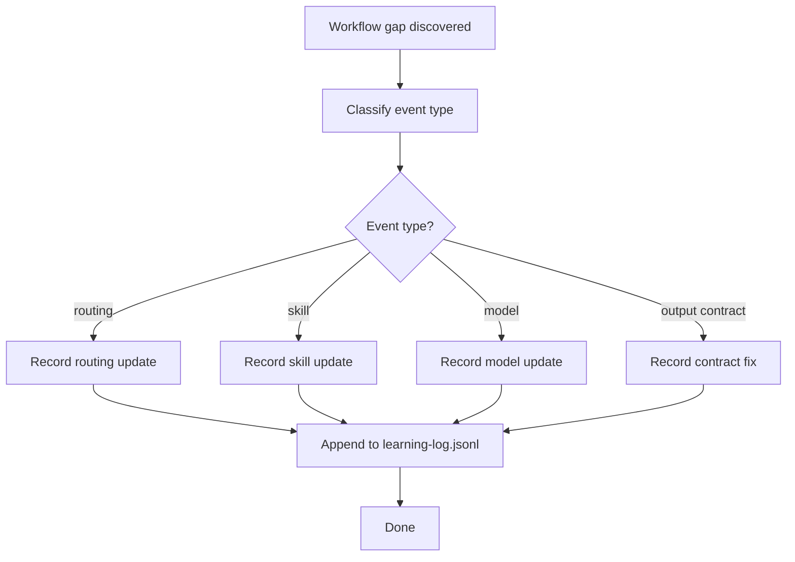
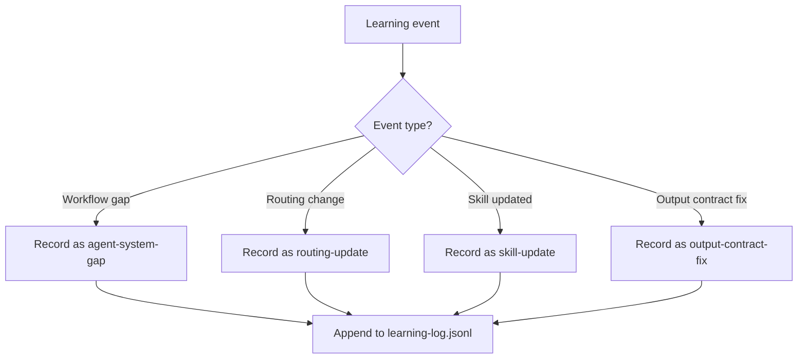

> **Search policy:** Follow the Cortex-First Search Policy from the `research-methodology` skill. Prefer Cortex MCP tools (`search_corpus`, `search_context`, `search_advanced`, `load_chunk`, `traverse_graph`) over native tools (`grep`, `glob`, `view`). Use native tools only as fallback when Cortex is degraded.

# Capturing Learning Event

This skill appends a structured, append-only learning evidence record to `.github/ai-learning/learning-log.jsonl`. It documents agent-system gaps, corrective updates, and routing changes in a compact, public-project-friendly format that supports session continuity without making compliance claims.

## When to Use

- A workflow gap was discovered and corrected during a session (e.g., a missing skill, a broken routing edge, a wrong output contract).
- An agent or skill was updated to fix a recurring failure and the change should be traceable.
- A model selection or routing policy was changed and the rationale should be preserved.
- An output contract mismatch was identified and resolved between a specialist and its orchestrator.
- Closing a session and needing to record what changed so the next session can resume without re-diagnosing.
- Preparing validation evidence for an agent-system audit.


## When NOT to use

Do NOT use for routine validation passes - use `green-validation-gates` instead. Do NOT use for plan tracking - use `tracker-handoff` instead.


## Workflow Diagram



## Task Packet

Include the event type, the triggering task, what was missing, what changed, which files were affected, and what the resume action is.

```text
Use capturing-learning-event for <event-type>.
Triggering task: <brief description>
Gap: <what was missing or wrong>
Resolution: <what changed>
Files changed: <list>
Agents affected: <list>
Skills affected: <list>
Confirmation: <not-required | user-confirmed | deferred>
Resume action: <how work continues after this event>
```

## Required Workflow

1. Identify the event type: `agent-system-gap`, `agent-update`, `skill-update`, `routing-update`, or `output-contract-fix`.
2. Summarize the triggering task in one brief phrase.
3. Describe the gap (what was missing or wrong) and the resolution (what changed) concisely and factually.
4. List all files changed, agents affected, and skills affected.
5. Set `confirmation` to `not-required`, `user-confirmed`, or `deferred` based on whether the change was reviewed.
6. State the resume action: how work continued after the event was captured.
7. Append the event as a single-line JSON object to `.github/ai-learning/learning-log.jsonl` using the schema below.
8. Do not rewrite or delete existing log entries; the file is append-only.

Schema:

```json
{
  "timestamp": "<ISO timestamp>",
  "eventType": "agent-system-gap|agent-update|skill-update|routing-update|output-contract-fix",
  "triggeringTask": "<brief>",
  "gap": "<what was missing>",
  "resolution": "<what changed>",
  "filesChanged": ["<path>"],
  "agentsAffected": ["<agent-name>"],
  "skillsAffected": ["<skill-name>"],
  "confirmation": "not-required|user-confirmed|deferred",
  "resumeAction": "<how work continued>"
}
```


## Why This Matters

The learning event log creates an ISO-42001-style evidence trail for workflow improvements. Without it, the same workflow gaps recur across sessions because there is no durable record of what was discovered and fixed. Each event type (routing, skill, model, output contract) represents a different class of system improvement that future sessions should inherit rather than rediscover.

## Event Type Examples

- **routing**: An agent was misrouted because a new specialist was not in the routing table.
- **skill**: A skill was missing guidance on when NOT to use it, causing confusion.
- **model**: A model string was stale or invalid, causing silent delegation failures.
- **output contract**: A structured-v1 output block was missing a required field.

## Decision Tree



## Before / After Examples

**Before (vague log entry):**
```json
{"eventType": "routing", "gap": "something broke", "resolution": "fixed it"}
```

**After (structured log entry):**
```json
{"timestamp": "2026-06-20T21:43:58Z", "eventType": "routing-update", "triggeringTask": "delegate to new specialist", "gap": "new specialist missing from routing table", "resolution": "added specialist to allow-list and regenerated table", "filesChanged": [".github/agent-skill-routing-table.md"], "agentsAffected": ["04-implementing"], "skillsAffected": ["execute"], "confirmation": "user-confirmed", "resumeAction": "re-dispatch the original task"}
```

## Guardrails

- Do not claim ISO-42001 certification or compliance; this is a local evidence log, not a certified system.
- Do not delete or rewrite existing log entries; always append.
- Do not include private or chat-only detail that is not relevant to future session continuity.
- Do not use vague gap or resolution descriptions; keep entries factual and specific enough to be actionable.
- Do not create multiple log entries for the same event; consolidate co-occurring changes into one entry.

## Expected Final Output

- A new JSON line appended to `.github/ai-learning/learning-log.jsonl` with all required fields populated.
- Learning event type, file changed, and resume action summarized in the session output.
