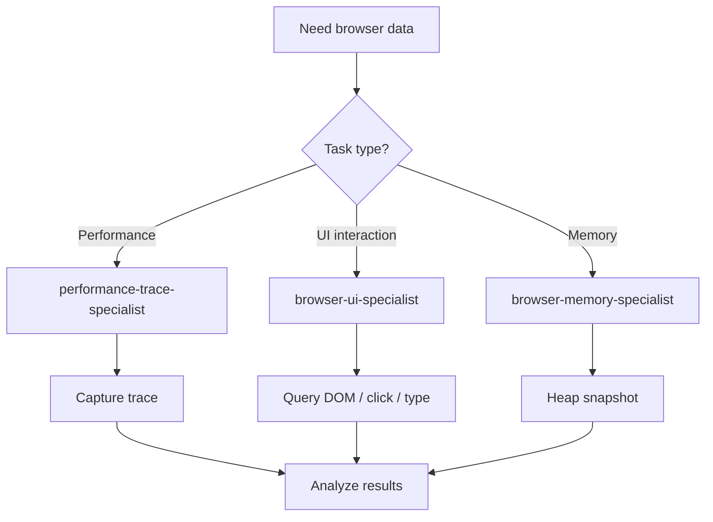
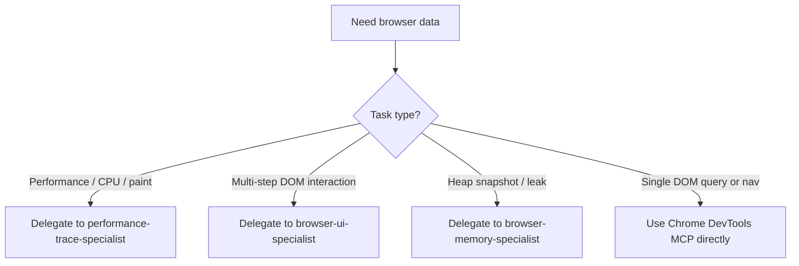

# Chrome DevTools MCP Playbook

This skill is the durable knowledge layer for Chrome DevTools MCP tool
usage across the NeatapticTS agent orchestration system. It owns the tool
catalog, the decision trees for direct MCP tool usage versus specialist
delegation, token-efficient strategies, and the workflows for trace
capture, DOM interaction, and memory profiling.

When a task requires browser-based measurement, UI testing, or memory
profiling, consult this skill to decide whether to call Chrome DevTools
MCP tools directly or delegate to a Tier 3 specialist.

## When NOT to use

Do NOT use for simple code lookups or grep searches - use `research-methodology` instead. Do NOT use for general performance profiling without a trace - use `performance-optimization` instead.

## Workflow Diagram



## Section 1 — Chrome DevTools MCP Tool Catalog

The Chrome DevTools MCP server exposes tools grouped by category. Each
category has a primary use case and a token-cost profile.

### Performance Tracing

- `performance_start_trace` — begin a performance trace capture.
- `performance_stop_trace` — stop the active trace and save the trace
  file (use `filePath` to write to disk).
- `performance_analyze_insight` — analyze a specific performance insight
  from a captured trace.

Use cases: CPU profiling, layout thrash detection, paint analysis, JS
execution hotspots, frame rate measurement.

### Screenshots

- `take_screenshot` — capture a PNG screenshot of the current page.

Screenshots are **token-expensive**. Use sparingly. Compression flags are
available to reduce token overhead, but prefer DOM queries whenever a
visual is not strictly required.

### DOM Interaction

- `take_snapshot` — capture the accessibility tree as **text** (not
  images). This is the primary token-efficient way to understand page
  structure. Returns `uid` identifiers for elements.
- `click` — click an element by `uid`.
- `fill` — type into a single input by `uid`.
- `fill_form` — fill multiple form fields in one call.
- `select` — select an option from a dropdown by `uid`.
- `hover` — hover an element by `uid`.
- `evaluate_script` — run arbitrary JavaScript in the page context to
  query computed styles, text content, bounding boxes, visibility, or
  custom assertions.

Use cases: navigate a demo flow, verify DOM structure, interact with UI
controls, assert runtime behavior without visual inspection.

### Navigation

- `navigate_page` — navigate to a URL.
- `wait_for` — wait for a condition (element, text, load state).
- `go_back` — browser back.
- `go_forward` — browser forward.
- `reload_page` — reload the current page.
- `list_pages` — list open browser tabs/pages.

Use cases: load a demo page, navigate between routes, reset state between
test steps.

### Console

- `list_console_messages` — read console output with source-mapped stack
  traces.

Use cases: verify runtime behavior, catch errors and warnings, confirm
expected log output.

### Network

- `list_network_requests` — read-only inspection of network activity.

Use cases: detect failed asset loads, inspect slow responses, verify API
call sequences.

### Memory

- `take_heapsnapshot` — capture a heap snapshot. Always available.
- `get_heapsnapshot_summary` — summary of retained objects by type.
  Requires `--memoryDebugging` flag.
- `get_heapsnapshot_details` — detailed breakdown of a heap snapshot.
  Requires `--memoryDebugging` flag.
- Five additional analysis tools (retained paths, dominators, leak
  detection helpers) — all require `--memoryDebugging` flag.

Use cases: heap snapshot comparison, retained object growth detection,
memory leak classification.

### Emulation

- Device emulation, network conditioning, viewport control.

Use cases: test responsive layouts, simulate mobile devices, throttle
network to measure load performance.

### Extensions

- `list_extensions` — list installed browser extensions.
- `get_extension_info` — get details for a specific extension by ID.
- `install_extension` — install a browser extension from a path or URL.
- `uninstall_extension` — remove an installed extension by ID.

Use cases: audit installed extensions, verify extension presence for a
demo that depends on one, install or remove extensions during browser
test setup.

### Third-Party Integration

- `lighthouse_audit` — run a Lighthouse audit and return the report.

Use cases: overall page quality scores, accessibility audits, SEO
metrics.

### Tool Count Summary

The Chrome DevTools MCP server exposes **49 tools** across the 10
categories above (Performance Tracing, Screenshots, DOM Interaction,
Navigation, Console, Network, Memory, Emulation, Extensions, and
Third-Party Integration). Tool availability depends on the MCP server
flags: `--memoryDebugging` unlocks 8 of the 11 memory tools, and
`--slim` restricts the surface to 3 tools only (navigate, snapshot,
evaluate). The exact per-category distribution varies slightly depending
on whether snapshot/input tools are grouped under DOM Interaction or
split into separate Screenshots and Input Automation categories; the
total remains 49.

## Section 2 — Decision Tree — Direct MCP vs. Specialist Delegation

Most Chrome DevTools MCP operations should be delegated to a Tier 3
specialist. The narrow exceptions below are safe for direct MCP tool
calls from any agent.

| Situation                                            | Action                                            |
| ---------------------------------------------------- | ------------------------------------------------- |
| Quick DOM query (single element)                     | Use Chrome DevTools MCP directly                  |
| Single navigation to a URL                           | Use Chrome DevTools MCP directly                  |
| Single console log check                             | Use Chrome DevTools MCP directly                  |
| Single network request inspection                    | Use Chrome DevTools MCP directly                  |
| Performance trace capture & analysis                 | Delegate to `performance-trace-specialist`        |
| Multi-step UI interaction sequence                   | Delegate to `browser-ui-specialist`               |
| Layout verification across a demo flow               | Delegate to `browser-ui-specialist`               |
| Element property inspection across multiple elements | Delegate to `browser-ui-specialist`               |
| Heap snapshot & memory profiling                     | Delegate to `browser-memory-specialist`           |
| Memory leak detection                                | Delegate to `browser-memory-specialist`           |
| Screenshot capture (token-expensive)                 | Only when explicitly required; prefer DOM queries |

### Delegation Rationale

Specialists run in fresh context windows and own the token-budget
management, retry logic, and trace summarization workflows. Delegating
keeps the calling agent's context lean and ensures that large trace files
and heap snapshots never pollute the orchestrator's context. The cost of
delegation is a single round-trip; the cost of pulling a 10 MB trace into
an orchestrator context is catastrophic.

## Section 3 — Token-Efficient Strategies

Chrome DevTools MCP operations can consume enormous token budgets if used
naively. Follow these strategies to keep context lean.

- **Screenshots are token-expensive.** Prefer DOM queries
  (`take_snapshot` returns the a11y tree as text), text extraction, and
  computed styles over visual inspection.
- **`take_snapshot` returns an accessibility tree as TEXT (not images)** —
  this is the primary token-efficient way to understand page structure.
- **Use `uid` from snapshots to interact with elements** (click, fill,
  etc.) — no need for screenshots to identify targets.
- **Trace files are 10 MB+.** NEVER read raw trace files into agent
  context. Use `scripts/trace-summarize.mjs` for concise summaries
  (< 2000 chars).
- **Use `scripts/trace-compress.mjs`** for trace storage to save disk
  space.
- **Use `scripts/analyze-trace/analyze-trace.ts`** for detailed
  thread-aware analysis when a summary is not enough.
- **Batch multiple DOM queries into a single browser session** to
  minimize round trips.
- **Use `list_console_messages`** to verify runtime behavior without
  visual inspection.
- **Use `--slim` mode** (3 tools only: navigate, snapshot, evaluate) for
  minimal token overhead when only basic interaction is needed.
- **Use `filePath` params when available** to save outputs directly to
  disk instead of returning them in context.
- **Use pagination** (`pageIdx`, `pageSize`) for large result sets from
  console, network, or snapshot tools.

## Section 4 — Trace Capture Workflow

Performance trace capture produces large JSON files. The workflow below
ensures traces are captured, compressed, summarized, and analyzed without
flooding agent context.

1. **Capture** via Chrome DevTools MCP:
   - `performance_start_trace` → trigger the action to measure →
     `performance_stop_trace` with `filePath` to save to
     `tmp/traces/`.
2. **Compress** with:
   ```bash
   node scripts/trace-compress.mjs tmp/traces/<name>.json tmp/traces/<name>.json.gz
   ```
3. **Summarize** with:
   ```bash
   node scripts/trace-summarize.mjs tmp/traces/<name>.json --json
   ```
   This produces a < 2000 char summary suitable for agent context.
4. **Analyze** with:
   ```bash
   npm run trace:analyze -- tmp/traces/<name>.json --top=15
   ```
   This produces a detailed thread-aware report for deep investigation.
5. **Return** a concise metric summary to the calling agent. Never return
   the raw trace JSON.

## Section 5 — DOM Interaction Patterns

The standard pattern for DOM interaction is: navigate → snapshot →
interact → verify.

1. **Navigate**: `navigate_page` to the demo URL (e.g.,
   `file:///examples/flappy_bird/index.html` or a local dev server).
2. **Snapshot**: `take_snapshot` to get the a11y tree as text with `uid`
   identifiers for elements.
3. **Click**: `click` with the `uid` from the snapshot.
4. **Type**: `fill` or `fill_form` with the `uid` from the snapshot.
5. **Verify**: `evaluate_script` for computed styles, text content,
   bounding box, visibility, or custom assertions.
6. **Console**: `list_console_messages` for errors, warnings, or expected
   output.
7. **Network**: `list_network_requests` for failed loads or slow
   responses.

### Verification Example

Use `evaluate_script` to assert runtime state without screenshots:

```js
// Check that a canvas element exists and has non-zero dimensions
const canvas = document.querySelector('canvas');
return {
  exists: !!canvas,
  width: canvas?.width,
  height: canvas?.height,
  visible: canvas ? getComputedStyle(canvas).display !== 'none' : false,
};
```

## Section 6 — Memory Profiling Workflow

Memory profiling requires the `--memoryDebugging` flag on the MCP server
for 8 of the 9 memory tools. Only `take_heapsnapshot` is always available.
If the flag is not set, memory analysis tools will fail with a
configuration error.

1. **Navigate** to the target page and wait for initial load.
2. **Take baseline heap snapshot** via `take_heapsnapshot`.
3. **Perform the action** to test (e.g., run a training loop, trigger a
   demo interaction, load and unload a model).
4. **Take comparison heap snapshot** via `take_heapsnapshot`.
5. **Analyze** with `get_heapsnapshot_summary` and
   `get_heapsnapshot_details` to identify retained object growth.
6. **Classify** each growth as:
   - **"leak"** — unexpected retention that grows without bound.
   - **"expected"** — cache, pool, or working set that stabilizes.
7. **Produce a concise summary** with:
   - baseline size,
   - post-action size,
   - delta,
   - top retained object types,
   - leak classification.

> **Note:** 8 of 9 memory tools require the `--memoryDebugging` flag on
> the MCP server. Only `take_heapsnapshot` is always available. If a
> workflow calls a tool that requires the flag and the flag is not set,
> the tool will return a configuration error — delegate to
> `browser-memory-specialist` which owns the flag-aware retry logic.

## Decision Tree



## Cross-References

- **`research-methodology`** for Cortex-First Search Policy.
- **`trace-audit-reporting`** for trace-based performance diagnosis.
- **`trace-analyzer-extension`** for extending the analyzer script.
- **`performance-optimization`** for library hotspot optimization.

> **Search policy:** Follow the Cortex-First Search Policy from
> `research-methodology`. Prefer Cortex MCP tools (`search_corpus`,
> `search_context`, `search_advanced`, `load_chunk`, `traverse_graph`)
> over native tools (`grep`, `glob`, `view`). Use native tools only as
> fallback when Cortex is degraded.
