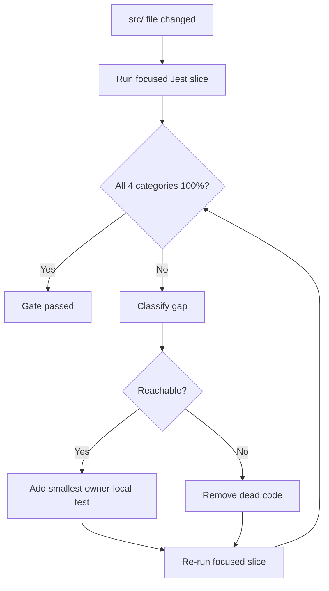

> **Search policy:** Follow the Cortex-First Search Policy from the `research-methodology` skill. Prefer Cortex MCP tools (`search_corpus`, `search_context`, `search_advanced`, `load_chunk`, `traverse_graph`) over native tools (`grep`, `glob`, `view`). Use native tools only as fallback when Cortex is degraded.

# Coverage Guard Playbook

Use this skill as a **mandatory enforcement gate** after any change to `src/`
files. Its job is to confirm that 100% coverage — all four categories:
statements, branches, functions, and lines — is still intact for every file
touched by the change. If coverage dropped, this skill fixes the gap before
reporting done.

Coverage is not a goal to approach. It is a baseline to defend. No `src/`
change is complete until the files it touched are verified at 100%.

## When to Use

Invoke `coverage-guard` after **every** workflow that edits `src/` code:

- after `test-fix-workflow` repairs test failures,
- after `solid-split` refactors a module boundary,
- after `architecture-builder` adds or extends a builder,
- after `onnx-work`, `performance-optimization`, `browser-build`, or any
  other skill that touches production code in `src/`,
- after any direct implementation work that adds, removes, or changes a
  code path in `src/`.

Do **not** use this skill instead of `coverage-tranche`. This skill is the
post-change gate; `coverage-tranche` is the forward-progress workflow for
files that are already passing but have not yet reached 100%.

## When NOT to use

Do NOT use for coverage expansion on passing code - use `coverage-tranche` instead. Do NOT use for writing new tests from scratch - use `creating-unit-tests` instead.

## Workflow Diagram



## Task Packet

Pass a compact packet that includes:

- the list of `src/` files changed by the preceding work,
- the most recent green baseline (suite count, test count),
- whether this is a routine post-change check or a regression repair.

Compact example:

```text
Use coverage-guard after the solid-split of src/neat/selection/.
Changed files: selection.ts, selection.core.ts, selection.types.ts.
Baseline: 296 suites / 2570 tests green.
Mode: post-change check.
```

## Required Workflow

The full test suite (`npm test`, `npm run test:silent`, `npm run jest:esm-ts`,
`npm run jest:mjs`) is large and slow. **Never run it speculatively.** Start
with focused Jest slices for each changed file. Only run the repo-wide suite
when the user or active step packet explicitly requires repo-wide confirmation;
otherwise, record the focused slice results as the coverage-guard evidence and
note that the full suite was intentionally skipped.

### Step 1 — Identify changed files

List every `src/` file modified by the preceding code change. Exclude test
files, generated READMEs, and config files — only production source files
under `src/` require coverage verification.

### Step 2 — Run focused coverage for each changed file

For each changed file, run a focused Jest slice:

```bash
npx jest --config=jest.config.mjs --no-cache --coverage \
  --testPathPattern=<nearest-test-file-for-boundary>
```

Read the output and confirm all four categories are at 100%:

- Statements: 100%
- Branches: 100%
- Functions: 100%
- Lines: 100%

A file is only clear when all four categories show 100%.

### Step 3 — Classify and fix any gap

If any category is below 100%, classify the uncovered path before acting:

**Reachable live path** — a legal combination of inputs can reach it:

- Add the **smallest** owner-local test that exercises it.
- Add it to the nearest existing test file for that boundary.
- Never create a new test file when an owner-local file already exists.
- One `it()` block, one top-level `expect(...)` (single-expect rule).
- Re-run the focused slice to confirm 100%.

**Dead code** — no legal input can reach it:

- Remove the unreachable production branch.
- Do not write a contorted test to force an unreachable path.
- Note the removal so the decision is visible in the change.
- Re-run the focused slice to confirm 100%.

When in doubt, read the source file and the call sites before classifying.
Prefer removing dead code: this repo has found real bugs through dead-code
removal.

### Step 4 — Repeat for every changed file

Work through every changed file. Do not move to the repo-wide suite until
every file in the change set is at 100%.

### Step 5 — Run the repo-wide suite (only when explicitly required)

After all changed files are verified at 100%, run the repo-wide suite **only if**
the active step packet or user explicitly requires repo-wide confirmation:

```bash
npm run test:silent
```

If the full suite is required, confirm it is green and that the baseline has not
regressed. If new failures appear, resolve them with `test-fix-workflow` before
marking this gate passed.

If repo-wide confirmation is **not** required, report the focused slice results
as the final coverage-guard evidence and note that the full suite was
intentionally skipped.

### Step 6 — Report

State clearly:

- which files were checked,
- which were already at 100% (no action needed),
- which had gaps and how each was resolved (live path → test added, dead
  code → branch removed),
- the final repo-wide suite result,
- the new green baseline (suite count, test count).

## Coverage Regression Rules

A **coverage regression** is any change that causes a `src/` file to drop
below 100% in any of the four categories. Regressions are always bugs in
the change, not acceptable tradeoffs.

Sources of regression:

- Adding a new code path without adding a test for it.
- Refactoring a module boundary that separates previously tested code from
  its test file.
- Removing a test while the production branch it covered still exists.
- Adding a conditional branch that no existing test exercises.

When `solid-split` or similar refactors move code, the coverage obligation
moves with it. Ownership of a path's test coverage belongs to the file that
now owns the path.

## Interaction with Other Skills

| Skill                      | Coverage obligation                                        |
| -------------------------- | ---------------------------------------------------------- |
| `test-fix-workflow`        | Run `coverage-guard` after all fixes are green             |
| `solid-split`              | Run `coverage-guard` on every file moved or created        |
| `architecture-builder`     | Run `coverage-guard` on every new or modified builder file |
| `onnx-work`                | Run `coverage-guard` on every changed `src/` file          |
| `performance-optimization` | Run `coverage-guard` on every changed `src/` file          |
| `browser-build`            | Run `coverage-guard` on every changed `src/` file          |
| `coverage-tranche`         | Already enforces 100% per file — no separate gate needed   |

## Dead Code Rule

When a gap is unreachable:

- Remove the branch. Do not preserve unreachable code to avoid a test.
- Record what was removed so the rationale is clear.
- This repo treats dead-code removal as a correctness improvement, not a
  cosmetic cleanup. Several real bookkeeping bugs have been discovered this
  way.

## Single-Expect Rule

Every new `it()` block must contain **exactly one top-level `expect(...)`**.
Group by scenario, not by assertion count.

## Before / After Examples

**Before:**

```ts
// New branch added with no test — branches drop to 83%
function validate(input: unknown): Result {
  if (Array.isArray(input)) {
    return foldArray(input); // uncovered
  }
  return foldScalar(input);
}
```

**After:**

```ts
// Smallest owner-local test added to the nearest existing test file — back to 100%
it('folds array input', () => {
  const result = validate([1, 2, 3]);
  expect(result).toEqual(expected);
});
```

## Guardrails

- Do not accept partial coverage. 99% is not passing.
- Do not write a test whose only purpose is to inflate a metric.
  If a path is unreachable, remove it.
- Do not run the repo-wide suite speculatively. Only run it when the user or active step packet explicitly requires repo-wide confirmation.
- Do not mark the gate passed until every changed `src/` file is at 100% from focused slices.
- Do not create a new test file when an owner-local test file exists for
  the boundary.
- Do not modify `jest.config.mjs` or other runner configuration.
- Do not treat a focused-run pass as a substitute for the repo-wide suite.
- Do not carry over unresolved coverage gaps to the next session. Each
  change must close with 100% before the session ends.

## Expected Final Output

A clear gate report states:

- files checked and their before/after coverage per category,
- any gaps found and how each was resolved,
- repo-wide suite result,
- new green baseline.

If the gate cannot be fully closed in one session (rare, multi-file
refactor), leave a `NEXT:` item in the relevant plan document describing
the remaining files and their specific uncovered paths, so the next session
can pick up precisely where this one stopped.
