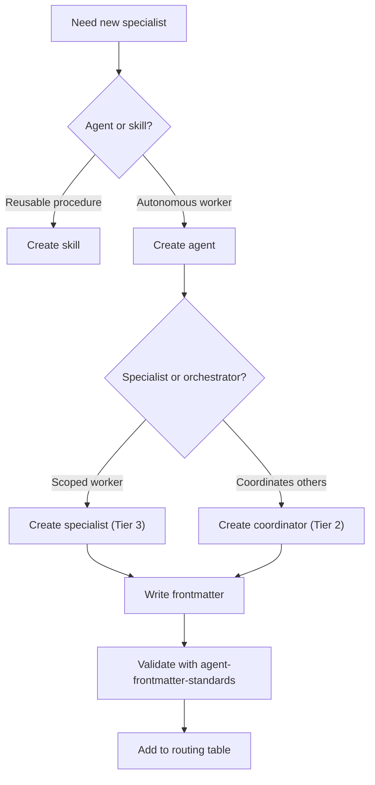
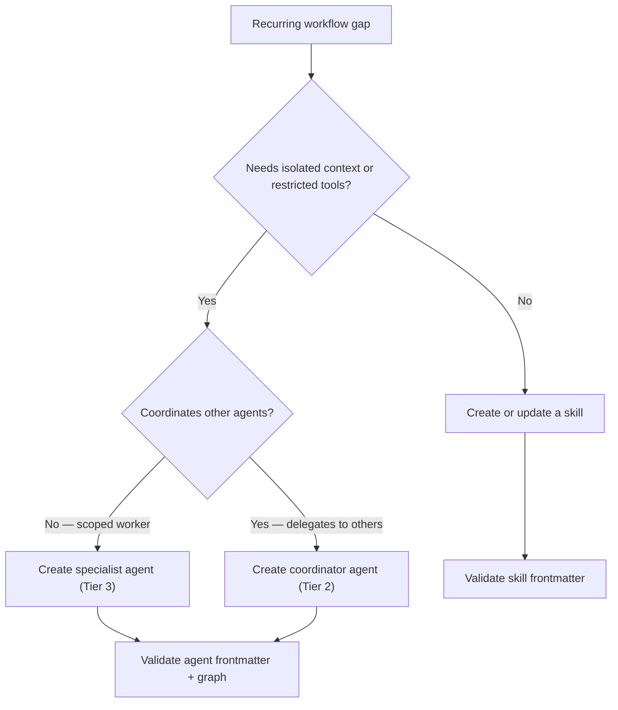

> **Search policy:** Follow the Cortex-First Search Policy from the `research-methodology` skill. Prefer Cortex MCP tools (`search_corpus`, `search_context`, `search_advanced`, `load_chunk`, `traverse_graph`) over native tools (`grep`, `glob`, `view`). Use native tools only as fallback when Cortex is degraded.

# Creating Specialist Agent

This skill scaffolds new hidden specialist or auxiliary `.agent.md` files in the NeatapticTS customization system. A specialist agent owns exactly one narrow, reusable job; this skill ensures it has the correct tool set, model tier, output contract, bounded delegation, and parent routing before validation.

## When to Use

- A recurring workflow gap cannot be addressed by a skill because it needs isolated context, restricted tool access, or model-tier separation.
- An orchestrator is carrying specialist logic that should be extracted into a dedicated hidden agent.
- A new SDLC phase needs an auxiliary agent (e.g., a coverage-guard specialist or a docs-scout).
- Building a before/after split where the new agent takes over one responsibility from an existing overloaded agent.
- Preparing a companion agent that performs read-only recon and hands off to a skill.

## When NOT to use

Do NOT use for splitting an existing monolithic agent - use `splitting-monolithic-agent` instead. Do NOT use for skill creation - skills and agents are different customization types.

## Workflow Diagram



## Task Packet

Include the job the new specialist will own, the parent orchestrator that will call it, the required tools, the model tier, and the structured output contract fields.

```text
Use creating-specialist-agent for <specialist-job-description>.
Parent orchestrator: <agent-name>
Required tools: <list of VS Code tool names>
Model tier: <e.g. glm-5.2:cloud (ollama)>
Output contract fields: <field names the parent expects>
Validate with: node scripts/agent-customization/validate-agent-frontmatter.mjs --json
             node scripts/agent-customization/validate-agent-graph.mjs --json
```

## Required Workflow

1. Decide whether a skill would suffice; prefer a skill over an agent when no isolated context or tool restriction is needed.
2. Draft the specialist's single-sentence job statement: one narrow, reusable responsibility.
3. Define the narrowest tool set required; omit any tool that the specialist does not directly use.
4. Set `user-invocable: false` and `disable-model-invocation: false`.
5. Set `agents: []` unless the specialist itself needs to delegate; if delegation is needed, list only the required subagents explicitly.
6. Choose a model tier appropriate to the task complexity; document the rationale.
7. Define a compact structured output contract (JSON fields or markdown sections) that the parent orchestrator can consume.
8. Add the new agent to the smallest parent allow-list (`agents: [...]`) that legitimately needs it; do not add it to all orchestrators by default.
9. Run `node scripts/agent-customization/validate-agent-frontmatter.mjs --json` to confirm frontmatter correctness.
10. Run `node scripts/agent-customization/validate-agent-graph.mjs --json` to confirm the delegation edge is correctly registered.

## Before/After Example

**Before (vague agent scope):**

```yaml
---
name: helper
description: 'Helps with stuff'
tier: 3
---
```

**After (precise specialist scope):**

```yaml
---
name: coverage-scout
description: 'Identify the next coverage tranche target from lcov.info and map uncovered paths to source files.'
tier: 3
user-invocable: false
tools:
  - neataptic-cortex-mcp-search_corpus
---
```

## Decision Tree



## Guardrails

- Do not create a specialist agent when a skill would accomplish the same job; agents carry more routing overhead.
- Do not use `agents: '*'` or omit `agents`; always use an explicit allow-list.
- Do not copy durable workflow procedure into the agent body; put it in a skill and have the agent invoke the skill by name.
- Do not add the new agent to every orchestrator's allow-list; restrict to the smallest set that needs it.
- Do not use an unqualified or invented model string; validate against the model-routing-and-budget skill.
- Do not skip graph validation; an orphaned agent that no parent lists will never be called.

## Expected Final Output

- A new `.github/agents/<specialist-name>.agent.md` with correct frontmatter, tool list, model, and output contract.
- Parent orchestrator's `agents` allow-list updated to include the new specialist.
- `validate-agent-frontmatter.mjs --json` and `validate-agent-graph.mjs --json` both pass cleanly.
- Model choice and output contract rationale recorded in the active plan.
