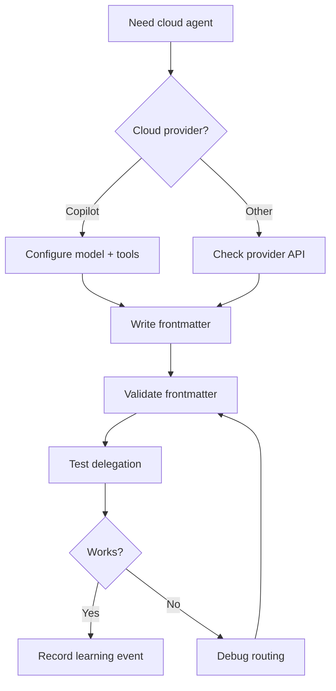
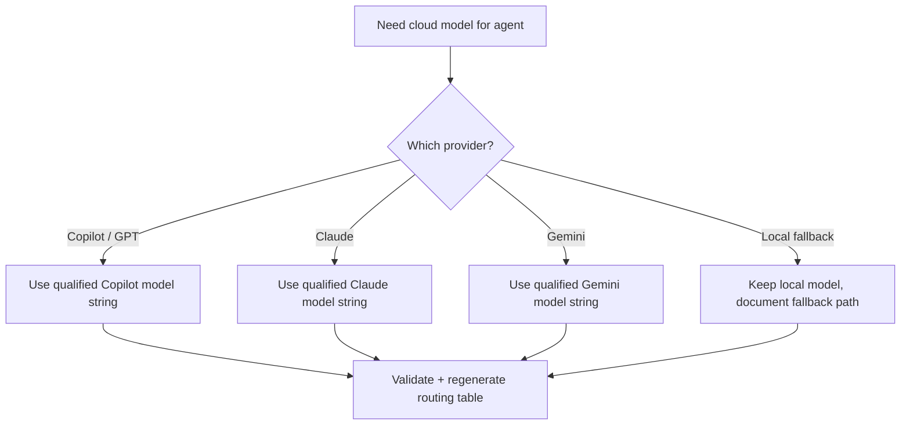

> **Search policy:** Follow the Cortex-First Search Policy from the `research-methodology` skill. Prefer Cortex MCP tools (`search_corpus`, `search_context`, `search_advanced`, `load_chunk`, `traverse_graph`) over native tools (`grep`, `glob`, `view`). Use native tools only as fallback when Cortex is degraded.

# Customize Cloud Agent

This skill owns the durable workflow for customizing cloud-based model routing in NeatapticTS agents. It covers model name validation, cloud fallback configuration, tier-appropriate model budgeting, and safe switching between local and cloud execution. When an agent needs to move from a local model to a cloud model — or validate that a cloud model reference is correct — this skill provides the canonical checklist and validation steps.

## When to Use

- An agent's `model` frontmatter field needs to switch from a local model to a cloud fallback.
- A cloud model name reference needs validation against the qualified model list.
- Model budget or tier routing needs adjustment after an agent's responsibilities change.
- A cloud fallback escalation path needs to be documented in the agent body.
- An agent's `disable-model-invocation` flag needs review after a cloud model swap.
- The routing table needs regeneration after a model customization change.


## When NOT to use

Do NOT use for model selection alone - use `model-routing-and-budget` instead. Do NOT use for frontmatter validation - use `agent-frontmatter-standards` instead.


## Workflow Diagram



## Task Packet

Pass a compact packet that names the agent, the current model, the target model, and the reason for the change.

```text
Use customize-cloud-agent for <agent-name>.
Current model: <model-string>
Target model: <model-string>
Reason: <budget|fallback|tier-correction|deprecation>
Tier: <tier-number>
Validate with: node scripts/agent-customization/validate-agent-frontmatter.mjs --json --agent .github/agents/<agent>.agent.md
```

## Required Workflow

1. Read the target agent's frontmatter to confirm the current `model` field and tier.
2. Consult `model-routing-and-budget` skill for tier-appropriate model selection rules.
3. Verify the target cloud model name is valid using the qualified model list.
4. Update the agent's `model` frontmatter field.
5. If the agent body references the model or has cloud fallback guidance, update those references.
6. Run `node scripts/agent-customization/validate-agent-frontmatter.mjs --json --agent .github/agents/<agent>.agent.md` to validate.
7. Run `npm run agents:routing-table` to regenerate the routing table.
8. Run `neataptic-gate-mcp:run_gate_check --gate=routing-table-freshness` to confirm the table is current.
9. Record a learning event if the customization reveals a reusable pattern or gap.

## Model Validation Rules

- Cloud model names must use the qualified format: `<model-id>:cloud (ollama)` or equivalent provider tag.
- Tier 1 agents may use cloud models with user-invocable access.
- Tier 2-4 agents use cloud models only when local context or reasoning limits require fallback.
- `disable-model-invocation: false` is required for cloud-model agents that need autonomous dispatch.
- Every cloud model swap must regenerate the routing table before the change is considered complete.

## Coordination with Other Skills

| Skill | Handoff Condition |
| ----- | ----------------- |
| `model-routing-and-budget` | When tier routing rules or budget thresholds need authoritative reference |
| `agent-frontmatter-standards` | When frontmatter structure validation is needed after a model change |
| `capturing-learning-event` | When a model customization reveals a reusable pattern or gap |
| `routing-optimization-policy` | When routing table optimization is needed after multiple model swaps |

## Decision Tree



## Before / After Examples

**Before:**
```yaml
---
name: my-agent
model: claude-3.5-sonnet:local
---
```

**After:**
```yaml
---
name: my-agent
model: gpt-4o:cloud (ollama)
disable-model-invocation: false
---
```

## Guardrails

- Do not change a Tier 1 agent to a cloud model without confirming `user-invocable: true` is still appropriate.
- Do not leave stale local model references in the agent body after a cloud swap.
- Do not skip routing table regeneration after any model field change.
- Do not change `disable-model-invocation` without testing that the agent still dispatches correctly.
- Do not edit the routing table directly; always regenerate it from frontmatter.
- Follow `tracker-handoff` when updating plan/log files after model customization.

## Expected Final Output

A strong customize-cloud-agent pass should report:

- the agent customized and the model change made,
- the validated frontmatter output,
- the regenerated routing table freshness evidence,
- whether any agent body references needed updating,
- whether a learning event was captured,
- the final gate check results.