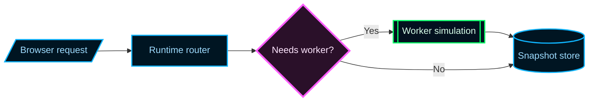
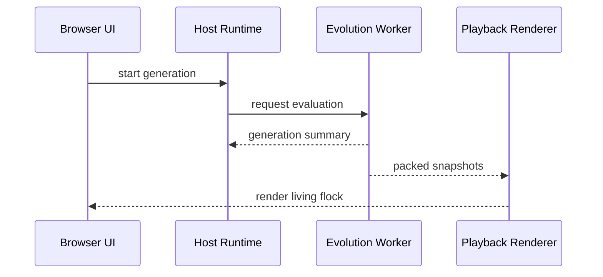
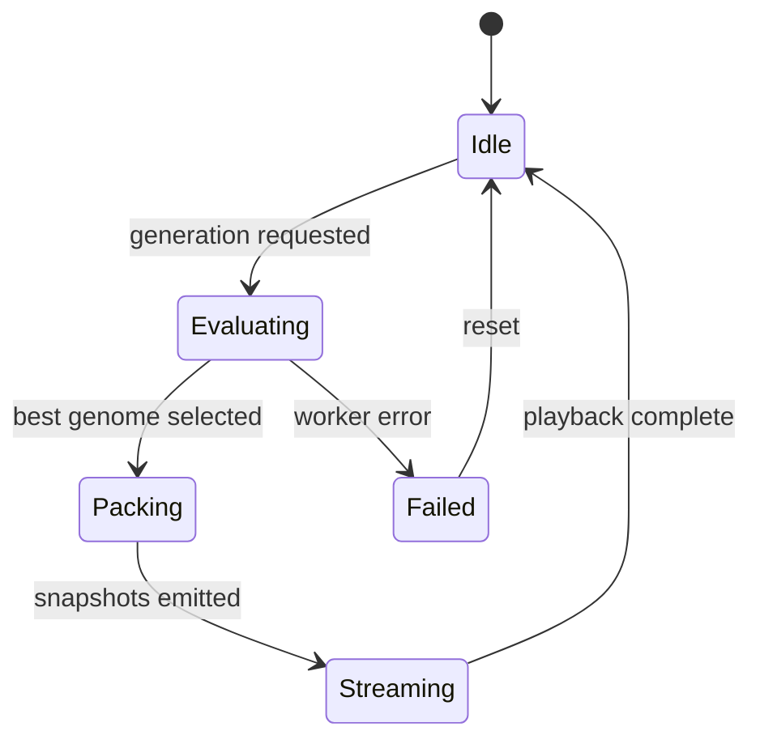
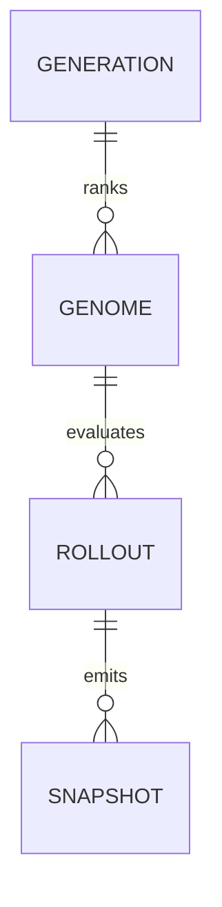
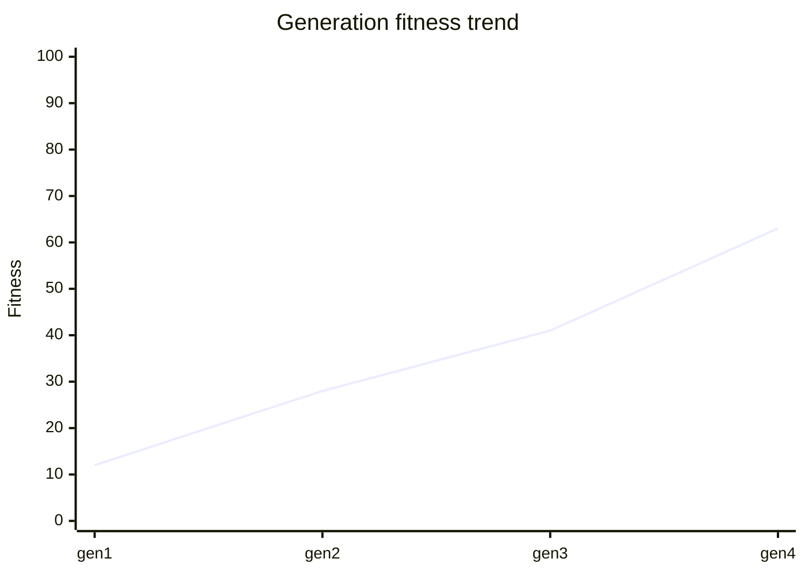

# Mermaid Diagram Playbook

Use this guide when educational documentation would be clearer with diagrams,
charts, or other visual structure.

## Principle

Prefer Mermaid Markdown when a diagram can teach structure, flow, or tradeoffs
faster than prose alone.

Treat GitHub README rendering as the primary compatibility target unless the
task explicitly says the diagram only needs to work in the generated HTML docs.

The goal is not to decorate a README. The goal is to make invisible structure
visible.

The default visual language for this repo should mirror Astro Bird's
neon-retro-arcade palette: dark backgrounds, electric blue structure lines,
cool readable labels, and restrained glow on the one component that deserves
the reader's attention.

## Default Policy

When a module is non-trivial, assume that at least one visual may be useful.
Actively consider diagrams for:

- architecture overviews,
- execution paths,
- data flows,
- decision logic,
- lifecycle or state transitions,
- entity relationships,
- protocol timelines,
- ranking or prioritization views,
- simple quantitative trends.

If the diagram would merely restate a short paragraph, do not add it.

## GitHub-First Compatibility

Most diagrams in this repo are likely to be read first on GitHub in Markdown
README surfaces. Author Mermaid with that surface in mind first, then let the
generated HTML docs be the enhancement layer.

Working rules:

- Prefer Mermaid syntax that is widely supported by GitHub's Markdown renderer.
- Prefer stable diagram families over newer or evolving Mermaid types when both
  can teach the same idea.
- Do not rely on repo-local Mermaid bootstrapping, custom theme injection, or
  docs-site-only runtime behavior to make a README diagram understandable.
- Assume GitHub may use a different Mermaid version or theme than the generated
  docs site.
- If a diagram only becomes legible after heavy styling, simplify the diagram.

Decision rule:

- If the primary surface is a GitHub README, choose the most conservative
  Mermaid syntax that still teaches well.
- If exact visual fidelity across GitHub, generated HTML docs, screenshots, or
  PDFs matters more than Markdown-native rendering, consider static export.

## Diagram Selection Matrix

### Use flowcharts for

- architecture overviews,
- control flow,
- decision trees,
- pipeline stages,
- "where does this element sit in the system?" views,
- bounded subsystem maps.

Flowcharts are the best default choice for repo documentation because they can
show boundaries, branches, and high-level orchestration in one view.

### Use sequence diagrams for

- request lifecycles,
- worker or process handoffs,
- browser-to-worker or service-to-service interactions,
- retry, timeout, parallel, and critical-region behavior,
- message ordering where timing matters.

### Use class diagrams for

- conceptual object models,
- public type relationships,
- service or facade ownership,
- interface and implementation maps.

Use class diagrams for structure, not for runtime flow.

### Use state diagrams for

- lifecycle transitions,
- mode switches,
- finite-state behavior,
- nested state logic,
- concurrency in stateful systems.

### Use ER diagrams for

- domain entities,
- storage-facing relationships,
- ownership, containment, and multiplicity,
- schema-like conceptual models.

### Use user journey diagrams for

- reader-facing or operator-facing journeys,
- staged user flows,
- narrative walkthroughs where sentiment or friction matters.

### Use mindmaps for

- concept decomposition,
- taxonomy exploration,
- high-level learning maps,
- brainstorming-style educational overviews.

### Use timeline or gantt for

- historical evolution,
- staged migrations,
- rollout order,
- roadmap explanation.

### Use quadrant charts for

- prioritization,
- tradeoff positioning,
- "high value / high complexity" style analysis,
- risk versus payoff framing.

### Use xychart for

- simple trends,
- before/after comparisons,
- performance changes over categories or time,
- paired bar and line views.

### Use pie charts sparingly for

- high-level proportional breakdowns with very few categories.

### Use architecture, C4, sankey, radar, treemap, and other newer Mermaid types carefully

Some Mermaid diagram families are newer, flagged, or evolving. Prefer them only
when they clearly beat a flowchart or sequence diagram for clarity and when the
target surface does not require conservative GitHub-first compatibility.

## Mermaid-First, But Not Mermaid-Only

Use Mermaid when it is the best educational tool. Use plain Markdown tables when
that is clearer.

Examples:

- For comparison matrices, use Markdown tables.
- For dense numeric evidence, combine a short Markdown table with an `xychart`.
- For true heatmap-like communication, Mermaid may not be the best fit. Prefer a
  Markdown table, a quadrant chart, a treemap, or a more explicit narrative if
  Mermaid cannot express the idea cleanly.

Do not force every visual problem into Mermaid syntax.

If GitHub Markdown readability is the main goal and Mermaid would become too
fragile, too dense, or too version-sensitive, prefer a Markdown table or a
simpler diagram.

## Diagram Craft Rules

### One diagram, one question

Each diagram should answer one main question.

Good examples:

- How does training flow through the Flappy Bird example?
- Which boundary owns simulation authority?
- What states can this worker runtime enter?
- How does a request move from browser to worker to playback renderer?

### Prefer stable nouns and short labels

- Keep node labels short.
- Use aliases when diagram syntax needs short ids.
- Move nuance into notes, surrounding prose, or captions.

### Use subgraphs and grouping deliberately

Subgraphs are valuable for:

- ownership boundaries,
- module grouping,
- browser versus worker separation,
- main-thread versus background responsibilities.

### Match diagram direction to reading intent

- Use `LR` when explaining pipelines or left-to-right architecture.
- Use `TB` when explaining staged control flow or hierarchy.
- Use local subgraph directions only when they improve clarity.

### Style only when it teaches

- Use `classDef` or simple styling to distinguish categories such as facade,
  worker, storage, runtime, or hazard.
- Avoid rainbow diagrams.
- Color should encode meaning, not taste.
- Keep structure blue-led by default so diagrams feel consistent across docs.
- Use warm or pink accents only for the single key highlight, branch, or
  component the prose is emphasizing.
- Preserve contrast first; the diagram should remain readable with glow removed.
- Remember that GitHub will not apply this repo's custom Mermaid initialization,
  so the unassisted diagram must still read clearly.

### Default Astro Bird styling profile

Unless the surface already has a stronger local convention, use these defaults:

- Canvas assumption: dark background.
- Base node fill: `#001522`.
- Base node stroke: `#0fb5ff`.
- Base text color: `#9fdcff`.
- Base edge color: `#00e5ff`.
- Success or active path: `#00ff66`.
- Warning or hot path: `#ff9a2e`.
- Spotlight highlight: `#ff5cff` or `#ff4a8d`.

This keeps docs visually aligned with Astro Bird's HUD and network views rather
than drifting into random neon palettes.

### Use notes to carry non-obvious semantics

Notes are useful for:

- invariants,
- hidden assumptions,
- performance caveats,
- ownership warnings,
- exceptions to the main flow.

## Mermaid Syntax Guidance

### Flowcharts

Prefer modern shape syntax when semantics matter.

GitHub-first note:

If a standard node shape communicates the idea well enough, prefer it over
newer shape syntax. Use advanced shape syntax only when it materially improves
understanding and has been validated for the target surface.

Example:

Use semantic shapes such as `diamond`, `cyl`, `subproc`, and `lean-r` when they
make the diagram easier to parse.

### Sequence diagrams

Use sequence diagrams when order matters more than topology.

Example:

### State diagrams

Use `stateDiagram-v2` for lifecycle explanation.

Example:

### ER diagrams

Use ER diagrams when multiplicity is part of the explanation.

Example:

### XY charts

Use `xychart` for simple quantitative storytelling.

Example:

## Mermaid Caveats

- The word `end` can break some Mermaid grammars if used carelessly in labels.
- Flowcharts can misread `o` or `x` at the start of linked node text as special
  edge syntax.
- Interactive `click` callbacks depend on looser security settings and are not a
  safe default for public documentation.
- Some newer Mermaid diagram families are still evolving; prefer stable types
  first.
- Large diagrams become unreadable quickly. Split them instead of cramming more
  detail into one canvas.

## Validation Workflow

Before finalizing a Mermaid diagram:

1. Ask whether the diagram teaches something prose cannot teach as quickly.
2. Check that labels are short and consistent with repo terminology.
3. Ask whether the primary reading surface is GitHub Markdown, generated HTML
  docs, or both.
4. Verify the syntax in a Mermaid-capable renderer when the diagram is complex.
5. Prefer the `renderMermaidDiagram` tool for fast validation when available.
6. Re-read the surrounding prose and make sure the diagram is introduced and
   interpreted, not dropped in without context.

## Educational Heuristics

Add diagrams aggressively when they reduce confusion around:

- module boundaries,
- worker splits,
- control loops,
- stateful runtimes,
- shared evaluation pipelines,
- ranking and selection stages,
- data ownership,
- where a public facade sits relative to internal helpers.

Be more conservative when the topic is:

- a tiny utility,
- a simple constant file,
- a single pure helper function,
- a concept already obvious from a four-line example.

## Contrast And Glow Rules

- Use glow only to reinforce the most important element, not as a default for
  all nodes or edges.
- Keep small labels in high-contrast cool tones such as `#9fdcff`, `#d8ffe9`,
  or `#ffffff`.
- Avoid saturated fills behind dense labels.
- If a diagram starts to feel more like poster art than technical guidance,
  simplify the styling.
- Prefer one highlighted path over many equally bright accents.

## Source Notes

This playbook is informed by Mermaid's documentation and current syntax family,
including flowcharts, sequence diagrams, class diagrams, state diagrams, ER
models, and `xychart`.

Useful references:

- Mermaid contributors, "About Mermaid," https://mermaid.js.org/intro/
- Mermaid contributors, "Flowcharts - Basic Syntax," https://mermaid.js.org/syntax/flowchart.html
- Mermaid contributors, "Sequence diagrams," https://mermaid.js.org/syntax/sequenceDiagram.html
- Mermaid contributors, "Class diagrams," https://mermaid.js.org/syntax/classDiagram.html
- Mermaid contributors, "State diagrams," https://mermaid.js.org/syntax/stateDiagram.html
- Mermaid contributors, "Entity Relationship Diagrams," https://mermaid.js.org/syntax/entityRelationshipDiagram.html
- Mermaid contributors, "XY Chart," https://mermaid.js.org/syntax/xyChart.html
