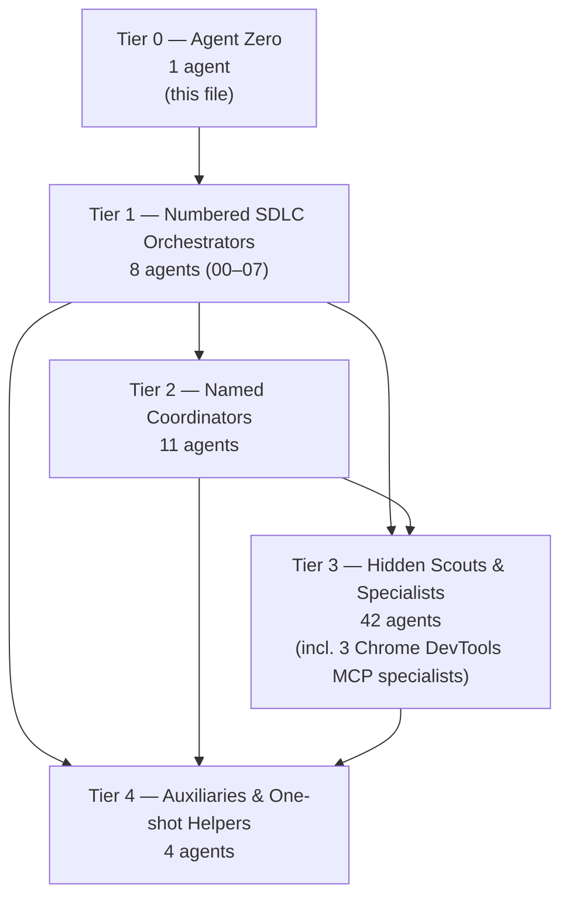
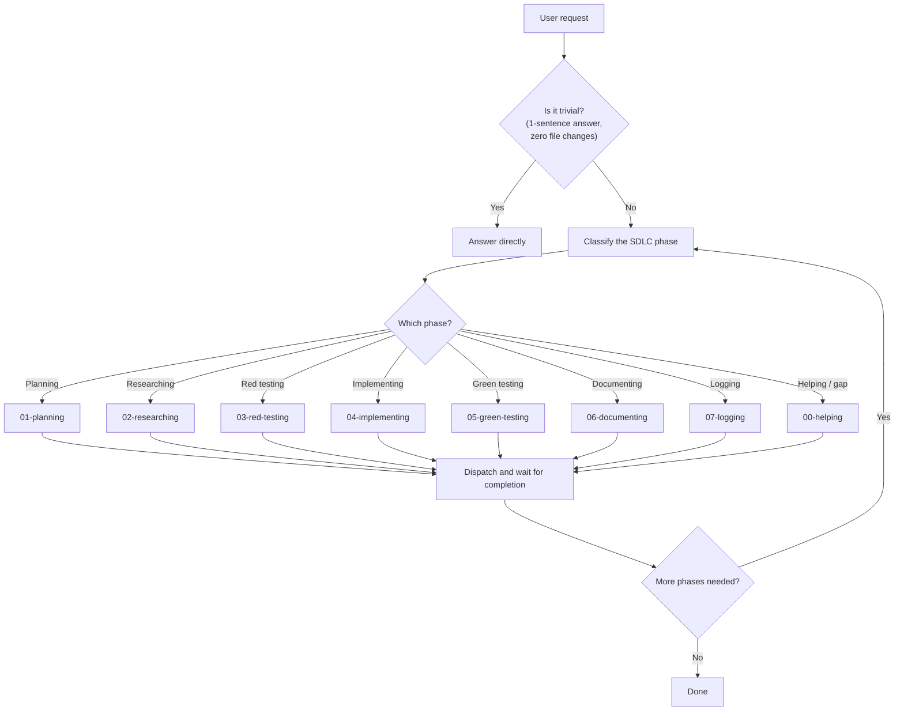
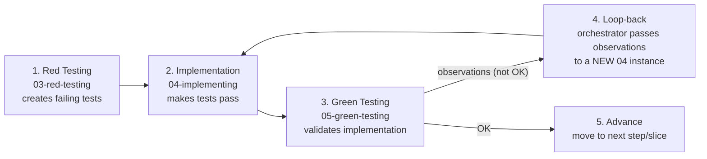

# Execute Playbook

This skill is the canonical delegation enforcement layer for the NeatapticTS
multi-tier agent orchestration system. It owns the tier graph, delegation
rules, goal-to-agent mapping, routing decision flowchart, and the sliced
implementation orchestration protocol (the strict RED → IMPLEMENT → GREEN
loop). Every Tier 0, Tier 1, and Tier 2 agent MUST include this skill so
that delegation decisions are consistent across the entire system.

The mandate is simple: **no orchestrator should do work it can delegate.**
The cost of over-delegation is low; the cost of over-execution is drift.
When in doubt, delegate.

## When NOT to use

Do NOT use for trivial tasks that can be answered in one sentence with zero file changes - handle those directly. Do NOT use for routing table validation - use `routing-optimization-policy` instead.

## Section 1 — Tier Graph

The NeatapticTS agent system is organized into five tiers. Each tier has a
strict delegation direction — agents may only delegate to lower-numbered
tiers, never upward, except via the `00.cross-tier-helper` escape hatch.

Agent counts are maintained by
`scripts/agent-customization/inventory-customizations.mjs` and the canonical
routing table at `.github/agent-skill-routing-table.md` (generated by
`npm run agents:routing-table`). The counts below reflect the current
inventory including the three Chrome DevTools MCP specialists.



### Tier Summaries

| Tier   | Role                                | Count | Delegation Direction |
| ------ | ----------------------------------- | ----- | -------------------- |
| Tier 0 | Agent Zero (root orchestrator)      | 1     | → Tier 1             |
| Tier 1 | Numbered SDLC Orchestrators (00–07) | 8     | → Tier 2, 3, 4       |
| Tier 2 | Named Coordinators                  | 11    | → Tier 3, 4          |
| Tier 3 | Hidden Scouts & Specialists         | 42    | → Tier 4 only        |
| Tier 4 | Auxiliaries & One-shot Helpers      | 4     | may not delegate     |

## Section 2 — Delegation Rules

The delegation direction is strictly downward. No agent may call a
higher-numbered tier except through the explicit `00.cross-tier-helper`
escape hatch, which exists for legitimate upward escalation only.

- **Tier 1** may delegate to Tier 2, Tier 3, or Tier 4.
- **Tier 2** may delegate to Tier 3 or Tier 4.
- **Tier 3** may delegate to Tier 4 only.
- **Tier 4** may not delegate to any agent.
- **No tier** may call a higher-numbered tier except via
  `00.cross-tier-helper`.
- **`user-invocable: true`** is valid only for Tier 1 agents. Tier 2, 3,
  and 4 agents are hidden specialists that receive work only through
  delegation, never direct user invocation.

### Delegation Mandate

> No orchestrator should do work it can delegate. The cost of
> over-delegation is low; the cost of over-execution is drift. When in
> doubt, delegate.

This mandate exists because orchestrators that execute domain work directly
tend to accumulate scope drift, skip validation gates, and lose the
benefits of fresh-context specialist execution. A delegated specialist
runs in a clean context window, produces a bounded artifact, and returns
a concise result — keeping the orchestrator's context lean and the work
boundary crisp.

## Section 2.1 — Dispatch Packet MCP Server (mandatory)

The `neataptic-dispatch-mcp` server is a read-only helper that turns a
proposed delegation into a validated dispatch packet. **Every Tier 0, Tier 1,
and Tier 2 orchestrator MUST consult `neataptic-dispatch-mcp` before
deleting to any agent.** The server does **not** spawn subagents; it validates
the request and returns the exact packet to use with the `task` tool.

For the canonical mapping from `goal` values to Tier-1 target agents, see
Section 3 — Goal-to-Agent Mapping Table.

### Why consultation is mandatory

Direct use of the `task` tool without first calling
`neataptic-dispatch-mcp / build_dispatch_packet` is a **workflow violation**.
The MCP server is the mechanical enforcement layer for:

- delegation direction (only downward),
- tier allow-lists derived from `.github/agents/*.agent.md` frontmatter,
- the `user-invocable` rule (only Tier 1 agents may be `userInvocable`),
- consistent packet shape for the target agent definition.

If `build_dispatch_packet` returns `dispatch_allowed: false`, stop and escalate
via `00.cross-tier-helper` instead of delegating.

### Tool catalog

| Tool                       | Purpose                                                                                                        |
| -------------------------- | -------------------------------------------------------------------------------------------------------------- |
| `list_dispatchable_agents` | Return a sorted inventory of every dispatchable agent from `.github/agents/*.agent.md`, plus aggregate counts. |
| `build_dispatch_packet`    | Validate a requested delegation and, if allowed, return a structured dispatch packet for the target agent.     |
| `get_dispatch_policy`      | Return the allowed delegation edges and the user-invocable rule summary.                                       |

### `list_dispatchable_agents` response

```json
{
  "agents": [
    {
      "name": "01-planning",
      "tier": 1,
      "model": "...",
      "skills": ["planning"],
      "agents": [],
      "tools": [],
      "userInvocable": true,
      "file": ".github/agents/01-planning.agent.md"
    }
  ],
  "total": 8,
  "tiers": { "1": 8, "2": 11, "3": 42, "4": 4 }
}
```

### `build_dispatch_packet` input

```json
{
  "target_agent": "plan-scout",
  "caller_tier": 1,
  "prompt": "Continue from the active plan.",
  "context_tier": "default"
}
```

- `target_agent` — string, required. Agent name as declared in the frontmatter of a `.github/agents/*.agent.md` file.
- `caller_tier` — integer, required. Tier of the caller: `0` (Agent Zero), `1` (phase orchestrator), `2` (coordinator), `3` (specialist), or `4` (auxiliary).
- `prompt` — string, optional. Embedded verbatim into the dispatch packet; defaults to `""`.
- `context_tier` — string, optional. Either `"default"` or `"long_context"`; defaults to `"default"`.

### `build_dispatch_packet` success response

```json
{
  "ok": true,
  "dispatch_allowed": true,
  "reason": "Tier 0 may delegate to Tier 1",
  "agent": {
    "name": "01-planning",
    "tier": 1,
    "tier_label": "User-invocable phase orchestrators",
    "model": "...",
    "skills": ["planning"],
    "agents": [],
    "tools": [],
    "userInvocable": true,
    "file": ".github/agents/01-planning.agent.md"
  },
  "dispatch_packet": {
    "agent_type": "01-planning",
    "name": "01-planning",
    "description": "...",
    "model": "...",
    "prompt": "Continue from the active plan.",
    "context_tier": "default",
    "skills": ["planning"]
  }
}
```

### `build_dispatch_packet` failure response

```json
{
  "ok": false,
  "dispatch_allowed": false,
  "reason": "Unknown agent 'foo'"
}
```

Common failure reasons:

- `Unknown agent '<name>'` — the target name does not exist in the inventory.
- `caller_tier must be 0, 1, 2, 3, or 4` — the caller tier is out of range.
- `Tier <caller> may not delegate to Tier <target> (target tier must be greater than caller tier)` — the requested delegation is upward or same-tier.
- `userInvocable is only valid for Tier 1 agents; '<name>' is Tier <tier>` — the target has `userInvocable: true` but is not Tier 1.

If `build_dispatch_packet` returns `dispatch_allowed: false`, stop and escalate via
`00.cross-tier-helper` instead of delegating.

### `get_dispatch_policy` response

```json
{
  "allowed_edges": [
    { "from": 0, "to": 1 },
    { "from": 1, "to": 2 },
    { "from": 1, "to": 3 },
    { "from": 1, "to": 4 },
    { "from": 2, "to": 3 },
    { "from": 2, "to": 4 },
    { "from": 3, "to": 4 }
  ],
  "user_invocable_rule": "Only Tier 1 agents may be userInvocable",
  "notes": [
    "This server returns a dispatch packet only; it does not spawn subagents.",
    "Tier 0 (orchestrator) may only call Tier 1 agents."
  ]
}
```

### How the server enforces the rules

1. **Target must exist** — the name must match a registered `.github/agents/*.agent.md` file.
2. **Caller tier must be valid** — only `0`–`4` are accepted.
3. **Delegation must be downward** — `target.tier` must be strictly greater than `caller_tier`.
4. **User-invocable flag is Tier-1 only** — `userInvocable: true` is rejected for any target that is not Tier 1.

### Example `build_dispatch_packet` calls for each Tier-1 agent

When Agent Zero (tier `0`) starts a phase, it calls `build_dispatch_packet`
with `caller_tier: 0` and the target name from the goal-to-agent mapping
table:

```json
{ "target_agent": "00-helping",        "caller_tier": 0, "prompt": "Cross-tier escalation: concurrency limit exceeded." }
{ "target_agent": "01-planning",       "caller_tier": 0, "prompt": "Plan the next implementation step for worker fairness." }
{ "target_agent": "02-researching",    "caller_tier": 0, "prompt": "Map prior art for sparse activation functions." }
{ "target_agent": "03-red-testing",    "caller_tier": 0, "prompt": "Write failing tests for checkpoint save/resume." }
{ "target_agent": "04-implementing",   "caller_tier": 0, "prompt": "Implement slice 4.2 — add rolling snapshot support." }
{ "target_agent": "05-green-testing",  "caller_tier": 0, "prompt": "Validate slice 4.2 against acceptance criteria." }
{ "target_agent": "06-documenting",    "caller_tier": 0, "prompt": "Run docs-quality checks for the recent split." }
{ "target_agent": "07-logging",        "caller_tier": 0, "prompt": "Compress completed phase 3 into logs." }
```

A Tier-1 orchestrator that delegates downward uses its own tier, for example:

```json
{ "target_agent": "plan-scout", "caller_tier": 1, "prompt": "Select the relevant plan for checkpointing." }
{ "target_agent": "docs-scout",  "caller_tier": 1, "prompt": "Find README drift in src/neat/selection/." }
```

### Example consultation flow

```text
1. Map the task's `goal` (or specialist role) to the target agent name using
   Section 3.
2. Call neataptic-dispatch-mcp / list_dispatchable_agents if the exact name
   is unknown.
3. Call neataptic-dispatch-mcp / build_dispatch_packet with the caller's
   tier and the target_agent name.
4. If dispatch_allowed is false, stop and escalate via 00.cross-tier-helper.
5. If dispatch_allowed is true, dispatch the specialist using the exact packet
   returned by the server. Do not fabricate a separate `task` payload.
```

### Example: correct vs incorrect dispatch

**Correct:**

```text
neataptic-dispatch-mcp / build_dispatch_packet
  { "target_agent": "04-implementing", "caller_tier": 0,
    "prompt": "Implement slice 4.2 — add rolling snapshot support." }

→ returns ok: true, dispatch_packet: { agent_type: "04-implementing", ... }

task tool
  agent_type: "04-implementing"
  name: "04-implementing-4-2-rolling-snapshot"
  prompt: "Implement slice 4.2 — add rolling snapshot support."
```

**Incorrect (workflow violation):**

```text
task tool
  agent_type: "general-purpose"   ← violates the agent definition
  name: "some-helper"
  prompt: "Implement slice 4.2 — add rolling snapshot support."
```

The second form bypasses the agent's `.agent.md` definition, its allowed
skills, tools, model, and subagent allow-list, and must not be used.

## Section 3 — Goal-to-Agent Mapping Table

When an orchestrator receives a task packet with a `goal` field, it maps
the goal to the dispatched agent according to the table below. The
`tdd_sequence` field modifies the dispatch pattern for implementation
work.

| `goal` value                                | Dispatched agent   | `tdd_sequence` behavior                                  |
| ------------------------------------------- | ------------------ | -------------------------------------------------------- |
| `planning`                                  | `01-planning`      | Single dispatch                                          |
| `researching`                               | `02-researching`   | Single dispatch                                          |
| `red-testing`                               | `03-red-testing`   | Single dispatch                                          |
| `implementing`                              | `04-implementing`  | Single dispatch (tests already exist)                    |
| `implementing` + `tdd_sequence: red-green`  | 03 → 04 → 05       | Three-phase: red tests, implementation, green validation |
| `implementing` + `tdd_sequence: green-only` | 04 → 05            | Two-phase: implementation, green validation              |
| `green-testing`                             | `05-green-testing` | Single dispatch                                          |
| `documenting`                               | `06-documenting`   | Single dispatch                                          |
| `logging`                                   | `07-logging`       | Single dispatch                                          |
| `helping`                                   | `00-helping`       | Single dispatch                                          |

### Sequence Semantics

- **Single dispatch**: the orchestrator dispatches one agent, waits for
  completion, and processes the result.
- **Three-phase (red-green)**: the orchestrator dispatches `03-red-testing`
  first to create failing tests, then `04-implementing` to make them pass,
  then `05-green-testing` to validate. Each phase is a fresh agent
  instance.
- **Two-phase (green-only)**: the orchestrator skips the red phase (tests
  already exist) and dispatches `04-implementing` then `05-green-testing`.

## Section 4 — Routing Decision Flowchart

When a user request arrives, the orchestrator follows this decision tree to
classify and route the work.



## Section 5 — Sliced Implementation Orchestration Protocol

This section defines the strict RED → IMPLEMENT → GREEN loop that
governs sliced implementation. The orchestrator (Agent Zero or a Tier 1
agent) manages the loop. The implementer does not manage the loop — it
receives a slice, implements it, and returns evidence.

### The RED → IMPLEMENT → GREEN Loop



### Loop Steps

1. **Red Testing** (`03-red-testing`) creates failing tests that define
   expected behavior. The tests must fail for the right reason (missing
   implementation, not a syntax error or bad fixture).
2. **Implementation** (`04-implementing`) implements the code to make the
   tests pass. The implementer works within the slice boundary and does
   not expand scope.
3. **Green Testing** (`05-green-testing`) validates the implementation
   against the red tests and the slice acceptance criteria.
4. **Loop-back**: If green gives observations (not OK), the orchestrator
   passes the observations to a **NEW** `04-implementing` instance (fresh
   context), which produces a fix, then a **NEW** `05-green-testing`
   instance verifies. The loop repeats until green returns OK.
5. **Advance**: When green gives OK, the orchestrator records
   `VALIDATION_EVIDENCE` and moves to the next step or slice.
6. **Phase Compression**: When all steps in a phase are marked `[DONE]` and
   green validation has passed, the orchestrator MUST dispatch `07-logging`
   to compress the completed phase before advancing to the next phase. This
   is a mandatory step, not optional. See **Phase Compression Policy** below.

### Slice Structure

Each slice is a bounded unit of work with these fields:

| Field                 | Description                                            |
| --------------------- | ------------------------------------------------------ |
| `slice_id`            | Unique identifier for the slice within the step        |
| `title`               | Human-readable summary of the slice                    |
| `status`              | `[PLANNED]`, `[WIP]`, or `[DONE]`                      |
| `goal`                | The SDLC goal value (see Section 3)                    |
| `estimate_hours`      | Rough time estimate for the slice                      |
| `files_to_change`     | List of files the slice is allowed to modify           |
| `acceptance_criteria` | Observable conditions that mark the slice done         |
| `parallelizable`      | `true` if the slice can run in parallel with others    |
| `dependencies`        | `slice_id` values that must complete before this slice |
| `next_slice`          | The `slice_id` to proceed to after this one passes     |

### Orchestration Loop Steps

1. Read the active step packet and expand placeholder slice titles into
   full slice objects.
2. Assign the next uncompleted non-parallelizable slice, or all ready
   parallelizable slices, to `04-implementing`.
3. Wait for implementation evidence, then invoke `05-green-testing` to
   validate.
4. If `05` returns failure, spawn a new `04-implementing` with a focused
   `slice-fix` packet and re-run `05` until the slice passes.
5. When a slice passes, record `VALIDATION_EVIDENCE` and move to the next
   slice.
6. After all slices pass, call `06-documenting` to run docs-quality checks
   and close the step.
7. After all steps in a phase are `[DONE]` and green validation has passed,
   dispatch `07-logging` to compress the completed phase to logs before
   advancing to the next phase. See **Phase Compression Policy** below.

### Critical Rules

- **MANDATORY DISPATCH CONSULTATION.** Before each `task` dispatch, the
  orchestrator MUST call `neataptic-dispatch-mcp / build_dispatch_packet`
  and use the returned `dispatch_packet`. Direct `task` use without a prior
  dispatch packet is a workflow violation.
- **The ORCHESTRATOR manages the loop, NOT the implementer.** The
  implementer receives a slice and returns evidence; it does not decide
  when to loop back or advance.
- **Each iteration uses a NEW agent instance** (fresh context) to avoid
  context contamination. A implementer that failed once must not carry its
  failed context into the retry. Each new instance must be dispatched via
  a fresh `build_dispatch_packet` call.
- **If 3 consecutive loop-backs fail to resolve the same issue**,
  escalate to `00-helping` via `00.cross-tier-helper`. Three failures
  signals a scope or plan boundary problem, not an implementation bug.
- **The orchestrator MUST NOT perform code edits itself.** The
  orchestrator's job is to classify, dispatch, wait, and advance — never
  to implement.
- **For `tdd_sequence: green-only` steps**, skip the RED phase and start
  at IMPLEMENT. This is valid only when tests already exist from a prior
  red phase or a pre-existing test file.
- **No Deferred Cleanup.** When a slice involves migration, refactoring,
  or API replacement, the slice MUST remove the old code in the same step.
  Slices that add new code alongside old code without removing the old
  code are PLANNING DEFECTS and must be rejected. No backward-compatibility
  wrappers, no dual-path code, no deferred cleanup — ever.
- **Targeted Tests Only — Never the Full Suite.** Orchestrators and green-
  testing agents MUST NOT run broad regression suites such as
  `npm run test:silent`, `npm test`, or unconstrained `jest` without a
  selector. Full-suite runs can hang for long periods and surface
  pre-existing, unrelated failures that obscure the slice under validation.
  Always run targeted tests with `--testPathPattern`, `--testNamePattern`,
  or an equivalent focused selector that covers only the files or behavior
  changed by the current slice. If a broader validation is genuinely
  required, escalate to `00-helping` for approval rather than running it
  unprompted.

### Phase Compression Policy

When all steps in a phase are marked `[DONE]` and green validation has
passed, the orchestrator MUST dispatch `07-logging` to compress the
completed phase before advancing to the next phase. Compression means:

1. Move detailed step/slice/VALIDATION_EVIDENCE blocks from the plan file
   to the corresponding `.logs.md` file.
2. Replace the detailed content in the plan file with a compact `[DONE]`
   marker and a reference to the logs file.
3. Keep the phase header, goal, and status as `[DONE]` in the plan file.

This keeps plan files lean and focused on active work. Plan files should
never carry verbose `[DONE]` phase details — those belong in logs.

Skipping phase compression is a workflow violation. The orchestrator must
not advance to the next phase until compression is complete.

## Section 5.5 — Concurrency Awareness and Dispatch Resilience

The Copilot CLI enforces a hard concurrent agent limit. When the limit is
reached, new dispatches are blocked with a "Maximum concurrent agent limit
of N reached" warning. Orchestrators MUST handle this gracefully.

### Environment Variables

| Variable                          | Default                | Purpose                        |
| --------------------------------- | ---------------------- | ------------------------------ |
| `COPILOT_SUBAGENT_MAX_CONCURRENT` | Plan-tier-based (2–32) | Maximum concurrent sub-agents  |
| `COPILOT_SUBAGENT_MAX_DEPTH`      | 6                      | Maximum delegation chain depth |

BYOK (Ollama, custom providers) users without a GitHub plan tier default to
the lowest limit (2 concurrent agents). To override, set these as environment
variables in the terminal before launching the CLI:

```bash
# Windows PowerShell (User-level, persists across restarts)
[Environment]::SetEnvironmentVariable("COPILOT_SUBAGENT_MAX_CONCURRENT", "10", "User")
[Environment]::SetEnvironmentVariable("COPILOT_SUBAGENT_MAX_DEPTH", "6", "User")
# Then CLOSE the terminal completely and reopen it.
```

### Dispatch Failure Recovery Protocol

When a dispatch is blocked by the concurrent limit:

1. **Wait and retry**: Wait 10–15 seconds, then retry the dispatch. The
   limit clears when a running agent completes and returns.
2. **Sequential fallback**: If retry fails after 3 attempts, switch from
   nested delegation to flat sequential dispatch. The orchestrator dispatches
   each tier directly (T1→T2, then T1→T3, then T1→T4) rather than nesting
   (T1→T2→T3→T4). This keeps the concurrent count at 2 (orchestrator + one
   dispatched agent).
3. **Escalate**: If both nested and flat dispatch fail, escalate to
   `00-helping` via `00.cross-tier-helper` with a note about the concurrency
   limit.

### Nested vs Flat Dispatch

| Pattern                               | Concurrency Usage   | Chain Depth | When to Use               |
| ------------------------------------- | ------------------- | ----------- | ------------------------- |
| Nested (T1→T2→T3→T4)                  | N+1 slots (N=depth) | Up to 4     | When concurrent limit ≥ 4 |
| Flat sequential (T1→T2, T1→T3, T1→T4) | 2 slots             | 1           | When concurrent limit = 2 |

**With a concurrent limit of 2, nested delegation beyond depth 2 is
impossible** — the orchestrator occupies slot 1, the first dispatched agent
occupies slot 2, and no slot remains for a sub-dispatch. Use flat sequential
dispatch instead.

### Parallelizable Slice Execution

When a step declares `parallelizable: true` slices, the orchestrator may
dispatch multiple slices concurrently up to the concurrent limit. Reserve at
least one slot for the orchestrator:

- Concurrent limit 2: dispatch 1 slice at a time (sequential)
- Concurrent limit 4: dispatch up to 3 slices concurrently
- Concurrent limit 8: dispatch up to 7 slices concurrently
- Concurrent limit 10: dispatch up to 9 slices concurrently

If a parallel dispatch hits the concurrent limit, queue remaining slices and
dispatch them as slots free up.

## Section 5.6 — Tier 3 Dispatch Capability

Not all Tier 3 agents can dispatch to Tier 4. The `agents` frontmatter field
controls which agents each agent may dispatch. Most Tier 3 agents are scouts
that gather evidence and return directly — they have `agents: []` and no
dispatch capability.

### Tier 3 Agents WITH T4 Dispatch

| Agent                           | Can dispatch to                                        |
| ------------------------------- | ------------------------------------------------------ |
| `code-quality-auditor`          | `file-change-summarizer`                               |
| `research-synthesis-specialist` | `acceptance-criteria-writer`, `file-change-summarizer` |

### Design Rationale

Scouts are reconnaissance agents: they map boundaries, find patterns, and
return evidence. They do not orchestrate. Only Tier 3 specialists that
produce structured deliverables (quality audit reports, research synthesis
briefs) need T4 auxiliaries to finalize or summarize their output.

When a scout needs a T4 auxiliary, it should return its findings to the
parent orchestrator (Tier 1 or Tier 2), which dispatches the T4 agent
directly. This flat dispatch pattern works within any concurrent limit.

## Section 6 — Routing Table Reference

The canonical agent routing table lives at
`.github/agent-skill-routing-table.md`. It is generated by
`npm run agents:routing-table` and validated by
`npm run agents:routing-table:gate`.

The table is the single source of truth for:

- agent names,
- tier assignments,
- model routing,
- skill attachments,
- delegation allow-lists.

When delegation rules in this skill and the generated routing table
disagree, the **routing table wins** because it is generated from the live
agent frontmatter inventory. Update the agent frontmatter and regenerate
the table rather than editing this skill to match a stale inventory.

| Action                           | Command                             |
| -------------------------------- | ----------------------------------- |
| Refresh the routing table        | `npm run agents:routing-table`      |
| Validate routing table freshness | `npm run agents:routing-table:gate` |

## Section 7 — Cortex-First Search Policy (Mandatory)

**Cortex MCP tools are the PRIMARY search mechanism for ALL agents.**
Every agent that performs codebase exploration, investigation, or
discovery MUST use Cortex MCP RAG tools as the first choice, not as an
optional alternative. Native tools (`grep`, `glob`, `view`) are
**fallbacks of LAST RESORT**, not peers.

### Required Search Order

When an agent needs to explore or search the codebase, it MUST follow
this order:

1. **`neataptic-cortex-mcp:freshness_check`** — verify index currency
   before any search.
2. **`neataptic-cortex-mcp:search_corpus`** — broad BM25 + dense hybrid
   discovery for initial results.
3. **`neataptic-cortex-mcp:search_advanced`** (with `compact: true`) —
   agent-facing queries with reranking, ranking explanations,
   `read_top_result`, and `follow_up_refs`.
4. **`neataptic-cortex-mcp:search_context`** — token-budgeted context
   window assembly for bounded agent context.
5. **`neataptic-cortex-mcp:load_chunk`** — read full chunk content by ID
   when a specific chunk is needed.
6. **`neataptic-cortex-mcp:load_document`** — load all chunks for a
   known file path when the full file context is needed.
7. **`neataptic-cortex-mcp:traverse_graph`** — entity/dependency graph
   traversal for relationship-aware discovery.
8. **`neataptic-cortex-mcp:expand_query`** — domain-aware query
   expansion when initial results are insufficient.
9. **Native tools (`grep`, `glob`, `view`)** — **LAST RESORT ONLY.**
   Use only when Cortex is degraded, the target is a known exact file
   path, or Cortex returned zero results for a well-formed query.

### Enforcement Rules

- **All Tier 0, Tier 1, and Tier 2 agents** MUST include the
  `research-methodology` skill in their frontmatter `skills:` array.
  This skill contains the full Cortex-First Search Policy.
- **Agent body instructions** MUST contain the standard Cortex-First
  Search Policy section that references `freshness_check` and
  `search_corpus` as primary discovery mechanisms.
- When a delegation decision requires understanding the codebase before
  routing, use Cortex search first. Do not skip reconnaissance just
  because the delegation target seems obvious — a quick Cortex search
  can reveal that the assumed target agent's boundary has shifted.

### Gap Escalation Protocol

If Cortex RAG cannot answer a needed query:

1. **Report the gap** — state what was searched, what was expected, and
   what Cortex returned.
2. **Suggest an RAG enhancement** — identify whether the corpus index is
   stale, the content is not indexed, or the query needs reformulation.
3. **Use native tools as a temporary fallback only** — clearly label
   this as a fallback, not a permanent search strategy.
4. **Flag for `00-helping`** — if the gap is recurring or systematic,
   escalate to `00-helping` via `00.cross-tier-helper` with a structured
   gap report so the RAG pipeline can be improved.

## Section 8 — Chrome DevTools MCP Specialist Quick Reference

Three Chrome DevTools MCP specialists are available for browser-based
measurement. Any agent that needs browser-based measurement,
interaction, or memory profiling should delegate to the appropriate
specialist rather than calling Chrome DevTools MCP tools directly (with
the narrow exceptions listed in the `chrome-devtools-mcp` skill decision
tree).

| Specialist                     | When to Call                                                            |
| ------------------------------ | ----------------------------------------------------------------------- |
| `performance-trace-specialist` | Any performance trace capture or analysis                               |
| `browser-ui-specialist`        | Multi-step UI interaction, DOM verification, console/network inspection |
| `browser-memory-specialist`    | Heap snapshots, memory profiling, leak detection                        |

For the full decision trees covering when to use Chrome DevTools MCP
directly versus when to delegate to a specialist, reference the
`chrome-devtools-mcp` skill. That skill owns the tool catalog,
token-efficient strategies, and the trace capture, DOM interaction, and
memory profiling workflows.
