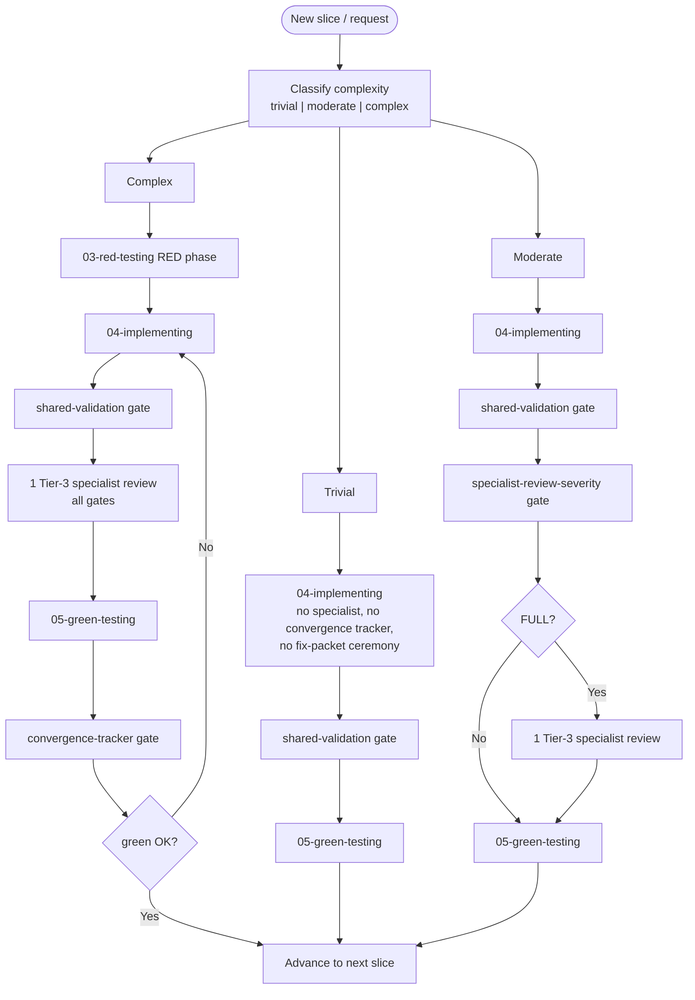

# Execute Playbook

This skill is the canonical delegation enforcement layer for the NeatapticTS
multi-tier agent orchestration system. It owns the tier graph, delegation
rules, goal-to-agent mapping, routing decisions, and the sliced
implementation orchestration protocol (the strict RED → IMPLEMENT → GREEN
loop). Every Tier 0, Tier 1, and Tier 2 agent MUST include this skill so
that delegation decisions are consistent across the entire system.

The mandate is simple: **no orchestrator should do work it can delegate.**
The cost of over-delegation is low; the cost of over-execution is drift.
When in doubt, delegate.

## When NOT to use

Do NOT use for trivial tasks that can be answered in one sentence with zero
file changes — handle those directly. Do NOT use for routing table
validation — use `routing-optimization-policy` instead.

## §1 — Quick Start: Executing a Plan

When invoked with `/execute @plan.md`:

1. **Load the plan** via Cortex `load_document` (the plan path is the
   argument).
2. **Parse `## Mandates`** for pragmatic mode, model strategy, bypass flags.
   Pragmatic mode (if declared) overrides the default ceremony for this plan
   only — see §5.
3. **Parse phases** and their `[PENDING]` / `[WIP]` / `[DONE]` statuses.
4. **Locate the first non-`[DONE]` phase.** Resume from the `next boundary`
   recorded in the plan.
5. **Run the plan-readiness gate** (§8) unless a bypass mandate is active.
   No execution-phase agent may be dispatched until the gate passes.
6. **For each step in the phase:** map the goal to the target agent (§6),
   call `build_dispatch_packet`, dispatch with the step ID + RAG load
   instruction (§4).
7. **Run the shared-validation gate** (§9 step 2a). If it fails, loop back to
   `04-implementing` with the gate's evidence as the fix packet.
8. **Pre-green specialist review** (§10): If FULL, dispatch exactly 1 T3
   specialist. If REQUEST_CHANGES, run the fix-packet loop (§11).
9. **Dispatch `05-green-testing`.** If not OK, fix-packet loop (§11).
10. **Update the plan** (§13): status, evidence, next boundary.
11. **When all steps in a phase are DONE**, dispatch `07-logging` to compress
    the phase to logs.
12. **When the plan is complete**, update with final status + resume point.

Pragmatic mode (if the plan declares `## Mandates`) overrides the ceremony:
broad slices mean one dispatch per phase/step, follow-ups go to the same
idle agent via `write_agent`, and the plan-verification green-light cycle may
be bypassed when authorized. See §5 for the full mandate rules.

## §2 — Tier Graph & Delegation Rules

The NeatapticTS agent system is organized into five tiers. Delegation is
strictly downward — agents may only delegate to lower-numbered tiers, never
upward, except via the `00.cross-tier-helper` escape hatch.

| Tier   | Role                                | Count | Delegates to   |
| ------ | ----------------------------------- | ----- | -------------- |
| Tier 0 | Agent Zero (root orchestrator)      | 1     | → Tier 1       |
| Tier 1 | Numbered SDLC Orchestrators (00–07) | 8     | → Tier 2, 3, 4 |
| Tier 2 | Named Coordinators                  | 11    | → Tier 3, 4    |
| Tier 3 | Hidden Scouts & Specialists         | 42    | → Tier 4 only  |
| Tier 4 | Auxiliaries & One-shot Helpers      | 4     | may not delegate |

Agent counts are maintained by the inventory scripts and the canonical
routing table at `.github/agent-skill-routing-table.md` (generated by
`npm run agents:routing-table`). When this skill and the routing table
disagree, the **routing table wins** — it is generated from the live
frontmatter inventory. Refresh with:

| Action                       | Command                             |
| ---------------------------- | ----------------------------------- |
| Refresh the routing table    | `npm run agents:routing-table`      |
| Validate routing freshness  | `npm run agents:routing-table:gate` |

### Orchestrator Centrality Rules

- **The orchestrator (Agent Zero) manages the main RED → IMPLEMENT → GREEN
  loop.** Only T0 may dispatch T1 agents. The implementer receives a slice
  and returns evidence; it does not decide when to loop back or advance.
- **A T1 orchestrator** may manage sub-loops of T2/T3/T4 specialists within
  its delegation scope (by design, keeps T0 context lean), but MUST return to
  Agent Zero when its phase completes.
- **T1 agents MUST NOT chain into another SDLC phase.** For example,
  `02-researching` must not dispatch `04-implementing`.
- **`04-implementing` MUST NOT dispatch T3 specialists** — return to the
  orchestrator for specialist review.
- **`03-red-testing` MUST return failing tests to the orchestrator.** It
  does not proceed to implementation itself.
- **`05-green-testing` is forbidden** from dispatching `04-implementing` or
  editing source code. It returns observations to the orchestrator.
- **`user-invocable: true`** is valid only for Tier 1 agents. Tier 2, 3, and
  4 agents are hidden specialists that receive work only through delegation.

### Delegation Mandate

> No orchestrator should do work it can delegate. The cost of
> over-delegation is low; the cost of over-execution is drift. When in
> doubt, delegate.

A delegated specialist runs in a clean context window, produces a bounded
artifact, and returns a concise result — keeping orchestrator context lean.

## §3 — Dispatch Protocol (MCP)

The `neataptic-dispatch-mcp` server is a read-only helper that turns a
proposed delegation into a validated dispatch packet. **Every Tier 0,
Tier 1, and Tier 2 orchestrator MUST consult it before delegating.**

- **Before each task dispatch**, call `neataptic-dispatch-mcp /
  build_dispatch_packet` and use the returned `dispatch_packet` with the
  `task` tool. Direct `task` use without a prior dispatch packet is a
  **workflow violation**.
- **MCP tool names use HYPHENS, not underscores.** The format is
  `<server-key>-<tool-name>`. See EXECUTE_REFERENCE.md for the full tool
  name format and dispatch packet JSON examples.
- If `build_dispatch_packet` returns `dispatch_allowed: false`, stop and
  escalate via `00.cross-tier-helper`.
- **Prompt-length guard:** prompts exceeding the maximum are rejected.
  Limits by complexity: trivial = 200 chars, moderate = 500, complex =
  1000. This enforces RAG-based dispatch by preventing inline design context.
- The server enforces: target must exist, caller tier must be valid (0–4),
  delegation must be downward, user-invocable is Tier-1 only, and the prompt
  length guard.

## §4 — RAG-Based Dispatch

**All dispatched agents MUST receive their instructions via orchestration
RAG, not via inline prompt text.** The orchestrator does not improvise by
spawning agents with long instructions. Instead, it ensures the plan and RAG
index are current, then dispatches with only the slice/step ID and a minimal
instruction to load context via RAG.

### RAG Exemptions

Only two agents may be dispatched WITHOUT RAG context:

| Agent         | Why exempt                                                |
| ------------- | --------------------------------------------------------- |
| `00-helping`  | Unblocks unplanned issues — no plan/slice exists yet.     |
| `01-planning` | Creates and updates plans — is the source of RAG content. |

**Every other agent** (`02-researching` through `07-logging`, plus all
Tier-2/3/4 specialists) MUST be dispatched with a RAG reference (slice ID
or step ID) and a minimal prompt. The agent loads its full context from the
plan via Cortex MCP / `get_slice_context` / `pre_execute_hook`.

### Prompt Contract

- State ONLY the slice ID (or step ID) and a one-line instruction to load
  context via RAG.
- If the active step packet declares a `pre_execute_hook`, the receiving
  agent MUST invoke that hook before any search or file read.
- Otherwise, the agent MUST follow the Cortex-First Search Policy from
  `research-methodology`: `freshness_check` → `search_corpus` →
  `search_advanced` → `search_context` → native tools as fallback only.
- **NEVER embed step-by-step instructions, file lists, design specs, or
  verbose context in the dispatch prompt.** The plan and RAG are the single
  source of truth. If the plan lacks context for the agent, dispatch
  `01-planning` to update the plan first.

**Correct:** `"Execute slice 04-rolling-snapshot. Load context via Cortex MCP / get_slice_context."`
**Wrong:** `"Continue from the active plan and Step 03 contract. Execute Step 04 by implementing the smallest change that satisfies the targeted test. Make sure to update the foo module and bar module."`

## §5 — Planning Structure & Pragmatic Mode

Plans are organized as **phases → steps → slices**. Each level is a bounded
unit that enables proper validation loops, logging, and easy rollback. The
structure follows SOLID principles applied to planning: small, atomic,
replaceable units grouped into cohesive composites.

### Hierarchy

| Level | Contains   | Sizing Rule                                                                            |
| ----- | ---------- | ------------------------------------------------------------------------------------- |
| Phase | 2–8 steps  | A major SDLC boundary (e.g., "World & Renderer").                                     |
| Step  | 0–5 slices | A cohesive group of atomic tasks. Targeted steps use `expansion: 'none'` (no slices). |
| Slice | (leaf)     | One atomic behavioral intent, ideally ≤ 3 files.                                      |

### Step Sizing Rules

1. **Steps MUST contain at most 5 slices.** If more than 5 atomic slices are
   needed, the planner MUST split into multiple smaller steps. Monolithic
   steps with 6+ slices are planning defects.
2. **Targeted steps use `expansion: 'none'`** — no slices, just a single
   action (e.g., user confirmation gate, bundle rebuild, green validation).
3. **Steps with slices use `expansion: 'slices'`** with 2–5 slices per step.
4. **Slices are atomic** — one behavioral intent, ideally across no more
   than three files. If a slice touches many files or systems, split it.
5. **Insertability** — new slices can be inserted between existing ones
   without rewriting the plan.

### Step Compression Policy

When a step is marked `[DONE]` and green validation has passed, the
orchestrator (or `07-logging`) MUST compress it: move the step's YAML
packet, acceptance criteria, and slice details to the `.logs.md` file,
replace with a compact `[DONE]` marker and logs reference, and keep the
step header visible. Plan files should never carry verbose `[DONE]` step
details — those belong in logs.

### Pragmatic Mode (Plan-Scoped Mandates)

The strict RED → IMPLEMENT → GREEN loop and per-slice gate ceremony are the
**default**. An active plan MAY declare pragmatic mandates in a
`## Mandates` section that override the default for the duration of that
plan. When declared, agents and orchestrators executing that plan MUST
follow the mandate over the default ceremony:

1. **Broad slices.** When a plan declares broad slices (e.g., one slice per
   phase), the orchestrator dispatches **one agent per phase/slice** and
   does not subdivide into micro-slices or spawn redundant red/green/doc
   sub-slices. A phase that needs a second pass is handled by sending a
   follow-up to the **same** (still idle) agent via `write_agent`, not by
   spawning a fresh instance. Broad slices override "SLICES MUST BE THIN"
   for the declaring plan only, but must not span multiple SDLC phases.
2. **Bypass legacy ceremony.** When authorized, agents MAY skip the
   plan-verification green-light cycle, per-AC gate calls, fix-packet YAML
   ceremony, and the strict three-phase loop when doing so accelerates
   delivery without introducing risk. This means skipping plan-verification
   green-light cycle and fix-packet YAML ceremony ONLY. It does **NOT** skip
   shared-validation or green-testing for runtime-behavior files. Ship
   working software; do not author documentation about changes instead of
   making the changes.
3. **Model mandate.** When a plan mandates a model strategy (e.g., heavy →
   model A, light → model B), every dispatch MUST use the model assigned to
   that agent's role. No agent may opt out. This is a tiered model mandate:
   the role-to-model mapping in the plan drives every dispatch.
4. **Remove legacy noise.** Agents MUST delete obsolete/deprecated/redundant
   files and flows they encounter rather than leaving them for later
   cleanup.

**Pre-validated plans:** if the plan header declares APPROVED status AND
declares pragmatic mode with bypass, the orchestrator MAY skip the
verification gate (§8).

**Idle-agent reuse under pragmatic mode:** follow-ups go to the same idle
agent via `write_agent`. Max 2 reuse iterations before spawning a fresh
instance. Convergence tracker counts both fresh and fast-path iterations.

Pragmatic mode is **plan-scoped**, not global. The mandates apply only to
the plan that declares them; other plans retain the default strict ceremony.

## §6 — Goal-to-Agent Mapping

When an orchestrator receives a task packet with a `goal` field, it maps
the goal to the dispatched agent according to the table below. The
`tdd_sequence` field modifies the dispatch pattern for implementation work.

| `goal` value                                | Dispatched agent   | `tdd_sequence` behavior                                  |
| ------------------------------------------- | ------------------ | -------------------------------------------------------- |
| `planning`                                  | `01-planning`      | Single dispatch                                          |
| `researching`                               | `02-researching`   | Single dispatch                                          |
| `red-testing`                               | `03-red-testing`   | Single dispatch                                          |
| `implementing`                              | `04-implementing`  | Single dispatch (tests already exist)                    |
| `implementing` + `tdd_sequence: red-green`  | 03 → 04 → 05       | Three-phase: red tests, implementation, green validation |
| `implementing` + `tdd_sequence: green-only` | 04 → 05            | Two-phase: implementation, green validation              |
| `green-testing`                             | `05-green-testing` | Single dispatch                                          |
| `documenting`                               | `06-documenting`   | Single dispatch                                          |
| `logging`                                   | `07-logging`       | Single dispatch                                          |
| `helping`                                   | `00-helping`       | Single dispatch                                          |

**Sequence semantics:**
- **Single dispatch**: one agent, wait, process result.
- **Three-phase (red-green)**: `03-red-testing` → `04-implementing` →
  `05-green-testing`, each a fresh agent instance.
- **Two-phase (green-only)**: skip red (tests exist), `04-implementing` →
  `05-green-testing`.

## §7 — Routing Decision Flowchart

When a user request arrives, classify and route:

| Condition                                        | Route to           |
| ------------------------------------------------ | ------------------ |
| Trivial (1-sentence answer, zero file changes)   | Answer directly    |
| Planning phase                                   | `01-planning`      |
| Researching phase                                | `02-researching`   |
| Red testing phase                                | `03-red-testing`   |
| Implementing phase                               | `04-implementing`  |
| Green testing phase                              | `05-green-testing` |
| Documenting phase                                | `06-documenting`   |
| Logging phase                                    | `07-logging`       |
| Helping / gap / unclassified                      | `00-helping`       |

After each dispatch, wait for completion, then check if more phases are
needed. If yes, classify the next SDLC phase. If no, done.

## §8 — Plan Verification Gate

Before any `03-red-testing`, `04-implementing`, or other execution-phase
agent is dispatched for a plan, a second `01-planning` agent with a **fresh
context** must independently verify the plan and record a green light in the
plan's `## Latest validation evidence` section.

- The verification agent checks completeness, risk coverage, acceptance
  criteria, dependencies, and slice quality (≤ 4 hours per slice). It runs
  the `slice-advancement` consolidated gate (which includes plan-sync,
  step-packet, plan-slice-quality, and plan-command-lint in a single call —
  agents MUST NOT run these sub-gates individually).
- The verdict must be recorded as `green-light: true` or
  `status: green-light` in YAML or plain text in `## Latest validation
  evidence`. If the section is missing, stale, or contains blockers, the
  gate returns `pass: false`.
- **Loop-back rule:** the orchestrator (Agent Zero) controls the planning
  verification loop — not the sub-agents. If verification returns BLOCKERS,
  dispatch a NEW `01-planning` (patch) to fix, then a NEW `01-planning`
  (verification) to re-validate. Repeat until green light. The verification
  agent must NOT self-dispatch patch cycles — it returns blockers to the
  orchestrator.
- **Pre-validated plans** with bypass mandate (§5) may skip this gate.

## §9 — Sliced Implementation Loop

This section defines the strict RED → IMPLEMENT → GREEN loop that governs
sliced implementation. The orchestrator (Agent Zero or a T1 agent within
its scope) manages the loop. The implementer does not manage the loop — it
receives a slice, implements it, and returns evidence.

### Complexity-Tier Applicability

The steps below run for every slice unless annotated. The tier gating is:
step 1 (Red Testing) is **complex-only** (and `green-only` steps skip it
regardless); step 2b specialist review and step 2c fix loop are
**moderate/complex** (trivial skips both); step 4a convergence tracker is
**complex-only**. Steps 0, 2, 2a, 3, and 5 apply to **all tiers**.

### Canonical Loop

0. **Plan Verification Gate** (unless bypassed — see §8). No execution-phase
   agent may be dispatched until this gate passes.
1. **Red Testing** (`03-red-testing`) — creates failing tests that define
   expected behavior. Tests must fail for the right reason (missing
   implementation, not a syntax error or bad fixture).
   _(complex tier only; trivial and moderate slices skip the RED phase
   unless `tdd_sequence` requires it)_
2. **Implementation** (`04-implementing`) — implements the code to make the
   tests pass. The implementer works within the slice boundary and does not
   expand scope.
   - **2a. Shared Validation Gate (MANDATORY).** Immediately after
     `04-implementing` returns and BEFORE dispatching any Tier-3 specialists,
     the orchestrator MUST run `shared-validation.gate.mjs` with the slice's
     changed files. The gate runs the narrowest Jest selection implied by
     those files, then `npm run build` and `npm run lint`. If the gate fails,
     the orchestrator loops back to `04-implementing` with the captured
     stdout/stderr and the JSON artifact as observations; it MUST NOT
     dispatch specialists while shared validation is failing.
   - **2b. Specialist Review** (severity-gated). After the shared validation
     gate passes, classify the slice severity via
     `specialist-review-severity.gate.mjs`. **TRIVIAL** slices skip
     specialist review entirely and proceed directly to green testing.
     **FULL** slices dispatch exactly **1 Tier-3 specialist** (see §10) to
     review the implementation BEFORE dispatching `05-green-testing`. The
     specialist returns APPROVE or REQUEST_CHANGES with specific
     observations. _(moderate/complex only; trivial slices skip 2b and 2c)_
   - **2c. Fix Loop.** If the specialist returns REQUEST_CHANGES, append a
     single `fix_packet` block (see §11) to the active plan under a
     deterministic fix-packet ID, dispatch a NEW `04-implementing` instance
     with only that ID and a RAG load instruction, re-run the shared-
     validation gate, then re-dispatch a fresh specialist instance to
     re-review. Loop until APPROVE.
3. **Green Testing** (`05-green-testing`) — validates the implementation
   against the red tests and the slice acceptance criteria. Green testing is
   ONLY dispatched after the shared validation gate passes AND (for FULL
   slices) the specialist review returns APPROVE. TRIVIAL slices skip
   specialist review and go directly to green testing.
4. **Loop-back**: If green gives observations (not OK), append a single
   `fix_packet` block (§11) to the plan under a deterministic fix-packet ID,
   dispatch a **NEW** `04-implementing` instance with only that ID and a RAG
   load instruction, then a **NEW** `05-green-testing` instance verifies.
   The loop repeats until green returns OK. Each iteration uses a NEW agent
   instance (fresh context) to avoid context contamination.
   - **4a. Convergence Tracker Gate** (MANDATORY, complex-only). Before
     each loop-back to `04-implementing`, run
     `convergence-tracker.gate.mjs` with the slice's `slice_id`. The gate
     scans `## Latest validation evidence` for `fix-loop: <slice-id>
     iteration <n> status=<failed|passed>` markers, counts iterations, and
     resets to 0 if any marker has `status=passed`. If the count exceeds 4
     without a green pass, the gate fails and the orchestrator MUST
     escalate to `00-helping` instead of spawning another
     `04-implementing` instance. _(complex tier only; trivial and moderate
     slices do not invoke the convergence tracker)_
5. **Advance**: When green gives OK, the orchestrator records
   `VALIDATION_EVIDENCE`, updates the active plan (§13), and moves to the
   next step or slice. After all slices in a step pass, call
   `06-documenting` to run docs-quality checks and close the step.
6. **Phase Compression**: When all steps in a phase are marked `[DONE]` and
   green validation has passed, dispatch `07-logging` to compress the
   completed phase to logs before advancing. This is mandatory, not
   optional. Skipping phase compression is a workflow violation.

### Inline Rules (stated once, apply to all tiers)

- **No Deferred Cleanup.** When a slice involves migration, refactoring, or
  API replacement, the slice MUST remove the old code in the same step. No
  backward-compatibility wrappers, no dual-path code, no deferred cleanup —
  ever. Slices that add new code alongside old code without removing the old
  code are PLANNING DEFECTS.
- **Targeted Tests Only.** Orchestrators and green-testing agents MUST NOT
  run broad regression suites (`npm run test:silent`, `npm test`,
  unconstrained `jest`) in a single shell invocation. Always run targeted
  tests with `--testPathPattern`, `--testNamePattern`, or equivalent
  focused selectors. If the full regression matrix is genuinely required,
  run it as separate sequential batched calls (`npm run build`, then
  `npm run jest:base`, then `npm run jest:esm-ts`, then `npm run jest:mjs`,
  then `npm run lint`), each in its own shell, or escalate to `00-helping`.
- **`04-implementing` may run TARGETED tests only.** The implementation
  agent may run a focused Jest slice as a preflight smoke check on files it
  changed. It must **never** run the full test suite, `coverage`, or any
  broad regression command. Acceptance-criteria validation remains the
  exclusive responsibility of `05-green-testing`.
- **The orchestrator MUST NOT perform code edits itself.** The
  orchestrator's job is to classify, dispatch, wait, and advance — never to
  implement.
- **For `tdd_sequence: green-only` steps**, skip the RED phase and start at
  IMPLEMENT. Valid only when tests already exist from a prior red phase or a
  pre-existing test file.
- **GPU SLICES REQUIRE REAL VISIBLE-WINDOW VALIDATION.** For any slice
  whose `files_to_change` includes a path under `src/architecture/network/gpu/*`,
  `05-green-testing` MUST run a real browser-based GPU test on a visible
  browser window. Mock-only Jest validation is INSUFFICIENT. If no real GPU
  measurement was performed, the slice is NOT green; loop back to
  `04-implementing` with a `slice-fix` packet instructing use of the
  `browser-harness-specialist` or Chrome DevTools MCP.
- **DEMO/UI SLICES REQUIRE REAL VISIBLE-WINDOW VALIDATION.** For any slice
  whose `files_to_change` includes a path under `examples/*/browser-entry/`,
  `src/**/browser-entry.ts`, or any file directly affecting browser runtime
  behavior (DOM rendering, event handlers, page entry points, demo UI
  code), `05-green-testing` MUST run a real browser-based smoke test: load
  the page in a visible browser window, check the console for runtime
  errors, and verify UI elements render. Mock-only Jest validation and
  `tsc` compilation are INSUFFICIENT. If no real browser smoke test was
  performed, the slice is NOT green; loop back with a `slice-fix` packet.

### Complexity Triage Flowchart

The dispatch packet builder classifies every slice as trivial, moderate, or
complex. The complexity hint controls the prompt-length budget (200/500/1000
chars) and fix-packet fast-path eligibility. When unsure, default to
`moderate`.



### §9.1 — Slice Time-Boxing

- **Soft cap:** ~20 min for trivial/moderate slices, ~30 min for complex.
- Slices should carry `estimate_minutes` alongside `estimate_hours`.
- If an estimate exceeds the cap, the planner MUST split the slice before
  dispatch.
- If an agent is still running at cap+50% (30/45 min), check
  `tool_calls_completed`. If progressing, allow one grace extension. If
  static across multiple checks, stop and re-dispatch with a fix packet.
- The orchestrator MAY stop a running agent and pass follow-up instructions
  via `write_agent` (queued for next turn), or stop and re-dispatch a fresh
  instance.

### §9.2 — Sync vs Background Mode

- **Sync:** single sequential slices in the RED → IMPLEMENT → GREEN loop.
  Use when each step depends on the previous step's result.
- **Background:** parallelizable slices and specialist reviews that can run
  while the orchestrator advances other work. Dispatch in background mode
  and continue with other independent tool calls — do NOT poll with
  `read_agent` immediately (the orchestrator is auto-notified on
  completion).
- **Always reserve ≥ 1 slot for the orchestrator.** See §12 for concurrency
  limits.

## §10 — Pre-Green Specialist Review

Before dispatching `05-green-testing` for any `04-implementing` slice, the
orchestrator MUST classify the slice severity via
`specialist-review-severity.gate.mjs` and follow the corresponding path:

- **TRIVIAL** → Skip specialist review entirely. Proceed directly to
  `05-green-testing`.
- **FULL** → Dispatch exactly **1 Tier-3 specialist** to review the
  implementation. Green testing MUST NOT be dispatched until the specialist
  returns APPROVE.

Tests verify behavior; specialists verify **implementation quality and
domain correctness**. Tests can pass while the implementation has formula
drift, inconsistent scalarization, missing magnitude gating, cross-talk
with parallel slices, or JSDoc that misdocuments behavior. Specialists
catch these because they read the actual code and compare it to the design
intent.

### Severity Classification

Complexity triage unifies with the severity gate: trivial complexity =
TRIVIAL severity, moderate/complex = FULL (when source code logic changes).

| Classification | Trigger                                                                                            | Specialist Count |
| -------------- | -------------------------------------------------------------------------------------------------- | ---------------- |
| TRIVIAL        | Markdown, skill files, comments, formatting, plan-only, bundle rebuilds, lock files, test fixtures | 0 (skip)         |
| FULL           | Source code logic changes (`src/**`, `examples/**`, `benchmarks/**`, gate scripts, MCP servers)    | 1                |

> **One specialist is sufficient.** For genuinely complex cross-module
> slices, the orchestrator MAY dispatch a second specialist, but this is
> the exception, not the default.

### Specialist Selection

The orchestrator selects the single specialist based on the slice's domain:

| Domain                    | Specialist                          |
| ------------------------- | ----------------------------------- |
| NGE/NEAT domain           | `nge-core-scout`                    |
| Racing/benchmark domain   | `nge-benchmark-scout`               |
| Browser/UI domain         | `browser-runtime-scout` / `visualizer-scout` |
| Performance-critical     | `performance-trace-specialist`      |
| Coverage-critical         | `coverage-scout`                    |
| Default / pattern-focused | `implementation-pattern-scout`      |

### Review Protocol (FULL slices only)

1. Run the shared-validation gate once. The gate writes a JSON artifact
   (default `artifacts/shared-validation.json`). If it fails, return output
   to `04-implementing` — do NOT dispatch the specialist.
2. Dispatch the specialist (background mode) with: slice description, files
   changed, design intent, shared-validation artifact path, and
   instructions to report APPROVE or REQUEST_CHANGES.
3. The specialist does NOT re-run tests, build, or lint — it uses the shared
   artifact as the validation baseline.
4. If APPROVE → proceed to `05-green-testing`. If REQUEST_CHANGES → append
   a fix packet (§11), dispatch a NEW `04-implementing`, re-run the
   shared-validation gate, re-dispatch a fresh specialist. Loop until
   APPROVE.
5. Record evidence (artifact path, specialist result, fix-packet IDs) in
   `VALIDATION_EVIDENCE` before dispatching `05-green-testing`.

## §11 — Fix-Packet Convention

All fix-loop observations must be appended to the active plan file under a
deterministic fix-packet ID, then loaded by the next agent via Cortex RAG.
The orchestrator MUST NOT embed observations inline in a dispatch prompt.

### When to create a fix packet

Create a `fix_packet` block whenever:
- The shared-validation gate fails (status `FAILED`, goal
  `repair-shared-validation`).
- Any pre-green specialist returns `REQUEST_CHANGES` (status
  `REQUEST_CHANGES`, goal `address-requested-changes`).
- `05-green-testing` reports coverage gaps, test failures, or other
  observations (status `OBSERVATIONS` or `FAILED`).

### Fix-Packet ID

```text
fix-packet-<slice_id>-iteration-<n>
```

The ID is surfaced as an HTML comment anchor directly above the YAML block
so it is stable for Cortex retrieval: `<!-- fix-packet-C2-impl-iteration-1 -->`

### Dispatch contract

When dispatching a NEW `04-implementing` instance for a fix packet, use only:

```text
Execute fix-packet-<slice_id>-iteration-<n>. Load context via Cortex MCP / search_context with query 'fix-packet-<slice_id>-iteration-<n>'.
```

The receiving agent loads the fix-packet block via Cortex RAG using the
deterministic ID, makes only the changes needed to resolve the listed
observations, and updates the same block with a follow-up note if further
loop-back is required.

### Reuse Idle Agent (Fast-Path)

For **trivial** slices only, when a specialist returns `REQUEST_CHANGES`
with a small fix, the orchestrator MAY send the fix directly to the idle
implementation agent via `write_agent` instead of spawning a fresh
`04-implementing` instance.

- **Criteria (all must hold):** slice classified trivial, fix targets the
  same slice, the fix is small (one-line, config tweak, comment/formatting),
  no plan updates required.
- **Counter-criteria (any one disqualifies):** slice is moderate/complex,
  context contamination risk, fix requires plan updates, fix is not small.
- **Recording:** record the inline fix with `fix-inline: <slice-id>
  iteration <n>` in `## Latest validation evidence` alongside the standard
  `fix-loop:` marker. The convergence tracker counts inline fixes as
  iterations.
- **Max 2 reuse iterations**, then spawn a fresh instance.

See EXECUTE_REFERENCE.md for the full fix-packet YAML schema.

## §12 — Concurrency & Resilience

The Copilot CLI enforces a hard concurrent agent limit. GitHub-plan-tiered
users normally see a default of **10 concurrent sub-agents**; BYOK (Ollama,
custom providers) users without a GitHub plan tier default to **2**.

| Variable                          | Default                | Purpose                        |
| --------------------------------- | ---------------------- | ------------------------------ |
| `COPILOT_SUBAGENT_MAX_CONCURRENT` | Plan-tier-based (2–10) | Maximum concurrent sub-agents  |
| `COPILOT_SUBAGENT_MAX_DEPTH`      | 6                      | Maximum delegation chain depth |

To override on Windows PowerShell (persists across restarts):
```powershell
[Environment]::SetEnvironmentVariable("COPILOT_SUBAGENT_MAX_CONCURRENT", "10", "User")
[Environment]::SetEnvironmentVariable("COPILOT_SUBAGENT_MAX_DEPTH", "6", "User")
```

### Nested vs Flat Dispatch

| Pattern                               | Concurrency Usage   | Chain Depth | When to Use               |
| ------------------------------------- | ------------------- | ----------- | ------------------------- |
| Nested (T1→T2→T3→T4)                  | N+1 slots (N=depth) | Up to 4     | When concurrent limit ≥ 4 |
| Flat sequential (T1→T2, T1→T3, T1→T4) | 2 slots             | 1           | When concurrent limit = 2 |

### Dispatch Failure Recovery

When a dispatch is blocked by the concurrent limit:
1. **Wait and retry**: wait 10–15 seconds, then retry.
2. **Sequential fallback**: if retry fails after 3 attempts, switch to flat
   sequential dispatch (T1→T2, then T1→T3, then T1→T4).
3. **Escalate**: if both fail, escalate to `00-helping` via
   `00.cross-tier-helper`.

### Parallelizable Slice Execution

When a step declares `parallelizable: true` slices, dispatch up to
`limit - 1` slices concurrently. Reserve at least one slot for the
orchestrator. If a parallel dispatch hits the limit, queue remaining slices
and dispatch them as slots free up.

### Background Agent Polling

When waiting for background agents, use `read_agent` with `timeout: 1200`
(20 min) for trivial/moderate slices, `timeout: 1800` (30 min) for complex
slices. Do NOT poll with short 3-minute timeouts. The orchestrator is
auto-notified on completion; polling is only a safety net. If an agent
hasn't completed after the timeout, check `tool_calls_completed`: if
increasing, the agent is progressing; if static, it may be stuck.

## §13 — Plan Update at End

When a slice, step, or phase completes — and again when the entire plan
finishes — the orchestrator MUST update the active plan file before
advancing or handing off. A stale plan is a planning defect: dispatched
agents load context from the plan via RAG, so an un-updated plan poisons
every subsequent dispatch.

### What to record

1. **Status transitions.** Flip marker from `[WIP]` to `[DONE]` (or
   `[BLOCKED]` with a reason).
2. **What changed.** A one- or two-line summary of files touched and
   capability delivered.
3. **Evidence.** Validation command(s) that passed (test names, gate names,
   build/lint results) under `## Latest validation evidence`.
4. **Removals.** Any legacy/noise files deleted, listed by path.
5. **Next boundary.** The current phase/slice the next session should
   resume from.

### When to update

- After every slice passes green (or is bypassed under pragmatic mode).
- After every phase compresses.
- At the end of the whole plan, so a fresh CLI session can resume.

Under pragmatic mode, the plan-update obligation is **simplified, not
skipped** — record compactly (status + evidence + next boundary) without
full fix-packet YAML ceremony.

## §14 — Reference

For the following extracted reference material, see
**`EXECUTE_REFERENCE.md`** in the same directory:

- Dispatch packet JSON examples (input, success, failure, policy)
- MCP tool name format (HYPHENS not underscores)
- Tier 3 dispatch capability table
- Fix-packet YAML schema
- Gate reliability / graceful degradation (gate_error vs content failure)
- Cortex freshness and file-lock hooks
- Chrome DevTools MCP specialist quick reference

The **Cortex-First Search Policy** (search order, enforcement rules, gap
escalation) lives in the `research-methodology` skill — reference it there
for the full policy.