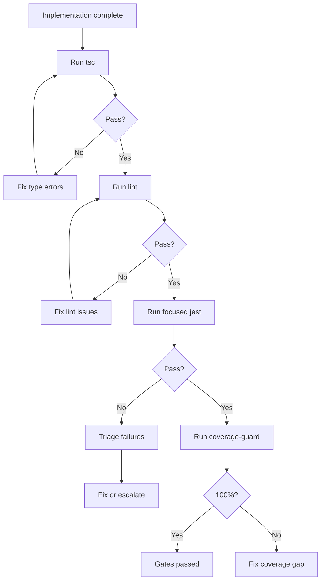
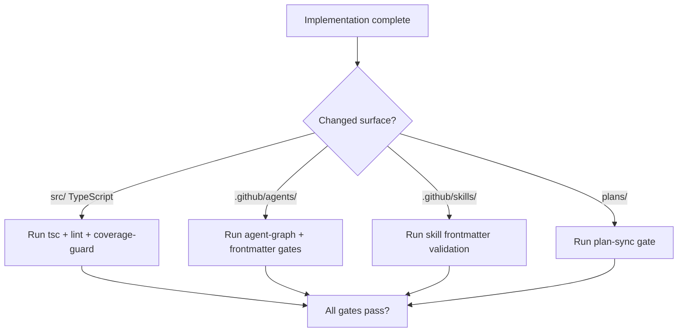

> **Search policy:** Follow the Cortex-First Search Policy from the `research-methodology` skill. Prefer Cortex MCP tools (`search_corpus`, `search_context`, `search_advanced`, `load_chunk`, `traverse_graph`) over native tools (`grep`, `glob`, `view`). Use native tools only as fallback when Cortex is degraded.

# Green Validation Gates Playbook

Use this skill after implementation edits to confirm that the correct validation
surfaces pass before a workflow step can be marked `[DONE]`.

This skill owns the durable routing logic for green-phase validation in
NeatapticTS agent workflows. It matches the type of change to the narrowest
adequate validation surface, enforces the gate contract defined in
`.github/flows/`, and routes failures back to implementation rather than forward
to documentation.

When tracker updates are needed, `tracker-handoff` owns the plan/log shape.
When a plan or roadmap entry needs alignment confirmation, `plan-sync-validation`
owns that gate.

## When to Use

- A flow step declares exit gates and the agent must prove each gate returns
  `"pass": true` before marking the step done.
- Customization scripts, plan files, agents, skills, or flows were changed and
  need targeted validation before proceeding.
- A gate failed and the failure must be recorded and routed back to the
  implementation phase rather than bypassed.
- The active session has accumulated three consecutive gate failures and must
  escalate via `00.cross-tier-helper`.
- A TypeScript, source, or package-script change requires build or lint
  confirmation alongside coverage verification.


## When NOT to use

Do NOT use for test repair - use `test-fix-workflow` instead. Do NOT use for plan consistency checking - use `plan-sync-validation` instead.


## Workflow Diagram



## Task Packet

Pass a compact packet that names the changed files, the expected validation
surfaces, and whether strict customization validation should pass for the current
state.

```text
Use green-validation-gates after editing .github/flows/07.tracker-closure.flow.yml.
Changed files: 07.tracker-closure.flow.yml.
Expected validations: agent-graph gate (all references resolve), plan-sync gate.
Strict customization validation: yes, all declared gates should pass.
Latest failure: agent-graph gate — missing skill reference in step 3.
```

## Required Workflow

Run the narrowest validation that matches the changed surface. The full suite
(`npm test`, `npm run test:silent`, `npm run jest:esm-ts`, `npm run jest:mjs`)
is large and slow; **never run it speculatively**. Prefer focused Jest slices
such as `npx jest --config=jest.config.mjs --no-cache --testPathPattern=<path>`.
Only run the full suite when explicitly requested by the user, required by the
active step packet's `validation` list, or at a phase boundary with user approval.

1. Run the narrowest validation that matches the changed surface:
   - TypeScript / source / package-script changes: `npm run build` or
     `npm run lint` as appropriate.
   - Docs-generation input changes: `npm run docs`.
   - Plan-only changes: markdown whitespace checks and `plan-sync-validation`.
   - `.github/agents/` changes: agent frontmatter and graph validation.
   - `.github/skills/` changes: skill frontmatter validation.
   - `.github/flows/` changes: flow gate resolution checks.

2. For customization scripts, run each script in audit mode first, then in
   targeted strict mode when the target state should hold.

3. Interpret gate output. Every gate in `.github/flows/` must return this
   structure:

   ```json
   {
     "pass": true,
     "evidence": { "...": "..." },
     "fixHint": "What to do if this gate fails",
     "owner": "gate-script-name.gate.mjs or validate-*.mjs"
   }
   ```

   A flow step is only complete when every declared gate returns `"pass": true`.

4. On gate failure:
   - Record the exception with:
     ```bash
     node scripts/agent-customization/gates/record-gate-exception.mjs
     ```
   - The exception is appended to `.github/ai-learning/learning-log.jsonl`.
   - Route the failure back to the implementation or red-testing phase.
   - Do not continue forward to documentation or plan closure.

5. After three consecutive gate failures in the same session, escalate to
   `00-helping` via the `00.cross-tier-helper` flow.

6. Record all gate evidence (pass or fail) in the active plan before marking the
   step `[DONE]`.

## Tier-1 Gate Catalog

| Gate ID          | Check                                                                      | Owner                                                       |
| ---------------- | -------------------------------------------------------------------------- | ----------------------------------------------------------- |
| `plan-sync`      | Plan registered in README + Roadmap; status coherent                       | `scripts/agent-customization/gates/plan-sync.gate.mjs`      |
| `step-packet`    | Active step has yaml block, status, next_step, validation, stop conditions | `scripts/agent-customization/gates/step-packet.gate.mjs`    |
| `agent-graph`    | All flow/gate/agent references resolve to real files                       | `scripts/agent-customization/gates/agent-graph.gate.mjs`    |
| `learning-event` | A learning event exists for any gate exception or cross-tier call          | `scripts/agent-customization/gates/learning-event.gate.mjs` |

## Decision Tree



## Before / After Examples

**Before:**
```json
{ "pass": false, "evidence": "tsc failed", "owner": "unknown" }
```

**After:**
```json
{ "pass": true, "evidence": "tsc exit 0, 0 errors", "fixHint": "n/a", "owner": "npx tsc --noEmit" }
```

## Guardrails

- Do not mark a phase step `[DONE]` if any declared gate has `"pass": false`.
- Do not route a gate failure forward to the next phase — always return to
  implementation or red testing first.
- Do not skip recording gate exceptions; every failure must be logged to
  `.github/ai-learning/learning-log.jsonl`.
- Do not run `npm run docs` unless docs-generation inputs were actually touched.
- Do not treat a partial gate pass (some gates green, some not yet run) as
  sufficient evidence to proceed.
- Do not invent ad hoc gate structure; use only the four-field JSON contract.

## Expected Final Output

A green-validation-gates pass should report:

- the changed surface and the validation commands run,
- the gate results for each declared gate (`pass`, `evidence`, `fixHint`,
  `owner`),
- whether any failures were recorded in `.github/ai-learning/learning-log.jsonl`,
- whether the failure was routed back to implementation or the step was confirmed
  complete,
- the final gate evidence recorded in the active plan.
