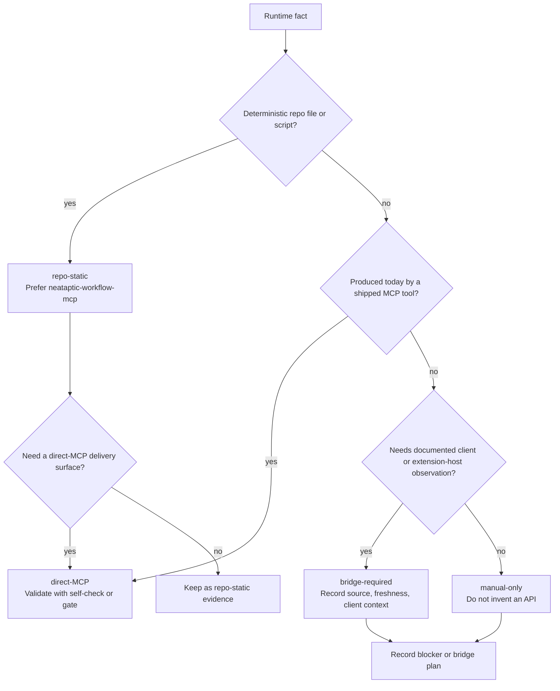

> **Search policy:** Follow the Cortex-First Search Policy from the `research-methodology` skill. Prefer Cortex MCP tools (`search_corpus`, `search_context`, `search_advanced`, `load_chunk`, `traverse_graph`) over native tools (`grep`, `glob`, `view`). Use native tools only as fallback when Cortex is degraded.

# MCP Local Server Workflow

Use this skill when NeatapticTS work needs a truthful local MCP
runtime-visibility surface, bridge plan, or validation path for workflow facts.

This skill owns the durable workflow for classifying runtime facts, assigning
them to the correct local component, managing transition states as capabilities
mature, enforcing trust boundaries, and communicating honest limits to users and
maintainers. It is the policy layer that prevents `repo-static`,
`direct-MCP`, `bridge-required`, and `manual-only` facts from being blurred
together.

When tracker files need updating, `tracker-handoff` owns plan and log shape.
When a recurring MCP boundary gap or failed promotion should be preserved beyond
the tracker, `capturing-learning-event` owns the append-only learning record.
When generic post-edit gate routing is the active problem,
`green-validation-gates` owns the broader validation workflow; this skill owns
the MCP-specific classification, transition, and trust-boundary rules.

## Scope Boundary

- In scope: runtime fact classification, component ownership, local MCP
  tool/resource boundaries, read-only versus bounded-executor annotations,
  self-check selection, promotion and rollback rules, blocker handling, and
  user/developer-facing limitation messaging.
- Out of scope: generic skill frontmatter policy (owned by
  `skill-frontmatter-standards`), tracker formatting (owned by
  `tracker-handoff`), and client-only UX claims that still lack a documented API
  or shipped bridge.

## When to Use

- A new MCP tool or resource is being designed and its runtime fact category
  must be classified before implementation.
- An existing MCP component is returning incorrect, stale, or unattributed
  facts and the source category needs to be re-examined.
- A validation gate needs to be wired to an MCP allow-list rather than a raw
  shell call.
- A fact is moving from manual-only to bridge-required, or from
  bridge-required to a shipped direct-MCP surface, and the promotion rules must
  be explicit.
- A feature depends on bridge-required observations (model snapshots, hook
  outputs, selected active agent state) and the design must not pretend those
  facts are available via direct-MCP today.
- A validation self-check, annotation rule, or allow-list boundary failed and
  the capability must be rolled back or blocked without ambiguity.
- A change to MCP tool definitions, plan-packet parsing, or trust-boundary docs
  needs CI-visible evidence and a clear maintainer-facing summary.


## When NOT to use

Do NOT use for general agent customization - use `agent-frontmatter-standards` instead. Do NOT use for routing table management - use `routing-optimization-policy` instead.

## Task Packet

Include the runtime fact or facts, current classification, target
classification if a transition is proposed, planned component owner, plan path,
evidence source, freshness, blocker or failure symptom, validation commands, and
communication target.

```text
Use mcp-local-server-workflow for selected active agent visibility review.
Facts: selected active agent, current selected model.
Current classification: manual-only.
Target classification: bridge-required only after a documented extension-host API exists.
Planned component: neataptic-vscode-bridge (future); no direct-MCP owner today.
Plan path: plans/mcp-active-binding.plans.md.
Evidence source: human-observed client UI only; no shipped API.
Failure symptom: request wants direct-MCP exposure, but boundary is unsupported today.
Validate with: confirm banned live-fact keys stay absent from workflow MCP payloads.
Communication target: user-facing blocker summary plus tracker note.
```

## Classification Decision Flow



## Required Workflow

1. Name every runtime fact in scope and record its current classification,
   target classification (if any), and owning component before editing any
   tool or documentation surface.
2. Separate facts into the four buckets: `repo-static`, `direct-MCP`,
   `bridge-required`, and `manual-only until a documented API exists`.
3. Prefer a local Node or TypeScript `stdio` MCP server for deterministic
   repo-static facts such as the active workflow snapshot and customization
   inventory.
4. Keep `neataptic-validation-mcp` narrowly scoped to active-step allow-list
   introspection plus exact command execution without a shell. It is not a
   general command runner.
5. Expose read-only tools and resources by default and mark them with MCP
   annotations where the SDK supports them. If a tool must execute an
   allow-listed validation command, keep the non-read-only boundary explicit,
   justified, and least-privilege.
6. For every proposed promotion, define the required evidence, validation
   command, fallback classification, and rollback condition before changing the
   claim.
7. Validate the narrowest shipped surface after each meaningful edit. Do not
   promote a fact to a stronger claim based on reasoning alone.
8. Record capability evidence, classification changes, blockers, and the
   user/developer-facing message in the active tracker or learning log.

## Runtime Fact Classification

Use this quick classification pass before assigning a fact to a component:

- `repo-static`: the fact comes from repository files or deterministic scripts
  and does not depend on current client state. Examples: the active phase or
  step packet, customization inventory counts, plan-derived allow-list content.
- `direct-MCP`: the fact can be produced today by a shipped MCP entrypoint with
  a bounded contract. Examples: the payload returned by
  `get_active_validation_allowlist`, or the exit code and output from
  `run_allowlisted_validation` for one exact allow-listed command.
- `bridge-required`: the fact depends on extension-host or Copilot client
  observations that the shipped direct-MCP surface cannot read today. Examples:
  model snapshots, hook-derived observations, or future bridge-owned client
  state.
- `manual-only until a documented API exists`: the fact is visible to a human in
  the client, but the repo does not ship a supported API to read it. Examples:
  the selected active agent, full live agent list, tool-picker state, and
  current selected model UI state.

A fact may move between these buckets over time, but the burden of proof is on
the stronger claim. If evidence weakens, demote the claim immediately.

## Shipped Component Boundaries

- `neataptic-workflow-mcp`
  (`scripts/agent-customization/mcp/neataptic-workflow-mcp.mjs`) owns
  `get_active_workflow_snapshot` and `get_customization_inventory`. It serves
  repo-static facts only. Live-fact keys such as `selectedActiveAgent`,
  `currentSelectedModel`, `toolPickerState`, `liveAgentList`,
  `hookObservations`, and `modelSnapshots` stay out of its payloads.
- `neataptic-validation-mcp`
  (`scripts/agent-customization/mcp/neataptic-validation-mcp.mjs`) owns
  `get_active_validation_allowlist` and `run_allowlisted_validation`.
  `get_active_validation_allowlist` is read-only. `run_allowlisted_validation`
  is the bounded executor for one exact allow-listed command, runs shell-free,
  and must never widen into a general shell.
- `neataptic-vscode-bridge` is the future owner for bridge-required
  extension-host or client observations only. It is not part of the shipped
  direct-MCP surface today.
- Manual-only facts stay outside shipped MCP surfaces until the repo ships a
  documented API or bridge that can produce them honestly.

## Transition States and Promotion Rules

Use explicit transition language whenever a fact or tool is evolving:

| Situation                                              | Required evidence before promotion                                                              | Safe interim state                                          | Forbidden shortcut                                                              |
| ------------------------------------------------------ | ----------------------------------------------------------------------------------------------- | ----------------------------------------------------------- | ------------------------------------------------------------------------------- |
| Repo-static fact gaining a direct-MCP delivery surface | A shipped tool/resource, matching annotations, and passing self-check output for the exact fact | Keep the fact repo-static and document the planned owner    | Claim the fact is direct-MCP before the tool ships and validates                |
| Manual-only fact gaining a bridge plan                 | A documented extension-host or client API path plus source, freshness, and client-context rules | Keep the fact manual-only and record the blocker            | Treat a human-visible UI observation as API-backed evidence                     |
| Bridge-required fact gaining direct-MCP status         | A repo-owned bridge or MCP surface that ships, passes validation, and proves the trust boundary | Keep the fact bridge-required with a blocker note           | Collapse bridge-required into direct-MCP without shipped transport and evidence |
| Direct-MCP fact losing proof after drift or failure    | A successful fix and rerun of the failing self-check or gate                                    | Demote to the strongest still-proven bucket and explain why | Leave the stronger claim in docs after a failing self-check                     |

## Validation and Failure Recovery

1. Run the narrowest validation that matches the changed surface:
   - Workflow server:
     `node scripts/agent-customization/mcp/neataptic-workflow-mcp.mjs --plan=<plan> --self-check --json`
   - Validation server:
     `node scripts/agent-customization/mcp/neataptic-validation-mcp.mjs --plan=<plan> --self-check --json`
   - Skill metadata after frontmatter edits:
     `node scripts/agent-customization/validate-skill-frontmatter.mjs --json --strict`
2. Treat a failed self-check or gate as a capability-boundary event, not as a
   wording problem. Fix the implementation or demote the claim before polishing
   documentation.
3. If a direct-MCP claim fails validation, roll the fact back to the strongest
   still-proven bucket (`repo-static`, `bridge-required`, or `manual-only`) and
   document the blocker explicitly.
4. If a tool cannot carry the intended annotation, record whether that is an SDK
   limitation or a design problem. Keep the least-privilege behavior explicit
   and do not imply stronger safety than the shipped code provides.
5. Record persistent failures with
   `node scripts/agent-customization/gates/record-gate-exception.mjs`. If the
   pattern is unclear or recurring, inspect
   `node scripts/agent-customization/workflow-gap-audit.mjs --json`.
6. After three consecutive gate failures in the same session, escalate via
   `00.cross-tier-helper` and `00-helping` rather than normalizing a broken
   boundary.

## Change Tracking and Versioning

- Record the old and new classification, owning component, plan path, evidence
  timestamp, and validation command whenever a fact or tool changes status.
- When a tool or resource input/output contract changes, update the task packet
  example, boundary description, and validation evidence together. Treat
  breaking shape changes as migrations, not silent edits.
- Use the active tracker for step-local history. Use
  `capturing-learning-event` and `.github/ai-learning/learning-log.jsonl` for
  recurring gaps, promotions, demotions, or trust-boundary fixes that future
  sessions must understand.
- Do not reuse stale validation JSON after changing the shipped surface; rerun
  the relevant self-check so the evidence matches the current implementation.

## CI/CD and Communication

- Mirror the same self-checks in CI when `.github/skills/**`,
  `scripts/agent-customization/mcp/**`,
  `scripts/agent-customization/gates/**`, or plan-packet parsing changes touch
  the boundary.
- Fail automation on over-claiming. If the self-check, allow-list proof, or
  trust-boundary rule fails, the capability stays blocked or demoted.
- Keep validation output machine-readable and human-readable: structured JSON for
  tools and gates, plus a short tracker or chat summary for maintainers.
- In user-facing and developer-facing summaries, always state:
  1. the current classification,
  2. the shipped owner or missing owner,
  3. what is not observable today,
  4. the safe fallback or manual path,
  5. the next proof needed for promotion.
- Avoid vague statements like "not available yet" or "MCP can probably read
  this." Name the blocker, missing API, or failing gate directly.

## Guardrails

- Do not use MCP as a general shell.
- Do not assume a repo-static fact is automatically a direct-MCP claim; source
  type and delivery surface must both be proven.
- Do not treat a bridge plan as shipped capability.
- Do not preserve a stronger classification after a failing self-check or gate.
- Do not widen `run_allowlisted_validation` beyond the exact allow-listed
  command set or its shell-free execution contract.
- Do not store live client observations without source, timestamp, and client
  context.
- Do not imply a checked-in MCP workspace configuration, a plugin-packaged
  bridge, or direct access to manual-only client facts when the repo does not
  ship those surfaces.
- Do not hide blocker state, validation failure, or deferred promotion behind
  vague wording.
- Do not edit generated docs to record MCP progress; use the active tracker or
  learning log.

## Expected Final Output

A strong MCP local server pass should produce:

- a classification of every runtime fact in scope, including current bucket,
  planned owner, and any target state,
- an updated or new MCP tool/resource in the correct component with truthful
  read-only or bounded-executor semantics,
- self-check or gate evidence for each changed shipped surface,
- any blocker, rollback, or deferred promotion recorded with an explicit reason,
- a user/developer-facing summary that states the current limit and the next
  proof needed.

## Sources

- VS Code MCP developer guide:
  `https://code.visualstudio.com/api/extension-guides/ai/mcp`
- VS Code Copilot MCP server customization guide:
  `https://code.visualstudio.com/docs/copilot/customization/mcp-servers`
- VS Code AI extensibility overview:
  `https://code.visualstudio.com/api/extension-guides/ai/ai-extensibility-overview`
- VS Code Language Model API guide:
  `https://code.visualstudio.com/api/extension-guides/language-model`
- VS Code agent plugins documentation:
  `https://code.visualstudio.com/docs/copilot/customization/agent-plugins`
- VS Code hooks documentation:
  `https://code.visualstudio.com/docs/copilot/customization/hooks`

Keep claims about MCP runtime behavior bounded to the shipped NeatapticTS
surfaces above. If a later note needs protocol-wide claims, add a separate
protocol source before making them.
