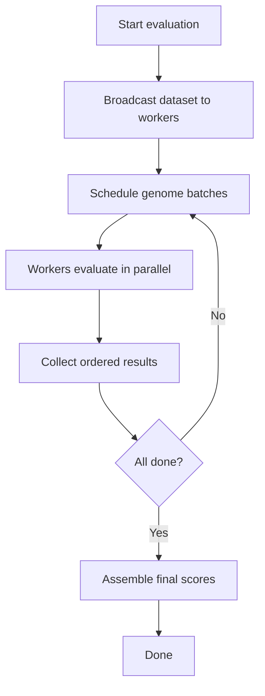
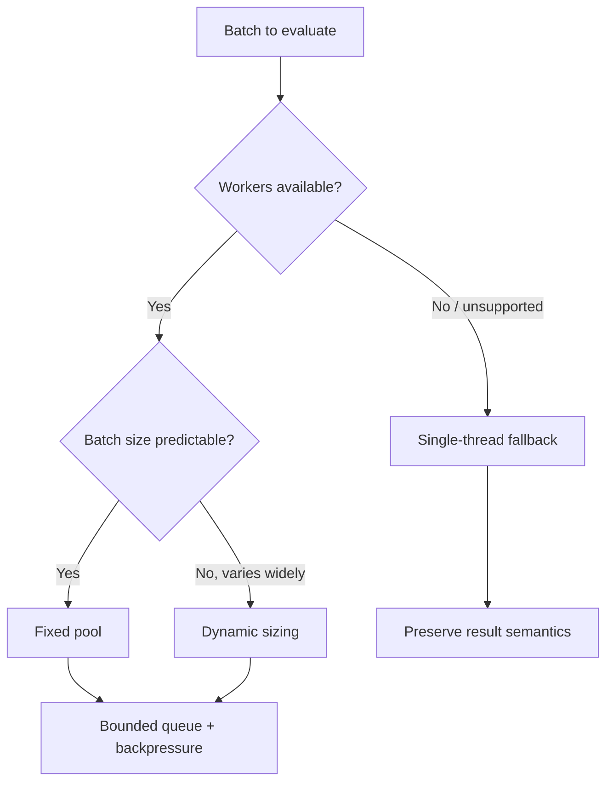

> **Search policy:** Follow the Cortex-First Search Policy from the `research-methodology` skill. Prefer Cortex MCP tools (`search_corpus`, `search_context`, `search_advanced`, `load_chunk`, `traverse_graph`) over native tools (`grep`, `glob`, `view`). Use native tools only as fallback when Cortex is degraded.

# Multithread Evaluation Playbook

Use this skill when NeatapticTS work touches the Phase 4 worker-pool and
parallel evaluation surface described in
`plans/Turnkey_Multithread_Evaluation_API.md`.

This skill owns the durable workflow for queueing, task dispatch, deterministic
result collection, pool lifecycle, dataset shipping, and single-thread fallback.
It assumes the transport substrate comes from `worker-inference-transport`.

When tracker files need updating, `tracker-handoff` owns plan and log shape.
When sequencing or dependency tension is unclear, use `plan-alignment`.

See [evaluation pool sources](./references/evaluation-pool-sources.md) for
worker-pool scheduling notes, source attribution, and queueing heuristics.

## Scope Boundary

- In scope: `evaluateInWorkers(...)`, pool lifecycle, worker-count sizing,
  queueing, backpressure, ordered result assembly, dataset init strategy,
  environment-specific worker bootstrapping, failure handling, metrics such as
  elapsed time and throughput, optional helper integration with NEAT evolution
  loops.
- Out of scope: payload encoding internals (owned by
  `worker-inference-transport`), checkpoint persistence (owned by
  `checkpointing-persistence`), parameter-vector or optimizer contracts (owned
  by `hybrid-training-interop`), browser bundling policy (owned by
  `browser-build`), and demo-specific worker wrappers.

## When to Use

- The repo needs a Node or browser worker pool for batch fitness evaluation.
- Ordered result collection or deterministic scheduling is the active problem.
- Queue growth, worker reuse, or worker teardown policy needs hardening.
- A worker-evaluation API needs a truthful single-thread fallback.
- Dataset shipping is dominating runtime and must move to init-time broadcast.
- Evolution-loop integration is being added on top of a pool that already works.

## When NOT to use

Do NOT use for single-threaded evaluation - use direct evaluation calls instead. Do NOT use for worker payload encoding - use `worker-inference-transport` instead.

## Core Contracts

### Result-order contract

- `evaluateInWorkers(...)` must return results in the same logical order as the
  input networks unless the public API explicitly exposes another ordering.
- Completion order is an internal optimization concern, not a public contract.

### Determinism contract

- Same networks, same dataset, same seed, same options, and same worker-count
  policy must produce the same fitness results.
- If scheduling order can vary, tie-breaking and result assembly rules must
  still make the public output replayable.

### Fallback contract

- Environments without usable workers must have an explicit single-thread path.
- Fallback mode must preserve result semantics, even if throughput changes.

### Failure contract

- Worker failure, pool shutdown, and queue overflow must surface as explicit API
  errors rather than silent task loss.
- A worker crash should not corrupt already completed results.

## Throughput Heuristic

Use the classical work-and-span intuition as a guide, not a promise:

$$
T_P \approx \frac{T_1}{P} + O(T_\infty)
$$

where $T_1$ is serial work, $P$ is effective parallelism, and $T_\infty$ is the
critical path. In practice, pool startup, dataset broadcast, queue contention,
and browser scheduling can dominate the theoretical win for small batches.

Choose pool complexity only when the batch size and compute cost justify it.

## Workflow Diagram



## Task Packet

Pass a compact packet that includes:

- active plan step,
- environment: Node, browser, or parity across both,
- dataset mode: init-time broadcast or per-task shipping,
- expected batch size,
- deterministic seed rules,
- fallback requirement,
- validation target: focused Jest, smoke demo, benchmark, or all three.

Compact example:

```text
Use multithread-evaluation for Step 1 Node worker pool bring-up.
Plan: plans/Turnkey_Multithread_Evaluation_API.md.
Environment: Node first, browser parity later.
Dataset mode: init-time broadcast.
Invariant: results must return in input order with deterministic fitness values.
Validate with: focused multithreading tests, a small batch integration test, and a queue-throughput benchmark.
```

## Required Workflow

1. Read `plans/README.md`, then
   `plans/Turnkey_Multithread_Evaluation_API.md`.
2. Read the relevant multithreading README and nearest test owners before deep
   source reads.
3. Confirm the dependency surface:
   - transport substrate from `worker-inference-transport`,
   - deterministic data and seed rules,
   - fallback semantics.
4. Decide the task model explicitly:
   - fixed pool or dynamic sizing,
   - init-time dataset broadcast or per-task shipping,
   - ordering strategy,
   - shutdown policy.
5. Add or update the smallest focused red-phase test for the public contract in
   scope.
6. Implement the smallest boundary-local change.
7. Immediately rerun the same focused validation after the first substantive
   edit.
8. Run `coverage-guard` on every touched `src/` file.
9. Measure behavior if the change claims throughput improvement.
10. Update docs or JSDoc so users can understand the worker template, fallback
    path, and deterministic expectations.
11. Update the plan only after code and validation are green.

## Pool Design Rules

### Queueing

- Prefer bounded queues or explicit backpressure over silent unbounded growth.
- Keep the scheduling policy simple at first: FIFO submission with stable result
  indexing beats clever queueing that weakens determinism.
- If work stealing or localized queueing is introduced later, document why the
  extra complexity is justified.

### Dataset shipping

- Use init-time dataset broadcast when the same evaluation dataset will be
  reused across many tasks.
- Use per-task shipping only when the dataset is tiny or task-local.
- Do not hide repeated large dataset copies inside the API.

### Worker lifecycle

- Handle worker `online`, `message`, `messageerror`, `error`, and `exit`
  explicitly.
- Keep replacement policy explicit when a worker dies.
- Idle termination must never strand queued work.

### Observability

- In Node pools, use `AsyncResource` when task-to-callback correlation matters.
- Expose enough metadata to debug queue depth, elapsed time, and worker-count
  choice without turning the API into a trace framework.

## Validation Cadence

- Owner-local pool scheduling tests.
- Existing multithreading tests when the root loader or worker boundaries move,
  especially:
  - `src/multithreading/multi.utils.test.ts`
  - `src/multithreading/multi.test.ts`
  - `src/multithreading/workers/workers.test.ts`
  - `src/multithreading/workers/node/testworker.test.ts`
  - `src/multithreading/workers/node/worker.test.ts`
- Focused integration test for a small deterministic batch.
- Browser smoke validation when browser worker parity is part of the step.
- `npm run test:silent` only when the active step packet or user explicitly requires repo-wide confirmation; otherwise, report the focused slice result as the gate evidence.

## Decision Tree



## Before / After Examples

**Before:**

```ts
// unbounded worker spawn: one worker per task, no limit
for (const genome of genomes) {
  const worker = new Worker(url);
  worker.postMessage(genome); // no queue, no backpressure
}
```

**After:**

```ts
// bounded pool with backpressure: fixed worker count, queued tasks
const pool = createWorkerPool({ workerCount: 4, maxQueueDepth: 100 });
const results = await pool.evaluate(genomes); // ordered, backpressured
```

## Guardrails

- Do not run arbitrary user code through unsafe string-eval workers.
- Do not claim deterministic behavior if worker ordering or seeding is not
  actually fixed.
- Do not bury fallback-to-single-thread behavior behind an undocumented branch.
- Do not let the queue grow without limit unless the API explicitly exposes that
  risk.
- Do not mix payload serialization logic into the pool layer.
- Do not optimize scheduling policy before the ordered and deterministic baseline
  exists.

## Expected Final Output

A strong multithread-evaluation pass should report:

- the pool surface or helper targeted,
- environment scope,
- dataset shipping strategy,
- ordering and fallback behavior,
- focused validation results,
- coverage result for touched `src/` files,
- benchmark evidence when throughput is part of the claim,
- the updated plan step.
