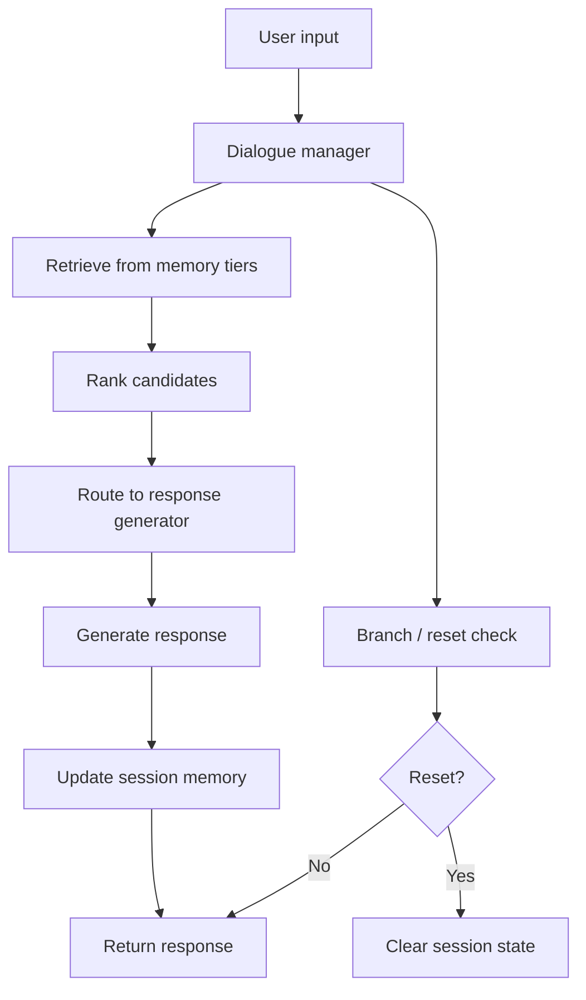
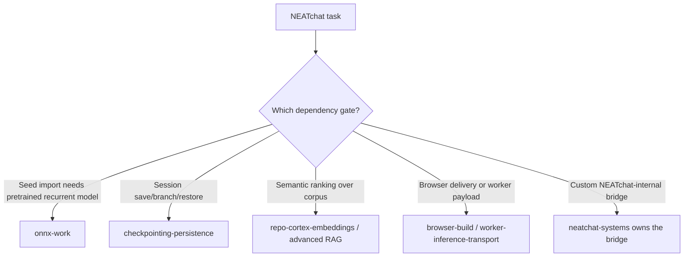

> **Search policy:** Follow the Cortex-First Search Policy from the `research-methodology` skill. Prefer Cortex MCP tools (`search_corpus`, `search_context`, `search_advanced`, `load_chunk`, `traverse_graph`) over native tools (`grep`, `glob`, `view`). Use native tools only as fallback when Cortex is degraded.

# NEATchat Systems Playbook

Use this skill when the work is about the planned NEATchat follow-up system,
not the closed toy demo that already exists under `examples/neatChat`.

This skill owns the applied consumer layer that combines memory, routing,
personalization, teacher seeding, and evaluation into a durable conversational
system.

It does not re-own foundational transport, checkpoint, worker, browser, ONNX, or
parameter-vector contracts. Instead, it orchestrates them into a user-facing
system and stops to hand back whenever a missing prerequisite belongs to a lower
layer.

See [NEATchat sources](./references/neatchat-sources.md) for paraphrased notes on
dialogue systems, episodic memory, information retrieval, and the current repo
plan boundary.

## When NOT to use

Do NOT use for general chat systems or simple Q&A - this skill is specifically for NEATchat conversational architecture. Do NOT use for ONNX export alone - use `onnx-work` instead.

## Workflow Diagram



## Scope Boundary

- In scope: persistent session orchestration, branch or restore semantics,
  multi-tier memory design, retrieval ranking, candidate routing, external seed
  ingestion strategy, background adaptation workflow, conversation evaluation,
  memory provenance, inspectability, and user-visible NEATchat behavior.
- Out of scope: raw worker payload schema, generic checkpoint format,
  multithread scheduling internals, vector-layout contracts, ONNX operator
  support, browser bundling, or generalized visualizer layout work unless the
  current task is specifically blocked by one of those owners.

## Baseline Continuity

- Treat the current `examples/neatChat` browser LSTM demo as a closed baseline,
  not as the place to stuff the entire future system.
- Preserve the current practical lesson from the example path: snapshot
  persistence is the safest resume path, and warm-starting from bundled sample
  data is a useful baseline when no user corpus exists.
- New follow-up work should extend the planned system boundary without erasing the
  small, inspectable toy surface unless the user explicitly asks for that swap.

## Dependency Gate Map

- `checkpointing-persistence`: unlocks durable session save, branch, restore, and
  long-horizon personalization.
- `worker-inference-transport`: unlocks browser or worker-safe model and memory
  payload transfer.
- `multithread-evaluation`: unlocks candidate scoring, background evaluation, and
  heavier offline adaptation loops.
- `hybrid-training-interop`: unlocks external teacher seeding, vector import or
  export, and controlled write-back after local or remote training.
- `reproducibility-contracts`: defines what same-session replay and exact restore
  actually mean.
- `onnx-work`: owns stronger pretrained recurrent import when NEATchat seeds need
  more than toy initialization.
- `browser-build`: owns publishable browser delivery when runtime packaging,
  workers, or asset boundaries become the blocker.

If one of those gates is missing, stop widening NEATchat itself and hand the gap
back to the correct owner.

## Workstream Ownership

### Stronger starting policies

- Coordinate external teacher or pretrained recurrent seeds.
- Keep imported seeds versioned, attributable, and reproducible.
- Treat the import path as a dependency consumer of hybrid interop and ONNX work,
  not as an ad hoc NEATchat-only loader.

### Multi-tier memory

- Working memory: current turn window and immediate dialogue state.
- Episodic memory: turn-linked events with context, order, and provenance.
- Semantic or profile memory: distilled stable facts and preferences.
- Snapshot memory: branchable full-state checkpoints for replay or rollback.

### Retrieval and routing

- Retrieval is a ranking problem, not a single exact lookup.
- Candidate routing should stay inspectable: what memories were considered, what
  won, and why.
- Use dialogue-manager style orchestration instead of hiding all logic inside one
  opaque predictor.

### Background adaptation

- Long-running adaptation must operate on checkpointed or forked state, not on an
  untracked live session.
- Write-back should be explicit, reviewable, and reversible.

### Evaluation and safety

- Own scripted conversation packs, recall checks, reset fidelity checks, and
  user-visible memory safety expectations.
- Keep memory writes attributable and erasable.

## Dialogue Stack

Use a simple, inspectable flow:

1. Encode the incoming turn and active dialogue state.
2. Retrieve ranked episodic, semantic, or profile memories.
3. Let the dialogue manager or router choose the active candidate path.
4. Produce the response.
5. Decide which memories to write, which checkpoints to update, and whether any
   background job should run.

This keeps NEATchat aligned with dialogue-system architecture rather than turning
every feature into one undebuggable recurrent blob.

## Memory Rules

- Keep episodic memory distinct from semantic or profile memory.
- Promote stable facts from repeated episodic evidence instead of writing every
  turn directly into durable profile state.
- Store provenance for every durable memory: source turn, branch, timestamp,
  score, and any approval status if relevant.
- Make branch reset and hard reset explicit product behaviors, not hidden debug
  utilities.

## Retrieval Heuristic

Prefer explicit ranking over implicit folklore. A workable scoring surface is:

$$
score(m, q) = w_r\,relevance(m, q) + w_t\,recency(m) + w_e\,episodicFit(m, q) + w_p\,profileFit(m, q) - w_n\,redundancy(m, q)
$$

Whether the implementation is sparse, dense, or hybrid, NEATchat should expose a
traceable reason why a memory was surfaced.

## Required Workflow

1. Read `examples/neatChat/README.md` and `plans/NEATchat.plans.md` first.
2. Identify the active workstream and the missing or satisfied dependency gates.
3. Confirm the task belongs to NEATchat systems rather than a foundation owner.
4. Add the smallest focused failing or absent validation for the intended
   behavior.
5. Implement the smallest owner-local change.
6. Immediately rerun the same focused validation after the first substantive
   edit.
7. If `src/` changed, run `coverage-guard` on every touched source file.
8. Report the user-visible behavior added, the gates relied on, and any blocked
   prerequisites that still belong elsewhere.

## Evaluation Cadence

- Snapshot roundtrip and branch-restore checks.
- Reset-fidelity tests proving one conversation does not contaminate another.
- Memory recall tests for episodic and semantic surfaces separately.
- Retrieval provenance checks showing the ranked memories used for a reply.
- Background-adaptation gating tests proving live sessions are not silently
  mutated.
- Same-input reproducibility checks at the exact rung promised by
  `reproducibility-contracts`.

## Decision Tree



## Before / After Examples

**Before:**

```text
session: { turns: [] } // flat list, no tiering, every turn written to durable store
```

**After:**

```text
session: {
  working: Turn[],
  episodic: EpisodicMemory[],
  semantic: ProfileMemory[],
  snapshot: Checkpoint,
} // multi-tier retrieval with provenance
```

## Guardrails

- Do not duplicate checkpoint or transport logic inside NEATchat code.
- Do not treat the toy browser example as proof that the follow-up system is
  solved.
- Do not silently mutate durable user state during foreground chat.
- Do not merge episodic and semantic memory into one opaque store.
- Do not surface retrieved memories without provenance or ranking context.
- Do not claim exact replay unless the underlying reproducibility tuple is truly
  captured.
- Do not use browser-only shortcuts to hide a missing library-level foundation.

## Expected Final Output

A strong NEATchat systems pass should report:

- the workstream targeted,
- the dependency gates used or still missing,
- the user-visible conversational behavior added,
- validation results for memory, reset, or routing behavior,
- any prerequisite handoff to checkpointing, workers, hybrid interop, ONNX, or
  browser-build.
