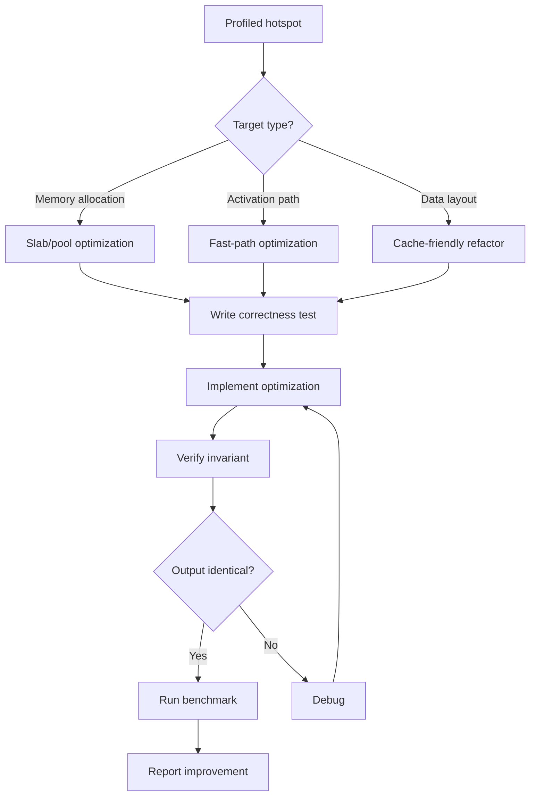
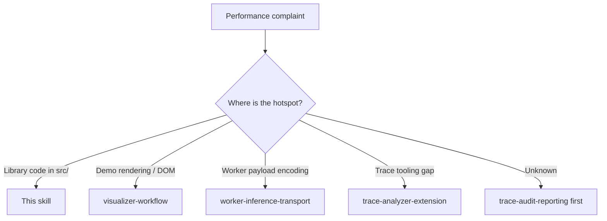

> **Search policy:** Follow the Cortex-First Search Policy from the `research-methodology` skill. Prefer Cortex MCP tools (`search_corpus`, `search_context`, `search_advanced`, `load_chunk`, `traverse_graph`) over native tools (`grep`, `glob`, `view`). Use native tools only as fallback when Cortex is degraded.

# Performance Optimization Playbook

Use this skill when NeatapticTS source needs a measured memory or runtime
performance improvement tied to `plans/Memory_Optimization.md` or a profiled
library-owned hotspot.

For **identifying** hotspots, use `trace-audit-reporting` first, then use this
skill for the implementation pass once the evidence is clear. This skill owns
the implementation workflow; the trace skills own the diagnostic workflow. If
the existing trace analyzer cannot answer the question, use
`trace-analyzer-extension` before returning here with a new rollup or metric.

Performance work is Phase 5 in the roadmap (Memory Optimization, Track 1) and
runs as a **parallel lane** after Phase 1 stabilizes. Track 2 (Hyper work)
remains gated behind Track 1 stability conditions defined in the plan.

When tracker files need updating, `tracker-handoff` owns the plan/log shape.
When roadmap alignment is needed, use `plan-alignment`.

## Scope Boundary

- **In scope:** typed-array pooling, slab allocator improvements, activation
  fast-path optimization, cache-friendly data layout changes, memory reuse,
  allocator lifecycle cleanup, benchmark authoring, and library-owned
  browser-worker hotspots once the trace evidence points back into shared code.
- **Out of scope:** algorithm correctness (owned by NEAT plans), ONNX
  portability (owned by `onnx-work`), browser bundling (owned by
  `browser-build`), demo-level rendering performance (owned by
  `trace-audit-reporting`, `visualizer-workflow`, or
  `flappy-architecture-polish`), worker payload encoding or transfer strategy
  (owned by `worker-inference-transport`), and trace-analyzer feature work
  (owned by `trace-analyzer-extension`).

## When to Use

- A Track 1 phase from `Memory_Optimization.md` is ready to implement.
- A profiled hotspot (from `trace-audit-reporting`) points to a library-level
  allocation or activation-path improvement.
- A browser or worker performance complaint has been traced back to shared
  library code rather than demo-local rendering or packaging.
- Activation throughput benchmarks show regression.
- A slab or typed-array change is needed before another lane can proceed
  efficiently, without taking ownership of that lane's public contract.

## When NOT to use

Do NOT use for trace analysis or reporting - use `trace-audit-reporting` instead. Do NOT use for trace analyzer extension - use `trace-analyzer-extension` instead.

## Workflow Diagram



## Task Packet

Pass a compact packet that includes:

- optimization target (what is being improved and why),
- evidence (trace report summary, analyzer rollup, benchmark delta, or plan
  phase reference),
- current Track 1 phase from `Memory_Optimization.md`,
- correctness invariant that must be preserved,
- validation expectations (benchmark target, focused test, regression suite).

Compact example:

```text
Use performance-optimization for slab allocator pool reuse.
Evidence: trace shows ~40% of activation time in Float64Array allocation.
Plan: Memory_Optimization.md Track 1 Phase 4.
Invariant: activation output must be numerically identical before and after.
Validate with: benchmarks/activation.bench.ts. Only run `npm run test:silent` if the active step packet or user explicitly requires repo-wide confirmation.
```

## Required Workflow

1. Read `plans/Memory_Optimization.md` to confirm the current Track 1 phase and
   that Track 2 gates are not yet open.
2. Read the relevant trace report or benchmark result before editing.
3. Confirm owner boundary before editing:

- transport-size or transfer-list issues belong to
  `worker-inference-transport`
- demo-local rendering or layout issues belong to `visualizer-workflow` or
  `flappy-architecture-polish`
- missing trace rollups belong to `trace-analyzer-extension`

4. Read the source boundary to be changed and its nearest test file.
5. Confirm the correctness invariant explicitly before touching any code.
6. Write a correctness regression test (or verify one exists) that will fail
   if activation output changes for the same inputs:
   - same network + same inputs + same seed → bitwise identical output before
     and after the change.
7. Implement the optimization in the smallest safe boundary.
8. Confirm the correctness invariant still holds with the focused test.
9. Run `coverage-guard` on every `src/` file changed by this step. 100% in all
   four categories (statements, branches, functions, lines) is required before
   proceeding.
10. Run or author a benchmark to measure the improvement.
11. Run `npm run test:silent` only if the active step packet or user explicitly requires repo-wide confirmation; otherwise, report the focused slice result as the gate evidence.
12. Update `plans/Memory_Optimization.md` with the completed phase.

## Correctness Contract

Every performance change must satisfy:

- Activation output for the same network, same inputs, and same seed must be
  bitwise identical before and after the change on the same runtime, unless the
  task explicitly redefines the determinism contract with
  `reproducibility-contracts`.
- Any optimization that changes memory layout must preserve correct recurrent
  state semantics — prior activation values must not be clobbered between
  forward passes.
- Slab or pool changes must not introduce data leakage between independent
  networks in the same process.
- These invariants must be tested, not assumed.

## Track 2 Gate

Do not start Hyper (Track 2) work until the Track 1 stability conditions in
`Memory_Optimization.md` are fully satisfied. If those conditions appear met,
use `plan-alignment` to verify before proceeding.

## Decision Tree: Optimization Targets



## Before / After Examples

**Before:**

```text
Slab allocation: 12,000 ops/sec, 41% activation time in Float64Array allocation
```

**After:**

```text
Slab pool reuse: 28,500 ops/sec (+137%), allocation time reduced to 9% of activation
Correctness invariant: bitwise identical output, same seed → same result
```

## Guardrails

- Do not merge a performance change with a correctness change in the same step.
- Do not close a Track 1 phase until the correctness invariant test exists and
  passes.
- Do not ship a slab or pool change without a test that detects cross-network
  data leakage.
- Do not claim a performance improvement without measured benchmark evidence.
- Do not use this skill to redesign worker payload formats or transfer strategy;
  that belongs to `worker-inference-transport`.
- Do not use this skill to chase demo-only canvas or DOM bottlenecks without a
  shared-library hotspot and clear evidence.
- Do not extend the trace analyzer ad hoc here; hand that work to
  `trace-analyzer-extension` first.
- Do not hand-edit generated README files.
- Follow `tracker-handoff` when updating plan/log files.
- Follow `educational-docs` for JSDoc on new helpers or changed public surfaces.
- Do not prepend calendar dates to plan headings or session logs.

## Expected Final Output

A strong performance optimization pass should report:

- the optimization target,
- the correctness invariant test result,
- before/after benchmark numbers (ops/second or ms/op),
- the Track 1 phase updated,
- repo-wide suite result.
