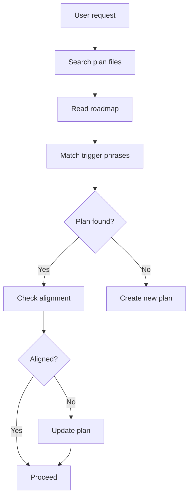
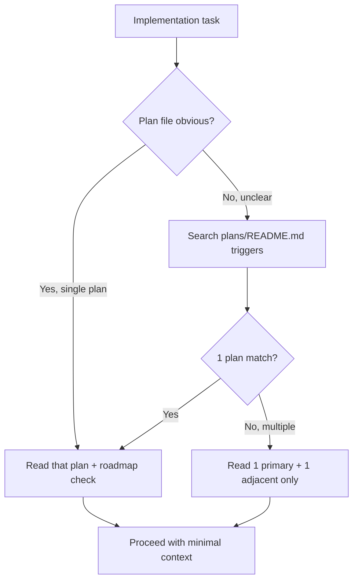

> **Search policy:** Follow the Cortex-First Search Policy from the `research-methodology` skill. Prefer Cortex MCP tools (`search_corpus`, `search_context`, `search_advanced`, `load_chunk`, `traverse_graph`) over native tools (`grep`, `glob`, `view`). Use native tools only as fallback when Cortex is degraded.

# Plan Alignment Playbook

Use this skill when implementation work needs to stay aligned with the repo's
documented roadmap and architectural intent.

This skill is the canonical workflow for plan selection and roadmap alignment
in NeatapticTS. It owns the durable rules for how much of `plans/` to read,
which terminology to preserve, and how to surface mismatches between code and
plan direction without overloading context.

When a task actually edits tracker files, `tracker-handoff` owns the plan/log
shape, status markers, compression, and `Handoff query` structure.

## When to Use

- The task touches architecture, roadmap items, major refactors, new
  subsystems, export formats, or correctness-sensitive NEAT behavior.
- The right plan document is not obvious yet.
- The task may span two related initiatives and needs bounded plan context.
- A demo or example symptom may actually indicate a higher-leverage library/API
  or runtime-contract gap.


## When NOT to use

Do NOT use for consistency checking or sync validation - use `plan-sync-validation` instead. Do NOT use for tracker updates - use `tracker-handoff` instead.


## Workflow Diagram



## Task Packet

Pass a compact packet that includes:

- target subsystem or feature area,
- trigger phrases from the request,
- whether core NEAT correctness is involved,
- any known relevant plan files,
- whether the symptom may reflect a library-level gap rather than a demo-only
  issue,
- whether the goal is reconnaissance only or an implementation-alignment brief.

Compact example:

```text
Use plan-alignment for feed-forward runtime behavior in Flappy Bird.
Trigger phrases: feed-forward builder, runtime contract, demo mismatch.
Core NEAT correctness: maybe adjacent, but not primary.
Goal: identify the primary plan file and any roadmap mismatch risks.
```

## Required Workflow

1. Read `plans/README.md` first.
2. If the task concerns core NEAT architecture or evolutionary correctness,
   read `plans/completed/neat.plans.md` next.
3. Otherwise read only the single most relevant detailed plan, plus at most one
   adjacent related plan when clearly necessary.
4. Do not bulk-read the whole `plans/` directory unless the task explicitly
   requires broad roadmap synthesis.
5. Preserve plan terminology and goals unless the user asks to revise them.
6. Call out any visible code/plan mismatch instead of silently drifting around
   it.
7. Prefer incremental work that moves the code toward the documented direction.
8. For demo-driven tasks, determine whether the symptom reveals a reusable
   library/API/defaults gap and align the recommendation there first.

## No Deferred Cleanup — Alignment Check

When aligning implementation work to a plan, verify that any migration,
refactor, or API replacement step removes old code in the same step. A plan
that introduces new code alongside old code — with backward-compatibility
wrappers, dual-path code, or deferred cleanup — is a planning defect and
MUST be flagged as a mismatch before implementation proceeds. The alignment
brief MUST call out this risk explicitly when the plan touches migration or
replacement work.

## Responsibility Split

Use this boundary intentionally:

- The skill owns durable plan-selection and roadmap-alignment knowledge.
- `Plan Scout` owns read-only reconnaissance: identify the smallest useful plan
  subset and produce a compact alignment brief.
- Execution skills such as `solid-split` consume this alignment rather than
  redefining it.

## Plan Scout Handoff

Useful handoff fields from `Plan Scout`:

- primary plan and reason,
- optional secondary plan and reason,
- key terms to preserve,
- alignment guardrails,
- likely mismatch risks.

This handoff narrows the implementation pass. It does not replace the actual
alignment workflow.

## Decision Tree



## Before / After Examples

**Before:**
```text
# context overflow: reading 5 plan files before starting
Read: neat.plans.md, multithread.plans.md, worker.plans.md,
      checkpoint.plans.md, reproducibility.plans.md
→ 40K tokens consumed, 4 of 5 plans irrelevant
```

**After:**
```text
# targeted: 1 plan + roadmap lane check
Read: plans/Turnkey_Multithread_Evaluation_API.md
Check: plans/Roadmap.md Phase 4 lane
→ 8K tokens consumed, aligned to correct direction
```

## Guardrails

- Do not prepend specific calendar dates to plan logs, alignment notes, or
  handoff sections. Use stable undated headings so plan history stays easy to
  reuse and rewrite.
- Do not invent a custom tracker format when editing `.plans.md` or `.logs.md`;
  defer to `tracker-handoff` for `[PLANNED]`, `[WIP]`, `[DONE]`, and
  `Handoff query` structure.
- Do not recommend a plan file without explaining why it matches.
- Do not read the entire `plans/` tree by default.
- Do not default to demo-local compensation when the plan direction points to a
  reusable library fix.
- Do not introduce architecture that conflicts with a stated plan without
  explicitly flagging the conflict.

## Expected Final Output

A strong run should report:

- the primary plan used and why,
- any optional secondary plan and why,
- preserved terms or constraints,
- mismatch risks,
- the safest aligned next step for implementation.
