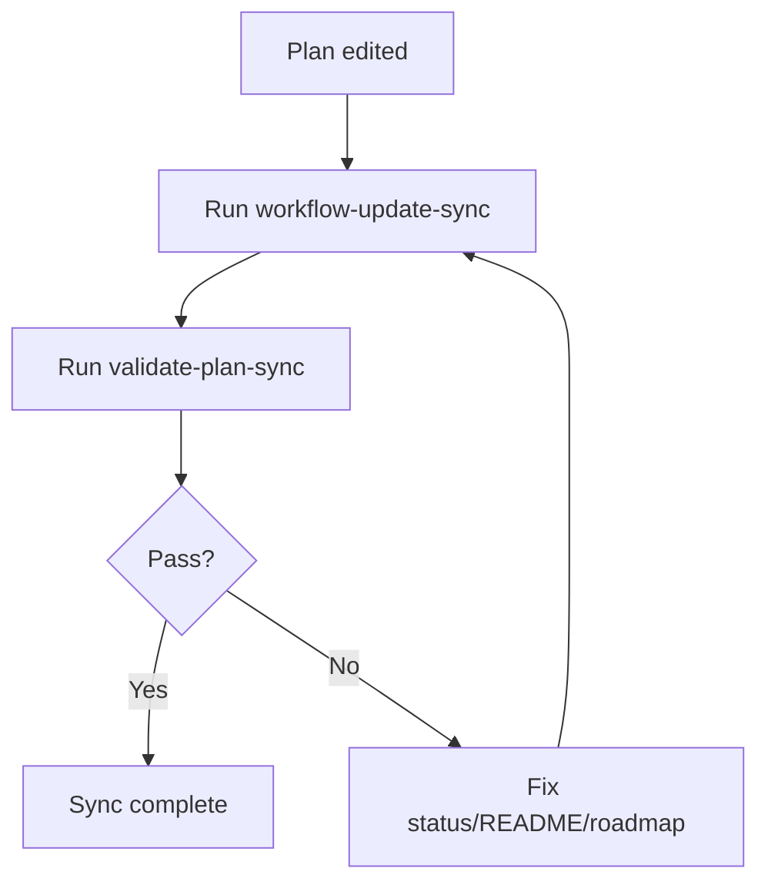
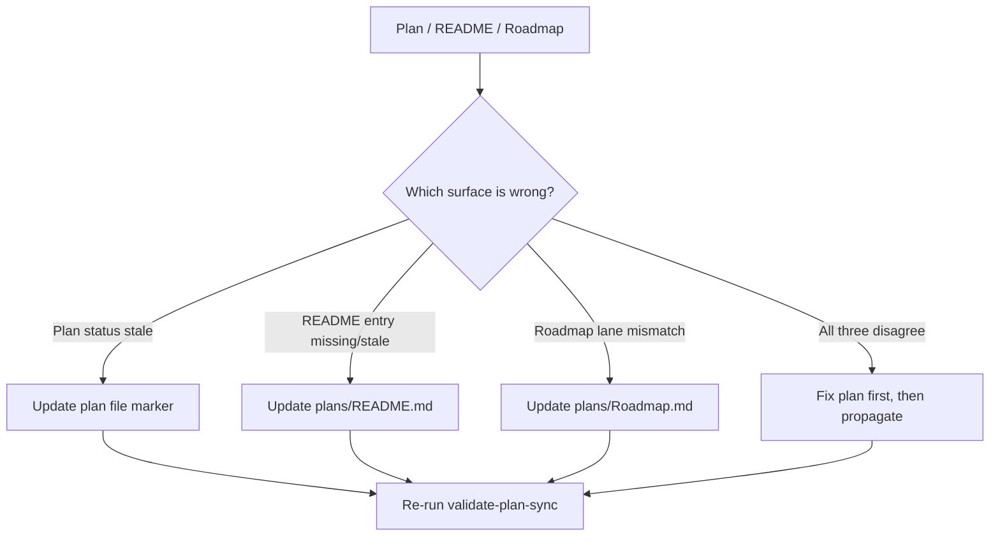

> **Search policy:** Follow the Cortex-First Search Policy from the `research-methodology` skill. Prefer Cortex MCP tools (`search_corpus`, `search_context`, `search_advanced`, `load_chunk`, `traverse_graph`) over native tools (`grep`, `glob`, `view`). Use native tools only as fallback when Cortex is degraded.

# Plan Sync Validation Playbook

Use this skill when a plan is created, registered, updated, or closed to confirm
that the plan file, its index entry in `plans/README.md`, and its roadmap
placement in `plans/Roadmap.md` are all consistent with each other.

This skill is invoked automatically as a gate inside agent workflow flows, and
can also be invoked explicitly before marking a plan step `[DONE]`. When tracker
shape or closure rules are needed, `tracker-handoff` is the canonical skill.

## When to Use

- A new `.plans.md` file is being created and needs to be registered in
  `plans/README.md` and placed in `plans/Roadmap.md`.
- A plan's status marker changes (e.g., from `[PLANNED]` to `[WIP]`) and the
  index and roadmap must reflect the new state.
- Trigger phrases or routing entries in `plans/README.md` are being added or
  edited for an existing plan.
- A plan is being closed and needs to be removed from the active index and
  roadmap, with a compressed record moved to `plans/completed/`.
- A flow gate declares a `plan-sync` check and it must return `"pass": true`
  before the flow step can close.

## When NOT to use

Do NOT use for plan alignment or selection - use `plan-alignment` instead. Do NOT use for tracker updates - use `tracker-handoff` instead.

## Workflow Diagram



## Task Packet

Pass a compact packet that includes the plan file path, its intended status, and
whether this validation is advisory (informational) or blocking (gate must pass).

```text
Use plan-sync-validation for plans/NEATchat.plans.md.
Expected status: [WIP].
README entry: present, trigger phrases: neatchat, retrieval, memory tiers.
Roadmap placement: Phase 7, active lane.
Mode: blocking gate.
```

## Required Workflow

1. Confirm the plan has a top-level `**Status:** [PLANNED|WIP|DONE]` line and
   only one of those three markers is present.
2. Confirm `plans/README.md` has an active guide entry for the plan when its
   status is `[PLANNED]` or `[WIP]`.
3. Confirm `plans/README.md` has relevant trigger phrases so the routing index
   sends agents to the correct plan.
4. Confirm `plans/Roadmap.md` has the plan in the correct phase lane and that
   the lane status agrees with the plan file.
5. Keep all three statuses aligned: plan file, README index, and Roadmap lane
   must all agree.
6. Run the validator script to produce structured gate output:

   ```bash
   node scripts/agent-customization/validate-plan-sync.mjs --json --plan=<path-to-active-plan>
   ```

   The `--plan` argument is required and must name the active plan path (e.g.
   `plans/NEATchat.plans.md`), not the completed archive. Omitting it causes the
   validator to abort with an error.

7. Interpret the gate output. A passing gate returns:

   ```json
   {
     "pass": true,
     "evidence": { "...": "..." },
     "fixHint": "...",
     "owner": "validate-plan-sync.mjs"
   }
   ```

   If `"pass": false`, apply the `fixHint` and re-run before proceeding.

8. When the plan is being closed, confirm that the closed plan and its matching
   `.logs.md` file will move to `plans/completed/` and that the active README
   and Roadmap entries will be removed or updated. Use `tracker-handoff` for the
   closure mechanics.

## Decision Tree



## Before / After Examples

**Before:**

```text
# In plans/README.md (stale)
- **Flappy Visualization** — [WIP] — trigger: flappy viz

# In plan file (already done)
**Status:** [DONE]
```

**After:**

```text
# In plans/README.md (corrected)
- **Flappy Visualization** — [DONE] — trigger: flappy viz

# In plan file (matches)
**Status:** [DONE]
```

## Guardrails

- Do not mark a plan step `[DONE]` if the plan-sync gate returns `"pass": false`.
- Do not create a plan without registering it in `plans/README.md` and placing
  it in `plans/Roadmap.md`.
- Do not leave stale entries for closed plans in the active routing index.
- Do not invent a custom status marker vocabulary; use only `[PLANNED]`, `[WIP]`,
  and `[DONE]`.
- Do not skip the validator script in favor of a manual check alone — the
  structured JSON output is the gate evidence required by flows.
- Do not confuse the active plan path with the archived `plans/completed/` path
  when passing the `--plan` argument.

## Expected Final Output

A successful plan-sync validation reports:

- the plan file path and its current status marker,
- whether `plans/README.md` has a matching active entry and trigger phrases,
- whether `plans/Roadmap.md` has the plan in the correct lane,
- the raw gate JSON result (`pass`, `evidence`, `fixHint`, `owner`),
- any discrepancies found and the fix applied before the gate passed.
