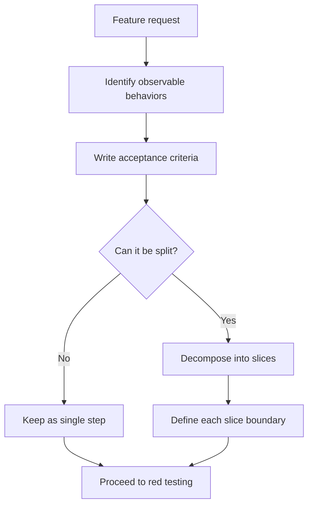
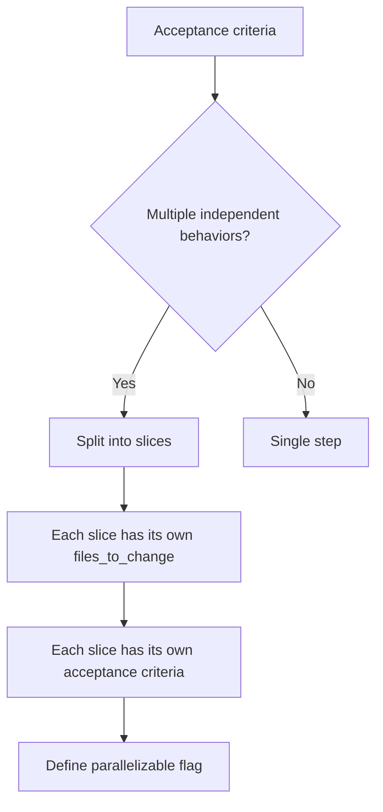

> **Search policy:** Follow the Cortex-First Search Policy from the `research-methodology` skill. Prefer Cortex MCP tools (`search_corpus`, `search_context`, `search_advanced`, `load_chunk`, `traverse_graph`) over native tools (`grep`, `glob`, `view`). Use native tools only as fallback when Cortex is degraded.

# Planning Acceptance Criteria

This skill converts user intent into a precise, testable acceptance criteria set. Each criterion is tied to an observable behavior or validation method, non-goals are made explicit to prevent scope creep, and open assumptions are surfaced before implementation begins.

## When to Use

- At the start of a planning session before implementation, to ensure the done-state is unambiguous.
- When a user request is broad or open-ended and implementation could proceed in multiple directions.
- Before writing a tracker entry to confirm that the task has measurable completion criteria.
- When a prior implementation did not satisfy the user's intent and you need to clarify expectations before retrying.
- When preparing a handoff packet for an implementation agent that needs to know exactly what "done" looks like.
- When scope is likely to widen during implementation and explicit non-goals are needed to contain it.

## When NOT to use

Do NOT use for plan alignment checking - use `plan-alignment` instead. Do NOT use for red test contracts - use `red-test-contracts` instead.

## Workflow Diagram



## Task Packet

Include the user request, the target surface, suspected edge cases, explicit non-goals, and how completion should be validated.

```text
Use planning-acceptance-criteria for <brief task description>.
Target surface: <files, API, or behavior being changed>
Edge cases: <list of conditions that might be overlooked>
Non-goals: <what is explicitly out of scope for this task>
Validation method: <command, manual check, or observable output>
Done-state: <what must be true for this to be complete>
```

## Required Workflow

1. Restate the user intent in your own words to confirm understanding before defining criteria.
2. Write each acceptance criterion as an observable behavior: "Given X, when Y, then Z" or an equivalent concrete statement.
3. Tie each criterion to a validation method: a Jest command, a `node` script, a manual check, or a visible output.
4. Add at least one edge-case criterion for each failure mode or boundary condition that is easy to overlook.
5. Write an explicit non-goals list: capabilities that are adjacent to the task but should not be addressed in this pass.
6. Identify open assumptions: decisions that depend on user preference or environmental state that cannot be determined from the task description alone.
7. Keep the criteria concise enough to fit into a handoff packet; aim for five to ten well-scoped criteria rather than an exhaustive checklist.
8. Surface open assumptions to the user or record them in the tracker before implementation proceeds.

## No Deferred Cleanup — Mandatory Acceptance Criterion

For any step, slice, or task that involves migration, refactoring, or API
replacement, the acceptance criteria MUST include a criterion verifying that
old code is removed in the same step:

> "The old API/implementation is fully removed (no backward-compatibility
> wrappers, no dual-path code, no deferred cleanup) in this step."

This is a non-negotiable acceptance criterion. A step that introduces new code
alongside old code without removing the old code MUST NOT pass acceptance
review. The criterion MUST be observable: cite the specific files or exports
that were deleted, not just "old code removed."

## Before/After Examples: Vague to Precise

**Before (vague):**

```md
- The builder should work correctly.
```

**After (precise):**

```md
- buildMLP() with default config produces a network with exactly 5 nodes
  (2 inputs, 2 hidden, 1 output) and 6 connections.
- buildMLP() with empty hiddenLayers throws an error naming the field.
- Same config + same seed produces identical network shape.
```

## Decision Tree: Splitting Work



## Guardrails

- Do not write implementation-wish criteria ("use X algorithm"); prefer observable behavior criteria ("given input Y, output Z is produced").
- Do not omit non-goals when the task scope is ambiguous; explicit non-goals prevent silent scope creep.
- Do not include more than ten criteria without splitting the task; large criteria sets indicate the task needs decomposition.
- Do not proceed to implementation recommendations within this skill; this skill outputs criteria only.
- Do not tie a criterion to a validation method that does not exist yet; if the validation command needs to be written, note it as a dependency.

## Expected Final Output

- A numbered acceptance criteria list: each criterion observable, each tied to a validation method.
- An explicit non-goals list.
- A list of open assumptions with a recommended resolution action for each.
- Criteria compact enough to be included in a tracker entry or handoff packet.
