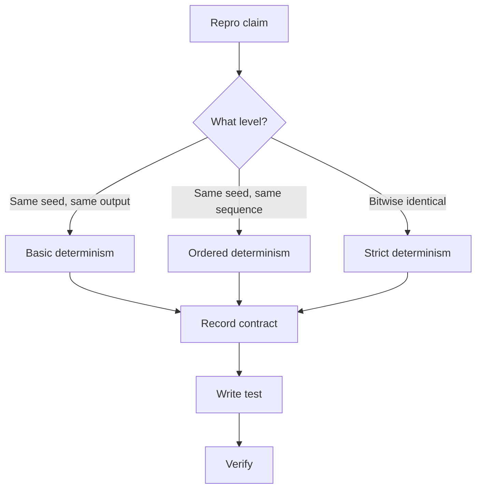
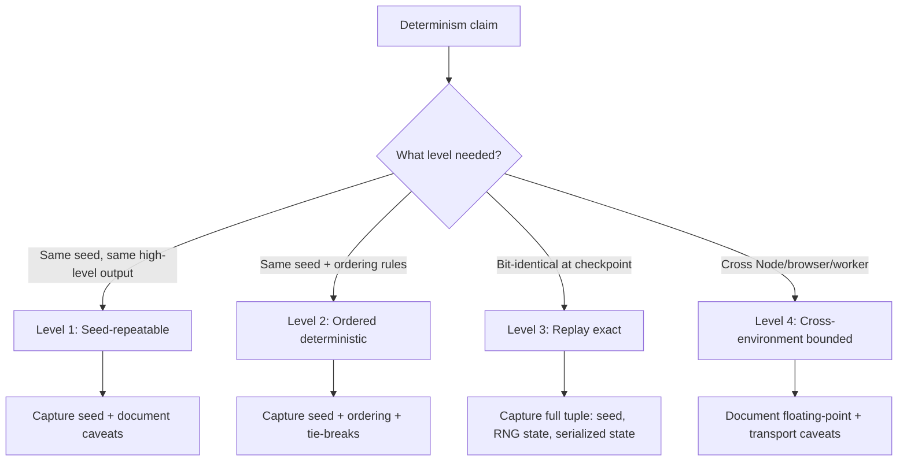

> **Search policy:** Follow the Cortex-First Search Policy from the `research-methodology` skill. Prefer Cortex MCP tools (`search_corpus`, `search_context`, `search_advanced`, `load_chunk`, `traverse_graph`) over native tools (`grep`, `glob`, `view`). Use native tools only as fallback when Cortex is degraded.

# Reproducibility Contracts Playbook

Use this skill when a task needs a durable answer to: "What exactly does same
seed or replay means here?"

This skill owns the cross-cutting contract for deterministic execution and
reproducibility across Node, browser, worker, checkpoint, hybrid-training, and
future NGE surfaces.

It does not replace owner-local skills such as `checkpointing-persistence`,
`worker-inference-transport`, or `hybrid-training-interop`. Instead, it defines
the shared determinism language those skills should reuse.

See [reproducibility sources](./references/reproducibility-sources.md) for
paraphrased reference notes on PRNG state, floating-point caveats, and
structured clone semantics.

## When NOT to use

Do NOT use for stochastic work that does not require determinism guarantees. Do NOT use for checkpoint management - use `checkpointing-persistence` instead.

## Scope Boundary

- In scope: seed semantics, RNG state capture, ordering guarantees, replay
  contracts, deterministic serialization claims, worker-delivery ordering,
  floating-point caveats, exact-versus-best-effort language, telemetry warnings
  for lossy or approximate paths, and validation strategy for deterministic
  claims.
- Out of scope: implementation of a specific checkpoint schema, one worker
  payload format, one ONNX feature, or one training API. Those remain owner-local
  to their respective skills.

## Why This Skill Exists

The roadmap depends on reproducibility in several places:

- Phase 1 correctness and RNG determinism,
- Phase 4 workers and checkpointing,
- hybrid evaluation and parameter-vector contracts,
- NEATchat replayable personalization,
- NGE deterministic development from DNA and experience stream.

Without one shared owner, each plan reinvents its own determinism definition and
the claims drift.

## Determinism Ladder

Always name which rung a feature promises.

### Level 1 — Seed-repeatable

- Same seed and same binary or runtime produce the same high-level result.
- Internal counters, worker scheduling, and serialized artifacts may still vary.

### Level 2 — Ordered deterministic

- Same seed, same inputs, same ordering rules, and same runtime configuration
  produce byte-stable or numerically stable outputs.
- Evaluation order, tie-breaks, and reduction order are explicit.

### Level 3 — Replay exact

- Same seed, same captured RNG state, same serialized state, same environment
  assumptions, and same event or data stream reproduce the same observable
  result at the declared checkpoint boundary.

### Level 4 — Cross-environment bounded

- The repo documents which parts remain invariant across Node, browser, and
  workers, and which parts are only best-effort due to transport or floating-point
  differences.

Do not promise a higher rung than the implementation can defend.

## Reproducibility Tuple

For a strong exact-replay claim, think in terms of:

$$
R = (seed, rng\ state, ordering, serialized\ state, environment, input\ stream)
$$

If any required component is missing, the claim weakens.

## Main Failure Modes

### RNG ambiguity

- Capturing the seed is weaker than capturing the current RNG state.
- Parallel work needs explicit stream partitioning or ordering; otherwise a seed
  alone is not enough.

### Ordering drift

- Object iteration, worker completion order, reduction order, or unstable
  tie-breaks can change outcomes.
- Any aggregation over floating-point values should treat order as part of the
  contract.

### Floating-point drift

- IEEE 754 reduces ambiguity but does not make arithmetic associative.
- Reordered operations may change results.
- "Fast math" style optimizations or mixed precision can silently widen drift.

### Clone or transport drift

- Structured clone preserves data, not full object identity or prototypes.
- Functions, DOM nodes, and some metadata cannot be cloned.
- Replay claims across workers must use clone-safe payloads and explicit state.

## Workflow Diagram



## Task Packet

Pass a compact packet that includes:

- the deterministic claim under review,
- the runtimes involved,
- whether the requirement is seed-repeatable, ordered deterministic, replay exact,
  or cross-environment bounded,
- the state sources that must be captured,
- the acceptance validation.

Compact example:

```text
Use reproducibility-contracts for worker evaluation replay.
Claim: ordered deterministic, not cross-environment exact.
Runtimes: Node main thread plus worker_threads.
State to capture: seed, worker partition order, evaluation queue order, and per-worker RNG stream assignment.
Validation: repeated runs produce identical ordered fitness results and matching checkpoint hashes on the same machine.
```

## Required Workflow

1. Read the smallest relevant roadmap or plan surface that makes the
   determinism claim.
2. Name the exact replay boundary: generation, evaluation batch, checkpoint,
   export, or lifecycle checkpoint.
3. Enumerate the required tuple components: seed, RNG state, ordering,
   serialized state, environment, input stream.
4. Identify what is missing today.
5. Add the smallest focused validation that can falsify the claim.
6. Implement or document the contract in the owner-local surface.
7. Immediately rerun the same focused validation after the first substantive
   edit.
8. If `src/` changed, run `coverage-guard` on every touched source file.
9. Report the exact strength of the resulting reproducibility promise.

## Contract Language Rules

- Use `exact replay` only when RNG state, ordering, serialized state, and
  environment assumptions are all controlled.
- Use `deterministic on the same runtime` when the promise excludes
  cross-environment equivalence.
- Use `best-effort reproducible` when floating-point, lossy encoding, or
  transport differences are known and tolerated.
- Surface lossy or approximate paths through telemetry or metadata instead of
  burying them in docs prose.

## Runtime Rules

### Single-threaded Node or browser paths

- Prefer one explicit RNG owner.
- Keep iteration order and tie-breaks stable.

### Worker paths

- Do not let completion order become the semantic result order.
- Partition randomness explicitly by stream or by deterministic task assignment.
- Keep payloads clone-safe and versioned.

### Checkpoint or resume paths

- Save enough state to resume at the promised determinism level.
- A seed without current RNG state is usually insufficient for exact mid-run
  resume.

## Floating-Point Rules

- Avoid claiming bit-identical cross-platform results unless the environment is
  tightly constrained.
- Treat evaluation order as observable when it affects reductions.
- Be explicit when mixed precision, fast-math, or reordered accumulation can
  change results.

## Validation Cadence

- Same-seed repeated-run test on one runtime.
- Ordered-result stability test for worker or batched evaluation.
- Checkpoint save or resume equivalence test when resume claims are involved.
- Replay hash or output comparison at the declared checkpoint boundary.
- Negative test proving that missing tuple components weaken the claim as
  documented.

## Decision Tree



## Before / After Examples

**Before:**

```ts
// vague: no level named, no caveats
/** Produces deterministic results with the same seed. */
```

**After:**

```ts
// precise: level named, seed and tolerance stated
/**
 * Ordered deterministic (Level 2): same seed, same inputs,
 * and same worker partition order produce identical fitness
 * results on the same runtime. Not cross-environment exact;
 * floating-point accumulation order may differ across Node
 * and browser workers.
 */
```

## Guardrails

- Do not equate seed capture with full replay state.
- Do not claim cross-environment equivalence without naming floating-point and
  transport caveats.
- Do not rely on incidental object property order for public reproducibility.
- Do not let worker completion order decide semantic result order.
- Do not use vague language like "mostly deterministic" when a stronger or weaker
  rung can be named precisely.

## Expected Final Output

A strong reproducibility pass should report:

- the determinism rung implemented or documented,
- the replay boundary,
- which tuple components are captured,
- known caveats that remain,
- focused validation results,
- coverage result for touched `src/` files.
