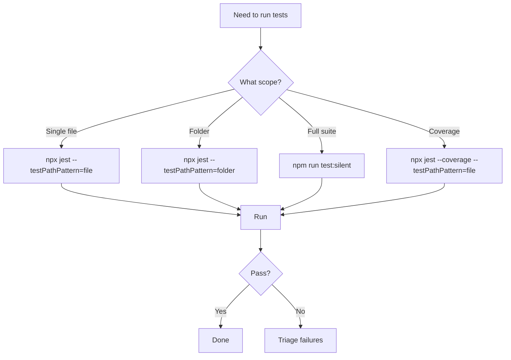
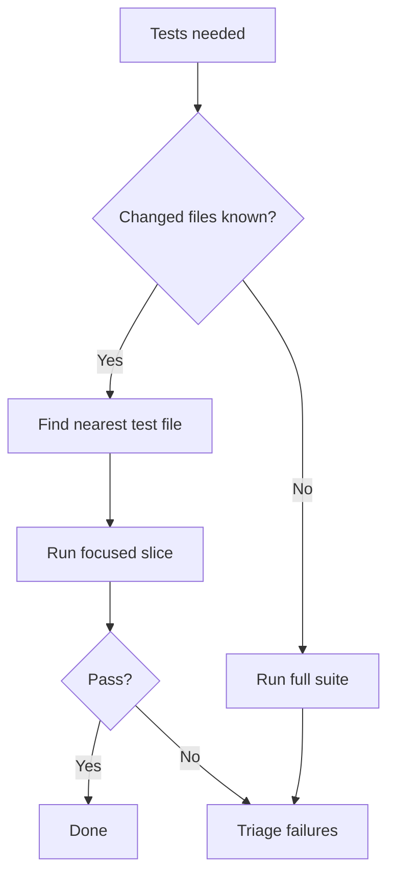

> **Search policy:** Follow the Cortex-First Search Policy from the `research-methodology` skill. Prefer Cortex MCP tools (`search_corpus`, `search_context`, `search_advanced`, `load_chunk`, `traverse_graph`) over native tools (`grep`, `glob`, `view`). Use native tools only as fallback when Cortex is degraded.

# Running Unit Tests

This skill executes a focused Jest command against a bounded test surface and reports the outcome with a minimal, actionable summary. It enforces the rule of running the narrowest possible scope first, separates pre-existing failures from active-change failures, and routes failures to `triaging-test-failures` when ownership is unclear.

## When to Use

- Validating that a new or modified test file is in the expected red or green state.
- Confirming that a targeted implementation change passes its owner-local tests before widening to the full suite.
- Selecting the correct Jest command scope (single file, folder pattern, or full suite) for the current task.
- Producing a bounded summary of test output for a tracker note or handoff packet.
- Checking whether a pre-existing failure is unrelated to the active change before reporting it as a defect.
- Running `npm run test:silent` for repo-wide coverage analysis without verbose output noise.

## When NOT to use

Do NOT use for triaging test failures - use `triaging-test-failures` instead. Do NOT use for coverage verification - use `coverage-guard` instead.

## Workflow Diagram



## Task Packet

Include the focused Jest command or test path pattern, the expected state, and whether failures should be summarized or rerouted to `triaging-test-failures`.

```text
Use running-unit-tests for <test file path or pattern>.
Command: npx jest --config=jest.config.mjs --no-cache --testPathPattern=<path>
Expected state: <red | green>
On failure: <summarize | reroute to triaging-test-failures>
```

## Required Workflow

1. Choose the narrowest Jest scope appropriate for the active change:
   - Single file: `--testPathPattern=src/neat/mutation/neat.mutation.ts`
   - Folder: `--testPathPattern=src/neat/mutation`
   - Full suite (coverage, explicit-only): `npm run test:silent` — only when the user or active step packet explicitly requires a repo-wide run.
2. Run the focused command; do not run `npm test` (which triggers a full build) until the targeted slice is green and the full suite is explicitly required.
3. Read the exit status and failure output; do not declare green until the requested command passes cleanly.
4. Separate failures into two groups: caused by the active change, and pre-existing/unrelated.
5. For pre-existing failures: note them and confirm they were present before the active change.
6. For active-change failures: report the command, the failing test name, and the first meaningful error line.
7. If failure ownership is unclear or multiple failures span unrelated files, route to `triaging-test-failures`.
8. For coverage runs: report statement, branch, function, and line percentages for touched files.
9. Report command run, pass/fail evidence, and reroute recommendation in the session output.

## Why Focused Tests First

The full test suite is large and slow. Running it speculatively wastes time and produces noise. Focused slices test only the boundary that changed, giving fast feedback on whether the change is correct. Start with the narrowest test that covers the changed code, then expand only if the focused slice passes but you suspect broader issues.

## Decision Tree: Scope Selection



## Before / After Examples

**Before:**

```text
Ran tests. Some failed. Need to fix the mutation test.
```

**After:**

```text
Command: npx jest --config=jest.config.mjs --no-cache --testPathPattern=src/neat/mutation
Result: PASS — 42 passed, 0 failed (exit 0)
Touched files: src/neat/mutation/neat.mutation.ts
Coverage: statements 100%, branches 100%, functions 100%, lines 100%
```

## Guardrails

- Do not run `npm test` or the full suite speculatively. The full suite (`npm test`, `npm run test:silent`, `npm run jest:esm-ts`, `npm run jest:mjs`) is large and slow. Only run it when the user or active step packet explicitly requires a repo-wide run; otherwise stay on focused slices.
- Do not claim green until the requested command exits with code 0.
- Do not conflate pre-existing failures with active-change failures; always separate them.
- Do not attempt to fix failures within this skill; diagnosis belongs to `triaging-test-failures` and fixes belong to the appropriate implementation skill.
- Do not widen the test scope prematurely; a focused red test is more actionable than a noisy full-suite run.
- Do not omit the `--no-cache` flag when running focused Jest commands; stale cache can produce misleading results.

## Expected Final Output

- Commands run, exit status, and pass/fail evidence (pass count, fail count, first error for each failure).
- Separation of active-change failures from pre-existing/unrelated failures.
- If green: confirmation that the focused slice passes and readiness to widen scope.
- If failing and scope is clear: summary for the `triaging-test-failures` skill.
- If coverage was requested: per-file statement/branch/function/line percentages for touched files.
