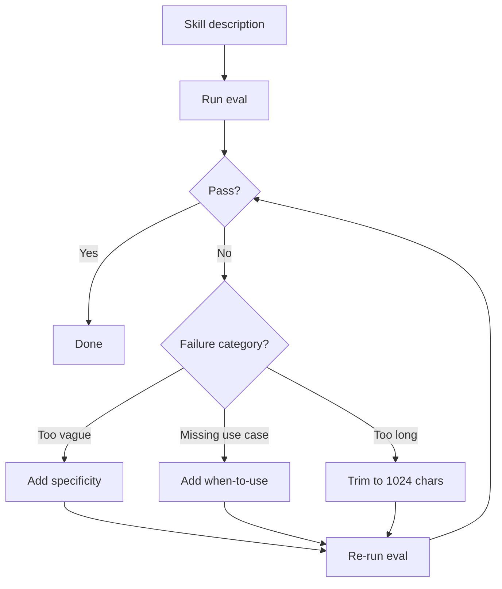
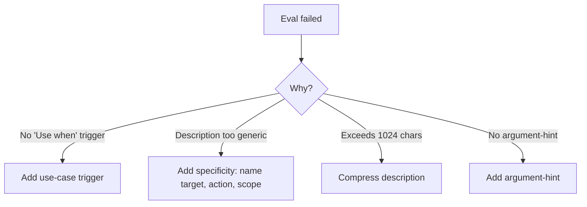

> **Search policy:** Follow the Cortex-First Search Policy from the `research-methodology` skill. Prefer Cortex MCP tools (`search_corpus`, `search_context`, `search_advanced`, `load_chunk`, `traverse_graph`) over native tools (`grep`, `glob`, `view`). Use native tools only as fallback when Cortex is degraded.

# Skill Description Evals

This skill designs and grades trigger evaluation sets for NeatapticTS skill and agent descriptions. A description is the sole discovery surface; this skill validates that it fires on the right prompts and stays silent on near-misses, then feeds failures back into the description without overfitting.

## When to Use

- A skill or agent is triggering too broadly (false positives on unrelated tasks).
- A skill or agent is failing to trigger on prompts that clearly belong to it.
- A description has been rewritten and needs a before/after trigger comparison.
- Optimizing a description that is approaching the 1024-character Agent Skills limit.
- Building initial eval coverage for a newly created skill or agent before it goes live.
- Preparing evidence that a description change improved precision without reducing recall.

## When NOT to use

Do NOT use for output evaluation - use `skill-output-evals` instead. Do NOT use for frontmatter validation - use `skill-frontmatter-standards` instead.

## Workflow Diagram



## Task Packet

Include the skill or agent name, the intended trigger scope, any observed false-positive or false-negative examples, and whether you want train-only or train+validation split eval sets.

```text
Use skill-description-evals for <skill-name | agent-name>.
Intended scope: <concise trigger description>
Observed false positives: <example prompts that should NOT trigger>
Observed false negatives: <example prompts that SHOULD trigger>
Eval mode: <train-only | train+validation split>
```

## Required Workflow

1. Define the intended trigger scope precisely: what tasks belong to this skill/agent and what do not.
2. Write at least five should-trigger queries covering realistic phrasing variations, including casual wording, typos, and multi-step prompts.
3. Write at least five should-not-trigger queries: near-misses that share vocabulary but belong to a different skill or agent.
4. Split queries into train (used to refine the description) and validation (held out to check for overfitting) groups when doing iterative optimization.
5. Grade each query as pass or fail against the current description; record the evidence.
6. Identify failure categories (too broad, too narrow, wrong vocabulary, confusable with sibling skill).
7. Revise the description based on failure patterns; avoid adding exact failed-query keywords as one-off fixes.
8. Keep the revised description under 1024 characters.
9. Record trigger rates and failure categories in the active plan.

## Before/After Description Examples

**Before (vague):**

```yaml
description: 'Helps with tests.'
```

**After (specific):**

```yaml
description: 'Run focused Jest slices for specific source boundaries. Use when validating a code change with the nearest test file, not for full suite runs.'
```

## Decision Tree: Failure Categories



## Guardrails

- Do not add exact failed-query keywords to the description as mechanical patches; fix the underlying scope language.
- Do not skip the should-not-trigger set; false positives are as harmful as false negatives.
- Do not run all queries against the same description snapshot and claim optimization — use a train/validation split to avoid overfitting.
- Do not exceed 1024 characters in the final description; trim or restructure rather than truncate.
- Do not confuse a description fix with a skill content fix; if the skill body is wrong, fix that separately.

## Expected Final Output

- A structured eval set: should-trigger queries, should-not-trigger queries, pass/fail grades, and failure categories.
- A revised description that improves precision and recall compared to the baseline.
- Train and validation pass rates recorded.
- Failure categories and description rationale documented in the active plan.
