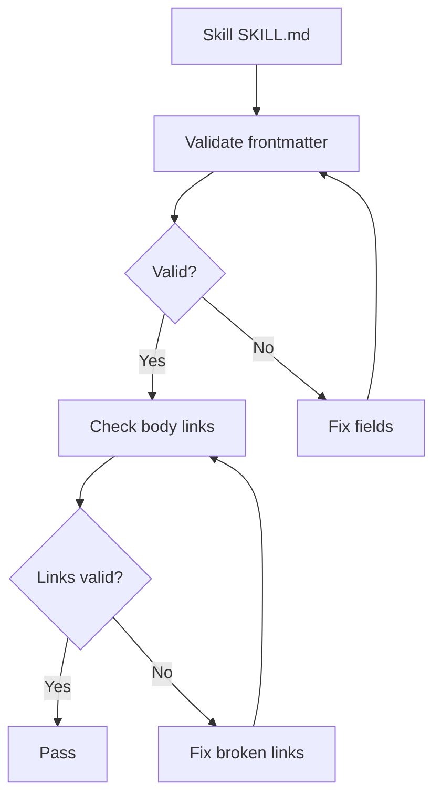
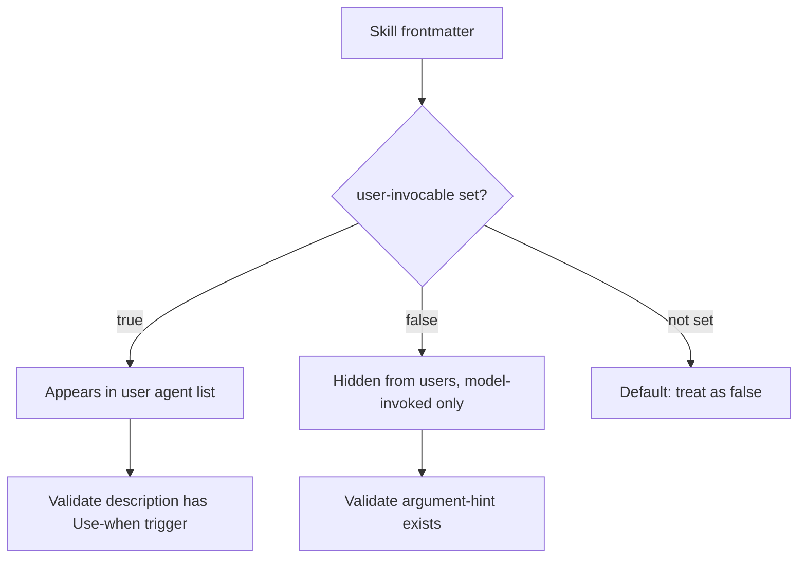

> **Search policy:** Follow the Cortex-First Search Policy from the `research-methodology` skill. Prefer Cortex MCP tools (`search_corpus`, `search_context`, `search_advanced`, `load_chunk`, `traverse_graph`) over native tools (`grep`, `glob`, `view`). Use native tools only as fallback when Cortex is degraded.

# Skill Frontmatter Standards

This skill governs the design and validation of YAML frontmatter in `.github/skills/<skill-name>/SKILL.md` files. It ensures that every skill has a discoverable description, a compact argument hint, a correct visibility flag, and passes the automated skill frontmatter validator.

## When to Use

- Creating a new skill folder and need to establish correct initial frontmatter.
- Updating a description that is triggering too broadly or not triggering on expected prompts.
- Adding or refining an `argument-hint` field to help callers shape their task packets.
- Deciding whether a skill should be `user-invocable: true` or hidden with `false`.
- Moving skill-specific scripts, templates, or resources into the owning skill folder.
- Running `validate-skill-frontmatter.mjs` in strict mode to confirm all skills meet the standard.

## When NOT to use

Do NOT use for agent frontmatter validation - use `agent-frontmatter-standards` instead. Do NOT use for skill output evaluation - use `skill-output-evals` instead.

## Workflow Diagram



## Task Packet

Include the skill folder name, the specific frontmatter fields being changed, the intended trigger scope, and whether strict validation is expected to pass.

```text
Use skill-frontmatter-standards for <skill-folder-name>.
Fields: <e.g. description, argument-hint, user-invocable>
Trigger scope: <what tasks should activate this skill>
Strict mode: <yes | not yet>
Validate with: node scripts/agent-customization/validate-skill-frontmatter.mjs --json --strict
```

## Required Workflow

1. Confirm that the skill folder name and the `name` frontmatter field match exactly and use lowercase kebab-case.
2. Review the description for trigger clarity: it should start with `Use when:` or a similar trigger phrase and scope the skill precisely.
3. Keep the description under 1024 characters (the Agent Skills limit).
4. Add or refine the `argument-hint` field so callers know exactly what to include in their task packet.
5. Set `user-invocable` intentionally: `false` for narrow helpers and internal specialists, `true` only for skills meant for direct user invocation.
6. Move any skill-specific scripts, templates, or reference files into the owning skill folder rather than a shared location.
7. Run `node scripts/agent-customization/validate-skill-frontmatter.mjs --json --strict` after metadata edits.
8. Record validation output and any residual routing risk in the active plan or chat summary.

## Decision Tree: User-Invocable Visibility



## Before / After Examples

**Before (too broad):**

```yaml
description: 'Helps with testing and coverage tasks across the codebase.'
```

**After (well-scoped with Use-when trigger):**

```yaml
description: 'Use when: expanding test coverage for a specific src/ file that is below 100% in any category and the test suite is already green.'
```

## Guardrails

- Do not use a skill `name` that differs from its folder name; the mismatch causes silent routing failures.
- Do not write descriptions that are so broad they trigger on unrelated tasks; use `skill-description-evals` to test before finalizing.
- Do not omit `argument-hint` for skills that are broad enough to need task shaping.
- Do not set `user-invocable: true` for narrow internal helpers that should only be called by orchestrators.
- Do not exceed 1024 characters in descriptions; trim or restructure rather than truncate.
- Do not skip strict validation when the full skill inventory is expected to be stable.

## Expected Final Output

- The target `SKILL.md` has correct, validated frontmatter with `name`, `description`, `argument-hint`, `user-invocable`, and `disable-model-invocation`.
- `node scripts/agent-customization/validate-skill-frontmatter.mjs --json --strict` exits cleanly.
- Visibility decision, trigger-scope rationale, and any residual routing risk are recorded in the active plan.
