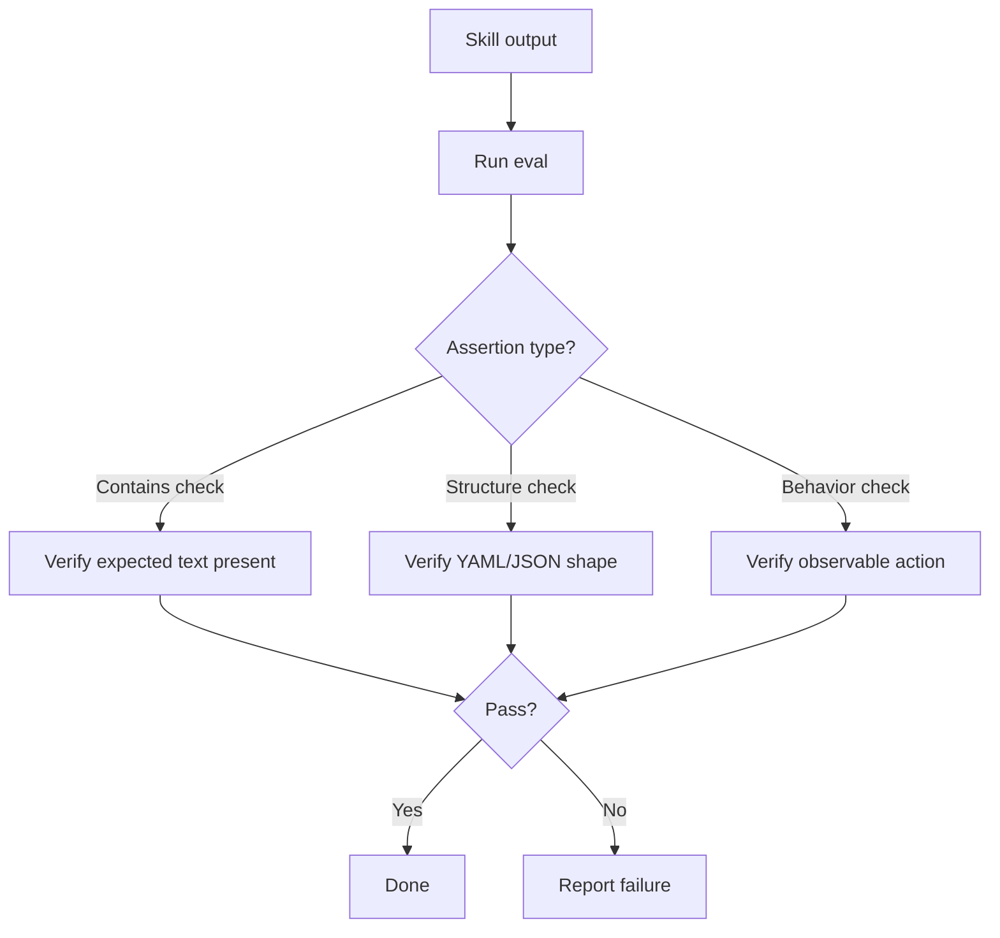
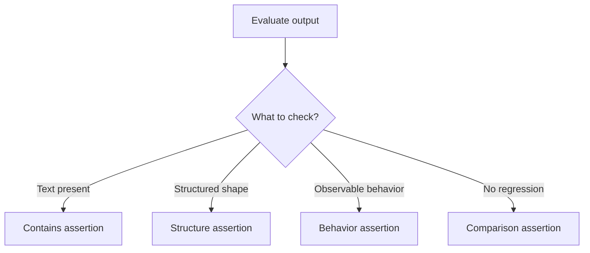

> **Search policy:** Follow the Cortex-First Search Policy from the `research-methodology` skill. Prefer Cortex MCP tools (`search_corpus`, `search_context`, `search_advanced`, `load_chunk`, `traverse_graph`) over native tools (`grep`, `glob`, `view`). Use native tools only as fallback when Cortex is degraded.

# Skill Output Evals

This skill designs and runs evidence-backed output evaluations for NeatapticTS skills. It compares with-skill behavior against a no-skill baseline or a prior skill version, grades each assertion mechanically where possible, and aggregates pass rates to support a keep/revise/remove decision.

## When to Use

- A skill has been created or significantly revised and needs quality evidence beyond manual inspection.
- Deciding whether a specialist skill meaningfully improves output compared to a plain prompt.
- A skill produced unexpected output and you need structured evidence of what went wrong.
- Preparing a before/after comparison to justify a skill rewrite in a tracker.
- Checking that a skill's output contract matches what downstream agents or orchestrators expect.
- Aggregating pass rates across multiple fixtures to identify the weakest assertion category.


## When NOT to use

Do NOT use for description evaluation - use `skill-description-evals` instead. Do NOT use for frontmatter validation - use `skill-frontmatter-standards` instead.


## Workflow Diagram



## Task Packet

Include the skill name, the eval fixtures (realistic prompts with expected outputs), the assertion type (mechanical or qualitative), and the baseline to compare against.

```text
Use skill-output-evals for <skill-name>.
Fixtures: <list of prompt/expected-output pairs>
Assertions: <file existence | JSON validity | count | qualitative>
Baseline: <no-skill | previous skill snapshot>
Record in: <plan file or chat summary>
```

## Required Workflow

1. Define each eval fixture: a realistic prompt, optional input files, the expected output, and objective assertions.
2. Identify which assertions can be graded mechanically (file existence, JSON validity, line count, regex match) and which require human review.
3. Run the skill against each fixture; collect raw outputs.
4. Run the baseline (no-skill or prior version) against the same fixtures for comparison.
5. Grade each assertion with concrete evidence — output snippets, counts, or script results — not impressionistic judgment.
6. Use scripts for mechanical checks (e.g., `jq` for JSON validity, `wc -l` for output length).
7. Aggregate pass rate, timing, and token cost when available; group failures by category.
8. Feed failure patterns back into skill instructions; avoid overfitting instructions to a single fixture prompt.
9. Record pass rate, failure categories, and keep/revise/remove recommendation in the active plan.


## Before/After Output Comparison

**Before (weak output):**
```text
TASK_STATUS: done
FILES_CHANGED: some files
```

**After (structured output):**
```text
TASK_STATUS: SUCCESS
FILES_CHANGED:
- src/architecture/network/builders/gru.ts
- testing/architecture/network/builders/gru.test.ts
VALIDATION_EVIDENCE:
- tsc: OK
- jest: 3/3 passed
```

## Decision Tree: Assertion Type



## Guardrails

- Do not grade outputs impressionistically; every assertion must cite evidence (a snippet, a count, a script result).
- Do not tune skill instructions to exactly match a single failing fixture; look for the underlying pattern.
- Do not compare with-skill and baseline outputs using different prompts; fixtures must be identical across both runs.
- Do not record only pass rates without failure categories; failure grouping is the actionable part.
- Do not skip qualitative human review for output properties that cannot be mechanically graded.

## Expected Final Output

- A structured eval table: fixture, assertion, with-skill result, baseline result, and pass/fail.
- Aggregated pass rate and failure categories.
- A keep/revise/remove recommendation with evidence.
- The active plan updated with eval results and next action (if revising, a concrete instruction change).
