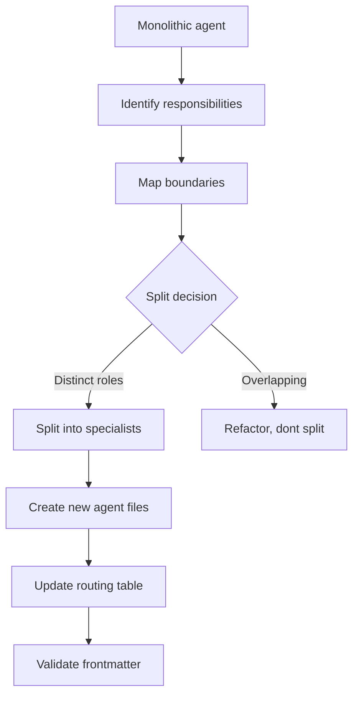
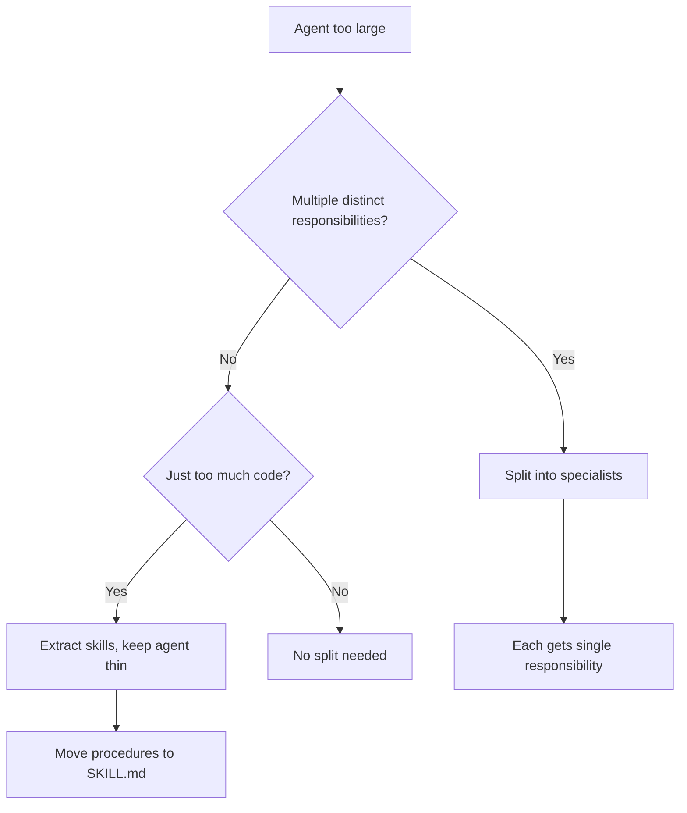

> **Search policy:** Follow the Cortex-First Search Policy from the `research-methodology` skill. Prefer Cortex MCP tools (`search_corpus`, `search_context`, `search_advanced`, `load_chunk`, `traverse_graph`) over native tools (`grep`, `glob`, `view`). Use native tools only as fallback when Cortex is degraded.

# Splitting Monolithic Agent

This skill decomposes an overloaded `.agent.md` file into a bounded orchestrator, hidden specialists, and reusable skills. It preserves the original user-visible API unless an explicit rename is approved, and ensures every new boundary has a validated output contract and delegation edge before the split is declared complete.

## When to Use

- An agent carries too much context, too many tools, or responsibilities that span multiple SDLC phases.
- An agent body contains durable workflow procedures that belong in skills.
- A single agent is listed in too many parent allow-lists, indicating its responsibilities have drifted.
- A coordination layer (orchestrator or sub-orchestrator) needs to be separated from execution logic (specialist).
- The customization system has accumulated routing debt and needs a structural cleanup.
- Preparing a before/after split map for a tracker or plan alignment review.


## When NOT to use

Do NOT use for splitting code modules - use `solid-split` instead. Do NOT use for creating new agents - use `creating-specialist-agent` instead.


## Workflow Diagram



## Task Packet

Include the source agent name, the responsibilities to split, the desired compatibility surface (what callers should still be able to do unchanged), and whether strict validation is expected to pass after the split.

```text
Use splitting-monolithic-agent for <source-agent-name>.
Responsibilities to split: <list of distinct jobs>
Compatibility: <preserve original user-visible name | rename approved>
Candidate specialists: <list of narrow job names>
Skills to extract: <list of reusable procedures>
Validate with: node scripts/agent-customization/validate-agent-frontmatter.mjs --json
             node scripts/agent-customization/validate-agent-graph.mjs --json
```

## Required Workflow

1. Inventory all responsibilities of the source agent; list each as a distinct job statement.
2. Classify each job: coordination (→ orchestrator body), narrow repeatable execution (→ hidden specialist), reusable procedure (→ skill).
3. Preserve the original user-visible agent name and `user-invocable` setting unless the user explicitly approves a rename.
4. Move coordination and routing logic into an orchestrator or sub-orchestrator body.
5. Create hidden specialists for each narrow, tool-specific job using the `creating-specialist-agent` skill.
6. Extract reusable workflow procedures into skills using the `skill-frontmatter-standards` and `updating-skill-frontmatter` skills.
7. Update `agents: [...]` allow-lists: each orchestrator lists only the specialists it directly delegates to; avoid `agents: '*'`.
8. Define an explicit output contract for each new boundary so the orchestrator can consume specialist output deterministically.
9. Add eval or validation coverage for the new routing boundary to detect regressions.
10. Run `node scripts/agent-customization/validate-agent-frontmatter.mjs --json` and `validate-agent-graph.mjs --json` to confirm no orphaned edges or frontmatter errors.


## Decision Tree: Split Decisions



## Guardrails

- Do not rename or remove the original user-visible agent without explicit user approval.
- Do not use `agents: '*'` on any new orchestrator; always use explicit allow-lists.
- Do not leave durable workflow procedure in an agent body; move it to a skill.
- Do not create a new specialist for a job that a skill could handle without isolated context or tool restriction.
- Do not skip output contract definition for new boundaries; orchestrators must be able to consume specialist output without guessing the format.
- Do not declare the split complete before both frontmatter and graph validation scripts pass.

## Expected Final Output

- A split map: source agent → orchestrator + list of specialists + list of extracted skills.
- Files changed: updated source agent, new specialist `.agent.md` files, new or updated skill `SKILL.md` files, updated parent allow-lists.
- Compatibility decision documented: original name preserved or rename rationale recorded.
- `validate-agent-frontmatter.mjs --json` and `validate-agent-graph.mjs --json` both pass.
- Residual manual-review items (e.g., callers to update, eval gaps) listed in the active plan.
