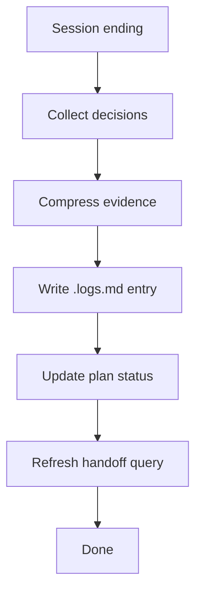
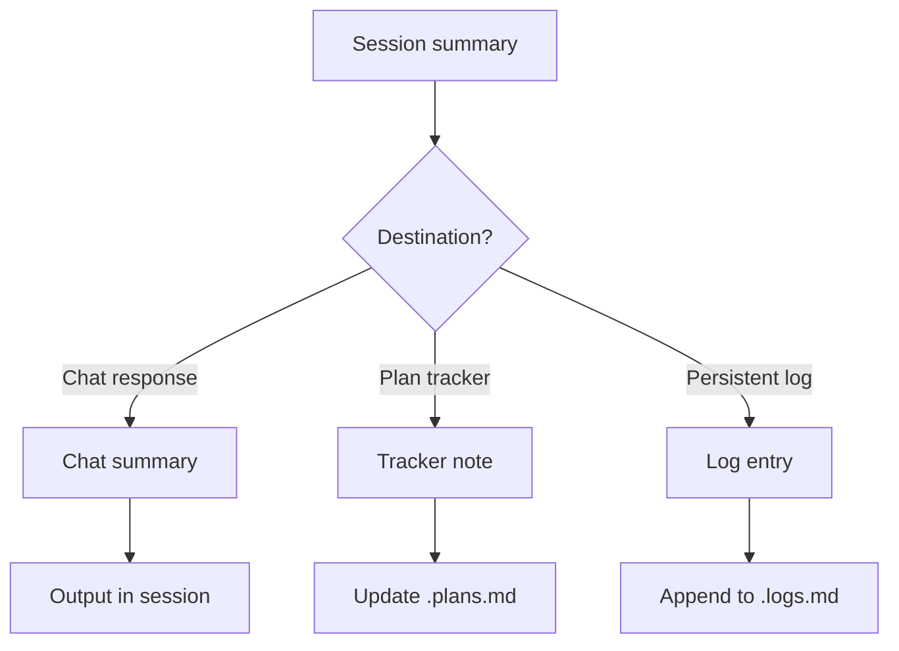

> **Search policy:** Follow the Cortex-First Search Policy from the `research-methodology` skill. Prefer Cortex MCP tools (`search_corpus`, `search_context`, `search_advanced`, `load_chunk`, `traverse_graph`) over native tools (`grep`, `glob`, `view`). Use native tools only as fallback when Cortex is degraded.

# Summarizing Session Log

This skill produces compact, high-signal continuity summaries of a work session. It distills what changed, what was validated, what learning events were recorded, what risks remain, and what the next action is — without replaying the full transcript. Use it at session end, before a handoff, or when updating a tracker with session progress.

## When to Use

- Ending a session and needing a compact record that a future session can resume from.
- Updating a `.plans.md` tracker with session progress before closing the file.
- Producing a final chat summary that captures the essential outcome without transcript replay.
- After a batch of agent/skill customization changes and needing a structured before/after record.
- Preparing a handoff packet for a companion agent or a different SDLC phase.
- After a coverage or test tranche to record which files were touched and what passed.


## When NOT to use

Do NOT use for active tracker management - use `tracker-handoff` instead. Do NOT use for plan validation - use `plan-sync-validation` instead.


## Workflow Diagram



## Task Packet

Include the workstream name, the files changed, the validations run, any learning events captured, and the intended summary destination.

```text
Use summarizing-session-log for <workstream name>.
Files changed: <list>
Validations run: <commands and pass/fail status>
Learning events: <event types recorded>
Residual risks: <list>
Next action: <what should happen next>
Destination: <chat summary | tracker note | log entry>
```

## Required Workflow

1. Identify the summary destination: chat summary, tracker note (in a `.plans.md` file), or log entry.
2. List files changed during the session with a one-phrase description of each change.
3. Record validations run: command, exit status, and the smallest meaningful failure summary if any failed.
4. Note learning events captured (event type and file, not full JSON) as a cross-reference.
5. Identify residual risks: open items, known regressions, deferred decisions, or unconfirmed changes.
6. State the next action clearly: what should happen at the start of the next session.
7. For tracker notes: update the relevant `.plans.md` `[WIP]`/`[DONE]` markers and append the summary under a `## Session Notes` or `## Handoff` section.
8. For chat summaries: output the summary in the session response; do not create a new file unless the user explicitly asked for one.
9. Keep public summaries free of private or chat-only detail that does not help continuation.


## Why Compression Matters for Context Budget

Session logs that preserve full transcripts consume context budget in future sessions that load them. Compression to concise coverage notes prevents re-exploration while keeping the log lightweight. A good compressed log entry captures what was done, what was verified, and what remains - not the full command transcript. This is especially important for agents with limited context windows that need to resume work efficiently.

## Concrete Log Structure Examples

**Good compressed entry:**
```md
### Builder: GRU implementation
- Implemented buildGRU() with config validation and roundtrip test
- Coverage: 100% all categories, focused slice passed
- JSDoc complete, npm run docs verified
- Plan updated, tracker-handoff completed
```

**Bad verbose entry (avoid):**
```md
### Builder: GRU implementation
- Ran `npx tsc --noEmit -p tsconfig.json` and got 0 errors
- Ran `npm run lint` and got 0 issues
- Ran `npx jest --testPathPattern=gru` and saw:
  PASS testing/architecture/network/builders/gru.test.ts
  Test Suites: 1 passed, 1 total
  Tests: 4 passed, 4 total
  ... (50 more lines of output)
```

## Decision Tree



## Guardrails

- Do not create a session log file when the user explicitly forbids it.
- Do not replay the full transcript; extract only high-signal evidence: files changed, validations, blockers, next action.
- Do not conflate a durable tracker update with a transient chat summary; keep them separate.
- Do not omit residual risks even when they are minor; they are the primary value for the next session.
- Do not include detail that is only meaningful in the current chat context and will not aid future continuity.

## Expected Final Output

- A structured summary with: files changed, validations run (with pass/fail), learning events cross-referenced, residual risks, and next action.
- If destination is a tracker: the `.plans.md` file is updated with session progress and next action.
- If destination is a chat summary: the summary is output directly in the session response.
