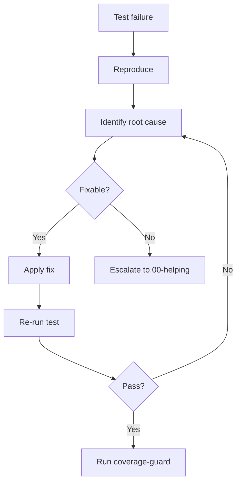
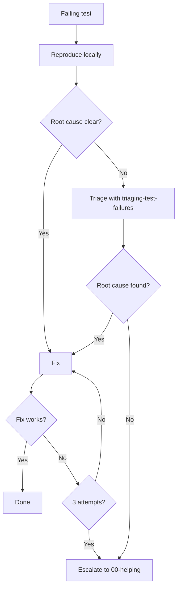

> **Search policy:** Follow the Cortex-First Search Policy from the `research-methodology` skill. Prefer Cortex MCP tools (`search_corpus`, `search_context`, `search_advanced`, `load_chunk`, `traverse_graph`) over native tools (`grep`, `glob`, `view`). Use native tools only as fallback when Cortex is degraded.

# Test Fix Workflow

Use this skill when multiple test failures need a disciplined, low-distraction
repair pass.

This skill is the canonical workflow for multi-failure test repair in this
repo. It owns the durable planning sequence, validation cadence, and the rule
that broad test execution happens only after the planned fixes are applied.

Inside each planned failure cluster, the preferred execution order is TDD:
narrow red test first, implementation second, narrow green validation third,
and coverage expansion on the new or directly related area before the final
broad suite run.

When this workflow updates a durable fix tracker, `tracker-handoff` owns the
canonical tracker format and continuation prompt shape.

## When to Use

- The user asks to fix multiple test failures.
- The failure output spans more than one file, subsystem, or failure class.
- The work needs a durable plan rather than ad hoc trial-and-error.
- TypeScript errors, runtime issues, and test assertions are mixed together.

Do not invoke this skill for a single obvious failing assertion unless the task
is likely to expand into a broader failure-repair pass.

Do not invoke this skill for **coverage expansion** on passing code. Use
`coverage-tranche` instead when the test suite is green and the goal is to
raise coverage metrics toward 100%. The two skills are complements: this skill
repairs failures first; `coverage-tranche` expands coverage afterward.


## When NOT to use

Do NOT use for triaging failures when root cause is unknown - use `triaging-test-failures` first. Do NOT use for coverage enforcement - use `coverage-guard` instead.


## Workflow Diagram



## Task Packet

Pass a compact packet that includes:

- failing surface or package area,
- available failure output or prior diagnosis,
- whether the failures are type-level, runtime, assertion-level, or mixed,
- existing plan path if one already exists,
- whether broad test execution is currently blocked or expensive,
- required final validations.

Compact example:

```text
Use test-fix-workflow for failing Flappy Bird trainer tests.
Available output: ts errors in trainer/evaluation plus 6 runtime test failures.
Type: mixed TypeScript + runtime.
Plan: plans/TestsFix.md.
Final validation: npx tsc --noEmit -p tsconfig.test.json, then focused Jest slices; only run the full suite when explicitly required.
```

## Required Workflow

The full test suite (`npm test`, `npm run test:silent`, `npm run jest:esm-ts`,
`npm run jest:mjs`) is large and slow. **Never run it speculatively.** Stay on
narrow red/green reruns for the active fix cluster. Only run the repo-wide
suite at the end if the user or active step packet explicitly requires
repo-wide confirmation.

1. Create or update a durable fix plan before changing code.
   - If the tracker format itself is being created or rewritten, follow
     `tracker-handoff` for `[PLANNED]`, `[WIP]`, `[DONE]`, compression, and
     `Handoff query` structure.
2. Group failures by class.
   - Typical buckets: TypeScript compilation blockers, runtime logic, async or
     sequencing issues, assertion drift, and investigation-required failures.
3. Prioritize the plan.
   - Prefer: blocking type errors first, then cheap/high-confidence fixes, then
     deeper investigation items.
4. Prefer a TDD loop inside each fix cluster.

- Add or reshape the smallest test that should fail for the intended
  behavior or regression.
- Run only that narrow surface to confirm the red phase when practical.
- Implement the repair.
- Rerun only that narrow surface until it turns green.

5. Apply all planned fixes systematically before running broad tests.
6. Do not run `npm test`, `npm run test:silent`, or broad failure scans during
   the main fix phase.

- Narrow red/green reruns for the active fix cluster are allowed.

7. TypeScript-only validation is allowed during the fix phase when it helps
   confirm compile-time repairs.
8. After the targeted fixes are green, run `coverage-guard` on every `src/`
   file touched by the repair. Coverage must reach 100% (statements, branches,
   functions, lines) for every changed file before the session is marked done.
   Partial coverage is a bug in the change, not an acceptable tradeoff.
9. After the planned fixes and coverage gate are both green, run the final
   broad validation.
10. Analyze any remaining failures and update the plan rather than switching to
    unstructured iteration.


## Decision Tree: Repair vs Escalate



## Before / After Examples

**Before:**
```text
5 tests failing in flappy trainer. Seems like a timing issue. Will try increasing timeout.
```

**After:**
```text
Root cause: evaluation loop awaited batch results out of order after async refactor.
Fix: restore ordered result assembly in evaluateInWorkers.
Validation: npx jest --testPathPattern=testing/flappy/trainer → 6/6 pass
Coverage: coverage-guard on src/flappy/trainer.ts → 100% all categories
```

## Guardrails

- Do not prepend specific calendar dates to durable fix-plan headings, status
  logs, or handoff sections. Use stable undated labels so the plan can be
  revised cleanly across sessions.
- Do not use ad hoc plan markers when a fix tracker is updated; use
  `tracker-handoff` conventions instead.
- When the fix workstream becomes fully complete, finish by using
  `tracker-handoff` to compress the `.plans.md` file into a short closed
  tracker, add or update the same-boundary `.logs.md` file, and archive both
  files into `plans/completed/`.
- Do not preserve a `Handoff query` on a terminally closed fix plan unless the
  user explicitly wants reopen guidance.
- Do not bounce between test execution and partial fixes when the workflow is
  still in the main repair phase.
- Do not skip the red phase for behavior-changing work unless the task is
  purely documentation, reconnaissance, or a mechanical edit with no runtime
  behavior change.
- Do not treat partial reruns as a substitute for a durable plan.
- Do not improvise a new order once the plan is in motion unless new evidence
  forces a reprioritization.
- Do not run the full suite before the planned fixes are actually in place.

## Validation Rules

Preferred validation cadence:

- During the fix phase: narrow red/green test reruns for the active cluster,
  plus `npx tsc --noEmit -p tsconfig.test.json` when needed.
- After the cluster is green: run `coverage-guard` on every `src/` file
  touched by the repair. All four categories must reach 100% for each file.
  Use the dead-code rule: remove unreachable branches rather than forcing
  contorted tests.
- After all planned fixes and the coverage gate: run `npm run test:silent` **only
  if** the user or active step packet explicitly requires repo-wide
  confirmation. Otherwise, report the focused cluster results as the final
  validation evidence.

**Coverage is a hard gate, not a recommendation.** No test-fix session is
complete until every changed `src/` file is at 100% and the suite is green.

If the task is compile-heavy rather than runtime-heavy, file- or package-level
diagnostics may be enough before the final suite run.

## Expected Final Output

A strong run should report:

- the plan file used or created,
- the failure categories addressed,
- which validations were intentionally deferred until the end,
- `coverage-guard` result for every changed `src/` file (per-file 100%
  confirmation or gaps resolved),
- final focused-slice result (and repo-wide suite result only when explicitly required),
- new green baseline (suite count, test count),
- any remaining failures or follow-up items.
