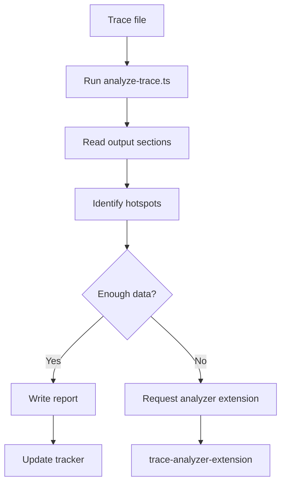
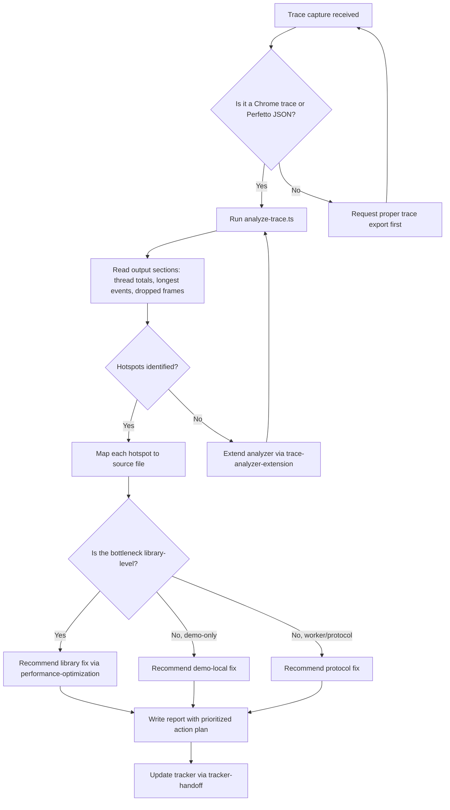

> **Search policy:** Follow the Cortex-First Search Policy from the `research-methodology` skill. Prefer Cortex MCP tools (`search_corpus`, `search_context`, `search_advanced`, `load_chunk`, `traverse_graph`) over native tools (`grep`, `glob`, `view`). Use native tools only as fallback when Cortex is degraded.

# Trace Audit Reporting Playbook

Use this skill when an agent needs to inspect a Chrome or Perfetto trace,
summarize hotspots, connect them back to workspace code, and produce a durable
performance report.

This skill owns the durable workflow for trace-based performance diagnosis in
NeatapticTS. It converts raw trace data into layered, source-mapped findings and
a prioritized action plan. When the report lives in a continuing tracker file,
`tracker-handoff` owns the canonical plan/log structure and copy-paste
continuation format. When a trace reveals a library-level bottleneck that needs
implementation, hand off to `performance-optimization`.

## When to Use

- Analyzing a Chrome trace export or Perfetto JSON capture.
- Investigating renderer, worker, GPU, `requestAnimationFrame`, or `postMessage`
  bottlenecks.
- Determining whether a regression is demo-layer, protocol-layer, or
  core-library in origin.
- Writing a report into a plan file such as `performance.plan.md`.
- Reusing the repository trace tooling instead of manually inspecting raw JSON.
- A `performance-optimization` or `flappy-architecture-polish` pass needs an
  evidence baseline before implementation begins.

## When NOT to use

Do NOT use for extending the analyzer tool - use `trace-analyzer-extension` instead. Do NOT use for implementing optimizations - use `performance-optimization` instead.

## Workflow Diagram



## Task Packet

Pass a compact packet that names the trace file, the audit target area, and
where the report should be written.

```text
Use trace-audit-reporting for examples/flappy_bird worker regression.
Trace file: traces/flappy-worker-2026-05.json.
Target area: worker evaluation loop and postMessage overhead.
Report destination: plans/performance.plan.md.
Top events to focus: RunTask, HandlePostMessage, FireAnimationFrame.
```

## Primary Resources

- [Trace analysis workflow](./references/trace-analysis-workflow.md)
- [Performance report template](./assets/performance-report-template.md)
- Companion skill: `trace-analyzer-extension` for modifying
  `scripts/analyze-trace/analyze-trace.ts` when new rollups or comparisons are needed.

## Required Workflow

1. Confirm the trace file path and the target area being audited.
2. Read the nearest folder `README.md` files before opening implementation
   files so module boundaries are clear.
3. Run the repo analyzer:

   ```bash
   npm run trace:analyze -- <trace-path> --top=15
   ```

4. Extract the high-signal metrics first:
   - trace window and event count,
   - dropped frames,
   - thread totals,
   - longest `RunTask`, `FunctionCall`, `FireAnimationFrame`, and
     `HandlePostMessage` events,
   - hottest bundle or script names.

5. Read only the code needed to explain the top hotspots.

6. Separate findings into layers:
   - demo or app rendering,
   - worker or protocol,
   - core NeatapticTS runtime.

7. Apply the demo-to-library policy: when a trace from a demo exposes a
   mismatch between obvious user intent and the library's public behavior, treat
   the demo as a diagnostic surface for the library first. Prefer recommending a
   library-level fix when the same gap could affect downstream users. Recommend
   demo-local optimizations only for genuinely demo-specific rendering or
   presentation issues.

8. Write a report using the performance report template, then tailor it to the
   actual trace evidence. Each major hotspot must be tied to a concrete source
   file, not just a trace number.

9. End the report with a prioritized action plan that states clearly whether
   each finding should be fixed in the library, in shared infrastructure, or
   only in the demo.

## Decision Tree



## Before/After Examples

**Before (no trace audit):**

> "The worker seems slow. We should probably look at the evaluation loop."

No evidence, no layer separation, no source attribution.

**After (with trace audit):**

> "Trace window: 10.2s, 47 dropped frames. Worker thread dominates at 78% of
> total CPU time. Longest `HandlePostMessage` event: 234ms in
> `src/multithread/evaluation-pool.ts:142`. The bottleneck is
> `structuredClone` of the full dataset on each `postMessage` call.
> **Action 1 (library):** Switch to `SharedArrayBuffer` for dataset
> broadcast in `evaluation-pool.ts`. **Action 2 (demo-local):** Reduce
> render frequency from 60fps to 30fps in `flappy-bird/render-loop.ts`."

Evidence-backed, source-mapped, layered, and prioritized.

## Guardrails

- Do not hand-wave from one long task. Use repeated totals and longest-event
  summaries together.
- Do not assume the worker is the bottleneck if renderer main-thread
  `FunctionCall` or `FireAnimationFrame` dominates.
- Do not prepend specific calendar dates to report headings, action-plan logs,
  or follow-up sections. Use stable undated titles that remain readable after
  later revisions.
- Do not invent a custom tracker format for continuing reports; use
  `tracker-handoff` for `[PLANNED]`, `[WIP]`, `[DONE]`, compression, and
  `Handoff query` structure.
- Do not edit generated `src/**/README.md` files. Improve source JSDoc instead.
- If you modify trace tooling, keep the script deterministic and documented with
  JSDoc. Hand trace-tooling changes to `trace-analyzer-extension` instead of
  making ad hoc modifications here.

## Expected Final Output

A strong trace audit report should include:

- the trace file audited and the feature area targeted,
- high-signal metrics: trace window, dropped frames, thread totals, longest
  events, hottest scripts,
- layered findings: demo-layer, protocol-layer, and core-library hotspots
  identified separately,
- source-file attribution for each major hotspot,
- whether the finding calls for a library fix or a demo-local fix,
- a prioritized action plan with concrete next steps,
- the report destination (plan file path) and its updated state.

## Repo-Specific Notes

- This repository already includes `scripts/analyze-trace/analyze-trace.ts` for compact,
  thread-aware trace audits.
- For work in `src/`, `examples/`, `benchmarks/`, or `testing/`, consult the nearest folder `README.md` before
  deep file reads.
- For substantial architecture findings, align the report with the relevant
  `plans/` document when one exists.
