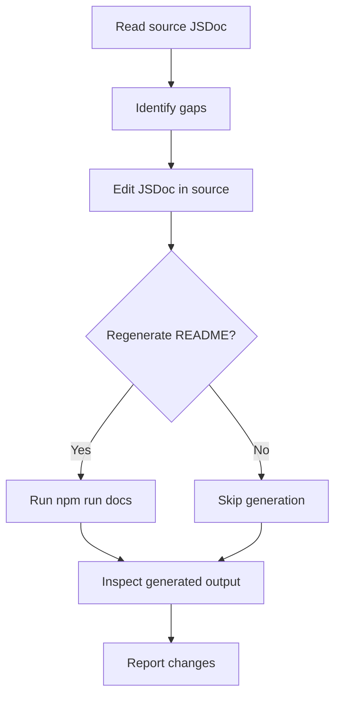
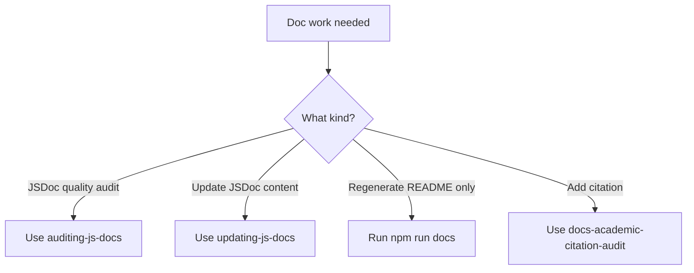

> **Search policy:** Follow the Cortex-First Search Policy from the `research-methodology` skill. Prefer Cortex MCP tools (`search_corpus`, `search_context`, `search_advanced`, `load_chunk`, `traverse_graph`) over native tools (`grep`, `glob`, `view`). Use native tools only as fallback when Cortex is degraded.

# Updating JS Docs

This skill improves the JSDoc and TSDoc source comments that feed the NeatapticTS public documentation pipeline. Edits here propagate to generated `src/**/README.md` files when `npm run docs` is run. It enforces the pedagogist-first documentation standard: atemporal prose, short compilable examples, correct citations, and Mermaid diagrams where the standard requires them.

## When to Use

- A source file has been modified and its JSDoc needs to reflect the new behavior or parameters.
- A public export is missing a `@description`, `@example`, or `@param`/`@returns` block.
- An `@example` block would not compile against the current public API and needs updating.
- Adding a Wikipedia citation or academic paper reference to an undocumented algorithm.
- Adding a Mermaid diagram to a folder-level chapter that currently has none.
- Cleaning up plan-language ("this will be implemented in Phase 7") that leaked into public JSDoc.


## When NOT to use

Do NOT use for citation auditing - use `docs-academic-citation-audit` instead. Do NOT use for README generation - use `educational-docs` instead.

## Task Packet

Include the source files to edit, the specific gaps to address (from an `auditing-js-docs` pass or direct inspection), and whether `npm run docs` should be run to regenerate the README.

```text
Use updating-js-docs for <src/path/to/file.ts>.
Gaps to address: <missing @example | stale @param | missing citation | missing Mermaid>
Examples needed: <yes | no — compile against current public API>
Run npm run docs after: <yes | no>
```

## Required Workflow

1. Read the target source file to understand the current JSDoc and the implementation being documented.
2. Read the corresponding generated `src/**/README.md` to understand what the docs generator currently extracts.
3. Make targeted JSDoc edits in the source file only; do not hand-edit generated README files.
4. Keep all public docs atemporal: no plan-language, phase references, PR numbers, or internal roadmap steps.
5. Write `@example` blocks that are short, dependency-light, and compile against the current public API.
6. Add Mermaid diagrams (in JSDoc `@remarks` or folder-level chapters) only when they materially improve understanding; every folder-level chapter must have at least one per the pedagogist-first standard.
7. Add Wikipedia links or academic paper citations (title + URL) for any algorithm, formula, or concept that lacks attribution.
8. Run `npm run docs` when generated README outputs should be refreshed; confirm that the generated output looks correct.
9. Report docs changed, generated-output decision, and any residual documentation gaps in the session output.


## Why JSDoc Is Source of Truth for Generated README

The generated README pipeline extracts JSDoc comments directly from source code. If JSDoc is thin or missing, the generated README is thin or missing. JSDoc is not documentation-about-code; it IS the documentation. The README is a rendered view of the JSDoc. Keeping JSDoc accurate and rich ensures the README stays educational without manual editing.

## Before/After JSDoc Examples

**Before (thin):**
```ts
/** Build a network. */
export function buildMLP(config: MLPConfig): Network { ... }
```

**After (rich):**
```ts
/**
 * Build a multi-layer perceptron with configurable hidden layers.
 *
 * Produces a feedforward network using Network.construct(). Zero-argument
 * calls produce a minimal 2-2-1 MLP suitable for testing.
 *
 * @param config - Partial config; all fields have defaults
 * @returns A Network ready for activation
 * @throws Error when units < 1 or hiddenLayers is empty
 *
 * @example
 * ```ts
 * const net = buildMLP({ hiddenLayers: [4, 4] });
 * ```
 */
export function buildMLP(config?: Partial<MLPConfig>): Network { ... }
```

## Workflow Diagram



## Decision Tree



## Guardrails

- Do not hand-edit generated `src/**/README.md` files; the correct fix is always the source JSDoc.
- Do not include plan-language, phase numbers, PR references, or internal roadmap steps in public JSDoc.
- Do not write `@example` blocks that import internal modules not exported by `src/neataptic.ts`.
- Do not add Mermaid diagrams or citations that are decorative rather than clarifying; use them only where they materially improve understanding.
- Do not run `npm run docs` if the task is a targeted fix that does not need README regeneration; note explicitly whether generation was skipped.
- Do not leave prior attribution gaps behind when touching a file that contains un-cited algorithms or formulas.

## Expected Final Output

- Source JSDoc in the target file updated with the requested improvements (examples, citations, diagrams, param corrections).
- If `npm run docs` was run: the generated `src/**/README.md` reflects the updated JSDoc.
- Docs changed, generated-output decision, validation command, and residual doc gaps reported in the session output.
