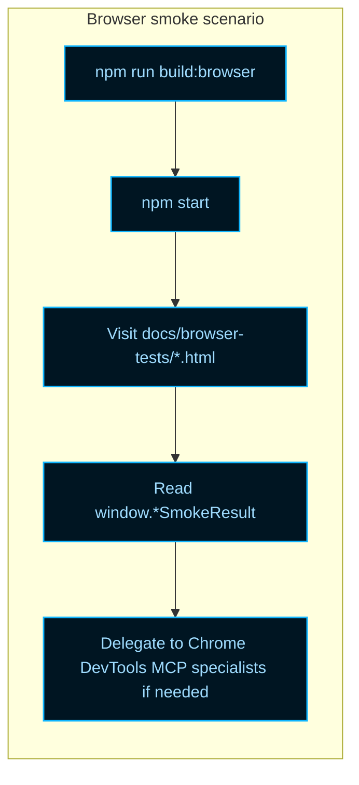

# Browser Tests

NeatapticTS runs most of its validation in Node, but some behavior only exists in
a real browser. WebGPU inference, for example, depends on `navigator.gpu`, GPU
driver math, and async readback paths that cannot be exercised headlessly. The
browser test harness exists to make those scenarios reproducible: build the
IIFE bundle, start a local server, navigate to a hidden test page, and capture a
deterministic `window.*SmokeResult` object.

These pages are **not part of the public documentation**. They are served by the
local development server so maintainers and agents can run them, but they are
excluded from generated README indexes and the `docs/index.html` sidebar.

## Hidden test URLs

After starting the local server, the following URLs are available:

| URL                                                                    | Purpose                                   |
| ---------------------------------------------------------------------- | ----------------------------------------- |
| `http://localhost:8080/docs/browser-tests/webgpu-inference-smoke.html` | CPU/GPU parity smoke test for a 2-3-1 MLP |
| `http://localhost:8080/docs/browser-tests/index.html`                  | Landing page listing available scenarios  |

Additional scenarios can be added under `docs/browser-tests/` as plain HTML
pages. Each page must load the browser bundle and emit a
`window.<Name>SmokeResult` object with at least a `success` boolean.

## Quick start

1. Build the browser IIFE bundle:

   ```bash
   npm run build:browser
   ```

   This produces `dist/neataptic.browser.iife.js`, which the smoke pages load
   with a relative path.

2. Start the local static server:

   ```bash
   npm start
   ```

   The command runs `npx http-server . -p 8080 -c-1` from the repository root.

3. Open the scenario in a browser:

   ```text
   http://localhost:8080/docs/browser-tests/webgpu-inference-smoke.html
   ```

4. Read the result object from the page console or from the rendered `<pre>`
   element. The WebGPU parity scenario emits:

   ```ts
   window.webgpuSmokeResult = {
     success: boolean,
     cpuOutput: number[],
     gpuOutput: number[],
     maxAbsDiff: number,
     meanAbsDiff: number,
     gpuDeviceBound: boolean,
     iterationCount: number,
     cpuTotalMs: number,
     gpuTotalMs: number,
     cpuPerActivationMs: number,
     gpuPerActivationMs: number,
     speedUp: number | null,
     gpuAdapterInfo: Record<string, unknown> | null,
   };
   ```

## Harness workflow



## Programmatic use

Agent code and local scripts can use the harness exports in
`scripts/agent-customization/browser-tests/`:

```ts
import { launchLocalServer } from './scripts/agent-customization/browser-tests/harness-launcher.ts';
import { createTraceSummary } from './scripts/agent-customization/browser-tests/trace-summary.ts';

const { scenarioUrl, teardown } = await launchLocalServer({
  cwd: process.cwd(),
  port: 8080,
});

try {
  // Navigate with Chrome DevTools MCP, Puppeteer, or a manual browser,
  // then capture the result object and summarize it.
  const summary = createTraceSummary({
    scenarioUrl,
    durationMs: 420,
    success: true,
    metrics: { maxAbsDiff: 0.05, meanAbsDiff: 0.01 },
  });
  console.log(JSON.stringify(summary, null, 2));
} finally {
  await teardown();
}
```

For deep diagnostics, the harness delegates to the Chrome DevTools MCP
specialists:

- `performance-trace-specialist` for CPU/paint traces,
- `browser-ui-specialist` for multi-step DOM interaction,
- `browser-memory-specialist` for heap snapshots.

The durable harness contract lives in `.github/skills/browser-testing-harness/SKILL.md`.

## Why these URLs are hidden

The source-driven docs pipeline only scans `src/`, `asciiMaze/`, `flappy-bird/`,
and `racing-curriculum/` for generated README content. Hand-maintained HTML
pages under `docs/browser-tests/` are served by `http-server` but are never
included in generated navigation. This keeps maintainer-only smoke fixtures out
of the public docs while still making them easy to reach during local
validation.

## See also

- `.github/skills/browser-testing-harness/SKILL.md` — durable harness contract
  and delegation rules.
- `.github/skills/chrome-devtools-mcp/SKILL.md` — when to use DevTools MCP
  directly versus delegating to a specialist.
- `WebGPU.md` — WebGPU inference contract and CPU/GPU parity tolerance.
- `docs/browser-tests/webgpu-inference-smoke.html` — the first real browser
  smoke scenario.
