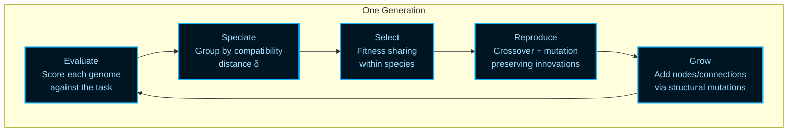
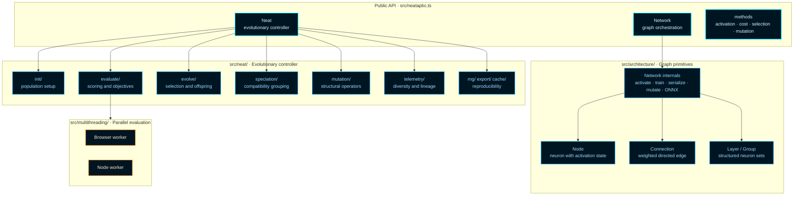

# NeatapticTS

<div class="badges">
	<a href="LICENSE"></a>
	<a href="docs/index.html"></a>
	<a href="https://www.npmjs.com/package/@reicek/neataptic-ts"></a>
	<a href="package.json"></a>
	<a href="https://github.com/reicek/NeatapticTS/actions/workflows/ci.yml"></a>
	<a href="https://github.com/reicek/NeatapticTS/actions/workflows/deploy-pages.yml"></a>
</div>


> A modern TypeScript NEAT library built to be read, tested, and extended.

NeatapticTS implements **NeuroEvolution of Augmenting Topologies (NEAT)** — an algorithm that discovers neural-network structure by evolution rather than by hand-design. Unlike gradient-based training, which assumes a fixed architecture and adjusts weights, NEAT simultaneously searches the *space of topologies* and *the space of weights*. Connections grow, nodes split, and entire species of structurally different solutions compete in the same population until a solution emerges that could not have been specified in advance.

This is not a black-box experiment runner. The library is built to be inspected, extended, and learned from: typed primitives, deterministic seeds, rich telemetry, and documentation that explains the *why* at every level — not just the API surface.

---

## The Key Idea: Evolving Topology

Most neural-network training starts by choosing an architecture — how many layers, how many neurons, what connections. NEAT removes that assumption. It starts with minimal networks and uses three coordinated mechanisms to search the combined space of weights *and* structure:

**1. Historical markings** — Every structural innovation (a new node or connection) receives a globally unique *innovation number*. When two genomes from different structural lineages are crossed over, historical markings allow meaningful alignment: genes with matching innovation numbers describe the same structural feature, even if the genomes grew their shared ancestry by different mutation paths.

**2. Speciation** — New topology is immediately at a disadvantage against well-tuned incumbents. NEAT groups genomes into *species* using a compatibility distance function, and fitness sharing ensures each species competes primarily against its own members rather than across topological families. This gives new structures the generations they need to prove useful before they are eliminated.

**3. Minimal complexification** — NEAT begins every run from the simplest possible network (inputs directly to outputs) and adds structure only when mutations suggest it. This keeps search in the tractable part of the topology space for as long as possible. See Stanley and Miikkulainen, [Evolving Neural Networks through Augmenting Topologies](https://nn.cs.utexas.edu/?stanley:ec02), for the original paper that established the algorithm.

### Compatibility Distance

The speciation boundary between any two genomes is determined by measuring how structurally different they are. If two genomes share most innovation numbers, they belong in the same species. If many innovations are disjoint or excess, they likely represent different evolutionary lineages.

The compatibility distance δ between two genomes is:

```
δ = (c₁ · E) / N  +  (c₂ · D) / N  +  c₃ · W̄
```

where **E** = excess gene count, **D** = disjoint gene count, **N** = larger genome length (normalizes for size), **W̄** = mean weight difference of matching genes, and **c₁, c₂, c₃** are coefficients that tune the relative importance of each term. Two genomes belong to the same species when δ < threshold. See Wikipedia contributors, [Neuroevolution of augmenting topologies](https://en.wikipedia.org/wiki/Neuroevolution_of_augmenting_topologies), for a concise summary of the algorithm's mechanics.

### The Evolutionary Loop

Each generation of a NEAT run follows the same five-step cycle:



---

## Why This Library

Many neuroevolution libraries are either convenient but opaque, or educational but too small to trust as a real reference. NeatapticTS is built to close that gap.

The project gives you:

- **Readable internals** — orchestration-first module structure, each boundary explained by its own chapter README.
- **Deterministic reproducibility** — seeded RNG, exportable state, replayable runs.
- **Modern TypeScript** — ES2023+ ergonomics, full type coverage, no runtime `any`.
- **Rich telemetry** — per-generation diversity, species history, Pareto fronts, novelty tracking.
- **Worker-backed evaluation** — parallel genome scoring for Node and browser environments.
- **ONNX export** — trained networks portable to ONNX-compatible inference runtimes.
- **Educational examples** — two full examples (Flappy Bird, ASCII Maze) that teach architecture choices rather than hiding them.

---

## System Architecture

The library is organized into four cooperating layers. Reading them in order builds a complete picture from graph primitives up to the evolutionary controller:



---

## Start Here

| Goal | Best place to start |
| --- | --- |
| Read the library architecture from the source side | [src/README.md](./src/README.md) |
| Study the strongest end-to-end example | [examples/flappy_bird/README.md](./examples/flappy_bird/README.md) |
| Study curriculum learning and reward shaping | [examples/asciiMaze/README.md](./examples/asciiMaze/README.md) |
| Browse runnable example source directly | [examples](./examples) |
| Review contribution standards | [CONTRIBUTING.md](./CONTRIBUTING.md) and [STYLEGUIDE.md](./STYLEGUIDE.md) |

## Reading Paths

### If you are new to NEAT or neuroevolution

1. Read the background section above — especially the three key mechanisms and the compatibility distance formula.
2. Open [src/neat/README.md](./src/neat/README.md) for the controller's public defaults and four-lane architecture.
3. Skim [examples/flappy_bird/README.md](./examples/flappy_bird/README.md) to see those concepts applied in a complete system.

### If you are new to this repo

1. Read [docs/index.html](./docs/index.html).
2. Read [src/README.md](./src/README.md).
3. Open one example:
	 - [examples/flappy_bird/README.md](./examples/flappy_bird/README.md)
	 - [examples/asciiMaze/README.md](./examples/asciiMaze/README.md)

### If you want library internals

- [src/neat/README.md](./src/neat/README.md) — the evolutionary controller
- [src/architecture/network/README.md](./src/architecture/network/README.md) — the network graph
- [src/architecture/network/onnx/README.md](./src/architecture/network/onnx/README.md) — ONNX portability
- [src/multithreading/README.md](./src/multithreading/README.md) — parallel evaluation

---

## Examples Worth Opening First

### Flappy Bird

[examples/flappy_bird](./examples/flappy_bird) is the best single example if you want to see how NeatapticTS feels in a real project. It combines deterministic environment stepping, evaluation designed to reduce lucky-rollout bias, worker-backed browser playback, live network inspection, and a modular architecture with explicit boundaries.

### ASCII Maze

[examples/asciiMaze](./examples/asciiMaze) is the companion example for studying curriculum progression, compact observations, reward shaping for sparse goals, and browser plus terminal visualization.

---

## Install

Runtime requirement: Node 22+.

```bash
npm install @reicek/neataptic-ts
```

Minimal example — evolve a network toward a target output in one generation loop:

```ts
import { Neat } from '@reicek/neataptic-ts';

const fitness = (network) => {
	const output = network.activate([1])[0];
	return -(output - 2) ** 2;
};

const neat = new Neat(1, 1, fitness, {
	popsize: 30,
	seed: 42,
	fastMode: true,
});

await neat.evaluate();
await neat.evolve();

console.log(neat.getBest()?.score);
```

For options, telemetry, multiobjective search, ONNX export, and subsystem details, continue in [docs/index.html](./docs/index.html) or [src/README.md](./src/README.md).

---

## Repo Map

| Path | Purpose |
| --- | --- |
| [src](./src) | Core library code and generated module docs |
| [examples](./examples) | Educational examples and demos |
| [docs](./docs) | Generated documentation site and example assets |
| [scripts](./scripts) | Build and docs tooling |
| [plans](./plans) | Architecture and roadmap material |

## Contributing

This repo treats documentation as part of the product. If you change behavior, examples, or public API shape, update the documentation surface that teaches that boundary.

Primary contribution entry points:

- [CONTRIBUTING.md](./CONTRIBUTING.md)
- [STYLEGUIDE.md](./STYLEGUIDE.md)
- [RELEASE.md](./RELEASE.md)

## License

MIT.
