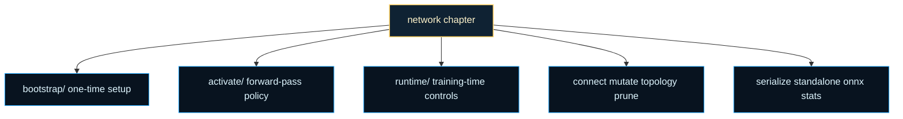

# architecture/network

Core network chapter for the architecture surface.

This folder owns the public `Network` class: the boundary where a graph stops
being only nodes and connections and starts behaving like one runnable,
mutable, trainable system. Higher-level NEAT code can mutate or score a
network, but this chapter is where the graph itself learns how to activate,
accept structural edits, preserve deterministic state, serialize, and cross
the ONNX boundary.

That boundary matters because the same instance has to serve several jobs
without changing shape. A caller may want ordinary inference, training-aware
forward passes, topology edits, reproducible stochastic behavior, sparse
pruning, or a portable checkpoint. Keeping those responsibilities under one
facade makes the public API readable while the helper chapters keep each
policy cluster narrow enough to teach.

Construction can be deterministic: passing a `seed` snapshots the global
connection innovation counter before bootstrap and restores it afterwards,
so two networks built from the same seed produce identical topology and
innovation IDs until external mutation intervenes. This is the foundation
used by NGE growth checkpoints to make structural expansion replayable.

A useful mental model is to read `network/` as four cooperating shelves.
`bootstrap/` explains one-time construction policy. `activate/`, `runtime/`,
and `training/` explain how a graph is stepped and regularized once it is
alive. `connect/`, `mutate/`, `remove/`, `prune/`, and `topology/` explain
graph surgery. `serialize/`, `standalone/`, `onnx/`, and `stats/` explain
portability, inspection, and reporting.

The performance story is equally important. This chapter deliberately hides
storage details until they matter. Callers should be able to ask for
`activate()` or `train()` without first understanding slab packing, pooled
activation arrays, or cache invalidation. The helper folders then expose how
the same graph can switch between object traversal and denser typed-array
paths without changing the surface contract.




For background on the execution-order side of this chapter, see Wikipedia
contributors, [Topological sorting](https://en.wikipedia.org/wiki/Topological_sorting).
Feed-forward network execution, acyclic guards, and some of the helper
policies in this folder all depend on the same scheduling idea even when the
public API keeps that detail out of the caller's way.

Example: create a compact layered network and use the ordinary activation
surface.

```ts
const network = Network.createMLP(2, [4], 1);
const outputValues = network.activate([0, 1]);
```

Example: checkpoint one network, then restore it for another run.

```ts
const network = new Network(2, 1, { seed: 7 });
const saved = network.toJSON();
const restored = Network.fromJSON(saved);
const replayed = restored.activate([1, 0]);
```

Practical reading order:

1. Start here for the public `Network` facade and the cross-chapter map.
2. Continue into `bootstrap/` when the constructor contract is the next
   question.
3. Continue into `activate/`, `runtime/`, and `training/` for execution and
   learning policy.
4. Continue into `connect/`, `mutate/`, `remove/`, `prune/`, and `topology/`
   for structural editing.
5. Finish in `serialize/`, `standalone/`, `onnx/`, and `stats/` for
   portability, derived reports, and export flows.

Example:

```ts
const network = Network.createMLP(2, [4], 1);
const output = network.activate([0, 1]);
```

## architecture/network/network.ts

### Network

Public graph runtime that combines execution, editing, and portability.

`Network` is the instance callers use when one directed graph should be
activated, mutated, regularized, checkpointed, or exported without changing
the public shape of the object.

Example:

```ts
const network = Network.createMLP(2, [4], 1);
const output = network.activate([0, 1]);
```

### default

#### _invalidateActivationBackend

```ts
_invalidateActivationBackend(): void
```

Invalidates any cached activation backend so the next forward pass reselects
the appropriate CPU or GPU path from scratch. Structural edits can change
GPU eligibility (gates, self-connections, unsupported activations), so the
cached backend must not survive them.

#### _normalizeActivationOptions

```ts
_normalizeActivationOptions(
  trainingOrOptions: boolean | NetworkActivationOptions,
): NetworkActivationOptions
```

Normalize the mixed training-flag / options-bag argument into a
{@link NetworkActivationOptions} object.

Parameters:
- `trainingOrOptions` - Boolean training flag or options bag.

Returns: Normalized activation options.

#### _notifyBackendChange

```ts
_notifyBackendChange(
  observer: ActivationObserver | undefined,
  backend: ActivationBackend,
  previousBackend: ActivationBackend | undefined,
): void
```

Notify the observer (if any) that the active backend changed.

Parameters:
- `observer` - Optional activation observer.
- `backend` - Newly selected backend.
- `previousBackend` - Previously used backend, if any.

#### _notifyFallback

```ts
_notifyFallback(
  observer: ActivationObserver | undefined,
  requested: "gpu" | "auto",
  reason: string,
): void
```

Notify the observer (if any) that a GPU request fell back to CPU.

Parameters:
- `observer` - Optional activation observer.
- `requested` - Backend originally requested by the caller.
- `reason` - Human-readable fallback reason.

#### _resolveActivationBackend

```ts
_resolveActivationBackend(
  options: NetworkActivationOptions,
): ActivationBackend
```

Resolves the requested backend, applying legacy `useGPU` deprecation rules.

Parameters:
- `options` - Activation options supplied by the caller.

Returns: Requested backend label. `'auto'` is resolved to the concrete
`'cpu'` or `'gpu'` path by the caller.

#### _tryGPUActivation

```ts
_tryGPUActivation(
  input: number[] | Float32Array<ArrayBufferLike>,
  backend: "gpu" | "auto",
  observer: ActivationObserver | undefined,
  previousBackend: ActivationBackend | undefined,
  training: boolean,
): number[] | Promise<Float32Array<ArrayBufferLike>>
```

Attempt GPU activation, falling back to CPU when the device is
unavailable or ineligible.

Parameters:
- `input` - Input vector of length `this.input`.
- `backend` - Requested backend (`'gpu'` or `'auto'`).
- `observer` - Optional activation observer.
- `previousBackend` - Previously used backend, if any.
- `training` - Whether activation is part of training.

Returns: Output values, or a promise when the GPU path succeeds.

#### _warnUseGPUDeprecated

```ts
_warnUseGPUDeprecated(): void
```

Emits a one-time deprecation warning for the legacy `useGPU` option.

#### activate

```ts
activate(
  input: number[] | Float32Array<ArrayBufferLike>,
  options: { training?: boolean | undefined; useGPU: true; },
  _maxActivationDepth: number | undefined,
): Promise<Float32Array<ArrayBufferLike>>
```

Implementation signature used by the overloads above.

Existing callers passing a boolean `training` flag are unchanged. The GPU
path is used only when `backend: 'gpu'` or `backend: 'auto'` is supplied,
`gpuDevice` is set, and `isGPUEligible` returns true. In every other case
the standard CPU `network.activate()` implementation runs.

Parameters:
- `input` - Input vector of length `this.input`.
- `trainingOrOptions` - Boolean training flag or options bag.
- `_maxActivationDepth` - Unused; kept for signature compatibility.

Returns: Output values, or a promise when the GPU path is selected.

#### activateBatch

```ts
activateBatch(
  inputs: number[][],
  training: boolean,
): number[][]
```

Activate the network over a batch of input vectors (micro-batching).

Currently iterates sample-by-sample while reusing the network's internal
fast-path allocations. Outputs are cloned number[] arrays for API
compatibility. Future optimizations can vectorize this path.

Parameters:
- `inputs` - Array of input vectors, each length must equal this.input
- `training` - Whether to run with training-time stochastic features

Returns: Array of output vectors, each length equals this.output

#### activateRaw

```ts
activateRaw(
  input: number[],
  training: boolean,
  maxActivationDepth: number,
): ActivationArray
```

Raw activation that can return a reusable typed array when pooling is enabled.
If `reuseActivationArrays` is disabled this falls back to the standard plain-array activation path.

Parameters:
- `input` - Input vector.
- `training` - Whether to enable training-time stochastic paths.
- `maxActivationDepth` - Maximum graph depth for activation.

Returns: Output activations as either a plain array or a reusable typed activation buffer.

#### addNodeBetween

```ts
addNodeBetween(): void
```

Insert a new hidden node by splitting a randomly chosen existing connection.

The selected connection `from → to` is replaced by two new connections:
`from → newNode` and `newNode → to`. The new node's activation function
defaults to linear so the network's behavior is unchanged immediately
after the split — evolution pressure then shapes the new node over time.

This is one of the canonical NEAT structural mutations. It increases
network depth without changing connectivity density significantly.
See [Stanley & Miikkulainen (2002)](https://nn.cs.utexas.edu/?stanley:ec02) for the motivating analysis.

Example:

```ts
const network = new Network(2, 1);
network.connect(network.nodes[0], network.nodes[2]);
network.addNodeBetween(); // splits one connection, adds a hidden node
```

#### adjustRateForAccumulation

```ts
adjustRateForAccumulation(
  rate: number,
  accumulationSteps: number,
  reduction: "average" | "sum",
): number
```

Utility: adjust rate for accumulation mode (use result when switching to 'sum' to mimic 'average').

#### clear

```ts
clear(): void
```

Clears the internal state of all nodes in the network.
Resets node activation, state, eligibility traces, and extended traces to their initial values (usually 0).
This is typically done before processing a new input sequence in recurrent networks or between training epochs if desired.

#### clearStochasticDepthSchedule

```ts
clearStochasticDepthSchedule(): void
```

Clear stochastic-depth schedule function.

#### clearWeightNoiseSchedule

```ts
clearWeightNoiseSchedule(): void
```

Clear the dynamic global weight-noise schedule.

#### clone

```ts
clone(): default
```

Creates a deep copy of the network.

Returns: A new Network instance that is a clone of the current network.

#### configurePruning

```ts
configurePruning(
  cfg: { start: number; end: number; targetSparsity: number; regrowFraction?: number | undefined; frequency?: number | undefined; method?: "magnitude" | "snip" | undefined; },
): void
```

Configure scheduled pruning during training.

Parameters:
- `cfg` - Pruning schedule and strategy configuration.

#### configureSparsityBudget

```ts
configureSparsityBudget(
  cfg: { maxConnections: number; growthGraceFraction?: number | undefined; method?: "magnitude" | "snip" | undefined; },
): void
```

Configure a structural connection-growth budget for future mutations.

Parameters:
- `cfg` - Absolute connection cap plus optional grace headroom.

#### connect

```ts
connect(
  from: default,
  to: default,
  weight: number | undefined,
): default[]
```

Creates a connection between two nodes in the network.
Handles both regular connections and self-connections.
Adds the new connection object(s) to the appropriate network list (`connections` or `selfconns`).

Returns: An array containing the newly created connection object(s). Typically contains one connection, but might be empty or contain more in specialized node types.

#### connectBatch

```ts
connectBatch(
  requests: readonly NetworkConnectionRequest[],
): default[]
```

Creates many connections in one ordered structural edit batch.

This preserves the same legality checks and deterministic default-weight
behavior as repeated `connect()` calls, but it reserves network-level
storage once for the whole request shelf.

Parameters:
- `requests` - Ordered connection requests.

Returns: Flattened created connection objects in request order.

#### connections

Connection list.

#### construct

```ts
construct(
  parts: readonly ConstructPart[],
  options: ConstructOptions | undefined,
): ConstructResult
```

Construct a runnable network from mixed `Node`, `Group`, and `Layer` parts.

This builder compiles the provided parts into the ordinary `Network`
runtime, preserving explicit input/output ordering and then rebuilding the
scheduling cache in either acyclic or recurrent mode.

Parameters:
- `parts` - Mixed architecture parts to flatten.
- `options` - Optional construct-time validation, ordering, and runtime flags.

Returns: Materialized runtime plus lightweight diagnostics.

Example:

```ts
const sensor = new Node('input');
const hidden = new Group(2);
const readout = Layer.dense(1, 'output');

sensor.connect(hidden);
hidden.connect(readout);

const { network } = Network.construct([sensor, hidden, readout]);
```

#### createMLP

```ts
createMLP(
  inputCount: number,
  hiddenCounts: number[],
  outputCount: number,
): default
```

Creates a fully connected, strictly layered MLP network.

Returns: A new, fully connected, layered MLP

#### crossOver

```ts
crossOver(
  network1: default,
  network2: default,
  equal: boolean,
): default
```

NEAT-style crossover delegate.

#### describeArchitecture

```ts
describeArchitecture(): NetworkArchitectureDescriptor
```

Resolves a stable architecture descriptor for telemetry/UI consumers.

Prefers live graph analysis and only falls back to hydrated serialization
metadata when graph-based resolution is purely inferred.

Returns: Architecture descriptor with hidden-layer widths and provenance.

#### describeTemporalStructure

```ts
describeTemporalStructure(): NetworkTemporalStructureDescriptor
```

Resolves the validated temporal-module structure for diagnostics and visualization.

Call this when the coarse hidden-layer descriptor is not enough and you
need the explicit recurrent-module and gated-block ownership story that the
runtime builders preserve for LSTM, GRU, and NARX networks.

Returns: Temporal-structure descriptor synchronized against the live graph.

#### deserialize

```ts
deserialize(
  data: unknown[] | CompactSerializedNetworkTuple,
  inputSize: number | undefined,
  outputSize: number | undefined,
): default
```

Static lightweight tuple deserializer delegate

#### disableDropConnect

```ts
disableDropConnect(): void
```

Disable DropConnect.

#### disableStochasticDepth

```ts
disableStochasticDepth(): void
```

Disable stochastic depth.

#### disableWeightNoise

```ts
disableWeightNoise(): void
```

Disable all weight-noise settings.

#### disconnect

```ts
disconnect(
  from: default,
  to: default,
): void
```

Disconnects two nodes, removing the connection between them.
Handles both regular connections and self-connections.
If the connection being removed was gated, it is also ungated.

#### dropout

Dropout probability.

#### enableDropConnect

```ts
enableDropConnect(
  p: number,
): void
```

Enable DropConnect with a probability in $[0,1)$.

Parameters:
- `p` - DropConnect probability.

#### enableWeightNoise

```ts
enableWeightNoise(
  stdDev: number | { perHiddenLayer: number[]; },
): void
```

Enable weight noise using either a global standard deviation or per-hidden-layer values.

Parameters:
- `stdDev` - Global standard deviation or hidden-layer schedule.

#### evolve

```ts
evolve(
  set: { input: number[]; output: number[]; }[],
  options: Record<string, unknown> | undefined,
): Promise<{ error: number; iterations: number; time: number; }>
```

Evolve the network against a dataset using the neuroevolution chapter.

The implementation lives outside this class so the public surface stays
orchestration-first while population search, mutation policy, and stopping
criteria remain chapter-owned.

Parameters:
- `set` - Evaluation samples with `input` and `output` vectors.
- `options` - Evolution options controlling population search and stopping criteria.

Returns: Promise resolving to the final error, iteration count, and elapsed time.

#### fastSlabActivate

```ts
fastSlabActivate(
  input: number[],
): number[]
```

Public wrapper for fast slab forward pass.

Parameters:
- `input` - Input vector.

Returns: Activation output.

#### forwardWindowed

```ts
forwardWindowed(
  inputs: number[][],
  options: NetworkForwardWindowOptions | undefined,
): number[][]
```

Activate one input sequence in bounded windows while preserving carried recurrent state.

This keeps the same output contract as repeated `activate()` calls, while
adding bounded window callbacks and an opt-out from collecting the full
output matrix when the caller wants lower sequence-retention pressure.

Parameters:
- `inputs` - Ordered sequence of input vectors.
- `options` - Optional windowed activation settings.

Returns: Output vectors aligned to the input order.

#### forwardWindowedAsync

```ts
forwardWindowedAsync(
  inputs: number[][],
  options: NetworkForwardWindowAsyncOptions | undefined,
): Promise<number[][]>
```

Activate one input sequence in bounded windows with cooperative runtime yields.

Browser runtimes can use this to yield after a configurable number of
emitted windows so long-running sequence inference remains responsive.

Parameters:
- `inputs` - Ordered sequence of input vectors.
- `options` - Optional async windowed activation settings.

Returns: Output vectors aligned to the input order.

#### fromJSON

```ts
fromJSON(
  json: Record<string, unknown>,
): default
```

Verbose JSON static deserializer

#### gate

```ts
gate(
  node: default,
  connection: default,
): void
```

Gates a connection with a specified node.
The activation of the `node` (gater) will modulate the weight of the `connection`.
Adds the connection to the network's `gates` list.

#### gates

Network gates collection.

#### getAccelerationStatus

```ts
getAccelerationStatus(): AccelerationStatus
```

Returns a snapshot of the network's acceleration state.

Returns: Status describing the last used backend, GPU readiness, and worker support.

#### getActivationSchedulingDiagnostics

```ts
getActivationSchedulingDiagnostics(): ActivationSchedulingDiagnostics
```

Read a human-friendly snapshot of the current activation-ordering contract.

Use this after activation or structural edits to see whether the runtime is
using a compiled schedule, a cycle fallback, or a raw-node-order fallback,
and what to do next if that result is not the one you expected.

Returns: Activation scheduling diagnostics snapshot.

#### getConnectionSlab

```ts
getConnectionSlab(): ConnectionSlabView
```

Read slab structures for fast activation.

Returns: Slab connection structures.

#### getCurrentSparsity

```ts
getCurrentSparsity(): number
```

Compute the current connection sparsity ratio.

Returns: Current sparsity in $[0,1]$.

#### getGPUEligibility

```ts
getGPUEligibility(): GPUEligibilityResult
```

Probes whether this network can use its current GPU device for activation.

Returns: Eligibility verdict and a human-readable reason.

#### getLastGradClipGroupCount

```ts
getLastGradClipGroupCount(): number
```

Returns last gradient clipping group count (0 if no clipping yet).

#### getLossScale

```ts
getLossScale(): number
```

Returns current mixed precision loss scale (1 if disabled).

#### getRandomFn

```ts
getRandomFn(): (() => number) | undefined
```

Read the active deterministic RNG function.

Returns: RNG function when deterministic state is initialized.

#### getRawGradientNorm

```ts
getRawGradientNorm(): number
```

Returns last recorded raw (pre-update) gradient L2 norm.

#### getRegularizationStats

```ts
getRegularizationStats(): Record<string, unknown> | null
```

Read regularization statistics collected during training.

Returns: Regularization stats payload.

#### getRNGState

```ts
getRNGState(): number | undefined
```

Read the raw deterministic RNG state word.

Returns: RNG state value when present.

#### getSparsityBudgetSnapshot

```ts
getSparsityBudgetSnapshot(): NetworkSparsityBudgetSnapshot | undefined
```

Read the latest structural growth-budget decision snapshot.

Returns: Snapshot when a budgeted growth decision has already run.

#### getTopologyIntent

```ts
getTopologyIntent(): NetworkTopologyIntent
```

Returns the public topology intent for this network.

Returns: Current topology intent.

#### getTrainingStats

```ts
getTrainingStats(): TrainingStatsSnapshot
```

Consolidated training stats snapshot.

#### gpuDevice

Optional WebGPU device used by the GPU inference fast path.

Assign a device here, then call `activate(input, { useGPU: true })` to opt
into the WebGPU forward pass. If the device is missing, the network is
ineligible, or `useGPU` is omitted, the standard CPU path is used
transparently. This opt-in design keeps classic NEAT behavior unchanged
unless a caller explicitly requests the GPU path.

A one-shot `device.lost` listener is attached the first time a device is
assigned. If the device is later lost, this property is cleared so
subsequent activations fall back to the CPU path until a new device is
assigned.

GPU output agrees with the CPU path within an absolute tolerance of `5e-1`
and a mean absolute error of `≤ 1e-1`. For deterministic replay or
cross-machine regression tests, use the CPU path as the canonical reference.

Example:

```ts
const network = new Architect.Perceptron(2, 4, 1);
const adapter = await navigator.gpu.requestAdapter({
  powerPreference: 'high-performance',
});
network.gpuDevice = (await adapter?.requestDevice()) ?? undefined;
const output = await network.activate([0.5, -0.2], { useGPU: true });
```

#### input

Input node count.

#### inputNodeIds

Ordered stable gene ids that define the network input vector contract.

Returns a cloned array so callers can inspect role metadata without
mutating runtime state.

Returns: Ordered input node gene ids.

#### isGPUReady

```ts
isGPUReady(): boolean
```

Whether a WebGPU device has been assigned and is currently ready for use.

Returns: True when  {@link gpuDevice} is set and not lost.

#### lastActivationBackend

Backend used during the most recent activation.

#### lastSkippedLayers

Last skipped stochastic-depth layers from activation runtime state.

#### layers

Optional layered view cache.

#### mutate

```ts
mutate(
  method: MutationMethod,
): void
```

Mutates the network's structure or parameters according to the specified method.
This is a core operation for neuro-evolutionary algorithms (like NEAT).
The method argument should be one of the mutation types defined in `methods.mutation`.

Some structural methods, especially `ADD_CONN` and `ADD_NODE`, silently
no-op when no eligible candidate exists (for example, a fully saturated
graph). The NGE juvenile applier checks the live node/edge count before and
after calling `mutate` so it can report the outcome truthfully as applied or
skipped rather than claiming growth that did not happen.

Parameters:
- `method` - The mutation method to apply (e.g., `mutation.ADD_NODE`, `mutation.MOD_WEIGHT`).
  Some methods might have associated parameters (e.g., `MOD_WEIGHT` uses `min`, `max`).

#### nodes

Network node collection.

#### noTraceActivate

```ts
noTraceActivate(
  input: number[] | Float32Array<ArrayBufferLike>,
): number[]
```

Activates the network without calculating eligibility traces.
This is a performance optimization for scenarios where backpropagation is not needed,
such as during testing, evaluation, or deployment (inference).

Returns: An array of numerical values representing the activations of the network's output nodes.

#### output

Output node count.

#### outputNodeIds

Ordered stable gene ids that define the network output vector contract.

Returns a cloned array so callers can inspect role metadata without
mutating runtime state.

Returns: Ordered output node gene ids.

#### propagate

```ts
propagate(
  rate: number,
  momentum: number,
  update: boolean,
  target: number[],
  regularization: number,
  costDerivative: ((target: number, output: number) => number) | undefined,
): void
```

Propagates the error backward through the network (backpropagation).
Calculates the error gradient for each node and connection.
If `update` is true, it adjusts the weights and biases based on the calculated gradients,
learning rate, momentum, and optional L2 regularization.

The process starts from the output nodes and moves backward layer by layer (or topologically for recurrent nets).

#### pruneToSparsity

```ts
pruneToSparsity(
  targetSparsity: number,
  method: "magnitude" | "snip",
): void
```

Immediately prune connections until the graph reaches (or approaches)
a target sparsity fraction.

Sparsity is defined as the fraction of connections removed relative to
the baseline connection count captured on the first call. A
`targetSparsity` of `0.8` means approximately 80% of the original
connections will be removed, leaving 20% intact.

Two ranking strategies are available:

- `'magnitude'` (default): removes the connections with the smallest
  absolute weight values — a fast, weight-magnitude heuristic.
- `'snip'`: removes connections ranked by a SNIP-style first-order
  gradient-magnitude saliency score.

This method is suitable for evolutionary generation-based pruning
independent of a training-iteration schedule. For schedule-based
pruning during gradient training, use `configureSparsityBudget()`.

Parameters:
- `targetSparsity` - Fraction of original connections to remove,
in the open interval `(0, 1)`. Values close to 1 produce very
sparse networks.
- `method` - Ranking strategy: `'magnitude'` or `'snip'`.
Defaults to `'magnitude'`.

Example:

```ts
const network = Network.createMLP(4, [16, 16], 2);
// Remove 70% of connections by weight magnitude:
network.pruneToSparsity(0.7);
```

#### rebuildConnections

```ts
rebuildConnections(
  net: default,
): void
```

Rebuilds the network's connections array from all per-node connections.
This ensures that the network.connections array is consistent with the actual
outgoing connections of all nodes. Useful after manual wiring or node manipulation.

Returns: Example usage:
  Network.rebuildConnections(net);

#### rebuildConnectionSlab

```ts
rebuildConnectionSlab(
  force: boolean,
): void
```

Rebuild slab structures for fast activation.

Parameters:
- `force` - Whether to force a rebuild.

Returns: Slab rebuild result.

#### refreshExplicitIORoles

```ts
refreshExplicitIORoles(): void
```

Refresh explicit ordered input and output role ids from the current graph.

Builder, restore, and evolutionary materialization paths use this after
replacing `nodes` wholesale so the role contract stays explicit even while
activation semantics still rely on legacy ordering rules.

Returns: Nothing.

#### remove

```ts
remove(
  node: default,
): void
```

Removes a node from the network.
This involves:
1. Disconnecting all incoming and outgoing connections associated with the node.
2. Removing self-connections.
3. Removing the node from the `nodes` array.
4. Attempting to reconnect the node's direct predecessors to its direct successors
   to maintain network flow, if possible and configured.
5. Handling gates involving the removed node (ungating connections gated *by* this node,
   and potentially re-gating connections that were gated *by other nodes* onto the removed node's connections).

#### resetDropoutMasks

```ts
resetDropoutMasks(): void
```

Resets all masks in the network to 1 (no dropout). Applies to both node-level and layer-level dropout.
Should be called after training to ensure inference is unaffected by previous dropout.

#### restoreRNG

```ts
restoreRNG(
  fn: () => number,
): void
```

Restore deterministic RNG function from a snapshot source.

Parameters:
- `fn` - RNG function to restore.

#### score

Optional fitness score.

#### selfconns

Self-connection list.

#### serialize

```ts
serialize(): CompactSerializedNetworkTuple
```

Lightweight tuple serializer delegating to network.serialize.ts

#### set

```ts
set(
  values: { bias?: number | undefined; squash?: ((x: number, derivate?: boolean | undefined) => number) | undefined; },
): void
```

Sets specified properties (e.g., bias, squash function) for all nodes in the network.
Useful for initializing or resetting node properties uniformly.

#### setEnforceAcyclic

```ts
setEnforceAcyclic(
  flag: boolean,
): void
```

Enable or disable acyclic topology enforcement.

Parameters:
- `flag` - Whether to enforce acyclic connectivity.

#### setRandom

```ts
setRandom(
  fn: () => number,
): void
```

Replace the network random number generator.

Parameters:
- `fn` - RNG function returning values in $[0,1)$.

#### setRNGState

```ts
setRNGState(
  state: number,
): void
```

Set the raw deterministic RNG state word.

Parameters:
- `state` - RNG state value.

#### setSeed

```ts
setSeed(
  seed: number,
): void
```

Seed the internal deterministic RNG.

Seeding makes every subsequent structural mutation, weight initialization,
and random choice reproducible for the same starting network. NGE uses this
in `runNgeLifecycle` to guarantee that the same DNA + seed + experience
stream produce identical growth checkpoints, including the same innovation
IDs for newly created connections. Omitting the seed leaves the network
using its default non-deterministic RNG.

Parameters:
- `seed` - Seed value.

#### setStochasticDepth

```ts
setStochasticDepth(
  survival: number[],
): void
```

Configure stochastic depth with survival probabilities per hidden layer.

Parameters:
- `survival` - Survival probabilities for hidden layers.

#### setStochasticDepthSchedule

```ts
setStochasticDepthSchedule(
  fn: (step: number, current: number[]) => number[],
): void
```

Set stochastic-depth schedule function.

Parameters:
- `fn` - Function mapping step and current schedule to next schedule.

#### setTopologyIntent

```ts
setTopologyIntent(
  topologyIntent: NetworkTopologyIntent,
): void
```

Sets the public topology intent and keeps acyclic enforcement aligned.

Parameters:
- `topologyIntent` - Desired topology intent.

Returns: Nothing.

#### setWeightNoiseSchedule

```ts
setWeightNoiseSchedule(
  fn: (step: number) => number,
): void
```

Set a dynamic scheduler for global weight noise.

Parameters:
- `fn` - Function mapping training step to noise standard deviation.

#### snapshotRNG

```ts
snapshotRNG(): RNGSnapshot
```

Snapshot deterministic RNG runtime state.

Returns: Current RNG snapshot.

#### standalone

```ts
standalone(): string
```

Generate a dependency-light standalone inference function for this network.

Use this when you want to snapshot the current topology and weights into a
self-contained JavaScript function for deployment, offline benchmarking,
or browser embedding without the full training runtime.

Returns: Standalone JavaScript source for inference.

#### test

```ts
test(
  set: { input: number[]; output: number[]; }[],
  cost: ((target: number[], output: number[]) => number) | undefined,
): { error: number; time: number; }
```

Tests the network's performance on a given dataset.
Calculates the average error over the dataset using a specified cost function.
Uses `noTraceActivate` for efficiency as gradients are not needed.
Handles dropout scaling if dropout was used during training.

Returns: An object containing the calculated average error over the dataset and the time taken for the test in milliseconds.

#### testForceOverflow

```ts
testForceOverflow(): void
```

Force the next mixed-precision overflow path (test utility).

#### toJSON

```ts
toJSON(): Record<string, unknown>
```

Verbose JSON serializer delegate

#### toONNX

```ts
toONNX(): OnnxModel
```

Exports the network to ONNX format (JSON object, minimal MLP support).
Only standard feedforward architectures and standard activations are supported.
Gating, custom activations, and evolutionary features are ignored or replaced with Identity.

Returns: ONNX model as a JSON object.

#### train

```ts
train(
  set: { input: number[]; output: number[]; }[],
  options: unknown,
): { error: number; iterations: number; time: number; }
```

Train the network against a supervised dataset using the gradient-based
training chapter.

This wrapper keeps the public `Network` API stable while the training
helpers own batching, optimizer steps, regularization, and mixed-precision
runtime behavior.

Parameters:
- `set` - Supervised samples with `input` and `output` vectors.
- `options` - Training options such as learning rate, iteration limits, batching, and optimizer settings.

Returns: Aggregate training result with final error, iteration count, and elapsed time.

#### trainingStep

Current training step counter.

#### ungate

```ts
ungate(
  connection: default,
): void
```

Removes the gate from a specified connection.
The connection will no longer be modulated by its gater node.
Removes the connection from the network's `gates` list.

## architecture/network/network.utils.ts

### __trainingInternals

Test-only internal helper bundle.

This is exported so unit tests can cover edge-cases in the smoothing logic without
running full end-to-end training loops.

Important: this is **not** considered stable public API. It may change between releases.

### activate

```ts
activate(
  input: number[],
  training: boolean,
): number[]
```

Activate a network with one input vector and return the resulting output vector while preserving the standard activation semantics used by compatibility-facing runtime callers.

Parameters:
- `this` - Network instance bound by method call.
- `inputs` - Input activation vector.

Returns: Output activation vector.

### activateBatch

```ts
activateBatch(
  inputs: number[][],
  training: boolean,
): number[][]
```

Activate the network over a mini‑batch (array) of input vectors, returning a 2‑D array of outputs.

This helper simply loops, invoking {@link Network.activate} (or its bound variant) for each
sample. It is intentionally naive: no attempt is made to fuse operations across the batch.
For very large batch sizes or performance‑critical paths consider implementing a custom
vectorized backend that exploits SIMD, GPU kernels, or parallel workers.

Input validation occurs per row to surface the earliest mismatch with a descriptive index.

Parameters:
- `this` - Bound Network instance.
- `inputs` - Array of input vectors; each must have length == network.input.
- `training` - Whether each activation should keep training traces.

Returns: 2‑D array: outputs[i] is the activation result for inputs[i].

Example:

const batchOut = net.activateBatch([[0,0,1],[1,0,0],[0,1,0]]);
console.log(batchOut.length); // 3 rows

### activateRaw

```ts
activateRaw(
  input: number[],
  training: boolean,
  maxActivationDepth: number,
): ActivationArray
```

Raw activation wrapper with optional typed-output reuse semantics.

The heavy math still lives in the main activation path, but this wrapper now
owns the contract for network-local typed output reuse. When
`reuseActivationArrays` is enabled, raw activation may copy the detached
activation result into a reusable typed buffer whose element width follows
the network's resolved activation precision. Callers that also enable
`returnTypedActivations` may receive that reusable typed buffer directly.

Parameters:
- `this` - Bound Network instance.
- `input` - Input vector (length == network.input).
- `training` - Whether to retain training traces / gradients (delegated downstream).
- `maxActivationDepth` - Guard against runaway recursion / cyclic activation attempts.

Returns: Output vector, either as a plain array or a reusable typed activation buffer.

Example:

const y = net.activateRaw([0,1,0]);

### activateUtils

Re-export the activation helper namespace used by the Network facade for forward-pass and activation-buffer policy.

### addNodeBetweenImpl

```ts
addNodeBetweenImpl(): void
```

Split one randomly selected connection by inserting a hidden node.

This preserves the long-standing public `addNodeBetween()` behavior:
- it does not opt into `ADD_NODE` deterministic-chain policy,
- it preserves the original source-edge weight on the first new connection,
- it uses `1` for the hidden-to-target edge to keep the split easy to reason about.

Parameters:
- `this` - Target network instance.

Returns: Nothing.

### applyGradientClippingImpl

```ts
applyGradientClippingImpl(
  net: default,
  cfg: GradientClipRuntimeConfig,
): void
```

Apply gradient clipping to a network using a normalized runtime configuration.

This is a small wrapper that forwards to the concrete implementation used by training.

Parameters:
- `net` - Network instance to update.
- `cfg` - Normalized clipping settings.

### canUseFastSlab

```ts
canUseFastSlab(
  training: boolean,
): boolean
```

Report whether the network can safely use the slab fast path under current topology and runtime constraints before callers choose between typed-array and node-traversal execution.

Parameters:
- `this` - Network instance bound by method call.

Returns: True when slab fast-path activation is valid.

### clearState

```ts
clearState(): void
```

Clear all accumulated per-node runtime traces and saved activation states.

Parameters:
- `this` - Bound network instance.

### cloneImpl

```ts
cloneImpl(): default
```

Create a deep copy of one network through the verbose JSON round-trip.

This keeps cloning behavior aligned with the same versioned payload contract
used by `toJSON()` and `fromJSON()`, so clone semantics stay stable as the
serialization chapter evolves.

Parameters:
- `this` - Target network instance.

Returns: Deep-cloned network instance.

### computeTopoOrder

```ts
computeTopoOrder(): void
```

Compute a deterministic activation schedule for the current topology mode.

Acyclic mode uses Kahn traversal with stable waves and still flattens those
waves back into the legacy `_topoOrder` cache for callers that depend on one
ordered list. Recurrent mode uses the SCC condensation graph to emit
deterministic recurrent-component boundaries while leaving the legacy acyclic
cache empty until the activation path adopts the richer schedule directly.

Parameters:
- `this` - Network instance bound by method call.

### configureSparsityBudget

```ts
configureSparsityBudget(
  configuration: SparsityBudgetConfiguration,
): void
```

Configure a total-connection growth sparsity budget on one network.

The budget is expressed as an absolute cap across forward and self
connections plus an optional grace fraction. Growth helpers can then prune
before mutation or deny the request when the graph cannot stay within the
allowed envelope.

Parameters:
- `this` - Target network instance.
- `configuration` - Budget settings for future structural growth.

Returns: Nothing.

### connect

```ts
connect(
  from: default,
  to: default,
  weight: number | undefined,
): default[]
```

Create and register one (or multiple) directed connection objects between two nodes.

Some node types (or future composite structures) may return several low‑level connections when
their {@link Node.connect} is invoked (e.g., expanded recurrent templates). For that reason this
function always treats the result as an array and appends each edge to the appropriate collection.

Algorithm outline:
 1. (Acyclic guard) If acyclicity is enforced and the source node appears after the target node in
    the network's node ordering, abort early and return an empty array (prevents back‑edge creation).
 2. Resolve a deterministic default weight from the owning network RNG when no explicit
    weight was supplied, then delegate to sourceNode.connect(targetNode, weight).
 3. For each created connection:
      a. If it's a self‑connection: either ignore (acyclic mode) or store in selfconns.
      b. Otherwise store in standard connections array.
 4. If at least one connection was added, mark structural caches dirty (_topoDirty & _slabDirty) so lazy
    rebuild can occur before the next forward pass.

Complexity:
 - Time: O(k) where k is the number of low‑level connections returned (typically 1).
 - Space: O(k) new Connection instances (delegated to Node.connect).

Edge cases & invariants:
 - Acyclic mode silently refuses back‑edges instead of throwing (makes evolutionary search easier).
 - Self‑connections are skipped entirely when acyclicity is enforced.
 - Weight initialization stays deterministic for seeded networks even when callers omit an explicit weight.
 - When the network carries explicit temporal extension metadata, successful edge creation
   revalidates that descriptor bag immediately so generic structural edits keep the extension lane honest.

Parameters:
- `this` - Bound Network instance.
- `from` - Source node (emits signal).
- `to` - Target node (receives signal).
- `weight` - Optional explicit initial weight value.

Returns: Array of created  {@link Connection} objects (possibly empty if acyclicity rejected the edge).

Example:

const [edge] = net.connect(nodeA, nodeB, 0.5);

### connectBatch

```ts
connectBatch(
  requests: readonly NetworkConnectionRequest[],
): default[]
```

Create and register many directed connection objects in one structural edit batch.

This preserves the same legality checks and deterministic default-weight
policy as repeated {@link connect} calls, but it reserves network-level
connection storage once for the whole request shelf.

Parameters:
- `this` - Bound Network instance.
- `requests` - Ordered connection requests.

Returns: Flattened created  {@link Connection} objects in request order.

Example:

const createdConnections = network.connectBatch([
  { from: network.nodes[0], to: network.nodes[2] },
  { from: network.nodes[1], to: network.nodes[2], weight: 0.5 },
]);

### createMLP

```ts
createMLP(
  inputCount: number,
  hiddenCounts: number[],
  outputCount: number,
): default
```

Build a feed-forward multilayer perceptron with the supplied layer-size sequence so callers can quickly bootstrap a deterministic baseline topology without manual wiring.

Parameters:
- `this` - Network constructor context.
- `layerSizes` - Ordered input, hidden, and output widths.

Returns: Constructed feed-forward network.

### crossOver

```ts
crossOver(
  parentNetwork1: default,
  parentNetwork2: default,
  equal: boolean,
): default
```

NEAT-inspired crossover between two parent networks producing a single offspring.

Conceptual model:
- A "gene" corresponds to either a node choice at a structural index or a connection
  keyed by innovation identity.
- The offspring is assembled in two phases: node assignment first, then connection
  materialization constrained by available offspring endpoints.
- Fitness controls inheritance pressure unless `equal` is enabled, in which case both
  parents contribute symmetrically where possible.

Current simplifications relative to canonical NEAT:
 - Node alignment still relies on current index ordering while the broader
   proper-NEAT lift keeps the public runtime `Network` surface stable.
 - Recurrent and self-connection legality is still finalized during
   materialization rather than by a separate genotype-first heredity layer.

Compatibility assumptions:
- Both parents must expose identical input/output counts.
- Parent node index ordering should represent comparable structural positions.
- Parent fitness scores are interpreted by setup helpers when deciding fitter-parent inheritance.

High-level algorithm:
 1. Validate that parents have identical I/O dimensionality (required for compatibility).
 2. Decide offspring node array length:
      - If equal flag set or scores tied: random length in [minNodes, maxNodes].
      - Else: length of fitter parent.
 3. For each index up to chosen size, pick a node gene from parents per rules:
      - Input indices: always from parent1 (assumes identical input interface).
      - Output indices (aligned from end): randomly choose if both present else take existing.
      - Hidden indices: if both present pick randomly; else inherit from fitter (or either if equal).
 4. Reindex offspring nodes.
 5. Delegate innovation-keyed connection-gene collection and inheritance
    choice to the genome heredity boundary.
 6. For matching genes (present in both parents with the same innovation),
    randomly choose one; if either copy is disabled, apply the explicit
    re-enable policy through the crossover RNG.
 7. For disjoint/excess genes, inherit only from the fitter parent (or from
    both parents when `equal` is enabled or scores tie).
 8. Rebuild the offspring node set from required IO nodes plus inherited
    gene identities, then materialize selected connection genes under the
    offspring topology intent.
 9. Reattach gating if gater node exists in offspring.

Enabled reactivation probability:
 - Parents may carry disabled connections; offspring may re-enable them with a probability derived
   from parent-specific _reenableProb (or default 0.25). This allows dormant structures to resurface.

Parameters:
- `parentNetwork1` - First parent (ties resolved in its favor when scores equal and equal=false for some cases).
- `parentNetwork2` - Second parent.
- `equal` - Force symmetric treatment regardless of fitness (true => node count random between sizes and both parents equally contribute disjoint genes).

Returns: Offspring network instance.

Example:

```ts
const offspring = crossOver(parentA, parentB);
offspring.mutate();
```

### describeArchitecture

```ts
describeArchitecture(
  network: default,
): NetworkArchitectureDescriptor
```

Describes network architecture for diagnostics, telemetry, and UI rendering.

This function prefers factual sources over heuristics so downstream tooling
can rely on the descriptor while still receiving useful output for partially
specified runtime graphs.

Resolution priority is intentionally explicit:
1) node `layer` metadata (factual when present)
2) graph-derived feed-forward depth layering (factual for acyclic graphs)
3) hidden-node count fallback (heuristic inference)

Parameters:
- `network` - Runtime network instance.

Returns: Stable architecture descriptor.

Example:

```ts
const descriptor = describeArchitecture(network);
// descriptor.hiddenLayerSizes -> [8, 4]
// descriptor.source -> 'layer-metadata' | 'graph-topology' | 'inferred'
```

### describeTemporalStructure

```ts
describeTemporalStructure(
  network: default,
): NetworkTemporalStructureDescriptor
```

Describe the validated temporal structure currently attached to a runtime network.

This accessor is the public read seam for recurrent-aware diagnostics and
visualization work. It synchronizes the hydrated extension bag against the
live graph first, then returns a cloned snapshot so consumers never need to
inspect private runtime properties directly.

Parameters:
- `network` - Runtime network whose temporal structure should be described.

Returns: Read-only recurrent-module and gated-block snapshot.

### deserialize

```ts
deserialize(
  data: CompactSerializedNetworkTuple,
  inputSize: number | undefined,
  outputSize: number | undefined,
): default
```

Rebuilds a network instance from compact tuple form.

Use this importer for compact payloads produced by `serialize`.
Optional `inputSize` and `outputSize` let callers enforce shape overrides at import time.

Parameters:
- `data` - Compact tuple payload.
- `inputSize` - Optional input-size override that takes precedence over serialized input.
- `outputSize` - Optional output-size override that takes precedence over serialized output.

Returns: Reconstructed network instance.

Example:

```ts
import { deserialize } from './network.serialize.utils';

const rebuiltNetwork = deserialize(compactTuple, 2, 1);
```

### disconnect

```ts
disconnect(
  from: default,
  to: default,
): void
```

Remove (at most) one directed connection from source 'from' to target 'to'.

Only a single direct edge is removed because typical graph configurations maintain at most
one logical connection between a given pair of nodes (excluding potential future multi‑edge
semantics). If the target edge is gated we first call {@link Network.ungate} to maintain
gating invariants (ensuring the gater node's internal gate list remains consistent).

Algorithm outline:
 1. Choose the correct list (selfconns vs connections) based on whether from === to.
 2. Linear scan to find the first edge with matching endpoints.
 3. If gated, ungate to detach gater bookkeeping.
 4. Splice the edge out; exit loop (only one expected).
 5. Delegate per‑node cleanup via from.disconnect(to) (clears reverse references, traces, etc.).
 6. Mark structural caches dirty for lazy recomputation.

Complexity:
 - Time: O(m) where m is length of the searched list (connections or selfconns).
 - Space: O(1) extra.

Idempotence: If no such edge exists we still perform node-level disconnect and flag caches dirty –
this conservative approach simplifies callers (they need not pre‑check existence).
When the network carries explicit temporal extension metadata, the disconnect path also revalidates
that descriptor bag immediately so stale module claims do not linger until a later serialize pass.

Parameters:
- `this` - Bound Network instance.
- `from` - Source node.
- `to` - Target node.

Example:

net.disconnect(nodeA, nodeB);

### ensureGrowthBudget

```ts
ensureGrowthBudget(
  currentNetwork: default,
  requiredAdditionalConnections: number,
): boolean
```

Ensure enough total-connection budget remains before a growth mutation writes.

Behavior:
- allow immediately when the projected total connection count fits the budget,
- prune lowest-priority connections first when the budget can be satisfied by
  freeing space,
- temporarily stop net-new growth when the active Node/browser heap already exceeds
  its soft memory target,
- deny without structural writes when the request cannot stay within the
  minimum remaining-connection invariant.

Parameters:
- `currentNetwork` - Network about to grow.
- `requiredAdditionalConnections` - Net total-connection increase requested by the caller.

Returns: True when growth may proceed.

### evolveNetwork

```ts
evolveNetwork(
  set: TrainingSample[],
  options: EvolveOptions,
): Promise<{ error: number; iterations: number; time: number; }>
```

Evolves a network with a NEAT-style search loop until an error target or generation limit is reached.

Overview:
- This method treats the current network as a *seed genome* and explores better variants.
- Candidate genomes are scored by prediction error plus a structural complexity penalty.
- The best discovered genome is copied back into the current instance (in-place upgrade).

Typical usage guidance:
- Use `error` when you care about reaching a quality threshold.
- Use `iterations` when you need deterministic runtime bounds.
- Use both when you want "stop when good enough, otherwise cap time" behavior.
- Increase `threads` only when worker support exists and dataset evaluation is expensive.

Parameters:
- `this` - Bound Network instance that receives the best evolved structure.
- `set` - Supervised samples; sample input/output dimensions must match network I/O.
- `options` - Evolution hyperparameters and stop conditions.

Returns: Final summary containing best error estimate, generations processed, and elapsed milliseconds.

Example:

```ts
const summary = await network.evolve(trainingSet, {
  error: 0.02,
  iterations: 500,
  growth: 0.0005,
  threads: 2,
});
console.log(summary.error, summary.iterations, summary.time);
```

### fastSlabActivate

```ts
fastSlabActivate(
  input: number[],
): number[]
```

High‑performance forward pass using packed slabs + CSR adjacency.

Fallback Conditions (auto‑detected):
 - Missing slabs / adjacency structures.
 - Topology/gating/stochastic predicates fail (see `_canUseFastSlab`).
 - Gating present, when applicable (explicit guard).

Implementation Notes:
 - Reuses internal activation/state buffers to reduce per‑step allocation churn.
 - Applies gain multiplication if optional gain slab exists.
 - Assumes acyclic graph; topological order recomputed on demand if marked dirty.

Parameters:
- `this` - Network instance bound by method call.
- `input` - Input vector (length must equal `network.input`).

Returns: Output activations (detached plain array) of length `network.output`.

### forwardWindowed

```ts
forwardWindowed(
  inputs: number[][],
  options: NetworkForwardWindowOptions,
): number[][]
```

Advance one input sequence in bounded windows while preserving carried recurrent state.

This is the first common-path Phase 9 surface: it keeps the same activation
semantics as repeated `activate()` calls, but it advances the sequence in
explicit windows so later browser and low-memory follow-up work has one
stable orchestration boundary.

Parameters:
- `this` - Bound network instance.
- `inputs` - Ordered sequence of input vectors.
- `options` - Optional activation-window configuration.

Returns: Output vectors aligned to the input order.

### forwardWindowedAsync

```ts
forwardWindowedAsync(
  inputs: number[][],
  options: NetworkForwardWindowAsyncOptions,
): Promise<number[][]>
```

Advance one input sequence in bounded windows while yielding between browser-sized slices.

This keeps the same recurrent semantics as `forwardWindowed()`, but it can
cooperatively yield after a configurable number of completed windows so long
browser sequences do not monopolize the main thread.

Parameters:
- `this` - Bound network instance.
- `inputs` - Ordered sequence of input vectors.
- `options` - Optional async activation-window configuration.

Returns: Output vectors aligned to the input order.

### fromJSONImpl

```ts
fromJSONImpl(
  json: NetworkJSON,
): default
```

Reconstructs a network instance from the verbose JSON payload.

This importer validates payload shape, restores dropout and topology, and then rebuilds
connections, gating relationships, and optional enabled flags.

Parameters:
- `json` - Verbose JSON payload.

Returns: Reconstructed network instance.

Example:

```ts
import { fromJSONImpl } from './network.serialize.utils';

const rebuiltNetwork = fromJSONImpl(snapshotJson);
```

### gate

```ts
gate(
  node: default,
  connection: default,
): void
```

Attach a gater node to a connection so that the connection's effective weight
becomes dynamically modulated by the gater's activation (see {@link Node.gate} for exact math).

Validation / invariants:
 - Throws if the gater node is not part of this network (prevents cross-network corruption).
 - If the connection is already gated, function is a no-op (emits warning when enabled).
 - Successful gate attachment revalidates the explicit temporal descriptor bag so generic gating edits
   cannot leave stale module metadata behind.

Complexity: O(1)

Parameters:
- `this` - Bound Network instance.
- `node` - Candidate gater node (must belong to network).
- `connection` - Connection to gate.

### gaussianRand

```ts
gaussianRand(
  rng: () => number,
): number
```

Draw one Gaussian-distributed random sample used by activation noise and related stochastic helpers so randomized routines can share one deterministic distribution utility surface.

Returns: Random value sampled from a normal-like distribution.

### generateStandalone

```ts
generateStandalone(
  net: default,
): string
```

Generate a standalone JavaScript source string that returns an `activate(input:number[])` function.

Implementation Steps:
 1. Validate presence of output nodes (must produce something observable).
 2. Assign stable sequential indices to nodes (used as array offsets in generated code).
 3. Collect initial activation/state values into typed array initializers for warm starting.
 4. For each non-input node, build a line computing S[i] (pre-activation sum with bias) and A[i]
    (post-activation output). Gating multiplies activation by gate activations; self-connection adds
    recurrent term S[i] * weight before activation.
 5. De-duplicate activation functions: each unique squash name is emitted once; references become
    indices into array F of function references for compactness.
 6. Emit an IIFE producing the activate function with internal arrays A (activations) and S (states).

Parameters:
- `net` - Network instance to snapshot.

Returns: Source string (ES5-compatible) – safe to eval in sandbox to obtain activate function.

### getConnectionSlab

```ts
getConnectionSlab(): ConnectionSlabView
```

Obtain (and lazily rebuild if dirty) the current packed SoA view of connections.

Gain Omission: If the internal gain slab is absent (all gains neutral) a synthetic
neutral array is created and returned (NOT retained) to keep external educational
tooling branch‑free while preserving omission memory savings internally.

Parameters:
- `this` - Network instance bound by method call.

Returns: Read‑only style view (do not mutate) containing typed arrays + metadata.

### getCurrentSparsity

```ts
getCurrentSparsity(): number
```

Return the current runtime sparsity ratio for the active connection graph using the pruning baseline so diagnostics and adaptive policies see consistent density measurements.

Parameters:
- `this` - Network instance bound by method call.

Returns: Current sparsity ratio in the closed interval [0, 1].

### getRandomFn

```ts
getRandomFn(): (() => number) | undefined
```

Returns the active deterministic RNG function currently attached to the network.

Overview:
- Use this when tooling or diagnostics need direct RNG access.
- Returning the function allows advanced integration code to inspect or reuse the random stream.
- For most persistence workflows, prefer `snapshotRNG` and `getRNGState` over direct function plumbing.

Parameters:
- `this` - Bound network instance queried for active RNG function.

Returns: Active RNG function, or `undefined` when deterministic RNG is not initialized.

Example:

```ts
const randomFn = network.getRandomFn();
```

### getRegularizationStats

```ts
getRegularizationStats(): Record<string, unknown> | null
```

Obtain the last recorded regularization / stochastic statistics snapshot.

Returns a defensive deep copy so callers can inspect metrics without risking mutation of the
internal `_lastStats` object maintained by the training loop (e.g., during pruning, dropout, or
noise scheduling updates).

Parameters:
- `this` - Network instance bound by method call.

Returns: A deep-cloned stats object or null if no stats have been recorded yet.

### getRNGState

```ts
getRNGState(): number | undefined
```

Returns the current deterministic RNG numeric state, when available.

Overview:
- Use this for lightweight checkpointing when full lifecycle snapshots are unnecessary.
- The value can be persisted and later reapplied through `setRNGState`.
- This is commonly used by tests that assert deterministic continuity across operations.

Parameters:
- `this` - Bound network instance queried for deterministic RNG numeric state.

Returns: Numeric RNG state value, or `undefined` when no deterministic state exists yet.

Example:

```ts
const state = network.getRNGState();
```

### getSlabAllocationStats

```ts
getSlabAllocationStats(): { fresh: number; pooled: number; pool: Record<string, PoolKeyMetrics>; }
```

Allocation statistics snapshot for slab typed arrays.

Includes:
 - fresh: number of newly constructed typed arrays since process start / metrics reset.
 - pooled: number of arrays served from the pool.
 - pool: per‑key metrics (created, reused, maxRetained) for educational inspection.

NOTE: Stats are cumulative (not auto‑reset); callers may diff successive snapshots.

Returns: Plain object copy (safe to serialize) of current allocator counters.

### getSparsityBudgetSnapshot

```ts
getSparsityBudgetSnapshot(
  currentNetwork: default,
): NetworkSparsityBudgetSnapshot | undefined
```

Snapshot the configured sparsity budget controls used by pruning and growth guardrails so external telemetry can inspect limits without mutating internal configuration state.

Parameters:
- `this` - Network instance bound by method call.

Returns: Immutable view of current sparsity budget settings.

### hasPath

```ts
hasPath(
  from: default,
  to: default,
): boolean
```

Depth-first reachability test that avoids infinite loops using a visited set.

Parameters:
- `this` - Network instance bound by method call.
- `from` - Source node from which reachability is tested.
- `to` - Target node to which reachability is tested.

Returns: True when a path exists from `from` to `to`, false otherwise.

### maybePrune

```ts
maybePrune(
  iteration: number,
): void
```

Perform scheduled pruning at a given training iteration if conditions are met.

Uses schedule fields from `_pruningConfig` (`start`, `end`, `frequency`,
`targetSparsity`, `method`, and optional `regrowFraction`) to decide whether
this iteration should prune, then removes low-ranked connections and can
optionally regrow a bounded subset.

Parameters:
- `this` - Network instance bound by method call.
- `iteration` - Current (0-based or 1-based) training iteration counter used for scheduling.

Returns: Nothing.

### mutateImpl

```ts
mutateImpl(
  method: MutationMethod | undefined,
): void
```

Public entry point: apply a single mutation operator to the network.

Runtime flow:
1. Validate mutation input.
2. Resolve the mutation key from string/object/reference forms.
3. Resolve a concrete handler from the dispatch table.
4. Delegate execution and mark topology-derived caches dirty.

Error and warning behavior:
- Throws when no method is provided.
- Emits a warning and no-ops when an unknown method key is received.

Parameters:
- `this` - Network instance bound by method call.
- `method` - Mutation enum value or descriptor object.

Returns: Nothing.

Example:

```ts
network.mutate('ADD_NODE');
network.mutate({ name: 'MOD_WEIGHT', min: -0.1, max: 0.1 });
```

### noTraceActivate

```ts
noTraceActivate(
  input: number[],
): number[]
```

Perform a forward pass without creating or updating training / gradient traces.

This is the most allocation‑sensitive activation path. Internally it will attempt
to leverage a compact "fast slab" routine (an optimized, vectorized broadcast over
contiguous activation buffers) when the Network instance indicates that such a path
is currently valid. If that attempt fails (for instance because the slab is stale
after a structural mutation) execution gracefully falls back to a node‑by‑node loop.

Algorithm outline:
1. (Optional) Refresh the compiled activation schedule when a structural change
   marked topology as dirty.
 2. Validate the input dimensionality.
 3. Try the fast slab path; if it throws, continue with the standard path.
 4. Acquire a pooled output buffer sized to the number of output neurons.
5. Traverse nodes in the compiled activation order when available:
     - Input nodes: assign values by explicit `inputNodeIds`, not raw node position.
     - Hidden and recurrent-component nodes: compute activation via
       Node.noTraceActivate without training traces.
     - Output nodes: activate in schedule order, then read out results in explicit
       `outputNodeIds` order so vector semantics stay stable even if storage order drifts.
 6. Copy the pooled buffer into a fresh array (detaches user from the pool) and
    release the pooled buffer back to the pool.

Complexity considerations:
 - Time: O(N + E) where N = number of nodes, E = number of inbound edges processed
   inside each Node.noTraceActivate call (not explicit here but inside the node).
 - Space: O(O) transient (O = number of outputs) due to the pooled output buffer.

Parameters:
- `this` - Bound Network instance.
- `input` - Flat numeric vector whose length must equal network.input.

Returns: Array of output neuron activations (length == network.output).

Example:

const out = net.noTraceActivate([0.1, 0.2, 0.3]);
console.log(out); // => e.g. [0.5123, 0.0441]

### propagate

```ts
propagate(
  rate: number,
  momentum: number,
  update: boolean,
  target: number[],
  regularization: number,
  costDerivative: CostDerivative | undefined,
): void
```

Run one backward-pass propagation step for the current network state so gradients, weight updates, and optional momentum behavior are applied through one shared training primitive.

Parameters:
- `this` - Network instance bound by method call.
- `rate` - Learning rate.
- `momentum` - Optional momentum scalar.
- `update` - Whether to apply updates immediately.
- `target` - Optional target vector.

Returns: Nothing.

### pruneToSparsity

```ts
pruneToSparsity(
  targetSparsity: number,
  method: PruningMethod,
): void
```

Evolutionary (generation-based) pruning toward a target sparsity baseline.
Unlike maybePrune this operates immediately relative to the first invocation's connection count
(stored separately as _evoInitialConnCount) and does not implement scheduling or regrowth.

Parameters:
- `this` - Network instance bound by method call.
- `targetSparsity` - Requested target sparsity.
- `method` - Connection ranking heuristic.

Returns: Nothing.

### rebuildConnections

```ts
rebuildConnections(
  networkInstance: default,
): void
```

Rebuild the canonical connection array from all per-node outgoing lists.

Parameters:
- `networkInstance` - Target network.

### rebuildConnectionSlab

```ts
rebuildConnectionSlab(
  force: boolean,
): void
```

Build (or refresh) the packed connection slabs for the network synchronously.

ACTIONS
-------
1. Optionally reindex nodes if structural mutations invalidated indices.
2. Grow (geometric) or reuse existing typed arrays to ensure capacity >= active connections.
3. Populate the logical slice [0, connectionCount) with weight/from/to/flag data.
4. Lazily allocate gain & plastic slabs only on first non‑neutral / plastic encounter; omit otherwise.
5. Release previously allocated optional slabs when they revert to neutral / unused (omission optimization).
6. Update internal bookkeeping: logical count, dirty flags, version counter.

PERFORMANCE
-----------
O(C) over active connections with amortized allocation cost due to geometric growth.

Parameters:
- `this` - Network instance bound by method call.
- `force` - When true forces rebuild even if network not marked dirty (useful for timing tests).

### rebuildConnectionSlabAsync

```ts
rebuildConnectionSlabAsync(
  chunkSize: number,
): Promise<void>
```

Cooperative asynchronous slab rebuild (Browser only).

Strategy:
 - Perform capacity decision + allocation up front (mirrors sync path).
 - Populate connection data in timer-backed macrotask slices so the browser can service other queued work between chunks.
 - Adaptive slice sizing for very large graphs if `config.browserSlabChunkTargetMs` set.

Metrics: Increments `_slabAsyncBuilds` for observability.
Fallback: On Node (no `window`) defers to synchronous rebuild for simplicity.

Parameters:
- `this` - Network instance bound by method call.
- `chunkSize` - Initial maximum connections per slice (may be reduced adaptively for huge graphs).

Returns: Promise resolving once rebuild completes.

### removeNode

```ts
removeNode(
  node: default,
): void
```

Remove a hidden node from the network while minimally repairing connectivity.

Parameters:
- `this` - Network instance (bound implicitly via method-style call).
- `node` - The node object to remove (must be of type 'hidden').

### resolveArchitectureDescriptor

```ts
resolveArchitectureDescriptor(
  network: default,
): NetworkArchitectureDescriptor
```

Resolve the public architecture descriptor, preferring live graph facts and
falling back to hydrated serialization metadata only when the live result is
still purely inferred.

This helper keeps the descriptor ownership story in one chapter: topology
owns the live analysis while serialization can optionally hydrate a cached
descriptor that remains safe to reuse when the runtime graph shape matches.

Parameters:
- `network` - Runtime network instance.

Returns: Public architecture descriptor for telemetry and UI consumers.

### restoreRNG

```ts
restoreRNG(
  fn: () => number,
): void
```

Restores deterministic RNG lifecycle behavior from a provided RNG function.

Overview:
- Use this when replaying deterministic flows after custom serialization, hydration, or test setup.
- The restored RNG function becomes the active random source used by the network lifecycle helpers.
- This keeps deterministic plumbing explicit when external code owns RNG reconstruction.

Parameters:
- `this` - Bound network instance receiving the restored RNG lifecycle function.
- `fn` - Deterministic RNG function to install (expected to return values in `[0, 1)`).

Returns: Nothing.

Example:

```ts
network.restoreRNG(restoredRandomFunction);
```

### serialize

```ts
serialize(): CompactSerializedNetworkTuple
```

Serializes a network instance into the compact tuple format.

Use this format when payload size and serialization speed matter more than readability.
The tuple layout is positional and optimized for transport/storage efficiency.

Parameters:
- `this` - Bound network instance.

Returns: Compact tuple payload containing activations, states, squash keys, connections, and input/output sizes.

Example:

```ts
import Network from '../../network';
import { deserialize, serialize } from './network.serialize.utils';

const sourceNetwork = new Network(2, 1);
const compactTuple = serialize.call(sourceNetwork);
const rebuiltNetwork = deserialize(compactTuple);
```

### setRNGState

```ts
setRNGState(
  state: number,
): void
```

Applies a deterministic RNG numeric state to continue from a known checkpoint.

Overview:
- Pair this with `getRNGState` to pause/resume deterministic sequences.
- Useful for reproducible tests, multi-stage training workflows, and deterministic replay.
- Delegation keeps the write path consistent with the rest of deterministic state utilities.

Parameters:
- `this` - Bound network instance receiving deterministic RNG state.
- `state` - Numeric RNG state checkpoint to install.

Returns: Nothing.

Example:

```ts
network.setRNGState(savedState);
```

### setSeed

```ts
setSeed(
  seed: number,
): void
```

Sets deterministic randomness for a network by installing a seed-backed RNG.

Overview:
- Use this before training, mutation, or stochastic operations when you need repeatable runs.
- The same seed and operation order produce the same random sequence and reproducible outcomes.
- This method delegates to setup utilities so behavior stays centralized across deterministic APIs.

Parameters:
- `this` - Bound network instance whose RNG state is being initialized.
- `seed` - Seed value used to derive deterministic RNG state (low 32 bits are applied).

Returns: Nothing.

Example:

```ts
network.setSeed(42);
```

### snapshotRNG

```ts
snapshotRNG(): RNGSnapshot
```

Captures the current deterministic RNG lifecycle state as a portable snapshot.

Overview:
- Use this before temporary experiments, branching simulations, or stateful debug sessions.
- The snapshot preserves enough information to resume from the same deterministic point later.
- This is useful when comparing alternate algorithm branches from an identical random timeline.

Parameters:
- `this` - Bound network instance whose RNG lifecycle state is captured.

Returns: Snapshot containing deterministic progress metadata and RNG state payload.

Example:

```ts
const snapshot = network.snapshotRNG();
```

### testNetwork

```ts
testNetwork(
  set: TestSample[],
  cost: CostFunction | undefined,
): TestNetworkResult
```

Evaluate a network on test samples and return aggregate diagnostics for error-style reporting, including loss metrics needed by validation and benchmarking workflows.

Parameters:
- `this` - Network instance bound by method call.
- `set` - Evaluation dataset.
- `cost` - Optional cost function.

Returns: Aggregate test diagnostics.

### toJSONImpl

```ts
toJSONImpl(): NetworkJSON
```

Serializes a network instance into the verbose JSON format.

Use this format when you need human-readable snapshots, explicit schema versioning,
and better forward/backward compatibility handling.

Parameters:
- `this` - Bound network instance.

Returns: Versioned JSON payload with shape metadata, nodes, and connections.

Example:

```ts
import Network from '../../network';
import { fromJSONImpl, toJSONImpl } from './network.serialize.utils';

const sourceNetwork = new Network(3, 1);
const snapshotJson = toJSONImpl.call(sourceNetwork);
const rebuiltNetwork = fromJSONImpl(snapshotJson);
```

### trainImpl

```ts
trainImpl(
  net: default,
  set: TrainingSample[],
  options: TrainingOptions,
): { error: number; iterations: number; time: number; }
```

Train the network over a dataset with configured iteration, batching, and callback controls while returning summary metrics used by callers for stop-condition and progress decisions.

Parameters:
- `this` - Network instance bound by method call.
- `set` - Training dataset.
- `options` - Training options.

Returns: Training summary metrics.

### trainSetImpl

```ts
trainSetImpl(
  net: default,
  set: TrainingSample[],
  batchSize: number,
  accumulationSteps: number,
  currentRate: number,
  momentum: number,
  regularization: RegularizationConfig,
  costFunction: CostFunction | CostFunctionOrObject,
  optimizer: OptimizerConfigBase | undefined,
): number
```

Execute one full pass over dataset (epoch) with optional accumulation & adaptive optimizer.
Returns mean cost across processed samples.

This is the core "one epoch" primitive used by higher-level training orchestration.

Parameters:
- `net` - Network instance receiving training updates.
- `set` - Training samples.
- `batchSize` - Mini-batch size (use 1 for pure SGD).
- `accumulationSteps` - Micro-batch accumulation steps.
- `currentRate` - Current learning rate (may be scheduled by caller).
- `momentum` - Momentum used by some optimizers (when applicable).
- `regularization` - Regularization configuration passed down to nodes.
- `costFunction` - Cost function selector (function or compatible object).
- `optimizer` - Optional optimizer configuration.

Returns: Mean cost across the processed samples.

### ungate

```ts
ungate(
  connection: default,
): void
```

Remove gating from a connection, restoring its static weight contribution.

Idempotent: If the connection is not currently gated, the call performs no structural changes
(and optionally logs a warning). After ungating, the connection's weight will be used directly
without modulation by a gater activation.
Successful ungate operations also revalidate the explicit temporal descriptor bag so stale gated-block
descriptors do not survive until a later serialize pass.

Complexity: O(n) where n = number of gated connections (indexOf lookup) – typically small.

Parameters:
- `this` - Bound Network instance.
- `connection` - Connection to ungate.

## architecture/network/network.types.ts

Verbose JSON payload representation used by `toJSONImpl` and `fromJSONImpl`.

`formatVersion` enables compatibility checks and migration handling.

Example:

```ts
const payload: NetworkJSON = {
  formatVersion: 2,
  input: 2,
  output: 1,
  dropout: 0,
  nodes: [{ type: 'input', bias: 0, squash: 'identity', index: 0 }],
  connections: [],
};
```

### AccelerationStatus

Snapshot returned by the {@link Network.getAccelerationStatus} diagnostic query method, summarizing the current acceleration backend and device availability flags.

### ActivateNetworkInternals

Internal network surface projected by activation helpers to access scheduling, slab, and traversal state without depending on the full Network class.

### ActivationBackend

Activation backend selector for the {@link Network.activate} entry point, choosing between CPU, GPU, or automatic device selection at runtime.

### ActivationFunction

```ts
ActivationFunction(
  x: number,
  derivate: boolean | undefined,
): number
```

Runtime activation function signature used by ONNX activation import/export paths.

Neataptic-style activations support a dual-purpose call pattern:
- `derivate === false | undefined`: return activation output $f(x)$
- `derivate === true`: return derivative $f'(x)$

This matches historical Neataptic semantics and keeps ONNX import/export compatible.

Example:

```ts
const y = activation(x);
const dy = activation(x, true);
```

### ActivationMode

Execution mode used by the activation scheduler. `'acyclic'` uses a deterministic Kahn wave schedule; `'recurrent'` permits cycles and uses fixed-iteration SCC unrolling.

### ActivationObserver

Observer callbacks for activation backend transitions and GPU fallback event notifications.

### ActivationSchedule

Deterministic execution schedule for a network graph.

Steps preserve deterministic order while distinguishing ordinary waves from
recurrent strongly-connected components.

### ActivationScheduleStep

One deterministic activation step inside a compiled Kahn-ordered network activation schedule.

### ActivationScheduleStepKind

Execution step shape inside a compiled activation schedule. `'wave'` steps are plain feed-forward Kahn waves; `'recurrent-component'` steps unroll one strongly-connected component for a fixed iteration count.

### ActivationSchedulingDiagnostics

Human-friendly snapshot of the current activation-ordering contract.

Activation ordering is the resolved execution story for one network: which
mode is active, whether execution is using a compiled schedule or a fallback
path, what recurrent state semantics apply, and what callers should do next
when a cycle or stale cache prevents the preferred path.

### ActivationSchedulingExecutionPath

Which execution path the most recent scheduling decision chose.

- `'compiled-schedule'`: a deterministic Kahn-ordered schedule was built and is in use.
- `'cycle-fallback-order'`: a cycle was detected; the runtime falls back to node-array iteration.
- `'raw-node-order'`: no schedule exists; nodes are activated in their raw storage order.

### ActivationSchedulingIssue

High-level issue attached to the latest scheduling decision. `'cycle-detected'` means acyclic enforcement found a back-edge; `'schedule-missing'` means topology was dirty and recompilation was needed. `null` means scheduling succeeded cleanly.

### ActivationSquashFunction

```ts
ActivationSquashFunction(
  x: number,
  derivate: boolean | undefined,
): number
```

Activation function signature used by ONNX layer emission helpers for encoding activation operator type attributes.

### AttentionMapping

Explicit export-only attention mapping for the Phase 5E shadow subset.

This contract keeps attention source-owned rather than heuristic: callers
opt one target layer into a fixed-width self-attention shadow block while the
stable dense path remains the canonical runtime behavior.

### BackwardCandidateTraversalContext

Immutable context for backward candidate traversal in recurrent connection mutation helpers.

### BuildAdjacencyContext

Shared immutable inputs used across the CSR adjacency build pipeline for outgoing-order construction.

### CheckpointConfig

Checkpoint callback configuration.

Training can periodically call `save(...)` with a serialized network snapshot.
You can persist these snapshots to disk, upload them, or keep them in-memory.

### CompactConnectionRebuildContext

Context for compact-connection reconstruction.

Connection rows are processed independently so malformed entries can be skipped without aborting import.

### CompactNodeRebuildContext

Context for compact-node reconstruction.

Arrays are expected to be index-aligned so each node can be hydrated deterministically.

This is a serialization/hydration constraint only: the compact format stores node fields
(activation, state, squash, and optional gene id) as parallel arrays.

Do not read this as guidance for genetic alignment. In NEAT-style crossover and speciation,
homologous structure is matched by historical markings (innovation ids), not by array indices.

### CompactPayloadContext

Context carrying compact payload fields.

This named-object form replaces tuple index access in internal orchestration code.

### CompactSerializedNetworkTuple

Compact tuple payload used by `serialize` output.

Tuple slots are intentionally positional to reduce payload size:
0) activations, 1) states, 2) squash keys, 3) connections, 4) input size,
5) output size, 6) optional node gene ids, 7) optional topology intent.

Example:

```ts
const compactTuple: CompactSerializedNetworkTuple = [
  [0.1, 0.2],
  [0, 0],
  ['identity', 'tanh'],
  [{ from: 0, to: 1, weight: 0.5, gater: null }],
  1,
  1,
];
```

### CompressedSerializedConnectionBlock

Array-oriented compressed connection payload for compact serialization.

This keeps the compact serializer lossless while removing per-connection key
repetition and object allocation overhead from the transport payload.

### CompressedSerializedConnectionWeights

Lossless weight-word payload for compressed compact serialization.

The encoding stores each non-zero float64 weight as four signed 16-bit words
and then delta-encodes those words across the non-zero connection sequence.
Exact positive-zero spans are represented separately as run metadata.

### CompressedSerializedIndexRun

Index-aligned run metadata used by compressed connection payloads.

A run starts at `startIndex` and covers `length` contiguous connection rows.

### CompressedSerializedNetwork

Compressed compact serialization payload.

This format is additive to the legacy compact tuple API: it keeps the same
runtime reconstruction semantics while using array-oriented connection data
to reduce UTF-8 payload size for storage or transport.

### CompressedSerializedNetworkArchive

Node-side archive wrapper around a compressed compact serialization payload.

The wrapped `payload` string stores the UTF-8 JSON form of
`CompressedSerializedNetwork` after gzip or zstd compression, encoded as
base64 for portable storage.

### CompressedSerializedNetworkArchiveCompression

Supported Node-side compression codecs for writing compressed serialized network archive payloads.

### CompressedSerializedNetworkArchiveOptions

Optional codec settings for archiving one compressed network payload in binary form.

### ConcatMapping

Explicit export-only concat mapping for the narrow Phase 5 merge subset.

This contract keeps concat source-owned instead of inferred: callers name one
skipped source layer and one target layer, and export preserves the merge as a
deterministic `Concat -> Gemm` path with the default adjacent-layer slice kept
first in the merged input order.

### ConnectionGene

Runtime materialization descriptor for one inherited connection gene.

The runtime gene shelf is intentionally narrower than the old crossover gene
shape. The phenotype materializer consumes only stable heredity identity
plus weight and enabled state. Runtime node indexes are intentionally
excluded because endpoints and gaters are resolved later by `geneId` after
the offspring node set is rebuilt.

### ConnectionGeneSelectionContext

Immutable context for selecting inherited genes during NEAT crossover gene alignment.

### ConnectionGeneticProps

Extended connection shape carrying the enabled state used during NEAT genetic crossover.

### ConnectionGroupReinitContext

Context for reinitializing a connection group's weights during mutation weight resetting.

### ConnectionHistoricalIdentity

Stable historical identity fields for a connection gene.

Runtime node indices are useful for fast reconstruction, but NEAT alignment,
checkpoint migration, and future genotype-first work all depend on the
historical identifiers that survive reindexing.

### ConnectionInternals

Internal Connection properties accessed during slab build, serialization, and typed-array buffer write operations.

### ConnectionInternalsWithEnabled

Connection view with optional enabled flag.

Some serialized formats preserve per-edge enablement, while others treat missing values
as implicitly enabled.

### ConnectionSlabView

Packed SoA view returned by getConnectionSlab exposing typed-array weight, index, and flag buffers.

### ConnectionSplitResult

Result of replacing a connection with a newly inserted split hidden node.

### ConnectionWeightNoiseProps

Runtime weight-noise and DropConnect scratch props attached to Connection instances by the regularization layer.

### ConnectNetworkInternals

Internal network surface projected by connection helpers to access enforcement flags and dirty markers.

### ConstructDiagnostics

Lightweight diagnostics returned alongside one constructed network.

`activationOrder` resolves into network node indices so downstream tooling can
inspect one canonical traversal order without re-reading private scheduling
fields.

### ConstructGraphConnectionSummary

One detached, JSON-serializable edge row in the construct graph snapshot.

Carries stable innovation id, source/target identity, current weight and
enabled state, gater identity when present, and self-loop classification.

### ConstructGraphNodeSummary

One detached, JSON-serializable node row in the construct graph snapshot.

Carries stable gene identity, semantic role, and public I/O ordering metadata
so developer tooling can inspect the materialized graph without accessing
mutable `Network` internals directly.

### ConstructGraphSnapshot

Detached construct graph snapshot for developer tooling.

The snapshot is intentionally JSON-friendly so callers can log it directly,
persist it to diagnostics artifacts, or feed it into visualization tooling
without re-reading mutable `Network` internals.

### ConstructNodeId

Stable node identifiers accepted by the construct-from-parts API.

Numeric ids resolve against `node.geneId`. String ids resolve against
`node.label` when one was attached through `describe({ label })`.

### ConstructOptions

Public options for `Network.construct(...)`.

This surface deliberately reuses the existing `Network` runtime instead of
introducing a second execution engine. Callers provide graph parts, choose
acyclic versus recurrent compilation, and optionally pin the public input and
output vector ordering explicitly. Public input nodes are always validated as
pure sources, and output nodes default to pure sinks unless validation opts
into outward feedback or gating explicitly.

### ConstructPart

Mixed primitive inputs accepted by `Network.construct(...)`.

The builder flattens nodes out of each composite part while preserving
deterministic ordering and validating that referenced edges stay inside the
provided part set.

### ConstructResult

Structured result contract returned by construct utilities after graph assembly, validation, and diagnostics collation complete.
This alias keeps the construct outcome type discoverable from the network root type surface.

### ConstructValidationOptions

Extra structural validation switches for the construct-from-parts network materialization pipeline.

### Conv2DMapping

Mapping declaration for treating a fully-connected layer as a 2D convolution during export.

This does **not** magically turn an MLP into a convolutional network at runtime.
It annotates a particular export-layer index with a conv interpretation so that:
- The exported graph uses conv-shaped tensors/operators, and
- Import can re-attach pooling/flatten metadata appropriately.

Pitfall: mappings must match the actual layer sizes. If `inHeight * inWidth * inChannels`
does not correspond to the prior layer width (and similarly for outputs), export or import
may reject the model.

### ConvKernelConsistencyContext

Context for kernel-coordinate consistency checks at one output position, comparing representative weights with tolerance.

### ConvLayerPairContext

Context for one resolved Conv mapping layer pair, supplying the Conv spec and adjacent layer node lists.

### ConvOutputCoordinate

Coordinate for one Conv output neuron, encoding the output channel, row, and column indices together.

### ConvRepresentativeKernelContext

Context for representative Conv kernel collection per output channel, supplying neuron lists and the Conv spec.

### ConvSharingValidationContext

Context for validating Conv sharing across all declared mappings, holding layer nodes and mapping specifications.

### ConvSharingValidationResult

Result of Conv sharing validation across declared mappings, reporting verified and mismatched layer indices.

### CostFunction

```ts
CostFunction(
  target: number[],
  output: number[],
): number
```

Cost / loss function used during supervised training.

A cost function compares an expected `target` vector with the network's produced `output`
vector, returning a scalar error where **lower is better**.

Design notes:
- This is called frequently (often once per training sample), so implementations should be
  **pure** and **allocation-light**.
- Most built-in training loops assume the returned value is non-negative.

Example (mean squared error):

```ts
export const mse: CostFunction = (target, output) => {
  const sum = target.reduce((acc, targetValue, index) => {
    const diff = targetValue - (output[index] ?? 0);
    return acc + diff * diff;
  }, 0);
  return sum / Math.max(1, target.length);
};
```

### CostFunctionOrObject

Cost function object compatibility shape bridging legacy and modern cost function interfaces.

### CostFunctionOrRef

Evolve-side serializable cost-function reference accepting either an inline function or a named string.

### CrossoverContext

Immutable baseline context for one NEAT crossover run assembling parents and offspring references.

### CrossoverNodeBuildContext

Node-build context derived from crossover baseline used during offspring node pool construction.

### DenseActivationContext

Dense activation emission context carrying layer index, tensor names, graph names, squash function, and opset version.

### DenseActivationNodePayload

Strongly typed activation node payload used by dense export helpers.

### DenseGemmNodePayload

Strongly typed Gemm node payload used by dense export helpers.

### DenseGraphNames

Dense graph tensor names identifying the Gemm output and activation output tensors for one layer.

### DenseInitializerValues

Dense initializer value arrays holding the flattened weight matrix values and bias vector for one layer.

### DenseLayerContext

Dense layer context enriched with the resolved activation squash function derived from the current layer nodes.

### DenseLayerParams

Parameters for dense layer emission, grouping model, layer index, node lists, ordering flag, and export options.

### DenseOrderedNodePayload

Dense node payload union used by ordered append helpers, covering Gemm and activation node payloads.

### DenseTensorNames

Dense initializer tensor names for one emitted layer, naming the weight and bias initializer tensors.

### DenseWeightBuildContext

Context for building dense layer initializers from two adjacent layers.

### DenseWeightBuildResult

Dense layer initializer fold output, containing the flattened weight matrix values and bias vector.

### DenseWeightRow

One collected dense row before fold to flattened initializers, containing per-neuron weights and bias value.

### DenseWeightRowCollectionContext

Context for collecting one dense row, supplying previous layer nodes and the target neuron internals.

### DeterministicChainMutationContext

Context for deterministic-chain add-node mutation targeting a terminal connection for splitting.

### DeterministicNetworkInternals

Internal network surface projected by deterministic helpers for RNG snapshot and restore operations.

### DiagonalRecurrentBuildContext

Context for building a diagonal recurrent matrix from self-connections, supplying the current layer node list.

### DirectionalConnectionContext

Indexed context for directional connection metadata used during acyclic mutation candidate checks.

### DistinctNodePair

Selected distinct node pair returned when sampling two different nodes for swap mutation.

### EvolutionaryTargetContext

Context for evolutionary sparsity target computation during pruning callbacks in evolve.

### EvolutionaryTargetResult

Result of evolutionary sparsity target computation for evolution-driven connection pruning.

### EvolutionConfig

Internal normalized evolution config built from user-supplied EvolveOptions for orchestration.

### EvolutionFitnessFunction

```ts
EvolutionFitnessFunction(
  arg0: default & default[],
): number | Promise<void>
```

Unified evolution fitness callback shape accepting either a single-genome or population callback.

### EvolutionLoopState

Mutable state tracked across iterations during the evolve main loop execution.

### EvolutionSettings

Scalar evolution settings extracted from EvolveOptions and used by orchestration helpers.

### EvolutionStopConditions

Effective evolution stopping conditions extracted from raw evolve options for orchestration use.

### EvolveCostFunction

```ts
EvolveCostFunction(
  target: number[],
  output: number[],
): number
```

Evolve-side cost function signature comparing target and output vectors for fitness scoring.

### EvolveOptions

Evolve options bag controlling iteration budget, fitness callback, cost function, and stopping conditions.

### ExplicitIORoles

Explicit ordered node-role metadata stored on a runtime network.

The order of each array defines the public input and output vector semantics.

### FanOutCollectionContext

Context for fan-out collection: build inputs plus the output count buffer.

### FastSlabNodeRuntime

Node shape required by fast slab activation kernels for typed-array forward pass inference.

### FitnessSetup

Result of fitness-strategy setup describing the resolved callback and worker thread count.

### FlattenAfterPoolingContext

Flatten emission context after optional pooling, carrying model, flatten flag, layer index, and source output name.

### ForwardCandidateTraversalContext

Immutable context for forward candidate connection traversal in acyclic mutation helpers.

### FusedRecurrentEmissionExecutionContext

Shared execution context for emitting one fused recurrent layer payload.

### FusedRecurrentGraphNames

Context for ONNX fused recurrent node payload names, holding the graph node name and its output tensor name.

### FusedRecurrentInitializerNames

Context for ONNX fused recurrent initializer names, grouping weight, recurrent-weight, and bias tensor name strings.

### GatingNetworkProps

Internal network properties accessed during gating operations for node-index dirty flag management.

### GeneEndpointsContext

Resolved endpoint pair for one gene traversal step during crossover offspring materialization.

### GeneticNetwork

Runtime network shape intersecting Network with genetic properties for crossover helper access.

### GeneTraversalContext

Traversal context for one connection gene during crossover offspring gene-aligned materialization.

### GPUEligibilityResult

Result of a GPU eligibility probe via {@link Network.getGPUEligibility}, indicating whether the current network and device can use GPU accelerated activation.

### GradientClipConfig

Gradient clipping configuration.

Clipping prevents rare large gradients from causing unstable weight updates.
It is most useful for recurrent networks and noisy datasets.

Conceptual modes:
- `norm`: clip by a global $L_2$ norm threshold.
- `percentile`: clip using a running percentile estimate (robust to outliers).
- `layerwise*`: apply the same idea per-layer (useful when layers have very different scales).

### GruEmissionContext

Context for heuristic GRU emission when a layer matches expected shape.

### HiddenLayerActivationTraversalContext

Hidden-layer traversal context for assigning imported activation functions, carrying layer index, size, and node lists.

### HiddenLayerHeuristicContext

Context for one hidden layer during heuristic recurrent emission, tracking layer index and model state.

### IndexedMetadataAppendContext

Append-an-index metadata context for JSON-array metadata keys, supplying model, key, and layer index.

### InputOutputEndpoints

Required input and output endpoint pair used when seeding initial feed-forward edge connections.

### JsonConnectionRebuildContext

Context for JSON-connection reconstruction.

Connection rows may include optional gater and enabled metadata.

### JsonNodeRebuildContext

Context for JSON-node reconstruction.

Node entries are rebuilt in order and pushed into mutable runtime internals.

### LayerActivationContext

Activation analysis context for one layer, capturing whether the layer contains mixed activation functions.

### LayerActivationValidationContext

Activation-homogeneity decision context for one current layer, capturing activation names and mixed-activation policy.

### LayerBuildContext

Layer build context used while emitting one ONNX graph layer segment.

### LayerConnectivityValidationContext

Connectivity decision context for one source-target node pair, including layer index and partial-connectivity policy.

### LayerOrderingNodeGroups

Node partitions used by ONNX layered-ordering inference traversal, grouping input, hidden, and output nodes.

### LayerOrderingResolutionContext

Mutable traversal state while resolving hidden-layer ordering, carrying remaining nodes and accumulated layer groups.

### LayerRecurrentDecisionContext

Context used to decide recurrent emission branch usage, carrying layer index and recurrent layer index list.

### LayerTraversalContext

Layer traversal context with adjacent layers, output classification, and the full LayerBuildContext fields.

### LayerValidationTraversalContext

Layer-wise validation context for activation and connectivity checks, supplying layer index and adjacent node lists.

### LstmEmissionContext

Context for heuristic LSTM emission when a layer matches expected shape.

### MetricsHook

```ts
MetricsHook(
  m: { iteration: number; error: number; plateauError?: number | undefined; gradNorm: number; },
): void
```

Metrics hook signature.

If provided, this callback receives summarized metrics after each iteration.
It is designed for lightweight telemetry, not heavy data export.

### MixedPrecisionConfig

Mixed-precision configuration.

Mixed precision can improve throughput by running some math in lower precision while
keeping a stable FP32 master copy of parameters when needed.

### MixedPrecisionDynamicConfig

Dynamic mixed-precision configuration.

When enabled, training uses a loss-scaling heuristic that attempts to keep gradients
in a numerically stable range. Overflow pressure scales the loss down, while
persistent tiny gradients can scale it back up.

### MonitoredSmoothingConfig

Config for monitored error smoothing computation driving early stopping and progress tracking.

### MovingAverageType

Moving-average strategy identifier.

These strategies are used to smooth the monitored error curve during training.
Smoothing can make early stopping and progress logging less noisy.

### MutationHandler

```ts
MutationHandler(
  method: MutationMethod | undefined,
): void
```

Mutation handler function contract binding a network method to apply one mutation type.

### MutationMethod

Mutation method descriptor shape used across all mutation strategy dispatch and planning logic.

### MutationMethodObject

Object-only form of the mutation method descriptor excluding string-shorthand aliases.

### NeatRuntime

Minimal runtime contract consumed from the NEAT controller within evolve orchestration utilities.

### NetworkActivationOptions

Public options accepted by {@link Network.activate} beyond the legacy boolean training flag.

### NetworkActivationRuntime

Runtime activation contract consumed by slab-based forward-pass execution paths for network inference.

### NetworkArchitectureDescriptor

Stable architecture descriptor for UI and telemetry consumers.

Hidden-layer sizes are ordered from input-side to output-side. Visualizers
and loggers can rely on this snapshot without re-traversing the live graph.

### NetworkArchitectureSource

Provenance of hidden-layer architecture information.

- `'layer-metadata'`: sizes were read directly from stored layer objects.
- `'graph-topology'`: sizes were inferred by traversing the live graph.
- `'inferred'`: sizes were estimated when no authoritative source was available.

### NetworkBootstrapInternals

Internal constructor-time surface used by bootstrap helpers to assemble the initial graph state before the public Network facade is returned.

### NetworkConnectionRequest

One ordered edge request consumed by {@link Network.connectBatch} when callers add multiple connections with deterministic endpoint sequencing.

### NetworkConstructor

Constructor signature for runtime Network import used during crossover offspring instantiation.

### NetworkConstructorOptions

Public constructor options for `Network`.

`topologyIntent` is the semantic, DX-first contract. `enforceAcyclic`
remains available for backward compatibility and must not contradict the
declared topology intent.

### NetworkForwardWindowAsyncOptions

Optional settings for async bounded sequence activation. Extends the synchronous variant with async windowing and a configurable yield cadence.

### NetworkForwardWindowChunk

One emitted chunk from bounded sequence activation through the windowed forward-pass API.

### NetworkForwardWindowOptions

Optional settings for bounded sequence activation through the `forwardWindowed()` streaming API.

### NetworkGeneticProps

Runtime properties projected from Network for genetic operations such as crossover scoring.

### NetworkInternalsWithDropout

Serialize internals with optional dropout field.

Verbose JSON snapshots normalize this value so readers can treat dropout as numeric data.

### NetworkJSON

Verbose JSON payload contract used as the canonical long-lived snapshot for network persistence, migration checkpoints, diagnostics export, and worker/runtime handoff workflows where explicit, inspectable node and connection rows are required.
The schema preserves explicit node and connection rows so payloads remain inspectable, versioned, and safely replayable in educational and production contexts.

### NetworkJSONConnection

Verbose JSON connection representation.

Includes optional gater and explicit enabled state for portability.

### NetworkJSONExtensions

Optional extension bag carried by versioned network JSON payloads.

The runtime serializer keeps this generic so stricter boundaries such as the
NEAT genome adapter can attach additive, versioned metadata without forcing
the network layer to understand each feature-specific field.

### NetworkJSONNode

Verbose JSON node representation.

Node entries are self-describing and intended for readable, versioned snapshots.

### NetworkMutationProps

Internal network properties accessed by mutation helpers for topology enforcement and dirty flags.

### NetworkPruningProps

Internal network properties accessed during pruning operations including scheduled configuration and baseline.

### NetworkRemoveProps

Internal network dirty-flag surface used by node-removal helpers to invalidate affected caches after graph surgery.

### NetworkRuntimeControlInternals

Internal network properties accessed by runtime-control helpers for dropout, noise, and iteration state.

### NetworkRuntimeDiagnosticsInternals

Internal network properties accessed by runtime diagnostics helpers for topology and optimizer state.

### NetworkRuntimeProps

Diagnostic runtime properties optionally attached to Network instances.

These underscored fields carry side-channel state for observability,
architecture reconstruction, and cross-boundary tooling. They are not
required for normal activation or training, but their presence enables
richer diagnostics, UI rendering, and checkpoint fidelity.

### NetworkSlabProps

Internal Network properties used by slab orchestration for typed-array buffer management and dirty tracking.

### NetworkSparsityBudgetProps

Internal network properties accessed during sparsity-budget enforcement and last snapshot storage.

### NetworkSparsityBudgetSnapshot

Read-only snapshot describing the latest growth-budget decision and connection count metrics.

### NetworkStandaloneProps

Internal standalone generation network view exposing node count and precision for code emission.

### NetworkTemporalGatedBlockDescriptor

Public snapshot of one validated gated block on a runtime network.

This keeps recurrent-aware tooling free to highlight which gates own which
structural edges without exposing the raw private extension bag directly.

### NetworkTemporalRecurrentModuleDescriptor

Public snapshot of one validated recurrent module on a runtime network.

The role map keeps architecture-aware tooling honest: a visualizer can label
LSTM gates or NARX delay shelves directly instead of reverse-engineering the
meaning of each hidden node from raw graph topology alone.

### NetworkTemporalRecurrentModuleKind

Explicit recurrent-module family tags carried by temporal descriptor snapshots. Each tag identifies the gated-cell variant built by the corresponding `Architect` preset.

### NetworkTemporalStructureDescriptor

Public temporal-structure descriptor for one runtime network.

Consumers should treat this as a read-only teaching and diagnostics surface.
It summarizes validated recurrent modules and gated blocks after stale
extension records have been synchronized against the live graph.

### NetworkTopologyIntent

Public topology intent exposed by the network API.

Use `feed-forward` when the caller wants the library to preserve an acyclic,
forward-only contract. Use `unconstrained` when recurrent, gated, or other
cyclic structures may be introduced.

### NetworkTopoRuntime

Runtime topology contract used to lazily rebuild topological order when the activation cache is dirty.

### NetworkWithOnnxImportAdvancedGraph

Network instance augmented with optional imported advanced-graph metadata via the _onnxAdvancedGraph field.

### NetworkWithOnnxImportPooling

Network instance augmented with optional imported ONNX pooling metadata via the _onnxPooling field.

### NodeConnectionSnapshotContext

Adjacency snapshot captured before a node is removed. Passed to reconnection helpers so inbound and outbound paths can be bridged without re-inspecting the live (partially mutated) graph.

### NodeInternals

Runtime interface for accessing node internal properties.

This is intentionally "internal": it exposes mutable fields that the ONNX exporter/importer
needs (connections, bias, squash). Regular library users should generally interact with
the public `Node` API instead.

### NodeInternalsWithExportIndex

Runtime node internals augmented with optional export index metadata, used for deterministic ONNX graph ordering.

### NodePair

Canonical ordered source-target node pair tuple used in connection candidate selection.

### NodeRemovalContext

Validated, immutable context assembled before node removal begins. Passed through the removal pipeline to avoid re-deriving the target node and its index at each step.

### NodeWithIndex

Node with a generated contiguous index used during standalone function source emission.

### OffspringMaterializationContext

Immutable context for NEAT offspring materialization during gene-aligned crossover reconstruction.

### OnnxActivationAssignmentContext

Shared activation-assignment context for hidden and output traversal, grouping node lists and per-layer operations.

### OnnxActivationLayerOperations

Layer-indexed activation operator lookup extracted from ONNX graph nodes for import assignment passes.

### OnnxActivationOperation

Supported ONNX activation operator strings recognized and mapped during network activation import traversal.

### OnnxActivationOperationResolutionContext

Activation operation resolution context for one neuron or layer default.

### OnnxActivationParseResult

Parsed ONNX activation-node naming payload, carrying the extracted layer index and optional neuron index.

### OnnxAttribute

ONNX node attribute payload.

This simplified JSON-first shape is enough for the operators emitted by the
current exporter. It intentionally avoids protobuf-level complexity while
still preserving the attribute variants needed by the importer.

### OnnxBaseModelBuildContext

Context for constructing a base ONNX model shell, supplying input and output dimension arrays for the graph.

### OnnxBuildResolvedOptions

Resolved options for ONNX model build orchestration, with all export option defaults already applied and normalized.

### OnnxConvEmissionContext

Context used after resolving Conv mapping for one layer, extending OnnxConvEmissionParams with the resolved Conv2DMapping spec.

### OnnxConvEmissionParams

Parameters accepted by Conv layer emission, grouping model, options, layer index, previous output, and adjacent node lists.

### OnnxConvKernelCoordinate

Coordinate for one Conv kernel weight lookup, encoding input channel index, kernel row, and column position.

### OnnxConvParameters

Flattened Conv parameters for ONNX initializers, containing weight and bias arrays derived from Conv layer neurons.

### OnnxConvTensorNames

Tensor names generated for Conv parameters, holding weight and bias initializer name strings for one layer.

### OnnxDimension

One dimension inside an ONNX tensor shape.

Use `dim_value` for fixed numeric widths and `dim_param` for symbolic names
such as a batch dimension.

### OnnxExportOptions

Options controlling ONNX-like export.

These options trade off strictness, portability, and fidelity:

- **Strict (default-ish)** export tries to keep the graph easy to interpret:
  layered topology, homogeneous activations per layer, and fully-connected layers.

- **Relaxed** export (`allowPartialConnectivity` / `allowMixedActivations`) can represent
  more networks, but it may generate graphs that are primarily meant for NeatapticTS’s
  importer (and may be less friendly to external ONNX tooling).

- **Recurrent export** (`allowRecurrent`) is intentionally conservative and currently
  focuses on a constrained single-step representation and optional fused heuristics.

Key fields (high-level):
- `includeMetadata`: includes `metadata_props` with architecture hints.
- `opset`: numeric opset version stored in the exported model metadata (default is
  resolved by the exporter; commonly 18 in this codebase).
- `legacyNodeOrdering`: keeps older node ordering for backward compatibility.
- `conv2dMappings` / `pool2dMappings`: encode conv/pool semantics for fully-connected
  layers via explicit mapping declarations.
- `concatMappings`: opt one skipped source layer into the narrow same-family
  `Concat -> Gemm` merge subset with deterministic `previous_then_source`
  input order.
- `attentionMappings`: opt one target layer into the fixed-width same-family
  self-attention shadow subset.
- `precision`: opt into reduced-precision export. The current landed lane is
  `storage-fp16`, which packs eligible same-family dense and Conv weight or
  bias initializers into float16 storage and inserts deterministic
  `Cast -> float32` bridges so operator inputs stay type-consistent.
- `quantization`: declare an explicit quantization request packet. The
  current exporter can validate static calibration contracts, emit
  deterministic scale or zero-point parameter initializers for the supported
  same-family dense and spatial subset, and close the dense-only Phase 7D
  lane for explicitly targeted same-family one-output dense layers. Those
  layers can lower into a
  `QuantizeLinear -> QLinearMatMul -> DequantizeLinear` path with an
  explicit float-domain bias bridge plus the exporter-owned unary
  activation node when present, while the closed 7E Conv subset lowers
  supported spatial paths into `QuantizeLinear -> QLinearConv ->
  DequantizeLinear`, emits one `int32` fused-bias value per output channel,
  and returns to float32 before pooling, flatten, reshape, or downstream
  dense boundaries. The closed 7F dynamic lane now adds dense-only guidance:
  supported same-family dense paths can either record `metadata-only`
  guidance or insert `DynamicQuantizeLinear -> DequantizeLinear` immediately
  ahead of dense `Gemm` inputs. Wider dense targets, unsupported spatial
  fallbacks, recurrent, advanced-graph, mixed-activation, and
  partial-connectivity requests stay on float32 with explicit fallback
  metadata.
- `autoPromoteInferredConv`: upgrades heuristic Conv-like layers into real `Conv`
  emission only when the exporter can prove the dense weights already behave like a
  shared-kernel spatial layout, including the current conservative multi-channel and
  unpooled stacked-chain subsets, deeper single-channel post-pool chains whose
  pooled tensor shapes can be derived sequentially, and deeper pooled
  multi-channel chains when the pooled tensor shapes can be derived sequentially
  and the pooled source stays compact per channel. The only proven
  flatten-after-pool promotion path is the narrow final hidden-stage
  reshape-bridge subset. Earlier flattened pooled consumers and repeated
  flatten-bridge chains stay on the honest fallback path.

### OnnxFusedGateApplicationContext

Gate-weight application context for one reconstructed fused layer, carrying spec, unit size, and weight arrays.

### OnnxFusedGateRowAssignmentContext

Context for assigning one gate-neuron row from flattened ONNX tensors.

### OnnxFusedLayerNeighborhood

Hidden-layer neighborhood slices around a reconstructed fused layer, including old, previous, and next node lists.

### OnnxFusedLayerReconstructionContext

Execution context for one fused recurrent layer reconstruction, carrying spec, export index, and hidden layer index.

### OnnxFusedLayerRuntime

Runtime interface of a reconstructed fused recurrent layer instance.

The importer only relies on a narrow runtime contract: access to the
reconstructed nodes, an input wiring hook, and an optional output group that
can be reconnected to the next restored layer.

### OnnxFusedRecurrentKind

Supported fused recurrent operator families recognized during ONNX import, currently limited to LSTM and GRU.

### OnnxFusedRecurrentSpec

Fused recurrent family specification used during import reconstruction.

This tells the importer how to interpret one emitted ONNX recurrent family:
how many gates to expect, what order those gates were serialized in, and
which gate owns the self-recurrent diagonal replay.

### OnnxFusedTensorPayload

Fused recurrent tensor payload read from ONNX initializers.

The importer resolves the three recurrent tensor families up front so the
reconstruction pass can focus on wiring and row assignment instead of
repeatedly re-looking up initializers.

### OnnxGraph

Graph body of an ONNX-like model.

The exporter writes three main collections here:
- `inputs` and `outputs` describe graph boundaries,
- `initializer` stores constant tensors such as weights and biases,
- `node` stores the ordered operator payloads that consume those tensors.

### OnnxGraphDimensionBuildContext

Context for constructing input/output ONNX graph dimensions, carrying width values and the batch-dimension flag.

### OnnxGraphDimensions

Output dimensions used by ONNX graph input/output value info payloads.

### OnnxImportAdvancedGraphCrossLayerConnection

Audit-only cross-layer feed-forward edge carried through Phase 5 import fallback.

### OnnxImportAdvancedGraphMetadata

Parsed advanced-graph metadata attached to imported network instances, grouping merges, residual adds, and blocks.

### OnnxImportAggregatedLayerAssignmentContext

Context for assigning aggregated dense tensors for one layer, supplying the initializer map and layer node pair.

### OnnxImportAggregatedNeuronAssignmentContext

Context for assigning one aggregated dense target neuron row, carrying previous nodes, target, and tensor refs.

### OnnxImportArchitectureContext

Shared architecture extraction context with resolved graph dimensions, initializers, and metadata properties.

### OnnxImportArchitectureResult

Parsed architecture dimensions extracted from ONNX import graph payloads, with input, output, and hidden sizes.

### OnnxImportAttentionBlock

Explicit fixed-width self-attention block carried through Phase 5 import fallback.

### OnnxImportConcatMerge

Explicit concat merge carried through Phase 5 import hardening, identifying layer indices and merge tensor names.

### OnnxImportConvCoordinateAssignmentContext

Context for applying Conv weights and bias at one output coordinate.

### OnnxImportConvKernelAssignmentContext

Context for assigning one concrete Conv kernel connection weight, carrying tensor context, coordinate, and channels.

### OnnxImportConvLayerContext

Context payload used when rebuilding one imported convolution layer from ONNX graph metadata and tensor shelves.
The contract captures grouped node slices, tensor mappings, and assignment state so reconstruction stays deterministic across import passes.

### OnnxImportConvLayerContextBuildParams

Build params for creating one Conv reconstruction layer context, supplying assignment context and Conv metadata.

### OnnxImportConvMetadata

Parsed Conv metadata payload used for optional reconstruction pass, listing Conv layer indices and mapping specs.

### OnnxImportConvNodeSlices

Layer node slices used while applying Conv reconstruction assignments, carrying target and previous layer nodes.

### OnnxImportConvOutputCoordinate

Coordinate for one Conv output neuron traversal position, encoding output channel, row, and column indices.

### OnnxImportConvTensorContext

Resolved Conv initializer tensors and dimensions for one layer, including channels, kernel height, and width.

### OnnxImportDimensionRecord

Loose ONNX shape-dimension record used by legacy import payload access.

### OnnxImportFlattenConsistencyAudit

Metadata-only audit record comparing a flattened pooled width to the next dense width.

### OnnxImportHiddenLayerSpan

Hidden-layer span payload with one-based layer numbering and global offset.

### OnnxImportHiddenSizeDerivationContext

Context for deriving hidden layer sizes from initializer tensors and metadata.

### OnnxImportInboundConnectionMap

Inbound connection lookup map keyed by source node for one target neuron.

### OnnxImportLayerConnectionContext

Execution context for assigning one hidden-layer recurrent diagonal tensor, carrying model, nodes, and span.

### OnnxImportLayerNodePair

Node slices for one sequential imported layer assignment pass, carrying current and previous layer node lists.

### OnnxImportLayerNodePairBuildParams

Build params for one sequential layer node-pair slice operation, specifying layer index and sequential position.

### OnnxImportLayerTensorNames

Weight tensor names for one imported layer index, identifying weight and bias initializer name strings.

### OnnxImportLayerWeightBucket

Bucketed ONNX dense/per-neuron tensors for one exported layer index, holding the aggregated and per-neuron lists.

### OnnxImportPerNeuronAssignmentContext

Context for assigning one per-neuron imported target node, carrying previous nodes and weight and bias tensors.

### OnnxImportPerNeuronLayerAssignmentContext

Context for assigning per-neuron tensors for one layer, supplying the initializer map and sequential layer node pair.

### OnnxImportPoolingMetadata

Parsed pooling metadata payload attached to imported network instances, listing pool specs and virtual shapes.

### OnnxImportPoolingVirtualShape

Virtual spatial shape derived from Conv and Pool metadata during import.

### OnnxImportRecurrentRestorationContext

Context for recurrent self-connection restoration from ONNX metadata and tensors.

### OnnxImportResidualAdd

Explicit one-hop residual-add merge carried through Phase 5 import hardening.

### OnnxImportSelfConnectionUpsertContext

Context for upserting one hidden node self-connection from recurrent weight.

### OnnxImportSharedInitializerAlias

Audit-only shared initializer alias carried through Phase 5 import fallback.

### OnnxImportWeightAssignmentBuildParams

Build params for creating shared ONNX import weight-assignment context, supplying network, model, and hidden sizes.

### OnnxImportWeightAssignmentContext

Shared weight-assignment context built once per ONNX import, carrying model, layers, metadata, and initializer map.

### OnnxIncomingWeightAssignmentContext

Context for assigning dense incoming weights for one gate-neuron row.

### OnnxLayerEmissionContext

Context for emitting non-input layers during model build, including layer list, options, and ordering flags.

### OnnxLayerEmissionResult

Result of emitting non-input export layers, carrying the last output name and the layer output name map.

### OnnxLayerFactory

Runtime factory map used to construct dynamic recurrent layer modules.

### OnnxMetadataProperty

Canonical metadata key-value pair used by `OnnxModel.metadata_props`.

Keys are exporter-defined semantic hints (for example layout or fallback
reasons) and values are serialized as plain strings.

### OnnxModel

ONNX-like model container (JSON-serializable).

This is the main “wire format” object in this folder. Persist it as JSON text:

```ts
const jsonText = JSON.stringify(model);
const restoredModel = JSON.parse(jsonText) as OnnxModel;
```

Notes:
- `metadata_props` contains NeatapticTS-specific keys (layer sizes, recurrent flags,
  conv/pool mappings, etc.). This is where most round-trip hints live.
- Initializers currently store floating-point weights in `float_data`, and the
  Phase 7 storage-fp16 lane can pack half-precision words into `int32_data`
  while keeping the logical tensor shape stable.

Security/trust boundary:
- Treat this as untrusted input if it comes from outside your process.

### OnnxModelMetadataContext

Context for applying optional ONNX model metadata, carrying model reference, opset, producer info, and inclusion flags.

### OnnxNode

One ONNX operator invocation inside the graph.

Nodes connect named tensors rather than object references, which keeps the
exported payload easy to serialize, inspect, and diff as plain JSON.

### OnnxPerceptronBuildContext

Build context for mapping ONNX layer sizes into a Neataptic MLP factory call.

### OnnxPerceptronSizeValidationContext

Validation context for perceptron size-list checks during ONNX import, supplying sizes, minimum count, and message.

### OnnxPostProcessingContext

Context for post-processing and export metadata finalization, holding model, layers, options, and layer emission result.

### OnnxRecurrentCollectionContext

Context for collecting recurrent layer indices during model build, providing the layer list and export options.

### OnnxRecurrentInputValueInfoContext

Context for constructing one recurrent previous-state graph input payload, carrying name, hidden width, and batch flag.

### OnnxRecurrentLayerProcessingContext

Execution context for processing one hidden recurrent layer during model build traversal and emission.

### OnnxRecurrentLayerTraversalContext

Traversal context for one hidden layer during recurrent-input collection, supplying layer index and batch-dimension flag.

### OnnxRuntimeFactories

Runtime factories consumed during ONNX import network reconstruction, grouping the perceptron and layer module.

### OnnxRuntimeLayerFactory

```ts
OnnxRuntimeLayerFactory(
  size: number,
): default
```

Runtime layer-constructor signature used for recurrent layer reconstruction, accepting size and returning a Layer.

### OnnxRuntimeLayerFactoryMap

Runtime layer module shape widened for fused-recurrent reconstruction wiring and dynamic layer factory dispatch.

### OnnxRuntimeLayerModule

Runtime layer module shape consumed by ONNX import orchestration, exposing LSTM and GRU factory constructors.

### OnnxRuntimePerceptronFactory

```ts
OnnxRuntimePerceptronFactory(
  sizes: number[],
): default
```

Runtime perceptron factory signature used by ONNX import orchestration, producing a Network from size arguments.

### OnnxShape

Canonical shape descriptor for ONNX tensors used by export, import, and schema validation paths.
Each entry preserves axis intent so runtime bridges can validate rank-sensitive operators without guessing dimension semantics.

### OnnxTensor

Serialized tensor payload stored inside graph initializers.

NeatapticTS currently writes floating-point parameter vectors and matrices to
`float_data`, while the storage-fp16 lane can pack float16 words into
`int32_data` for JSON-first persistence without changing the logical tensor
shape.

### OnnxTensorType

Canonical tensor element type shelf used by schema, import coercion, and export metadata emission.
Keep this alias at the ONNX root so callers can depend on one stable type name while chapter ownership remains in schema contracts.

### OnnxValueInfo

Canonical tensor value-info descriptor used to name and type graph inputs, outputs, and intermediate values.
This alias keeps metadata surfaces consistent across ONNX schema parsing, importer reconstruction, and exporter graph emission.

### OptimizerConfigBase

Base optimizer configuration.

Training accepts either an optimizer name (`"adam"`, `"sgd"`, ...) or an object.
This object form is useful when you want to pin numeric hyperparameters or wrap a base
optimizer (e.g. lookahead).

Example:

```ts
net.train(set, {
  iterations: 1_000,
  rate: 0.001,
  optimizer: { type: 'adamw', beta1: 0.9, beta2: 0.999, eps: 1e-8, weightDecay: 0.01 },
});
```

Notes:
- Exact supported `type` values are validated by training utilities.
- Unspecified fields fall back to sensible defaults per optimizer.

### OptionalLayerOutputParams

Shared parameters for optional pooling or flatten output emission after one dense layer output tensor.

### OptionalPoolingAndFlattenParams

Parameters for optional pooling + flatten emission after a layer output.

### OutgoingOrderBuildContext

Context for constructing the source-grouped outgoing connection order from precomputed CSR start indices.

### OutputLayerActivationContext

Output-layer activation assignment context, carrying output layer index, node list, and activation operations map.

### Parent1GeneTraversalContext

Traversal state for one parent-1 innovation during the NEAT crossover gene walk.

### Parent1TraversalSelectionResult

Fold result from parent-1 traversal selection during NEAT crossover gene alignment.

### ParentMetrics

Compact parent metrics summary comparing fitness scores and node counts across both parents.

### PathSearchContext

Mutable context used when running iterative DFS-style path search for reachability checks.

### PerNeuronConcatNodePayload

Per-neuron concat node payload used to merge individual neuron outputs into one combined layer tensor.

### PerNeuronGraphNames

Per-neuron graph tensor names identifying the Gemm output and activation output for one neuron subgraph.

### PerNeuronLayerContext

Per-neuron layer context alias for PerNeuronLayerParams, used at the per-neuron layer traversal boundary.

### PerNeuronLayerParams

Parameters for per-neuron layer emission, grouping model, layer index, node lists, options, and batch-dimension flag.

### PerNeuronNodeContext

Per-neuron normalized node context replacing raw Node references with resolved NodeInternals for safe emission.

### PerNeuronSubgraphContext

Per-neuron subgraph emission context carrying layer index, neuron index, previous output name, and opset version.

### PerNeuronTensorNames

Per-neuron initializer tensor names identifying weight and bias tensors for one neuron subgraph.

### PlateauSmoothingConfig

Config for plateau error smoothing computation during supervised training progress monitoring.

### PlateauSmoothingState

Mutable smoothing state for plateau error metric tracked during supervised training.

### Pool2DMapping

Mapping describing a pooling operation inserted after a given export-layer index.

This is represented as metadata and optional graph nodes during export.
Import uses it to attach pooling-related runtime metadata back onto the reconstructed
network (when supported).

### PoolingAttributes

Pooling tensor attributes for ONNX node payloads, grouping kernel shape, strides, and padding values.

### PoolingEmissionContext

Pooling emission context resolved for one layer output, extending OptionalLayerOutputParams with the Pool2DMapping spec.

### PoolKeyMetrics

Per-pool-key allocation and reuse counters used for educational diagnostics and memory-pool observability.

### PopulationFitnessFunction

```ts
PopulationFitnessFunction(
  population: default[],
): Promise<void>
```

Fitness signature evaluating the full population asynchronously and storing results in-place.

### PopulationWorkerEvaluationContext

Shared mutable context coordinating one parallel population worker evaluation run.

### PrimarySmoothingState

Mutable smoothing state for monitored error updated each supervised training iteration.

### PruneSelectionContext

Context for selecting prune candidate connections by magnitude or SNIP scoring.

### PruneSelectionResult

Result of prune candidate selection listing the connections scheduled for removal.

### PruningMethod

Pruning strategy identifiers specifying available connection removal approaches such as magnitude and SNIP.

### PublishAdjacencyContext

Context for publishing fully built adjacency slabs to internal network state.

### ReconnectEndpointPairContext

One candidate source-target pair for reconnecting paths across a removed node. Used by the bridging helper to reconstruct connectivity without the removed intermediary.

### RecurrentActivationEmissionContext

Context for selecting and emitting recurrent activation node payload using the layer's dominant squash function.

### RecurrentGateBlockCollectionContext

Context for collecting one gate parameter block, supplying gate nodes, previous layer, unit size, and diagonal flag.

### RecurrentGateParameterCollectionResult

Flattened recurrent gate parameter vectors for one fused operator, grouping input, recurrent, and bias arrays.

### RecurrentGateRow

One recurrent gate row payload before flatten fold, containing input weights, recurrent weights, and bias.

### RecurrentGateRowCollectionContext

Context for collecting one recurrent gate row (one neuron), supplying the previous layer node list and unit size.

### RecurrentGemmEmissionContext

Context for emitting one Gemm node for recurrent single-step export.

### RecurrentGraphNames

Derived graph names for one recurrent single-step layer payload, with all tensor and node names resolved.

### RecurrentHeuristicEmissionContext

Context for heuristic recurrent operator emission traversal, carrying model, layer list, and previous output tensor name.

### RecurrentInitializerEmissionContext

Context for pushing recurrent initializers into ONNX graph state, carrying widths, tensor names, and value arrays.

### RecurrentInitializerNames

Initializer tensor names for one single-step recurrent layer, naming weight, bias, and recurrent-weight tensors.

### RecurrentInitializerValues

Collected initializer vectors for one single-step recurrent layer, storing weight matrix, biases, and recurrent weights.

### RecurrentLayerEmissionContext

Derived execution context for single-step recurrent layer emission, extending params with layer slot and widths.

### RecurrentLayerEmissionParams

Parameters for single-step recurrent layer emission, supplying model, layer index, and adjacent node lists.

### RecurrentLayerShape

Minimal recurrent-layer shape consumed by mutation expanders when adding recurrent hidden nodes.

### RecurrentRowCollectionContext

Context for collecting one recurrent matrix row, supplying the layer node list and the row index to extract.

### RecurrentStateSemantics

State-handling rule for recurrent schedule execution. `'carry'` means previous activation state is retained across calls, which is the expected semantic for sequence-processing networks.

### RegrowthExecutionContext

Context for regrowth execution routine specifying target, network, and maximum attempts.

### RegrowthPlan

Derived regrowth execution plan specifying the max regrowth attempts and connection target.

### RegrowthPlanContext

Context for deriving regrowth plan from prune count, fraction, and remaining target.

### RegularizationConfig

L1/L2 regularization configuration for applying per-weight decay penalties during backpropagation.

### ResolvedNetworkSizeContext

Resolved input/output sizes for rebuild.

Values reflect override-first resolution semantics used during deserialization.

### RNGSnapshot

Point-in-time snapshot for RNG state restore. Captures both the xorshift state word and the training step so an exact-resume restore can replay from the same position.

### ScheduleConfig

Schedule callback configuration.

A schedule callback is a simple "tick hook" that runs every N iterations.
Typical uses include logging, custom learning-rate schedules, or diagnostics.

### ScheduledTargetContext

Context for scheduled-pruning target computation providing iteration position and schedule bounds.

### ScheduledTargetResult

Result of scheduled-pruning target computation for the number of connections to remove.

### SerializedConnection

Serialized connection representation used by compact and JSON formats.

Endpoints stay index-based for deterministic reconstruction, while the optional
historical fields preserve NEAT identity across clone, export, and restore flows.

### SerializedNetwork

Serialized network payload used in checkpoint callbacks.

This is intentionally loose: serialization formats evolve and may include nested
structures. Treat this as an opaque snapshot blob.

### SerializeNetworkInternals

Runtime interface for accessing network internals during serialization.

This is an internal bridge type used by serializer helpers to read and rebuild
topology without exposing private implementation details in public APIs.

### SerializeNodeInternals

Runtime node internals needed for serialization workflows.

These fields are the minimal node state required to round-trip compact and JSON payloads.

### SharedActivationNodeBuildParams

Shared parameters for constructing an activation node payload, carrying activation type and output name strings.

### SharedGemmNodeBuildParams

Shared parameters for constructing a Gemm node payload, carrying weight, bias, output tensor names, and node name.

### SingleGenomeFitnessFunction

```ts
SingleGenomeFitnessFunction(
  genome: default,
): number
```

Fitness signature evaluating one genome and returning a scalar fitness score.

### SLAB_DEFAULT_ASYNC_CHUNK_SIZE

Default async slab rebuild chunk size when no override is provided.

### SLAB_GROWTH_FACTOR_BROWSER

Capacity growth factor for browser runtime slab allocations, tuned for tighter memory environments.

### SLAB_GROWTH_FACTOR_NODE

Capacity growth factor for Node.js runtime slab allocations, scaled conservatively to allow large networks.

### SLAB_ONE

Numeric one sentinel used for neutral gain defaults and index math.

### SLAB_ZERO

Numeric zero sentinel used across slab orchestration and helper pipelines.

### SlabBuildContext

Immutable inputs required to build or grow connection slab buffers.

### SlabPopulateResult

Result of scanning and populating optional gain and plastic typed-array slab buffers.

### SlabWriteArrays

Writable typed-array slab buffers targeted during connection serialization and buffer population.

### SourcePeerConnectionCountContext

Context for source-to-peer connection counting during feed-forward mutation candidate selection.

### SparsityBudgetDecision

Growth-budget decision categories controlling structural mutation allow, deny, and prune-then-allow paths.

### SpecMetadataAppendContext

Append-a-spec metadata context for JSON-array metadata keys, supplying model, key, and Conv or Pool spec.

### StandaloneGenerationContext

Shared mutable state assembled for one standalone network function source generation pass.

### StartIndicesBuildContext

Context for constructing CSR start offsets from precomputed fan-out counts.

### StatsNetworkProps

Internal network properties used by stats operations to cache the last aggregated metrics payload.

### SubNodeMutationConfig

Mutation keep-gates option surface used by sub-node removal logic and gate reassignment.

### TargetLayerPeerContext

Context for target-layer peer traversal when seeding feed-forward connection candidates.

### TopologyBuildContext

Mutable context assembled when building Kahn-ordered topological node activation waves.

### TopologyNetworkProps

Internal topology state carrier for acyclic enforcement, cached schedule, and dirty markers.

### TrainingConnectionInternals

Runtime connection view used by training internals for delta-weight accumulation and optimizer updates.

### TrainingNetworkInternals

Runtime network view used by training internals for optimizer step tracking and mixed-precision state.

### TrainingNodeInternals

Runtime node view used by training internals for bias delta accumulation and optimizer application.

### TrainingOptions

Public training options accepted by the high-level training orchestration.

Training in this codebase is conceptually:
1) forward activation
2) backward propagation
3) optimizer update
repeated until a stopping condition is met.

Minimal example:

```ts
net.train(set, {
  iterations: 500,
  rate: 0.3,
  batchSize: 16,
  gradientClip: { mode: 'norm', maxNorm: 1 },
});
```

Stopping conditions:
- Provide at least one of `iterations` or `error`.
- `earlyStopPatience` adds an additional "stop when no improvement" guard.

### TrainingSample

A single supervised training sample used in network evolution fitness scoring.

### TypedArray

Union of slab typed array element container types supported by activation buffer allocation.

### TypedArrayConstructor

Constructor type for typed arrays used in activation slab allocation and dynamic buffer growth.

### WeightSamplingRangeContext

Context for sampling one random weight value within a configurable minimum and maximum range.

### WeightToleranceComparisonContext

Context for comparing two scalar weights with numeric tolerance, used by Conv sharing validation helpers.

### WorkerTraversalContext

Worker-local traversal context pairing one worker instance with its shared evaluation context.

## architecture/network/network.errors.ts

Raised when a network is constructed without the required input or output sizes.

### NetworkConstructorDimensionRequiredError

Raised when a network is constructed without the required input or output sizes.

## architecture/network/network.temporal.extensions.utils.ts

### appendTemporalDescriptorSet

```ts
appendTemporalDescriptorSet(
  network: default,
  descriptorSet: TemporalDescriptorSet | undefined,
): void
```

Append one or more temporal descriptors to the runtime extension bag after synchronizing and deduplicating prior records.
This keeps recurrent metadata consistent with the live graph before mutation, export, or diagnostics consumers read it.

Parameters:
- `network` - Runtime network that should retain explicit temporal metadata.
- `descriptorSet` - Descriptor set to merge into the hydrated extension bag.

Returns: Nothing.

### buildGruTemporalDescriptorSet

```ts
buildGruTemporalDescriptorSet(
  network: default,
  roleNodes: GruRoleNodes,
): TemporalDescriptorSet | undefined
```

Build the explicit temporal descriptor set for one runtime GRU block from canonical role slices and gated innovations.
This metadata keeps reconstruction, diagnostics, and visualization aligned with the live recurrent runtime graph.

Parameters:
- `network` - Runtime network carrying the block.
- `roleNodes` - Canonical GRU role groups.

Returns: Descriptor set suitable for the network extension bag.

### buildLstmTemporalDescriptorSet

```ts
buildLstmTemporalDescriptorSet(
  network: default,
  roleNodes: LstmRoleNodes,
): TemporalDescriptorSet | undefined
```

Build the explicit temporal descriptor set for one runtime LSTM block using canonical role partitions and innovation ownership.
The result captures module and gate boundaries so downstream tooling can keep recurrent structure observable and stable.

Parameters:
- `network` - Runtime network carrying the block.
- `roleNodes` - Canonical LSTM role groups.

Returns: Descriptor set suitable for the network extension bag.

### buildNarxMemoryTemporalDescriptorSet

```ts
buildNarxMemoryTemporalDescriptorSet(
  network: default,
  moduleLabel: string,
  memoryBlocks: readonly (readonly default[])[],
): TemporalDescriptorSet | undefined
```

Build one explicit temporal descriptor set for a NARX delay line using delay-step role partitions.
The descriptor preserves memory-shelf structure so serialization and inheritance retain temporal intent across generations.

Parameters:
- `network` - Runtime network carrying the delay line.
- `moduleLabel` - Stable label distinguishing multiple delay-line modules.
- `memoryBlocks` - Ordered memory blocks grouped by delay step.

Returns: Descriptor set suitable for the network extension bag.

### collectRegisteredConnections

```ts
collectRegisteredConnections(
  network: default,
): default[]
```

Collect every registered runtime connection, including disabled genes.

Temporal descriptors treat disabled edges as dormant structure rather than
deletion, so descriptor validation must index every connection that still
belongs to the runtime graph.

Parameters:
- `network` - Runtime network whose registered connections should be read.

Returns: Registered connections across forward and self-edge shelves.

### describeTemporalStructure

```ts
describeTemporalStructure(
  network: default,
): NetworkTemporalStructureDescriptor
```

Describe the validated temporal structure currently attached to a runtime network.

This accessor is the public read seam for recurrent-aware diagnostics and
visualization work. It synchronizes the hydrated extension bag against the
live graph first, then returns a cloned snapshot so consumers never need to
inspect private runtime properties directly.

Parameters:
- `network` - Runtime network whose temporal structure should be described.

Returns: Read-only recurrent-module and gated-block snapshot.

### inheritTemporalDescriptorExtensions

```ts
inheritTemporalDescriptorExtensions(
  offspring: default,
  parents: readonly default[],
): void
```

Preserve parent temporal descriptors that remain structurally valid on one offspring after crossover merges genome material.
Inherited descriptors are filtered against the offspring runtime graph so stale module or gate references never persist.

Parameters:
- `offspring` - Offspring runtime network produced by crossover.
- `parents` - Parent runtime networks that may carry temporal descriptors.

Returns: Nothing.

### resolveTemporalRecurrentModuleNodeGeneIds

```ts
resolveTemporalRecurrentModuleNodeGeneIds(
  network: default,
): Set<number>
```

Collect gene ids currently owned by validated recurrent module descriptors.

Mutation-repair helpers sometimes need to distinguish ordinary hidden nodes
from hidden nodes that are internal parts of one explicit recurrent module.
Those module-owned nodes can look locally stranded even when the module as a
whole is valid, so repair code should consult this helper before rewiring
them like generic hidden neurons.

Parameters:
- `network` - Runtime network whose temporal descriptor ownership should be read.

Returns: Gene-id set for hidden nodes protected by live recurrent descriptors.

### splitGruLayerNodes

```ts
splitGruLayerNodes(
  layerNodes: readonly default[],
  blockSize: number,
): GruRoleNodes | undefined
```

Split one GRU layer node list into canonical role groups required by recurrent descriptor and gating metadata builders.
The partition keeps gate ownership deterministic so inheritance and synchronization logic can remain topology-aware.

Parameters:
- `layerNodes` - Flat GRU layer node list in factory order.
- `blockSize` - Number of nodes allocated per role group.

Returns: Role-group partition when the shape matches one GRU block.

### splitLstmLayerNodes

```ts
splitLstmLayerNodes(
  layerNodes: readonly default[],
  blockSize: number,
): LstmRoleNodes | undefined
```

Split one LSTM layer node list into canonical role groups used by temporal descriptor assembly and validation helpers.
This ensures later descriptor builders can map contiguous runtime node slices back to stable gate semantics.

Parameters:
- `layerNodes` - Flat LSTM layer node list in factory order.
- `blockSize` - Number of nodes allocated per role group.

Returns: Role-group partition when the shape matches one LSTM block.

### synchronizeTemporalDescriptorExtensions

```ts
synchronizeTemporalDescriptorExtensions(
  network: default,
): void
```

Remove stale temporal descriptors that no longer match the runtime graph.

Disabled connections still count as historically present genes for the Step
7.4 lane. Synchronization therefore retires descriptors only when their
referenced nodes, connection innovations, or gating ownership disappear from
the runtime graph, not when one of those genes is merely toggled inactive.

Parameters:
- `network` - Runtime network whose hydrated extension bag should be normalized.

Returns: Nothing.
