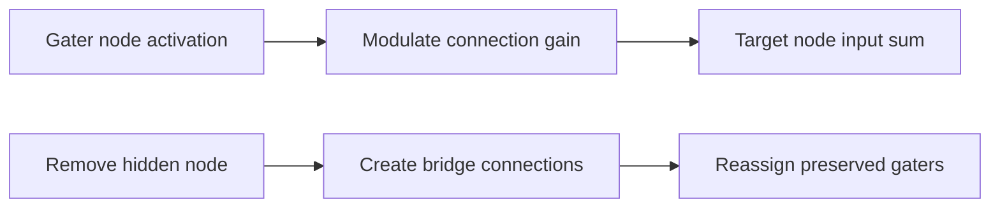

# architecture/network/gating

Connection-gating utilities and gate-aware repair helpers for network edits.

Gating is the lightweight way to let one node decide how strongly another
connection should matter right now. That makes this chapter about more than
a simple `gate()` setter. It also owns the awkward structural case where a
hidden node is removed and the network tries to preserve useful gated
behavior by reconnecting predecessor and successor nodes, then reassigning
preserved gaters onto the new bridge connections.

The split inside this folder follows those two jobs. `gate.utils` keeps
ordinary gate and ungate bookkeeping small and predictable. `remove.utils`
handles the more invasive bridge-repair flow used during gate-aware hidden
node removal. The shared types file only carries temporary collections used
during that repair work; it is not the right chapter intro.



A useful mental model is that gating changes when a connection is
influential, while bridge repair tries to preserve where information can
still travel after topology surgery. Keeping both concerns together makes
the public surface easier to learn because callers usually encounter them in
the same network-editing workflows.

Example: attach a hidden node as a gater for one connection.

```ts
network.gate(hiddenNode, connection);
```

Example: later remove that modulation and return the connection to static
weighting.

```ts
network.ungate(connection);
```

## architecture/network/gating/network.gating.utils.ts

### gate

```ts
gate(
  node: default,
  connection: default,
): void
```

Attach a gater node to a connection so that the connection's effective weight
becomes dynamically modulated by the gater's activation (see {@link Node.gate} for exact math).

Validation / invariants:
 - Throws if the gater node is not part of this network (prevents cross-network corruption).
 - If the connection is already gated, function is a no-op (emits warning when enabled).
 - Successful gate attachment revalidates the explicit temporal descriptor bag so generic gating edits
   cannot leave stale module metadata behind.

Complexity: O(1)

Parameters:
- `this` - Bound Network instance.
- `node` - Candidate gater node (must belong to network).
- `connection` - Connection to gate.

### removeNode

```ts
removeNode(
  node: default,
): void
```

Remove a hidden node from the network while attempting to preserve functional connectivity.

Algorithm outline:
 1. Reject removal if node is input/output (structural invariants) or absent (error).
 2. Optionally collect gating nodes (if keep_gates flag) from inbound & outbound connections.
 3. Remove self-loop (if present) to simplify subsequent edge handling.
 4. Disconnect all inbound edges (record their source nodes) and all outbound edges (record targets).
 5. For every (input predecessor, output successor) pair create a new connection unless:
      a. input === output (avoid trivial self loops) OR
      b. an existing projection already connects them.
 6. Reassign preserved gater nodes randomly onto newly created bridging connections.
 7. Ungate connections that were gated BY this node (where node acted as gater).
 8. Remove node from network node list and flag node index cache as dirty.

Complexity summary:
 - Let I = number of inbound edges, O = number of outbound edges.
 - Disconnect phase: O(I + O)
 - Bridging phase: O(I * O) connection existence checks (isProjectingTo) + potential additions.
 - Gater reassignment: O(min(G, newConnections)) where G is number of preserved gaters.

Preservation rationale:
 - Reassigning gaters maintains some of the dynamic modulation capacity that would otherwise
   be lost, aiding continuity during topology simplification.

Parameters:
- `this` - Bound Network instance.
- `node` - Hidden node to remove.

### ungate

```ts
ungate(
  connection: default,
): void
```

Remove gating from a connection, restoring its static weight contribution.

Idempotent: If the connection is not currently gated, the call performs no structural changes
(and optionally logs a warning). After ungating, the connection's weight will be used directly
without modulation by a gater activation.
Successful ungate operations also revalidate the explicit temporal descriptor bag so stale gated-block
descriptors do not survive until a later serialize pass.

Complexity: O(n) where n = number of gated connections (indexOf lookup) – typically small.

Parameters:
- `this` - Bound Network instance.
- `connection` - Connection to ungate.

## architecture/network/gating/network.gating.gate.utils.ts

### assertGaterNodeBelongsToNetwork

```ts
assertGaterNodeBelongsToNetwork(
  network: default,
  node: default,
): void
```

Validate that a candidate gater node belongs to the target network before mutating connection gate ownership.
This guard prevents cross-network node references that would corrupt reverse gate bookkeeping.

Parameters:
- `network` - Network performing the gating operation.
- `node` - Candidate gater node.

Returns: Nothing.

### attachGaterToConnection

```ts
attachGaterToConnection(
  network: default,
  node: default,
  connection: default,
): void
```

Attach a gater to a connection and track that connection in the network gate list used by ungate routines.
The helper keeps connection-level and network-level gate bookkeeping synchronized.

Parameters:
- `network` - Network being updated.
- `node` - Gater node to attach.
- `connection` - Connection to gate.

Returns: Nothing.

### detachConnectionFromGater

```ts
detachConnectionFromGater(
  connection: default,
): void
```

Remove reverse gater bookkeeping from a connection's gater node when ungating a previously tracked edge.
Keeping this step explicit prevents stale gated-connection references on the gater node.

Parameters:
- `connection` - Connection to detach from its gater.

Returns: Nothing.

### findGateIndex

```ts
findGateIndex(
  network: default,
  connection: default,
): number
```

Find a connection position within the network global gates list used for deterministic ungate updates.
Returning a stable index allows callers to remove tracked gates without scanning extra structures.

Parameters:
- `network` - Network containing global gate references.
- `connection` - Connection to locate.

Returns: Zero-based index in the gates list, or -1 when absent.

### isConnectionAlreadyGated

```ts
isConnectionAlreadyGated(
  connection: default,
): boolean
```

Determine whether a connection already has a gater node assigned before applying a new gate operation.
This check is used to keep gate lists idempotent and avoid duplicate ownership updates.

Parameters:
- `connection` - Connection candidate.

Returns: True when a gater is already set; otherwise false.

### removeGateAtIndex

```ts
removeGateAtIndex(
  network: default,
  gateIndex: number,
): void
```

Remove a gated connection from the network global gate list after ownership checks pass.
This mutation helper isolates gate-list updates so higher-level ungate flow stays declarative.

Parameters:
- `network` - Network being updated.
- `gateIndex` - Index to remove from the gate list.

Returns: Nothing.

### warnConnectionAlreadyGated

```ts
warnConnectionAlreadyGated(): void
```

Emit a warning when a gate operation is skipped due to existing gating.

Returns: Nothing.

### warnMissingGateConnection

```ts
warnMissingGateConnection(): void
```

Emit a warning when an ungate request targets a non-tracked connection.

Returns: Nothing.

## architecture/network/gating/network.gating.remove.utils.ts

### assertNodeRemovableAndGetIndex

```ts
assertNodeRemovableAndGetIndex(
  network: default,
  node: default,
): number
```

Ensure a node is eligible for removal and return its index in the network node list so structural anchors and missing nodes fail fast with explicit diagnostics.

Parameters:
- `network` - Network containing the node.
- `node` - Node to validate.

Returns: Index of the node in the network node list.

### createBridgingConnections

```ts
createBridgingConnections(
  network: default,
  predecessorNodes: ConnectedNodeList,
  successorNodes: ConnectedNodeList,
): BridgingConnectionList
```

Create bridging connections from each predecessor to each successor when valid so node removal can maintain coarse connectivity without duplicating existing projections.

Parameters:
- `network` - Network where bridge connections are created.
- `predecessorNodes` - Source nodes collected from inbound edges.
- `successorNodes` - Target nodes collected from outbound edges.

Returns: Newly created bridge connections.

### disconnectInboundConnections

```ts
disconnectInboundConnections(
  network: default,
  node: default,
  preservedGaters: PreservedGaters,
  subNodeConfig: NodeRemovalMutationConfig,
): ConnectedNodeList
```

Disconnect all inbound connections for a node while collecting predecessor nodes so bridge-connection reconstruction can preserve upstream reachability.
The collected predecessor set defines candidate source nodes for post-removal connectivity restoration.

Parameters:
- `network` - Network being updated.
- `node` - Node being removed.
- `preservedGaters` - Mutable collection for gaters that should be reassigned.
- `subNodeConfig` - Current SUB_NODE mutation settings.

Returns: Predecessor nodes that previously projected into the removed node.

### disconnectNodeSelfLoop

```ts
disconnectNodeSelfLoop(
  network: default,
  node: default,
): void
```

Disconnect a node self-loop before broader edge rewiring so self-referential activation state does not survive node-removal mutation flows.
This keeps removal semantics consistent with later bridge reconstruction and gater reassignment stages.

Parameters:
- `network` - Network being updated.
- `node` - Node whose self-loop should be removed.

Returns: Nothing.

### disconnectOutboundConnections

```ts
disconnectOutboundConnections(
  network: default,
  node: default,
  preservedGaters: PreservedGaters,
  subNodeConfig: NodeRemovalMutationConfig,
): ConnectedNodeList
```

Disconnect all outbound connections for a node while collecting successor nodes so bridge-connection reconstruction can preserve downstream projection coverage.
The collected successor set defines candidate targets for bridging after structural deletion.

Parameters:
- `network` - Network being updated.
- `node` - Node being removed.
- `preservedGaters` - Mutable collection for gaters that should be reassigned.
- `subNodeConfig` - Current SUB_NODE mutation settings.

Returns: Successor nodes that were previously targeted by the removed node.

### preserveGaterForReassignment

```ts
preserveGaterForReassignment(
  connection: default,
  removedNode: default,
  preservedGaters: PreservedGaters,
  subNodeConfig: NodeRemovalMutationConfig,
): void
```

Preserve a gater for later reassignment when gate retention is enabled.

Parameters:
- `connection` - Connection being detached.
- `removedNode` - Node currently being removed.
- `preservedGaters` - Mutable list of gaters to keep.
- `subNodeConfig` - Current SUB_NODE mutation settings.

Returns: Nothing.

### reassignPreservedGaters

```ts
reassignPreservedGaters(
  network: default,
  preservedGaters: PreservedGaters,
  bridgingConnections: BridgingConnectionList,
): void
```

Reattach preserved gaters to randomly selected bridge connections so gate ownership can survive node removal when keep-gates mutation policy is enabled.

Parameters:
- `network` - Network performing reassignment.
- `preservedGaters` - Gaters retained during node removal.
- `bridgingConnections` - Available bridge connections for reassignment.

Returns: Nothing.

### removeNodeAtIndex

```ts
removeNodeAtIndex(
  network: default,
  nodeIndex: number,
): void
```

Remove a node from the runtime node list and mark index caches dirty so later activation and topology helpers rebuild index-based lookup state.

Parameters:
- `network` - Network being mutated.
- `nodeIndex` - Index of the node to remove.

Returns: Nothing.

### resolveSubNodeMutationConfig

```ts
resolveSubNodeMutationConfig(): NodeRemovalMutationConfig
```

Resolve the active SUB_NODE mutation configuration shape for node removal.

Returns: Normalized SUB_NODE config when available; otherwise undefined.

### selectRandomIndex

```ts
selectRandomIndex(
  length: number,
): number
```

Select a uniformly random integer index in the range [0, length).

Parameters:
- `length` - Upper bound (exclusive).

Returns: Random zero-based index.

### shouldCreateBridgeConnection

```ts
shouldCreateBridgeConnection(
  predecessorNode: default,
  successorNode: default,
): boolean
```

Decide whether a predecessor-successor pair should receive a bridge connection.

Parameters:
- `predecessorNode` - Candidate source node.
- `successorNode` - Candidate target node.

Returns: True when the pair is distinct and no projection already exists.

### ungateConnectionsGatedByNode

```ts
ungateConnectionsGatedByNode(
  network: default,
  node: default,
): void
```

Ungate all connections currently gated by the removed node so detached gating references do not remain after structural mutation completes.

Parameters:
- `network` - Network performing ungate operations.
- `node` - Node whose gated connections should be released.

Returns: Nothing.

## architecture/network/gating/network.gating.utils.types.ts

### BridgingConnectionList

List of newly created bridging connections that can each receive a reassigned gater from the node-removal rewiring operation.

### ConnectedNodeList

Ordered list of predecessor or successor nodes collected during bridge construction when a hidden node is removed from the network graph.

### MutableNetworkGatingProps

Network shape extension that exposes the mutable flag used to invalidate the node index cache after structural gating changes alter the graph.

### NodeRemovalMutationConfig

Normalized SUB_NODE mutation configuration resolved before node-removal rewiring begins; undefined when no mutation config is present in the caller context.

### PreservedGaters

Mutable collection of gater nodes retained during hidden-node removal so they can be reassigned to the bridging connections created by the rewiring pass.

## architecture/network/gating/network.gating.errors.ts

Raised when a gating node does not belong to the target network.

### NetworkGatingNodeMembershipError

Raised when a gating node does not belong to the target network.

### NetworkGatingRemovalNodeNotFoundError

Raised when a gating removal request targets a node that is not in the network.

### NetworkGatingStructuralAnchorRemovalError

Raised when a gating removal request targets a structural anchor node.
