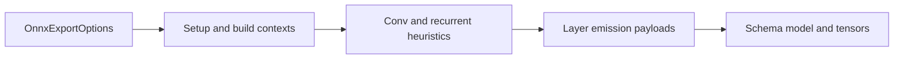

# architecture/network/onnx/export

Export-owned execution and payload types for NeatapticTS ONNX serialization.

This chapter holds the types that belong to the exporter implementation:
export options, build/setup contexts, recurrent and Conv heuristics, and the
dense/per-neuron layer-emission payloads used by the export helpers.

Shared runtime bridge types such as `NodeInternals` remain root-owned in
`network.onnx.utils.types.ts`, and the persisted wire-format schema stays in
`schema/network.onnx.schema.types.ts`.



## architecture/network/onnx/export/network.onnx.export.types.ts

### ActivationSquashFunction

```ts
ActivationSquashFunction(
  x: number,
  derivate: boolean | undefined,
): number
```

Activation function signature used by ONNX layer emission helpers for encoding activation operator type attributes.

### AttentionMapping

Explicit export-only attention mapping for the Phase 5E shadow subset.

This contract keeps attention source-owned rather than heuristic: callers
opt one target layer into a fixed-width self-attention shadow block while the
stable dense path remains the canonical runtime behavior.

### ConcatMapping

Explicit export-only concat mapping for the narrow Phase 5 merge subset.

This contract keeps concat source-owned instead of inferred: callers name one
skipped source layer and one target layer, and export preserves the merge as a
deterministic `Concat -> Gemm` path with the default adjacent-layer slice kept
first in the merged input order.

### ConvInferenceEvaluationContext

Width and shape evaluation context used by Conv inference helpers.

### ConvInferenceKernelEvaluationContext

Kernel candidate context for one Conv inference evaluation pass, carrying kernel size and width bounds.

### ConvInferenceResult

Collected inferred Conv metadata payload, holding inferred layer indices and their derived Conv2DMapping specs.

### ConvInferenceTraversalContext

Traversal context for one hidden layer during Conv inference, including declared mappings and pool specs per layer.

### ConvKernelConsistencyContext

Context for kernel-coordinate consistency checks at one output position, comparing representative weights with tolerance.

### ConvLayerPairContext

Context for one resolved Conv mapping layer pair, supplying the Conv spec and adjacent layer node lists.

### ConvOutputCoordinate

Coordinate for one Conv output neuron, encoding the output channel, row, and column indices together.

### ConvRepresentativeKernelContext

Context for representative Conv kernel collection per output channel, supplying neuron lists and the Conv spec.

### ConvSharingValidationContext

Context for validating Conv sharing across all declared mappings, holding layer nodes and mapping specifications.

### ConvSharingValidationResult

Result of Conv sharing validation across declared mappings, reporting verified and mismatched layer indices.

### DenseActivationContext

Dense activation emission context carrying layer index, tensor names, graph names, squash function, and opset version.

### DenseActivationNodePayload

Strongly typed activation node payload used by dense export helpers.

### DenseGemmNodePayload

Strongly typed Gemm node payload used by dense export helpers.

### DenseGraphNames

Dense graph tensor names identifying the Gemm output and activation output tensors for one layer.

### DenseInitializerValues

Dense initializer value arrays holding the flattened weight matrix values and bias vector for one layer.

### DenseLayerContext

Dense layer context enriched with the resolved activation squash function derived from the current layer nodes.

### DenseLayerParams

Parameters for dense layer emission, grouping model, layer index, node lists, ordering flag, and export options.

### DenseOrderedNodePayload

Dense node payload union used by ordered append helpers, covering Gemm and activation node payloads.

### DenseTensorNames

Dense initializer tensor names for one emitted layer, naming the weight and bias initializer tensors.

### DenseWeightBuildContext

Context for building dense layer initializers from two adjacent layers.

### DenseWeightBuildResult

Dense layer initializer fold output, containing the flattened weight matrix values and bias vector.

### DenseWeightRow

One collected dense row before fold to flattened initializers, containing per-neuron weights and bias value.

### DenseWeightRowCollectionContext

Context for collecting one dense row, supplying previous layer nodes and the target neuron internals.

### DiagonalRecurrentBuildContext

Context for building a diagonal recurrent matrix from self-connections, supplying the current layer node list.

### ExportNodeIndexAssignmentContext

Context for assigning a stable export index to one node.

### FlattenAfterPoolingContext

Flatten emission context after optional pooling, carrying model, flatten flag, layer index, and source output name.

### FusedRecurrentEmissionExecutionContext

Shared execution context for emitting one fused recurrent layer payload.

### FusedRecurrentGraphNames

Context for ONNX fused recurrent node payload names, holding the graph node name and its output tensor name.

### FusedRecurrentInitializerNames

Context for ONNX fused recurrent initializer names, grouping weight, recurrent-weight, and bias tensor name strings.

### GruEmissionContext

Context for heuristic GRU emission when a layer matches expected shape.

### HiddenLayerHeuristicContext

Context for one hidden layer during heuristic recurrent emission, tracking layer index and model state.

### IndexedMetadataAppendContext

Append-an-index metadata context for JSON-array metadata keys, supplying model, key, and layer index.

### LayerActivationContext

Activation analysis context for one layer, capturing whether the layer contains mixed activation functions.

### LayerBuildContext

Layer build context used while emitting one ONNX graph layer segment.

### LayerRecurrentDecisionContext

Context used to decide recurrent emission branch usage, carrying layer index and recurrent layer index list.

### LayerTraversalContext

Layer traversal context with adjacent layers, output classification, and the full LayerBuildContext fields.

### LstmCandidateContext

Candidate context for validating one LSTM-like hidden layer pattern against the expected node count.

### LstmEmissionContext

Context for heuristic LSTM emission when a layer matches expected shape.

### LstmLayerTraversalContext

Traversal context for one hidden layer during LSTM stub collection.

### LstmPatternStub

Heuristic LSTM pattern stub for metadata output, holding the detected layer index and unit size.

### OnnxBaseModelBuildContext

Context for constructing a base ONNX model shell, supplying input and output dimension arrays for the graph.

### OnnxBuildResolvedOptions

Resolved options for ONNX model build orchestration, with all export option defaults already applied and normalized.

### OnnxConvEmissionContext

Context used after resolving Conv mapping for one layer, extending OnnxConvEmissionParams with the resolved Conv2DMapping spec.

### OnnxConvEmissionParams

Parameters accepted by Conv layer emission, grouping model, options, layer index, previous output, and adjacent node lists.

### OnnxConvParameters

Flattened Conv parameters for ONNX initializers, containing weight and bias arrays derived from Conv layer neurons.

### OnnxConvTensorNames

Tensor names generated for Conv parameters, holding weight and bias initializer name strings for one layer.

### OnnxDynamicQuantizationOptions

Dynamic uint8 quantization request packet for the landed dense-guidance lane only.

The current subset is intentionally narrow:
- target only the same-family dense baseline,
- keep the affine and activation compute on the existing float32 path,
- use `metadata-only` when the graph should stay structurally unchanged, or
- use `DynamicQuantizeLinear` when the exporter should insert an explicit
  `DynamicQuantizeLinear -> DequantizeLinear` boundary ahead of supported
  dense `Gemm` inputs.

Example:

```ts
const options: OnnxDynamicQuantizationOptions = {
  mode: 'dynamic-uint8',
  target: 'dense',
  representation: 'DynamicQuantizeLinear',
};
```

### OnnxExportOptions

Options controlling ONNX-like export.

These options trade off strictness, portability, and fidelity:

- **Strict (default-ish)** export tries to keep the graph easy to interpret:
  layered topology, homogeneous activations per layer, and fully-connected layers.

- **Relaxed** export (`allowPartialConnectivity` / `allowMixedActivations`) can represent
  more networks, but it may generate graphs that are primarily meant for NeatapticTS’s
  importer (and may be less friendly to external ONNX tooling).

- **Recurrent export** (`allowRecurrent`) is intentionally conservative and currently
  focuses on a constrained single-step representation and optional fused heuristics.

Key fields (high-level):
- `includeMetadata`: includes `metadata_props` with architecture hints.
- `opset`: numeric opset version stored in the exported model metadata (default is
  resolved by the exporter; commonly 18 in this codebase).
- `legacyNodeOrdering`: keeps older node ordering for backward compatibility.
- `conv2dMappings` / `pool2dMappings`: encode conv/pool semantics for fully-connected
  layers via explicit mapping declarations.
- `concatMappings`: opt one skipped source layer into the narrow same-family
  `Concat -> Gemm` merge subset with deterministic `previous_then_source`
  input order.
- `attentionMappings`: opt one target layer into the fixed-width same-family
  self-attention shadow subset.
- `precision`: opt into reduced-precision export. The current landed lane is
  `storage-fp16`, which packs eligible same-family dense and Conv weight or
  bias initializers into float16 storage and inserts deterministic
  `Cast -> float32` bridges so operator inputs stay type-consistent.
- `quantization`: declare an explicit quantization request packet. The
  current exporter can validate static calibration contracts, emit
  deterministic scale or zero-point parameter initializers for the supported
  same-family dense and spatial subset, and close the dense-only Phase 7D
  lane for explicitly targeted same-family one-output dense layers. Those
  layers can lower into a
  `QuantizeLinear -> QLinearMatMul -> DequantizeLinear` path with an
  explicit float-domain bias bridge plus the exporter-owned unary
  activation node when present, while the closed 7E Conv subset lowers
  supported spatial paths into `QuantizeLinear -> QLinearConv ->
  DequantizeLinear`, emits one `int32` fused-bias value per output channel,
  and returns to float32 before pooling, flatten, reshape, or downstream
  dense boundaries. The closed 7F dynamic lane now adds dense-only guidance:
  supported same-family dense paths can either record `metadata-only`
  guidance or insert `DynamicQuantizeLinear -> DequantizeLinear` immediately
  ahead of dense `Gemm` inputs. Wider dense targets, unsupported spatial
  fallbacks, recurrent, advanced-graph, mixed-activation, and
  partial-connectivity requests stay on float32 with explicit fallback
  metadata.
- `autoPromoteInferredConv`: upgrades heuristic Conv-like layers into real `Conv`
  emission only when the exporter can prove the dense weights already behave like a
  shared-kernel spatial layout, including the current conservative multi-channel and
  unpooled stacked-chain subsets, deeper single-channel post-pool chains whose
  pooled tensor shapes can be derived sequentially, and deeper pooled
  multi-channel chains when the pooled tensor shapes can be derived sequentially
  and the pooled source stays compact per channel. The only proven
  flatten-after-pool promotion path is the narrow final hidden-stage
  reshape-bridge subset. Earlier flattened pooled consumers and repeated
  flatten-bridge chains stay on the honest fallback path.

### OnnxGraphDimensionBuildContext

Context for constructing input/output ONNX graph dimensions, carrying width values and the batch-dimension flag.

### OnnxGraphDimensions

Output dimensions used by ONNX graph input/output value info payloads.

### OnnxLayerEmissionContext

Context for emitting non-input layers during model build, including layer list, options, and ordering flags.

### OnnxLayerEmissionResult

Result of emitting non-input export layers, carrying the last output name and the layer output name map.

### OnnxModelMetadataContext

Context for applying optional ONNX model metadata, carrying model reference, opset, producer info, and inclusion flags.

### OnnxPostProcessingContext

Context for post-processing and export metadata finalization, holding model, layers, options, and layer emission result.

### OnnxPrecisionOptions

Opt-in reduced-precision export controls for the Phase 7 storage lane.

### OnnxQuantizationCalibrationLayerTarget

One explicitly calibrated layer target used to build deterministic parameter tensors.

### OnnxQuantizationCalibrationOptions

External calibration packet for static quantization, grouping source tag, layer targets, and policy selections.

### OnnxQuantizationCalibrationRange

External calibration packet for one quantization layer target, capturing min and max float bounds.

### OnnxQuantizationCalibrationRoundingMode

Rounding policy for deterministic zero-point resolution; only 'nearest-even' is currently accepted by the exporter.

### OnnxQuantizationCalibrationSymmetry

Symmetry policy for activation and weight quantization parameters; 'symmetric' or 'asymmetric' options are both accepted.

### OnnxQuantizationCalibrationWeightRangePolicy

Supported weight-range reduction policy for the first calibration contract; only 'min-max' is accepted.

### OnnxQuantizationCalibrationZeroInclusionPolicy

Zero-inclusion policy for exported calibration parameters; controls whether zero must fall within the quantization range.

### OnnxQuantizationOptions

Supported quantization request packets for the narrow first Phase 7 lane.

### OnnxRecurrentCollectionContext

Context for collecting recurrent layer indices during model build, providing the layer list and export options.

### OnnxRecurrentInputValueInfoContext

Context for constructing one recurrent previous-state graph input payload, carrying name, hidden width, and batch flag.

### OnnxRecurrentLayerProcessingContext

Execution context for processing one hidden recurrent layer during model build traversal and emission.

### OnnxRecurrentLayerTraversalContext

Traversal context for one hidden layer during recurrent-input collection, supplying layer index and batch-dimension flag.

### OnnxResolvedPrecisionOptions

Resolved reduced-precision packet for build orchestration, carrying the requested flag, mode, and metadata inclusion decision.

### OnnxResolvedQuantizationCalibrationOptions

Resolved calibration packet with exporter-owned defaults applied; all optional policy fields are filled in before emission.

### OnnxResolvedQuantizationOptions

Resolved quantization packet for build orchestration, covering unresolved, static-8bit, and dynamic-uint8 branches.

### OnnxStaticQuantizationOptions

Static 8-bit quantization request packet for the current Phase 7 qlinear subset.

The landed exporter-owned subset is deliberately narrow:
- same-family one-output dense targets can lower through `QLinearMatMul`,
- the current explicit Conv subset can lower through `QLinearConv`, and
- both paths return to float32 before unsupported graph families or runtime
  boundaries widen beyond the current support contract.

Example:

```ts
const options: OnnxStaticQuantizationOptions = {
  mode: 'static-8bit',
  targets: ['conv'],
  calibration: {
    source: 'external',
    layerTargets: [
      {
        target: 'conv',
        layerIndex: 1,
        inputRange: { min: -1, max: 1 },
        outputRange: { min: -0.5, max: 0.75 },
      },
    ],
  },
  representation: 'qlinear',
};
```

### OptionalLayerOutputParams

Shared parameters for optional pooling or flatten output emission after one dense layer output tensor.

### OptionalPoolingAndFlattenParams

Parameters for optional pooling + flatten emission after a layer output.

### PerNeuronConcatNodePayload

Per-neuron concat node payload used to merge individual neuron outputs into one combined layer tensor.

### PerNeuronGraphNames

Per-neuron graph tensor names identifying the Gemm output and activation output for one neuron subgraph.

### PerNeuronLayerContext

Per-neuron layer context alias for PerNeuronLayerParams, used at the per-neuron layer traversal boundary.

### PerNeuronLayerParams

Parameters for per-neuron layer emission, grouping model, layer index, node lists, options, and batch-dimension flag.

### PerNeuronNodeContext

Per-neuron normalized node context replacing raw Node references with resolved NodeInternals for safe emission.

### PerNeuronSubgraphContext

Per-neuron subgraph emission context carrying layer index, neuron index, previous output name, and opset version.

### PerNeuronTensorNames

Per-neuron initializer tensor names identifying weight and bias tensors for one neuron subgraph.

### PoolingAttributes

Pooling tensor attributes for ONNX node payloads, grouping kernel shape, strides, and padding values.

### PoolingEmissionContext

Pooling emission context resolved for one layer output, extending OptionalLayerOutputParams with the Pool2DMapping spec.

### RecurrentActivationEmissionContext

Context for selecting and emitting recurrent activation node payload using the layer's dominant squash function.

### RecurrentGateBlockCollectionContext

Context for collecting one gate parameter block, supplying gate nodes, previous layer, unit size, and diagonal flag.

### RecurrentGateParameterCollectionResult

Flattened recurrent gate parameter vectors for one fused operator, grouping input, recurrent, and bias arrays.

### RecurrentGateRow

One recurrent gate row payload before flatten fold, containing input weights, recurrent weights, and bias.

### RecurrentGateRowCollectionContext

Context for collecting one recurrent gate row (one neuron), supplying the previous layer node list and unit size.

### RecurrentGemmEmissionContext

Context for emitting one Gemm node for recurrent single-step export.

### RecurrentGraphNames

Derived graph names for one recurrent single-step layer payload, with all tensor and node names resolved.

### RecurrentHeuristicEmissionContext

Context for heuristic recurrent operator emission traversal, carrying model, layer list, and previous output tensor name.

### RecurrentInitializerEmissionContext

Context for pushing recurrent initializers into ONNX graph state, carrying widths, tensor names, and value arrays.

### RecurrentInitializerNames

Initializer tensor names for one single-step recurrent layer, naming weight, bias, and recurrent-weight tensors.

### RecurrentInitializerValues

Collected initializer vectors for one single-step recurrent layer, storing weight matrix, biases, and recurrent weights.

### RecurrentLayerEmissionContext

Derived execution context for single-step recurrent layer emission, extending params with layer slot and widths.

### RecurrentLayerEmissionParams

Parameters for single-step recurrent layer emission, supplying model, layer index, and adjacent node lists.

### RecurrentRowCollectionContext

Context for collecting one recurrent matrix row, supplying the layer node list and the row index to extract.

### ResidualAddLayerParams

Parameters for one-hop residual-add dense layer emission, carrying source, residual, and merge node name strings.

### SharedActivationNodeBuildParams

Shared parameters for constructing an activation node payload, carrying activation type and output name strings.

### SharedGemmNodeBuildParams

Shared parameters for constructing a Gemm node payload, carrying weight, bias, output tensor names, and node name.

### SpecMetadataAppendContext

Append-a-spec metadata context for JSON-array metadata keys, supplying model, key, and Conv or Pool spec.

### WeightToleranceComparisonContext

Context for comparing two scalar weights with numeric tolerance, used by Conv sharing validation helpers.

## architecture/network/onnx/export/network.onnx.export-flow.utils.ts

### appendMetadataEntry

```ts
appendMetadataEntry(
  model: OnnxModel,
  key: string,
  value: string,
): void
```

Append one metadata entry to the model-level metadata registry.

Parameters:
- `model` - Built ONNX model.
- `key` - Metadata key.
- `value` - Metadata value.

Returns: Nothing.

### appendPhaseSevenRequestMetadata

```ts
appendPhaseSevenRequestMetadata(
  model: OnnxModel,
  networkLayers: default[][],
  sourceOptions: OnnxExportOptions,
): void
```

Append Phase 7 request metadata without implying that reduced-precision lowering has landed.

Parameters:
- `model` - Built ONNX model.
- `networkLayers` - Layered network nodes.
- `sourceOptions` - Raw export options.

Returns: Nothing.

### appendQuantizationRequestMetadata

```ts
appendQuantizationRequestMetadata(
  model: OnnxModel,
  networkLayers: default[][],
  sourceOptions: OnnxExportOptions,
): void
```

Append quantization request metadata and explicit float32 fallback reasons.

Parameters:
- `model` - Built ONNX model.
- `networkLayers` - Layered network nodes.
- `sourceOptions` - Raw export options.

Returns: Nothing.

### buildPrecisionFallbackReasons

```ts
buildPrecisionFallbackReasons(
  networkLayers: default[][],
  sourceOptions: OnnxExportOptions,
): string[]
```

Build the explicit float32 fallback reasons for a Phase 7 precision request.

Parameters:
- `networkLayers` - Layered network nodes.
- `sourceOptions` - Raw export options.

Returns: Ordered fallback reason codes.

### buildQuantizationFallbackReasons

```ts
buildQuantizationFallbackReasons(
  model: OnnxModel,
  networkLayers: default[][],
  sourceOptions: OnnxExportOptions,
): string[]
```

Build the explicit float32 fallback reasons for a Phase 7 quantization request.

Parameters:
- `networkLayers` - Layered network nodes.
- `sourceOptions` - Raw export options.

Returns: Ordered fallback reason codes.

### hasAdvancedGraphBoundary

```ts
hasAdvancedGraphBoundary(
  sourceOptions: OnnxExportOptions,
): boolean
```

Detect whether the current export request crosses the explicit advanced-graph boundary.

Parameters:
- `sourceOptions` - Raw export options.

Returns: True when explicit merge or attention mappings are requested.

### hasRecurrentBoundary

```ts
hasRecurrentBoundary(
  networkLayers: default[][],
  sourceOptions: OnnxExportOptions,
): boolean
```

Detect whether the current export request crosses the recurrent boundary.

Parameters:
- `networkLayers` - Layered network nodes.
- `sourceOptions` - Raw export options.

Returns: True when recurrent export is requested and a hidden layer carries self-state.

### hasSpatialBoundary

```ts
hasSpatialBoundary(
  sourceOptions: OnnxExportOptions,
): boolean
```

Detect whether the current export request crosses the spatial boundary.

Parameters:
- `sourceOptions` - Raw export options.

Returns: True when explicit Conv or pooling mappings are requested.

### hasUnsupportedMultiOutputDenseQuantizationTarget

```ts
hasUnsupportedMultiOutputDenseQuantizationTarget(
  model: OnnxModel,
  quantizationPacket: OnnxStaticQuantizationOptions,
): boolean
```

Detect whether the current static request includes any targeted multi-output dense layer that stayed on float32.

Parameters:
- `model` - Built ONNX model.
- `quantizationPacket` - Raw static quantization request.

Returns: True when a targeted dense layer is wider than the landed one-output qlinear subset.

### resolveDenseQuantizationOutputWidth

```ts
resolveDenseQuantizationOutputWidth(
  model: OnnxModel,
  layerIndex: number,
): number
```

Resolve the dense output width for one targeted layer from its bias initializer.

Parameters:
- `model` - Built ONNX model.
- `layerIndex` - Dense export layer index.

Returns: Dense output width.

### resolveEffectiveExportOptions

```ts
resolveEffectiveExportOptions(
  networkLayers: default[][],
  sourceOptions: OnnxExportOptions,
): OnnxExportOptions
```

Resolve effective export options without mutating caller-owned state.

Parameters:
- `networkLayers` - Layered network nodes.
- `sourceOptions` - Raw export options.

Returns: Effective export options for this export pass.

### resolveEffectiveQuantizationMode

```ts
resolveEffectiveQuantizationMode(
  model: OnnxModel,
  requestedQuantizationMode: "static-8bit" | "dynamic-uint8",
  quantizationFallbackReasons: string[],
): "static-8bit" | "dynamic-uint8" | "none"
```

Resolve the effective quantization mode from the emitted graph payload.

Parameters:
- `model` - Built ONNX model.
- `requestedQuantizationMode` - Requested quantization mode.

Returns: Effective quantization mode for metadata emission.

### resolveStaticQuantizationFallbackReasons

```ts
resolveStaticQuantizationFallbackReasons(
  model: OnnxModel,
): string[]
```

Resolve static quantization fallback reasons after checking whether qlinear lowering landed.

Parameters:
- `model` - Built ONNX model.

Returns: Ordered static-quantization fallback reasons.

### runOnnxExportFlow

```ts
runOnnxExportFlow(
  network: default,
  options: OnnxExportOptions,
): OnnxModel
```

Execute the complete ONNX export flow for one network instance.

High-level behavior:
 1. Rebuild runtime connection caches and assign stable export indices.
 2. Infer layered ordering and collect recurrent-pattern stubs.
 3. Validate structural constraints for the requested export options.
 4. Build ONNX graph payload and append inference-oriented metadata.

Parameters:
- `network` - Source network to serialize.
- `options` - Optional ONNX export controls.

Returns: ONNX-like model payload.

## architecture/network/onnx/export/network.onnx.export-build.utils.ts

### buildOnnxModel

```ts
buildOnnxModel(
  network: default,
  layers: default[][],
  options: OnnxExportOptions | undefined,
): OnnxModel
```

Construct ONNX graph (initializers + nodes) from validated layered network structure.

Parameters:
- `network` - Source network (retained for API compatibility).
- `layers` - Layered nodes including input and output layers.
- `options` - Export options.

Returns: ONNX model.

## architecture/network/onnx/export/network.onnx.export-setup.utils.ts

### appendRecurrentGraphInput

```ts
appendRecurrentGraphInput(
  model: OnnxModel,
  traversalContext: OnnxRecurrentLayerTraversalContext,
): void
```

Append one recurrent previous-state graph input for a hidden layer.

Parameters:
- `model` - Target ONNX model.
- `traversalContext` - Hidden layer traversal context.

Returns: Nothing.

### appendRecurrentLayerIndex

```ts
appendRecurrentLayerIndex(
  recurrentLayerIndices: number[],
  traversalContext: OnnxRecurrentLayerTraversalContext,
): void
```

Append one recurrent layer index to the collected index list.

Parameters:
- `recurrentLayerIndices` - Collected recurrent layer indices.
- `traversalContext` - Hidden layer traversal context.

Returns: Nothing.

### applyModelMetadata

```ts
applyModelMetadata(
  context: OnnxModelMetadataContext,
): void
```

Attach producer, opset, and documentation metadata to a model when metadata emission is enabled for export diagnostics.
Fallback values keep metadata deterministic even when optional producer fields are omitted.

Parameters:
- `context` - Metadata application context.

Returns: Nothing.

### collectRecurrentLayerIndices

```ts
collectRecurrentLayerIndices(
  context: OnnxRecurrentCollectionContext,
): number[]
```

Detect hidden layers with self-recurrence and add matching previous-state graph inputs required by single-step recurrent export.
Collected indices are reused by metadata and recurrent post-processing lanes.

Parameters:
- `context` - Recurrent collection context.

Returns: Export-layer indices with recurrent self-connections.

### createBaseModel

```ts
createBaseModel(
  context: OnnxBaseModelBuildContext,
): OnnxModel
```

Create the base ONNX model shell with graph input and output declarations before operator emission starts.
Initializer and node arrays are intentionally empty so later export phases append deterministic content.

Parameters:
- `context` - Base model build context.

Returns: Initialized ONNX model with empty initializer/node lists.

### createGraphDimensions

```ts
createGraphDimensions(
  context: OnnxGraphDimensionBuildContext,
): OnnxGraphDimensions
```

Build tensor dimensions for model input and output boundaries, optionally prepending a symbolic batch axis for runtime-sized payloads.
The result is reused by value-info generation so shape contracts stay deterministic.

Parameters:
- `context` - Dimension construction context.

Returns: Input and output dimension arrays for ONNX value info.

### createGraphValueInfo

```ts
createGraphValueInfo(
  valueName: string,
  dimensions: OnnxDimension[],
): OnnxValueInfo
```

Create ONNX value info payload for one graph boundary tensor.

Parameters:
- `valueName` - Tensor value name.
- `dimensions` - Tensor dimensions.

Returns: ONNX value info payload.

### createHiddenLayerIndices

```ts
createHiddenLayerIndices(
  totalLayerCount: number,
): number[]
```

Build hidden layer indices excluding input and output layers.

Parameters:
- `totalLayerCount` - Total number of network layers.

Returns: Hidden layer indices.

### createHiddenLayerTraversalContexts

```ts
createHiddenLayerTraversalContexts(
  context: OnnxRecurrentCollectionContext,
): OnnxRecurrentLayerTraversalContext[]
```

Build traversal contexts for all hidden layers.

Parameters:
- `context` - Recurrent collection context.

Returns: Hidden layer traversal contexts.

### createRecurrentInputValueInfo

```ts
createRecurrentInputValueInfo(
  context: OnnxRecurrentInputValueInfoContext,
): OnnxValueInfo
```

Build one recurrent previous-state graph input payload.

Parameters:
- `context` - Recurrent input value-info context.

Returns: ONNX value info payload for recurrent state input.

### createRecurrentInputValueInfoContext

```ts
createRecurrentInputValueInfoContext(
  traversalContext: OnnxRecurrentLayerTraversalContext,
): OnnxRecurrentInputValueInfoContext
```

Build recurrent input context for one hidden recurrent layer.

Parameters:
- `traversalContext` - Hidden layer traversal context.

Returns: Recurrent input value-info context.

### createTensorDimensions

```ts
createTensorDimensions(
  width: number,
  batchDimension: boolean,
): OnnxDimension[]
```

Build one tensor shape dimension payload for dense vectors.

Parameters:
- `width` - Vector width.
- `batchDimension` - Whether symbolic batch dimension is enabled.

Returns: ONNX dimensions for the vector payload.

### CURRENT_ONNX_REFERENCE_OPSET

Current upstream ONNX reference opset version for the `ai.onnx` standard domain.

### hasLayerSelfRecurrence

```ts
hasLayerSelfRecurrence(
  hiddenLayerNodes: default[],
): boolean
```

Detect whether a hidden layer contains at least one self-recurrent node.

Parameters:
- `hiddenLayerNodes` - Hidden layer nodes.

Returns: True when a node has a self-connection.

### isRecurrentCollectionEnabled

```ts
isRecurrentCollectionEnabled(
  context: OnnxRecurrentCollectionContext,
): boolean
```

Determine whether recurrent layer collection should execute.

Parameters:
- `context` - Recurrent collection context.

Returns: True when recurrent collection is enabled.

### ONNX_IR_VERSION

Current ONNX IR version used by the repo's declared binary subset.

### ONNX_STANDARD_DOMAIN

Canonical ONNX standard-operator domain name used by opset metadata, schema annotations, and exporter compatibility checks across baseline graph emission paths.

### ONNX_STANDARD_DOMAIN_ALIAS

Canonical empty-string alias for the ONNX standard operator-set domain identifier.

### processHiddenLayerRecurrence

```ts
processHiddenLayerRecurrence(
  context: OnnxRecurrentLayerProcessingContext,
): void
```

Process one hidden layer for recurrent self-connections.

Parameters:
- `context` - Hidden layer recurrent processing context.

Returns: Nothing.

## architecture/network/onnx/export/network.onnx.export-attention.utils.ts

### emitShadowAttentionMappings

```ts
emitShadowAttentionMappings(
  model: OnnxModel,
  layers: default[][],
  options: OnnxExportOptions,
  layerOutputNamesByLayerIndex: ReadonlyMap<number, string>,
  includeMetadata: boolean,
): void
```

Emit explicit shadow attention blocks for the Phase 5E fixed-width subset.

The current runtime does not execute native attention semantics, so this
pass follows the same strategy used by the fused recurrent heuristics: emit a
deterministic ONNX attention subgraph without replacing the stable dense path
that the importer already round-trips.

Parameters:
- `model` - Target ONNX model.
- `layers` - Resolved layered network ordering.
- `options` - Export options.
- `layerOutputNamesByLayerIndex` - Emitted canonical layer output names.
- `includeMetadata` - Whether attention metadata should be recorded.

Returns: Nothing.

## architecture/network/onnx/export/network.onnx.export-build.emit.utils.ts

### applyPostProcessing

```ts
applyPostProcessing(
  context: OnnxPostProcessingContext,
): void
```

Applies all post-processing passes (recurrent heuristics, attention mappings, export metadata) to the model in place.

Parameters:
- `context` - Post-processing context with the model, layers, options, and emission results.

Returns: Nothing; the model is mutated in place.

### collectRecurrentIndices

```ts
collectRecurrentIndices(
  context: OnnxRecurrentCollectionContext,
): number[]
```

Collects the layer indices of all recurrent layers present in the export context.

Parameters:
- `context` - Recurrent collection context carrying layered nodes and recurrent flags.

Returns: Array of layer indices identified as recurrent.

### createInitializedModel

```ts
createInitializedModel(
  networkLayers: default[][],
  currentOptions: OnnxBuildResolvedOptions,
): OnnxModel
```

Creates an initialized ONNX model with graph dimensions and metadata derived from the resolved build options.

Parameters:
- `networkLayers` - Layered network node groups to derive input and output dimensions from.
- `currentOptions` - Resolved build options controlling metadata and batch dimensions.

Returns: Initialized ONNX model with graph dimensions and producer metadata applied.

### emitNonInputLayers

```ts
emitNonInputLayers(
  context: OnnxLayerEmissionContext,
): OnnxLayerEmissionResult
```

Emits ONNX graph nodes for every layer after the input layer and returns the accumulated emission result.

Parameters:
- `context` - Layer emission context carrying the model, layers, options, and recurrent metadata.

Returns: Accumulated emission result with output names and hidden-size metadata.

## architecture/network/onnx/export/network.onnx.export-postprocess.utils.ts

### appendConvLayerValidationResult

```ts
appendConvLayerValidationResult(
  result: ConvSharingValidationResult,
  layerIndex: number,
  isConsistent: boolean,
): void
```

Append one Conv-layer validation outcome and optional warning

### appendConvSharingMetadata

```ts
appendConvSharingMetadata(
  model: OnnxModel,
  result: ConvSharingValidationResult,
): void
```

Append Conv-sharing validation metadata arrays.

### appendFusedRecurrentInitializers

```ts
appendFusedRecurrentInitializers(
  model: OnnxModel,
  initializerNames: FusedRecurrentInitializerNames,
  parameters: RecurrentGateParameterCollectionResult,
  gateCount: number,
  unitSize: number,
  previousSize: number,
): void
```

Append fused recurrent initializer tensors to the ONNX graph

### appendFusedRecurrentNode

```ts
appendFusedRecurrentNode(
  graph: OnnxGraph,
  operatorType: "LSTM" | "GRU",
  previousOutputName: string,
  initializerNames: FusedRecurrentInitializerNames,
  graphNames: FusedRecurrentGraphNames,
  unitSize: number,
): void
```

Append fused recurrent operator node to the ONNX graph

### appendIndexMetadata

```ts
appendIndexMetadata(
  model: OnnxModel,
  key: string,
  layerIndex: number,
): void
```

Append a unique layer index to metadata array key

### appendMetadataProperty

```ts
appendMetadataProperty(
  model: OnnxModel,
  metadataProperty: OnnxMetadataProperty,
): void
```

Append metadata property to model metadata_props list

### appendRecurrentSingleStepMetadata

```ts
appendRecurrentSingleStepMetadata(
  model: OnnxModel,
  recurrentLayerIndices: number[],
): void
```

Append recurrent single-step metadata when recurrent layers exist

### areWeightsWithinTolerance

```ts
areWeightsWithinTolerance(
  context: WeightToleranceComparisonContext,
): boolean
```

Compare two scalar weights using configured tolerance

### asNodeInternals

```ts
asNodeInternals(
  node: default,
): NodeInternals
```

Resolve runtime node internals in one typed helper

### buildFusedGruExecutionContext

```ts
buildFusedGruExecutionContext(
  context: GruEmissionContext,
): FusedRecurrentEmissionExecutionContext
```

Build shared fused-recurrent execution context for GRU

### buildFusedLstmExecutionContext

```ts
buildFusedLstmExecutionContext(
  context: LstmEmissionContext,
): FusedRecurrentEmissionExecutionContext
```

Build shared fused-recurrent execution context for LSTM

### buildFusedRecurrentGraphNames

```ts
buildFusedRecurrentGraphNames(
  nodePrefix: string,
  outputSuffix: string,
  layerIndex: number,
): FusedRecurrentGraphNames
```

Build fused recurrent graph names for node and output

### buildFusedRecurrentInitializerNames

```ts
buildFusedRecurrentInitializerNames(
  operatorType: "LSTM" | "GRU",
  layerIndex: number,
): FusedRecurrentInitializerNames
```

Build fused recurrent initializer names for the current layer

### buildGruEmissionContext

```ts
buildGruEmissionContext(
  context: HiddenLayerHeuristicContext,
): GruEmissionContext
```

Build GRU emission context from one hidden-layer traversal record

### buildHiddenLayerHeuristicContext

```ts
buildHiddenLayerHeuristicContext(
  context: RecurrentHeuristicEmissionContext,
  layerIndex: number,
): HiddenLayerHeuristicContext
```

Build one hidden-layer traversal context.

### buildLstmEmissionContext

```ts
buildLstmEmissionContext(
  context: HiddenLayerHeuristicContext,
): LstmEmissionContext
```

Build LSTM emission context from one hidden-layer traversal record

### buildMetadataProperty

```ts
buildMetadataProperty(
  key: string,
  value: unknown,
): OnnxMetadataProperty
```

Build a metadata key/value property with JSON string serialization

### buildRecurrentHeuristicEmissionContext

```ts
buildRecurrentHeuristicEmissionContext(
  model: OnnxModel,
  layers: default[][],
  previousOutputName: string,
): RecurrentHeuristicEmissionContext
```

Build reusable context for recurrent heuristic traversal

### buildSharedInitializerSignature

```ts
buildSharedInitializerSignature(
  initializerEntry: OnnxTensor,
  initializerKind: "dense_weight" | "dense_bias" | "per_neuron_weight" | "per_neuron_bias",
): string
```

Build an exact-match signature for dense-family alias reuse

### classifySharedInitializerKind

```ts
classifySharedInitializerKind(
  initializerName: string,
): "dense_weight" | "dense_bias" | "per_neuron_weight" | "per_neuron_bias" | null
```

Classify the dense-family initializer kinds supported by the Phase 5B alias subset

### collectConvKernelCoordinates

```ts
collectConvKernelCoordinates(
  convSpec: Conv2DMapping,
): OnnxConvKernelCoordinate[]
```

Collect kernel coordinates for one Conv kernel traversal

### collectConvOutputCoordinates

```ts
collectConvOutputCoordinates(
  convSpec: Conv2DMapping,
): ConvOutputCoordinate[]
```

Collect output coordinates for full Conv traversal

### collectGruGateNodeGroups

```ts
collectGruGateNodeGroups(
  context: GruEmissionContext,
): default[][]
```

Collect GRU gate node groups in canonical export order

### collectHiddenLayerIndices

```ts
collectHiddenLayerIndices(
  layers: default[][],
): number[]
```

Collect hidden-layer indices for recurrent traversal

### collectLstmGateNodeGroups

```ts
collectLstmGateNodeGroups(
  context: LstmEmissionContext,
): default[][]
```

Collect LSTM gate node groups in canonical export order

### collectRecurrentGateBlockParameters

```ts
collectRecurrentGateBlockParameters(
  context: RecurrentGateBlockCollectionContext,
): RecurrentGateParameterCollectionResult
```

Collect flattened parameter vectors for one gate node block

### collectRecurrentGateRow

```ts
collectRecurrentGateRow(
  context: RecurrentGateRowCollectionContext,
): RecurrentGateRow
```

Collect one recurrent gate row payload (inputs, recurrent slice, and bias)

### collectRepresentativeKernelForChannel

```ts
collectRepresentativeKernelForChannel(
  context: ConvRepresentativeKernelContext & { sourceLayout: ResolvedConvSourceLayout; },
): number[]
```

Collect one representative kernel by reading the first output position for a channel

### collectRepresentativeKernels

```ts
collectRepresentativeKernels(
  context: ConvLayerPairContext,
  sourceLayout: ResolvedConvSourceLayout,
): number[][]
```

Collect representative kernels for each output channel

### collectRepresentativeKernelWeight

```ts
collectRepresentativeKernelWeight(
  convSpec: Conv2DMapping,
  previousLayerNodes: default[],
  representativeInternal: NodeInternals,
  kernelCoordinate: OnnxConvKernelCoordinate,
  sourceLayout: ResolvedConvSourceLayout,
): number
```

Collect representative kernel value using top-left receptive field indexing

### emitFallbackRecurrentPatternMetadata

```ts
emitFallbackRecurrentPatternMetadata(
  context: HiddenLayerHeuristicContext,
): void
```

Emit fallback metadata for recurrent-size ambiguity

### emitFusedRecurrentHeuristics

```ts
emitFusedRecurrentHeuristics(
  model: OnnxModel,
  layers: default[][],
  allowRecurrent: boolean | undefined,
  previousOutputName: string,
): void
```

Append heuristic fused recurrent nodes for hidden layers that match GRU/LSTM sizing patterns.

The pass is a metadata-guided postprocess step: it inspects hidden-layer widths,
emits compatible recurrent operators, and keeps legacy output-name threading intact.

Parameters:
- `model` - Mutable ONNX model receiving emitted recurrent nodes.
- `layers` - Layered network nodes used for hidden-layer traversal.
- `allowRecurrent` - Gate that enables recurrent heuristic emission.
- `previousOutputName` - Upstream graph output tensor name carried through compatibility flow.

### emitFusedRecurrentLayer

```ts
emitFusedRecurrentLayer(
  context: FusedRecurrentEmissionExecutionContext,
): void
```

Emit shared fused recurrent payload (initializers, node, metadata)

### ensureMetadataProps

```ts
ensureMetadataProps(
  model: OnnxModel,
): OnnxMetadataProperty[]
```

Ensure metadata_props array exists and return it

### finalizeExportMetadata

```ts
finalizeExportMetadata(
  model: OnnxModel,
  layers: default[][],
  options: OnnxExportOptions,
  includeMetadata: boolean,
  hiddenSizesMetadata: number[],
  recurrentLayerIndices: number[],
): void
```

Finalize model metadata after graph emission, including alias reuse and optional Conv sharing diagnostics.

Parameters:
- `model` - Mutable ONNX model receiving metadata properties.
- `layers` - Layered network nodes used for Conv sharing checks.
- `options` - Export options controlling optional validation passes.
- `includeMetadata` - Gate that enables metadata emission.
- `hiddenSizesMetadata` - Hidden-layer size series captured during export.
- `recurrentLayerIndices` - Hidden-layer indices emitted as recurrent operators.

### findMetadataPropertyIndex

```ts
findMetadataPropertyIndex(
  metadataProperties: OnnxMetadataProperty[],
  key: string,
): number
```

Find metadata property index by key

### foldRecurrentGateBlocks

```ts
foldRecurrentGateBlocks(
  gateParameterBlocks: RecurrentGateParameterCollectionResult[],
): RecurrentGateParameterCollectionResult
```

Fold gate blocks into a single fused parameter payload

### foldRecurrentGateRows

```ts
foldRecurrentGateRows(
  gateRows: RecurrentGateRow[],
): RecurrentGateParameterCollectionResult
```

Fold recurrent gate rows into flattened ONNX initializer vectors

### hasNoIgnoredSourceWeights

```ts
hasNoIgnoredSourceWeights(
  context: ConvLayerPairContext,
  sourceLayout: ResolvedConvSourceLayout,
): boolean
```

Ensure weights outside the Conv-addressable source slice remain zero.

Parameters:
- `context` - Conv layer pair context.

Returns: True when ignored dense source nodes carry no extra weight.

### isConvLayerPairConsistent

```ts
isConvLayerPairConsistent(
  context: ConvLayerPairContext,
  options: OnnxExportOptions | undefined,
): boolean
```

Validate one Conv layer pair against representative kernel sharing

### isConvMappingWeightShared

```ts
isConvMappingWeightShared(
  layers: default[][],
  convSpec: Conv2DMapping,
  options: OnnxExportOptions | undefined,
): boolean
```

Determine whether one Conv mapping behaves like a shared kernel layer.

Parameters:
- `layers` - Layered network nodes.
- `convSpec` - Conv mapping to evaluate.
- `options` - Optional export options for conv sharing validation.

Returns: True when representative kernels stay consistent across outputs.

### isEligibleForGruHeuristic

```ts
isEligibleForGruHeuristic(
  currentSize: number,
): boolean
```

Check GRU heuristic eligibility by size and gate divisibility

### isEligibleForLstmHeuristic

```ts
isEligibleForLstmHeuristic(
  currentSize: number,
): boolean
```

Check LSTM heuristic eligibility by size and gate divisibility

### isFallbackRecurrentPatternSize

```ts
isFallbackRecurrentPatternSize(
  currentSize: number,
): boolean
```

Check whether hidden size should emit recurrent fallback metadata

### isInputPositionInsideBounds

```ts
isInputPositionInsideBounds(
  convSpec: Conv2DMapping,
  inputRow: number,
  inputColumn: number,
): boolean
```

Check whether input row/column falls inside Conv input bounds

### isKernelCoordinateConsistent

```ts
isKernelCoordinateConsistent(
  context: ConvKernelConsistencyContext & { sourceLayout: ResolvedConvSourceLayout; },
): boolean
```

Validate one kernel coordinate against its representative channel value

### isOutputCoordinateConsistent

```ts
isOutputCoordinateConsistent(
  context: ConvLayerPairContext,
  outputCoordinate: ConvOutputCoordinate,
  representativeKernels: number[][],
  tolerance: number,
  sourceLayout: ResolvedConvSourceLayout,
): boolean
```

Validate one output coordinate against channel representative kernel weights

### parseMetadataLayerIndices

```ts
parseMetadataLayerIndices(
  metadataValue: string,
): number[]
```

Parse metadata JSON value into a numeric layer-index array

### resolveConvLayerPairContext

```ts
resolveConvLayerPairContext(
  layers: default[][],
  layerIndex: number,
  convSpec: Conv2DMapping,
): ConvLayerPairContext | undefined
```

Resolve one Conv mapping layer pair or return undefined for invalid layout

### resolveGruPreviousOutputName

```ts
resolveGruPreviousOutputName(
  layerIndex: number,
): string
```

Resolve previous output naming semantics for GRU heuristic emission

### resolveIncomingWeight

```ts
resolveIncomingWeight(
  targetNodeInternal: NodeInternals,
  sourceNode: default,
): number
```

Resolve incoming connection weight from a specific source node

### resolveInputPosition

```ts
resolveInputPosition(
  context: ConvKernelConsistencyContext,
): { inputRow: number; inputColumn: number; }
```

Resolve input row/column projected by output and kernel coordinates

### resolveNeuronInternalAtOutputCoordinate

```ts
resolveNeuronInternalAtOutputCoordinate(
  context: ConvLayerPairContext,
  outputCoordinate: ConvOutputCoordinate,
): NodeInternals | undefined
```

Resolve runtime internals for output coordinate neuron, if present

### resolveRecurrentRowWeight

```ts
resolveRecurrentRowWeight(
  context: RecurrentGateRowCollectionContext,
  columnIndex: number,
): number
```

Resolve one recurrent row value at the requested column

### resolveSelfConnectionWeight

```ts
resolveSelfConnectionWeight(
  targetNodeInternal: NodeInternals,
): number
```

Resolve self-connection weight for diagonal recurrent matrix entries

### resolveSourceNodeAtInputPosition

```ts
resolveSourceNodeAtInputPosition(
  convSpec: Conv2DMapping,
  previousLayerNodes: default[],
  inChannelIndex: number,
  inputRow: number,
  inputColumn: number,
  sourceLayout: ResolvedConvSourceLayout,
): default | undefined
```

Resolve source node by Conv input position coordinates

### reuseSharedInitializers

```ts
reuseSharedInitializers(
  model: OnnxModel,
): SharedInitializerAliasRecord[]
```

Canonicalize byte-identical dense initializers and rewrite node inputs to shared tensor names.

### rewriteInitializerInputs

```ts
rewriteInitializerInputs(
  graph: OnnxGraph,
  aliasTensorNameByRemovedTensorName: Map<string, string>,
): void
```

Rewrite graph-node initializer inputs after later aliases collapse into one canonical tensor

### shouldValidateConvSharing

```ts
shouldValidateConvSharing(
  options: OnnxExportOptions,
): boolean
```

Determine whether Conv2D sharing validation is enabled and configured

### tryEmitFusedGru

```ts
tryEmitFusedGru(
  context: HiddenLayerHeuristicContext,
): void
```

Try emitting heuristic fused GRU node and metadata

### tryEmitFusedLstm

```ts
tryEmitFusedLstm(
  context: HiddenLayerHeuristicContext,
): void
```

Try emitting heuristic fused LSTM node and metadata

### upsertLayerIndexMetadataValue

```ts
upsertLayerIndexMetadataValue(
  metadataProperties: OnnxMetadataProperty[],
  metadataIndex: number,
  layerIndex: number,
): void
```

Upsert one layer index into metadata array-like JSON value

### validateConvSharingAcrossMappings

```ts
validateConvSharingAcrossMappings(
  context: ConvSharingValidationContext,
): ConvSharingValidationResult
```

Validate Conv2D sharing across all declared Conv mappings

## architecture/network/onnx/export/network.onnx.export-optimization.utils.ts

### pruneIdentityActivationNodes

```ts
pruneIdentityActivationNodes(
  model: OnnxModel,
): void
```

Remove exporter-owned Identity activation nodes and rewire all dependent consumers.

Parameters:
- `model` - ONNX-like model to optimize in place.

Returns: Nothing.

## architecture/network/onnx/export/network.onnx.export-build.options.utils.ts

### resolveBuildOptions

```ts
resolveBuildOptions(
  sourceOptions: OnnxExportOptions,
  networkLayerCount: number,
): OnnxBuildResolvedOptions
```

Resolve export options with all defaults required by model construction.

Parameters:
- `sourceOptions` - Raw export options.
- `networkLayerCount` - Total number of layers in the export network.

Returns: Resolved options used by this builder.

### resolvePrecisionOptions

```ts
resolvePrecisionOptions(
  sourceOptions: OnnxExportOptions,
): OnnxResolvedPrecisionOptions
```

Resolve precision options with stable defaults and supported modes only.

Parameters:
- `sourceOptions` - Raw export options.

Returns: Normalized precision packet.

### resolveQuantizationOptions

```ts
resolveQuantizationOptions(
  sourceOptions: OnnxExportOptions,
  networkLayerCount: number,
): OnnxResolvedQuantizationOptions
```

Resolve quantization options with stable defaults and supported first-wave modes only.

Parameters:
- `sourceOptions` - Raw export options.
- `networkLayerCount` - Total number of layers in the export network.

Returns: Normalized quantization packet.

## architecture/network/onnx/export/network.onnx.export-orchestrators.utils.ts

### appendConvInferenceMetadata

```ts
appendConvInferenceMetadata(
  model: OnnxModel,
  layers: default[][],
  options: OnnxExportOptions,
): void
```

Append heuristic conv inference metadata when requested.
Inferred metadata records spatial interpretation hints for downstream tooling while leaving declared mapping behavior untouched, so diagnostics can improve without silently changing emitted operator topology.

Parameters:
- `model` - Target ONNX model.
- `layers` - Layered network nodes.
- `options` - Export options.

Returns: Nothing.

### appendLstmPatternStubMetadata

```ts
appendLstmPatternStubMetadata(
  model: OnnxModel,
  lstmPatternStubs: LstmPatternStub[],
): void
```

Append LSTM pattern stub metadata.
Stub metadata gives import-side or diagnostics tools a lightweight recurrent hint surface when full fused recurrent emission is not enabled for the active export pass.

Parameters:
- `model` - Target ONNX model.
- `lstmPatternStubs` - Pattern stubs.

Returns: Nothing.

### appendMetadataProperties

```ts
appendMetadataProperties(
  model: OnnxModel,
  metadataProperties: OnnxMetadataProperty[],
): void
```

Append metadata properties in a single, normalized path.

Parameters:
- `model` - Target ONNX model.
- `metadataProperties` - Metadata properties to append.

Returns: Nothing.

### applyExportNodeIndexAssignments

```ts
applyExportNodeIndexAssignments(
  assignmentContexts: ExportNodeIndexAssignmentContext[],
): void
```

Apply prepared node/index assignment contexts.

Parameters:
- `assignmentContexts` - Prepared contexts.

Returns: Nothing.

### applySingleExportNodeIndexAssignment

```ts
applySingleExportNodeIndexAssignment(
  assignmentContext: ExportNodeIndexAssignmentContext,
): void
```

Apply one export index assignment.

Parameters:
- `assignmentContext` - Assignment context.

Returns: Nothing.

### assignExportNodeIndices

```ts
assignExportNodeIndices(
  network: default,
): void
```

Assign stable sequential index values to nodes for ONNX export diagnostics.

Parameters:
- `network` - Source network.

Returns: Nothing.

### calculateSpatialOutputSize

```ts
calculateSpatialOutputSize(
  inputSize: number,
  kernelSize: number,
  strideSize: number,
  leadingPadding: number,
  trailingPadding: number,
): number
```

Calculate one spatial output size from kernel, stride, and padding metadata.

Parameters:
- `inputSize` - Pre-op spatial size.
- `kernelSize` - Kernel size.
- `strideSize` - Stride size.
- `leadingPadding` - Leading padding value.
- `trailingPadding` - Trailing padding value.

Returns: Derived spatial output size.

### canPromoteInferredConvSpec

```ts
canPromoteInferredConvSpec(
  layers: default[][],
  options: OnnxExportOptions,
  convSpec: Conv2DMapping & { note?: string | undefined; },
  availableConvSpecs: Conv2DMapping[],
): boolean
```

Decide whether an inferred Conv specification is still safe to promote.

Promotion eligibility only checks the shared-kernel safety gate.
Pooling and flatten boundaries are resolved earlier during inference so
only spatially valid candidates reach this step.

Parameters:
- `layers` - Layered network nodes.
- `options` - Export options.
- `convSpec` - Inferred Conv specification candidate.

Returns: True when the inferred Conv can be promoted safely.

### collectCandidateInputChannelCounts

```ts
collectCandidateInputChannelCounts(
  previousWidth: number,
): number[]
```

Collect candidate input-channel counts that evenly partition the previous width.

Parameters:
- `previousWidth` - Previous-layer width.

Returns: Candidate input-channel counts.

### collectInferredConvMetadata

```ts
collectInferredConvMetadata(
  context: { layers: default[][]; declaredMappings: Conv2DMapping[] | undefined; flattenAfterPooling: boolean | undefined; poolMappings: Pool2DMapping[] | undefined; },
): ConvInferenceResult
```

Collect inferred Conv metadata from hidden-layer traversals.

Parameters:
- `context` - Conv traversal context.

Returns: Inferred Conv metadata result.

### collectLstmPatternStubs

```ts
collectLstmPatternStubs(
  layers: default[][],
  allowRecurrent: boolean | undefined,
): LstmPatternStub[]
```

Collect heuristic LSTM grouping stubs from hidden layers.
Stub collection is intentionally conservative and side-effect free so exporter metadata can communicate likely recurrent structure without committing to fused recurrent graph emission.

Parameters:
- `layers` - Layered network nodes.
- `allowRecurrent` - Whether recurrent export heuristics are enabled.

Returns: Candidate LSTM pattern stubs.

### collectLstmPatternStubsFromLayers

```ts
collectLstmPatternStubsFromLayers(
  layers: default[][],
): LstmPatternStub[]
```

Collect LSTM pattern stubs from hidden layers.

Parameters:
- `layers` - Layered network nodes.

Returns: LSTM pattern stubs.

### createConvInferenceEvaluationContext

```ts
createConvInferenceEvaluationContext(
  params: { allowsExactFitKernel: boolean; layerIndex: number; currentWidth: number; inputChannels: number; inputHeight: number; inputWidth: number; },
): ConvInferenceEvaluationContext | undefined
```

Create one width/square-evaluation context for a specific channel partition.

Parameters:
- `params` - Evaluation parameters.

Returns: Conv evaluation context when the per-channel input width is square.

### createConvInferenceEvaluationContexts

```ts
createConvInferenceEvaluationContexts(
  traversalContext: ConvInferenceTraversalContext,
): ConvInferenceEvaluationContext[]
```

Create width/square-evaluation contexts for Conv inference.

Parameters:
- `traversalContext` - Conv traversal context.

Returns: Conv evaluation contexts.

### createConvTraversalContexts

```ts
createConvTraversalContexts(
  context: { layers: default[][]; declaredMappings: Conv2DMapping[] | undefined; flattenAfterPooling: boolean | undefined; poolMappings: Pool2DMapping[] | undefined; },
): ConvInferenceTraversalContext[]
```

Create Conv traversal contexts for hidden layers.

Parameters:
- `context` - Conv traversal source context.

Returns: Conv traversal contexts.

### createExportNodeIndexAssignmentContexts

```ts
createExportNodeIndexAssignmentContexts(
  network: default,
): ExportNodeIndexAssignmentContext[]
```

Create node/index assignment contexts for export diagnostics.

Parameters:
- `network` - Source network.

Returns: Assignment contexts.

### createHiddenLayerTraversalContexts

```ts
createHiddenLayerTraversalContexts(
  layers: default[][],
): LstmLayerTraversalContext[]
```

Create traversal contexts for hidden layers only.

Parameters:
- `layers` - Layered network nodes.

Returns: Hidden layer contexts.

### createLstmCandidateContext

```ts
createLstmCandidateContext(
  hiddenLayerContext: LstmLayerTraversalContext,
): LstmCandidateContext
```

Build LSTM candidate context for one hidden layer.

Parameters:
- `hiddenLayerContext` - Hidden layer context.

Returns: LSTM candidate context.

### createPooledConvInferenceEvaluationContext

```ts
createPooledConvInferenceEvaluationContext(
  traversalContext: ConvInferenceTraversalContext,
): ConvInferenceEvaluationContext | undefined
```

Resolve one pooled previous-layer evaluation context when pooling keeps the graph spatial.

Parameters:
- `traversalContext` - Conv traversal context.

Returns: Evaluation context anchored to the derived pooled shape, if usable.

### hasInferredConvMetadata

```ts
hasInferredConvMetadata(
  inferenceResult: ConvInferenceResult,
): boolean
```

Check whether inferred Conv metadata exists.

Parameters:
- `inferenceResult` - Inferred Conv result.

Returns: True when inferred metadata exists.

### hasRequiredSelfConnectionCount

```ts
hasRequiredSelfConnectionCount(
  nodeItem: default,
): boolean
```

Check whether one node has the required self-connection count.

Parameters:
- `nodeItem` - Node to inspect.

Returns: True when self-connection count matches requirement.

### hasUpstreamPoolingBoundary

```ts
hasUpstreamPoolingBoundary(
  traversalContext: ConvInferenceTraversalContext,
): boolean
```

Check whether the immediately previous layer has pooling configured.

Parameters:
- `traversalContext` - Conv traversal context.

Returns: True when the previous layer changes spatial shape through pooling.

### isConvInferenceEvaluationContext

```ts
isConvInferenceEvaluationContext(
  evaluationContext: ConvInferenceEvaluationContext | undefined,
): boolean
```

Type guard for defined Conv inference evaluation contexts.

Parameters:
- `evaluationContext` - Candidate evaluation context.

Returns: True when the context is defined.

### isDeclaredConvLayer

```ts
isDeclaredConvLayer(
  traversalContext: ConvInferenceTraversalContext,
): boolean
```

Check whether a traversal layer already has declared Conv mapping.

Parameters:
- `traversalContext` - Conv traversal context.

Returns: True when mapping is already declared.

### isInferredConvSpec

```ts
isInferredConvSpec(
  specification: (Conv2DMapping & { note?: string | undefined; }) | undefined,
): boolean
```

Type guard for inferred Conv specifications.

Parameters:
- `specification` - Conv specification candidate.

Returns: True when specification is defined.

### isValidLstmCandidateContext

```ts
isValidLstmCandidateContext(
  candidateContext: LstmCandidateContext,
): boolean
```

Determine whether a candidate context satisfies heuristic LSTM conditions.

Parameters:
- `candidateContext` - Candidate context.

Returns: True when the candidate is a valid LSTM stub.

### mapLstmCandidateToStub

```ts
mapLstmCandidateToStub(
  candidateContext: LstmCandidateContext,
): LstmPatternStub
```

Map a valid candidate context to metadata stub.

Parameters:
- `candidateContext` - Valid candidate context.

Returns: LSTM pattern stub.

### resolveConvInferenceForLayer

```ts
resolveConvInferenceForLayer(
  traversalContext: ConvInferenceTraversalContext,
): (Conv2DMapping & { note?: string | undefined; }) | undefined
```

Resolve inferred Conv specification for one hidden layer.

Parameters:
- `traversalContext` - Conv traversal context.

Returns: Inferred Conv specification when matched.

### resolveConvSpecForKernel

```ts
resolveConvSpecForKernel(
  kernelContext: ConvInferenceKernelEvaluationContext,
  allowExactFitKernel: boolean,
): (Conv2DMapping & { note?: string | undefined; }) | undefined
```

Resolve Conv specification for one kernel candidate.

Parameters:
- `kernelContext` - Kernel-evaluation context.

Returns: Inferred Conv specification when matched.

### resolveConvSpecFromKernelCandidates

```ts
resolveConvSpecFromKernelCandidates(
  evaluationContext: ConvInferenceEvaluationContext,
): (Conv2DMapping & { note?: string | undefined; }) | undefined
```

Resolve Conv specification using ordered kernel candidates.

Parameters:
- `evaluationContext` - Conv evaluation context.

Returns: Inferred Conv specification when matched.

### resolveEffectiveConvMappings

```ts
resolveEffectiveConvMappings(
  layers: default[][],
  options: OnnxExportOptions,
): Conv2DMapping[] | undefined
```

Resolve the effective Conv mapping list after optional heuristic promotion.
Promotion merges user-declared mappings with vetted inferred candidates only when safety gates pass, preserving explicit caller intent while enabling ergonomic auto-discovery for compatible layouts.

Parameters:
- `layers` - Layered network nodes.
- `options` - Export options.

Returns: Declared mappings plus any safety-gated promoted inferred mappings.

### resolveSingleInferredConvSpec

```ts
resolveSingleInferredConvSpec(
  inferredSpecs: (Conv2DMapping & { note?: string | undefined; })[],
): (Conv2DMapping & { note?: string | undefined; }) | undefined
```

Keep multi-channel Conv inference conservative when multiple layouts fit.

Parameters:
- `inferredSpecs` - All inferred Conv specs for the layer.

Returns: The single usable spec, otherwise undefined.

### resolveSquareSpatialWidth

```ts
resolveSquareSpatialWidth(
  previousWidth: number,
  inputChannels: number,
): number
```

Resolve the per-channel square width when a dense width can be partitioned evenly.

Parameters:
- `previousWidth` - Previous-layer dense width.
- `inputChannels` - Candidate channel count.

Returns: Resolved square spatial width, or zero when the partition is not square.

### safelyCollectLstmPatternStubs

```ts
safelyCollectLstmPatternStubs(
  layers: default[][],
): LstmPatternStub[]
```

Collect LSTM pattern stubs with heuristic error isolation.

Parameters:
- `layers` - Layered network nodes.

Returns: LSTM pattern stubs.

### stripInferredConvNote

```ts
stripInferredConvNote(
  convSpec: Conv2DMapping & { note?: string | undefined; },
): Conv2DMapping
```

Remove inference-only note fields before promoted specs become real mappings.

Parameters:
- `convSpec` - Inferred Conv specification.

Returns: Clean Conv mapping suitable for real Conv emission.

### supportsFlattenedPostPoolConvSubset

```ts
supportsFlattenedPostPoolConvSubset(
  traversalContext: ConvInferenceTraversalContext,
  previousConvSpec: Conv2DMapping,
  inputHeight: number,
  inputWidth: number,
): boolean
```

Check whether the current flatten-after-pool bridge fits the narrow supported subset.

Parameters:
- `traversalContext` - Conv traversal context.
- `previousConvSpec` - Previously resolved Conv spec.
- `inputHeight` - Derived pooled input height.
- `inputWidth` - Derived pooled input width.

Returns: True when the flattened pooled bridge can still feed one final later Conv-like stage.

## architecture/network/onnx/export/network.onnx.export-advanced-graph.utils.ts

### appendAdvancedGraphMetadata

```ts
appendAdvancedGraphMetadata(
  model: OnnxModel,
  network: default,
  layers: default[][],
  includeMetadata: boolean,
): void
```

Append deterministic advanced-graph metadata for cross-layer feed-forward edges.

Phase 5 starts by making skip-style ancestry visible instead of silently
dropping it. The current exporter still serializes adjacent-layer dense paths
only, so this metadata is an audit seam: it records the exact non-adjacent
feed-forward edges that later residual, concat, and attention passes can
promote into explicit ONNX graph structure.

Parameters:
- `model` - Target ONNX model.
- `network` - Source network.
- `layers` - Resolved layered ordering.
- `includeMetadata` - Whether metadata emission is enabled.

Returns: Nothing.

### appendConcatMergeMetadata

```ts
appendConcatMergeMetadata(
  model: OnnxModel,
  concatMerge: AdvancedGraphConcatMerge,
  includeMetadata: boolean,
): void
```

Append concat-merge metadata for an emitted explicit concat branch while preserving prior metadata entries.
The fallback parsing logic guarantees concat records stay recoverable even after unexpected metadata payload drift.

Parameters:
- `model` - Target ONNX model.
- `concatMerge` - Emitted concat metadata record.
- `includeMetadata` - Whether metadata emission is enabled.

Returns: Nothing.

### appendMetadataProperty

```ts
appendMetadataProperty(
  model: OnnxModel,
  metadataProperty: OnnxMetadataProperty,
): void
```

Append one metadata property to the ONNX model.

Parameters:
- `model` - Target model.
- `metadataProperty` - Metadata property.

Returns: Nothing.

### appendResidualAddMetadata

```ts
appendResidualAddMetadata(
  model: OnnxModel,
  residualAdd: AdvancedGraphResidualAdd,
  includeMetadata: boolean,
): void
```

Append residual-add metadata for an emitted one-hop merge while preserving existing metadata arrays deterministically.
This keeps advanced graph records append-only and resilient when previous metadata payloads are malformed.

Parameters:
- `model` - Target ONNX model.
- `residualAdd` - Emitted residual-add metadata record.
- `includeMetadata` - Whether metadata emission is enabled.

Returns: Nothing.

### buildBranchTensorName

```ts
buildBranchTensorName(
  context: { sourceLayerIndex: number; targetLayerIndex: number; sourceNodeIndex: number; targetNodeIndex: number; },
): string
```

Build the reserved branch tensor name for one cross-layer edge.

Parameters:
- `context` - Branch-name context.

Returns: Deterministic branch tensor name.

### buildConcatMergeNodeName

```ts
buildConcatMergeNodeName(
  sourceLayerIndex: number,
  targetLayerIndex: number,
): string
```

Build the deterministic concat merge node name for one layer pair in the explicit concat-branch subset.
Consistent naming makes emitted merge structure easier to audit from metadata and exported graph nodes.

Parameters:
- `sourceLayerIndex` - Skipped source layer index.
- `targetLayerIndex` - Concat target layer index.

Returns: Concat merge node name.

### buildConcatMergeOutputName

```ts
buildConcatMergeOutputName(
  sourceLayerIndex: number,
  targetLayerIndex: number,
): string
```

Build the deterministic concat merge output tensor name for one layer pair used by advanced graph promotion.
The output name contract allows import diagnostics to map concat merges back to source and target layers.

Parameters:
- `sourceLayerIndex` - Skipped source layer index.
- `targetLayerIndex` - Concat target layer index.

Returns: Concat merge output tensor name.

### buildLayerIndexByNode

```ts
buildLayerIndexByNode(
  layers: default[][],
): Map<default, number>
```

Build a stable node->layer index lookup for the resolved layered ordering.

Parameters:
- `layers` - Resolved layered ordering.

Returns: Node-to-layer lookup.

### buildMetadataProperty

```ts
buildMetadataProperty(
  key: string,
  value: AdvancedGraphCrossLayerConnection[] | AdvancedGraphResidualAdd[] | AdvancedGraphConcatMerge[],
): OnnxMetadataProperty
```

Build one metadata property with a JSON payload.

Parameters:
- `key` - Metadata key.
- `value` - Metadata value.

Returns: Metadata property.

### buildResidualBranchTensorName

```ts
buildResidualBranchTensorName(
  sourceLayerIndex: number,
  targetLayerIndex: number,
): string
```

Build the reserved residual-branch tensor name for one layer pair in the explicit one-hop residual export subset.
Deterministic naming keeps metadata, emitted nodes, and import reconstruction aligned across repeated exports.

Parameters:
- `sourceLayerIndex` - Residual source layer index.
- `targetLayerIndex` - Residual target layer index.

Returns: Deterministic residual branch tensor name.

### buildResidualMergeNodeName

```ts
buildResidualMergeNodeName(
  targetLayerIndex: number,
): string
```

Build the deterministic residual merge node name for one target layer in the residual-add emission path.
Stable node identifiers simplify metadata correlation and reduce ambiguity during diagnostics.

Parameters:
- `targetLayerIndex` - Target layer index.

Returns: Residual merge node name.

### buildResidualMergeOutputName

```ts
buildResidualMergeOutputName(
  targetLayerIndex: number,
): string
```

Build the deterministic residual merge output tensor name for one target layer in advanced graph metadata.
The naming contract ensures import-side residual mapping can trace merged outputs without heuristics.

Parameters:
- `targetLayerIndex` - Target layer index.

Returns: Residual merge output tensor name.

### collectCrossLayerConnections

```ts
collectCrossLayerConnections(
  network: default,
  layers: default[][],
): AdvancedGraphCrossLayerConnection[]
```

Collect deterministic cross-layer feed-forward edges.

Parameters:
- `network` - Source network.
- `layers` - Resolved layered ordering.

Returns: Sorted cross-layer connection descriptors.

### collectSourceNodeCrossLayerConnections

```ts
collectSourceNodeCrossLayerConnections(
  sourceNode: default,
  layerIndexByNode: Map<default, number>,
): AdvancedGraphCrossLayerConnection[]
```

Collect cross-layer feed-forward edges from one source node.

Parameters:
- `sourceNode` - Source node.
- `layerIndexByNode` - Node-to-layer lookup.

Returns: Cross-layer descriptors for this source node.

### compareCrossLayerConnections

```ts
compareCrossLayerConnections(
  left: AdvancedGraphCrossLayerConnection,
  right: AdvancedGraphCrossLayerConnection,
): number
```

Keep metadata emission order deterministic.

Parameters:
- `left` - Left descriptor.
- `right` - Right descriptor.

Returns: Sort comparison result.

### createCrossLayerConnectionDescriptor

```ts
createCrossLayerConnectionDescriptor(
  sourceNodeInternal: NodeInternalsWithExportIndex,
  sourceLayerIndex: number,
  targetNode: default,
  layerIndexByNode: Map<default, number>,
): AdvancedGraphCrossLayerConnection | undefined
```

Create one cross-layer descriptor when the target is non-adjacent.

Parameters:
- `sourceNodeInternal` - Source-node internals.
- `sourceLayerIndex` - Source-layer index.
- `targetNode` - Target node.
- `layerIndexByNode` - Node-to-layer lookup.

Returns: Descriptor when the edge skips one or more layers.

### isAdvancedGraphCrossLayerConnection

```ts
isAdvancedGraphCrossLayerConnection(
  descriptor: AdvancedGraphCrossLayerConnection | undefined,
): boolean
```

Type guard for optional cross-layer descriptors.

Parameters:
- `descriptor` - Optional descriptor.

Returns: Whether the descriptor exists.

### resolveNodeIndex

```ts
resolveNodeIndex(
  nodeInternal: NodeInternalsWithExportIndex,
): number
```

Resolve a stable node export index.

Parameters:
- `nodeInternal` - Node internals.

Returns: Stable export index.

### resolveOneHopResidualSourceLayerIndex

```ts
resolveOneHopResidualSourceLayerIndex(
  currentLayerNodes: default[],
  layers: default[][],
  targetLayerIndex: number,
): number | null
```

Resolve the single one-hop residual source layer for a target layer.

The first explicit residual-add subset stays narrow and deterministic:
exactly one non-adjacent source layer may feed the target layer, and that
source must skip exactly one intermediate layer.

Parameters:
- `currentLayerNodes` - Target-layer nodes.
- `layers` - Resolved layered ordering.
- `targetLayerIndex` - Target-layer index.

Returns: One-hop residual source layer index, or null when the layer stays on fallback.

## architecture/network/onnx/export/network.onnx.export-shape-validation.utils.ts

### validateOnnxModelShapes

```ts
validateOnnxModelShapes(
  model: OnnxModel,
): void
```

Validate the exporter-owned ONNX tensor ledger before the model leaves the builder.

This validator is intentionally conservative and repo-shaped rather than a full
protobuf-level ONNX checker. It understands the operator subset that the
exporter already emits and verifies that the graph stays dimensionally
coherent across dense, residual, concat, recurrent, spatial, and attention
helper paths.

Parameters:
- `model` - ONNX-like model to validate.

Returns: Nothing.

## architecture/network/onnx/export/network.onnx.export-build.quantization.utils.ts

### applyDynamicDenseQuantizationGuidancePostProcessing

```ts
applyDynamicDenseQuantizationGuidancePostProcessing(
  model: OnnxModel,
  sourceOptions: OnnxExportOptions,
  resolvedQuantization: OnnxResolvedQuantizationOptions,
  recurrentLayerIndices: number[],
): void
```

Wraps each dense GEMM node with DynamicQuantizeLinear/DequantizeLinear guidance nodes for dynamic UINT8 quantization.

Parameters:
- `model` - ONNX model to mutate with dynamic quantization guidance nodes.
- `sourceOptions` - Raw export options carrying the declared quantization mode.
- `resolvedQuantization` - Resolved quantization options with target and representation info.
- `recurrentLayerIndices` - Layer indices that are recurrent and should be excluded.

Returns: Nothing; the model graph is mutated in place.

### applyStaticConvQuantizationPostProcessing

```ts
applyStaticConvQuantizationPostProcessing(
  model: OnnxModel,
  sourceOptions: OnnxExportOptions,
  resolvedQuantization: OnnxResolvedQuantizationOptions,
  recurrentLayerIndices: number[],
): void
```

Rewrites Conv graph nodes to QLinearConv sequences and appends quantized weight and bias initializers for static INT8 lowering.

Parameters:
- `model` - ONNX model to mutate with quantized conv nodes and initializers.
- `sourceOptions` - Raw export options carrying the declared quantization targets.
- `resolvedQuantization` - Resolved quantization options with calibration data.
- `recurrentLayerIndices` - Layer indices that are recurrent and should be excluded.

Returns: Nothing; the model graph is mutated in place.

### applyStaticDenseQuantizationPostProcessing

```ts
applyStaticDenseQuantizationPostProcessing(
  model: OnnxModel,
  sourceOptions: OnnxExportOptions,
  resolvedQuantization: OnnxResolvedQuantizationOptions,
  recurrentLayerIndices: number[],
): void
```

Rewrites dense GEMM graph nodes to QLinearMatMul sequences and appends quantized weight initializers for static INT8 lowering.

Parameters:
- `model` - ONNX model to mutate with quantized dense nodes and initializers.
- `sourceOptions` - Raw export options carrying the declared quantization targets.
- `resolvedQuantization` - Resolved quantization options with calibration data.
- `recurrentLayerIndices` - Layer indices that are recurrent and should be excluded.

Returns: Nothing; the model graph is mutated in place.

### applyStaticQuantizationCalibrationPostProcessing

```ts
applyStaticQuantizationCalibrationPostProcessing(
  model: OnnxModel,
  sourceOptions: OnnxExportOptions,
  resolvedQuantization: OnnxResolvedQuantizationOptions,
  recurrentLayerIndices: number[],
): void
```

Appends calibrated static INT8 scale and zero-point initializers to the model graph for each supported layer target.

Parameters:
- `model` - ONNX model to mutate with quantization parameter initializers.
- `sourceOptions` - Raw export options carrying the declared quantization targets.
- `resolvedQuantization` - Resolved quantization options with calibration data.
- `recurrentLayerIndices` - Layer indices that are recurrent and should be excluded.

Returns: Nothing; the model graph is mutated in place.

## architecture/network/onnx/export/network.onnx.export-build.storage-fp16.utils.ts

### applyStorageFp16PostProcessing

```ts
applyStorageFp16PostProcessing(
  model: OnnxModel,
  sourceOptions: OnnxExportOptions,
  recurrentLayerIndices: number[],
): void
```

Rewrites eligible weight and bias initializers from FP32 to FP16 storage and prepends Cast-to-FP32 bridge nodes.

Parameters:
- `model` - ONNX model to mutate with FP16 storage and cast bridges.
- `sourceOptions` - Raw export options carrying the precision mode.
- `recurrentLayerIndices` - Layer indices that are recurrent; FP16 storage is skipped when present.

Returns: Nothing; the model graph is mutated in place.
