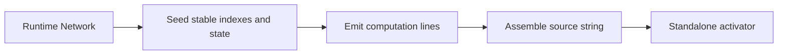

# architecture/network/standalone

Standalone code-generation boundary for turning a live `Network` into a
self-contained inference function.

This chapter exists for the moment when the graph has finished evolving or
training and the next question is no longer "how do I mutate it?" but "how
do I ship or inspect its forward pass without the whole runtime?" The
standalone generator answers by snapshotting node state, connection order,
gating terms, and activation functions into a plain JavaScript source string
that can be persisted, reviewed, or evaluated elsewhere.

The folder is intentionally split like a miniature compiler pipeline.
`setup` validates the network and seeds stable indexes, `graph` and `loop`
collect the execution lines, `activation` and `coverage` normalize emitted
function bodies, and `finalize` folds everything into the finished source
string. That keeps the README focused on the transformation stages instead
of a flat shelf of string helpers.



The important constraint is scope. The generated artifact is for forward
inference only. It keeps fixed weights, gating, and simple recurrent
self-connections, but it intentionally omits training-time randomness,
backpropagation, and any runtime machinery that requires the full library
around it.

Example: emit a portable source string and persist it with the rest of a
model package.

```ts
const source = network.standalone();
console.log(source.slice(0, 120));
```

Example: evaluate the emitted source in a sandbox and compare inference
results against the original runtime.

```ts
const source = network.standalone();
const activate = new Function(`return ${source}`)() as (
  input: number[],
) => number[];
const outputValues = activate([0.2, 0.8]);
```

## architecture/network/standalone/network.standalone.utils.ts

### generateStandalone

```ts
generateStandalone(
  net: default,
): string
```

Generate a standalone JavaScript source string that returns an `activate(input:number[])` function.

Implementation Steps:
 1. Validate presence of output nodes (must produce something observable).
 2. Assign stable sequential indices to nodes (used as array offsets in generated code).
 3. Collect initial activation/state values into typed array initializers for warm starting.
 4. For each non-input node, build a line computing S[i] (pre-activation sum with bias) and A[i]
    (post-activation output). Gating multiplies activation by gate activations; self-connection adds
    recurrent term S[i] * weight before activation.
 5. De-duplicate activation functions: each unique squash name is emitted once; references become
    indices into array F of function references for compactness.
 6. Emit an IIFE producing the activate function with internal arrays A (activations) and S (states).

Parameters:
- `net` - Network instance to snapshot.

Returns: Source string (ES5-compatible) – safe to eval in sandbox to obtain activate function.

## architecture/network/standalone/network.standalone.utils.setup.ts

### asStandaloneProps

```ts
asStandaloneProps(
  net: default,
): NetworkStandaloneProps
```

Reinterpret the runtime `Network` instance as the internal standalone
property surface used by generator setup utilities.

Parameters:
- `net` - Network instance to cast.

Returns: Internal network properties used by the standalone generator.

### createGenerationContext

```ts
createGenerationContext(
  standaloneProps: NetworkStandaloneProps,
): StandaloneGenerationContext
```

Allocate a fresh emit-pass context that accumulates node indexes, cached
activation sources, and generated body lines.

Parameters:
- `standaloneProps` - Internal standalone network view.

Returns: Generation context with precision, index buffers, and emission state.

### ensureOutputNodesExist

```ts
ensureOutputNodesExist(
  standaloneProps: NetworkStandaloneProps,
): void
```

Enforce the standalone precondition that at least one output node exists
before source generation proceeds.

Parameters:
- `standaloneProps` - Internal standalone network view.

Returns: Void.

### resolveInputNodeIndexes

```ts
resolveInputNodeIndexes(
  network: default,
): number[]
```

Resolve input-node indexes in public input-vector order.

Parameters:
- `network` - Runtime network being snapshotted.

Returns: Input-node indexes used when seeding generated activation buffers.

### resolveStandaloneActivationPrecision

```ts
resolveStandaloneActivationPrecision(
  standaloneProps: NetworkStandaloneProps,
): ActivationPrecision | undefined
```

Resolve standalone numeric precision by reconciling shared precision config
with the legacy `_activationPrecision` override.

Parameters:
- `standaloneProps` - Internal standalone network view.

Returns: Resolved activation precision for generated storage.

### resolveStandaloneExecutionMetadata

```ts
resolveStandaloneExecutionMetadata(
  network: default,
  generationContext: StandaloneGenerationContext,
): void
```

Resolve standalone execution metadata from the runtime activation contract.

The standalone generator should honor the same traversal order and public
input/output role order that runtime activation uses. That matters for delay
lines such as NARX memory blocks, where raw node storage order can differ
from the dependency order used during activation.

Parameters:
- `network` - Runtime network being snapshotted.
- `generationContext` - Mutable generation context receiving index metadata.

Returns: Void.

### seedNodeIndexesAndState

```ts
seedNodeIndexesAndState(
  generationContext: StandaloneGenerationContext,
): void
```

Stamp stable per-node indexes and snapshot initial activation/state buffers
used by emitted standalone runtime state.

Parameters:
- `generationContext` - Mutable generation context.

Returns: Void.

## architecture/network/standalone/network.standalone.utils.graph.ts

### appendGateMultiplier

```ts
appendGateMultiplier(
  generationContext: StandaloneGenerationContext,
  connectionTerm: string,
  gateNode: default | null,
): string
```

Append a gate activation multiplier to a connection term when a gate exists.

Parameters:
- `connectionTerm` - Base connection term.
- `gateNode` - Optional gate node.

Returns: Term with optional gate multiplier.

### buildNodeSumExpression

```ts
buildNodeSumExpression(
  generationContext: StandaloneGenerationContext,
  currentNode: default,
  nodeTraversalIndex: number,
): string
```

Build the generated pre-activation summation expression for one node.

The expression combines inbound weighted terms and optional recurrent
self-connection terms, then folds them into a single JavaScript expression
emitted into standalone network source.

Parameters:
- `generationContext` - Standalone code-generation context.
- `currentNode` - Current node.
- `nodeTraversalIndex` - Node index.

Returns: String expression used for generated `S[index]` assignment.

Example:

```ts
const sumExpression = buildNodeSumExpression(context, node, nodeIndex);
// Example output: "A[2] * 0.5 + S[4] * 0.9"
```

### buildStoredValueReadExpression

```ts
buildStoredValueReadExpression(
  generationContext: StandaloneGenerationContext,
  bufferName: "A" | "S",
  nodeIndex: number,
): string
```

Build one storage read expression for generated standalone buffers.

Parameters:
- `generationContext` - Mutable generation context.
- `bufferName` - Generated buffer variable name.
- `nodeIndex` - Indexed storage slot.

Returns: Native array read or float16 decode expression.

### collectIncomingTerms

```ts
collectIncomingTerms(
  generationContext: StandaloneGenerationContext,
  currentNode: default,
): string[]
```

Collect feed-forward inbound connection terms for a node.

Parameters:
- `currentNode` - Current node.

Returns: Weighted term expressions.

### collectOutputIndexes

```ts
collectOutputIndexes(
  generationContext: StandaloneGenerationContext,
): number[]
```

Collect the output-node index sequence used by generated return paths.

The returned array preserves traversal order so emitted output selectors map
consistently to the public standalone activation result vector.

Parameters:
- `generationContext` - Mutable generation context.

Returns: Output indexes used for result array emission.

Example:

```ts
const outputIndexes = collectOutputIndexes(context);
// outputIndexes can be passed to formatOutputArrayValues
```

### collectSelfConnectionTerms

```ts
collectSelfConnectionTerms(
  generationContext: StandaloneGenerationContext,
  currentNode: default,
  nodeTraversalIndex: number,
): string[]
```

Collect recurrent self-connection term for a node when present.

Parameters:
- `currentNode` - Current node.
- `nodeTraversalIndex` - Node index used for self-state reference.

Returns: Zero or one recurrent term expressions.

### foldTermsIntoExpression

```ts
foldTermsIntoExpression(
  allTerms: string[],
): string
```

Fold a term collection into a summation expression.

Parameters:
- `allTerms` - Term collection.

Returns: Summation expression or fallback zero literal.

### formatOutputArrayValues

```ts
formatOutputArrayValues(
  generationContext: StandaloneGenerationContext,
  outputIndexes: number[],
): string
```

Format output activation selectors for the generated return expression.

Each output index is translated into a storage-buffer read expression and
joined as a comma-separated selector list for emitted array literals.

Parameters:
- `generationContext` - Mutable generation context.
- `outputIndexes` - Output node indexes.

Returns: Comma-separated `A[index]` selector list.

Example:

```ts
const selectorList = formatOutputArrayValues(context, [3, 4]);
// Example output: "A[3],A[4]"
```

### getOptionalNodeIndex

```ts
getOptionalNodeIndex(
  nodeReference: default | null,
): number | undefined
```

Resolve optional generated node index from a node reference.

Parameters:
- `nodeReference` - Optional node reference.

Returns: Node index when available.

### mergeTermCollections

```ts
mergeTermCollections(
  firstTerms: string[],
  secondTerms: string[],
): string[]
```

Merge two term lists into a single ordered list.

Parameters:
- `firstTerms` - First term collection.
- `secondTerms` - Second term collection.

Returns: Combined term collection.

### resolveStandaloneBufferName

```ts
resolveStandaloneBufferName(
  bufferName: "A" | "S",
): "WA" | "WS"
```

Resolve the generated working-buffer variable name for one standalone buffer.

Parameters:
- `bufferName` - Persistent standalone storage name.

Returns: Working-buffer name used during one float16 activation call.

## architecture/network/standalone/network.standalone.utils.loop.ts

### appendActivationLine

```ts
appendActivationLine(
  generationContext: StandaloneGenerationContext,
  nodeTraversalIndex: number,
  activationFunctionIndex: number,
  maskValue: number,
): void
```

Append generated activation assignment line for one node.

Parameters:
- `generationContext` - Mutable generation context.
- `nodeTraversalIndex` - Node index.
- `activationFunctionIndex` - Function table index.
- `maskValue` - Multiplicative mask.

Returns: Void.

### appendAllNodeComputationLines

```ts
appendAllNodeComputationLines(
  generationContext: StandaloneGenerationContext,
): void
```

Append generated computation lines for all active non-input network nodes.

Parameters:
- `generationContext` - Mutable generation context.

Returns: Void.

### appendInputSeedLine

```ts
appendInputSeedLine(
  generationContext: StandaloneGenerationContext,
): void
```

Append the generated input-copy initialization loop to the standalone body.

Parameters:
- `generationContext` - Mutable generation context.

Returns: Void.

### appendOutputReturnLine

```ts
appendOutputReturnLine(
  generationContext: StandaloneGenerationContext,
  outputIndexes: number[],
): void
```

Append the final generated return statement for collected output activations.

Parameters:
- `generationContext` - Mutable generation context.
- `outputIndexes` - Output node indexes.

Returns: Void.

### appendSingleNodeComputationLines

```ts
appendSingleNodeComputationLines(
  generationContext: StandaloneGenerationContext,
  nodeTraversalIndex: number,
): void
```

Append state and activation lines for one node.

Parameters:
- `generationContext` - Mutable generation context.
- `nodeTraversalIndex` - Node index currently being emitted.

Returns: Void.

### appendStateLine

```ts
appendStateLine(
  generationContext: StandaloneGenerationContext,
  nodeTraversalIndex: number,
  sumExpression: string,
  biasValue: number,
): void
```

Append generated state assignment line for one node.

Parameters:
- `generationContext` - Mutable generation context.
- `nodeTraversalIndex` - Node index.
- `sumExpression` - Generated sum expression.
- `biasValue` - Node bias.

Returns: Void.

### buildMaskSuffix

```ts
buildMaskSuffix(
  maskValue: number,
): string
```

Build optional activation mask suffix for generated assignment line.

Parameters:
- `maskValue` - Multiplicative mask value.

Returns: Empty suffix for identity, otherwise multiplicative fragment.

### buildStoredValueReadExpression

```ts
buildStoredValueReadExpression(
  generationContext: StandaloneGenerationContext,
  bufferName: "A" | "S",
  nodeIndex: number,
): string
```

Build one storage read expression for generated standalone buffers.

Parameters:
- `generationContext` - Mutable generation context.
- `bufferName` - Generated buffer variable name.
- `nodeIndex` - Indexed storage slot.

Returns: Native read or float16 decode expression.

### buildStoredValueWriteStatement

```ts
buildStoredValueWriteStatement(
  generationContext: StandaloneGenerationContext,
  bufferName: "A" | "S",
  nodeIndex: number,
  valueExpression: string,
): string
```

Build one storage write statement for generated standalone buffers.

Parameters:
- `generationContext` - Mutable generation context.
- `bufferName` - Generated buffer variable name.
- `nodeIndex` - Indexed storage slot.
- `valueExpression` - Numeric expression being stored.

Returns: Native assignment or float16 encode statement.

### resolveStandaloneBufferName

```ts
resolveStandaloneBufferName(
  bufferName: "A" | "S",
): "WA" | "WS"
```

Resolve the generated working-buffer variable name for one standalone buffer.

Parameters:
- `bufferName` - Persistent standalone storage name.

Returns: Working-buffer name used during one float16 activation call.

## architecture/network/standalone/network.standalone.utils.activation.ts

### convertArrowToNamedFunction

```ts
convertArrowToNamedFunction(
  sourceCode: string,
  squashName: string,
): string
```

Convert an arrow-function source string into a named function declaration source.

Parameters:
- `sourceCode` - Arrow-function source.
- `squashName` - Required function name.

Returns: Named function source.

### ensureActivationFunctionIndex

```ts
ensureActivationFunctionIndex(
  generationContext: StandaloneGenerationContext,
  squashName: string,
  squashFunction: StandaloneSquashFunction,
  nodeTraversalIndex: number,
): number
```

Register an activation implementation once and return its stable index in the generated activation table.

Parameters:
- `generationContext` - Mutable generation context.
- `squashName` - Activation function name.
- `squashFunction` - Activation function implementation.
- `nodeTraversalIndex` - Current node index for fallback naming.

Returns: Activation function index within generated `F` array.

### ensureNamedFunctionSource

```ts
ensureNamedFunctionSource(
  sourceCode: string,
  squashName: string,
): string
```

Ensure generated function source starts with the required named signature.

Parameters:
- `sourceCode` - Function source.
- `squashName` - Required function name.

Returns: Named function source.

### normalizeArrowBody

```ts
normalizeArrowBody(
  bodySegment: string,
): string
```

Normalize an arrow body to a function-body block.

Preserves block bodies and wraps expression bodies with an explicit return
so generated standalone activation functions remain syntactically stable.

Parameters:
- `bodySegment` - Raw arrow body segment.

Returns: Function body block string.

### normalizeArrowParameters

```ts
normalizeArrowParameters(
  parameterSegment: string,
): string
```

Normalize arrow parameter segment into comma-separated parameter list content.

Parameters:
- `parameterSegment` - Raw arrow parameter segment.

Returns: Parameter list body (without surrounding parentheses).

### normalizeBuiltinSource

```ts
normalizeBuiltinSource(
  sourceCode: string,
  squashName: string,
): string
```

Normalize built-in activation source to a named function and strip coverage artifacts.

Parameters:
- `sourceCode` - Built-in function source.
- `squashName` - Required function name.

Returns: Cleaned named function source.

### normalizeCustomSource

```ts
normalizeCustomSource(
  sourceCode: string,
  squashName: string,
  nodeTraversalIndex: number,
): string
```

Normalize custom activation source with function/arrow/fallback handling.

Parameters:
- `sourceCode` - Custom function source.
- `squashName` - Required function name.
- `nodeTraversalIndex` - Current node index for traversal-context parity.

Returns: Cleaned named function source.

### registerActivationFunction

```ts
registerActivationFunction(
  generationContext: StandaloneGenerationContext,
  squashName: string,
  functionSource: string,
): void
```

Persist a normalized activation source and bind its name to the next generated activation index.

Parameters:
- `generationContext` - Mutable generation context.
- `squashName` - Activation function name.
- `functionSource` - Named function source to store.

### resolveActivationFunctionSource

```ts
resolveActivationFunctionSource(
  squashName: string,
  squashFunction: StandaloneSquashFunction,
  nodeTraversalIndex: number,
): string
```

Resolve standalone-ready activation source by preferring built-in snippets and normalizing custom bodies.

Parameters:
- `squashName` - Activation function name.
- `squashFunction` - Activation function implementation.
- `nodeTraversalIndex` - Current node index for fallback flow.

Returns: Named function source string.

### resolveBuiltinActivationSource

```ts
resolveBuiltinActivationSource(
  squashName: string,
): string | undefined
```

Resolve built-in activation snippets for both canonical and exported helper names.

Parameters:
- `squashName` - Activation function name.

Returns: Built-in activation source when known.

### resolveSquashName

```ts
resolveSquashName(
  currentNode: default,
  nodeTraversalIndex: number,
): string
```

Resolve a stable activation function identifier for standalone code emission.

Parameters:
- `currentNode` - Current node.
- `nodeTraversalIndex` - Node index for anonymous-name fallback.

Returns: Activation function identifier.

## architecture/network/standalone/network.standalone.utils.coverage.ts

### stripCoverage

```ts
stripCoverage(
  code: string,
): string
```

Remove coverage artifacts and formatting noise from generated function sources.

Parameters:
- `code` - Source text potentially containing coverage wrappers.

Returns: Cleaned source text suitable for deterministic standalone emission.

## architecture/network/standalone/network.standalone.utils.finalize.ts

### assembleStandaloneSource

```ts
assembleStandaloneSource(
  generationContext: StandaloneGenerationContext,
): string
```

Assemble the final standalone IIFE source string from the generation context.

Parameters:
- `generationContext` - Mutable generation context.

Returns: Final generated source string.

### buildActivationArrayLiteral

```ts
buildActivationArrayLiteral(
  generationContext: StandaloneGenerationContext,
): string
```

Build deterministic activation function array literal by function index ordering.

Parameters:
- `generationContext` - Mutable generation context.

Returns: Comma-separated activation function names.

### buildInitialBufferLiteral

```ts
buildInitialBufferLiteral(
  generationContext: StandaloneGenerationContext,
  bufferName: "A" | "S",
  values: number[],
): string
```

Build the array literal used to seed one generated storage buffer.

Parameters:
- `generationContext` - Mutable generation context.
- `values` - Initial numeric values for the buffer.

Returns: Literal values matching the generated storage precision.

### buildInputGuardLine

```ts
buildInputGuardLine(
  expectedInputSize: number,
): string
```

Build generated input length guard line.

Parameters:
- `expectedInputSize` - Required input vector size.

Returns: Guard statement line including trailing newline.

### buildPrecisionHelperSource

```ts
buildPrecisionHelperSource(
  generationContext: StandaloneGenerationContext,
): string
```

Build generated precision helper functions when standalone storage uses float16.

Parameters:
- `generationContext` - Mutable generation context.

Returns: Helper function source or an empty string for native precision paths.

### buildWorkingBufferBootstrapSource

```ts
buildWorkingBufferBootstrapSource(
  generationContext: StandaloneGenerationContext,
): string
```

Build working-buffer bootstrap lines for the float16 standalone path.

Parameters:
- `generationContext` - Mutable generation context.

Returns: Working-buffer setup lines or an empty string for native precision paths.

### encodeFloat16Value

```ts
encodeFloat16Value(
  value: number,
): number
```

Encode one JavaScript number into an unsigned float16 storage word.

Parameters:
- `value` - Numeric value being snapshotted into generated float16 storage.

Returns: Unsigned 16-bit integer containing IEEE 754 binary16 bits.

### resolveActivationBufferType

```ts
resolveActivationBufferType(
  generationContext: StandaloneGenerationContext,
): string
```

Resolve typed-array constructor name based on configured activation precision.

Parameters:
- `generationContext` - Mutable generation context.

Returns: Constructor name used in generated source.

## architecture/network/standalone/network.standalone.utils.types.ts

Output node type discriminator checked during standalone precondition validation to identify activation output targets.

### ACTIVATION_PRECISION_F16

Precision token that selects float16-backed Uint16 storage buffers for lower-memory standalone inference functions.

### ACTIVATION_PRECISION_F32

Precision token that selects Float32 typed-array activation and state buffers in the generated standalone function.

### ARROW_TOKEN

Arrow token detected during function-source normalization for stripping instrumentation from arrow-style squash functions.

### BUILTIN_ACTIVATION_SNIPPETS

Built-in activation function snippets emitted as named JavaScript declarations into self-contained standalone inference functions.

Values are intentionally compact so emitted standalone source remains deterministic and small.

### COVERAGE_CALL_REGEX

Regex that strips bare Istanbul cov_ function invocations left behind after counter removal.

### COVERAGE_COUNTER_REGEX

Regex that strips Istanbul statement, function, and branch counter increments from stringified activation source.

### COVERAGE_REPLACEMENT

Empty string replacement substituted when stripping Istanbul coverage instrumentation artifacts from function source.

### EMPTY_TOKEN_REGEX

Regex that removes lines containing only punctuation tokens left behind by instrumentation cleanup passes.

### FALLBACK_IDENTITY_BODY

Identity-function fallback body injected when a custom squash source cannot be normalized to a valid form.

### FLOAT32_ARRAY_TYPE

Float32Array constructor name emitted into generated standalone source for single-precision activation buffers.

### FLOAT64_ARRAY_TYPE

Float64Array constructor name emitted into generated standalone source for double-precision activation buffers.

### FUNCTION_PREFIX

Prefix token detected when normalizing stringified function sources before stripping instrumentation artifacts.

### INPUT_LOOP_LINE

Generated source line that copies the caller-supplied input array into the typed activation buffer at inference time.

### INVALID_INPUT_SIZE_ERROR_MIDDLE

Input-size validation middle fragment joining expected and actual counts in the generated activate guard message.

### INVALID_INPUT_SIZE_ERROR_PREFIX

Input-size validation prefix fragment emitted by the generated standalone activate guard at inference time.

### ISTANBUL_IGNORE_BLOCK_REGEX

Regex that strips Istanbul ignore-hint block comments from stringified activation functions before standalone emission.

### MASK_MULTIPLIER_IDENTITY

Multiplicative identity value used to detect and omit redundant gating mask expressions from generated standalone source.

### NO_OUTPUT_NODES_ERROR

Error thrown when standalone generation is attempted on a network that has no output nodes to emit.

### OUTPUT_NODE_TYPE

Output node type discriminator checked during standalone precondition validation to identify activation output targets.

### REPEATED_SEMICOLON_REGEX

Regex that collapses consecutive double-semicolons produced as coverage-stripping side effects in generated standalone source.

### SINGLE_TERM_FALLBACK

Fallback zero literal emitted into generated source when a node has no incoming weighted terms to sum.

### SOLITARY_SEMICOLON_REGEX

Regex that removes solitary semicolon lines left behind after Istanbul instrumentation removal passes.

### SOURCE_MAP_REGEX

Regex that strips sourceMappingURL comments from generated code snippets to keep standalone output clean.

### StandaloneSquashFunction

```ts
StandaloneSquashFunction(
  inputValue: number,
  derivate: boolean | undefined,
): number
```

Activation function signature expected by standalone source generation helpers when resolving custom squash callables.

### STRAY_COMMA_CLOSE_REGEX

Regex that normalizes stray commas adjacent to closing parentheses created by coverage stripping.

### STRAY_COMMA_OPEN_REGEX

Regex that normalizes stray commas adjacent to opening parentheses created by coverage stripping.

### UINT16_ARRAY_TYPE

Uint16Array constructor name emitted into generated standalone source for float16-backed state storage buffers.

## architecture/network/standalone/network.standalone.errors.ts

Raised when standalone generation is requested for a network without output nodes.

### buildStandaloneInputSizeMismatchErrorFactorySource

```ts
buildStandaloneInputSizeMismatchErrorFactorySource(): string
```

Build the named-error factory source emitted into generated standalone functions.

Returns: Deterministic JavaScript source for a named input-size mismatch error factory.

### NETWORK_STANDALONE_INPUT_SIZE_MISMATCH_ERROR_NAME

Stable error name string emitted into generated standalone function input guards.

### NetworkStandaloneNoOutputNodesError

Raised when standalone generation is requested for a network without output nodes.
