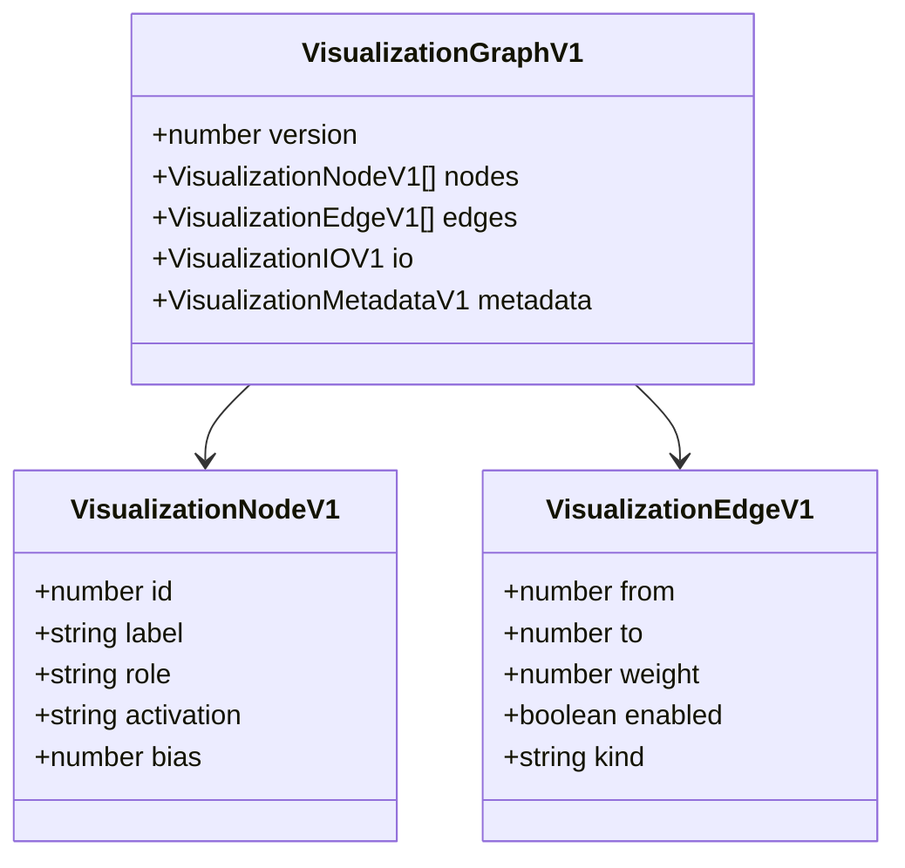

# architecture/network/visualization

Stable, versioned type contracts for network visualization export.

`VisualizationGraphV1` is the canonical data shape produced by
{@link exportVisualizationGraph}. Any renderer — canvas-based, terminal
ASCII, Graphviz DOT, or external tooling — can consume this shape without
knowing anything about NeatapticTS internals.

The schema is deliberately minimal but sufficient: nodes carry role and
activation metadata; edges carry weights, enable state, and an inferred
kind; `io` makes the I/O boundary explicit so renderers can highlight it
without re-detecting it.



## architecture/network/visualization/network.visualization.types.ts

### ExportVisualizationOptions

Options controlling which fields are included in the exported visualization graph.

All options default to `true` (maximum detail) unless explicitly set to `false`.

Example:

```ts
// Lightweight export: omit weights and biases for a large evolved network.
const graph = exportVisualizationGraph(network, {
  includeWeights: false,
  includeBiases: false,
});
```

### VisualizationEdgeV1

A single directed edge in a versioned visualization graph.

`from` and `to` are stable gene ids matching {@link VisualizationNodeV1.id}.

### VisualizationGraphV1

Versioned, deterministic graph schema for network visualization.

Produced by {@link exportVisualizationGraph}. Version `1` is the initial
stable shape; future breaking changes will increment the version field.

Example:

```ts
import { exportVisualizationGraph } from 'neataptic';

const graph = exportVisualizationGraph(network, { includeBiases: true });
console.log(graph.nodes.length, graph.edges.length);
// → 4 6
```

### VisualizationIOV1

Explicit I/O ordering for the visualization graph.

The arrays use stable gene ids and are ordered consistently so renderers
can highlight the I/O boundary and map external input/output indices.

### VisualizationMetadataV1

Optional metadata block attached to a {@link VisualizationGraphV1} export.

Carries a human-readable network name, a scheduling mode hint so renderers
can annotate recurrent edges correctly, and an ISO 8601 creation timestamp
for traceability in logging and checkpoint pipelines.

### VisualizationNodeV1

A single node entry in a versioned visualization graph.

`id` is the stable gene id (not a volatile runtime index), so it survives
serialization, crossover, and round-trips through evolution.

## architecture/network/visualization/network.visualization.ts

Network visualization export — public API surface.

This module provides two complementary export paths:

- {@link exportVisualizationGraph} — produces a stable, versioned JSON
  object (`VisualizationGraphV1`) that any renderer can consume without
  knowing NeatapticTS internals.
- {@link toDot} — converts a `VisualizationGraphV1` into a Graphviz DOT
  string that can be pasted into any DOT renderer to produce a visual graph.

## Design intent

The schema layer is intentionally renderer-agnostic. It produces data; it
does not draw anything. Rendering decisions (canvas, terminal, DOT, SVG) are
left to consumers. This makes the export path useful for:

- In-browser canvas renderers (e.g. an interactive demo panel).
- Terminal ASCII renderers (e.g. a maze-exploration demo).
- External visualization tools via the DOT helper.
- Debugging architectures in issues or docs.

## Determinism guarantee

For the same network state, `exportVisualizationGraph` always returns an
identical JSON structure. Nodes are sorted by stable gene id ascending;
edges are sorted by (from gene id, to gene id) ascending.

## Usage

```ts
import { exportVisualizationGraph, toDot } from 'neataptic';

// Full export with biases and weights.
const graph = exportVisualizationGraph(network);

// Lightweight export — omit weights and biases for a large population.
const compact = exportVisualizationGraph(network, {
  includeWeights: false,
  includeBiases: false,
});

// Render via Graphviz.
const dot = toDot(graph);
console.log(dot);
```

### exportVisualizationGraph

```ts
exportVisualizationGraph(
  network: default,
  options: ExportVisualizationOptions | undefined,
): VisualizationGraphV1
```

Exports a deterministic, versioned visualization graph from a live network.

The returned `VisualizationGraphV1` object is a plain JSON-serializable value
with no circular references. It can be passed to a canvas renderer, terminal
renderer, or serialized to disk.

**Ordering guarantees:**
- `nodes` are sorted by stable gene id ascending.
- `edges` are sorted by (from gene id, to gene id) ascending.
- `io.inputNodeIds` and `io.outputNodeIds` preserve the network's explicit
  I/O ordering (same as {@link Network.inputNodeIds} / {@link Network.outputNodeIds}).

Parameters:
- `network` - The network instance to export.
- `options` - Optional flags controlling which fields are included.

Returns: Versioned, deterministic visualization graph.

Example:

```ts
const graph = exportVisualizationGraph(network, { includeBiases: true });
// graph.version === 1
// graph.nodes[0].role === 'input'
// graph.edges[0].kind === 'forward'
```

### toDot

```ts
toDot(
  graph: VisualizationGraphV1,
): string
```

Converts a {@link VisualizationGraphV1} to a Graphviz DOT string.

The output can be pasted into any DOT renderer (e.g.
[Graphviz Online](https://dreampuf.github.io/GraphvizOnline/)) to produce
a visual graph diagram.

Node shapes:
- **Inputs** — inverted triangle (`invtriangle`).
- **Outputs** — double circle (`doublecircle`).
- **Hidden** — circle (`circle`).

Edge labels show weights when they are present in the graph.
Disabled edges are rendered as dashed lines.

Parameters:
- `graph` - Versioned visualization graph produced by  {@link exportVisualizationGraph} .

Returns: Graphviz DOT string.

Example:

```ts
const graph = exportVisualizationGraph(network);
const dot = toDot(graph);
// Paste `dot` into https://dreampuf.github.io/GraphvizOnline/
```

## architecture/network/visualization/network.visualization.utils.ts

Pure helper utilities for deterministic network visualization export.

These helpers are intentionally stateless and accept only primitive inputs so
they can be tested without constructing a full `Network` instance.

### buildNodePositionMap

```ts
buildNodePositionMap(
  sortedNodes: default[],
): Map<number, number>
```

Builds a lookup map from stable gene id to sorted positional index.

The sorted order is by gene id ascending, which is the same order used in
the exported `nodes` array. This map is used by {@link inferEdgeKind} to
detect backward (recurrent) edges without inspecting the full node list on
each call.

Parameters:
- `sortedNodes` - Node array already sorted by geneId ascending.

Returns: Map from geneId to zero-based position.

### collectSortedConnections

```ts
collectSortedConnections(
  connections: default[],
  includeDisabled: boolean,
): default[]
```

Collects and sorts a connection list for deterministic export.

Primary sort key: `from` gene id ascending.
Secondary sort key: `to` gene id ascending.

Parameters:
- `connections` - Flat connection list (regular + self-connections merged by caller).
- `includeDisabled` - Whether to retain disabled connections.

Returns: Sorted, optionally filtered connection array.

### connectionToVisualizationDescriptor

```ts
connectionToVisualizationDescriptor(
  connection: default,
  nodePositionByGeneId: Map<number, number>,
  includeWeight: boolean,
): VisualizationEdgeV1
```

Convert a runtime connection into the exported edge schema with deterministic edge-kind inference.

Parameters:
- `connection` - Source connection instance.
- `nodePositionByGeneId` - Sorted position lookup built by  {@link buildNodePositionMap} .
- `includeWeight` - Whether the emitted descriptor should preserve the runtime weight.

Returns: Immutable edge descriptor for the visualization schema.

### inferEdgeKind

```ts
inferEdgeKind(
  from: default,
  to: default,
  nodePositionByGeneId: Map<number, number>,
): "recurrent" | "forward" | "self"
```

Infers the edge kind for a directed connection.

- Returns `'self'` when source and target are the same node identity.
- Returns `'recurrent'` when the source node's stable position in the
  sorted node list comes **after** the target's position (backward edge).
- Returns `'forward'` otherwise.

Parameters:
- `from` - Source node.
- `to` - Target node.
- `nodePositionByGeneId` - Map from geneId to sorted position index.

Returns: Inferred connection kind.

### nodeToVisualizationDescriptor

```ts
nodeToVisualizationDescriptor(
  node: default,
  role: "hidden" | "input" | "output",
  includeBias: boolean,
): VisualizationNodeV1
```

Convert a runtime node into a deterministic visualization node descriptor.

Parameters:
- `node` - Source node instance.
- `role` - Resolved semantic role for this node.
- `includeBias` - Whether to include the bias field.

Returns: Immutable node descriptor for the visualization schema.

### resolveActivationName

```ts
resolveActivationName(
  squash: ((x: number, derivate?: boolean | undefined) => number) & { name?: string | undefined; },
): string
```

Infers the human-readable activation name from a squash function.

Falls back to `'unknown'` when the function reference does not expose a name.

Parameters:
- `squash` - Activation function attached to the node.

Returns: Name string, e.g. `'LOGISTIC'` or `'TANH'`.

### resolveNodeRole

```ts
resolveNodeRole(
  node: default,
  inputIdSet: Set<number>,
  outputIdSet: Set<number>,
): "hidden" | "input" | "output"
```

Resolve node role by explicit stable-id membership, defaulting to hidden for all remaining nodes.

Parameters:
- `node` - Node to classify.
- `inputIdSet` - Set of stable gene ids for input-role nodes.
- `outputIdSet` - Set of stable gene ids for output-role nodes.

Returns: `'input'`, `'output'`, or `'hidden'`.
