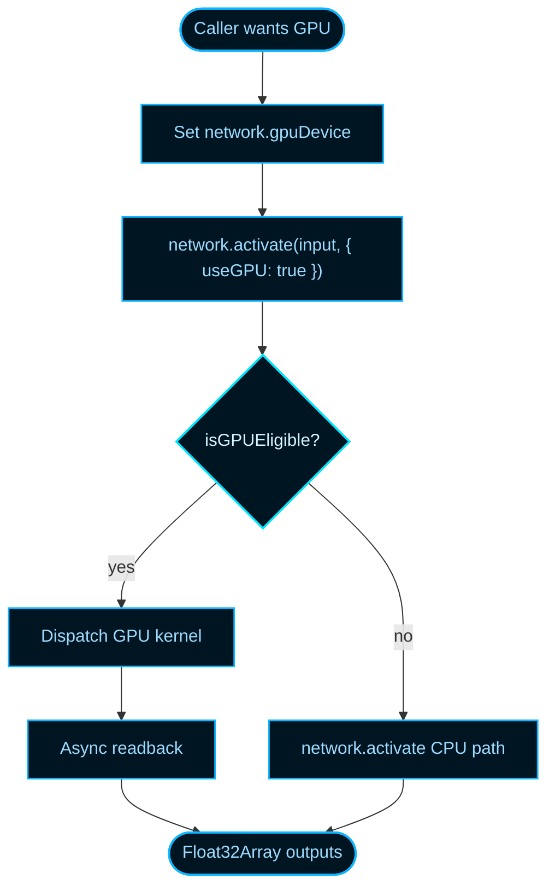

# WebGPU Inference Fast Path

NeatapticTS can offload eligible network forward passes to the GPU through the
[WebGPU API](https://en.wikipedia.org/wiki/WebGPU). The fast path is **opt-in
and transparent**: you ask for it, the library checks whether the network and
runtime can use it, and it falls back to the optimized CPU path whenever the GPU
path is unavailable or unsuitable. Classic NEAT behavior is unchanged unless you
explicitly enable the GPU device and the `useGPU` flag.

## When to Use the GPU Path

Use GPU inference when:

- The network runs in a browser or runtime with a working WebGPU adapter.
- The network is feed-forward with no gating or self-connections.
- All computation nodes use activation functions supported by the GPU kernel.
- You are scoring many genomes or running a long interactive demo where
  activation throughput matters.

Avoid the GPU path when:

- The network uses gating connections, recurrent self-connections, or
  unsupported activations.
- You need deterministic replay across machines; the CPU path is the canonical
  cross-platform reference.
- The network is very small; GPU upload and readback can cost more than the
  compute savings for tiny graphs.

## Opt-In Contract

GPU inference requires two explicit choices:

1. Attach a WebGPU device to the network via `network.gpuDevice`.
2. Pass `{ useGPU: true }` when calling `network.activate`.

If either choice is missing, the network uses the CPU path. This keeps existing
CPU-only code safe: omitting the flag or the device always falls back.



## Eligibility Rules

A network is eligible for the GPU path only when all of these hold:

- A usable WebGPU device is present and has not been lost.
- The network stores slab weights in `float32` (the default storage format).
- The network has no gating connections (`network.gates.length === 0`).
- The network has no self-connections (`network.selfconns.length === 0` and no
  connection where `from === to`).
- Every computation node uses an activation function whose worker-registry
  index is supported by the compiled GPU kernel.
- The estimated upload size fits within the device storage-buffer binding
  limits.

The module-local predicate `isGPUEligible(network, device)` performs the same
check inside the library. It is not exported from the package entry point, so
user code should rely on the automatic fallback rather than calling it
directly.

## Fallback Behavior

`network.activate` uses the CPU path automatically when:

- `useGPU` is omitted or `false`.
- `gpuDevice` is unset, `null`, or the device has been lost.
- `isGPUEligible` returns `false` for any reason.

Both paths return output values for the same nodes; the GPU overload returns a
`Promise<Float32Array>` because readback is asynchronous, while the CPU overload
returns `number[]` synchronously.

## CPU-vs-GPU Parity Contract

The GPU path is a performance optimization, not a separate numerical model.
The expected agreement between CPU and GPU outputs is:

- **Absolute tolerance:** `5e-1` per output value.
- **Mean absolute error:** `≤ 1e-1` across output values.

These bounds are intentionally wide because the CPU and GPU kernels evaluate the
same f32 expression in different operation orders, and GPU drivers may use
slightly different math-library approximations. The differences are usually far
smaller than the bounds, but the wide tolerance guarantees the GPU path stays
usable across devices without becoming a second reference implementation. For
deterministic replay, cross-machine validation, or regression tests, always use
the CPU path so the same seed produces identical results everywhere.

## Minimal Example

The example below builds a small feed-forward network, requests a WebGPU device,
and activates it on the GPU when possible. In Node or a browser without
WebGPU, the same code falls back to the CPU path.

```ts
import { Network, Architect } from '@reicek/neataptic-ts';

async function run() {
  // Build a simple eligible network.
  const network = new Architect.Perceptron(2, 4, 1);

  // Request a high-performance WebGPU device. Returns null where unavailable.
  const adapter = await navigator.gpu.requestAdapter({
    powerPreference: 'high-performance',
  });
  const device = await adapter?.requestDevice();
  network.gpuDevice = device ?? undefined;

  // Opt in to the GPU path. The call returns a Promise<Float32Array>.
  const output = await network.activate([0.5, -0.2], { useGPU: true });
  console.log(output); // [0.123...]
}

run();
```

If you already have a `GPUDevice` from your own WebGPU setup, assign it directly:

```ts
network.gpuDevice = device;
```

## Deterministic Replay

For reproducible experiments, keep the CPU path as the source of truth:

```ts
// Save/checkpoint with CPU activations so replay is identical across machines.
const checkpointOutput = network.activate([0.5, -0.2]); // CPU path
```

Use the GPU path for live evaluation and the CPU path for canonical scoring,
checkpointing, and regression tests.

## Browser smoke test

A real-browser parity check lives at
`docs/browser-tests/webgpu-inference-smoke.html`. After running
`npm run build:browser` and `npm start`, open
`http://localhost:8080/docs/browser-tests/webgpu-inference-smoke.html` to run a
2-3-1 MLP through both the CPU and GPU paths and verify the same tolerance
bounds. The page is hidden from generated public docs; see
[docs/browser-tests/README.md](./browser-tests/README.md) for the full
browser-test workflow and the `browser-testing-harness` skill for the agent
contract.

## Performance Notes

The GPU path is only a win for certain shapes and batch sizes. For a measured
breakdown of where time is spent on an NVIDIA RTX 4070, when the GPU beats the
CPU, and how the library routes workloads, see the
[WebGPU Performance Guide](./webgpu-performance-guide.md).

## See Also

- `src/architecture/network/gpu/` — implementation of the WebGPU activation
  seam, buffer upload, and kernel compilation.
- `src/architecture/network/network.ts` — `gpuDevice` property and
  `activate(..., { useGPU: true })` overloads.
- [Browser tests README](./browser-tests/README.md) — how to run hidden browser
  smoke scenarios, including the WebGPU inference smoke page.
- [WebGPU](https://en.wikipedia.org/wiki/WebGPU) on Wikipedia for background on
  the browser GPU compute API.
- [WebGPU Performance Guide](./webgpu-performance-guide.md) — measured
  overhead, optimization strategies, and CPU/GPU crossover analysis.
