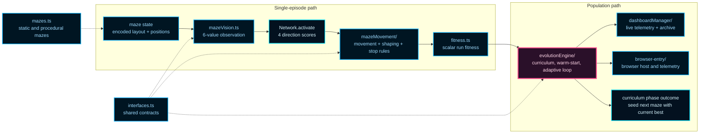

# ASCII Maze (NeatapticTS)

This folder is the repository's clearest answer to a different practical question from Flappy Bird: what should neuroevolution look like when the hard part is not reflex timing, but deliberate navigation under sparse rewards?

The example uses an ASCII maze, but the maze is not the whole point. The real point is to show how NeatapticTS handles compact perception, reward shaping, curriculum transfer, telemetry-rich evolution, and browser or terminal presentation without turning the whole exercise into a single opaque training loop.

If Flappy Bird is the repo's lesson in fast control systems, ASCII Maze is its lesson in disciplined decision-making.

This example is a good place to see several ideas meet cleanly: a tiny observation space, reward shaping that stays inspectable, curriculum transfer across harder mazes, and telemetry that makes long search runs legible.

It is also a strong demonstration of what a stable evolutionary contract buys a navigation task. Deterministic execution, replayable and exportable runs, explicit controller-level search overlays such as novelty or multiobjective ranking, and optional richer temporal structure all fit here without changing the example's central lesson.

## Why This Example Holds Up Under Longer Experiments

| Concept | Why it matters here |
| --- | --- |
| Compact perception | The policy has to reason from six values, so observation design stays visible instead of disappearing behind a huge sensor surface. |
| Deterministic and replayable runs | Sparse-goal search is hard to trust when every run feels different. Stable seeds and exportable state make comparisons, debugging, and regression checks easier to understand. |
| Explicit search overlays | Novelty, adaptive pressure, multiobjective ranking, and telemetry remain legible controller choices instead of being hidden inside the base network contract. |
| Optional richer structure | Recurrent or gated structure can be explored when navigation benefits from it, but the core lesson remains compact decision-making rather than architecture spectacle. |
| Curriculum transfer | The folder treats progression across harder mazes as part of the design, not as an afterthought bolted onto a single-run demo. |

## What This Folder Is Trying To Teach

This example is organized around four reader questions:

1. How small can the observation space stay before the policy stops being learnable?
2. How do you shape reward for a sparse-goal navigation problem without making the score meaningless?
3. How do you evolve through a curriculum of increasingly harder mazes without throwing away useful structure each phase discovered?
4. How do you make long-running search legible through dashboards, telemetry, and browser integration instead of waiting blindly for a lucky winner?

The folder matters because it treats those questions as one system. Perception, movement, scoring, curriculum evolution, and presentation are separate boundaries on purpose. That separation is what makes the example useful as a reference architecture rather than just a clever test.

The folder also raises one broader systems question: what makes a navigation demo trustworthy enough to reuse, replay, and extend rather than merely watch?

## Choose Your Route

Different readers arrive with different questions. Use the route that matches yours.

| If you want to... | Start here | Then read |
| --- | --- | --- |
| Run a maze evolution programmatically | [evolutionEngine.ts](./evolutionEngine.ts) | [evolutionEngine/README.md](./evolutionEngine/README.md), [asciiMaze.e2e.test.ts](./asciiMaze.e2e.test.ts) |
| Reuse the example from code | [index.ts](./index.ts) | [evolutionEngine.ts](./evolutionEngine.ts), [mazeUtils.ts](./mazeUtils.ts), [interfaces.ts](./interfaces.ts) |
| Understand how one agent episode works | [mazeMovement.ts](./mazeMovement.ts) | [mazeMovement/README.md](./mazeMovement/README.md), [fitness.ts](./fitness.ts) |
| Understand the browser demo and telemetry surface | [browser-entry/browser-entry.ts](./browser-entry/browser-entry.ts) or [index.html](./index.html) | [browser-entry.ts](./browser-entry.ts), [browser-entry/README.md](./browser-entry/README.md), [browser-entry/browser-entry.constants.ts](./browser-entry/browser-entry.constants.ts), [dashboardManager/README.md](./dashboardManager/README.md) |
| Tune reward shaping or progress semantics | [fitness.ts](./fitness.ts) | [mazeMovement/README.md](./mazeMovement/README.md), [mazeUtils.ts](./mazeUtils.ts) |
| Change curriculum, warm-start, or evolution policy | [evolutionEngine/README.md](./evolutionEngine/README.md) | [asciiMaze.e2e.test.ts](./asciiMaze.e2e.test.ts) |
| Understand the whole example as a system | this README | the module READMEs listed in [Recommended Reading Order](#recommended-reading-order) |

## Run The Example

From the repo root:

### Run the browser demo

```bash
npm run start:local-server
```

Then open:

- `http://localhost:8080/examples/asciiMaze/index.html`

Important note:

- `index.html` is a lightweight browser shell that loads the prebuilt demo bundle from `docs/assets`.
- if you want the real host orchestration source, start with [browser-entry/browser-entry.ts](./browser-entry/browser-entry.ts).
- after browser-code changes, run `npm run docs` or `npm run build:ascii-maze` before expecting the hosted page to reflect them.

### Browser host details worth knowing

The browser demo does two user-facing things that are easy to miss if you only
read the engine entrypoint.

First, the live maze panel is a host-owned teaching surface rather than a raw
engine dump. When a maze is solved, the browser host reveals the winning route
progressively from the start cell toward the exit before the next curriculum
phase begins. That makes the policy's route legible instead of replacing it
instantly with a fully solved board.

Second, the browser curriculum is intentionally easy to tune from one place.
If you want to make the hosted run start smaller, end bigger, grow faster, or
give each maze more movement budget, the first file to read is
[browser-entry/browser-entry.constants.ts](./browser-entry/browser-entry.constants.ts).

| Knob | What it changes | Why you would touch it |
| --- | --- | --- |
| `INITIAL_MAZE_DIMENSION` | first browser curriculum maze size | make the opening phase easier or more demanding |
| `MAX_MAZE_DIMENSION` | largest browser curriculum maze size | cap how far the hosted curriculum grows |
| `MAZE_DIMENSION_INCREMENT` | size jump between solved phases | make progression smoother or steeper |
| `AGENT_MAX_STEPS` | per-maze movement budget | give larger mazes more time or force shorter routes |

### Run the curriculum-style end-to-end example with logs

```bash
npm run test:e2e:logs
```

### Build the browser bundle directly

```bash
npm run build:ascii-maze
```

### Refresh docs and copied example assets

```bash
npm run docs
```

Node engine requirement in this repo is `>=22`.

## The Core Idea In One Glance

The architectural rule is simple: keep the policy input small, keep the simulation honest, keep the reward story inspectable, and keep long-running search observable.



Read the diagram as two connected stories:

- one network experiences one maze episode through perception, action, movement, and scoring,
- the evolution engine turns many such episodes into curriculum progress, telemetry, and next-phase seeding.

That split is the key to understanding why this folder teaches more than a single reward function ever could.

## What Each Boundary Protects

### `mazeVision.ts`: the policy's tiny sensor window

`MazeVision` compresses the maze into a six-value observation. That choice is deliberate. The example is not trying to win by giving the policy the whole map. It is trying to show how far a compact, carefully designed signal can go.

This boundary exists so observation design can evolve independently from movement rules, reward shaping, and UI code.

### `mazeMovement/`: one episode of decision-making

The movement boundary owns direction selection, movement legality, visit bookkeeping, shaping-sensitive runtime state, and episode finalization.

This is where a raw policy stops being abstract and starts paying for bad local decisions.

### `fitness.ts`: the reward story

The fitness layer turns one episode into a scalar score that the evolutionary loop can rank. In sparse-goal tasks, this layer matters enormously because a pure success/fail score often gives evolution too little gradient to learn from.

This boundary exists so reward design stays inspectable instead of getting buried in movement code.

### `evolutionEngine/`: curriculum and population policy

The evolution engine is the outer orchestration layer. It normalizes run options, prepares the maze environment, seeds or warms the population, runs the generation loop, applies adaptive dynamics, and interprets when a phase has succeeded well enough to move forward.

This boundary exists so curriculum logic, deterministic mode, scratch-buffer management, telemetry, and stopping behavior can stay coherent at the population level.

### `dashboardManager/`: make search visible

The dashboard boundary keeps long-running search understandable. It owns live summaries, archive views, telemetry snapshots, and redraw logic for browser and non-browser hosts.

This boundary exists because evolutionary search is much easier to trust when you can see trend lines, progress plateaus, and solved artifacts instead of only waiting for a final boolean.

### `browser-entry/`: the browser host

The browser entry boundary assembles host elements, telemetry fan-out, resize behavior, and curriculum execution for the browser demo. It does not own the evolution algorithm itself. It owns the host experience around it.

That host experience includes presentation-specific pacing decisions that would
be awkward inside the engine. The browser layer centers the maze inside the
live panel when space allows, reveals solved paths step-by-step before
continuing the curriculum, and keeps those choices outside the search loop so
the engine does not become DOM-aware.

That separation keeps the browser integration useful without making the engine depend on DOM concerns.

### `interfaces.ts`, `mazes.ts`, and the facade files: shared footing

The supporting files matter too.

- `interfaces.ts` keeps cross-cutting contracts stable while implementation ownership shifts across dedicated subfolders.
- `mazes.ts` provides both static scenarios and procedural generation.
- `asciiMaze.ts` and `index.ts` keep the example easier to import from the outside.

## Two Execution Stories

The same example tells two different runtime stories depending on where you enter.

### Evolution story

1. [evolutionEngine.ts](./evolutionEngine.ts) receives run options.
2. [evolutionEngine/README.md](./evolutionEngine/README.md) normalizes configuration, prepares the maze, creates or seeds NEAT state, and runs the generation loop.
3. [mazeMovement.ts](./mazeMovement.ts) simulates candidate episodes.
4. [fitness.ts](./fitness.ts) converts those episodes into comparable scores.
5. The engine updates telemetry, decides whether the current phase is solved, and either stops or advances the curriculum with the best network so far.

### Host story

1. [index.html](./index.html) or a programmatic caller starts the browser host.
2. [browser-entry.ts](./browser-entry.ts) exposes the stable `start(...)` surface.
3. [browser-entry/README.md](./browser-entry/README.md) wires host elements, telemetry hubs, and curriculum control.
4. [dashboardManager/README.md](./dashboardManager/README.md) keeps the run legible through live and archived summaries.
5. The host exposes a lifecycle handle for stop, status, completion, and telemetry consumption.

The important teaching point is that browser and test hosts are consumers of the engine, not hidden owners of the search loop.

## The Most Important Design Bets

Several design choices explain why this folder is shaped the way it is.

### A tiny observation space can still support interesting behavior

The policy sees only six values. That makes the network easier to evolve, but it also forces the designer to decide what information genuinely matters. The example is teaching observation design, not just maze solving.

### Reward shaping is necessary, but must stay interpretable

The example does not rely on success alone. It layers progress-sensitive shaping, exploration incentives, proximity-aware signals, and success or efficiency rewards. That helps learning, but the structure stays explicit enough to inspect and tune.

### Curriculum transfer is treated as a first-class workflow

The engine is designed to carry forward useful policy structure as mazes grow harder. That is why the example reads less like one isolated run and more like a sequence of related phases.

### Determinism and telemetry are educational tools, not just debugging extras

Deterministic mode, trend snapshots, and structured dashboard output make the system teachable. They let you compare runs, spot regressions, and understand plateaus with less guesswork.

### The engine stays orchestration-first

The public `EvolutionEngine` facade stays thin while the heavy work lives in dedicated helpers under `evolutionEngine/`. That is an architectural choice: the top-level reader sees the policy flow first and the hot-path machinery second.

## Observation And Reward Cheat Sheet

The policy is intentionally small enough to fit in your head.

### Inputs

`MazeVision` builds a six-value observation:

| Input | Meaning | Why it exists |
| --- | --- | --- |
| `compassScalar` | coarse direction toward the exit | Gives the policy a global hint without revealing the whole maze. |
| `openN` | whether North is traversable | Encodes immediate local affordance. |
| `openE` | whether East is traversable | Encodes immediate local affordance. |
| `openS` | whether South is traversable | Encodes immediate local affordance. |
| `openW` | whether West is traversable | Encodes immediate local affordance. |
| `progressDelta` | recent progress change toward the goal | Helps the policy distinguish movement that is productive from movement that merely changes position. |

### Outputs

The network emits four directional scores:

- North
- East
- South
- West

`MazeMovement` interprets those outputs into a chosen move and also records diagnostics such as entropy and saturation so the run is easier to inspect.

### Fitness ingredients

The score composes several ideas rather than one blunt scalar:

- base movement or progress score,
- exploration reward for newly visited cells,
- proximity-sensitive weighting near promising areas,
- success reward for reaching the exit,
- efficiency reward when the successful path is short relative to the maze's baseline geometry.

The goal is not to produce the prettiest formula. The goal is to make sparse-goal search learnable without hiding the tradeoffs.

## If You Want To Change Something, Read This First

This is the shortest route to the right boundary when you are modifying the example.

| Change goal | Read first | Why |
| --- | --- | --- |
| Change what the network sees | [mazeVision.ts](./mazeVision.ts) | Observation design lives here. |
| Change movement legality, action selection, or per-step shaping behavior | [mazeMovement/README.md](./mazeMovement/README.md) | The full episode runtime boundary lives here. |
| Change score composition | [fitness.ts](./fitness.ts) | Reward logic should stay explicit and separate from movement. |
| Change curriculum, warm-start, deterministic mode, or generation policy | [evolutionEngine/README.md](./evolutionEngine/README.md) | This is the population-policy layer. |
| Change dashboards or telemetry presentation | [dashboardManager/README.md](./dashboardManager/README.md) | Search visibility lives here. |
| Change browser lifecycle or embed API behavior | [browser-entry/README.md](./browser-entry/README.md) | The browser host surface lives here. |
| Change test-driven curriculum expectations | [asciiMaze.e2e.test.ts](./asciiMaze.e2e.test.ts) | This file shows the current end-to-end usage pattern. |

## Programmatic Starting Point

If you want to run the example from code instead of through the browser host, this is the smallest useful shape:

```ts
import { EvolutionEngine } from './evolutionEngine';
import { MazeGenerator } from './mazes';
import { DashboardManager } from './dashboardManager';
import { TerminalUtility } from './terminalUtility';

const dashboard = new DashboardManager(
  TerminalUtility.createTerminalClearer(),
  (...args) => console.log(...args),
);

const result = await EvolutionEngine.runMazeEvolution({
  mazeConfig: { maze: new MazeGenerator(24, 24).generate() },
  agentSimConfig: { maxSteps: 2000 },
  evolutionAlgorithmConfig: {
    popSize: 40,
    maxGenerations: 100,
    maxStagnantGenerations: 50,
    minProgressToPass: 95,
    allowRecurrent: true,
  },
  reportingConfig: {
    dashboardManager: dashboard,
    logEvery: 1,
    label: 'demo-24x24',
  },
});

console.log(result.exitReason, result.bestResult?.progress);
```

## Architecture Profiles

ASCII Maze supports the shared [example architecture profile contract](../architectureProfiles.ts) so population seeding can come from any approved builder family rather than only raw NEAT initialization.

Every fresh-start run seeds from the **MLP baseline profile by default**. You can override this by passing an explicit `architectureProfileId` through `evolutionAlgorithmConfig`.

```ts
const result = await EvolutionEngine.runMazeEvolution({
  mazeConfig: { maze: new MazeGenerator(24, 24).generate() },
  agentSimConfig: { maxSteps: 2000 },
  evolutionAlgorithmConfig: {
    popSize: 40,
    maxGenerations: 100,
    architectureProfileId: 'narx', // or 'mlp', 'gru', 'lstm'
  },
  reportingConfig: { dashboardManager: dashboard, logEvery: 1 },
});

console.log(result.architectureProfileId); // the profile that seeded the run
```

### Approved profiles for ASCII Maze

| Profile id | Family | Recurrent | Role |
| --- | --- | --- | --- |
| `mlp` | MLP | No | Baseline feed-forward reference. Dense connectivity from fixed 6-value observation to 4 directional outputs. |
| `narx` | NARX | Yes | Delay-line memory profile. Carries short-horizon sequences of inputs and outputs into hidden state without gating. Useful when position history helps navigation. |
| `gru` | GRU | Yes | Pedagogical gated-memory profile. Recurrent blocks learn what to keep and forget. Practical for tasks that benefit from longer-horizon internal state. |
| `lstm` | LSTM | Yes | Pedagogical gated-memory profile with explicit cell state. Structurally heavier than GRU but exposes the full gating vocabulary for teaching purposes. |

The `random-sparse` profile is not approved for this demo because the maze's compact six-value observation already constrains useful topology; sparse random connectivity is a better topological starting point for higher-dimensional control problems.

### Recurrent profile guidance

When you run a stateful profile (NARX, GRU, LSTM), the evolution engine already resets carried network state at the start of each rollout episode. You do not need to clear state manually inside the evolution loop. For curriculum runs, winner carry-over across phases preserves network weights but resets activation history at each new phase boundary.

```mermaid
flowchart LR
  classDef base fill:#08131f,stroke:#1ea7ff,color:#dff6ff,stroke-width:1px;
  classDef accent fill:#0f2233,stroke:#ffd166,color:#fff4cc,stroke-width:1.5px;

  Profile["architectureProfileId\n'mlp' | 'narx' | 'gru' | 'lstm'"]:::accent --> Builder["buildExampleArchitectureProfileNetwork\n(ascii-maze, profileId)"]:::base
  Builder --> Seed["seed network\ntemplate for NEAT population"]:::base
  Seed --> NEAT["Neat constructor\npopSize genomes derived from seed"]:::base
  NEAT --> Loop["generation loop\neach episode resets recurrent state"]:::base
  Loop --> Result["MazeEvolutionRunResult\n.architectureProfileId preserved"]:::accent
```



The resolved profile id is available on the returned `MazeEvolutionRunResult.architectureProfileId` field so curriculum orchestrators, telemetry consumers, and archive records can identify which builder family seeded the run.

## Safe Tuning Knobs

If you are teaching, benchmarking, or experimenting, these are usually the highest-value first changes:

1. `agentSimConfig.maxSteps` controls how much trajectory a policy gets before termination.
2. `evolutionAlgorithmConfig.popSize` trades compute cost for search breadth.
3. `evolutionAlgorithmConfig.maxGenerations` changes how patient the run is.
4. `evolutionAlgorithmConfig.minProgressToPass` changes how strict each curriculum phase is.
5. `lamarckianIterations` and `lamarckianSampleSize` adjust local supervised-style refinement pressure.
6. deterministic mode and seed settings make comparisons reproducible.

For deeper experiments:

- swap or tune the fitness evaluator,
- inspect movement penalties and rewards in the maze movement boundary,
- study dashboard telemetry trends rather than only final success states.

## Common Failure Modes

The most common ways to make this example confusing or brittle are practical, not exotic:

- a maze without `S` or `E` breaks setup because start or exit lookup cannot resolve,
- inconsistent row widths undermine encoding and path assumptions,
- overly harsh penalties can suppress exploration before the policy learns useful structure,
- very small `maxSteps` values on large mazes prevent meaningful trajectories,
- expecting fast convergence from a sparse-goal task leads to bad tuning decisions.

## Recommended Reading Order

If you want the cleanest ramp into the example, this order usually pays off:

1. this README for the system-level mental model,
2. [evolutionEngine/README.md](./evolutionEngine/README.md) for the outer training loop and curriculum policy,
3. [mazeMovement/README.md](./mazeMovement/README.md) for single-episode runtime behavior,
4. [fitness.ts](./fitness.ts) and [mazeVision.ts](./mazeVision.ts) for the observation and reward story,
5. [dashboardManager/README.md](./dashboardManager/README.md) for telemetry and live visibility,
6. [browser-entry/README.md](./browser-entry/README.md) for browser hosting and embed behavior,
7. [asciiMaze.e2e.test.ts](./asciiMaze.e2e.test.ts) for the current end-to-end usage pattern.

If you only care about one slice:

- compact policy design: start with `mazeVision.ts`, `mazeMovement.ts`, and `fitness.ts`,
- curriculum evolution: start with `evolutionEngine/`,
- browser or telemetry work: start with `browser-entry/` and `dashboardManager/`.

## Exercises For Curious Readers

If you want to use this folder as a lab rather than only as a demo, these experiments pay off quickly:

1. Remove one input from `MazeVision` and measure how much learning quality drops.
2. Reduce exploration reward and inspect whether the agent becomes more myopic or more stable.
3. Compare direct training on a harder procedural maze against phased curriculum transfer.
4. Fix a deterministic seed and compare outcomes while toggling one heuristic at a time.
5. Compare a winner before and after refinement to see what local supervised pressure actually improves.

## Why Start Here

Sparse-goal problems are where many neuroevolution demos become unconvincing. They either hide the scoring story, overfeed the policy with information, or offer too little telemetry to understand why a run worked.

This example matters because it does the opposite. It keeps the policy small, the reward story explicit, the evolutionary loop observable, and the host surfaces useful.

If you want one folder that shows how NeatapticTS approaches compact perception, curriculum transfer, and telemetry-rich search in a deliberate navigation task, this is the one.
