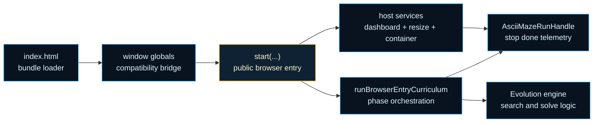
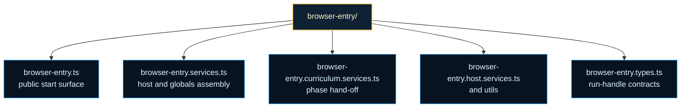

# browser-entry

Browser-hosted curriculum boundary for the ASCII Maze example.

This folder is where a long-running maze experiment becomes a browser
experience a human can actually steer and inspect. The evolution engine still
owns search, scoring, and curriculum advancement. The browser-entry boundary
owns host elements, resize behavior, telemetry fan-out, globals
compatibility, and the lifecycle handle that embedding code talks to.

The browser host also owns the parts of the experience that should feel
understandable to a human observer rather than merely correct to the engine.
When a phase solves a maze, this boundary reveals the winning path step by
step in the live panel before it lets the curriculum advance. That small
presentation delay matters because the browser demo is trying to teach route
discovery, not just report that a solved result existed.

Read it as a boundary between two clocks. One clock belongs to the maze
curriculum that carries refined winners into larger procedural mazes. The
other clock belongs to the browser host that has to paint dashboards, react
to cancellation, and stay polite to resize or unload events. `browser-entry/`
exists so those clocks can cooperate without collapsing into one monolithic
demo script.

That separation matters because `index.html` is intentionally thin. The page
only loads the published bundle from `docs/assets`, exposes a globals bridge,
and then hands off to this start surface. If you want the real host/runtime
seam, start here instead of with the HTML shell.

A second useful mental model is ownership. This folder does not own maze
fitness, winner refinement, or solve thresholds. Those stay in
`evolutionEngine/`. The host boundary owns container resolution, dashboard
plumbing, cooperative abort wiring, and the stable run handle that browser
callers can stop, await, or subscribe to.

The first tuning stop for the hosted curriculum is
`browser-entry.constants.ts`. That constants table controls the starting maze
size, maximum maze size, dimension increment between solved phases, and the
per-maze step budget. Read it as the host-facing control shelf for how the
browser curriculum should feel, while the deeper engine folders continue to
own how evolution itself works.

Read the chapter in three passes. Start with `browser-entry.ts` for the
public `start(...)` surface. Continue to `browser-entry.services.ts` for host
assembly, globals wiring, and curriculum hand-off. Finish with the constants,
curriculum, and host helper files when you want the browser-specific
mechanics rather than the public lifecycle contract.





For background reading on the cooperative stop side of the boundary, see
MDN, [AbortController](https://developer.mozilla.org/en-US/docs/Web/API/AbortController),
which is the browser primitive this entry layer uses to compose internal and
caller-provided cancellation without moving DOM concerns into the engine.

Example: boot the browser demo from embedding code and stop it later.

```ts
const handle = await start('ascii-maze-output');

setTimeout(() => handle.stop(), 5_000);
await handle.done;
```

Example: subscribe to telemetry while the curriculum advances.

```ts
const handle = await start('ascii-maze-output');
const unsubscribe = handle.onTelemetry((telemetry) => {
  console.log(telemetry.generation, telemetry.bestFitness);
});

await handle.done;
unsubscribe();
```

## browser-entry/browser-entry.types.ts

### AsciiMazeRunHandle

Public lifecycle handle returned by the browser demo entrypoint.

Example:

```ts
const handle = await start('ascii-maze-output');
const unsubscribe = handle.onTelemetry((telemetry) => {
  console.log('generation', telemetry.generation);
});

await handle.done;
unsubscribe();
```

### BrowserEntryCurriculumContext

State and callbacks used by the curriculum runtime service.

### BrowserEntryEvolutionSettings

Evolution settings used for a single procedural maze phase.

### BrowserEntryHostElements

Resolved host elements used by logger, dashboard, and resize services.

### BrowserEntryHostServices

Browser host services assembled for one running demo instance.

### BrowserEntryStartFunction

```ts
BrowserEntryStartFunction(
  container: string | HTMLElement | undefined,
  opts: BrowserEntryStartOptions | undefined,
): Promise<AsciiMazeRunHandle>
```

Stable callable shape used by globals compatibility wiring.

### BrowserEntryStartOptions

Options accepted by the browser-hosted ASCII Maze entrypoint.

### BrowserEntryTelemetryHub

Lightweight telemetry hub contract shared between host and public handle.

### RuntimeAbortSignal

Runtime AbortSignal shape used for older or polyfilled environments.

### RuntimeAbortSignalConstructor

AbortSignal constructor shape with optional static composition helpers.

### RuntimeWindow

Global namespace exposed for direct browser-script loading compatibility.

## browser-entry/browser-entry.ts

### AsciiMazeRunHandle

Public lifecycle handle returned by the browser demo entrypoint.

Example:

```ts
const handle = await start('ascii-maze-output');
const unsubscribe = handle.onTelemetry((telemetry) => {
  console.log('generation', telemetry.generation);
});

await handle.done;
unsubscribe();
```

### BrowserEntryStartFunction

```ts
BrowserEntryStartFunction(
  container: string | HTMLElement | undefined,
  opts: BrowserEntryStartOptions | undefined,
): Promise<AsciiMazeRunHandle>
```

Stable callable shape used by globals compatibility wiring.

### BrowserEntryStartOptions

Options accepted by the browser-hosted ASCII Maze entrypoint.

### start

```ts
start(
  container: string | HTMLElement,
  opts: BrowserEntryStartOptions,
): Promise<AsciiMazeRunHandle>
```

Start the browser-hosted ASCII Maze curriculum demo.

Parameters:
- `container` - Element id or host element for the browser demo.
- `opts` - Optional cooperative cancellation settings.

Returns: Lifecycle handle for stop, status, completion, and telemetry access.

Examples:

```ts
const handle = await start('ascii-maze-output');
handle.onTelemetry((telemetry) => console.log(telemetry));
await handle.done;
```

```ts
const abortController = new AbortController();
const handle = await start('ascii-maze-output', {
  signal: abortController.signal,
});

setTimeout(() => abortController.abort(), 1_000);
await handle.done;
```

## browser-entry/browser-entry.services.ts

Compatibility facade for the dedicated browser-entry service modules.

The concrete implementations now live in focused files so callers can keep
importing from this stable boundary while internals evolve independently.

### composeBrowserEntryAbortSignal

```ts
composeBrowserEntryAbortSignal(
  internalController: AbortController,
  externalSignal: AbortSignal | undefined,
): AbortSignal
```

Compose an internal and external abort signal into one cooperative signal.

Parameters:
- `internalController` - Internal controller owned by the browser run handle.
- `externalSignal` - Optional caller-provided signal.

Returns: A signal that aborts when either source aborts.

### createBrowserEntryEvolutionHostAdapter

```ts
createBrowserEntryEvolutionHostAdapter(
  input: { liveElement?: HTMLElement | null | undefined; runtimeWindow?: RuntimeWindow | null | undefined; },
): EvolutionHostAdapter
```

Create the browser-owned engine host adapter used for pause polling and solve notifications.

The adapter keeps three host-specific concerns outside the engine:

1. polling browser pause state,
2. running the solved-path reveal in the live maze panel,
3. dispatching a browser event only after the host-side reveal finishes.

That ordering is intentional. The engine decides that a maze is solved, but
the browser host decides how a human should see that solve.

Returns: Host adapter that keeps browser globals and DOM events out of engine internals.

### createBrowserEntryHostServices

```ts
createBrowserEntryHostServices(
  hostElements: BrowserEntryHostElements,
): BrowserEntryHostServices
```

Create the browser host services used by one ASCII Maze demo run.

Parameters:
- `hostElements` - Resolved host elements for live output, archive output, and resize observation.

Returns: Dashboard, telemetry hub, runtime dashboard adapter, and resize cleanup.

### installBrowserEntryGlobals

```ts
installBrowserEntryGlobals(
  start: BrowserEntryStartFunction,
  runtimeWindow: RuntimeWindow | null | undefined,
): void
```

Install browser globals and one-time auto-start compatibility hooks.

Parameters:
- `start` - Public browser entry function to expose on the window namespace.
- `runtimeWindow` - Optional runtime window override used by tests or embedding hosts.

Returns: Nothing.

### runBrowserEntryCurriculum

```ts
runBrowserEntryCurriculum(
  context: BrowserEntryCurriculumContext,
): void
```

Run the progressive browser curriculum across increasingly larger mazes.

Parameters:
- `context` - Runtime dashboard, cancellation, and completion callbacks for one browser session.

Returns: Nothing.

## browser-entry/browser-entry.constants.ts

Shared constants for the browser-hosted ASCII Maze demo lifecycle.

These values keep the browser entry facade declarative while the host,
resize, and curriculum services consume a single named configuration table.
Read them as three teaching-focused families rather than as an arbitrary bag
of numbers:

- curriculum ladder knobs such as `INITIAL_MAZE_DIMENSION`,
  `MAX_MAZE_DIMENSION`, and `MAZE_DIMENSION_INCREMENT`,
- per-phase runtime budgets such as `AGENT_MAX_STEPS`,
  `DEFAULT_MAX_GENERATIONS`, and stagnation limits,
- browser-host pacing settings such as auto-start delay and redraw debounce.

If you want the hosted demo to begin with smaller mazes, push farther into
larger ones, or spend more time inside each maze before a phase is judged,
this table is the intended first stop.

### BROWSER_ENTRY_CONSTANTS

Browser-hosted ASCII Maze curriculum knobs and host pacing defaults.

The most frequently tuned values are the maze-size ladder and the movement
budget. `INITIAL_MAZE_DIMENSION` decides where the browser curriculum begins,
`MAX_MAZE_DIMENSION` decides how far it can grow, `MAZE_DIMENSION_INCREMENT`
decides how abruptly solved phases get harder, and `AGENT_MAX_STEPS` decides
how much room each candidate gets to explore one maze.

Example:

```ts
const {
  INITIAL_MAZE_DIMENSION,
  MAX_MAZE_DIMENSION,
  MAZE_DIMENSION_INCREMENT,
  AGENT_MAX_STEPS,
} = BROWSER_ENTRY_CONSTANTS;
```

## browser-entry/browser-entry.host.services.ts

Browser host-service boundary for the ASCII Maze browser entry.

This module owns the DOM-facing dashboard wiring, telemetry fan-out, and
resize redraw behavior used by one browser-hosted ASCII Maze session.

### createBrowserEntryHostServices

```ts
createBrowserEntryHostServices(
  hostElements: BrowserEntryHostElements,
): BrowserEntryHostServices
```

Create the browser host services used by one ASCII Maze demo run.

Parameters:
- `hostElements` - Resolved host elements for live output, archive output, and resize observation.

Returns: Dashboard, telemetry hub, runtime dashboard adapter, and resize cleanup.

### createTelemetryHub

```ts
createTelemetryHub(): BrowserEntryTelemetryHub<TTelemetry>
```

Create a minimal telemetry hub backed by a Set of listeners.

Returns: A small hub optimized for browser demo listener counts.

### escapeHtml

```ts
escapeHtml(
  text: string,
): string
```

Escapes HTML special characters in a plain-text string.

Parameters:
- `text` - Input text.

Returns: HTML-safe string.

### hideTooltip

```ts
hideTooltip(
  tooltipElement: HTMLElement,
): void
```

Hides the tooltip element.

Parameters:
- `tooltipElement` - DOM tooltip div.

### installHoverTooltip

```ts
installHoverTooltip(
  canvasElement: HTMLCanvasElement | null,
  getHitAreas: () => MazeHitArea[],
  onHoverNodesChanged: (hoveredNodeIndices: readonly number[]) => void,
): { dispose: () => void; refresh: () => void; }
```

Installs mousemove and mouseleave handlers on the network canvas to show
educational hover tooltips above the current pointer position.

Parameters:
- `canvasElement` - Canvas element to attach listeners to.
- `getHitAreas` - Getter for the latest hit areas from the last render.

Returns: Cleanup function that removes the installed listeners.

### installResizeRedraw

```ts
installResizeRedraw(
  observeTarget: HTMLElement | null,
  runtimeDashboard: DashboardPresentationAdapter,
  redrawNetworkSnapshot: () => void,
): () => void
```

Attach dashboard redraw behavior to host resizes and return a cleanup function.

Parameters:
- `observeTarget` - Element whose width should trigger redraw checks.
- `runtimeDashboard` - Shared dashboard presentation adapter with redraw support.

Returns: Cleanup function that removes active observers or listeners.

### isVisualizationCompatibleNetwork

```ts
isVisualizationCompatibleNetwork(
  networkCandidate: INetwork,
): boolean
```

Guard that checks whether a runtime network can be exported as VisualizationGraphV1.

Parameters:
- `networkCandidate` - Runtime candidate from dashboard updates.

Returns: True when the candidate exposes required visualization fields.

### renderBrowserLiveMazeSnapshot

```ts
renderBrowserLiveMazeSnapshot(
  latestMaze: string[],
  latestResult: IMazeRunResult | undefined,
  clearLiveMazeOutput: () => void,
  writeLiveMazeLine: (...args: unknown[]) => void,
): void
```

Renders the current maze into the browser live pane without the terminal dashboard frame.

Parameters:
- `latestMaze` - Maze currently being evolved.
- `latestResult` - Latest run result used for path highlighting.
- `clearLiveMazeOutput` - Live-pane clear callback.
- `writeLiveMazeLine` - Live-pane line writer.

Returns: Nothing.

### renderLatestNetworkSnapshot

```ts
renderLatestNetworkSnapshot(
  networkCanvasElement: HTMLCanvasElement | null,
  networkCandidate: INetwork | null,
  hoveredNodeIndices: readonly number[],
): MazeHitArea[]
```

Render the latest evolved network into the dedicated browser canvas panel.

Returns hit areas from the render so the hover system can update without
a re-render on every pointer event.

Parameters:
- `networkCanvasElement` - Canvas target in the browser host.
- `networkCandidate` - Current best network candidate from dashboard updates.

Returns: Hit areas for hover tooltip testing, or empty array on failure.

### resetBrowserEntryHostPresentation

```ts
resetBrowserEntryHostPresentation(
  hostElements: BrowserEntryHostElements,
): void
```

Clears stale browser-host presentation state before a fresh session starts.

Parameters:
- `hostElements` - Resolved host elements for the current browser session.

Returns: Nothing.

### resolveHoveredHitArea

```ts
resolveHoveredHitArea(
  canvasX: number,
  canvasY: number,
  hitAreas: MazeHitArea[],
): MazeHitArea | undefined
```

Finds the first hit area that contains the given canvas-space point.

Parameters:
- `canvasX` - X coordinate in canvas backing-store pixels.
- `canvasY` - Y coordinate in canvas backing-store pixels.
- `hitAreas` - Hit areas from the last render pass.

Returns: First matching hit area, or undefined.

### resolvePointToAreaDistancePx

```ts
resolvePointToAreaDistancePx(
  canvasX: number,
  canvasY: number,
  hitArea: MazeHitArea,
): number
```

Resolves the shortest Euclidean distance from a point to a rectangle.

Parameters:
- `canvasX` - X coordinate in canvas pixels.
- `canvasY` - Y coordinate in canvas pixels.
- `hitArea` - Candidate hit area rectangle.

Returns: Distance from the point to the rectangle edge, or 0 for interior points.

### resolveTooltipHtml

```ts
resolveTooltipHtml(
  hitArea: MazeHitArea,
): string
```

Builds the inner HTML string for a tooltip from a hit area.

Parameters:
- `hitArea` - Source hit area.

Returns: Safe HTML string for the tooltip body.

### safelyRedrawDashboard

```ts
safelyRedrawDashboard(
  runtimeDashboard: DashboardPresentationAdapter,
): void
```

Safely request a dashboard redraw without letting host issues break the run.

Parameters:
- `runtimeDashboard` - Shared dashboard presentation adapter with optional redraw support.

### showTooltip

```ts
showTooltip(
  tooltipElement: HTMLElement,
  hitArea: MazeHitArea,
  clientX: number,
  clientY: number,
): void
```

Positions and reveals the tooltip element near the current pointer.

Parameters:
- `tooltipElement` - DOM tooltip div.
- `hitArea` - Hit area providing heading and body paragraphs.
- `clientX` - Pointer X in viewport coordinates.
- `clientY` - Pointer Y in viewport coordinates.

## browser-entry/browser-entry.abort.services.ts

Browser abort-composition service boundary for the ASCII Maze browser entry.

This leaf module isolates runtime-safe signal composition so browser-entry
orchestration can stay focused on lifecycle flow instead of platform quirks.

### composeBrowserEntryAbortSignal

```ts
composeBrowserEntryAbortSignal(
  internalController: AbortController,
  externalSignal: AbortSignal | undefined,
): AbortSignal
```

Compose an internal and external abort signal into one cooperative signal.

Parameters:
- `internalController` - Internal controller owned by the browser run handle.
- `externalSignal` - Optional caller-provided signal.

Returns: A signal that aborts when either source aborts.

## browser-entry/browser-entry.globals.services.ts

Browser globals-compatibility service boundary for the ASCII Maze browser entry.

This module isolates script-loader compatibility and guarded auto-start
behavior so runtime orchestration can stay focused on session lifecycle.

### createBrowserEntryEvolutionHostAdapter

```ts
createBrowserEntryEvolutionHostAdapter(
  input: { liveElement?: HTMLElement | null | undefined; runtimeWindow?: RuntimeWindow | null | undefined; },
): EvolutionHostAdapter
```

Create the browser-owned engine host adapter used for pause polling and solve notifications.

The adapter keeps three host-specific concerns outside the engine:

1. polling browser pause state,
2. running the solved-path reveal in the live maze panel,
3. dispatching a browser event only after the host-side reveal finishes.

That ordering is intentional. The engine decides that a maze is solved, but
the browser host decides how a human should see that solve.

Returns: Host adapter that keeps browser globals and DOM events out of engine internals.

### installBrowserEntryGlobals

```ts
installBrowserEntryGlobals(
  start: BrowserEntryStartFunction,
  runtimeWindow: RuntimeWindow | null | undefined,
): void
```

Install browser globals and one-time auto-start compatibility hooks.

Parameters:
- `start` - Public browser entry function to expose on the window namespace.
- `runtimeWindow` - Optional runtime window override used by tests or embedding hosts.

Returns: Nothing.

## browser-entry/browser-entry.worker-url.service.ts

Resolve the ASCII Maze evaluation worker bundle URL next to the browser bundle.

The demo build emits the browser bundle and the worker bundle side-by-side
under `docs/assets`. Resolving the worker relative to the active browser
bundle keeps the example portable across docs hosting and local static runs.

### resolveAsciiMazeEvaluationWorkerBundleUrl

```ts
resolveAsciiMazeEvaluationWorkerBundleUrl(): string
```

Resolve the ASCII Maze evaluation worker bundle URL next to the browser bundle.

The demo build emits the browser bundle and the worker bundle side-by-side
under `docs/assets`. Resolving the worker relative to the active browser
bundle keeps the example portable across docs hosting and local static runs.

Returns: Absolute URL string for `ascii-maze-evaluation.worker.bundle.js`.

## browser-entry/browser-entry.curriculum.services.ts

Browser curriculum-runtime service boundary for the ASCII Maze browser entry.

This module now owns browser-only curriculum progression concerns: dimension
scheduling, frame pacing, and lifecycle completion. Evolution-phase result
interpretation and winner carry-over refinement live behind the engine-owned
curriculum helper so browser-entry stays focused on host runtime behavior.

### resolvePhaseWarmStartNetwork

```ts
resolvePhaseWarmStartNetwork(
  context: BrowserEntryCurriculumContext,
  previousBestNetwork: INetwork | undefined,
): INetwork
```

Resolve a phase warm-start network.

Step 1: Reuse the previous phase winner when one is available.
Step 2: Otherwise seed the first phase with a deterministic profile-built
network so generation zero is less noisy than a pure cold start.

### runBrowserEntryCurriculum

```ts
runBrowserEntryCurriculum(
  context: BrowserEntryCurriculumContext,
): void
```

Run the progressive browser curriculum across increasingly larger mazes.

Parameters:
- `context` - Runtime dashboard, cancellation, and completion callbacks for one browser session.

Returns: Nothing.

## browser-entry/browser-entry.architecture-selector.services.ts

### createMazeArchitectureSelector

```ts
createMazeArchitectureSelector(
  containerElement: HTMLElement,
  selectedProfileId: ExampleArchitectureProfileId,
  onSelect: (profileId: ExampleArchitectureProfileId) => void,
  onReset: (() => void) | undefined,
): MazeArchitectureSelectorController
```

Render a Flappy-style architecture selector into the given container element.

Each button shows an educational hover tooltip describing the architecture
family. Clicking a button that is not currently selected calls `onSelect`
with the chosen profile id.

Parameters:
- `containerElement` - Element whose children will be replaced with the selector buttons.
- `selectedProfileId` - Initially selected architecture profile id.
- `onSelect` - Callback invoked with the newly selected profile id on click.
- `onReset` - Optional callback invoked when the current architecture should restart from scratch.

Returns: Controller for updating selected state and disabling the selector.

Example:

```ts
const controller = createMazeArchitectureSelector(
  document.querySelector('.arch-buttons'),
  'random-sparse',
  (profileId) => console.log('selected', profileId),
);
controller.setDisabled(true);
```

### MazeArchitectureSelectorController

Controller returned by {@link createMazeArchitectureSelector} for updating
selector state after the initial render.

### resolveTooltipBodyLines

```ts
resolveTooltipBodyLines(
  profile: ExampleArchitectureProfile,
): string[]
```

Resolve the educational tooltip body lines for one ASCII Maze architecture profile.

Parameters:
- `profile` - Architecture profile to describe.

Returns: Array of short explanatory sentences shown below the heading.

### resolveTooltipHeading

```ts
resolveTooltipHeading(
  profile: ExampleArchitectureProfile,
): string
```

Resolve the punchy tooltip heading for one ASCII Maze architecture profile.

Parameters:
- `profile` - Architecture profile to describe.

Returns: Short heading string shown above the tooltip body.

## browser-entry/browser-entry.solved-maze-animation.services.ts

Browser-hosted solved-maze reveal helpers.

The evolution engine knows when a maze is solved, but it should not own how
the browser celebrates or explains that moment. This small boundary turns a
solved path into a short teaching animation in the live maze panel: show the
start position first, then reveal one additional route step at a fixed host
cadence until the path reaches the exit, then hold for one final tick before
the curriculum advances.

That choice keeps the browser demo readable. A fully solved maze is useful as
a record, but a progressive reveal is better at teaching which corridor the
policy actually discovered.

### animateSolvedMazeInBrowserHost

```ts
animateSolvedMazeInBrowserHost(
  input: { liveElement: HTMLElement | null; maze: string[]; path?: readonly MazePathStep[] | undefined; },
): Promise<void>
```

Animate the solved path inside the browser live-output host.

The reveal sequence is deliberately simple:

1. render the maze with only the start cell active,
2. wait one host tick,
3. add one more solved-path step,
4. repeat until the exit is reached,
5. wait one final host tick before resolving.

Parameters:
- `input` - Live host element, maze layout, and solved path to reveal.

Returns: Promise that resolves after the full path and final pause complete.

Example:

```ts
await animateSolvedMazeInBrowserHost({
  liveElement,
  maze: ['S..E'],
  path: [
    [0, 0],
    [1, 0],
    [2, 0],
    [3, 0],
  ],
});
```

### SOLVED_MAZE_FRAME_DELAY_MS

Delay between solved-path animation frames in the browser host.

The same delay is also used for the final hold after the exit is reached, so
the viewer gets one extra beat before the next maze replaces the solved one.

## browser-entry/browser-entry.utils.ts

### createBrowserEvolutionSettings

```ts
createBrowserEvolutionSettings(
  dimension: number,
): BrowserEntryEvolutionSettings
```

Build immutable evolution settings for a single maze dimension.

This helper is the point where the browser curriculum's size ladder becomes
concrete runtime policy. The dimension passed in determines the generated
maze size, while `BROWSER_ENTRY_CONSTANTS` decides how much movement budget,
mutation assistance, and generational time each phase receives.

Parameters:
- `dimension` - Side length in cells for the procedural square maze.

Returns: Per-phase evolution settings consumed by the curriculum runtime.

### didSolveBrowserMaze

```ts
didSolveBrowserMaze(
  progress: unknown,
): boolean
```

Determine whether a reported progress value counts as solved for curriculum advancement.

Parameters:
- `progress` - Runtime progress emitted by the evolution layer.

Returns: Whether the maze phase should advance to the next dimension.

### getNextBrowserMazeDimension

```ts
getNextBrowserMazeDimension(
  currentDimension: number,
): number
```

Advance the procedural maze dimension without exceeding the configured maximum.

The increment and ceiling both come from `BROWSER_ENTRY_CONSTANTS`, so this
helper is the single-browser-entry answer to “how quickly do hosted mazes get
larger?”

Parameters:
- `currentDimension` - Current maze side length.

Returns: Next side length to use.

### resolveBrowserEntryHostElements

```ts
resolveBrowserEntryHostElements(
  container: string | HTMLElement,
): BrowserEntryHostElements
```

Resolve the browser host elements used by the demo logger and dashboard.

Parameters:
- `container` - Element id or host element provided by the caller.

Returns: Resolved host, archive, live, and resize-observer targets.

### scheduleBrowserEntryFrame

```ts
scheduleBrowserEntryFrame(
  callback: () => void,
): void
```

Schedule follow-up curriculum work on the next animation tick when possible.

Parameters:
- `callback` - Follow-up phase callback.
