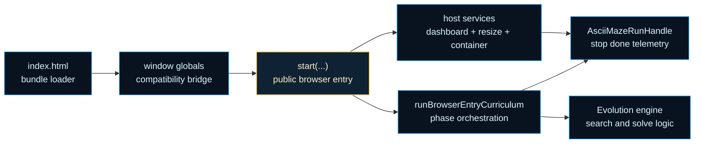
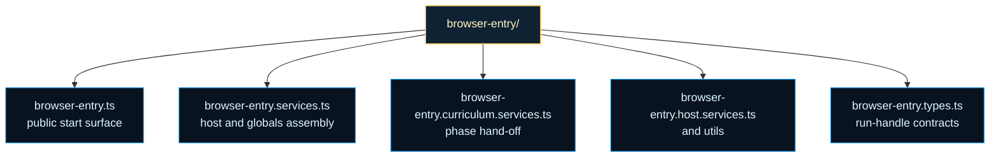

# browser-entry

Browser-hosted curriculum boundary for the ASCII Maze example.

This folder is where a long-running maze experiment becomes a browser
experience a human can actually steer and inspect. The evolution engine still
owns search, scoring, and curriculum advancement. The browser-entry boundary
owns host elements, resize behavior, telemetry fan-out, globals
compatibility, and the lifecycle handle that embedding code talks to.

Read it as a boundary between two clocks. One clock belongs to the maze
curriculum that carries refined winners into larger procedural mazes. The
other clock belongs to the browser host that has to paint dashboards, react
to cancellation, and stay polite to resize or unload events. `browser-entry/`
exists so those clocks can cooperate without collapsing into one monolithic
demo script.

That separation matters because `index.html` is intentionally thin. The page
only loads the published bundle from `docs/assets`, exposes a globals bridge,
and then hands off to this start surface. If you want the real host/runtime
seam, start here instead of with the HTML shell.

A second useful mental model is ownership. This folder does not own maze
fitness, winner refinement, or solve thresholds. Those stay in
`evolutionEngine/`. The host boundary owns container resolution, dashboard
plumbing, cooperative abort wiring, and the stable run handle that browser
callers can stop, await, or subscribe to.

Read the chapter in three passes. Start with `browser-entry.ts` for the
public `start(...)` surface. Continue to `browser-entry.services.ts` for host
assembly, globals wiring, and curriculum hand-off. Finish with the constants,
curriculum, and host helper files when you want the browser-specific
mechanics rather than the public lifecycle contract.





For background reading on the cooperative stop side of the boundary, see
MDN, [AbortController](https://developer.mozilla.org/en-US/docs/Web/API/AbortController),
which is the browser primitive this entry layer uses to compose internal and
caller-provided cancellation without moving DOM concerns into the engine.

Example: boot the browser demo from embedding code and stop it later.

```ts
const handle = await start('ascii-maze-output');

setTimeout(() => handle.stop(), 5_000);
await handle.done;
```

Example: subscribe to telemetry while the curriculum advances.

```ts
const handle = await start('ascii-maze-output');
const unsubscribe = handle.onTelemetry((telemetry) => {
  console.log(telemetry.generation, telemetry.bestFitness);
});

await handle.done;
unsubscribe();
```

## browser-entry/browser-entry.types.ts

### AsciiMazeRunHandle

Public lifecycle handle returned by the browser demo entrypoint.

Example:

```ts
const handle = await start('ascii-maze-output');
const unsubscribe = handle.onTelemetry((telemetry) => {
  console.log('generation', telemetry.generation);
});

await handle.done;
unsubscribe();
```

### BrowserEntryCurriculumContext

State and callbacks used by the curriculum runtime service.

### BrowserEntryEvolutionSettings

Evolution settings used for a single procedural maze phase.

### BrowserEntryHostElements

Resolved host elements used by logger, dashboard, and resize services.

### BrowserEntryHostServices

Browser host services assembled for one running demo instance.

### BrowserEntryStartFunction

```ts
BrowserEntryStartFunction(
  container: string | HTMLElement | undefined,
  opts: BrowserEntryStartOptions | undefined,
): Promise<AsciiMazeRunHandle>
```

Stable callable shape used by globals compatibility wiring.

### BrowserEntryStartOptions

Options accepted by the browser-hosted ASCII Maze entrypoint.

### BrowserEntryTelemetryHub

Lightweight telemetry hub contract shared between host and public handle.

### RuntimeAbortSignal

Runtime AbortSignal shape used for older or polyfilled environments.

### RuntimeAbortSignalConstructor

AbortSignal constructor shape with optional static composition helpers.

### RuntimeWindow

Global namespace exposed for direct browser-script loading compatibility.

## browser-entry/browser-entry.ts

### AsciiMazeRunHandle

Public lifecycle handle returned by the browser demo entrypoint.

Example:

```ts
const handle = await start('ascii-maze-output');
const unsubscribe = handle.onTelemetry((telemetry) => {
  console.log('generation', telemetry.generation);
});

await handle.done;
unsubscribe();
```

### BrowserEntryStartFunction

```ts
BrowserEntryStartFunction(
  container: string | HTMLElement | undefined,
  opts: BrowserEntryStartOptions | undefined,
): Promise<AsciiMazeRunHandle>
```

Stable callable shape used by globals compatibility wiring.

### BrowserEntryStartOptions

Options accepted by the browser-hosted ASCII Maze entrypoint.

### start

```ts
start(
  container: string | HTMLElement,
  opts: BrowserEntryStartOptions,
): Promise<AsciiMazeRunHandle>
```

Start the browser-hosted ASCII Maze curriculum demo.

Parameters:
- `container` - Element id or host element for the browser demo.
- `opts` - Optional cooperative cancellation settings.

Returns: Lifecycle handle for stop, status, completion, and telemetry access.

Examples:

```ts
const handle = await start('ascii-maze-output');
handle.onTelemetry((telemetry) => console.log(telemetry));
await handle.done;
```

```ts
const abortController = new AbortController();
const handle = await start('ascii-maze-output', {
  signal: abortController.signal,
});

setTimeout(() => abortController.abort(), 1_000);
await handle.done;
```

## browser-entry/browser-entry.services.ts

Compatibility facade for the dedicated browser-entry service modules.

The concrete implementations now live in focused files so callers can keep
importing from this stable boundary while internals evolve independently.

### composeBrowserEntryAbortSignal

```ts
composeBrowserEntryAbortSignal(
  internalController: AbortController,
  externalSignal: AbortSignal | undefined,
): AbortSignal
```

Compose an internal and external abort signal into one cooperative signal.

Parameters:
- `internalController` - Internal controller owned by the browser run handle.
- `externalSignal` - Optional caller-provided signal.

Returns: A signal that aborts when either source aborts.

### createBrowserEntryEvolutionHostAdapter

```ts
createBrowserEntryEvolutionHostAdapter(): EvolutionHostAdapter
```

Create the browser-owned engine host adapter used for pause polling and solve notifications.

Returns: Host adapter that keeps browser globals and DOM events out of engine internals.

### createBrowserEntryHostServices

```ts
createBrowserEntryHostServices(
  hostElements: BrowserEntryHostElements,
): BrowserEntryHostServices
```

Create the browser host services used by one ASCII Maze demo run.

Parameters:
- `hostElements` - Resolved host elements for live output, archive output, and resize observation.

Returns: Dashboard, telemetry hub, runtime dashboard adapter, and resize cleanup.

### installBrowserEntryGlobals

```ts
installBrowserEntryGlobals(
  start: BrowserEntryStartFunction,
): void
```

Install browser globals and one-time auto-start compatibility hooks.

Parameters:
- `start` - Public browser entry function to expose on the window namespace.

Returns: Nothing.

### runBrowserEntryCurriculum

```ts
runBrowserEntryCurriculum(
  context: BrowserEntryCurriculumContext,
): void
```

Run the progressive browser curriculum across increasingly larger mazes.

Parameters:
- `context` - Runtime dashboard, cancellation, and completion callbacks for one browser session.

Returns: Nothing.

## browser-entry/browser-entry.constants.ts

Shared constants for the browser-hosted ASCII Maze demo lifecycle.

These values keep the browser entry facade declarative while the host,
resize, and curriculum services consume a single named configuration table.

### BROWSER_ENTRY_CONSTANTS

Shared constants for the browser-hosted ASCII Maze demo lifecycle.

These values keep the browser entry facade declarative while the host,
resize, and curriculum services consume a single named configuration table.

## browser-entry/browser-entry.host.services.ts

Browser host-service boundary for the ASCII Maze browser entry.

This module owns the DOM-facing dashboard wiring, telemetry fan-out, and
resize redraw behavior used by one browser-hosted ASCII Maze session.

### createBrowserEntryHostServices

```ts
createBrowserEntryHostServices(
  hostElements: BrowserEntryHostElements,
): BrowserEntryHostServices
```

Create the browser host services used by one ASCII Maze demo run.

Parameters:
- `hostElements` - Resolved host elements for live output, archive output, and resize observation.

Returns: Dashboard, telemetry hub, runtime dashboard adapter, and resize cleanup.

### createTelemetryHub

```ts
createTelemetryHub(): BrowserEntryTelemetryHub<TTelemetry>
```

Create a minimal telemetry hub backed by a Set of listeners.

Returns: A small hub optimized for browser demo listener counts.

### escapeHtml

```ts
escapeHtml(
  text: string,
): string
```

Escapes HTML special characters in a plain-text string.

Parameters:
- `text` - Input text.

Returns: HTML-safe string.

### hideTooltip

```ts
hideTooltip(
  tooltipElement: HTMLElement,
): void
```

Hides the tooltip element.

Parameters:
- `tooltipElement` - DOM tooltip div.

### installHoverTooltip

```ts
installHoverTooltip(
  canvasElement: HTMLCanvasElement | null,
  getHitAreas: () => MazeHitArea[],
  onHoverNodesChanged: (hoveredNodeIndices: readonly number[]) => void,
): { dispose: () => void; refresh: () => void; }
```

Installs mousemove and mouseleave handlers on the network canvas to show
educational hover tooltips above the current pointer position.

Parameters:
- `canvasElement` - Canvas element to attach listeners to.
- `getHitAreas` - Getter for the latest hit areas from the last render.

Returns: Cleanup function that removes the installed listeners.

### installResizeRedraw

```ts
installResizeRedraw(
  observeTarget: HTMLElement | null,
  runtimeDashboard: DashboardPresentationAdapter,
  redrawNetworkSnapshot: () => void,
): () => void
```

Attach dashboard redraw behavior to host resizes and return a cleanup function.

Parameters:
- `observeTarget` - Element whose width should trigger redraw checks.
- `runtimeDashboard` - Shared dashboard presentation adapter with redraw support.

Returns: Cleanup function that removes active observers or listeners.

### isVisualizationCompatibleNetwork

```ts
isVisualizationCompatibleNetwork(
  networkCandidate: INetwork,
): boolean
```

Guard that checks whether a runtime network can be exported as VisualizationGraphV1.

Parameters:
- `networkCandidate` - Runtime candidate from dashboard updates.

Returns: True when the candidate exposes required visualization fields.

### renderLatestNetworkSnapshot

```ts
renderLatestNetworkSnapshot(
  networkCanvasElement: HTMLCanvasElement | null,
  networkCandidate: INetwork | null,
  hoveredNodeIndices: readonly number[],
): MazeHitArea[]
```

Render the latest evolved network into the dedicated browser canvas panel.

Returns hit areas from the render so the hover system can update without
a re-render on every pointer event.

Parameters:
- `networkCanvasElement` - Canvas target in the browser host.
- `networkCandidate` - Current best network candidate from dashboard updates.

Returns: Hit areas for hover tooltip testing, or empty array on failure.

### resolveHoveredHitArea

```ts
resolveHoveredHitArea(
  canvasX: number,
  canvasY: number,
  hitAreas: MazeHitArea[],
): MazeHitArea | undefined
```

Finds the first hit area that contains the given canvas-space point.

Parameters:
- `canvasX` - X coordinate in canvas backing-store pixels.
- `canvasY` - Y coordinate in canvas backing-store pixels.
- `hitAreas` - Hit areas from the last render pass.

Returns: First matching hit area, or undefined.

### resolvePointToAreaDistancePx

```ts
resolvePointToAreaDistancePx(
  canvasX: number,
  canvasY: number,
  hitArea: MazeHitArea,
): number
```

Resolves the shortest Euclidean distance from a point to a rectangle.

Parameters:
- `canvasX` - X coordinate in canvas pixels.
- `canvasY` - Y coordinate in canvas pixels.
- `hitArea` - Candidate hit area rectangle.

Returns: Distance from the point to the rectangle edge, or 0 for interior points.

### resolveTooltipHtml

```ts
resolveTooltipHtml(
  hitArea: MazeHitArea,
): string
```

Builds the inner HTML string for a tooltip from a hit area.

Parameters:
- `hitArea` - Source hit area.

Returns: Safe HTML string for the tooltip body.

### safelyRedrawDashboard

```ts
safelyRedrawDashboard(
  runtimeDashboard: DashboardPresentationAdapter,
): void
```

Safely request a dashboard redraw without letting host issues break the run.

Parameters:
- `runtimeDashboard` - Shared dashboard presentation adapter with optional redraw support.

### showTooltip

```ts
showTooltip(
  tooltipElement: HTMLElement,
  hitArea: MazeHitArea,
  clientX: number,
  clientY: number,
): void
```

Positions and reveals the tooltip element near the current pointer.

Parameters:
- `tooltipElement` - DOM tooltip div.
- `hitArea` - Hit area providing heading and body paragraphs.
- `clientX` - Pointer X in viewport coordinates.
- `clientY` - Pointer Y in viewport coordinates.

## browser-entry/browser-entry.abort.services.ts

Browser abort-composition service boundary for the ASCII Maze browser entry.

This leaf module isolates runtime-safe signal composition so browser-entry
orchestration can stay focused on lifecycle flow instead of platform quirks.

### composeBrowserEntryAbortSignal

```ts
composeBrowserEntryAbortSignal(
  internalController: AbortController,
  externalSignal: AbortSignal | undefined,
): AbortSignal
```

Compose an internal and external abort signal into one cooperative signal.

Parameters:
- `internalController` - Internal controller owned by the browser run handle.
- `externalSignal` - Optional caller-provided signal.

Returns: A signal that aborts when either source aborts.

## browser-entry/browser-entry.globals.services.ts

Browser globals-compatibility service boundary for the ASCII Maze browser entry.

This module isolates script-loader compatibility and guarded auto-start
behavior so runtime orchestration can stay focused on session lifecycle.

### createBrowserEntryEvolutionHostAdapter

```ts
createBrowserEntryEvolutionHostAdapter(): EvolutionHostAdapter
```

Create the browser-owned engine host adapter used for pause polling and solve notifications.

Returns: Host adapter that keeps browser globals and DOM events out of engine internals.

### installBrowserEntryGlobals

```ts
installBrowserEntryGlobals(
  start: BrowserEntryStartFunction,
): void
```

Install browser globals and one-time auto-start compatibility hooks.

Parameters:
- `start` - Public browser entry function to expose on the window namespace.

Returns: Nothing.

## browser-entry/browser-entry.curriculum.services.ts

Browser curriculum-runtime service boundary for the ASCII Maze browser entry.

This module now owns browser-only curriculum progression concerns: dimension
scheduling, frame pacing, and lifecycle completion. Evolution-phase result
interpretation and winner carry-over refinement live behind the engine-owned
curriculum helper so browser-entry stays focused on host runtime behavior.

### runBrowserEntryCurriculum

```ts
runBrowserEntryCurriculum(
  context: BrowserEntryCurriculumContext,
): void
```

Run the progressive browser curriculum across increasingly larger mazes.

Parameters:
- `context` - Runtime dashboard, cancellation, and completion callbacks for one browser session.

Returns: Nothing.

## browser-entry/browser-entry.utils.ts

### createBrowserEvolutionSettings

```ts
createBrowserEvolutionSettings(
  dimension: number,
): BrowserEntryEvolutionSettings
```

Build immutable evolution settings for a single maze dimension.

Parameters:
- `dimension` - Side length in cells for the procedural square maze.

Returns: Per-phase evolution settings consumed by the curriculum runtime.

### didSolveBrowserMaze

```ts
didSolveBrowserMaze(
  progress: unknown,
): boolean
```

Determine whether a reported progress value counts as solved for curriculum advancement.

Parameters:
- `progress` - Runtime progress emitted by the evolution layer.

Returns: Whether the maze phase should advance to the next dimension.

### getNextBrowserMazeDimension

```ts
getNextBrowserMazeDimension(
  currentDimension: number,
): number
```

Advance the procedural maze dimension without exceeding the configured maximum.

Parameters:
- `currentDimension` - Current maze side length.

Returns: Next side length to use.

### resolveBrowserEntryHostElements

```ts
resolveBrowserEntryHostElements(
  container: string | HTMLElement,
): BrowserEntryHostElements
```

Resolve the browser host elements used by the demo logger and dashboard.

Parameters:
- `container` - Element id or host element provided by the caller.

Returns: Resolved host, archive, live, and resize-observer targets.

### scheduleBrowserEntryFrame

```ts
scheduleBrowserEntryFrame(
  callback: () => void,
): void
```

Schedule follow-up curriculum work on the next animation tick when possible.

Parameters:
- `callback` - Follow-up phase callback.
