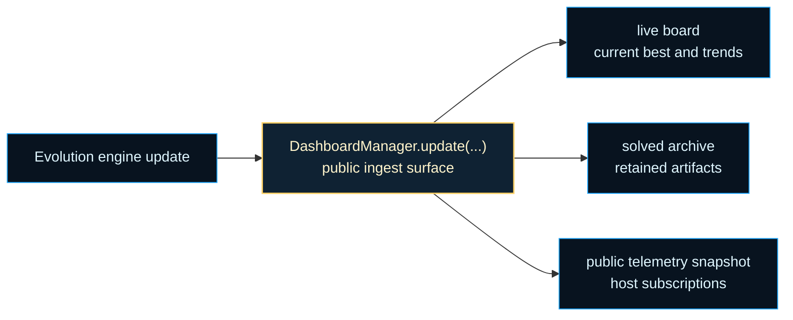
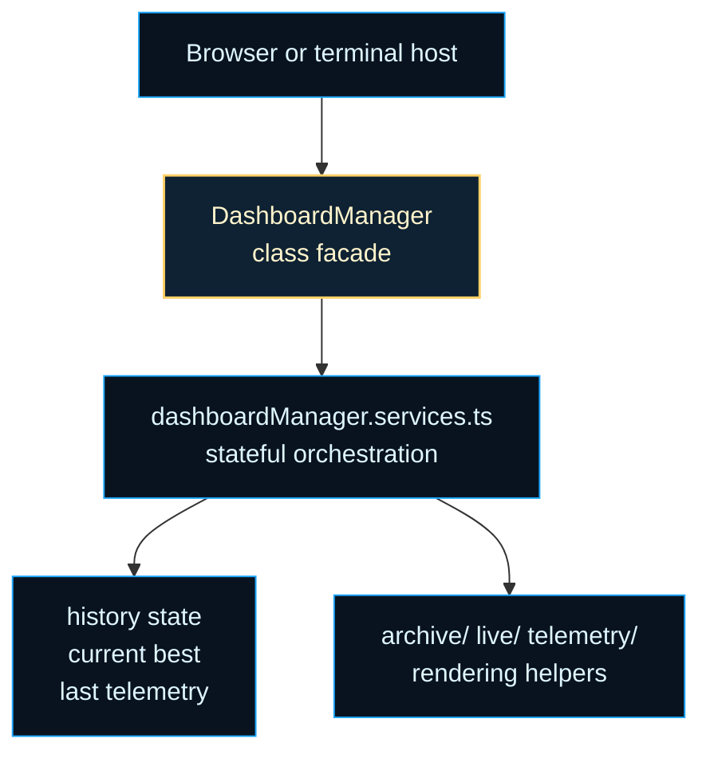

# dashboardManager

Search-visibility boundary for ASCII Maze browser and terminal hosts.

Evolution is difficult to trust when all you see is a final score. The
dashboard boundary turns per-generation updates into a live board, a solved
archive, and a reusable telemetry snapshot so long runs stay legible while
they are still happening.

That is why this folder exists as a separate boundary instead of staying
mixed into the engine. The engine should answer whether the search is making
progress. The dashboard should answer how a human can see that progress:
current best candidate, recent trends, species counts, complexity drift, and
solved artifacts worth preserving.

Read the folder as three cooperating shelves. The public `DashboardManager`
class keeps the stable host-facing API. `dashboardManager.services.ts`
handles update ingestion, redraws, and telemetry emission. The archive, live,
and telemetry subfolders keep presentation concerns decomposed so browser and
terminal hosts can reuse the same core state with different outputs.

The chapter matters because telemetry without presentation quickly becomes a
pile of numbers, while presentation without a stable telemetry contract
becomes fragile host-specific logic. This boundary keeps those concerns close
enough to cooperate and separate enough to evolve independently.

Read this chapter in three passes. Start with the class surface for the
public update, redraw, and snapshot methods. Continue to the service module
for the runtime dataflow. Finish in `archive/`, `live/`, and `telemetry/`
when you want the host-specific rendering details rather than the stable
dashboard contract.





Example: create one dashboard instance for a run and feed it updates.

```ts
const dashboard = new DashboardManager(clearOutput, logOutput, archiveOutput);

dashboard.update(maze, result, network, generation, neatInstance);
dashboard.redraw(maze, neatInstance);
```

Example: read the latest public telemetry snapshot after several updates.

```ts
const telemetry = dashboard.getLastTelemetry();

console.log(telemetry.generation);
console.log(telemetry.bestFitness);
```

## dashboardManager/dashboardManager.types.ts

### AsciiMazeComplexityStats

### AsciiMazeDetailedStats

Expanded telemetry details retained by the dashboard between redraws.

### AsciiMazeTelemetrySnapshot

Public telemetry snapshot surfaced to browser consumers.

### CurrentBestRecord

Latest best candidate used by live rendering and telemetry.

### DashboardArchiveFunction

```ts
DashboardArchiveFunction(
  args: unknown[],
): void
```

### DashboardClearFunction

```ts
DashboardClearFunction(): void
```

### DashboardHistoryState

Bounded numeric histories used for trends and exports.

### DashboardLogFunction

```ts
DashboardLogFunction(
  args: unknown[],
): void
```

### DashboardManagerContext

Shared runtime context passed into dashboard services.

### DashboardManagerState

Mutable runtime state owned by one dashboard instance.

### DashboardManagerUpdateArgs

Input accepted by the update orchestration service.

### DashboardPresentationAdapter

Shared presentation adapter used by browser and non-browser hosts.

### DashboardScratchState

Reused scratch arrays to keep redraw allocations predictable.

### DashboardTelemetry

Raw telemetry shape received from NEAT dashboard integrations.

### DashboardTelemetryHook

```ts
DashboardTelemetryHook(
  payload: DashboardTelemetryPayload,
): void
```

### DashboardTelemetryPayload

Telemetry payload emitted through events, postMessage, and runtime hooks.

### MutationStatsMap

### NeatGenome

NEAT genome/network with runtime properties used by dashboard telemetry.

### NeatInstance

NEAT instance shape needed by dashboard helpers.

### NeatSpecies

NEAT species collection entry surface used by dashboard telemetry.

### NumericTelemetryMap

### OperatorStatsEntry

Operator stats entry from NEAT.

### RuntimeDashboardManager

Compatibility alias for older runtime-facing imports.

### SolvedMazeRecord

Stored solved-maze archive entry.

## dashboardManager/dashboardManager.ts

### DashboardManager

Rich ASCII maze dashboard used by browser and terminal example hosts.

#### getLastTelemetry

```ts
getLastTelemetry(): AsciiMazeTelemetrySnapshot
```

Return the latest public telemetry snapshot, including rich detail history when available.

Returns: Latest dashboard telemetry snapshot.

#### logFunction

Optional log function exposed for engine-side safe-writer fallbacks.

#### redraw

```ts
redraw(
  currentMaze: string[],
  neat: unknown,
): void
```

Clear and repaint the live dashboard using the current best candidate and histories.

Parameters:
- `currentMaze` - Maze currently shown in the live panel.
- `neat` - Optional NEAT instance used to enrich stats.

#### reset

```ts
reset(): void
```

Clear archive, current best, and telemetry state so the instance can be reused.

#### update

```ts
update(
  maze: string[],
  result: IMazeRunResult | undefined,
  network: INetwork | null,
  generation: number,
  neatInstance: default | undefined,
): void
```

Ingest one evolution update, refresh the live dashboard, and emit telemetry.

Parameters:
- `maze` - Current maze layout.
- `result` - Latest run result for the tracked candidate.
- `network` - Candidate network used for the run.
- `generation` - Current generation number.
- `neatInstance` - Optional NEAT runtime used for advanced telemetry.

## dashboardManager/dashboardManager.services.ts

### applyDashboardUpdate

```ts
applyDashboardUpdate(
  context: DashboardManagerContext,
  args: DashboardManagerUpdateArgs,
): void
```

Ingest one engine update, refresh the live view, and emit external telemetry.

Parameters:
- `context` - Dashboard runtime context for state and output callbacks.
- `args` - Latest update payload from the evolution engine.

### getDashboardLastTelemetry

```ts
getDashboardLastTelemetry(
  state: DashboardManagerState,
): AsciiMazeTelemetrySnapshot
```

Produce the latest public telemetry snapshot from current dashboard state.

Parameters:
- `state` - Mutable dashboard state.

Returns: Public telemetry snapshot used by browser hosts.

### redrawDashboard

```ts
redrawDashboard(
  context: DashboardManagerContext,
  currentMaze: string[],
  neat: unknown,
): void
```

Repaint the live dashboard from current state and refresh the detailed snapshot.

Parameters:
- `context` - Dashboard runtime context for state and output callbacks.
- `currentMaze` - Maze currently being evolved.
- `neat` - Optional NEAT runtime instance used for detailed stats.

### resetDashboardState

```ts
resetDashboardState(
  state: DashboardManagerState,
): void
```

Clear retained archive, best-candidate, and history state for a fresh run.

Parameters:
- `state` - Mutable dashboard state to clear.

## dashboardManager/dashboardManager.constants.ts

Shared sizing, formatting, and top-N limits for the ASCII maze dashboard.

These values are kept in one place so rendering, archive output, and
telemetry helpers stay visually and semantically aligned.

### DASHBOARD_MANAGER_CONSTANTS

Shared sizing, formatting, and top-N limits for the ASCII maze dashboard.

These values are kept in one place so rendering, archive output, and
telemetry helpers stay visually and semantically aligned.

## dashboardManager/dashboardManager.utils.ts

### buildDashboardSparkline

```ts
buildDashboardSparkline(
  series: number[],
  width: number,
): string
```

Convert the recent tail of a numeric series into a compact sparkline.

Parameters:
- `series` - Numeric history in chronological order.
- `width` - Maximum sample count included in the sparkline.

Returns: Unicode sparkline string.

### computeDashboardPathMetrics

```ts
computeDashboardPathMetrics(
  maze: string[],
  result: Pick<IMazeRunResult, "path" | "steps" | "fitness">,
): { optimalLength: number; pathLength: number; efficiencyPct: string; overheadPct: string; uniqueCellsVisited: number; revisitedCells: number; totalSteps: number; fitnessValue: number; }
```

Compute solved-path efficiency and visitation metrics for archive output.

Parameters:
- `maze` - Maze layout containing start and exit markers.
- `result` - Run result with path, steps, and fitness.

Returns: Derived path metrics used by solved archive formatting.

### deriveDashboardArchitecture

```ts
deriveDashboardArchitecture(
  networkInstance: INetwork | null | undefined,
): string
```

Infer a compact architecture string from a network-like runtime object.

Parameters:
- `networkInstance` - Network instance from the maze example runtime.

Returns: Architecture string such as `6 - 8 - 4`, or `n/a` when unavailable.

### formatDashboardStat

```ts
formatDashboardStat(
  label: string,
  value: string | number,
  colorLabel: string,
  colorValue: string,
  labelWidth: number,
): string
```

Format a single framed dashboard stat line with aligned label and value columns.

Parameters:
- `label` - Descriptive stat label.
- `value` - String or number value displayed after the label.
- `colorLabel` - Color token applied to the label segment.
- `colorValue` - Color token applied to the value segment.
- `labelWidth` - Fixed width used for the label column.

Returns: Ready-to-log framed stat line.

### getDashboardMazeKey

```ts
getDashboardMazeKey(
  maze: string[],
): string
```

Build a lightweight dedupe key for a maze layout.

Parameters:
- `maze` - Maze rows in display order.

Returns: Joined maze key used by the solved archive.

### sliceDashboardHistoryForExport

```ts
sliceDashboardHistoryForExport(
  history: number[] | null | undefined,
): number[]
```

Return the recent export window of a bounded numeric history buffer.

Parameters:
- `history` - History buffer in chronological order.

Returns: Independent tail slice suitable for telemetry export.
