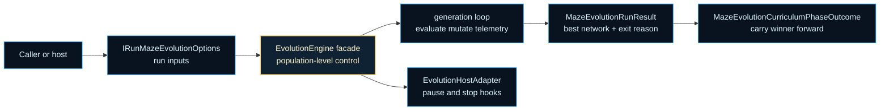
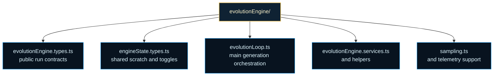

# evolutionEngine

Population-level runtime contracts for the ASCII Maze evolution engine.

This folder is where one maze, one fitness story, and one NEAT controller
turn into a repeatable training program. The public `EvolutionEngine` facade
uses these contracts to normalize options, coordinate host callbacks, keep
deterministic state reproducible, and decide when a curriculum phase has
produced a winner worth carrying forward.

The important distinction is scale. `mazeMovement/` explains one agent run.
`fitness.ts` explains how that run is scored. `dashboardManager/` explains
how progress is shown to a human. `evolutionEngine/` explains how many runs
across many generations become one population-level search loop with stop
reasons, telemetry, warm starts, and phase outcomes that the next maze can
reuse.

This file is the right chapter opening because it names the public nouns of
that loop before the reader hits pooled scratch buffers or hot-path helpers.
It answers four questions quickly: what a caller can configure, what a host
may observe or interrupt, what result the engine returns, and which shared
runtime contexts keep the hot path allocation-light.

A useful mental model is to treat the engine as a control tower rather than
the aircraft itself. The engine does not move the agent through one maze cell
at a time. It schedules phases, batches generations, preserves deterministic
state, and hands structured outcomes back to browser or terminal hosts.

Read the chapter in three passes. Start here for the public contracts and the
meaning of a run result. Continue to `engineState.types.ts` when you want the
shared scratch and toggle state that keeps the loop cheap. Finish with
`evolutionLoop.ts`, `evolutionEngine.services.ts`, and `sampling.ts` when you
want the actual orchestration and telemetry mechanics.





For background reading on the staged difficulty idea behind the browser and
curriculum-style runs, see Wikipedia contributors,
[Curriculum learning](https://en.wikipedia.org/wiki/Curriculum_learning),
which captures the broader teaching idea of solving easier tasks before
harder ones.

Example: describe the host adapter and reporting hooks the engine may call.

```ts
const hostAdapter: EvolutionHostAdapter = {
  isPauseRequested: () => window.asciiMazePaused === true,
  handleStop: ({ reason, completedGenerations }) => {
    console.log(reason, completedGenerations);
  },
};
```

Example: sketch one engine run configuration before execution begins.

```ts
const runOptions: IRunMazeEvolutionOptions = {
  mazeConfig: { maze },
  agentSimConfig: { maxSteps: 160 },
  evolutionAlgorithmConfig: { popSize: 120, deterministic: true },
  reportingConfig: { dashboardManager, logEvery: 5 },
};
```

## evolutionEngine/evolutionEngine.types.ts

### DistanceMap

Distance map for maze navigation.

### EncodedMaze

Encoded maze representation with cell values.

### EncodedMazeData

Encoded maze for simulation.

### EvolutionAdaptiveMutationConfig

Adaptive mutation tuning forwarded to the underlying NEAT runtime.

These knobs let host layers increase exploration pressure without needing to
know the internal controller implementation details. The ASCII Maze browser
curriculum uses this to make the first phase more willing to grow topology
when early generations stall.

### EvolutionEngineFacadeRuntimeState

Mutable runtime state owned by the public EvolutionEngine facade.

The extracted engine modules already share pooled buffers through
`engineState`. This narrower state exists only for the facade-specific
logits-ring bookkeeping that must survive across runs while keeping the
class boundary orchestration-first.

### EvolutionGenomeLike

Loose genome shape shared by engine telemetry and population-dynamics helpers.

### EvolutionHelpers

Helper functions object passed to evolution loop orchestration.

### EvolutionHostAdapter

Narrow host adapter used by the engine for pause polling and stop notifications.

Example:

```ts
const hostAdapter: EvolutionHostAdapter = {
  isPauseRequested: () => window.asciiMazePaused === true,
  handleStop: ({ reason }) => console.log('maze run stopped because', reason),
};
```

### EvolutionHostStopEvent

Host-facing stop event emitted by the engine when a run finishes for a concrete reason.

### EvolutionLoopHelpers

Helper functions for evolution.

### EvolutionLoopRuntimeContext

Shared runtime buffers and limits consumed by the evolution loop hot path.

This context keeps the loop and simulation helpers from passing a long list
of pooled ring buffers, scratch arrays, and capacity limits positionally.

### EvolutionLoopSupportContext

Shared scratch buffers and helper callbacks used across evolution-loop stages.

This context groups the scratch arrays and analysis helpers that travel
together through generation, simulation, and snapshot paths.

### EvolutionLoopTelemetryContext

Shared telemetry thresholds consumed by the evolution loop simulation pass.

The loop owns these switches conceptually, but grouping them as one context
keeps telemetry policy changes from widening hot-path function signatures.

### EvolutionOptions

Options object passed to evolution functions.

### EvolutionStopReason

Canonical stop reasons reported by the engine to host adapters.

### FileSystem

Node.js fs module type for file operations.

### IAgentSimulationConfig

Agent simulation configuration.

### IEvolutionAlgorithmConfig

Configuration options for the evolutionary algorithm used in the ASCII Maze demos.

### IMazeConfig

Maze configuration used by the ASCII Maze evolution helpers.

### IReportingConfig

Reporting configuration used to control logging, dashboard updates and UI pacing.

### IRunMazeEvolutionOptions

Main options for running a single maze-evolution experiment.

### LogitsRingState

Ring state for logits tracking.

### LoopHelpers

Loop helpers returned by prepareLoopHelpers.

### MazeDistanceMap

Distance map for pathfinding.

### MazeEvolutionCurriculumPhaseOutcome

Shared curriculum-facing summary derived from one completed evolution phase.

### MazeEvolutionRunResult

Stable result returned by `EvolutionEngine.runMazeEvolution()`.

### MazePosition

Position in maze.

### MutationOperationLike

Mutation-operation surface read from the NEAT driver at runtime.

The engine treats mutation operations as opaque descriptors because the
concrete driver owns how those operations are interpreted. The helpers only
need enough structure to cache, count, and hand them back into `mutate(...)`.

### NeatInstance

Type for Neat class instance from the neataptic library.

### NetworkConnection

Network connection representation used by engine-side runtime adaptation helpers.

### NetworkInstance

Type for Network class instance from the neataptic library.

### NetworkNode

Network node representation used by engine-side runtime adaptation helpers.

### PathModule

Node.js path module type.

### Position

2D position in maze coordinates.

### ProfilingAccumulators

Profiling accumulator structure.

### ScratchBundle

Scratch bundle containing reusable buffers.

### SimulationResult

Simulation result returned by generation evaluation helpers.

### SnapshotEntry

Snapshot entry for persistence.

### SpeciesHistoryHost

Static host used to read optional species-history state from the engine facade.

### TelemetryNeatLike

NEAT runtime shape needed by telemetry helpers that inspect the population.

The telemetry helpers intentionally ask for very little here: access to the
population plus optional telemetry export. That keeps them portable across the
engine's internal helpers without binding them to the full driver surface.

### TrackedNetworkInstance

Network instance annotated with telemetry fields during a generation.

### TrainingConstants

Training constants used by Lamarckian warm-start and refinement helpers.

## evolutionEngine/engineState.types.ts

Shared contracts for the ASCII Maze evolution engine subsystem.

The `evolutionEngine/` folder is where the public `EvolutionEngine` facade
fans out into the lower-level machinery that keeps long maze runs practical:
pooled scratch state, deterministic RNG caches, telemetry workspaces,
sampling helpers, warm-start support, and population-level recovery logic.

This file is the common footing for that subsystem. It defines the shared
state and scratch-buffer contracts that let the rest of the engine stay
allocation-light and orchestration-first instead of passing dozens of loose
arrays and counters through every hot-path helper.

### EngineProfilingState

Aggregated profiling configuration and accumulators shared across the evolution run.

### EngineScratchState

Centralised shared state for the ASCII maze evolution façade.

Responsibilities:
1. Define the scratch-buffer schema consumed by telemetry, population, and inspection helpers.
2. Expose runtime toggle state (`EngineToggleState`) that drives optional phases and telemetry density.
3. Provide factory and maintenance helpers (`createEngineState`, `initialiseTelemetryScratch`, `ensureVisitedHashCapacity`, `ensureRngCacheBatch`, `reseedRngState`) that size buffers and keep deterministic RNG state in sync.
4. Export the project-wide singleton `engineState` so extracted modules can share the façade’s pooled resources while still accepting injected state for testing.

Callers mutate the returned scratch instances in place to avoid per-generation allocations; higher-level modules should treat the helpers as the sole entry point for sizing or resetting shared buffers.

### EngineState

Shared engine state instance combining pooled scratch buffers with toggle flags.

### EngineToggleState

Runtime switches that adjust telemetry verbosity and optional training phases.

### RngCacheHandles

Handles returned after ensuring the RNG cache is ready for consumption.

### RngCacheParameters

Parameters controlling the RNG cache refill process.

### TelemetryScratchHandles

Collection of scratch buffers handed back after initialisation for convenience.

### TelemetryScratchRequest

Configuration describing which telemetry scratch buffers require capacity guarantees.

### VisitedHashScratchHandles

Handles exposed after ensuring the visited-coordinate hash table capacity.

## evolutionEngine/evolutionLoop.ts

Evolution Loop Module

Purpose:
-------
Provides utilities for running the main NEAT evolution loop, including
generation orchestration, cancellation checking, and loop helper preparation.

This module encapsulates:
 - Cancellation detection (AbortSignal and legacy cancellation API)
 - Loop helper preparation (frame flushing, persistence, logging)
 - Generation execution and orchestration
 - Stop condition evaluation

ES2023 Policy:
-------------
- Uses nullish coalescing `??` and optional chaining `?.`
- Descriptive variable names (no short identifiers)
- Async/await for generation loops
- Best-effort error handling (swallow non-fatal errors)

### checkCancellation

```ts
checkCancellation(
  options: EvolutionOptions,
  bestResult: IMazeRunResult | undefined,
): string | undefined
```

Inspect cooperative cancellation sources and annotate the provided result when cancelled.

This function checks for cancellation from two sources in priority order:
 1) Legacy cancellation object with `isCancelled()` method
 2) Standard AbortSignal with `aborted` property

Design Rationale:
 - Allocation-free (uses only short-lived local references)
 - Best-effort error handling (swallow exceptions to avoid disrupting loop)
 - Sets `exitReason` on result object for caller inspection
 - Safe to call on hot paths (no scratch buffers or pooling needed)

Cancellation Priority:
 1. Check `options.cancellation.isCancelled()` (legacy API)
 2. Check `options.signal.aborted` (standard AbortSignal)
 3. Return undefined if no cancellation detected

Parameters:

Parameters:
- `options` - Optional run configuration which may contain `cancellation` and/or `signal`
- `bestResult` - Optional mutable result object that will be annotated with `exitReason`

Returns: A reason string ('cancelled' | 'aborted') when cancellation is detected, otherwise `undefined`

Examples:

// Check cancellation before starting next generation
const cancelReason = checkCancellation(opts, runResult);
if (cancelReason) return cancelReason;

// Check cancellation without result annotation
if (checkCancellation(opts)) {
  console.log('User requested cancellation');
  break;
}

### checkStopConditions

```ts
checkStopConditions(
  bestResult: IMazeRunResult | undefined,
  bestNetwork: default | null,
  maze: string[],
  completedGenerations: number,
  neat: default,
  dashboardManager: IDashboardManager | undefined,
  flushToFrame: () => Promise<void>,
  hostAdapter: EvolutionHostAdapter | undefined,
  minProgressToPass: number,
  autoPauseOnSolve: boolean,
  stopOnlyOnSolve: boolean,
  stagnantGenerations: number,
  maxStagnantGenerations: number,
  maxGenerations: number,
): Promise<string | undefined>
```

Inspect common termination conditions and perform minimal, best-effort side-effects.

This function checks three canonical stop reasons in priority order:
 1) **Solved**: Best result achieves minimum progress threshold
 2) **Stagnation**: No improvement for maxStagnantGenerations
 3) **MaxGenerations**: Absolute generation cap reached

Design Rationale:
 - Allocation-light (uses only local references)
 - Best-effort error handling (all side effects swallowed)
 - Safe to call frequently on hot paths
 - Updates dashboard and yields to host when stopping
 - Emits optional 'asciiMazeSolved' event on solve (browser only)

Side Effects (Best-Effort):
 - Updates dashboard manager when stopping
 - Awaits flushToFrame to yield to host
 - Reports stop events through the optional host adapter
 - Annotates `bestResult.exitReason` with canonical reason string

Parameters:

Parameters:
- `bestResult` - Mutable run summary object (may be mutated with `exitReason`)
- `bestNetwork` - Network object associated with the best result (for dashboard)
- `maze` - Maze descriptor passed to dashboard updates/events
- `completedGenerations` - Current generation index (integer)
- `neat` - NEAT driver instance (passed to dashboard update)
- `dashboardManager` - Optional manager exposing `update(maze, result, network, gen, neat)`
- `flushToFrame` - Async function to yield to host renderer (e.g. requestAnimationFrame)
- `hostAdapter` - Optional host adapter that owns host-side stop behavior
- `minProgressToPass` - Numeric threshold to consider a run 'solved'
- `autoPauseOnSolve` - When truthy request host-side pause handling on solve
- `stopOnlyOnSolve` - When true ignore stagnation/maxGenerations as stop reasons
- `stagnantGenerations` - Current count of stagnant generations observed
- `maxStagnantGenerations` - Max allowed stagnant generations before stopping
- `maxGenerations` - Absolute generation cap after which the run stops

Returns: A canonical reason string ('solved'|'stagnation'|'maxGenerations') when stopping, otherwise `undefined`

Example:

// Check stop conditions after each generation
const reason = await checkStopConditions(
  bestResult, bestNet, maze, gen, neat, dashboard, flush,
  95, true, false, stagnant, 500, 10000
);
if (reason) {
  console.log('Stopping due to', reason);
  break;
}

### emitProfileSummary

```ts
emitProfileSummary(
  engineState: EngineState,
  safeWrite: (msg: string) => void,
  completedGenerations: number,
  totalEvolveMs: number,
  totalLamarckMs: number,
  totalSimMs: number,
  isProfilingDetailsEnabledFn: (state: EngineState) => boolean,
  getProfilingAccumulatorsFn: (state: EngineState) => ProfilingAccumulators,
): void
```

Emit a formatted profiling summary showing average per-generation timings.

This function prints a compact profiling summary with average millisecond timings
for the main evolution phases (evolve, Lamarckian training, simulation). If detailed
profiling is enabled, it also prints averages for telemetry, simplify, snapshot, and
prune operations.

Design Rationale:
 - Allocation-free (reuses pooled Float64Array for intermediate calculations)
 - Best-effort error handling (swallow all exceptions)
 - Defensive numeric validation with divide-by-zero guards
 - Conditional detailed profiling output

Calculation Steps:
 1. Validate and normalize generation count (guard divide-by-zero)
 2. Store totals in pooled scratch buffer (4-slot Float64Array)
 3. Compute per-generation averages by dividing totals by generation count
 4. Format numbers with 2 decimal places and print compact summary
 5. If detailed profiling enabled, print averaged detail line

Parameters:

Parameters:
- `engineState` - Shared engine state with scratch buffers and profiling accumulators
- `safeWrite` - Safe logging function (best-effort, never throws)
- `completedGenerations` - Number of completed generations (must be > 0)
- `totalEvolveMs` - Total milliseconds spent in NEAT evolve() calls
- `totalLamarckMs` - Total milliseconds spent in Lamarckian training
- `totalSimMs` - Total milliseconds spent in simulation
- `isProfilingDetailsEnabledFn` - Function to check if detailed profiling is enabled
- `getProfilingAccumulatorsFn` - Function to get detailed profiling accumulators

Example:

// Print averages after a run that completed 100 generations
emitProfileSummary(
  state, console.log, 100, 12000, 3000, 4500,
  isProfilingDetailsEnabled, getProfilingAccumulators
);

### EvolutionLoopResult

Evolution loop result

### GenerationOutcome

Generation outcome with profiling timings

### MutableMazeResult

Mutable result object with exitReason field

### persistSnapshotIfNeeded

```ts
persistSnapshotIfNeeded(
  engineState: EngineState,
  fs: { writeFileSync?: ((path: string, data: string) => void) | undefined; } | null,
  pathModule: { join?: ((...paths: string[]) => string) | undefined; } | null,
  persistDir: string | undefined,
  persistTopK: number,
  completedGenerations: number,
  persistEvery: number,
  neat: default,
  bestFitness: number,
  simplifyMode: boolean,
  plateauCounter: number,
  scratchSnapshotObj: Record<string, unknown>,
  scratchSnapshotTop: SnapshotEntry[],
  collectTelemetryTailFn: (state: EngineState, neat: default, count: number) => unknown,
  getSortedIndicesByScoreFn: (state: EngineState, population: default[]) => number[],
  isProfilingDetailsEnabledFn: (state: EngineState) => boolean,
  profilingStartTimestampFn: (state: EngineState) => number,
  accumulateProfilingDurationFn: (state: EngineState, label: string, duration: number) => void,
): void
```

Persist a population snapshot to disk at the configured interval.

This function writes a JSON snapshot of the current generation state when the
generation cadence aligns with the configured persistence interval. It captures
top-K genomes, telemetry tail, and metadata for later analysis or resume.

Design Rationale:
 - Best-effort semantics: swallows all errors to avoid disrupting evolution loop
 - Reuses pooled scratch objects (SCRATCH_SNAPSHOT_OBJ, SCRATCH_SNAPSHOT_TOP) to minimize allocations
 - Optional profiling when enabled (measures snapshot serialization time)
 - Defensive validation to ensure FS/path modules are available

Scheduling Logic:
 - Only persists when `completedGenerations % persistEvery === 0`
 - Requires valid fs.writeFileSync and pathModule.join functions
 - Requires non-empty population

Snapshot Structure:
 - generation: completed generation index
 - bestFitness: best fitness score this generation
 - simplifyMode: whether simplification was active
 - plateauCounter: current plateau detection counter
 - timestamp: Date.now() when snapshot was created
 - telemetryTail: last N telemetry entries
 - top: top-K genomes with minimal metadata (idx, score, nodes, connections, json)

Parameters:

Parameters:
- `engineState` - Shared engine state with scratch buffers and profiling
- `fs` - Node.js fs module or compatible FS API
- `pathModule` - Node.js path module or compatible path API
- `persistDir` - Directory path where snapshots should be written
- `persistTopK` - Number of top genomes to include in snapshot
- `completedGenerations` - Current generation index
- `persistEvery` - Generation interval for persistence (e.g., 25 = every 25th generation)
- `neat` - NEAT instance with population
- `bestFitness` - Best fitness score this generation
- `simplifyMode` - Whether simplification mode is active
- `plateauCounter` - Current plateau counter value
- `scratchSnapshotObj` - Pooled snapshot object (reused across calls)
- `scratchSnapshotTop` - Pooled top-K buffer (reused across calls)
- `collectTelemetryTailFn` - Function to collect telemetry tail from state
- `getSortedIndicesByScoreFn` - Function to get sorted genome indices
- `isProfilingDetailsEnabledFn` - Function to check profiling state
- `profilingStartTimestampFn` - Function to get profiling start time
- `accumulateProfilingDurationFn` - Function to accumulate profiling duration

Example:

// Persist snapshot every 25 generations
persistSnapshotIfNeeded(
  state, fs, path, './snapshots', 10, 50, 25, neat, 0.95, false, 3,
  scratchObj, scratchTop, collectTail, getSorted, isProfilingEnabled, profileStart, profileAccum
);

### prepareLoopHelpers

```ts
prepareLoopHelpers(
  opts: EvolutionOptions,
  scratchBundle: ScratchBundle,
): LoopHelpers
```

Build lightweight helpers used inside the evolution loop.

This function assembles the helper utilities needed by the main evolution loop:
 - Frame flushing for cooperative yielding
 - Persistence handles for snapshot saving (Node.js only)
 - Safe logging writer with fallback chain
 - Scratch buffer warm-up (best-effort)

Design Rationale:
 - All initialization is best-effort (failures swallowed)
 - Warms up common scratch buffers to reduce first-use allocation spikes
 - Returns simple POJO with utilities (no class coupling)
 - Side effects isolated to scratch bundle parameter

Scratch Buffer Warm-Up:
 - samplePool: Array for population sampling
 - profilingScratch: Float64Array(4) for timing accumulation
 - exps: Float64Array(64) for exponential computations

Parameters:

Parameters:
- `opts` - Normalized run options (contains persistDir and dashboardManager)
- `scratchBundle` - Engine scratch state for optional buffer warm-up

Returns: Object containing:
- flushToFrame: Async function for cooperative yielding
- fs: Node.js fs module (null in browsers)
- path: Node.js path module (null in browsers)
- safeWrite: Resilient logging function with fallback chain

Example:

// Prepare loop helpers with scratch buffer warm-up
const { flushToFrame, fs, path, safeWrite } = prepareLoopHelpers(opts, engineState.scratch);
safeWrite('Starting evolution...\n');
await flushToFrame(); // Yield to host

### resolvePeriodicDashboardSnapshot

```ts
resolvePeriodicDashboardSnapshot(
  bestResult: IMazeRunResult | undefined,
  bestNetwork: default | null,
  currentResult: IMazeRunResult | undefined,
  currentNetwork: default | null,
): { result: IMazeRunResult | undefined; network: default | null; }
```

Resolve which network snapshot the periodic dashboard should show.

Periodic refreshes should prefer the latest generation champion when one is
available so the browser view reflects ongoing topology exploration instead
of replaying the stale global best on every non-improving generation.

### runEvolutionLoop

```ts
runEvolutionLoop(
  engineState: EngineState,
  neat: default,
  opts: EvolutionOptions,
  lamarckianTrainingSet: { input: number[]; output: number[]; }[],
  encodedMaze: number[][],
  startPosition: readonly [number, number],
  exitPosition: readonly [number, number],
  distanceMap: number[][],
  helpers: LoopHelpers,
  doProfile: boolean,
  runtimeContext: EvolutionLoopRuntimeContext,
  initialRingState: LogitsRingState,
  telemetryContext: EvolutionLoopTelemetryContext,
  supportContext: EvolutionLoopSupportContext,
  constants: TrainingConstants & { DEFAULT_TRAIN_BATCH_LARGE: number; FITTEST_TRAIN_ITERATIONS: number; TELEMETRY_MINIMAL: boolean; SATURATION_PRUNE_THRESHOLD: number; RECENT_WINDOW: number; REDUCED_TELEMETRY: boolean; DISABLE_BALDWIN: boolean; },
): Promise<EvolutionLoopResult>
```

Internal evolution loop that executes generations until a stop condition or cancellation.

Behaviour & contract:
 - Runs generations in a resilient, best-effort manner; internal errors are swallowed
   so a single failure cannot abort the whole run.
 - When `doProfile` is truthy the loop accumulates timing into a pooled Float64Array
   to avoid per-iteration allocations. The pooled buffer is reused across calls.
 - The helper performs side-effects (dashboard updates, persistence) in a non-fatal
   fashion and yields to the host when requested via `helpers.flushToFrame`.

Parameters:
- `engineState` - Shared engine state with scratch buffers and configuration
- `neat` - NEAT driver instance used to perform evolution and mutation operations
- `opts` - Normalised run options (produced by normalizeRunOptions)
- `lamarckianTrainingSet` - Optional supervised training cases used for Lamarckian warm-start
- `encodedMaze` - Encoded maze representation consumed by simulators
- `startPosition` - Start coordinates for the simulated agent
- `exitPosition` - Exit coordinates for the simulated agent
- `distanceMap` - Optional precomputed distance map to speed simulation
- `helpers` - Helper utilities: { flushToFrame, fs, path, safeWrite }
- `doProfile` - When truthy collect and return millisecond timings in the result
- `runtimeContext` - Shared pooled ring buffers and limits for the hot path.
- `initialRingState` - Current mutable ring state for this run.
- `telemetryContext` - Telemetry thresholds and verbosity switches used during simulation.
- `supportContext` - Shared scratch buffers and helper callbacks used by the loop.
- `constants` - Object containing all engine constants (DEFAULT_TRAIN_ERROR, etc.)

Returns: Promise resolving to an object:
{ bestNetwork, bestResult, neat, completedGenerations, totalEvolveMs, totalLamarckMs, totalSimMs, updatedRingState }

Example:

const runSummary = await runEvolutionLoop(
  state, neat, opts, trainingSet, maze, start, exit, distMap, helpers, true, ...
);

### runGeneration

```ts
runGeneration(
  engineState: EngineState,
  neat: default,
  doProfile: boolean,
  lamarckianIterations: number,
  lamarckianTrainingSet: { input: number[]; output: number[]; }[],
  lamarckianSampleSize: number | undefined,
  safeWrite: (msg: string) => void,
  completedGenerations: number,
  dynamicPopEnabled: boolean,
  dynamicPopMax: number,
  plateauGenerations: number,
  plateauCounter: number,
  dynamicPopExpandInterval: number,
  dynamicPopExpandFactor: number,
  dynamicPopPlateauSlack: number,
  speciesHistoryRef: number[],
  emptyVec: default[],
  scratchNodeIdx: Int32Array<ArrayBufferLike>,
  getNodeIndicesByType: (nodes: NetworkNode[], type: string) => number,
  constants: TrainingConstants,
): Promise<GenerationOutcome>
```

Run one generation: evolve, ensure output identity, update species history, maybe expand population,
and run Lamarckian training if configured.

Behaviour & contract:
 - Performs a single NEAT generation step in a best-effort, non-throwing manner.
 - Measures profiling durations when `doProfile` is truthy. Profiling is optional and
   kept allocation-free (uses local numeric temporaries only).
 - Invokes the following steps in order (each step is wrapped in a try/catch so
   the evolution loop remains resilient to per-stage failures):
     1) `neat.evolve()` to produce the fittest network for this generation.
     2) `ensureOutputIdentity` to normalise output activations for consumers.
     3) `handleSpeciesHistory` to update species statistics and history.
     4) `maybeExpandPopulation` to grow the population when configured and warranted.
     5) Optional Lamarckian warm-start training via `applyLamarckianTraining`.
 - The method is allocation-light and reuses engine helpers / pooled buffers where
   appropriate. It never throws; internal errors are swallowed and optionally logged
   via the provided `safeWrite` function.

Parameters:
- `engineState` - Shared engine state with scratch buffers and RNG
- `neat` - NEAT driver instance used for evolving the generation
- `doProfile` - When truthy measure timing for the evolve step (ms) using engine clock
- `lamarckianIterations` - Number of supervised training iterations to run per genome (0 to skip)
- `lamarckianTrainingSet` - Array of supervised training cases used for warm-start (may be empty)
- `lamarckianSampleSize` - Optional per-network sample size used by the warm-start routine
- `safeWrite` - Safe logging function; used only for best-effort diagnostic messages
- `completedGenerations` - Current generation index (used by expansion heuristics)
- `dynamicPopEnabled` - Whether dynamic population expansion is enabled
- `dynamicPopMax` - Upper bound on population size for expansion
- `plateauGenerations` - Window size used by plateau detection
- `plateauCounter` - Current plateau counter used by expansion heuristics
- `dynamicPopExpandInterval` - Generation interval to attempt expansion
- `dynamicPopExpandFactor` - Fractional growth factor used to compute new members
- `dynamicPopPlateauSlack` - Minimum plateau ratio required to trigger expansion
- `speciesHistoryRef` - Mutable array holding species history (maintained externally)
- `emptyVec` - Empty array fallback to avoid ephemeral allocations
- `scratchNodeIdx` - Pooled node index buffer (passed through to helpers)
- `getNodeIndicesByType` - Helper function to collect node indices by type
- `constants` - Object containing DEFAULT_TRAIN_ERROR, DEFAULT_TRAIN_RATE, DEFAULT_TRAIN_MOMENTUM, DEFAULT_TRAIN_BATCH_SMALL, DEFAULT_STD_SMALL, DEFAULT_STD_ADJUST_MULT

Returns: An object shaped { fittest, tEvolve, tLamarck } where:
- `fittest` is the network returned by `neat.evolve()` (may be null on error),
- `tEvolve` is the measured evolve duration in milliseconds when `doProfile` is true (0 otherwise),
- `tLamarck` is the total time spent in Lamarckian training (0 when skipped)

Example:

// Run a single generation with profiling and optional Lamarckian warm-start
const { fittest, tEvolve, tLamarck } = await runGeneration(
  engineState,
  neatInstance,
  true,   // doProfile
  5,      // lamarckianIterations
  trainingSet,
  16,     // lamarckianSampleSize
  console.log,
  genIndex,
  true,
  500,
  10,
  plateauCounter,
  5,
  0.1,
  0.75,
  speciesHistory,
  [],
  nodeIndexBuffer,
  getNodeIndicesByTypeFn,
  { DEFAULT_TRAIN_ERROR: 0.01, ... }
);

### SimResultWithOutputs

Simulation result with step outputs

### simulateAndPostprocess

```ts
simulateAndPostprocess(
  engineState: EngineState,
  fittest: default,
  encodedMaze: number[][],
  startPosition: readonly [number, number],
  exitPosition: readonly [number, number],
  distanceMap: number[][],
  maxSteps: number | undefined,
  doProfile: boolean,
  safeWrite: (msg: string) => void,
  logEvery: number,
  completedGenerations: number,
  neat: default,
  runtimeContext: EvolutionLoopRuntimeContext,
  ringState: LogitsRingState,
  telemetryContext: EvolutionLoopTelemetryContext,
  loopSupportContext: Pick<EvolutionLoopSupportContext, "loopHelpers">,
): SimulationResult
```

Simulate the supplied `fittest` genome/network and perform allocation-light postprocessing.

Behaviour & contract:
 - Runs the simulation via `MazeMovement.simulateAgent` and attaches compact telemetry
   (saturation fraction, action entropy) directly onto the `fittest` object (in-place).
 - When per-step logits are returned the helper attempts to copy them into the engine's pooled
   ring buffers to avoid per-run allocations. Two copy modes are supported:
     1) Shared SAB-backed flat Float32Array with an atomic Int32 write index (cross-worker safe).
     2) Local in-process per-row Float32Array ring (`scratchLogitsRing`).
 - Best-effort: all mutation and buffer-copy steps are guarded; failures are swallowed so the
   evolution loop is not interrupted. Use `safeWrite` for optional diagnostic messages.

Steps (high level):
 1) Run the simulator and capture wall-time when `doProfile` is truthy.
 2) Attach compact telemetry fields to `fittest` and ensure legacy `_lastStepOutputs` exists.
 3) If per-step logits are available, ensure ring capacity and copy them into the selected ring.
 4) Optionally prune saturated hidden->output connections and emit telemetry via logGenerationTelemetry.
 5) Return the raw simulation result and elapsed simulation time (ms when profiling enabled).

Notes on pooling / reentrancy:
 - The local ring is not re-entrant; callers must avoid concurrent writes.
 - When shared mode is true we prefer the SAB-backed path which uses Atomics and is safe
   for cross-thread producers.

Parameters:
- `engineState` - Shared engine state with scratch buffers and ring configuration
- `fittest` - Genome/network considered the generation's best; may be mutated with metadata
- `encodedMaze` - Maze descriptor used by the simulator
- `startPosition` - Start co-ordinates passed as-is to the simulator
- `exitPosition` - Exit co-ordinates passed as-is to the simulator
- `distanceMap` - Optional precomputed distance map consumed by the simulator
- `maxSteps` - Optional maximum simulation steps; may be undefined to allow default
- `doProfile` - When truthy measure and return the simulation time in milliseconds
- `safeWrite` - Optional logger used for non-fatal diagnostic messages
- `logEvery` - Emit telemetry every `logEvery` generations (0 disables periodic telemetry)
- `completedGenerations` - Current generation index used for conditional telemetry
- `neat` - NEAT driver instance passed to telemetry hooks
- `runtimeContext` - Shared pooled ring buffers and limits for logits telemetry.
- `ringState` - Current mutable ring state (capacity, shared-mode flag, write cursor).
- `telemetryContext` - Telemetry thresholds and verbosity switches used after simulation.
- `loopSupportContext` - Shared scratch buffers and helper callbacks used by the loop.

Returns: An object { generationResult, simTime, updatedRingState } where simTime is ms when profiling is enabled

Example:

const { generationResult, simTime, updatedRingState } = simulateAndPostprocess(
  state, bestGenome, maze, start, exit, distMap, 1000, true, console.log, 10, genIdx, neat, ...
);

### SimulationOutcome

Simulation result with profiling and ring state

### updateDashboardAndMaybeFlush

```ts
updateDashboardAndMaybeFlush(
  maze: string[],
  result: IMazeRunResult | undefined,
  network: default | null,
  completedGenerations: number,
  neat: default,
  dashboardManager: IDashboardManager | undefined,
  flushToFrame: (() => Promise<void>) | undefined,
): Promise<void>
```

Safely update a UI dashboard with the latest run state and optionally yield to the
host/frame via an awaited flush function.

Behaviour (best-effort):
 1) If `dashboardManager.update` exists and is callable, call it with the stable
    argument order (maze, result, network, completedGenerations, neat). Any exception
    raised by the dashboard is swallowed to avoid interrupting the evolution loop.
 2) If `flushToFrame` is supplied as an async function, await it to yield control to
    the event loop or renderer (for example `() => new Promise(r => requestAnimationFrame(r))`).
 3) The helper avoids heap allocations and relies on existing pooled scratch buffers in
    the engine for heavy telemetry elsewhere; this method intentionally performs only
    short-lived control flow and minimal work.

Design Rationale:
 - Allocation-free (no ephemeral objects or arrays created)
 - Best-effort error handling (swallow all dashboard/flush errors)
 - Stable argument order for dashboard implementations
 - Async support for cooperative yielding to host scheduler

Parameters:

Parameters:
- `maze` - Maze instance or descriptor used by dashboard rendering.
- `result` - Per-run result object (path, progress, telemetry, etc.).
- `network` - Network or genome object that should be visualised.
- `completedGenerations` - Integer index of the completed generation.
- `neat` - NEAT manager instance (context passed to the dashboard update).
- `dashboardManager` - Optional manager exposing `update(maze, result, network, gen, neat)`.
- `flushToFrame` - Optional async function used to yield to the host/frame scheduler; may be omitted.

Example:

// Yield to the browser's next repaint after dashboard update:
await updateDashboardAndMaybeFlush(
  maze, genResult, fittestNetwork, gen, neatInstance, dashboard, () => new Promise(r => requestAnimationFrame(r))
);

### updateDashboardPeriodic

```ts
updateDashboardPeriodic(
  maze: string[],
  bestResult: IMazeRunResult | undefined,
  bestNetwork: default | null,
  completedGenerations: number,
  neat: default,
  dashboardManager: IDashboardManager | undefined,
  flushToFrame: (() => Promise<void>) | undefined,
): Promise<void>
```

Periodic dashboard update used when the engine wants to refresh a non-primary
dashboard view (for example background or periodic reporting). This helper is
intentionally small, allocation-light and best-effort: dashboard errors are
swallowed so the evolution loop cannot be interrupted by UI issues.

Behavioural contract:
 1) If `dashboardManager.update` is present and callable the method invokes it with
    the stable argument order: (maze, bestResult, bestNetwork, completedGenerations, neat).
 2) If `flushToFrame` is supplied the helper awaits it after the update to yield to
    the host renderer (eg. requestAnimationFrame). Any exceptions raised by the
    flush are swallowed.
 3) The helper avoids creating ephemeral arrays/objects and therefore does not use
    typed-array scratch buffers here — there is no hot numerical work to pool. Other
    engine helpers already reuse class-level scratch buffers where appropriate.

Design Rationale:
 - Fast-guard early when update cannot be performed
 - Best-effort error handling (swallow all exceptions)
 - Preserves dashboard `this` binding with `.call()`
 - Minimal allocations (no scratch buffers needed)

Steps / inline intent:
 1. Fast-guard when an update cannot be performed (missing manager, update method,
    or missing content to visualise).
 2. Call the dashboard update in a try/catch to preserve best-effort semantics.
 3. Optionally await the provided `flushToFrame` function to yield to the host.

Parameters:

Parameters:
- `maze` - Maze descriptor passed to the dashboard renderer.
- `bestResult` - Best-run result object used for display (may be falsy when not present).
- `bestNetwork` - Network or genome object to visualise (may be falsy when not present).
- `completedGenerations` - Completed generation index (number).
- `neat` - NEAT manager instance (passed through to dashboard update).
- `dashboardManager` - Optional manager exposing `update(maze, result, network, gen, neat)`.
- `flushToFrame` - Optional async function used to yield to the host/frame scheduler
 (for example: `() => new Promise(r => requestAnimationFrame(r))`).

Example:

// Safe periodic update and yield to next frame
await updateDashboardPeriodic(
  maze, result, network, gen, neatInstance, dashboard, () => new Promise(r => requestAnimationFrame(r))
);

## evolutionEngine/evolutionEngine.services.ts

### applyEvolutionEngineRingState

```ts
applyEvolutionEngineRingState(
  updatedRingState: LogitsRingState,
): void
```

Apply the latest logits-ring runtime values returned by the evolution loop.

Parameters:
- `updatedRingState` - New ring-capacity, shared-mode, and write-cursor values.

### configureEvolutionEngineToggles

```ts
configureEvolutionEngineToggles(
  reducedTelemetry: boolean,
  telemetryMinimal: boolean,
  disableBaldwinPhase: boolean,
): void
```

Apply telemetry and Baldwin-phase toggles derived from one normalized run request.

Parameters:
- `reducedTelemetry` - When true, keep only the essential telemetry metrics.
- `telemetryMinimal` - When true, disable verbose telemetry capture.
- `disableBaldwinPhase` - When true, skip the Baldwin refinement stage.

### getEvolutionEngineFacadeRuntimeState

```ts
getEvolutionEngineFacadeRuntimeState(): LogitsRingState
```

Read the mutable facade-owned logits-ring runtime state.

Returns: Current ring-capacity, shared-mode, and write-cursor state.

### getEvolutionEngineMaxLogitsRingCapacity

```ts
getEvolutionEngineMaxLogitsRingCapacity(): number
```

Read the hard maximum ring capacity used by the public facade.

Returns: Maximum ring capacity allowed for logits telemetry.

### getEvolutionEngineSharedState

```ts
getEvolutionEngineSharedState(): EngineState
```

Return the shared engine singleton used by extracted engine modules.

The public facade now depends on the same owner as the rest of the engine
boundary instead of creating a private duplicate singleton.

Returns: Shared engine state singleton.

### resetEvolutionEngineRingState

```ts
resetEvolutionEngineRingState(): void
```

Reset the facade-owned logits-ring runtime state to its baseline defaults.

## evolutionEngine/sampling.ts

Sampling and history helpers extracted from the ASCII maze evolution façade.

Responsibilities:
1. Provide allocation-light array sampling utilities that reuse the shared `EngineState` scratch pools.
2. Expose history helpers that mirror the façade behaviour while keeping pooled buffers centralised.
3. Centralise RNG parameter resolution for sampling paths to keep behaviour deterministic under shared state.

These helpers look small, but they sit under several hot paths. The main job
is not "random choice" in the abstract; it is random choice without quietly
reintroducing per-generation array churn into long-running experiments.

### getTail

```ts
getTail(
  state: EngineState,
  source: T[] | undefined,
  count: number,
): T[]
```

Extract the last `count` items from `source` into the shared tail buffer.

Steps:
1. Validate the source array and clamp the requested tail length.
2. Grow the pooled tail buffer to the next power of two when necessary.
3. Copy the suffix into the pooled buffer and trim its logical length.

Parameters:
- `state` - Shared engine state providing the tail history buffer.
- `source` - Source array reference.
- `count` - Number of trailing items requested.

Returns: Pooled array containing the requested tail slice.

Example:

const recent = getTail(sharedState, telemetryLog, 40);

### pushHistory

```ts
pushHistory(
  buffer: T[] | undefined,
  value: T,
  maxLength: number,
): T[]
```

Proxy to {@link MazeUtils.pushHistory} for consistency with the façade API.

Parameters:
- `buffer` - Existing history buffer (may be undefined).
- `value` - Value to append to the buffer.
- `maxLength` - Maximum allowed buffer length.

Returns: Updated history buffer with `value` appended and trimmed to `maxLength`.

Example:

const history = pushHistory(existingHistory, snapshot, 20);

### sampleArray

```ts
sampleArray(
  state: EngineState,
  source: T[],
  sampleCount: number,
): T[]
```

Sample `sampleCount` items (with replacement) from `source` into the pooled scratch buffer.

This helper is for callers that want an ephemeral array view immediately. The
returned array reuses shared scratch storage, so callers should copy it first
if they need the contents to survive another helper call.

Steps:
1. Validate the input array and normalise `sampleCount` to an integer.
2. Grow the shared `sampleResultBuffer` to the next power of two when capacity is insufficient.
3. Fill the pooled buffer using the shared fast RNG and truncate the logical length to `sampleCount`.

Parameters:
- `state` - Shared engine state providing pooled scratch buffers.
- `source` - Source array to sample from.
- `sampleCount` - Number of samples to draw (with replacement).

Returns: Pooled ephemeral array containing the sampled elements.

Example:

const picks = sampleArray(sharedState, population, 16);
const safeCopy = [...picks];

### sampleIntoScratch

```ts
sampleIntoScratch(
  state: EngineState,
  source: T[],
  sampleCount: number,
): number
```

Sample up to `sampleCount` items (with replacement) into the shared `samplePool` buffer.

Compared with `sampleArray`, this form is for callers that only need a count
plus access to the pooled buffer on `state.scratch.samplePool`. That avoids
one more logical array object on the hottest paths.

Steps:
1. Validate inputs and ensure the pooled buffer exists.
2. Grow the buffer by powers of two when more capacity is required.
3. Fill the buffer with random selections and return the number of items written.

Parameters:
- `state` - Shared engine state providing the pooled buffer.
- `source` - Source array to sample from.
- `sampleCount` - Number of elements requested (floored to an integer).

Returns: Number of sampled elements written into the pooled buffer.

Example:

const sampled = sampleIntoScratch(sharedState, population, 24);
for (let index = 0; index < sampled; index++) {
  processGenome(sharedState.scratch.samplePool[index]);
}

### sampleSegmentIntoScratch

```ts
sampleSegmentIntoScratch(
  state: EngineState,
  source: T[],
  segmentStart: number,
  sampleCount: number,
): number
```

Sample from a suffix of `source` starting at `segmentStart` into the pooled buffer.

The common use case is "sample from the non-elite tail" or some later slice
of a population without first allocating `source.slice(segmentStart)`.

Steps:
1. Clamp indices and ensure there is a non-empty segment.
2. Ensure the pooled buffer can store the requested sample count.
3. Fill the buffer via the shared RNG, returning the number of items written.

Parameters:
- `state` - Shared engine state providing pooled sampling buffers.
- `source` - Source array to sample from.
- `segmentStart` - Inclusive start index of the segment.
- `sampleCount` - Number of items to sample (with replacement).

Returns: Number of elements written into the pooled buffer.

Example:

const written = sampleSegmentIntoScratch(sharedState, population, elitismCount, 12);
const genome = sharedState.scratch.samplePool[0];

## evolutionEngine/engineState.ts

Centralised shared state for the ASCII maze evolution façade.

Responsibilities:
1. Define the scratch-buffer schema consumed by telemetry, population, and inspection helpers.
2. Expose runtime toggle state (`EngineToggleState`) that drives optional phases and telemetry density.
3. Provide factory and maintenance helpers (`createEngineState`, `initialiseTelemetryScratch`, `ensureVisitedHashCapacity`, `ensureRngCacheBatch`, `reseedRngState`) that size buffers and keep deterministic RNG state in sync.
4. Export the project-wide singleton `engineState` so extracted modules can share the façade’s pooled resources while still accepting injected state for testing.

Callers mutate the returned scratch instances in place to avoid per-generation allocations; higher-level modules should treat the helpers as the sole entry point for sizing or resetting shared buffers.

### createEngineState

```ts
createEngineState(): EngineState
```

Fabricates a new {@link EngineState} with pre-sized scratch buffers and default toggle values.

Returns: Initialized engine state used by the maze evolution façade.

### createProfilingState

```ts
createProfilingState(): EngineProfilingState
```

Fabricates the profiling state bundle consumed by timing helpers.

Returns: Profiling configuration and accumulator state.

Example:

const profiling = createProfilingState();
console.log(profiling.detailsEnabled); // false unless env flag set

### createScratchState

```ts
createScratchState(): EngineScratchState
```

Fabricates the default pooled scratch buffers shared by the evolution façade.

Returns: Scratch bundle sized for the baseline maze curriculum workload.

Example:

const scratch = createScratchState();
console.log(scratch.exps.length); // 4

### createToggleState

```ts
createToggleState(): EngineToggleState
```

Fabricates the default runtime toggle bundle for the evolution façade.

Returns: Toggle state with all optional phases enabled.

Example:

const toggles = createToggleState();
console.log(toggles.reducedTelemetry); // false

### DEFAULT_RNG_CACHE_BATCH_SIZE

Default RNG cache batch size mirroring the façade constant.

### DEFAULT_VISITED_HASH_LOAD_FACTOR

Default load factor target for the visited coordinate hash table.

### EngineProfilingState

Aggregated profiling configuration and accumulators shared across the evolution run.

### EngineScratchState

Centralised shared state for the ASCII maze evolution façade.

Responsibilities:
1. Define the scratch-buffer schema consumed by telemetry, population, and inspection helpers.
2. Expose runtime toggle state (`EngineToggleState`) that drives optional phases and telemetry density.
3. Provide factory and maintenance helpers (`createEngineState`, `initialiseTelemetryScratch`, `ensureVisitedHashCapacity`, `ensureRngCacheBatch`, `reseedRngState`) that size buffers and keep deterministic RNG state in sync.
4. Export the project-wide singleton `engineState` so extracted modules can share the façade’s pooled resources while still accepting injected state for testing.

Callers mutate the returned scratch instances in place to avoid per-generation allocations; higher-level modules should treat the helpers as the sole entry point for sizing or resetting shared buffers.

### EngineState

Shared engine state instance combining pooled scratch buffers with toggle flags.

### EngineToggleState

Runtime switches that adjust telemetry verbosity and optional training phases.

### ensureRngCacheBatch

```ts
ensureRngCacheBatch(
  parameters: RngCacheParameters,
  state: EngineState,
): RngCacheHandles
```

Ensure the RNG cache contains fresh samples before consumption.

Parameters:
- `parameters` - Congruential generator parameters and cache batch size.
- `state` - Optional engine state container (defaults to the shared singleton).

Returns: Handles exposing the cache and its batch size.

### ensureVisitedHashCapacity

```ts
ensureVisitedHashCapacity(
  targetEntryCount: number,
  state: EngineState,
): VisitedHashScratchHandles
```

Ensure the visited-coordinate hash table can store the requested entry count.

Growth policy:
1. Tables expand geometrically (powers of two) while respecting the configured load factor.
2. When the existing table is large enough, it is cleared in place to preserve the allocation.
3. Load factors outside the (0,1) range fall back to {@link DEFAULT_VISITED_HASH_LOAD_FACTOR}.

Parameters:
- `targetEntryCount` - Expected number of unique coordinates to store.
- `state` - Optional engine state container (defaults to the shared singleton).

Returns: Cleared table reference plus the slot mask for probing loops.

Example:

const { table, slotMask } = ensureVisitedHashCapacity(256);

### initialiseTelemetryScratch

```ts
initialiseTelemetryScratch(
  request: TelemetryScratchRequest,
  state: EngineState,
): TelemetryScratchHandles
```

Ensure telemetry-related scratch buffers allocate enough capacity for upcoming work.

Growth strategy:
- Float64Array pools grow geometrically (powers of two) and preserve previously written prefixes.
- String buffers are replaced with larger arrays (also geometric) to avoid repeated reallocations.
- Optional higher-moment buffers (M3/M4/kurtosis) are only created when {@link TelemetryScratchRequest.includeHigherMoments}
  is truthy to keep reduced telemetry lightweight.

Parameters:
- `request` - Capacity hints for upcoming telemetry computations.
- `state` - Optional engine state target (defaults to the singleton  {@link engineState} ).

Returns: Handles referencing the ensured scratch buffers for immediate use.

### reseedRngState

```ts
reseedRngState(
  seed: number,
  state: EngineState,
): number
```

Persist a new RNG seed and schedule a cache refill on the next draw.

Parameters:
- `seed` - Raw numeric seed requested by deterministic mode.
- `state` - Optional engine state container (defaults to the shared singleton).

Returns: Unsigned seed stored in scratch state for diagnostics.

### RngCacheHandles

Handles returned after ensuring the RNG cache is ready for consumption.

### RngCacheParameters

Parameters controlling the RNG cache refill process.

### setBaldwinPhaseDisabledFlag

```ts
setBaldwinPhaseDisabledFlag(
  isDisabled: boolean,
): void
```

Enable or disable the Baldwin-phase warm-start pipeline.

Parameters:
- `isDisabled` - When true, skips the Lamarckian training stage.

### setReducedTelemetryFlag

```ts
setReducedTelemetryFlag(
  isEnabled: boolean,
): void
```

Toggle the reduced telemetry mode.

Parameters:
- `isEnabled` - When true, trims telemetry to the essential metrics only.

### setTelemetryMinimalFlag

```ts
setTelemetryMinimalFlag(
  isMinimal: boolean,
): void
```

Toggle the minimal telemetry mode for JSON output.

Parameters:
- `isMinimal` - When true, disables verbose telemetry capture.

### TelemetryScratchHandles

Collection of scratch buffers handed back after initialisation for convenience.

### TelemetryScratchRequest

Configuration describing which telemetry scratch buffers require capacity guarantees.

### VisitedHashScratchHandles

Handles exposed after ensuring the visited-coordinate hash table capacity.

## evolutionEngine/rngAndTiming.ts

RNG and timing helpers extracted from the evolution façade.

### accumulateProfilingDuration

```ts
accumulateProfilingDuration(
  state: EngineState,
  category: string,
  deltaMs: number,
): void
```

Accumulate a profiling duration under the supplied key when detail profiling is enabled.

Parameters:
- `state` - Shared engine state containing profiling configuration.
- `category` - Profiling segment key (for example `telemetry`).
- `deltaMs` - Millisecond duration to add to the accumulator.

Returns: void.

### clearDeterministicMode

```ts
clearDeterministicMode(
  state: EngineState,
): void
```

Disable deterministic RNG mode.

Parameters:
- `state` - Shared engine state where the deterministic flag is stored.

Returns: void.

### drawFastRandom

```ts
drawFastRandom(
  state: EngineState,
  parameters: RngCacheParameters,
): number
```

Generate a fast uniform random sample using the shared RNG cache.

Parameters:
- `state` - Shared engine state providing the RNG cache and seed.
- `parameters` - Congruential parameters forwarded to  {@link ensureRngCacheBatch} .

Returns: Uniform sample in the range [0, 1).

Example:

const sample = drawFastRandom(sharedState, rngParameters);

### getProfilingAccumulators

```ts
getProfilingAccumulators(
  state: EngineState,
): Record<string, number>
```

Provide direct access to the profiling accumulator map.

Parameters:
- `state` - Shared engine state containing the profiling accumulators.

Returns: Mutable record of profiling accumulators keyed by category name.

### isDeterministicModeEnabled

```ts
isDeterministicModeEnabled(
  state: EngineState,
): boolean
```

Retrieve the deterministic RNG flag stored on the shared engine state.

Parameters:
- `state` - Shared engine state where the deterministic flag is stored.

Returns: True when deterministic mode is active.

### isProfilingDetailsEnabled

```ts
isProfilingDetailsEnabled(
  state: EngineState,
): boolean
```

Determine whether detailed profiling accumulation is active.

Parameters:
- `state` - Shared engine state providing profiling configuration.

Returns: True when detail profiling is enabled.

### profilingStartTimestamp

```ts
profilingStartTimestamp(): number
```

Return a profiling start timestamp that mirrors the historic `#PROFILE_T0` helper.

Returns: Millisecond timestamp representing the profiling start time.

### readHighResolutionTime

```ts
readHighResolutionTime(): number
```

Obtain a monotonic-ish timestamp suitable for profiling.

Returns: Timestamp in milliseconds, preferring `performance.now` when available.

Example:

const timestamp = readHighResolutionTime();

### resolveRngParameters

```ts
resolveRngParameters(): RngCacheParameters
```

Provide cached congruential parameters used by the shared fast RNG helper.

Returns: Immutable  {@link RngCacheParameters} reference reused across draws.

Example:

const parameters = resolveRngParameters();

### setDeterministicMode

```ts
setDeterministicMode(
  state: EngineState,
  seed: number | undefined,
): void
```

Enable deterministic RNG mode and optionally reseed the shared RNG state.

Parameters:
- `state` - Shared engine state where the deterministic flag is stored.
- `seed` - Optional deterministic seed. Finite numeric inputs are normalised to u32.

Returns: void.

## evolutionEngine/scratchPools.ts

Scratch pool management helpers extracted from the maze evolution façade.

These utilities centralise the logic that grows and shrinks pooled buffers attached to the
shared {@link EngineState}. They keep the façade lean by encapsulating heuristics for logits
ring sizing, telemetry scratch sizing, and connection flag pooling.

### allocateLogitsRing

```ts
allocateLogitsRing(
  capacity: number,
  actionDimension: number,
): Float32Array<ArrayBufferLike>[]
```

Build a non-shared logits ring sized to the requested capacity.

Parameters:
- `capacity` - Number of rows to create.
- `actionDimension` - Number of logits stored per row.

Returns: Array of typed rows representing the ring buffer.

### ensureConnFlagsCapacity

```ts
ensureConnFlagsCapacity(
  state: EngineState,
  minimumCapacity: number,
): Int8Array<ArrayBufferLike> | null
```

Ensure the recurrent/gated detection bitmap has sufficient capacity.

Parameters:
- `state` - Shared engine state containing the pooled bitmap.
- `minimumCapacity` - Minimum number of entries required by the caller.

Returns: Int8Array bitmap or null when allocation failed.

### ensureLogitsRingCapacity

```ts
ensureLogitsRingCapacity(
  capacityRequest: LogitsRingCapacityOptions,
): LogitsRingCapacityResult
```

Grow or shrink the logits ring to accomodate the requested recent-step budget.

Parameters:
- `capacityRequest` - Parameters describing the requested resize.

Returns: The resulting capacity and whether shared-array mode stayed enabled.

### ensureScratchCapacity

```ts
ensureScratchCapacity(
  state: EngineState,
  request: ScratchCapacityRequest,
): void
```

Grow pooled scratch buffers to conservative sizes for the upcoming run.

Parameters:
- `state` - Shared engine state exposing scratch buffers.
- `request` - Sizing request describing the evolution workload.

### initialiseSharedLogitsRing

```ts
initialiseSharedLogitsRing(
  state: EngineState,
  config: SharedLogitsConfig,
): boolean
```

Attempt to allocate SharedArrayBuffer-backed logits ring storage.

Parameters:
- `state` - Shared engine state containing the logits buffers.
- `config` - Shared ring configuration (capacity and action dimension).

Returns: true when shared mode was activated successfully.

### LogitsRingCapacityOptions

Shape describing the parameters used when ensuring the logits ring capacity.

### LogitsRingCapacityResult

Result returned after resizing the logits ring.

### maybeShrinkScratch

```ts
maybeShrinkScratch(
  state: EngineState,
  populationSize: number,
): void
```

Shrink oversized scratch buffers once the population size drops significantly.

Parameters:
- `state` - Shared engine state exposing scratch buffers.
- `populationSize` - Current population size used to derive shrink heuristics.

### ScratchCapacityRequest

Parameters describing the scratch sizing requirements for ensureScratchCapacity.

### SharedLogitsConfig

Parameters passed when attempting to initialise the shared logits ring buffers.

## evolutionEngine/setupHelpers.ts

Setup helpers for the ASCII maze evolution engine.

Responsibilities:
- Create cooperative frame-yielding helpers for async evolution loops.
- Initialize Node.js persistence helpers when available.
- Build resilient logging writers with dashboard and console fallbacks.

### DashboardManagerLike

Dashboard manager shape for logging (optional log function).

### FilesystemModule

Minimal filesystem module shape for type safety (Node.js fs module subset).

### initPersistence

```ts
initPersistence(
  persistDir: string | undefined,
): { fs: FilesystemModule | null; path: PathModule | null; }
```

Initialize persistence helpers (Node `fs` & `path`) when available and ensure the target
directory exists. This helper intentionally does nothing in browser-like hosts.

Steps:
1. Detect whether a Node-like `require` is available and attempt to load `fs` and `path`
2. If both modules are available and `persistDir` is provided, ensure the directory exists
   by creating it recursively when necessary
3. Return an object containing the (possibly null) `{ fs, path }` references for callers to use

Notes:
- This helper deliberately performs defensive checks and swallows synchronous errors because
  persistence is optional in many host environments (tests, browser demos)
- No large allocations are performed here; the function returns lightweight references

Parameters:
- `persistDir` - Optional directory to ensure exists. If falsy, no filesystem mutations are attempted.

Returns: Object with `{ fs, path }` where each value may be `null` when unavailable.

Example:

const { fs, path } = initPersistence('./snapshots');
if (fs && path) {
  fs.writeFileSync(path.join(dir, 'snapshot.json'), data);
}

### isPauseRequested

```ts
isPauseRequested(
  hostAdapter: EvolutionHostAdapter | undefined,
): boolean
```

Read host-controlled pause state without letting host errors break the engine.

Parameters:
- `hostAdapter` - Optional host adapter implementing pause polling.

Returns: True when the host asks the engine to remain paused.

### makeFlushToFrame

```ts
makeFlushToFrame(
  hostAdapter: EvolutionHostAdapter | undefined,
): () => Promise<void>
```

Create a cooperative frame-yielding function used by the evolution loop.

Behaviour:
- Prefers `requestAnimationFrame` when available (browser hosts)
- Falls back to `setImmediate` when available (Node) or `setTimeout(...,0)` otherwise
- Respects an optional host adapter pause callback by polling between ticks without busy-waiting
- Resolves once a single new frame or tick is available and the host is not paused

Steps:
1. Choose the preferred tick function based on the host runtime
2. When called, await the preferred tick; if the host adapter reports pause, poll again after the tick
3. Resolve once a tick passed while not paused

Parameters:
- `hostAdapter` - Optional host adapter that owns cooperative pause state.

Returns: A function that yields cooperatively to the next animation frame / tick.

Example:

const flushToFrame = makeFlushToFrame();
await flushToFrame(); // yields to next frame/tick

### makeSafeWriter

```ts
makeSafeWriter(
  dashboardManager: DashboardManagerLike | undefined,
): (msg: string) => void
```

Build a resilient writer that attempts to write to Node stdout, then a provided
dashboard logger, and finally `console.log` as a last resort.

Steps:
1. If Node `process.stdout.write` is available, use it (no trailing newline forced)
2. Else if `dashboardManager.logFunction` exists, call it
3. Else fall back to `console.log` and trim the message

Notes:
- Errors are swallowed; logging must never throw and disrupt the evolution loop
- This factory is allocation-light; the returned function only creates a trimmed string
  when falling back to `console.log`

Parameters:
- `dashboardManager` - Optional manager exposing `logFunction(msg:string)` used in some UIs.

Returns: A function accepting a single string message to write.

Example:

const safeWrite = makeSafeWriter(dashboardManager);
safeWrite('[INFO] Generation 42 complete\n');

### PathModule

Minimal path module shape for type safety (Node.js path module subset).

## evolutionEngine/curriculumPhase.ts

### hasMazeEvolutionReachedCurriculumThreshold

```ts
hasMazeEvolutionReachedCurriculumThreshold(
  progress: unknown,
  minProgressToPass: number,
): boolean
```

Determine whether a completed phase should advance the surrounding curriculum.

Parameters:
- `progress` - Progress reported by the best run result.
- `minProgressToPass` - Minimum progress percentage required to advance.

Returns: Whether the phase counts as curriculum-complete.

### refineMazeEvolutionCarryOverNetwork

```ts
refineMazeEvolutionCarryOverNetwork(
  bestNetwork: INetwork | undefined,
  previousBestNetwork: INetwork | undefined,
): INetwork | undefined
```

Refine the winning network before seeding the next curriculum phase.

Parameters:
- `bestNetwork` - Network returned by the latest evolution phase.
- `previousBestNetwork` - Previously carried curriculum seed.

Returns: Refined winner or the best available carry-over network.

### resolveMazeEvolutionPhaseOutcome

```ts
resolveMazeEvolutionPhaseOutcome(
  evolutionResult: MazeEvolutionRunResult,
  previousBestNetwork: INetwork | undefined,
  minProgressToPass: number,
): MazeEvolutionCurriculumPhaseOutcome
```

Resolve the stable curriculum-facing outcome of one maze evolution phase.

Parameters:
- `evolutionResult` - Stable engine result returned by `EvolutionEngine.runMazeEvolution()`.
- `previousBestNetwork` - Previously carried winner used when the latest phase has no replacement.
- `minProgressToPass` - Progress threshold required before curriculum should advance.

Returns: Shared curriculum outcome describing progress, solve state, and next carry-over seed.

Example:

```ts
const phaseOutcome = resolveMazeEvolutionPhaseOutcome(result, previousBest, 95);
if (phaseOutcome.solved) {
  previousBest = phaseOutcome.nextBestNetwork;
}
```

## evolutionEngine/optionsAndSetup.ts

Options and Setup Module

Purpose:
-------
Provides utilities for normalizing run options, preparing maze environment,
and orchestrating NEAT driver creation with population seeding.

This module encapsulates:
 - Run options validation and normalization with sensible defaults
 - Environment preparation (maze encoding, distance maps, I/O sizing)
 - NEAT driver creation and population seeding orchestration

ES2023 Policy:
-------------
- Uses nullish coalescing `??` for default values (never `||`)
- Descriptive variable names (no short identifiers)
- Optional chaining `?.` for safe property access
- Spread operator for object composition

### createAndSeedNeat

```ts
createAndSeedNeat(
  opts: NormalizedRunOptions,
  inputSize: number,
  outputSize: number,
  fitnessContext: IFitnessEvaluationContext,
  scratchPopClone: default[],
  scratchSample: unknown[],
): CreateAndSeedNeatResult
```

Create and seed a NEAT driver with normalized configuration and optional initial population.

This function orchestrates the complete NEAT setup workflow:
 1) Build a fitness callback bound to the fitness context
 2) Instantiate the NEAT driver with normalized options
 3) Seed the driver's population from optional initial networks
 4) Warm up pooled scratch buffers to reduce first-use allocation spikes

Design Rationale:
 - Single orchestration point for NEAT creation + seeding
 - Delegates heavy lifting to createNeat and seedInitialPopulation
 - Best-effort buffer warm-up (failures swallowed)
 - Returns updated scratch buffers for caller to persist

Buffer Management:
 - Accepts and returns scratchPopClone buffer (grown if needed)
 - Accepts and returns scratchSample buffer (grown if needed)
 - Caller should persist returned buffers for reuse across runs

Parameters:

Parameters:
- `opts` - Normalized run options (produced by normalizeRunOptions)
- `inputSize` - Network input count
- `outputSize` - Network output count
- `fitnessContext` - Compact fitness evaluation context
- `scratchPopClone` - Pooled clone buffer (will be grown if needed)
- `scratchSample` - Pooled sample buffer (will be grown if needed)

Returns: Object containing:
- neat: Configured and seeded NEAT driver instance
- scratchPopClone: Updated clone buffer (may be new array if grown)
- scratchSample: Updated sample buffer (may be new array if grown)

Example:

// Create and seed NEAT with optional initial population
const { neat, scratchPopClone, scratchSample } = createAndSeedNeat(
  normalizedOpts,
  6,
  4,
  fitnessContext,
  scratchPopCloneBuffer,
  scratchSampleBuffer
);

### normalizeRunOptions

```ts
normalizeRunOptions(
  options: IRunMazeEvolutionOptions,
  setDeterministic: (seed: number) => void,
  setReducedTelemetry: (enabled: boolean) => void,
  setMinimalTelemetry: (enabled: boolean) => void,
  setDisableBaldwin: (disabled: boolean) => void,
): NormalizedRunOptions
```

Normalize and validate run options with sensible defaults.

This function accepts the user-provided run options and returns a normalized
options object with all defaults applied and configuration groups extracted.

Configuration Philosophy:
 - Prefer explicit defaults over implicit framework defaults
 - Use nullish coalescing `??` for clarity (avoid falsy semantics)
 - Extract nested configuration groups for easier parameter passing
 - Apply side effects cautiously (determinism mode, telemetry flags)

Default Values:
 - Population size: 500
 - Max stagnant generations: 500
 - Min progress to pass: 95%
 - Max generations: Infinity
 - Lamarckian iterations: 10
 - Plateau generations: 40
 - Plateau improvement threshold: 1e-6
 - Simplify duration: 30 seconds
 - Simplify prune fraction: 0.05 (5%)
 - Simplify strategy: 'weakWeight'
 - Persist every: 25 generations
 - Persist directory: './ascii_maze_snapshots'
 - Persist top K: 3
 - Dynamic population enabled: true
 - Dynamic population expand interval: 25
 - Dynamic population expand factor: 0.15
 - Dynamic population plateau slack: 0.6
 - Memory compaction interval: 50

Side Effects:
 - May call setDeterministic() when deterministic mode or randomSeed is provided
 - Sets global telemetry flags (REDUCED_TELEMETRY, TELEMETRY_MINIMAL, DISABLE_BALDWIN)

Parameters:

Parameters:
- `options` - Raw run options from the user
- `setDeterministic` - Callback to set deterministic mode (seed: number) => void
- `setReducedTelemetry` - Callback to set reduced telemetry flag (enabled: boolean) => void
- `setMinimalTelemetry` - Callback to set minimal telemetry flag (enabled: boolean) => void
- `setDisableBaldwin` - Callback to disable Baldwinian refinement (disabled: boolean) => void

Returns: Normalized options object with all defaults applied and configuration groups extracted

Example:

// Normalize with custom population size and deterministic mode
const opts = normalizeRunOptions(
  { evolutionAlgorithmConfig: { popSize: 200, deterministic: true } },
  (seed) => EvolutionEngine.setDeterministic(seed),
  (enabled) => EvolutionEngine.setReducedTelemetry(enabled),
  (enabled) => EvolutionEngine.setMinimalTelemetry(enabled),
  (disabled) => EvolutionEngine.setDisableBaldwin(disabled)
);

### prepareEnvironmentForRun

```ts
prepareEnvironmentForRun(
  opts: NormalizedRunOptions,
  scratchBundle: ScratchBundle,
): PreparedRunEnvironment
```

Prepare maze encoding, start/exit positions, distance map, and fitness context for the run.

This function accepts normalized options and returns a bundle of precomputed
artifacts consumed by the evolution loop: encoded maze, start/exit coords,
distance map, fixed I/O sizes, and a compact fitness context.

Design Rationale:
 - Precompute expensive artifacts once (encoding, distance map) for reuse
 - Use descriptive, allocation-light locals for clarity
 - Best-effort scratch pool warm-up to reduce first-use allocation spikes
 - All pool allocation failures are swallowed (non-fatal optimization)

Fixed I/O Sizes:
 - Input size: 6 [compassScalar, openN, openE, openS, openW, progressDelta]
 - Output size: 4 [moveN, moveE, moveS, moveW]

Steps (high-level):
 1) Resolve maze source from `opts` (top-level `maze` or nested `mazeConfig.maze`)
 2) Encode the maze into a simulator-friendly representation
 3) Locate start ('S') and exit ('E') coordinates
 4) Build a distance map from the exit to speed simulations
 5) Assemble fixed I/O sizes and a `fitnessContext` object and return everything

Parameters:

Parameters:
- `opts` - Normalized run options (produced by `normalizeRunOptions`)
- `scratchBundle` - Engine scratch state for optional pool warm-up

Returns: Object containing:
- encodedMaze: Simulator-friendly maze representation
- startPosition: {x, y} coordinates of start ('S')
- exitPosition: {x, y} coordinates of exit ('E')
- distanceMap: Precomputed distance from each cell to exit
- inputSize: Fixed network input count (6)
- outputSize: Fixed network output count (4)
- fitnessContext: Compact bundle for fitness evaluator

Example:

// Prepare environment for a maze evolution run
const env = prepareEnvironmentForRun(normalizedOpts, engineState.scratch);
const neat = createAndSeedNeat(normalizedOpts, env.inputSize, env.outputSize, env.fitnessContext);

## evolutionEngine/telemetryMetrics.ts

Telemetry logging and metric computation helpers extracted from the ASCII maze evolution engine.

The helpers in this module operate on the shared {@link EngineState} scratch buffers to avoid
per-call allocations while keeping the main façade lighter. All telemetry is best-effort: any
internal error is swallowed so that logging never impacts the evolution loop.

### ActionEntropyStats

Structure describing the result of action-entropy computation.

### collectTelemetryTail

```ts
collectTelemetryTail(
  state: EngineState,
  neat: unknown,
  tailLength: number,
): unknown
```

Collect a short telemetry tail from a NEAT instance when available.

Parameters:
- `state` - Shared engine state (provides pooled scratch buffers for `getTail`).
- `neat` - NEAT instance that may expose a `getTelemetry` function.
- `tailLength` - Desired tail length (floored to an integer >= 0). Defaults to 10.

Returns: Tail array, raw telemetry value or `undefined` on missing API/errors.

### GenerationResult

Minimal structure representing a generation evolution result.
Expected to have a path property containing the movement history.

### LOG_TAG_ACTION_ENTROPY

Telemetry tag emitted when logging action-entropy statistics.

Example:

safeWrite(`${LOG_TAG_ACTION_ENTROPY} gen=1 entropyNorm=0.500 uniqueMoves=4 pathLen=32\n`);

### LOG_TAG_LOGITS

Telemetry tag emitted when logging logits statistics and collapse diagnostics.

Example:

safeWrite(`${LOG_TAG_LOGITS} gen=3 means=0.001,0.002,-0.001,-0.002 stds=0.01,0.02,0.03,0.04 kurt=0,0,0,0 entMean=0.500 stability=0.750 steps=32\n`);

### LOG_TAG_OUTPUT_BIAS

Telemetry tag emitted when logging bias statistics for output nodes.

Example:

safeWrite(`${LOG_TAG_OUTPUT_BIAS} gen=2 mean=0.001 std=0.010 biases=0.01,-0.02,0.03,-0.01\n`);

### logActionEntropy

```ts
logActionEntropy(
  __0: LogActionEntropyParams,
): void
```

Emit a best-effort telemetry line containing action-entropy statistics.

Parameters:
- `params` - Shared state, generation metadata and logging callback.

Returns: void

### LogActionEntropyParams

Parameters required to emit action-entropy telemetry.

### logDiversity

```ts
logDiversity(
  __0: LogDiversityParams,
): void
```

Emit diversity telemetry including species count, Simpson index and weight standard deviation.

Parameters:
- `params` - Shared state, NEAT population reference and logger callback.

Returns: void

### LogDiversityParams

Parameters required to emit population diversity telemetry.

### logExploration

```ts
logExploration(
  __0: LogExplorationParams,
): void
```

Emit exploration telemetry summarising unique coverage, path length and ratios.

Parameters:
- `params` - Shared state, generation result and logger callback.

Returns: void

### LogExplorationParams

Parameters required to emit exploration telemetry.

### logGenerationTelemetry

```ts
logGenerationTelemetry(
  engineState: EngineState,
  neat: default,
  fittest: default | undefined,
  genResult: GenerationResult | undefined,
  generationIndex: number,
  writeLog: (msg: string) => void,
  actionDimension: number,
  recentWindow: number,
  reducedTelemetry: boolean,
  telemetryMinimal: boolean,
  onCollapseRecovery: () => void,
  isProfilingDetailsEnabledFn: (state: EngineState) => boolean,
  profilingStartTimestampFn: (state: EngineState) => number,
  accumulateProfilingDurationFn: (state: EngineState, label: string, duration: number) => void,
): void
```

Log comprehensive telemetry for a completed generation.

This orchestrator function coordinates all telemetry logging for a generation,
including action entropy, output biases, logits statistics, exploration metrics,
and diversity metrics. It respects the minimal telemetry mode and performs
optional profiling when enabled.

Design Rationale:
 - Orchestrates calls to individual telemetry functions (logActionEntropy, etc.)
 - Respects minimal telemetry toggle (early exit when disabled)
 - Best-effort error handling (swallow all exceptions)
 - Optional profiling accumulation when details are enabled
 - Accepts callback for anti-collapse recovery to avoid tight coupling

Telemetry Steps (in order):
 1. Action entropy - normalized entropy and unique move statistics
 2. Output bias statistics - mean, std, and individual biases
 3. Logits statistics - means, stds, kurtosis, entropy, stability, collapse detection
 4. Exploration metrics - distinct coordinates visited and progress
 5. Diversity metrics - species richness, Simpson index, weight variance

Parameters:

Parameters:
- `engineState` - Shared engine state with scratch buffers and profiling
- `neat` - NEAT instance with population
- `fittest` - Best network/genome from this generation
- `genResult` - Generation result with simulation data
- `generationIndex` - Current generation index
- `writeLog` - Safe logging function
- `actionDimension` - Number of possible actions (for entropy normalization)
- `recentWindow` - Window size for logits tail sampling
- `reducedTelemetry` - Whether reduced telemetry mode is active
- `telemetryMinimal` - Whether minimal telemetry mode is active (skip all if true)
- `onCollapseRecovery` - Callback invoked when collapse is detected (for recovery)
- `isProfilingDetailsEnabledFn` - Function to check profiling state
- `profilingStartTimestampFn` - Function to get profiling start time
- `accumulateProfilingDurationFn` - Function to accumulate profiling duration

Example:

// Log telemetry for generation 42
logGenerationTelemetry(
  state, neat, fittestNetwork, result, 42, console.log, 4, 40, false, false,
  () => antiCollapseRecovery(...),
  isProfilingDetailsEnabled, profilingStartTimestamp, accumulateProfilingDuration
);

### LogitStatsParams

Input parameters for computing logit statistics.

### LogitStatsResult

Structure describing aggregated logit statistics.

### logLogitsAndCollapse

```ts
logLogitsAndCollapse(
  __0: LogLogitsParams,
): void
```

Emit logits-level telemetry, detect collapse streaks and trigger anti-collapse recovery when needed.

Parameters:
- `params` - Shared state, subject genomes and telemetry configuration.

Returns: void

### LogLogitsParams

Parameters required to emit logits statistics, perform collapse detection and trigger recovery.

### LogOutputBiasParams

Parameters required to emit output-bias telemetry.

### logOutputBiasStats

```ts
logOutputBiasStats(
  __0: LogOutputBiasParams,
): void
```

Emit bias statistics for the fittest network's output nodes.

Parameters:
- `params` - Shared state, subject network and writer callback.

Returns: void

### TelemetryBaseParams

Parameters shared by telemetry helpers that require access to the shared state and writer.

### TelemetryWriter

```ts
TelemetryWriter(
  message: string,
): void
```

Writer signature reused across telemetry helpers.

## evolutionEngine/neatConfiguration.ts

NEAT Configuration Module

Purpose:
-------
Provides utilities for instantiating and seeding NEAT (NeuroEvolution of Augmenting Topologies)
instances with standardized configuration and optional initial populations.

This module encapsulates:
 - NEAT driver creation with opinionated defaults (elitism, provenance, mutation operators)
 - Population seeding with defensive cloning and best-effort error handling
 - Configuration normalization and validation

ES2023 Policy:
-------------
- Uses nullish coalescing `??` for default values (never `||`)
- Descriptive variable names (no short identifiers like `i`, `c`, `p`)
- Optional chaining `?.` for safe property access
- Spread operator for array/object operations

### createNeat

```ts
createNeat(
  inputCount: number,
  outputCount: number,
  fitnessCallback: (net: default) => number,
  cfg: NeatConfig | undefined,
): default
```

Create a NEAT instance with normalized configuration and opinionated defaults.

This function encapsulates the NEAT driver instantiation logic with defensive
configuration normalization. It applies sensible defaults for population size,
mutation operators, elitism, provenance, and various evolutionary strategies.

Configuration Philosophy:
 - Prefer explicit defaults over implicit framework defaults
 - Use nullish coalescing `??` for clarity (avoid falsy semantics)
 - Compute derived settings (elitism, provenance) from population size
 - Treat generation-zero warm start as the shared-prior phase, then bias later generations toward topology search
 - Enable modern features by default (adaptive mutation, multi-objective, novelty)

Default Constants (from EvolutionEngine):
 - Population size: 100
 - Elitism fraction: 0.05 (top 5% preserved)
 - Provenance count: 0 (no fresh seed reinjection after generation zero)
 - Adaptive mutation initial rate: 0.55
 - Mutation amount: 3
 - Min hidden nodes: 0
 - Target species: 8
 - Entropy range: [0.40, 0.60]
 - Adaptive smooth factor: 0.90

Parameters:

Parameters:
- `inputCount` - Number of input nodes for the network topology
- `outputCount` - Number of output nodes for the network topology
- `fitnessCallback` - Function to evaluate network fitness (net: Network) => number
- `cfg` - Optional configuration bag with the following supported properties:
- popSize: Population size (default: 150)
- mutation: Array of mutation operators (default: comprehensive set including LSTM)
- allowRecurrent: Enable recurrent connections (default: false)
- network: Optional builder-backed seed network used as the NEAT base graph
- adaptiveMutation: Adaptive mutation config (default: enabled with 'twoTier' strategy)
- multiObjective: Multi-objective config (default: enabled with 'nodes' metric)
- telemetry: Telemetry config (default: enabled with all metrics)
- lineageTracking: Enable lineage tracking (default: false)
- novelty: Novelty search config (default: enabled with 0.15 blend factor)
- targetSpecies: Target number of species (default: 8)
- adaptiveTargetSpecies: Adaptive species targeting config (default: enabled)

Returns: Configured Neat instance ready for evolution

Examples:

// Create a NEAT instance with custom population size and disabled lineage tracking
const neat = createNeat(10, 4, fitnessFn, { popSize: 200, lineageTracking: false });

// Create with default configuration
const neat = createNeat(10, 4, fitnessFn);

### NeatConfig

NEAT configuration object shape for type safety.

### resolveDefaultMutationShelf

```ts
resolveDefaultMutationShelf(
  allowRecurrent: boolean,
): unknown[]
```

Resolves the default mutation shelf for the ASCII Maze demo.

ASCII Maze now splits responsibilities more deliberately than Flappy Bird:
generation zero borrows the shared sparse seed and template-copy warm start,
but later feed-forward generations bias mutation toward structural edits so
the maze run can explore routing changes instead of repeatedly rediscovering
similar weight tweaks.

Parameters:
- `allowRecurrent` - Whether recurrent and gated growth is allowed.

Returns: Demo-aligned default mutation shelf.

### seedInitialPopulation

```ts
seedInitialPopulation(
  neat: default,
  initialPopulation: default[] | undefined,
  initialBestNetwork: default | undefined,
  targetPopSize: number,
  scratchPopClone: default[],
): default[]
```

Seed the NEAT population from an optional initial population and/or an optional
initial best network.

This function is intentionally best-effort and non-throwing: any cloning or
driver mutating errors are swallowed so the evolution loop can continue.

Design Rationale:
 - Uses pooled buffer to avoid per-call allocations (amortized O(1) cloning)
 - Defensive cloning: fallback to original reference on clone failure
 - Keeps `neat.options.popsize` synchronized with actual population length
 - All errors swallowed to maintain resilient evolution loop

Population Seeding Strategy:
 1) When `initialPopulation` is provided, clone all networks into pooled buffer
 2) Grow pooled buffer only when necessary (reuse across calls)
 3) When `initialBestNetwork` is provided, place clone at index 0
 4) Synchronize `neat.options.popsize` with actual population length

Pooling Pattern:
 - The pooled buffer `#SCRATCH_POP_CLONE` is shared across all seeding operations
 - Buffer grows monotonically (never shrinks) to amortize allocation costs
 - Logical length is set via `.length` property for correct slice semantics

Parameters:

Parameters:
- `neat` - NEAT driver/manager object which may receive the initial population
- `initialPopulation` - Optional array of networks to use as the starting population
- `initialBestNetwork` - Optional single network to place at index 0 (best seed)
- `targetPopSize` - Fallback population size used when `neat.population` is missing
- `scratchPopClone` - Pooled clone buffer to reuse across calls (will be grown if needed)

Returns: The scratchPopClone buffer (may be a new array if grown)

Examples:

// Seed with a provided population and ensure `neat.options.popsize` is kept in sync
const pool = seedInitialPopulation(neat, providedPopulation, providedBest, 150, pool);

// Seed with only a best network (population will be empty except index 0)
const pool = seedInitialPopulation(neat, undefined, bestNetwork, 150, pool);

## evolutionEngine/networkInspection.ts

Network Inspection Module

Purpose:
-------
Provides utilities for inspecting and analyzing neural network topology,
including node classification, activation function detection, and connection
analysis (recurrent/gated detection).

This module encapsulates:
 - Node classification (input/hidden/output buckets)
 - Activation function name gathering
 - Recurrent and gated connection detection
 - Network structure printing for debugging

ES2023 Policy:
-------------
- Uses nullish coalescing `??` and optional chaining `?.`
- Descriptive variable names (no short identifiers)
- Pooled scratch buffers to avoid allocations
- Best-effort error handling (swallow non-fatal errors)

### printNetworkStructure

```ts
printNetworkStructure(
  engineState: EngineState,
  network: INetwork,
): void
```

Print a structured summary of network topology to the console.

This is a developer-facing inspection utility that logs:
- Node counts by type (input, hidden, output)
- Activation function names used across the network
- Total connection count
- Whether the network contains recurrent or gated connections

Design:
- Best-effort: swallows errors and logs partial data when inspection fails
- Allocation-light: reuses pooled scratch buffers for node classification and activation names
- Delegates to helper functions for modular, testable logic

Parameters:
- `engineState` - Shared engine state containing pooled scratch buffers.
- `network` - Network-like object to inspect.

Example:

printNetworkStructure(state, bestNetwork);

### swallowError

```ts
swallowError(
  error: unknown,
): void
```

Utility to explicitly mark swallowed errors for lint compliance.

This function is used to explicitly void error objects in catch blocks
to satisfy linters that flag unused catch binding variables. It has no
runtime effect beyond the void operation.

Design Rationale:
 - Explicit intent signaling for best-effort error handling
 - Lint-compliant alternative to catch binding suppression
 - Zero runtime overhead (optimized away by JIT)

Parameters:
- `error` - The error object to void (can be any type)

Example:

try {
  riskyOperation();
} catch (error) {
  swallowError(error); // Explicit void for lint compliance
}

## evolutionEngine/populationPruning.ts

Population pruning and network warm-start helpers for the ASCII maze evolution engine.

This module centralizes genome connection pruning (simplification phase), output bias maintenance,
and warm-start initialization logic. All helpers operate on the shared {@link EngineState} scratch
buffers to avoid per-call allocations while keeping pruning logic modular and testable.

Responsibilities:
1. Apply simplify-phase pruning to entire populations via strategy-driven connection disabling.
2. Collect, sort, and selectively disable weak connections based on absolute weight.
3. Initialize compass warm-start wiring for directional inputs.
4. Re-center and clamp output node biases to prevent drift.
5. Provide allocation-light helpers that reuse pooled buffers (connection candidates, node indices).

All functions are best-effort: internal errors are swallowed to avoid destabilizing the evolution loop.

### applyCompassWarmStart

```ts
applyCompassWarmStart(
  __0: ApplyCompassWarmStartParams,
): void
```

Warm-start wiring for compass and directional openness inputs.

Steps:
1. Validate network structure and extract node/connection arrays.
2. Collect input and output node indices using the shared helper.
3. For each of the 4 compass directions, ensure an input→output connection exists with light initialization.
4. Connect the special 'compass' input (index 0) to all outputs with deterministic base weights.

Parameters:
- `params` - Shared state and network reference.

Returns: void

Example:

applyCompassWarmStart({ state: sharedState, network: trainedNetwork });

### ApplyCompassWarmStartParams

Parameters for warm-starting compass wiring.

### ApplySimplifyPruningParams

Parameters for applying simplify pruning to a population.

### applySimplifyPruningToPopulation

```ts
applySimplifyPruningToPopulation(
  __0: ApplySimplifyPruningParams,
): void
```

Apply simplify-phase pruning to the entire population.

Steps:
1. Validate inputs and normalize prune fraction to [0, 1].
2. Iterate through each genome in the population.
3. Delegate per-genome pruning to the shared helper with isolated error handling.

Parameters:
- `params` - Pruning configuration and population reference.

Returns: void

Example:

applySimplifyPruningToPopulation({
  neat: neatInstance,
  simplifyStrategy: 'weakRecurrentPreferred',
  simplifyPruneFraction: 0.15,
});

### centerOutputBiases

```ts
centerOutputBiases(
  __0: CenterOutputBiasesParams,
): void
```

Re-center and clamp output node biases to prevent drift.

Steps:
1. Collect output node indices using the shared helper.
2. Compute mean and standard deviation of output biases using Welford's online algorithm.
3. Subtract the mean from each bias (re-centering) and clamp to ±OUTPUT_BIAS_CLAMP.
4. Persist statistics for optional telemetry.

Parameters:
- `params` - Shared state and network reference.

Returns: void

Example:

centerOutputBiases({ state: sharedState, network: trainedNetwork });

### CenterOutputBiasesParams

Parameters for re-centering output biases.

## evolutionEngine/trainingWarmStart.ts

trainingWarmStart.ts

Lamarckian warm-start and population pretraining subsystem.

This module is the part of the ASCII Maze engine that briefly steps outside
pure neuroevolution and asks a pragmatic question: can a small amount of
supervised guidance give the population a better starting shape before the
main search pressure takes over again?

Responsibilities:
- Build a tiny curriculum-style supervised dataset for compass-guided motion
- Apply bounded Lamarckian backpropagation to whole populations
- Re-center output biases after training so exploration does not collapse
- Orchestrate optional warm-start passes without polluting the main loop

The important design constraint is restraint. These helpers are not trying to
solve the maze with backprop. They are trying to give evolution a better
first draft while preserving the example's core identity as an evolutionary
system.

### adjustOutputBiasesAfterTraining

```ts
adjustOutputBiasesAfterTraining(
  network: default,
  state: EngineState,
  constants: { DEFAULT_STD_SMALL: number; DEFAULT_STD_ADJUST_MULT: number; },
  scratchNodeIdx: Int32Array<ArrayBufferLike>,
  getNodeIndicesByType: NodeIndexCollector,
): void
```

Adjust output node biases after training to maintain exploration diversity.

This heuristic exists because short supervised bursts can make the action
head too confident too early. By re-centering output biases and nudging very
low-variance heads back outward, the engine keeps exploration pressure alive
after warm-start training instead of letting one action dominate forever.

Steps:
1. Collect output node biases into scratch buffer
2. Compute mean and standard deviation via Welford's one-pass algorithm
3. Subtract mean from each bias
4. If std is very small, apply multiplicative boost to increase variance
5. Clamp adjusted biases to safe operational range [-5, 5] and write back

Parameters:
- `network` - Network object containing `nodes` array. Missing nodes treated as empty.
- `state` - Shared engine state (provides scratch buffers and node index pool).
- `constants` - Hyperparameters for adjustment (std threshold, multiplier).
- `scratchNodeIdx` - Pooled index buffer for output nodes (written by getNodeIndicesByType).
- `getNodeIndicesByType` - Helper function to collect node indices by type.

Example:

adjustOutputBiasesAfterTraining(
  trainedNetwork,
  engineState,
  { DEFAULT_STD_SMALL: 0.05, DEFAULT_STD_ADJUST_MULT: 1.5 },
  scratchIndexBuffer,
  getNodeIndicesByType
);

### applyLamarckianTraining

```ts
applyLamarckianTraining(
  neat: default,
  trainingSet: LamarckianTrainingCase[],
  iterations: number,
  sampleSize: number | undefined,
  safeWrite: (msg: string) => void,
  profileEnabled: boolean,
  completedGenerations: number,
  state: EngineState,
  constants: { DEFAULT_TRAIN_ERROR: number; DEFAULT_TRAIN_RATE: number; DEFAULT_TRAIN_MOMENTUM: number; DEFAULT_TRAIN_BATCH_SMALL: number; },
  adjustOutputBiases: WarmStartNetworkCallback,
): number
```

Apply Lamarckian backpropagation training to the entire population with optional profiling.

Runs a bounded supervised training pass on each network in the population,
optionally downsampling the training set for efficiency. The intent is to
"tilt" the policy landscape toward obviously sensible moves before the main
evolutionary loop takes over, while still measuring and logging enough to see
whether the warm-start is becoming too aggressive or too weak.

Steps:
1. Validate inputs & early exits
2. Start profiling timer if requested
3. Optionally down-sample the training set (with replacement) to reduce cost for large sets
4. Iterate networks performing a bounded training pass with softmax cross-entropy cost
5. Apply post-training bias adjustment to each network
6. Collect optional training stats (gradient norms)
7. Emit aggregate gradient telemetry if samples were collected
8. Return elapsed time when profiling; otherwise return 0

Parameters:
- `neat` - NEAT instance exposing `population` array.
- `trainingSet` - Array of `{input:number[], output:number[]}` training cases.
- `iterations` - Number of training iterations to run per-network (must be > 0).
- `sampleSize` - Optional sample size to down-sample `trainingSet` (with replacement).
- `safeWrite` - Logging helper used for telemetry lines (string writer).
- `profileEnabled` - When true, function returns elapsed ms spent training; otherwise returns 0.
- `completedGenerations` - Generation index used when emitting telemetry lines.
- `state` - Shared engine state (provides RNG for sampling and profiling timer).
- `constants` - Training hyperparameters (learning rates, batch sizes, etc.).
- `adjustOutputBiases` - Helper function for post-training bias adjustment.

Returns: Elapsed milliseconds spent in training when profiling is enabled; otherwise 0.

Example:

const elapsed = applyLamarckianTraining(
  neatInstance,
  trainingExamples,
  2,
  8,
  console.log,
  true,
  currentGen,
  engineState,
  trainingConstants,
  adjustOutputBiasesAfterTraining
);

### buildLamarckianTrainingSet

```ts
buildLamarckianTrainingSet(
  state: EngineState,
  constants: { TRAIN_OUT_PROB_HIGH: number; TRAIN_OUT_PROB_LOW: number; PROGRESS_MEDIUM: number; PROGRESS_STRONG: number; PROGRESS_JUNCTION: number; PROGRESS_FOURWAY: number; PROGRESS_REGRESS: number; PROGRESS_MIN_SIGNAL: number; PROGRESS_MILD_REGRESS: number; DEFAULT_JITTER_PROB: number; AUGMENT_JITTER_BASE: number; AUGMENT_JITTER_RANGE: number; AUGMENT_PROGRESS_JITTER_PROB: number; AUGMENT_PROGRESS_DELTA_RANGE: number; AUGMENT_PROGRESS_DELTA_HALF: number; RNG_PARAMETERS: RngCacheParameters; },
): { input: number[]; output: number[]; }[]
```

Build the supervised training set used for Lamarckian warm-start training.

Generates a small curated dataset of canonical navigation scenarios combining:
- Single-path corridors with varying progress signals
- Two-way junctions with directional bias
- Four-way intersections with full openness variety
- Regression cases (backtracking or stalled progress)
- Mild data augmentation via random jitter on openness and progress values

Each training case maps a 6-dimensional input to a soft one-hot output:
- Input: [compassScalar, openN, openE, openS, openW, progressDelta]
- Output: [pN, pE, pS, pW] with probabilities (high for target, low for others)

Parameters:
- `state` - Shared engine state (used for RNG when applying jitter augmentation).
- `constants` - Training hyperparameters and signal constants.

Returns: Array of training cases `{ input: number[], output: number[] }`.

Example:

const trainingSet = buildLamarckianTrainingSet(engineState, {
  TRAIN_OUT_PROB_HIGH: 0.9,
  TRAIN_OUT_PROB_LOW: 0.033,
  PROGRESS_MEDIUM: 0.5,
  // ... other constants
});

### LamarckianTrainingCase

Small supervised case used during Lamarckian warm-start.

### NodeIndexCollector

```ts
NodeIndexCollector(
  nodes: NetworkNode[],
  nodeType: string,
): number
```

Callback used when a helper needs to write node indices of a specific role into scratch.

### PretrainPopulationCallback

```ts
PretrainPopulationCallback(
  neat: default,
  trainingSet: LamarckianTrainingCase[],
): void
```

Population-wide warm-start hook used by the public orchestration helper.

### pretrainPopulationWarmStart

```ts
pretrainPopulationWarmStart(
  neat: default,
  lamarckianTrainingSet: LamarckianTrainingCase[],
  constants: { PRETRAIN_MAX_ITER: number; PRETRAIN_BASE_ITER: number; DEFAULT_TRAIN_ERROR: number; DEFAULT_PRETRAIN_RATE: number; DEFAULT_PRETRAIN_MOMENTUM: number; DEFAULT_TRAIN_BATCH_SMALL: number; TEMPLATE_WEIGHT_NOISE_STDDEV: number; TEMPLATE_BIAS_NOISE_STDDEV: number; },
  state: EngineState,
  applyCompassWarmStart: WarmStartNetworkCallback,
  centerOutputBiases: WarmStartNetworkCallback,
): void
```

Pretrain the population using a small supervised dataset and apply warm-start heuristics.

Behaviour & contract:
- Trains one cloned template network from the current population head
- Copies the trained template parameters across the population with small noise
- Treats the training set as a biasing hint, not as a replacement for later evolution
- Applies lightweight warm-start heuristics after training: compass wiring
  and output-bias centering
- Isolates failures per stage so one bad network state does not abort the pass
- Stays allocation-light so warm-start remains cheap enough to use as a
  tactical assist instead of a second training regime

Steps:
1. Validate inputs and obtain `population` (fast-exit on empty populations)
2. Clone the lead genome into one trainable template and run the bounded supervised fit there
3. Apply warm-start heuristics to that template only
4. Copy tuned template parameters across the population with small Gaussian noise

Parameters:
- `neat` - NEAT instance exposing a `population` array of networks.
- `lamarckianTrainingSet` - Array of `{input:number[], output:number[]}` training cases.
- `constants` - Training hyperparameters (iteration limits, learning rates, etc.).
- `state` - Shared engine state providing deterministic RNG for copy noise.
- `applyCompassWarmStart` - Helper function for compass wiring adjustment.
- `centerOutputBiases` - Helper function for output bias centering.

Example:

pretrainPopulationWarmStart(
  neatInstance,
  trainingDataset,
  { PRETRAIN_MAX_ITER: 10, PRETRAIN_BASE_ITER: 3, ... },
  applyCompassWarmStart,
  centerOutputBiases
);

### TrainableNetwork

The warm-start path trains ordinary runtime networks; this alias keeps intent explicit.

### WarmStartNeatLike

Narrow NEAT view used by the warm-start helpers.

These helpers only need population access and a couple of option fields, so
they avoid depending on the entire engine-facing driver surface.

### WarmStartNetworkCallback

```ts
WarmStartNetworkCallback(
  network: default,
): void
```

Best-effort post-training hook applied to one network at a time.

### warmStartPopulationIfNeeded

```ts
warmStartPopulationIfNeeded(
  neat: default,
  trainingSet: LamarckianTrainingCase[],
  state: EngineState,
  pretrainPopulation: PretrainPopulationCallback,
): void
```

Conditionally warm-start / pretrain the population using a provided training set.

Behaviour & contract:
- If a non-empty `trainingSet` is provided this method will attempt a best-effort
  invocation of `pretrainPopulationWarmStart(neat, trainingSet)`
- To reduce first-use allocation spikes the helper will also attempt to ensure
  engine-level pooled buffers exist and have a reasonable capacity before
  pretraining begins (plain Array for sampling and Float64Array for numeric work)
- All operations are non-throwing; any internal error is swallowed to keep the
  evolution loop resilient

Steps:
1. Fast-guard invalid inputs – nothing to do when no data or driver
2. Best-effort ensure pooled buffers exist and have capacity
3. Invoke the pretrain helper (best-effort). This may mutate the NEAT driver

Parameters:
- `neat` - NEAT driver instance which will be pre-trained (may be `null`/`undefined`).
- `trainingSet` - Array of supervised training cases used for warm-start; ignored when empty.
- `state` - Shared engine state (provides scratch buffer pools).
- `pretrainPopulation` - Helper function for population pretraining.

Example:

warmStartPopulationIfNeeded(
  neatDriver,
  trainingCasesArray,
  engineState,
  pretrainPopulationWarmStart
);

## evolutionEngine/populationDynamics.ts

populationDynamics.ts

Population-level dynamics for the ASCII Maze evolution loop.

This module owns the parts of the run that only make sense once the engine
stops thinking about one genome at a time and starts thinking about the
population as a living search process: plateau detection, simplify phases,
parent selection, child creation, collapse recovery, and bulk connection
cleanup.

Responsibilities:
- Decide when search appears stuck and whether to enter a simplify phase
- Expand the population by sampling from the current top performers
- Sort genomes by fitness without allocating fresh arrays every generation
- Track species diversity so collapse is visible instead of silent
- Recover from pathological convergence by perturbing outputs and weights
- Compact disabled connections once pruning has made them dead weight

The helpers here are intentionally allocation-light because they sit on the
hot path of long runs. They lean on `EngineState` scratch buffers and accept
slightly loose runtime surfaces so the public loop can stay orchestration-
first while these internals adapt to the real Neat and Network instances.

### antiCollapseRecovery

```ts
antiCollapseRecovery(
  state: EngineState,
  neat: PopulationDynamicsNeatLike,
  completedGenerations: number,
  safeWrite: (msg: string) => void,
  sampleSegmentIntoScratchFn: (state: EngineState, array: PopulationDynamicsGenome[], startIdx: number, count: number) => number,
): void
```

Reinitialize output biases and weights for anti-collapse recovery.

Behaviour:
- Selects a fraction (up to 30%) of non-elite genomes.
- Samples from non-elite segment using pooled sample buffer.
- Reinitializes each sampled genome's outputs via `reinitializeGenomeOutputsAndWeights`.
- Emits diagnostic summary.

Parameters:
- `state` - Shared engine state.
- `neat` - NEAT driver with `population` and `options.elitism`.
- `completedGenerations` - Current generation for logging.
- `safeWrite` - Logging callback.
- `sampleSegmentIntoScratchFn` - Sampling helper function.

Example:

antiCollapseRecovery(state, neat, genIndex, console.log, sampleSegmentIntoScratch);

### applyMutationsToClone

```ts
applyMutationsToClone(
  state: EngineState,
  clone: PopulationDynamicsGenome,
  neat: PopulationDynamicsNeatLike,
  mutateCount: number,
): void
```

Apply up to `mutateCount` distinct mutation operations to `clone`.

Behaviour:
1. Uses cached mutation operation array from `getMutationOps`.
2. Selects up to `mutateCount` unique operations via partial Fisher–Yates shuffle.
3. For small `mutateCount` values, uses unrolled fast path.

Parameters:
- `state` - Shared engine state for RNG and scratch buffers.
- `clone` - Genome-like object with `mutate(op)` method.
- `neat` - NEAT driver for resolving mutation ops.
- `mutateCount` - Desired number of distinct mutation ops.

Example:

applyMutationsToClone(state, someClone, neat, 2);

### compactGenomeConnections

```ts
compactGenomeConnections(
  genome: PopulationDynamicsGenome,
): number
```

Compact a single genome's connection list by removing disabled connections.

Behaviour:
- Performs in-place stable compaction of `genome.connections`.
- Preserves relative order of enabled connections.
- Two-pointer write/read technique.

Parameters:
- `genome` - Mutable genome with `connections` array.

Returns: Number of removed (disabled) connections.

Example:

const removed = compactGenomeConnections(genome);

### compactPopulation

```ts
compactPopulation(
  state: EngineState,
  neat: PopulationDynamicsNeatLike,
): number
```

Compact entire population by removing disabled connections from each genome.

Behaviour:
- Uses pooled sample buffer as scratch counts array.
- Compacts each genome via `compactGenomeConnections`.
- Returns total removed connections.

Parameters:
- `state` - Shared engine state.
- `neat` - NEAT driver with `population`.

Returns: Total removed disabled connections.

Example:

const totalRemoved = compactPopulation(state, neat);

### createChildFromParent

```ts
createChildFromParent(
  state: EngineState,
  neat: PopulationDynamicsNeatLike,
  parent: PopulationDynamicsGenome,
): PopulationDynamicsGenome | undefined
```

Create a child genome from a parent via cloning and mutation.

Behaviour:
1. Clone the parent genome (with or without ID tracking).
2. Determine mutation count (1 or 2).
3. Apply mutations to the clone.
4. Register the clone with the NEAT driver.

Parameters:
- `state` - Shared engine state.
- `neat` - NEAT driver instance.
- `parent` - Parent genome object.

Example:

createChildFromParent(state, neat, someParentGenome);

### determineMutateCount

```ts
determineMutateCount(
  state: EngineState,
): number
```

Determine how many mutation operations to attempt (1 or 2).

Parameters:
- `state` - Shared engine state for RNG.

Returns: 1 or 2 based on random sample.

### ensureOutputIdentity

```ts
ensureOutputIdentity(
  neat: PopulationDynamicsNeatLike,
): void
```

Ensure all output nodes use identity activation.

Behaviour:
- Iterates population genomes.
- Sets `node.squash = methods.Activation.identity` for output nodes.
- Best-effort: swallows errors.

Parameters:
- `neat` - NEAT driver with `population` array.

Example:

ensureOutputIdentity(neat);

### expandPopulation

```ts
expandPopulation(
  state: EngineState,
  neat: PopulationDynamicsNeatLike,
  targetAdd: number,
  safeWrite: (msg: string) => void,
  completedGenerations: number,
): void
```

Expand the population by creating children from top-performing parents.

This is the engine's controlled answer to stagnation before full collapse
recovery becomes necessary: widen the search, but bias that widening toward
the current best-performing slice of the population instead of sampling from
everyone equally.

Steps:
1. Prepare working sets (population reference, sorted parent indices, parent pool size).
2. Sample parents uniformly from the top parent pool.
3. Create children via `createChildFromParent` (per-child failures ignored).
4. Update `neat.options.popsize` and emit status line.

Parameters:
- `state` - Shared engine state for RNG.
- `neat` - NEAT driver with `population` and `options`.
- `targetAdd` - Desired number of new genomes.
- `safeWrite` - Logging callback.
- `completedGenerations` - Generation counter for telemetry.

Example:

expandPopulation(state, neat, 10, msg => process.stdout.write(msg), currentGen);

### getSortedIndicesByScore

```ts
getSortedIndicesByScore(
  state: EngineState,
  population: default[],
): number[]
```

Sort population indices by descending score using iterative quicksort.

Implementation details:
1. Uses pooled scratch buffers (Int32Array or number[]) to avoid allocations.
2. Initializes identity permutation [0,1,2,...].
3. Sorts by descending `population[idx].score` with median-of-three pivot.
4. Falls back to insertion sort for small partitions.

Parameters:
- `state` - Shared engine state for scratch buffers.
- `population` - Population array with `.score` property.

Returns: Sorted indices (highest score first). Empty array when input empty.

Example:

const indices = getSortedIndicesByScore(state, population);

### handleSimplifyState

```ts
handleSimplifyState(
  state: EngineState,
  neat: PopulationDynamicsNeatLike,
  plateauCounter: number,
  plateauGenerations: number,
  simplifyDuration: number,
  simplifyMode: boolean,
  simplifyRemaining: number,
  simplifyStrategy: string,
  simplifyPruneFraction: number,
): { simplifyMode: boolean; simplifyRemaining: number; plateauCounter: number; }
```

Handle simplify entry and per-generation advance.

Behaviour:
- Decides when to enter a simplification phase and runs one simplify cycle
  per generation.
- Resets the plateau counter when simplify starts so the engine does not
  immediately re-enter simplify after leaving it.
- Delegates the "should we start?" question to `maybeStartSimplify` and the
  actual pruning work to `runSimplifyCycle`.

Parameters:
- `state` - Shared engine state.
- `neat` - NEAT driver instance.
- `plateauCounter` - Current plateau counter.
- `plateauGenerations` - Window size for plateau decision.
- `simplifyDuration` - Requested simplify duration.
- `simplifyMode` - Current simplify active flag.
- `simplifyRemaining` - Remaining simplify generations.
- `simplifyStrategy` - Strategy identifier.
- `simplifyPruneFraction` - Pruning fraction.

Returns: Updated `{ simplifyMode, simplifyRemaining, plateauCounter }`.

Example:

const state = handleSimplifyState(engineState, neat, 3, 10, 5, false, 0, 'aggressive', 0.2);

### handleSpeciesHistory

```ts
handleSpeciesHistory(
  state: EngineState,
  neat: PopulationDynamicsNeatLike,
  speciesHistory: number[],
): boolean
```

Update species history and detect species collapse.

Behaviour:
- Counts unique species IDs in population.
- Pushes count into global history buffer.
- Inspects recent window for collapse (consecutive single-species).
- When collapsed, escalates mutation/novelty parameters.

Parameters:
- `state` - Shared engine state.
- `neat` - NEAT driver with `population`.
- `speciesHistory` - Global species history array (mutated).

Returns: `true` when collapse detected; `false` otherwise.

Example:

const collapsed = handleSpeciesHistory(state, neat, historyArray);

### IndexBuffer

Typed or array-based index buffer for sorting

### maybeExpandPopulation

```ts
maybeExpandPopulation(
  state: EngineState,
  neat: PopulationDynamicsNeatLike,
  dynamicPopEnabled: boolean,
  completedGenerations: number,
  dynamicPopMax: number,
  plateauGenerations: number,
  plateauCounter: number,
  dynamicPopExpandInterval: number,
  dynamicPopExpandFactor: number,
  dynamicPopPlateauSlack: number,
  safeWrite: (msg: string) => void,
): void
```

Attempt population expansion when conditions permit.

Behaviour:
- Checks if dynamic expansion is enabled and interval/plateau conditions met.
- Computes target addition count based on current size and factor.
- Delegates to `expandPopulation` when there is room to grow.

Parameters:
- `state` - Shared engine state.
- `neat` - NEAT driver.
- `dynamicPopEnabled` - Flag to enable dynamic expansion.
- `completedGenerations` - Current generation index.
- `dynamicPopMax` - Maximum allowed population size.
- `plateauGenerations` - Plateau window size.
- `plateauCounter` - Current plateau counter.
- `dynamicPopExpandInterval` - Generations between expansion attempts.
- `dynamicPopExpandFactor` - Fraction of current size to add.
- `dynamicPopPlateauSlack` - Minimum plateau ratio to trigger.
- `safeWrite` - Logging callback.

Example:

maybeExpandPopulation(state, neat, true, 100, 500, 10, 8, 5, 0.1, 0.75, console.log);

### maybeStartSimplify

```ts
maybeStartSimplify(
  plateauCounter: number,
  plateauGenerations: number,
  simplifyDuration: number,
): number
```

Decide whether to start a simplify phase based on plateau duration.

Behaviour:
- Returns requested simplify duration if plateau threshold is reached.
- Skips simplify in browser environments (presence of `window` global).

Parameters:
- `plateauCounter` - Observed consecutive plateau generations.
- `plateauGenerations` - Threshold to trigger simplify.
- `simplifyDuration` - Requested simplify phase length.

Returns: Number of generations to run simplify (0 means "do not start").

Example:

const duration = maybeStartSimplify(plateauCount, 10, 5);
if (duration > 0) {
  // Begin simplify for `duration` generations
}

### PopulationDynamicsConnection

Connection surface used when population helpers inspect network edges.

### PopulationDynamicsGenome

Narrow genome view used by this module.

The real runtime objects are `Network` instances with a few extra evolution-
time fields such as `score`, `species`, and lineage markers. Capturing that
shape locally keeps the rest of the helper signatures readable without
claiming that the entire engine only ever works with plain `Network` values.

### PopulationDynamicsNeatLike

Narrow NEAT driver view used by this module.

The population-dynamics helpers care about population access, a handful of
options, and mutation operator discovery. Everything else remains owned by
the concrete `Neat` implementation.

### PopulationDynamicsNode

Node surface used when population helpers inspect network topology.

### PopulationDynamicsNoveltyConfig

Minimal novelty configuration surface used during anti-collapse escalation.

### PopulationDynamicsOptions

Minimal NEAT options surface used by population-dynamics helpers.

### PopulationDynamicsParentId

Runtime parent identifier carried through clone lineage tracking.

### prepareExpansion

```ts
prepareExpansion(
  state: EngineState,
  neat: PopulationDynamicsNeatLike,
): { populationRef: PopulationDynamicsGenome[]; sortedIdx: number[]; parentPoolSize: number; }
```

Prepare working sets for population expansion.

The key idea is to sort once, derive a parent pool from the best quarter of
the population, and then let child creation sample uniformly from that pool.
That gives expansion a clear bias toward current evidence without hard-coding
elitist cloning only.

Parameters:
- `state` - Shared engine state.
- `neat` - NEAT driver with `population`.

Returns: Object with `populationRef`, `sortedIdx`, `parentPoolSize`.

Example:

const { populationRef, sortedIdx, parentPoolSize } = prepareExpansion(state, neat);

### pruneSaturatedHiddenOutputs

```ts
pruneSaturatedHiddenOutputs(
  state: EngineState,
  genome: unknown,
  getNodeIndicesByType: (nodes: NetworkNode[], nodeType: string) => number,
  collectHiddenToOutputConns: (hiddenNode: NetworkNode, nodes: NetworkNode[], outputCount: number) => NetworkConnection[],
): void
```

Prune saturated hidden-to-output connections for a single genome.

Behaviour:
- Collects outgoing connections from hidden nodes to outputs.
- Computes mean and variance of absolute weights.
- If collapsed (low mean, near-zero variance), disables smallest half.

Parameters:
- `state` - Shared engine state for scratch buffers and profiling.
- `genome` - Mutable genome with `nodes` array.
- `getNodeIndicesByType` - Helper to collect node indices by type.
- `collectHiddenToOutputConns` - Helper to collect outgoing connections.

Example:

pruneSaturatedHiddenOutputs(state, genome, getNodeIndicesByTypeFn, collectHiddenToOutputConnsFn);

### registerClone

```ts
registerClone(
  neat: PopulationDynamicsNeatLike,
  clone: PopulationDynamicsGenome,
  parentId: PopulationDynamicsParentId | undefined,
): void
```

Register a cloned genome with the NEAT driver's bookkeeping.

Parameters:
- `neat` - NEAT driver instance.
- `clone` - Cloned genome object.
- `parentId` - Optional parent ID for lineage tracking.

Example:

registerClone(neat, genomeClone, parentId);

### reinitializeGenomeOutputsAndWeights

```ts
reinitializeGenomeOutputsAndWeights(
  state: EngineState,
  genome: unknown,
): { connReset: number; biasReset: number; }
```

Reinitialize output node biases and outgoing weights for a single genome.

Behaviour:
- Collects output nodes into pooled sample buffer.
- Randomizes each output's `bias` within ±BIAS_RESET_HALF_RANGE.
- Resets connection `weight` for connections targeting outputs.

Parameters:
- `state` - Shared engine state.
- `genome` - Mutable genome with `nodes` and `connections`.

Returns: Object with `{ connReset: number, biasReset: number }`.

Example:

const deltas = reinitializeGenomeOutputsAndWeights(state, genome);

### runSimplifyCycle

```ts
runSimplifyCycle(
  state: EngineState,
  neat: PopulationDynamicsNeatLike,
  simplifyRemaining: number,
  simplifyStrategy: string,
  simplifyPruneFraction: number,
): number
```

Run a single simplify/pruning generation if conditions permit.

Conceptually, simplify mode is the engine saying: "stop growing for a moment
and remove weak structure so the current population has to justify what it
keeps." That is useful after a long plateau, but only in non-browser hosts
where the extra pruning work is acceptable.

Steps:
1. Normalize inputs and perform fast exits for zero remaining or invalid population.
2. Environment gate: skip pruning in browser-like hosts.
3. Record profiling start time when enabled.
4. Execute pruning across the population (best-effort per-genome).
5. Record profiling delta and return remaining generations decremented.

Parameters:
- `state` - Shared engine state for RNG and profiling.
- `neat` - NEAT instance with `population` array.
- `simplifyRemaining` - Remaining simplify generations.
- `simplifyStrategy` - Strategy identifier for pruning.
- `simplifyPruneFraction` - Fraction in [0,1] controlling pruning aggressiveness.

Returns: Remaining simplify generations after executing one cycle (0 means done).

Example:

const remaining = runSimplifyCycle(state, neat, 5, 'pruneWeak', 0.2);

### updatePlateauState

```ts
updatePlateauState(
  fitness: number,
  lastBestFitnessForPlateau: number,
  plateauCounter: number,
  plateauImprovementThreshold: number,
): { plateauCounter: number; lastBestFitnessForPlateau: number; }
```

Update plateau state based on current fitness vs baseline.

Behaviour:
- Compares `fitness` against `lastBestFitnessForPlateau + threshold`.
- If improved, resets plateau counter to 0 and updates baseline.
- Otherwise, increments plateau counter (capped at a safe maximum).

Parameters:
- `fitness` - Current best fitness (must be finite).
- `lastBestFitnessForPlateau` - Previous baseline fitness.
- `plateauCounter` - Current consecutive plateau generations.
- `plateauImprovementThreshold` - Minimum improvement to reset plateau.

Returns: Updated `{ plateauCounter, lastBestFitnessForPlateau }`.

Example:

const state = updatePlateauState(1.23, 1.1, 3, 0.05);
// state => { plateauCounter: 0, lastBestFitnessForPlateau: 1.23 }

## evolutionEngine/engineState.constants.ts

Constant values shared by the ASCII maze engine-state facade and its helper utilities.

### ACTION_OUTPUT_DIMENSION

Number of action outputs (N, E, S, W) represented in each logits row.

### DEFAULT_CONNECTION_FLAG_CAPACITY

Default capacity reserved for connection flag buffers.

### DEFAULT_HISTORY_BUFFER_CAPACITY

Default capacity reused by history and sampling scratch arrays.

### DEFAULT_LOGITS_RING_CAPACITY

Default logits ring length used when allocating pooled softmax buffers.

### DEFAULT_NODE_INDEX_BUFFER_CAPACITY

Default capacity for the node index buffer used during inspection.

### DEFAULT_QUICKSORT_STACK_CAPACITY

Default stack depth reserved for quicksort range storage.

### DEFAULT_RNG_CACHE_BATCH_SIZE

Default RNG cache batch size mirroring the façade constant.

### DEFAULT_SAMPLE_POOL_SIZE

Default pool size for telemetry sampling helpers.

### DEFAULT_SMALL_EXPLORE_TABLE_CAPACITY

Default capacity for the small exploration table scratch.

### DEFAULT_SORTED_INDEX_CAPACITY

Default capacity reserved for sorted index scratch arrays.

### DEFAULT_SPECIES_SCRATCH_CAPACITY

Default capacity reserved for species identifier scratch arrays.

### DEFAULT_STRING_BUFFER_CAPACITY

Default capacity for telemetry string assembly buffers.

### DEFAULT_VISITED_HASH_LOAD_FACTOR

Default load factor target for the visited coordinate hash table.

### MAX_VISITED_HASH_LOAD_FACTOR

Maximum safe load factor applied when normalising visited-hash configuration.

### MIN_VISITED_HASH_LOAD_FACTOR

Minimum safe load factor applied when normalising visited-hash configuration.

### RNG_GOLDEN_RATIO_SEED

Knuth-derived 32-bit constant used when seeding the RNG state.

## evolutionEngine/evolutionEngine.constants.ts

Stable tuning values consumed by the ASCII maze evolution facade.

The public EvolutionEngine class should read as orchestration-first code.
These constants live in a dedicated module so warm-start tuning, loop
thresholds, and shared fallback arrays do not crowd the facade itself.

### EVOLUTION_ENGINE_ACTION_DIMENSION

Number of action outputs emitted by the ASCII maze policy network.

Example:

console.log(EVOLUTION_ENGINE_ACTION_DIMENSION); // 4

### EVOLUTION_ENGINE_EMPTY_VECTOR

Shared empty vector reused when engine helpers need a stable array fallback.

Example:

const outgoing = node.connections?.out ?? EVOLUTION_ENGINE_EMPTY_VECTOR;

### EVOLUTION_ENGINE_INITIAL_LOGITS_RING_CAPACITY

Initial ring-buffer capacity used for logits telemetry.

The ring may grow at runtime, but the facade starts from this size so the
first generations stay allocation-light.

### EVOLUTION_ENGINE_LOOP_CONSTANTS

Main-loop tuning values passed into the extracted evolution-loop helpers.

This table keeps the public facade declarative while preserving the same
runtime thresholds and training behaviour.

### EVOLUTION_ENGINE_MAX_LOGITS_RING_CAPACITY

Hard safety limit for the logits telemetry ring-buffer capacity.

### EVOLUTION_ENGINE_PRETRAIN_CONSTANTS

Pretraining controls used by the Lamarckian warm-start helpers.

Example:

const iterations = EVOLUTION_ENGINE_PRETRAIN_CONSTANTS.PRETRAIN_MAX_ITER;

### EVOLUTION_ENGINE_WARM_START_CONSTANTS

Warm-start curriculum samples used to bias early supervised guidance.

These values shape the synthetic targets used before the main NEAT loop
takes over, so they are grouped here instead of being scattered across the
facade method body.

## evolutionEngine/engineState.utils.ts

Pure utility helpers shared by the ASCII maze engine-state facade.

### buildTelemetryHandles

```ts
buildTelemetryHandles(
  scratch: EngineScratchState,
): TelemetryScratchHandles
```

Build typed handles referencing the ensured telemetry scratch buffers.

Parameters:
- `scratch` - Scratch state containing the prepared buffers.

Returns: Structured handles consumed by telemetry helpers.

### createLogitsRing

```ts
createLogitsRing(): Float32Array<ArrayBufferLike>[]
```

Build a logits ring sized to the requested default capacity.

Returns: Array of Float32Array rows sized to the action dimension.

### createProfilingAccumulators

```ts
createProfilingAccumulators(): Record<string, number>
```

Build a fresh profiling accumulator map seeded with zero totals.

Returns: Accumulator record keyed by profiling segment name.

### createSnapshotReusableObject

```ts
createSnapshotReusableObject(): { generation: number; bestFitness: number; simplifyMode: boolean; plateauCounter: number; timestamp: number; telemetryTail: undefined; top: undefined; }
```

Build the reusable snapshot metadata payload consumed by persistence helpers.

Returns: Snapshot placeholder populated with neutral defaults.

### ensureTelemetryFloatPools

```ts
ensureTelemetryFloatPools(
  scratch: EngineScratchState,
  hints: TelemetryCapacityHints,
): void
```

Ensure all Float64 scratch pools required for telemetry are adequately sized.

Parameters:
- `scratch` - Shared scratch state mutated in place.
- `hints` - Normalised capacity hints.

Returns: void.

### ensureTelemetryStringBuffer

```ts
ensureTelemetryStringBuffer(
  buffer: string[],
  required: number,
): string[]
```

Ensure the reusable string assembly buffer has sufficient capacity.

Parameters:
- `buffer` - Existing string buffer instance.
- `required` - Minimum number of slots needed for upcoming telemetry joins.

Returns: Original buffer when large enough, otherwise a grown copy.

### nextPowerOfTwo

```ts
nextPowerOfTwo(
  candidate: number,
): number
```

Compute the next power-of-two for geometric growth.

Parameters:
- `candidate` - Raw size candidate.

Returns: Smallest power-of-two greater than or equal to the candidate.

### normaliseRngBatchSize

```ts
normaliseRngBatchSize(
  requestedBatchSize: number,
): number
```

Clamp the RNG cache batch size to a positive integer.

Parameters:
- `requestedBatchSize` - Raw batch size requested by callers.

Returns: Valid batch size.

### normaliseRngSeed

```ts
normaliseRngSeed(
  rawSeed: number,
): number
```

Normalise a raw numeric seed into an unsigned 32-bit value.

Parameters:
- `rawSeed` - Raw seed provided by the caller.

Returns: Unsigned 32-bit seed suitable for the congruential generator.

### normaliseTelemetryCapacityHints

```ts
normaliseTelemetryCapacityHints(
  request: TelemetryScratchRequest,
): TelemetryCapacityHints
```

Derive normalised capacity hints from the raw telemetry scratch request.

Parameters:
- `request` - Raw capacity request supplied by callers.

Returns: Sanitised capacity values used during buffer initialisation.

### normaliseVisitedHashEntries

```ts
normaliseVisitedHashEntries(
  requestedEntries: number,
): number
```

Clamp the requested target entry count to a non-negative integer.

Parameters:
- `requestedEntries` - Raw target entry count supplied by callers.

Returns: Sanitised entry count used for capacity planning.

### normaliseVisitedHashLoad

```ts
normaliseVisitedHashLoad(
  requestedLoadFactor: number,
): number
```

Ensure the visited hash load factor falls within a sensible range.

Parameters:
- `requestedLoadFactor` - Proposed load factor from configuration or state.

Returns: Clamped load factor with a fallback to the project default.

### resolveProfilingEnabled

```ts
resolveProfilingEnabled(): boolean
```

Compute whether detailed profiling is enabled via the environment flag.

Returns: True when the profiling environment flag is set.

## evolutionEngine/evolutionEngine.utils.ts

### collectEvolutionEngineHiddenToOutputConnections

```ts
collectEvolutionEngineHiddenToOutputConnections(
  state: EngineState,
  hiddenNode: NetworkNode,
  nodes: NetworkNode[],
  outputCount: number,
): NetworkConnection[]
```

Collect enabled outgoing connections from one hidden node into the shared scratch array.

The evolution loop reuses this helper during network inspection to avoid
allocating transient arrays while still keeping the public facade compact.

Parameters:
- `state` - Shared engine state that owns the reusable scratch arrays.
- `hiddenNode` - Hidden node whose outgoing edges should be inspected.
- `nodes` - Full node list aligned with the scratch index buffer.
- `outputCount` - Number of output-node indices already staged in scratch.

Returns: Shared scratch array containing enabled hidden-to-output connections.

Example:

const connections = collectEvolutionEngineHiddenToOutputConnections(
  state,
  hiddenNode,
  nodes,
  outputCount,
);

### collectEvolutionEngineNodeIndicesByType

```ts
collectEvolutionEngineNodeIndicesByType(
  state: EngineState,
  nodes: NetworkNode[] | undefined,
  type: string,
): number
```

Collect node indices of one requested type into the shared engine scratch buffer.

This helper keeps the facade free of buffer-growth details while preserving
the existing allocation-light behaviour used by the evolution loop.

Parameters:
- `state` - Shared engine state that owns the reusable node-index buffer.
- `nodes` - Candidate nodes to scan.
- `type` - Node type to collect, such as `input`, `hidden`, or `output`.

Returns: Number of matching indices written into the shared scratch buffer.

Example:

const outputCount = collectEvolutionEngineNodeIndicesByType(state, nodes, 'output');
