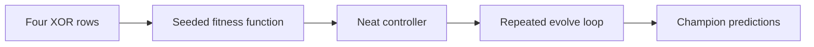

# Evolve XOR (NeatapticTS)

This folder is the first evolution-focused stop in the starter learning path. It keeps the problem tiny on purpose: four XOR truth-table rows, one seeded `Neat` controller, one feed-forward mutation shelf, and one champion summary that shows what the best network predicts after a short run.

The goal is not to build a benchmark. The goal is to make the basic NEAT loop visible without requiring a browser host or a large task domain.

The generation budget is intentionally bounded rather than open-ended, so this starter example can show a full solve-oriented controller loop without turning into a benchmark harness.



## What This Example Teaches

- how to create a seeded `Neat` controller,
- how a tiny fitness function can score a population,
- how feed-forward structural mutations let the controller discover a working XOR network,
- how `evaluate()` and `evolve()` work together across a bounded generation loop,
- how to inspect the final champion against the XOR truth table.

## Run The Example

From the repo root:

```bash
npm run example:evolve-xor
```

The command uses the same `tsx` runner pattern as `Hello Network`, with the public example logic in `index.ts` and a tiny console wrapper in `run.ts`.

## Minimal Public API Shape

```ts
import { Neat, methods } from '@reicek/neataptic-ts';

const neat = new Neat(2, 1, fitness, {
  mutation: methods.mutation.FFW,
  popsize: 100,
  seed: 42,
});

await neat.evaluate();
const champion = await neat.evolve();

console.log(champion.score);
```

The in-repo example goes one step further by repeating that loop across a bounded generation budget until the feed-forward run reaches a solved XOR-quality score, then printing the champion's predictions so the whole story stays inspectable.
