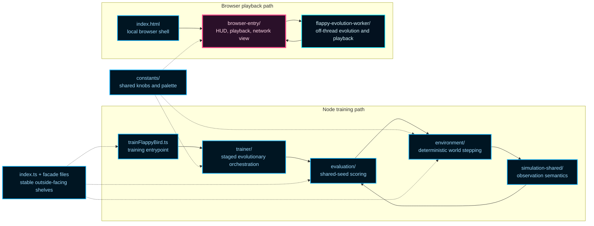
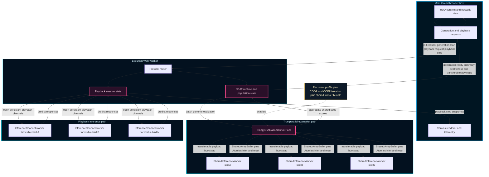
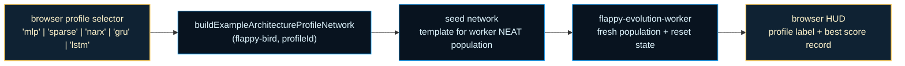

# Flappy Bird (NeatapticTS)

This folder is the repository's most complete answer to a practical question: what should neuroevolution feel like when it leaves toy problems and enters a real runtime?

The example uses a Flappy Bird-style control task, but the game is not the real subject. The real subject is systems design under evolutionary pressure: deterministic world stepping, fairer policy comparison, staged selection, worker-backed playback, and a browser UI that teaches instead of merely entertaining.

If you want one example that shows the repo's broader taste in architecture, reproducibility, and educational tooling, start here.

## What This Folder Is Trying To Teach

This example is organized around four reader questions:

1. How do you connect a NEAT population to a repeatable control problem instead of a one-off demo loop?
2. How do you reduce lucky-rollout bias so evolution rewards robust behavior rather than fortunate seeds?
3. How do you replay and inspect evolved behavior in the browser without moving simulation authority onto the main thread?
4. How do you make the resulting network understandable enough to teach from, not just flashy enough to watch?

The folder matters because it answers all four questions in one coherent system. Training, evaluation, simulation, playback, and inspection are separate boundaries on purpose. That separation is what keeps the example readable when it grows beyond a single-file demo.

## Choose Your Route

Different readers want different first files. Use the route that matches your question instead of reading everything linearly.

| If you want to...                                 | Start here                                                                                       | Then read                                                                                                                                  |
| ------------------------------------------------- | ------------------------------------------------------------------------------------------------ | ------------------------------------------------------------------------------------------------------------------------------------------ |
| Run training immediately                          | [trainFlappyBird.ts](./trainFlappyBird.ts)                                                       | [trainer/README.md](./trainer/README.md), [evaluation/README.md](./evaluation/README.md)                                                   |
| Reuse the example from code                       | [index.ts](./index.ts)                                                                           | [flappyEnvironment.ts](./flappyEnvironment.ts), [flappyEvaluation.ts](./flappyEvaluation.ts), [constants/README.md](./constants/README.md) |
| Open the browser demo and inspect the UI boundary | [browser-entry/browser-entry.ts](./browser-entry/browser-entry.ts) or [index.html](./index.html) | [browser-entry/README.md](./browser-entry/README.md), [flappy-evolution-worker/README.md](./flappy-evolution-worker/README.md)             |
| Understand the control problem itself             | [environment/README.md](./environment/README.md)                                                 | [simulation-shared/README.md](./simulation-shared/README.md), [evaluation/README.md](./evaluation/README.md)                               |
| Tune fairness, rollout policy, or fitness shaping | [evaluation/README.md](./evaluation/README.md)                                                   | [trainer/README.md](./trainer/README.md)                                                                                                   |
| Change worker playback or browser transport       | [flappy-evolution-worker/README.md](./flappy-evolution-worker/README.md)                         | [browser-entry/README.md](./browser-entry/README.md)                                                                                       |
| Understand the whole example as a system          | this README                                                                                      | the module READMEs listed in [Recommended Reading Order](#recommended-reading-order)                                                       |

## Run The Example

### Run training from Node

From the repo root:

```bash
npx ts-node examples/flappy_bird/trainFlappyBird.ts
```

You should see compact generation logs such as:

- `gen=1 best=... pipes=... frames=...`

Training continues until you stop it with `Ctrl+C`.

### Run the browser demo

From the repo root:

```bash
npm run start:local-server
```

Then open:

- `http://localhost:8080/examples/flappy_bird/index.html`

Important note:

- `index.html` is a lightweight bundle-loading shell, not the source-of-truth browser runtime.
- the real browser host starts in [browser-entry/browser-entry.ts](./browser-entry/browser-entry.ts).
- the page loads example bundles from `docs/assets`, so after code or documentation changes that affect the published example surface, run `npm run docs` to refresh generated docs plus bundles, or `npm run build:flappy-bird` to refresh both the Flappy host bundle and its worker bundles.

## The Core Idea In One Glance

The architectural rule is simple: keep simulation and evolution authoritative, keep the browser explanatory, and keep the worker boundary explicit.



Read the diagram in two passes:

- the Node path evolves networks against a deterministic environment using shared-seed evaluation,
- the browser path explains and replays that story without taking control away from the worker-owned runtime.

That split is the heart of the example. Once you understand it, the rest of the folder stops looking like many files and starts looking like a deliberate teaching system.

## Architecture Note: Where True Parallelism Actually Happens

The browser demo uses Web Workers in two different layers, and it helps to keep them separate in your head.

The first layer is always present: the browser host hands evolution and playback authority to one dedicated evolution worker. That keeps the UI thread focused on explanation, rendering, and controls.

The second layer is where the larger performance gain appears. For recurrent browser profiles, when the page is cross-origin isolated and the shared worker bundle is available, the evolution worker opens a bounded [FlappyEvaluationWorkerPool](./evaluation/evaluation.worker-pool.ts). That pool fans genome evaluation out to multiple `SharedInferenceWorker` slots, so multiple predictor instances can score different genomes at the same time on separate Web Workers.

That is the important distinction: the main thread is not evaluating the flock asynchronously by itself, and the browser is not receiving one message per inference call. Instead, true parallelism happens inside the worker-owned evaluation layer, while the host receives compact higher-level results.

The host-side message story stays intentionally simple:

- generation requests return one `generation-ready` summary after the worker finishes the batch,
- playback requests return near-real-time `playback-step` snapshots so the canvas can stay responsive,
- raw per-network inference traffic remains inside worker-owned transport boundaries.

This example is also the current proof surface for the library's turnkey
parallel execution shelf. The public library now owns the reusable helper
ladder that Flappy helped extract: capability detection,
`transport: 'auto'` selection, browser worker URL resolution, bounded
inference pools, ordered batch evaluation, and the boolean-first
`createNeatParallelPopulationEvaluator(...)` helper.

Flappy still owns the policy layer above that shelf. The example decides when a
browser profile should opt into parallel evaluation, which payloads are worth
precomputing, how shared-seed evidence is folded into trainer scores, and which
compact summaries are posted back to the host. That is the deliberate split:
the library owns the reusable worker helpers, while Flappy proves where they
fit inside a real browser-worker runtime without hiding the async boundary.

The detailed map below shows both paths at once.



Read the diagram in three passes:

1. Main thread: it sends coarse requests and renders coarse results. It never owns the mutable evolution state.
2. Evolution worker: it owns the NEAT controller, decides when a generation starts or ends, and decides when playback state advances.
3. Nested worker transport: it uses a bounded shared-memory pool for the true parallel evaluation pass, and separate persistent channel workers for playback-facing predictor calls.

If you want to inspect the concrete implementation after this chapter overview, read [flappy-evolution-worker/README.md](./flappy-evolution-worker/README.md) for the protocol boundary and [evaluation/README.md](./evaluation/README.md) for the worker-pool and rollout side.

## What Each Boundary Protects

### `trainer/`: population policy

The trainer is the outer evolutionary loop. It decides how a generation is evaluated, how mutation pressure is scheduled, how reevaluation works, and what summary gets reported back out.

This boundary exists so the example's selection policy reads like policy instead of getting buried inside rollout mechanics or browser code.

### `evaluation/`: fairness and score composition

Evaluation answers two different questions that should never be confused:

1. What happened in one rollout?
2. How stable is this genome across a shared batch of deterministic seeds?

That second question is the important one for evolution. The example deliberately prefers shared-seed batch evidence over one lucky episode.

### `environment/`: the world itself

The environment owns bird state, pipe state, collision logic, pass credit, timeout behavior, and deterministic stepping. It is the simulation authority for one episode.

This boundary exists so the world can be reasoned about without needing to understand workers, DOM code, or training logs.

### `simulation-shared/`: what the policy is actually seeing

This layer keeps observation semantics consistent across training, helper utilities, and browser playback-related tooling. If this boundary drifts, debugging becomes misleading because the policy may appear to be reacting to different worlds in different runtimes.

### `browser-entry/`: the teaching surface

The browser entry boundary turns the evolved system into something a human can inspect. It owns the host UI, playback rendering, HUD updates, and network visualization.

It is intentionally not the source of truth for simulation. That keeps the UI responsive and keeps the educational surface honest.

### `flappy-evolution-worker/`: off-thread authority

The worker owns evolution and playback simulation on the hot path. It transports packed snapshots and generation summaries back to the browser host rather than exposing live mutable runtime objects.

This boundary exists for both performance and clarity: message passing makes responsibility visible.

### `constants/` and the facade files: stability shelves

The supporting boundaries matter too.

- `constants/` keeps cross-cutting knobs and visual defaults centralized.
- `index.ts`, `flappyEnvironment.ts`, and `flappyEvaluation.ts` provide stable outside-facing shelves for readers who want the example's public surfaces without learning the full folder layout first.

## Two Execution Stories

The same example tells two different runtime stories depending on where you enter.

### Training story

1. [trainFlappyBird.ts](./trainFlappyBird.ts) starts the Node-side trainer.
2. [trainer/README.md](./trainer/README.md) resolves staged rollout plans and mutation scheduling.
3. [evaluation/README.md](./evaluation/README.md) scores each genome across shared seeds.
4. [environment/README.md](./environment/README.md) advances one deterministic world frame by frame.
5. The trainer ranks genomes, logs the generation summary, and evolves again.

### Browser story

1. [index.html](./index.html) loads the browser shell.
2. [browser-entry/README.md](./browser-entry/README.md) creates the UI, HUD, and worker channel.
3. [flappy-evolution-worker/README.md](./flappy-evolution-worker/README.md) evolves or simulates playback off-thread.
4. The worker streams packed playback snapshots and returns per-generation summaries back to the main thread.
5. The browser reconstructs frames, renders the flock, and visualizes the currently interesting network.

The important teaching point is that both stories depend on the same world and observation logic, but they do not collapse into the same runtime boundary.

## The Most Important Design Bets

Several design decisions explain why the folder looks the way it does.

### Shared-seed evaluation beats lucky-rollout selection

Genomes are compared on the same deterministic seeds. That makes fitness comparisons harsher, but also far more trustworthy. A network that wins under shared seeds is usually learning a policy, not just getting lucky.

### Current-frame observations keep architecture comparisons honest

The policy now receives a compact 6-feature observation built from the current normalized frame: bird state and next-gap geometry. The example no longer stacks previous frames, recent flap actions, extra control-pressure hints, or any additional future-gap channels into the external controller input.

That choice is intentional. The shared Flappy profile contract keeps MLP, Sparse, NARX, GRU, and LSTM on the same current-frame shelf. Feed-forward builders solve the task from instantaneous geometry, while recurrent builders earn any temporal advantage through carried internal state instead of hand-authored memory channels.

### Two outputs keep the action story simple

The action surface is intentionally narrow: `no flap` versus `flap`. A flap occurs when `output[1] > output[0]`.

That simplicity is a teaching choice. It keeps the interesting complexity in state design, evaluation fairness, and runtime boundaries rather than in action decoding.

### Decomposed fitness makes failure interpretable

Fitness is not one opaque number. It is composed from survival, pipe progress, dense shaping, and terminal shaping. That means poor performance can be inspected by channel instead of being treated like a mysterious scalar.

### The browser is educational, not authoritative

The browser can render a full generation, highlight the current leader, and show connection sign, connection strength, disabled edges, and node bias. But it does not own simulation truth.

That distinction is what makes the example useful as a systems reference instead of only a visual demo.

## Architecture Profiles

Flappy Bird uses the shared [example architecture profile contract](../architectureProfiles.ts) so runs can start from any approved builder family. The browser demo exposes a profile selector that starts a clean new run for each family; the Node trainer uses `DEFAULT_FLAPPY_ARCHITECTURE_PROFILE_ID` unless an explicit profile is passed through setup.

### Approved profiles for Flappy Bird

| Profile id      | Family       | Recurrent | Role                                                                                                                                                                                                                                  |
| --------------- | ------------ | --------- | ------------------------------------------------------------------------------------------------------------------------------------------------------------------------------------------------------------------------------------- |
| `mlp`           | MLP          | No        | Baseline feed-forward reference. Dense connectivity from the 6-feature current-frame observation to 2 action outputs.                                                                                                                 |
| `random-sparse` | RandomSparse | No        | Sparse topology-search baseline. Fewer initial edges encourage topology exploration without requiring recurrent state.                                                                                                                |
| `narx`          | NARX         | Yes       | Delay-line memory profile. Carries short-horizon sequences of inputs and outputs without gating. Feed-forward builders already handle current-frame geometry; any temporal advantage here must come from learned carry-over patterns. |
| `gru`           | GRU          | Yes       | Pedagogical gated-memory profile with a direct input-to-output readout connection. Recurrent blocks learn what to keep and forget across flap decisions.                                                                              |
| `lstm`          | LSTM         | Yes       | Pedagogical gated-memory profile with explicit cell state. Structurally heavier than GRU; exposes the full gating vocabulary for teaching purposes.                                                                                   |

### Selecting a profile in the browser

Clicking an architecture button in the browser UI stops the current session, discards the running population, and starts a completely fresh run seeded from the selected profile. This is a **new-run selector**, not a live topology swap. The profile label in the HUD updates immediately, and the per-architecture best pipe score is stored in browser local storage so repeated sessions can compete against their own records. The family with the highest stored score carries a `*` marker.

### Recurrent profile guidance

When a stateful profile (NARX, GRU, LSTM) is selected, the evaluation and playback paths reset carried network state at every rollout boundary. The 6-feature current-frame observation means feed-forward builders can already solve the task from instantaneous geometry. Recurrent builders earn their temporal advantage through internal state, not through additional external memory channels.



## Observation And Fitness Cheat Sheet

The observation vector focuses on control-relevant geometry rather than pixels. The policy sees a compressed description of the next decision, not a screenshot of the scene.

| Signal family     | What it tells the policy                                  | Why it matters                                                                                          |
| ----------------- | --------------------------------------------------------- | ------------------------------------------------------------------------------------------------------- |
| Bird state        | vertical position and vertical velocity                   | The network needs immediate kinematic context before deciding whether a flap is corrective or wasteful. |
| Next gap geometry | distance to the next gap, gap bounds, and relative offset | This is the primary near-term survival problem.                                                         |

Fitness then combines normalized channels with caps so one lucky dimension does not dominate selection:

- survival,
- pipe progress,
- dense shaping,
- terminal shaping.

The result is a reward surface that still encourages practical flying behavior, but remains debuggable when evolution stalls or overfits to one pattern.

## If You Want To Change Something, Read This First

This is the shortest route to the right boundary when you are modifying the example.

| Change goal                                                        | Read first                                                               | Why                                                                                   |
| ------------------------------------------------------------------ | ------------------------------------------------------------------------ | ------------------------------------------------------------------------------------- |
| Adjust gravity, pipe spacing, collision, or deterministic stepping | [environment/README.md](./environment/README.md)                         | That is where world truth lives.                                                      |
| Change what the network sees                                       | [simulation-shared/README.md](./simulation-shared/README.md)             | Observation semantics must stay aligned across training and playback-related helpers. |
| Change score shaping or fairness policy                            | [evaluation/README.md](./evaluation/README.md)                           | This boundary owns rollout scoring and shared-seed aggregation.                       |
| Change staged selection or mutation scheduling                     | [trainer/README.md](./trainer/README.md)                                 | This is the population-policy layer.                                                  |
| Change browser playback, HUD, or network inspection                | [browser-entry/README.md](./browser-entry/README.md)                     | The browser teaching surface lives here.                                              |
| Change worker transport or off-thread playback behavior            | [flappy-evolution-worker/README.md](./flappy-evolution-worker/README.md) | The worker owns hot-path simulation and packed snapshot transport.                    |

## Folder Map

The folder is split by responsibility, not by one giant "game" module.

- `browser-entry/`: main-thread browser runtime, HUD, playback renderer, viewport helpers, telemetry, and network visualization.
- `constants/`: shared visual, training, world, and playback constants.
- `environment/`: deterministic state, stepping, collision/progress rules, and environment-facing helpers.
- `evaluation/`: rollout execution, seed batching, and fitness aggregation.
- `flappy-evolution-worker/`: worker runtime for evolution, playback simulation, and snapshot transport.
- `simulation-shared/`: shared observation and simulation-facing feature logic reused across boundaries.
- `trainer/`: Node-side orchestration, staged evaluation plans, mutation scheduling, and generation logging.
- `flappyEnvironment.ts`: convenience facade for using the example as a control environment.
- `flappyEvaluation.ts`: convenience facade for using the example as a policy-evaluation surface.
- `flappyEvolution.worker.ts`: small worker bundle entry.
- `trainFlappyBird.ts`: direct Node entrypoint for starting training.
- `index.html`: local browser shell.
- `index.ts`: example-level public shelf.
- `rng.ts`: deterministic random utilities shared across runtime paths.

## Recommended Reading Order

If you want the cleanest ramp into the example, this order usually pays off:

1. this README for the system-level mental model,
2. [trainer/README.md](./trainer/README.md) for the outer evolutionary loop,
3. [evaluation/README.md](./evaluation/README.md) for fairness and score aggregation,
4. [environment/README.md](./environment/README.md) for deterministic world mechanics,
5. [simulation-shared/README.md](./simulation-shared/README.md) for observation semantics,
6. [browser-entry/README.md](./browser-entry/README.md) for the browser runtime and inspection surface,
7. [flappy-evolution-worker/README.md](./flappy-evolution-worker/README.md) for worker protocol and playback transport.

If you only care about one slice:

- training and fairness: start with `trainer/` and `evaluation/`,
- world mechanics and control semantics: start with `environment/` and `simulation-shared/`,
- browser playback and UI boundaries: start with `browser-entry/` and `flappy-evolution-worker/`.

## Background Reading

This folder is readable from the code alone, but two external references genuinely help if you want the broader concepts behind the design:

- Kenneth O. Stanley and Risto Miikkulainen, ["Evolving Neural Networks through Augmenting Topologies"](https://direct.mit.edu/evco/article/10/2/99/998), _Evolutionary Computation_ 10(2), 2002. This is the canonical NEAT paper and the best conceptual backdrop for why topology and weights co-evolve.
- Wikipedia contributors, ["Message passing"](https://en.wikipedia.org/wiki/Message_passing), _Wikipedia, The Free Encyclopedia_. This is useful background for understanding why the browser and worker communicate through an explicit protocol instead of sharing runtime authority.

## Why Start Here

Many libraries look strong when explained as features. Fewer still look strong when asked to keep simulation deterministic, evaluation fair, browser playback responsive, and the resulting policy inspectable at the same time.

That is why this README matters. The goal is not merely to show that NeatapticTS can evolve a bird controller. The goal is to show what the library's engineering values look like when they have to coexist inside one runnable example.

If you want one folder that demonstrates the repo's broader direction for inspectable, reproducible, educational neuroevolution examples, this is the one.
