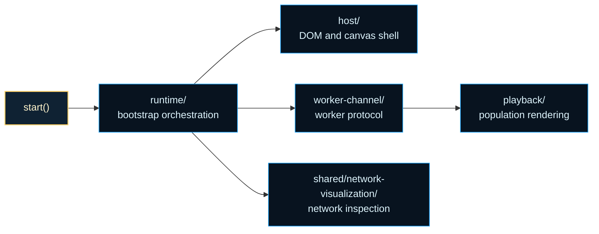
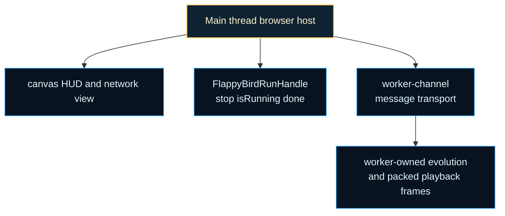
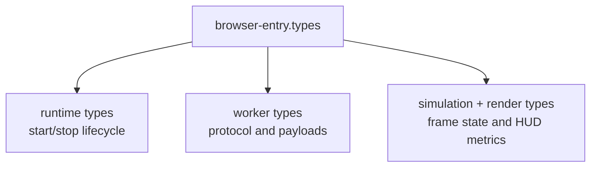

# browser-entry

Browser teaching surface and lifecycle facade for the Flappy Bird example.

This folder is where worker-owned evolution meets human-friendly inspection.
The browser side owns DOM setup, HUD updates, playback rendering, and network
visualization. The worker side owns the hot-path simulation and packed frame
production. `browser-entry/` exists so those responsibilities stay honest
instead of drifting into one blurry runtime.

That split is the main reason this file stays intentionally small. The public
`start(...)` surface should feel simple to call even though the surrounding
system is not simple at all. A caller gets one run handle, while the folder
behind it fans out into runtime bootstrap, host layout, worker messaging,
playback rendering, and inspection views.

Read this boundary as the browser-side answer to one practical question:
how do you make an evolved controller visible and interactive without moving
simulation authority back onto the main thread? The answer is a stable entry
facade plus a strict authority split between browser presentation and worker
execution.

`index.html` is only the local shell that loads the published bundle and then
reaches this same start boundary through globals. If you want the real
host/runtime seam, start here rather than with the static shell.

Read the folder in three passes. Start with this file for the public
lifecycle contract. Continue into `runtime/` and `worker-channel/` for the
bootstrap and protocol story. Finish with `host/` and `playback/` for the
browser-side teaching surface; the network-visualization implementation now
lives in `examples/shared/network-visualization/`.





For background on why the boundary keeps simulation authority off the main
thread, see MDN,
[Using Web Workers](https://developer.mozilla.org/en-US/docs/Web/API/Web_Workers_API/Using_web_workers),
which captures the browser execution model this example leans on.

Example: start the demo and stop it from embedding code later.

```ts
import { start } from './browser-entry/browser-entry';

const handle = await start('flappy-bird-output');
setTimeout(() => handle.stop(), 10_000);
await handle.done;
```

Example: watch the lifecycle handle while the browser host is running.

```ts
const handle = await start('flappy-bird-output');

console.log(handle.isRunning());
await handle.done;
```

## browser-entry/browser-entry.ts

### FlappyBirdRunHandle

Handle returned by `start` for controlling demo execution lifecycle.

### start

```ts
start(
  container: RuntimeContainerTarget,
): Promise<FlappyBirdRunHandle>
```

Starts the Flappy Bird NeatapticTS browser demo and returns lifecycle controls.

This function is intentionally orchestration-focused:
1) resolve runtime dependencies (DOM host, worker, host UI),
2) initialize worker and telemetry plumbing,
3) run the evolve -> playback -> HUD fold loop until stopped,
4) expose a small stop/isRunning/done handle for callers.

Parameters:
- `container` - Element id or HTMLElement to host the demo.

Returns: Run handle for stop/state control.

Example:

```ts
const runHandle = await start('flappy-bird-output');
// later
runHandle.stop();
await runHandle.done;
```

## browser-entry/browser-entry.types.ts

Aggregated public type surface for the Flappy Bird browser runtime.

The browser demo spans several concerns at once: worker messaging, playback
rendering, telemetry, viewport math, and network visualization. Re-exporting
the public contracts from one place gives readers a compact map of that
runtime without forcing them to know the internal folder layout first.

A practical reading order is:

- runtime types for lifecycle and top-level handles,
- worker types for protocol boundaries,
- simulation/render types for playback state.

Use this file when you want the browser runtime's public contract map. Use
the neighboring runtime, playback, host, and worker-channel folders for
browser-entry implementation details; the network-visualization drawing
helpers and types live in `examples/shared/network-visualization/`.

Browser runtime map:


### BrowserDifficultyProfile

Difficulty profile consumed by simulation observation helpers.

This bundles the three variables that define how demanding a stretch of the
course is: corridor width, pipe speed, and spawn cadence.

### BrowserPopulationBirdLike

Bird shape used by utility winner/leader resolver helpers.

### BrowserPopulationPipeLike

Pipe shape used by utility observation-vector helpers.

### CreateFlappyStatsTableRowsInput

Input contract for declarative runtime stats table row builder.

The builder needs both the target table and a small policy surface that says
whether instrumentation rows should appear and how rows should be colored.

### EvolutionGenerationPayload

Worker payload describing evolved generation summary values.

This is the browser-facing summary of one completed NEAT generation: what
generation finished, how fit the best genome was, which transferable
inference payloads are ready for playback transport, and which JSON bridge
values remain available for the network visualization cache.

### EvolutionGenerationReadyMessage

Worker message emitted when a generation has completed evolving.

### EvolutionPlaybackStepMessage

Worker message carrying one playback step and aggregate markers.

Besides the frame snapshot itself, this message also carries summary values
used by the HUD so the browser can show performance and progress without
recomputing population-wide statistics on the main thread.

### EvolutionPlaybackStepSnapshot

Per-frame snapshot received from the worker playback channel.

A snapshot combines geometry, packed population state, and lightweight world
metadata so the browser can render a deterministic frame without rerunning
the simulation locally.

### EvolutionRuntimeStatusMessage

Informational worker message used to keep the HUD phase/status honest.

### EvolutionRuntimeStatusPhase

Worker phase labels surfaced to the browser HUD during long-running work.

### EvolutionWorkerErrorMessage

Worker message emitted for simulation/playback errors.

### EvolutionWorkerMessage

Union of all supported worker messages consumed by browser entry.

A closed union keeps the main-thread message handler explicit and easy to
audit when the protocol evolves.

### FlappyBirdRunHandle

Handle returned by `start` for controlling demo execution lifecycle.

### FlappyStatsCategoryColors

Color pair used for stats category key/value styling.

The HUD uses paired colors so labels and values stay visually grouped while
still separating categories such as current run, generation summary,
telemetry, and status.

### FlappyStatsKey

Runtime stats table key union used across browser-entry helpers.

### FlappyStatsRowDescriptor

Declarative row descriptor for the runtime stats table.

Each row is described as data first so the HUD can be assembled in a stable,
testable order instead of being hand-written imperatively.

### FlappyStatsTableCells

Runtime lookup map of stat keys to writable value cells.

This acts like a small DOM index so the update loop can mutate the correct
cells directly without repeatedly querying the document.

### PackedPlaybackBirdSnapshot

Packed typed-array payload for playback bird snapshot transport.

This mirrors the pipe packing strategy so playback can move large population
snapshots with less allocation pressure than object-per-bird messages.

### PackedPlaybackPipeSnapshot

Packed typed-array payload for playback pipe snapshot transport.

Typed arrays keep frame payloads compact and predictable, which matters when
the worker is streaming many birds and pipes across animation frames.

### PlaybackFrameStats

Lightweight per-frame telemetry emitted to HUD update callback.

These values are the browser-friendly metrics shown in the live status panel:
how many birds remain, how far the leader has progressed, and how expensive
the current playback cadence is.

### PopulationBird

Renderable bird state snapshot emitted by the playback worker.

The browser does not receive full neural state here. It only gets the fields
needed for presentation and HUD summaries, which keeps per-frame transport
light.

### PopulationPipe

Renderable pipe state snapshot emitted by the playback worker.

This is the smallest pipe shape the browser renderer needs for one frame:
horizontal position plus the vertical corridor geometry.

### PopulationRenderState

Mutable render-state model consumed by the population frame renderer.

The playback layer incrementally updates this state as worker snapshots
arrive, which lets rendering stay deterministic without re-deriving world
history from scratch each frame.

### RenderClosedOuterBoxInput

Input contract for outer frame rendering helper.

The outer frame is the decorative shell that visually separates the playable
world and telemetry panels from the rest of the page.

### RenderStandaloneTitleBoxInput

Input contract for standalone title frame rendering helper.

### RngLike

Minimal random source contract used by utility random helpers.

The narrow contract keeps deterministic spawn utilities portable across
browser and test contexts.

### RuntimeWindow

Runtime window contract for the Flappy Bird browser demo.

The demo exposes a small debug-friendly surface on `window` so manual browser
experiments and docs examples can start the simulation without importing the
bundle as a module.

### SerializedNetwork

Loose JSON-compatible network payload used by worker messages.

### TextFrameMetrics

Canvas text-grid metrics used for frame rendering layout helpers.

The frame renderer measures glyph and row geometry once, then uses that grid
to place ASCII-style UI elements consistently.

### TrailPoint

Trail point used by playback trail rendering cache.

A trail point stores where one bird was at one frame so the UI can draw a
short motion history behind active agents.

### TrailState

Mutable trail cache keyed by bird index for frame rendering.

This cache exists purely for visualization ergonomics; it is not part of the
worker simulation state.

### ViewportInfo

Viewport transform values for world-to-canvas rendering.

These numbers answer the classic graphics question: how does one unit in the
simulated world map into the current canvas rectangle?

## browser-entry/browser-entry.stats.types.ts

HUD and runtime stats contracts for the Flappy Bird browser demo.

The browser HUD is intentionally declarative: keys describe what should be
shown, and helper utilities map those keys to DOM rows and live values. The
panel is split into a live current-run section, a generation-summary section,
and optional instrumentation rows so the browser can show both immediate
playback state and worker-computed population context without recomputing
aggregates on the main thread.

### CreateFlappyStatsTableRowsInput

Input contract for declarative runtime stats table row builder.

The builder needs both the target table and a small policy surface that says
whether instrumentation rows should appear and how rows should be colored.

### FlappyStatsCategoryColors

Color pair used for stats category key/value styling.

The HUD uses paired colors so labels and values stay visually grouped while
still separating categories such as current run, generation summary,
telemetry, and status.

### FlappyStatsKey

Runtime stats table key union used across browser-entry helpers.

### FlappyStatsRowDescriptor

Declarative row descriptor for the runtime stats table.

Each row is described as data first so the HUD can be assembled in a stable,
testable order instead of being hand-written imperatively.

### FlappyStatsTableCells

Runtime lookup map of stat keys to writable value cells.

This acts like a small DOM index so the update loop can mutate the correct
cells directly without repeatedly querying the document.

## browser-entry/browser-entry.render.types.ts

Canvas frame-layout contracts for the Flappy Bird browser demo.

These types support the demo's deliberately stylized text-frame chrome: title
boxes, outer borders, and viewport transforms that make the example feel more
like an instrument panel than a plain canvas game.

### RenderClosedOuterBoxInput

Input contract for outer frame rendering helper.

The outer frame is the decorative shell that visually separates the playable
world and telemetry panels from the rest of the page.

### RenderStandaloneTitleBoxInput

Input contract for standalone title frame rendering helper.

### TextFrameMetrics

Canvas text-grid metrics used for frame rendering layout helpers.

The frame renderer measures glyph and row geometry once, then uses that grid
to place ASCII-style UI elements consistently.

### ViewportInfo

Viewport transform values for world-to-canvas rendering.

These numbers answer the classic graphics question: how does one unit in the
simulated world map into the current canvas rectangle?

## browser-entry/browser-entry.worker.types.ts

Worker transport contracts for the Flappy Bird browser runtime.

The browser UI and the evolution worker communicate through a deliberately
explicit message protocol. The goal is educational as well as practical: it
makes it obvious which values are computed off-thread, which snapshots are
transferred frame-by-frame, and which events advance the demo state.

If you want background reading, the Wikipedia article on "message passing"
provides a useful conceptual frame for this boundary.

### EvolutionGenerationPayload

Worker payload describing evolved generation summary values.

This is the browser-facing summary of one completed NEAT generation: what
generation finished, how fit the best genome was, which transferable
inference payloads are ready for playback transport, and which JSON bridge
values remain available for the network visualization cache.

### EvolutionGenerationReadyMessage

Worker message emitted when a generation has completed evolving.

### EvolutionPlaybackStepMessage

Worker message carrying one playback step and aggregate markers.

Besides the frame snapshot itself, this message also carries summary values
used by the HUD so the browser can show performance and progress without
recomputing population-wide statistics on the main thread.

### EvolutionPlaybackStepSnapshot

Per-frame snapshot received from the worker playback channel.

A snapshot combines geometry, packed population state, and lightweight world
metadata so the browser can render a deterministic frame without rerunning
the simulation locally.

### EvolutionRuntimeStatusMessage

Informational worker message used to keep the HUD phase/status honest.

### EvolutionRuntimeStatusPhase

Worker phase labels surfaced to the browser HUD during long-running work.

### EvolutionWorkerErrorMessage

Worker message emitted for simulation/playback errors.

### EvolutionWorkerMessage

Union of all supported worker messages consumed by browser entry.

A closed union keeps the main-thread message handler explicit and easy to
audit when the protocol evolves.

### PackedPlaybackBirdSnapshot

Packed typed-array payload for playback bird snapshot transport.

This mirrors the pipe packing strategy so playback can move large population
snapshots with less allocation pressure than object-per-bird messages.

### PackedPlaybackPipeSnapshot

Packed typed-array payload for playback pipe snapshot transport.

Typed arrays keep frame payloads compact and predictable, which matters when
the worker is streaming many birds and pipes across animation frames.

### PlaybackFrameStats

Lightweight per-frame telemetry emitted to HUD update callback.

These values are the browser-friendly metrics shown in the live status panel:
how many birds remain, how far the leader has progressed, and how expensive
the current playback cadence is.

### PopulationBird

Renderable bird state snapshot emitted by the playback worker.

The browser does not receive full neural state here. It only gets the fields
needed for presentation and HUD summaries, which keeps per-frame transport
light.

### PopulationPipe

Renderable pipe state snapshot emitted by the playback worker.

This is the smallest pipe shape the browser renderer needs for one frame:
horizontal position plus the vertical corridor geometry.

### SerializedNetwork

Loose JSON-compatible network payload used by worker messages.

## browser-entry/browser-entry.runtime.types.ts

Public lifecycle contracts for the Flappy Bird browser runtime.

These types describe how the demo is started, stopped, and exposed on the
browser `window` object. They are intentionally small because callers should
control the demo at a high level without depending on private implementation
details.

### FlappyBirdRunHandle

Handle returned by `start` for controlling demo execution lifecycle.

### RuntimeWindow

Runtime window contract for the Flappy Bird browser demo.

The demo exposes a small debug-friendly surface on `window` so manual browser
experiments and docs examples can start the simulation without importing the
bundle as a module.

## browser-entry/browser-entry.simulation.types.ts

Simulation-facing browser contracts shared by playback helpers.

These types describe the minimum world state the browser needs while it is
reconstructing, rendering, or summarizing worker-produced frames.

### BrowserDifficultyProfile

Difficulty profile consumed by simulation observation helpers.

This bundles the three variables that define how demanding a stretch of the
course is: corridor width, pipe speed, and spawn cadence.

### BrowserPopulationBirdLike

Bird shape used by utility winner/leader resolver helpers.

### BrowserPopulationPipeLike

Pipe shape used by utility observation-vector helpers.

### PopulationRenderState

Mutable render-state model consumed by the population frame renderer.

The playback layer incrementally updates this state as worker snapshots
arrive, which lets rendering stay deterministic without re-deriving world
history from scratch each frame.

### RngLike

Minimal random source contract used by utility random helpers.

The narrow contract keeps deterministic spawn utilities portable across
browser and test contexts.

### TrailPoint

Trail point used by playback trail rendering cache.

A trail point stores where one bird was at one frame so the UI can draw a
short motion history behind active agents.

### TrailState

Mutable trail cache keyed by bird index for frame rendering.

This cache exists purely for visualization ergonomics; it is not part of the
worker simulation state.

## browser-entry/browser-entry.host.utils.ts

### createCanvasHostInternal

```ts
createCanvasHostInternal(
  containerElement: HTMLElement,
  options: CanvasHostOptions,
): CanvasHostResult & NetworkVisualizationHandle
```

Builds the browser demo host tree and returns rendering handles.

This is the internal host builder used by the public entrypoint and the
browser-entry utils barrel. The orchestration is deliberately step-shaped:
clear old DOM, build layout, create canvases, wire resize behavior, render
placeholders, then return the handles the runtime will mutate during
execution.

Parameters:
- `containerElement` - Root host container.
- `options` - Visual/host options (sizes, IDs, renderer selection).

Returns: Canvas handles, stats cells and network render/overlay callbacks.

### updateStatsTableValues

```ts
updateStatsTableValues(
  statsValueByKey: Partial<Record<FlappyStatsKey, HTMLTableCellElement>>,
  partialValues: Partial<Record<FlappyStatsKey, string>>,
): void
```

Applies partial stat updates to the rendered stats table.

The runtime writes HUD values incrementally, so the host exposes a narrow
partial-update helper rather than requiring full table redraws.

Parameters:
- `statsValueByKey` - Lookup of stat keys to value cells.
- `partialValues` - Subset of values to write this tick.

Returns: Nothing.

## browser-entry/browser-entry.math.utils.ts

### applyAlphaToHexColor

```ts
applyAlphaToHexColor(
  hexColor: string,
  alphaValue: number,
): string
```

Converts a six-digit hex color to rgba with the requested alpha.

Parameters:
- `hexColor` - Color in `#RRGGBB` form.
- `alphaValue` - Alpha value to apply.

Returns: rgba color string, or original value when not 6-digit hex.

### clamp

```ts
clamp(
  value: number,
  min: number,
  max: number,
): number
```

Clamps a numeric value to the inclusive `[min, max]` interval.

Parameters:
- `value` - Candidate value.
- `min` - Inclusive lower bound.
- `max` - Inclusive upper bound.

Returns: Clamped value.

### clamp01

```ts
clamp01(
  value: number,
): number
```

Clamps a numeric value to the inclusive `[0, 1]` interval.

Parameters:
- `value` - Candidate value.

Returns: Value clamped between 0 and 1.

### interpolateValue

```ts
interpolateValue(
  startValue: number,
  endValue: number,
  progress: number,
): number
```

Linear interpolation helper.

Parameters:
- `startValue` - Start value at progress `0`.
- `endValue` - End value at progress `1`.
- `progress` - Normalized interpolation progress.

Returns: Interpolated value.

## browser-entry/browser-entry.spawn.utils.ts

### createBirdColor

```ts
createBirdColor(
  birdIndex: number,
  totalBirds: number,
): string
```

Resolves deterministic bird color from palette index.

Parameters:
- `birdIndex` - Bird index in current population.
- `totalBirds` - Population size.

Returns: Hex color string.

### resolveGapCenterUpperBoundYPx

```ts
resolveGapCenterUpperBoundYPx(
  worldHeightPx: number,
): number
```

Resolves the exclusive upper bound used for gap-center sampling.

Educational note:
We cap dynamic viewport-derived bounds at the shared simulation maximum to
keep browser playback distribution aligned with trainer/evaluation defaults,
while still supporting smaller world heights.

Parameters:
- `worldHeightPx` - Current world height.

Returns: Exclusive upper bound for `nextInt(minInclusive, maxExclusive)`.

### resolveNextSpawnGapCenterY

```ts
resolveNextSpawnGapCenterY(
  previousGapCenterYPx: number,
  rng: RngLike,
  currentGapSizePx: number,
  worldHeightPx: number,
): number
```

Resolves next gap center with bounded per-pipe delta.

Parameters:
- `previousGapCenterYPx` - Previous spawn gap center.
- `rng` - Deterministic RNG.
- `currentGapSizePx` - Actual gap size for the pipe being placed.
- `worldHeightPx` - World height used to clamp candidate gap centers.

Returns: Next gap center y-position.

### resolveNextSpawnGapSize

```ts
resolveNextSpawnGapSize(
  previousSpawnGapPx: number | undefined,
  difficultyProfile: BrowserDifficultyProfile,
  rng: RngLike,
): number
```

Resolves next spawn gap size using progressive shrink and jitter.

Parameters:
- `previousSpawnGapPx` - Previous spawn gap size.
- `difficultyProfile` - Active difficulty profile.
- `rng` - Deterministic RNG.

Returns: Next spawn gap size.

### resolveNextSpawnIntervalFrames

```ts
resolveNextSpawnIntervalFrames(
  previousSpawnIntervalFrames: number | undefined,
  difficultyProfile: BrowserDifficultyProfile,
): number
```

Resolves next spawn interval using progressive shrink.

Parameters:
- `previousSpawnIntervalFrames` - Previous spawn interval.
- `difficultyProfile` - Active difficulty profile.

Returns: Next spawn interval in frames.

### sampleGapCenterY

```ts
sampleGapCenterY(
  rng: RngLike,
  currentGapSizePx: number,
  worldHeightPx: number,
): number
```

Samples a random gap center y-position.

Parameters:
- `rng` - Deterministic RNG.
- `currentGapSizePx` - Actual gap size for the pipe being placed.
- `worldHeightPx` - World height used to derive valid gap-center bounds.

Returns: Sampled y-position.

## browser-entry/browser-entry.stats.utils.ts

### createFlappyStatsTableRows

```ts
createFlappyStatsTableRows(
  input: CreateFlappyStatsTableRowsInput,
): Partial<Record<FlappyStatsKey, HTMLTableCellElement>>
```

Builds stats table rows and returns value-cell lookup by key.

Parameters:
- `input` - Table construction inputs.

Returns: Mapping from stat key to value cell.

### formatArchitectureStatsValue

```ts
formatArchitectureStatsValue(
  architectureValue: string,
): string
```

Splits architecture suffix onto a second line for readability in the stats table.

Parameters:
- `architectureValue` - Full architecture label.

Returns: Line-broken label value.

## browser-entry/browser-entry.playback.utils.ts

Compatibility facade for the browser-entry playback boundary.

Older imports still reach playback through this file, while the real
implementation now lives in the dedicated playback folder. Keeping the facade
explicit preserves stable imports while letting the playback subsystem grow
into a clearer module boundary.

### animatePopulationEpisodeInternal

```ts
animatePopulationEpisodeInternal(
  canvas: HTMLCanvasElement,
  context: CanvasRenderingContext2D,
  evolutionWorker: Worker,
  onFrameStats: (stats: PlaybackFrameStats) => void,
  onChampionChanged: ((event: PlaybackChampionChangedEvent) => void) | undefined,
): Promise<PlaybackEpisodeSummary>
```

Internal playback orchestration entry retained for compatibility re-exports.

The implementation is shared with the public entry so legacy imports and the
newer folderized surface behave identically.

Parameters:
- `canvas` - Target playback canvas.
- `context` - Canvas 2D context.
- `evolutionWorker` - Worker owning playback simulation state.
- `onFrameStats` - Callback receiving per-frame playback telemetry.

Returns: Aggregate playback summary for the current episode.

## browser-entry/browser-entry.viewport.utils.ts

### resolvePipeSpawnXPx

```ts
resolvePipeSpawnXPx(
  visibleWorldWidthPx: number,
  overflowPx: number,
): number
```

Resolves the world-space x spawn position for new pipes.

Parameters:
- `visibleWorldWidthPx` - Current visible world width.
- `overflowPx` - Additional offset relative to the visible right edge.

Returns: Spawn x-position.

### resolveVisibleWorldHeightPx

```ts
resolveVisibleWorldHeightPx(
  canvas: HTMLCanvasElement,
): number
```

Resolves visible world height represented by the current canvas.

Educational note:
The current viewport model uses a 1:1 mapping between canvas pixels and
world-space pixels, so visible height is the canvas height directly.

Parameters:
- `canvas` - Playback canvas.

Returns: Visible height in world-space pixels.

### resolveVisibleWorldWidthPx

```ts
resolveVisibleWorldWidthPx(
  canvas: HTMLCanvasElement,
): number
```

Resolves visible world width represented by the current canvas.

Educational note:
The current viewport model uses a 1:1 mapping between canvas pixels and
world-space pixels, so visible width is the canvas width directly.

Parameters:
- `canvas` - Playback canvas.

Returns: Visible width in world-space pixels.

### resolveWorldViewport

```ts
resolveWorldViewport(
  canvas: HTMLCanvasElement,
): ViewportInfo
```

Resolves world viewport transformation based on canvas size.

Parameters:
- `canvas` - Playback canvas.

Returns: Viewport scale and offsets.

## browser-entry/browser-entry.telemetry.utils.ts

### createMinorGcObserver

```ts
createMinorGcObserver(
  minorGcTimestampsMs: number[],
): PerformanceObserver | undefined
```

Creates a PerformanceObserver that tracks minor GC events when supported.

Parameters:
- `minorGcTimestampsMs` - Mutable minor-GC timestamp buffer.

Returns: Observer when supported; otherwise `undefined`.

### resolveEventsPerMinute

```ts
resolveEventsPerMinute(
  samples: number[],
): number
```

Resolves events per minute from the latest sample window.

Parameters:
- `samples` - Event timestamps.

Returns: Events-per-minute estimate.

### resolveHudUpdatesPerSecond

```ts
resolveHudUpdatesPerSecond(
  samples: number[],
): number
```

Resolves HUD updates per second from the latest sample window.

Parameters:
- `samples` - HUD update timestamps.

Returns: Updates-per-second estimate.

### trimSamplesToWindow

```ts
trimSamplesToWindow(
  samples: number[],
  windowMs: number,
  nowMs: number,
): void
```

Trims timestamp samples to a sliding time window.

Parameters:
- `samples` - Mutable timestamp buffer.
- `windowMs` - Window width in milliseconds.
- `nowMs` - Current timestamp.

Returns: Nothing.

## browser-entry/browser-entry.text-frame.utils.ts

### buildCenteredTitleBoxLines

```ts
buildCenteredTitleBoxLines(
  centeredColumns: number,
  titleText: string,
): string[]
```

Builds an ASCII centered title box.

Parameters:
- `centeredColumns` - Available centered column count.
- `titleText` - Title text.

Returns: Three-row title box.

### buildOuterBoxLines

```ts
buildOuterBoxLines(
  centeredColumns: number,
  totalRows: number,
): string[]
```

Builds an ASCII outer frame with closed borders.

Parameters:
- `centeredColumns` - Centered column count.
- `totalRows` - Total row count.

Returns: Frame lines.

### renderClosedOuterBox

```ts
renderClosedOuterBox(
  input: RenderClosedOuterBoxInput,
): void
```

Renders a complete closed outer glyph box.

Parameters:
- `input` - Rendering input object.

Returns: Nothing.

### renderStandaloneTitleBox

```ts
renderStandaloneTitleBox(
  input: RenderStandaloneTitleBoxInput,
): void
```

Renders only the centered title box.

Parameters:
- `input` - Rendering input object.

Returns: Nothing.

### resolveGlyphWidthPx

```ts
resolveGlyphWidthPx(
  context: CanvasRenderingContext2D,
): number
```

Resolves a stable glyph width used for frame-column math.

Parameters:
- `context` - Rendering context used to measure text.

Returns: Floored glyph width clamped to a minimum pixel value.

### resolveTextFrameMetrics

```ts
resolveTextFrameMetrics(
  frameWidthPx: number,
  frameHeightPx: number,
  glyphWidthPx: number,
  rowHeightPx: number,
  minimumColumns: number,
): TextFrameMetrics
```

Resolves core text-frame metrics for glyph box rendering.

Parameters:
- `frameWidthPx` - Frame width.
- `frameHeightPx` - Frame height.
- `glyphWidthPx` - Measured glyph width.
- `rowHeightPx` - Glyph row height.
- `minimumColumns` - Minimum column count.

Returns: Text frame metrics.

## browser-entry/browser-entry.observation.utils.ts

### commitObservationMemoryStep

```ts
commitObservationMemoryStep(
  observationMemoryState: SharedObservationMemoryState,
  observationFeatures: SharedObservationFeatures,
  shouldFlap: boolean,
): void
```

Commits one browser decision step into the shared compatibility memory surface.

Parameters:
- `observationMemoryState` - Mutable memory state for one bird.
- `observationFeatures` - Structured features used for this decision.
- `shouldFlap` - Action selected by the policy.

Returns: Nothing.

### hasAliveBirds

```ts
hasAliveBirds(
  birds: BrowserPopulationBirdLike[],
): boolean
```

Checks whether at least one bird remains alive.

Parameters:
- `birds` - Population birds.

Returns: True when any bird is alive.

### resolveAliveBirdCount

```ts
resolveAliveBirdCount(
  birds: BrowserPopulationBirdLike[],
): number
```

Counts birds that are still alive.

Parameters:
- `birds` - Population birds.

Returns: Alive bird count.

### resolveFlapDecision

```ts
resolveFlapDecision(
  rawOutputs: unknown,
): boolean
```

Resolves flap/no-flap decision from network outputs.

Parameters:
- `rawOutputs` - Activation output payload.

Returns: True when flap should trigger.

### resolveFramePrimaryWinnerIndex

```ts
resolveFramePrimaryWinnerIndex(
  birds: BrowserPopulationBirdLike[],
  includeAliveOnly: boolean,
): number
```

Resolves winner index for current frame.

Parameters:
- `birds` - Population birds.
- `includeAliveOnly` - When true, ignores dead birds.

Returns: Winner index, or `-1` when unavailable.

### resolveLeaderPipesPassed

```ts
resolveLeaderPipesPassed(
  birds: BrowserPopulationBirdLike[],
): number
```

Resolves leading pipes-passed score in the population.

Parameters:
- `birds` - Population birds.

Returns: Maximum pipes passed.

### resolveObservationVector

```ts
resolveObservationVector(
  birdYPx: number,
  velocityYPxPerFrame: number,
  pipes: BrowserPopulationPipeLike[],
  visibleWorldWidthPx: number,
  worldHeightPx: number,
  difficultyProfile: BrowserDifficultyProfile,
  activeSpawnIntervalFrames: number,
  observationMemoryState: SharedObservationMemoryState,
): { observationVector: number[]; observationFeatures: SharedObservationFeatures; }
```

Builds the normalized observation vector consumed by bird networks.

Parameters:
- `birdYPx` - Bird y position.
- `velocityYPxPerFrame` - Bird vertical velocity.
- `pipes` - Current pipe list.
- `visibleWorldWidthPx` - Current visible world width.
- `worldHeightPx` - Current world height used for normalization and bounds.
- `difficultyProfile` - Active difficulty profile.
- `activeSpawnIntervalFrames` - Current spawn interval.
- `observationMemoryState` - Shared compatibility memory state kept alongside browser decisions.

Returns: Ordered normalized observation vector.

### resolveUpcomingPipes

```ts
resolveUpcomingPipes(
  pipes: BrowserPopulationPipeLike[],
): [BrowserPopulationPipeLike | undefined, BrowserPopulationPipeLike | undefined]
```

Resolves the next two upcoming pipes in front of the bird.

Parameters:
- `pipes` - Current pipe list.

Returns: Tuple of first and second upcoming pipes.

## browser-entry/browser-entry.worker-channel.utils.ts

### createEvolutionWorker

```ts
createEvolutionWorker(): Worker
```

Creates the evolution worker used to keep heavy NEAT compute off the UI thread.

Returns: Initialized worker instance.

### requestWorkerGeneration

```ts
requestWorkerGeneration(
  evolutionWorker: Worker,
): Promise<EvolutionGenerationPayload>
```

Waits for the next generation payload emitted by the evolution worker.

Parameters:
- `evolutionWorker` - Worker emitting generation-ready messages.

Returns: Next generation payload.

### requestWorkerPlaybackStep

```ts
requestWorkerPlaybackStep(
  evolutionWorker: Worker,
  playbackStepRequest: WorkerChannelPlaybackStepRequest,
): Promise<{ requestId: number; snapshot: EvolutionPlaybackStepSnapshot; instrumentation?: { activationCallsPerFrame: number; simulationStepsPerRaf: number; } | undefined; done: boolean; averagePipesPassed?: number | undefined; p90FramesSurvived?: number | undefined; winnerPipesPassed?: number | undefined; winnerFramesSurvived?: number | undefined; winnerNetworkJson?: SerializedNetwork | undefined; winnerBirdIndex?: number | undefined; winnerNodeActivations?: Float32Array<ArrayBufferLike> | undefined; }>
```

Requests one playback batch step from the worker.

Parameters:
- `evolutionWorker` - Worker that owns playback simulation state.
- `playbackStepRequest` - Requested simulation budget and viewport width.

Returns: Playback-step payload including snapshot and completion marker.
