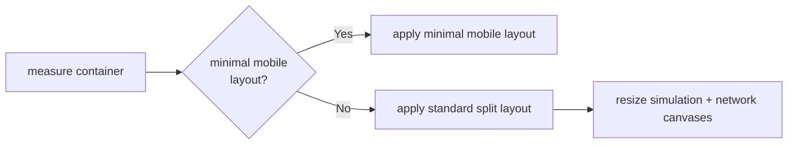

# browser-entry/host/resize

Top-level responsive sizing orchestration for the browser host.

The resize boundary keeps one educational promise intact: the browser demo
should still read like one coherent instrument panel even as the viewport
shifts from desktop to narrow mobile layouts. That means sizing is not just a
cosmetic concern. It decides whether the simulation canvas, HUD table, and
network panel remain readable together.

This module owns that policy at the top level: measure the current host,
choose the appropriate layout mode, resize canvases, and schedule any network
redraws needed after the geometry changes.

Layout decision flow:



## browser-entry/host/resize/host.resize.service.ts

### applyResponsiveViewportSizing

```ts
applyResponsiveViewportSizing(
  responsiveViewportSizingElements: ResponsiveViewportSizingElements,
  deferredNetworkRedrawController: DeferredNetworkRedrawController,
  onNetworkResize: () => void,
): void
```

Applies responsive sizing to the simulation and network canvases.

The resize flow is intentionally split into two branches: the minimal mobile
path and the richer standard path used for tablet and desktop layouts.

Parameters:

- `responsiveViewportSizingElements` - Host elements participating in layout.
- `deferredNetworkRedrawController` - Deferred redraw controller.
- `onNetworkResize` - Immediate network resize callback.

Returns: Nothing.

### installResponsiveViewportSizing

```ts
installResponsiveViewportSizing(
  canvas: HTMLCanvasElement,
  containerElement: HTMLElement,
  mainSplitContainer: HTMLElement,
  statsContainer: HTMLElement,
  statsSplitContainer: HTMLElement,
  statsTableHost: HTMLElement,
  networkCanvas: HTMLCanvasElement,
  networkCanvasHost: HTMLElement,
  onNetworkResize: () => void,
): void
```

Installs responsive viewport sizing for simulation and network canvases.

This is the public entrypoint used by host assembly. It captures the elements,
creates the deferred redraw policy, runs the first layout pass, and installs
ongoing resize listeners.

Parameters:

- `canvas` - Simulation canvas to resize.
- `containerElement` - Width/height source.
- `mainSplitContainer` - Main split panel host.
- `statsContainer` - Stats host element.
- `statsSplitContainer` - Stats split panel containing stats and network panes.
- `statsTableHost` - Stats table host element.
- `networkCanvas` - Network canvas.
- `networkCanvasHost` - Network host element.
- `onNetworkResize` - Callback after network resize.

Returns: Nothing.

## browser-entry/host/resize/host.resize.service.types.ts

Shared contracts for responsive browser-host sizing.

The resize subsystem coordinates several DOM elements and several layout modes
at once, so these types capture the measured viewport state, the active mode
flags, and the grouped DOM handles needed by the appliers.

### DeferredNetworkRedrawController

Deferred redraw controller used after layout-affecting changes.

The network panel redraw is deferred because flexbox and canvas sizing can
settle over multiple animation frames.

### ResponsiveViewportLayoutContext

Full responsive layout context shared across sizing helpers.

This merges measurements and mode flags into the one context object used by
the resize appliers.

### ResponsiveViewportLayoutFlags

Layout-mode flags resolved from the current viewport.

The host currently distinguishes between minimal mobile, landscape split, and
compact network-only variants.

### ResponsiveViewportMeasurements

Measured viewport and panel budgets for responsive layout.

These values are the raw numeric inputs to the resize policy before any mode
branching happens.

### ResponsiveViewportSizingElements

DOM elements that participate in responsive host sizing.

Keeping the participating elements together makes the responsive helpers read
as layout orchestration rather than long DOM parameter lists.

### SimulationCanvasBounds

Width and height bounds for the simulation canvas.

These are the final pixel budgets the simulation canvas may consume for the
current responsive layout.

### StatsPanelDimensions

Resolved height and width budgets for the stats panel.

The stats panel dimensions are derived from the current viewport budget after
minimum readable canvas space is reserved.

## browser-entry/host/resize/host.resize.service.constants.ts

Shared constants for responsive host sizing.

These values keep the resize policy readable by naming the split ratio, the
minimum positive dimension, and the CSS token bundle used by layout appliers.

### FLAPPY_HOST_RESIZE_MIN_DIMENSION_PX

Minimum positive dimension enforced by resize math.

This prevents zero or negative canvas sizes from leaking into downstream
layout and backing-store calculations.

### FLAPPY_HOST_RESIZE_SPLIT_RATIO

Split ratio used when dividing the viewport between simulation and stats.

A value of `0.5` means the standard stacked layout begins from an even split
before clamping against minimum-height constraints.

### FLAPPY_HOST_RESIZE_STYLE_TOKENS

Shared CSS tokens used by the host resize layout appliers.

Centralizing these string tokens reduces repetition across the responsive DOM
style appliers.

## browser-entry/host/resize/host.resize.service.services.ts

Layout-application helpers for responsive host sizing.

These helpers implement the actual responsive policy once the viewport has
been measured: choose a layout mode, resize canvases, reorder panes, and
trigger redraws when the network panel geometry changes.

### applyMinimalMobileViewportLayout

```ts
applyMinimalMobileViewportLayout(
  responsiveViewportSizingElements: ResponsiveViewportSizingElements,
  responsiveViewportLayoutContext: ResponsiveViewportLayoutContext,
): void
```

Applies the minimal mobile layout that hides the auxiliary panes.

On the smallest viewports, the resize policy prioritizes the simulation canvas
and temporarily hides the stats/network panel to preserve playable space.

Parameters:

- `responsiveViewportSizingElements` - Host elements participating in layout.
- `responsiveViewportLayoutContext` - Responsive layout context.

Returns: Nothing.

### applyNetworkCanvasHostHeight

```ts
applyNetworkCanvasHostHeight(
  networkCanvasHost: HTMLElement,
  deferredNetworkRedrawController: DeferredNetworkRedrawController,
): void
```

Applies the fixed network host height and queues redraw when it changes.

The network panel uses a fixed-height target so the visualization remains
readable and stable across layout transitions.

Parameters:

- `networkCanvasHost` - Network canvas host element.
- `deferredNetworkRedrawController` - Deferred redraw controller.

Returns: Nothing.

### applyResponsiveCanvasBounds

```ts
applyResponsiveCanvasBounds(
  responsiveViewportSizingElements: ResponsiveViewportSizingElements,
  responsiveViewportLayoutContext: ResponsiveViewportLayoutContext,
  statsPanelDimensions: StatsPanelDimensions,
  onNetworkResize: () => void,
): void
```

Applies simulation and network canvas backing sizes for the active layout.

Once panel dimensions are known, this helper updates both backing stores and
triggers an immediate network redraw when the visualization canvas changed.

Parameters:

- `responsiveViewportSizingElements` - Host elements participating in layout.
- `responsiveViewportLayoutContext` - Responsive layout context.
- `statsPanelDimensions` - Resolved stats panel dimensions.
- `onNetworkResize` - Immediate network resize callback.

Returns: Nothing.

### applySplitContainerLayoutStyles

```ts
applySplitContainerLayoutStyles(
  responsiveViewportSizingElements: ResponsiveViewportSizingElements,
  responsiveViewportLayoutContext: ResponsiveViewportLayoutContext,
): void
```

Applies the split-container styles for the standard layout modes.

This helper decides whether the main panels should stack or sit side-by-side,
then applies the matching flexbox configuration.

Parameters:

- `responsiveViewportSizingElements` - Host elements participating in layout.
- `responsiveViewportLayoutContext` - Responsive layout context.

Returns: Nothing.

### applyStandardViewportLayout

```ts
applyStandardViewportLayout(
  responsiveViewportSizingElements: ResponsiveViewportSizingElements,
  responsiveViewportLayoutContext: ResponsiveViewportLayoutContext,
  deferredNetworkRedrawController: DeferredNetworkRedrawController,
): StatsPanelDimensions
```

Applies the standard tablet and desktop layout and returns panel dimensions.

This path keeps the auxiliary panes visible and resolves a balanced split
between simulation and side-panel content.

Parameters:

- `responsiveViewportSizingElements` - Host elements participating in layout.
- `responsiveViewportLayoutContext` - Responsive layout context.
- `deferredNetworkRedrawController` - Deferred redraw controller.

Returns: Resolved stats panel dimensions.

### applyStatsContainerDimensions

```ts
applyStatsContainerDimensions(
  statsContainer: HTMLElement,
  responsiveViewportLayoutContext: ResponsiveViewportLayoutContext,
  statsPanelDimensions: StatsPanelDimensions,
): void
```

Applies the resolved dimensions and scrolling rules to the stats container.

Parameters:

- `statsContainer` - Stats host element.
- `responsiveViewportLayoutContext` - Responsive layout context.
- `statsPanelDimensions` - Resolved stats panel dimensions.

Returns: Nothing.

### applyStatsPaneOrdering

```ts
applyStatsPaneOrdering(
  statsTableHost: HTMLElement,
  networkCanvasHost: HTMLElement,
  responsiveViewportLayoutContext: ResponsiveViewportLayoutContext,
): void
```

Applies ordering and flex styles for stats and network panes.

Compact layouts may hide the stats table or promote the network panel so the
most informative content remains visible in constrained space.

Parameters:

- `statsTableHost` - Stats table host element.
- `networkCanvasHost` - Network canvas host element.
- `responsiveViewportLayoutContext` - Responsive layout context.

Returns: Nothing.

### createDeferredNetworkRedrawController

```ts
createDeferredNetworkRedrawController(
  onNetworkResize: () => void,
): DeferredNetworkRedrawController
```

Creates a deferred redraw controller that waits for layout to settle.

Waiting two animation frames is a pragmatic way to avoid redrawing the network
panel against transient intermediate layout sizes.

Parameters:

- `onNetworkResize` - Callback after network resize.

Returns: Deferred redraw controller.

### installResponsiveViewportSizingListeners

```ts
installResponsiveViewportSizingListeners(
  containerElement: HTMLElement,
  applyCanvasSize: () => void,
  deferredNetworkRedrawController: DeferredNetworkRedrawController,
): void
```

Installs window and container listeners for responsive host sizing.

The host listens both to global window resizes and to container-specific size
changes when `ResizeObserver` is available.

Parameters:

- `containerElement` - Width and height source.
- `applyCanvasSize` - Shared sizing callback.
- `deferredNetworkRedrawController` - Deferred redraw controller.

Returns: Nothing.

## browser-entry/host/resize/host.resize.service.utils.ts

Measurement and budget helpers for responsive host sizing.

These functions convert live DOM dimensions into the numeric budgets used by
the resize appliers.

### resolveHeaderHeightPx

```ts
resolveHeaderHeightPx(
  containerElement: HTMLElement,
): number
```

Resolves the header canvas height, if present.

The resize system subtracts the header from the total container height before
budgeting the main panels.

Parameters:

- `containerElement` - Width and height source.

Returns: Header height in pixels.

### resolveMinimalMobileCanvasBounds

```ts
resolveMinimalMobileCanvasBounds(
  containerElement: HTMLElement,
  responsiveViewportLayoutContext: ResponsiveViewportLayoutContext,
): SimulationCanvasBounds
```

Resolves the simulation canvas bounds for the minimal mobile layout.

Minimal mobile mode spends nearly the entire available budget on the main
simulation surface.

Parameters:

- `containerElement` - Width and height source.
- `responsiveViewportLayoutContext` - Responsive layout context.

Returns: Simulation canvas bounds.

### resolveResponsiveViewportLayoutContext

```ts
resolveResponsiveViewportLayoutContext(
  containerElement: HTMLElement,
  statsContainer: HTMLElement,
  networkCanvasHost: HTMLElement,
): ResponsiveViewportLayoutContext
```

Resolves responsive layout measurements and mode flags from the host DOM.

This is the measurement root for the resize system: read the current viewport,
reserve required minimums, then classify the active layout mode.

Parameters:

- `containerElement` - Width and height source.
- `statsContainer` - Stats host element.
- `networkCanvasHost` - Network host element.

Returns: Responsive layout context.

### resolveSimulationCanvasBounds

```ts
resolveSimulationCanvasBounds(
  containerElement: HTMLElement,
  responsiveViewportLayoutContext: ResponsiveViewportLayoutContext,
  statsPanelDimensions: StatsPanelDimensions,
): SimulationCanvasBounds
```

Resolves simulation canvas bounds from the current viewport layout.

The simulation canvas consumes the remainder after the stats/network budget and
fixed gutters are applied.

Parameters:

- `containerElement` - Width and height source.
- `responsiveViewportLayoutContext` - Responsive layout context.
- `statsPanelDimensions` - Resolved stats panel dimensions.

Returns: Simulation canvas bounds.

### resolveStatsPanelDimensions

```ts
resolveStatsPanelDimensions(
  responsiveViewportLayoutContext: ResponsiveViewportLayoutContext,
): StatsPanelDimensions
```

Resolves the stats panel height and width budgets.

The stats panel budget is computed after preserving a minimum readable region
for the simulation canvas.

Parameters:

- `responsiveViewportLayoutContext` - Responsive layout context.

Returns: Stats panel dimensions.
